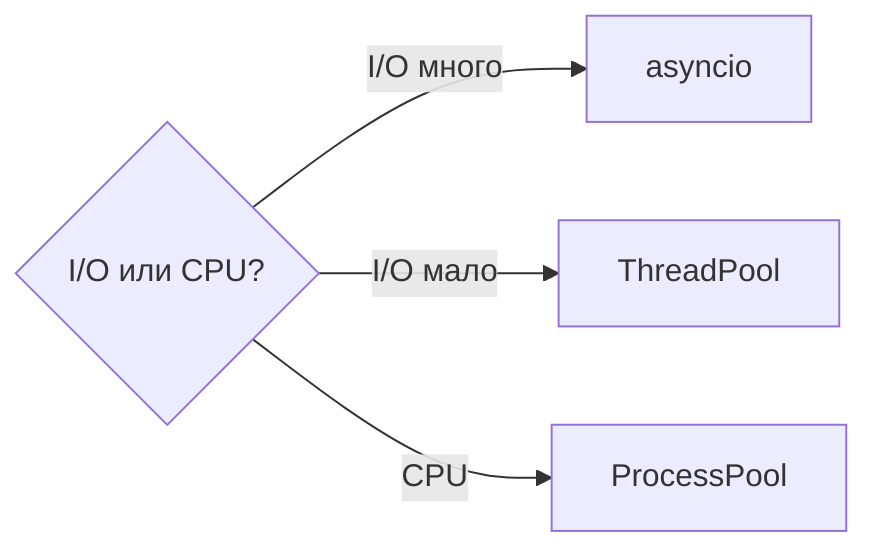

# 🐍 01. Python для DevOps: полный языковой курс + практика

> Уровень: Junior→Senior. Цель: не «знать синтаксис», а свободно писать production-утилиты: CLI, работа с API/логами/процессами, тесты. Язык целиком — с граблями и идиомами.

**Оглавление:** 1. Основы · 1.1 Семантика · 2. Функции и декораторы · 3. collections/itertools · 4. Исключения · 5. pathlib/subprocess · 6. Типизация · 7. dataclasses · 8. asyncio · 9. venv/pytest/линтеры · 10. Грабли · 11. Паттерны DevOps · 12. Производительность · Проверь себя · Практика

---

## 1. Основы языка: типы, строки, срезы

### 1.1 Модель выполнения: CPython, байткод и объекты

**Что:** CPython — байткод-виртуальная машина. Исходник компилируется в `.pyc` (байткод), исполняется стековой машиной. Всё — объекты в куче с refcount + GC для циклов.

**Почему важно:** понимание объясняет cost-модель (атрибут = dict-lookup, вызов функции дорог), GIL, почему `is` != `==`.

```python
import dis

def add(a, b):
    return a + b

print(dis.dis(add))
#  0 LOAD_FAST                0 (a)
#  2 LOAD_FAST                1 (b)
#  4 BINARY_OP                0 (+)
#  8 RETURN_VALUE

# Объект — PyObject с refcount:
import sys
x = [1, 2, 3]
print(sys.getrefcount(x))  # +1 от аргумента getrefcount
import gc; print(gc.get_referrers(x)[:1])
```

**Internals:** `LOAD_FAST` — доступ к массиву локальных переменных (O(1)). `LOAD_GLOBAL` — поиск в dict модуля (медленнее). Отсюда микрооптимизация: вынос `local = global_func` в цикл.

**Failure:** не ставить `PYTHONDONTWRITEBYTECODE=1` в контейнере с read-only FS — падение на старте. Лечится `ENV PYTHONDONTWRITEBYTECODE=1`.

### Изменяемое vs неизменяемое — ключевое различие

```python
# Неизменяемые: int, float, str, bool, tuple, frozenset, bytes
# Изменяемые:   list, dict, set, bytearray  (передаются по ссылке!)

a = [1, 2, 3]
b = a                    # b — ТА ЖЕ ссылка, не копия!
b.append(4)
print(a)                 # [1, 2, 3, 4] — изменилось и a

c = a.copy()             # поверхностная копия (shallow)
c.append(5)
print(a)                 # [1, 2, 3, 4] — a не тронуто

# Глубокая копия для вложенных структур:
import copy
nested = [[1], [2]]
shallow = copy.copy(nested)
deep = copy.deepcopy(nested)
nested[0].append(99)
print(shallow[0])  # [1, 99] — разделили вложенный список!
print(deep[0])     # [1] — независим
```

**Internals:** неизменяемые хешируемы → могут быть ключами `dict`/`set`. Кортеж хешируем только если все элементы хешируемы. `frozenset` — неизменяемый аналог `set`.

**Производительность:** `tuple` компактнее `list` (нет over-allocation). Для константных наборов — берите `tuple`.

### Truthiness: что считается ложью

```python
# Ложь: False, None, 0, 0.0, 0j, "", [], {}, set(), range(0), Decimal(0), Fraction(0,1)
# Всё остальное — истина, но осторожно с тонкостями:

bool([])        # False
bool([0])       # True — список непуст, хотя элемент 0 ложен!
bool("0")       # True — непустая строка
bool(0)         # False

# Идиома vs ловушка:
value = config.get("retries") or 3   # ❌ сломается если retries=0 (0 ложно!)
value = config.get("retries")
if value is None:
    value = 3                         # ✅ различаем отсутствие и 0
# или современный:
value = config["retries"] if "retries" in config else 3

# Явная проверка через is None — единственный безопасный способ отличить None от 0/"":
if timeout is None:
    timeout = 30
```

| Значение | `bool(x)` | `x is None` | `x == 0` |
|---|---|---|---|
| `0` | False | False | True |
| `""` | False | False | False |
| `[]` | False | False | False |
| `None` | False | True | False |
| `"0"` | True | False | False |

**Failure:** `if not value:` для валидации конфига пропускает `0` и `""` — частый баг деплой-скриптов где `replicas: 0` должен быть ошибкой, а не «дефолтом».

### f-строки: полный гид

```python
host, port, errors = "db01", 5432, 12
print(f"{host}:{port}")            # db01:5432
print(f"{errors:03d}")             # 012 (паддинг)
print(f"{0.9876:.1%}")             # 98.8%
print(f"{1234567:,}")              # 1,234,567
print(f"{host!r}")                 # 'db01' (repr)
print(f"{'left':<10}|{'right':>10}")  # выравнивание
print(f"{errors=}")                # errors=12 (debug-формат 3.8+)

# Формат-спецификаторы: [[fill]align][sign][z][#][0][width][grouping][.precision][type]
pi = 3.14159
print(f"{pi:06.2f}")   # 003.14
print(f"{255:#06x}")  # 0x00ff  (# — альтернативная форма)
print(f"{255:08b}")   # 00111111

# f-строка компилируется в BUILD_STRING / FORMAT_VALUE — быстрее % и .format
# Вложенные выражения работают:
print(f"{host.upper() if host else 'unknown'}")

# Безопасность: f-строка НЕ экранирует! Для shell/SQL — никогда f-строкой:
# ❌ f"SELECT * FROM hosts WHERE name='{user_input}'"  — SQL-инъекция
```

**Производительность:** `f""` быстрее `str.format()` в ~1.5-2×, быстрее `%` в ~1.2× — используйте f-строки всегда, кроме логирования (там lazy `%s`).

### Срезы — для строк, списков, кортежей

```python
line = "2026-08-24T10:15:00Z ERROR api refused"
line[:10]        # '2026-08-24'
line[-3:]        # 'sed'
line[11:16]      # '10:15'
line[::-1]       # реверс
line[999:1005]   # '' — срез безопасен за границами
# line[999]      # IndexError — индексация нет!
```

**Internals — объект slice:**

```python
# s[a:b:c] эквивалентно s[slice(a,b,c)]
s = [0, 1, 2, 3, 4, 5]
print(s[slice(1, 5, 2)])  # [1, 3]

# Срез создаёт КОПИЮ (для list/str) — O(k) памяти где k длина среза
# Для больших массивов используйте memoryview / itertools.islice чтобы не копировать:
import itertools
big = range(10_000_000)
first_10 = list(itertools.islice(big, 10))  # O(1) памяти, не копирует весь range

# Присваивание срезу — мощная идиома:
lst = [1, 2, 3, 4]
lst[1:3] = [20, 30, 40]  # [1, 20, 30, 40, 4] — меняет размер!
lst[1:3] = []            # удаление через срез
```

**Failure:** `line.split(":")[3]` на строке без `:` → `IndexError`. Срез `line.split(":")[3:4]` вернёт `[]` вместо исключения — иногда намеренно используют.

### Распаковка и walrus

```python
first, *middle, last = [1, 2, 3, 4, 5]   # 1, [2,3,4], 5
a, b = b, a                              # swap через кортеж (атомарно)
for k, v in {"a": 1}.items(): ...
nested = {"a": {"port": 5432}}
# Вложенная распаковка:
((host, port),) = [("db01", 5432)]

if (n := len(line)) > 10:                # walrus 3.8+
    print(f"длинная: {n}")

# * и ** в вызовах и литералах:
defaults = {"replicas": 3, "image": "nginx"}
overrides = {"replicas": 5}
merged = {**defaults, **overrides}  # {'replicas': 5, 'image': 'nginx'}

def api_call(*args, **kwargs):
    print(args, kwargs)
api_call(1, 2, host="db", port=5432)

# Расширенная распаковка в comprehensions:
pairs = [(1, 2), (3, 4)]
sums = [a + b for a, b in pairs]

# Walrus в цикле — чтение до sentinel:
while (line := input_stream.readline()):
    process(line)
```

### Comprehensions vs циклы vs генераторы

```python
# List comprehension — быстрее цикла for с append (байткод LIST_APPEND в C):
squares = [x*x for x in range(1000) if x % 2 == 0]

# Dict comprehension:
host_map = {h: h.upper() for h in ["db01", "api01"]}

# Set comprehension:
unique_ports = {80, 443, 80, 8080}  # {80, 443, 8080} — дубликаты ушли

# Генераторное выражение — ленивое, O(1) памяти:
gen = (x*x for x in range(10_000_000) if x % 2 == 0)
# gen — объект generator, не список! Итерируется один раз.

# Когда что брать:
# - нужен результат целиком и многократно — list comprehension
# - нужен поток/стриминг — генератор
# - нужен один проход + агрегация — генератор + sum()/any()/Counter

# ❌ Антипаттерн: list comprehension ради побочного эффекта
[print(x) for x in items]  # создаёт список None — мусор
for x in items: print(x)   # ✅

# Вложенные comprehensions читаются тяжело — разворачивайте в цикл если >1 if/for:
matrix = [[i*j for j in range(3)] for i in range(3)]
```

**Производительность:**

```python
import timeit
print(timeit.timeit("[x*x for x in range(1000)]", number=10000))
print(timeit.timeit("list(x*x for x in range(1000))", number=10000))
# listcomp ~ на 10-15% быстрее gen+list для малых размеров
# но для миллионов — только генератор спасёт память
```

---

## 2. Функции, декораторы, генераторы

### Аргументы и ЛОВУШКА mutable default

```python
def connect(host, port=5432, *args, timeout=5, **kwargs):
    # *args — лишние позиционные; после них — keyword-only
    ...

# ❌ КЛАССИЧЕСКАЯ ЛОВУШКА: default создаётся ОДИН РАЗ!
def add_host(host, hosts=[]):
    hosts.append(host)          # список живёт между вызовами!
add_host("a"); add_host("b")    # ['a', 'b'] — сюрприз

# ✅ Правильно:
def add_host(host, hosts=None):
    hosts = hosts if hosts is not None else []
    hosts.append(host)
    return hosts

# Ещё пример — dict default:
def with_cache(key, cache={}):  # ❌ тот же баг
    ...

# Сигнатуры с positional-only и keyword-only (3.8+):
def deploy(name, /, replicas=3, *, dry_run=False):
    # name — только позиционно, dry_run — только именованно
    ...
# deploy("api", dry_run=True)  # ✅
# deploy(name="api")            # ❌ TypeError (positional-only)
```

### LEGB и замыкания (closures)

```python
# LEGB: Local → Enclosing → Global → Builtins
x = "global"
def outer():
    x = "enclosing"
    def inner():
        x = "local"
        print(x)  # local
    inner()
    print(x)      # enclosing

# Замыкание — функция помнит окружение, где была создана:
def make_counter(start=0):
    count = start
    def inc(step=1):
        nonlocal count  # без nonlocal — UnboundLocalError (см. ниже)
        count += step
        return count
    return inc

c1 = make_counter(10)
print(c1())  # 11
print(c1())  # 12
print(c1.__closure__[0].cell_contents)  # 12 — интроспекция ячейки

# ❌ Позднее связывание в цикле — классическая ловушка:
funcs = [lambda: i for i in range(3)]
print([f() for f in funcs])  # [2, 2, 2] — все видят последний i!

# ✅ Захват через default-аргумент:
funcs = [lambda i=i: i for i in range(3)]
print([f() for f in funcs])  # [0, 1, 2]

# Или через functools.partial:
import functools
funcs = [functools.partial(lambda x: x, i) for i in range(3)]

# nonlocal vs global:
def outer2():
    val = 10
    def inner_modify():
        nonlocal val
        val = 20
    inner_modify()
    print(val)  # 20

# Без nonlocal Python считает val локальной и падает:
def broken():
    val = 10
    def inner():
        val += 1  # UnboundLocalError: val referenced before assignment
    inner()
```

**Internals:** замыкание хранится в `__closure__` — кортеж `cell` объектов. `LOAD_DEREF` вместо `LOAD_FAST`. `nonlocal` говорит компилятору использовать `STORE_DEREF`.

**Production:** замыкания — основа для декораторов, фабрик middleware, callback-ов в Kopf-операторах.

### Декораторы: от простых к параметризованным

```python
import functools
import time

def retry(times=3, delay=1):
    def decorator(func):
        @functools.wraps(func)               # сохранить имя/docstring
        def wrapper(*args, **kwargs):
            for attempt in range(1, times + 1):
                try:
                    return func(*args, **kwargs)
                except Exception as e:
                    if attempt == times:
                        raise
                    print(f"попытка {attempt}: {e}, retry {delay}с")
                    time.sleep(delay)
        return wrapper
    return decorator

@retry(times=5, delay=2)
def fetch(url): ...
```

**Глубже — декоратор с параметрами и без:**

```python
import functools

# Универсальный декоратор, работающий и как @dec и как @dec(arg):
def repeat(_func=None, *, times=2):
    def decorator(func):
        @functools.wraps(func)
        def wrapper(*a, **k):
            for _ in range(times):
                result = func(*a, **k)
            return result
        return wrapper
    if _func is not None:
        return decorator(_func)
    return decorator

@repeat
def greet(): print("hi")           # times=2

@repeat(times=3)
def greet2(): print("hi")          # times=3

# Декоратор-класс:
class CountCalls:
    def __init__(self, func):
        self.func = func
        self.calls = 0
        functools.update_wrapper(self, func)
    def __call__(self, *a, **k):
        self.calls += 1
        return self.func(*a, **k)

@CountCalls
def api(): ...
api(); api()
print(api.calls)  # 2

# Порядок декораторов — снизу вверх:
# @a
# @b
# def f(): ...  эквивалентно  f = a(b(f))
```

**Failure:** без `functools.wraps` ломается `help()`, `__name__`, pickling, сигнатуры в typer/click. `mypy` не видит обёрнутую функцию — используйте `ParamSpec` для типизированных декораторов (см. раздел 05).

### Генераторы: O(1) памяти на гигабайтных логах

```python
def read_errors(path):
    with open(path) as f:
        for line in f:                # файл НЕ грузится в память
            if "ERROR" in line:
                yield line.rstrip()

n = sum(1 for _ in read_errors("app.log"))   # посчитали, не держа в RAM
```

**Глубже — протокол генератора:**

```python
def countdown(n):
    while n > 0:
        received = yield n   # yield — точка приостановки, send() передаёт значение внутрь
        print(f"got {received}")
        n -= 1 if received is None else received

gen = countdown(5)
print(next(gen))      # 5 — запуск до первого yield
print(gen.send(2))    # got 2 → yield 3
print(next(gen))      # got None → 2
# gen.close() / gen.throw(ValueError)

# yield from — делегирование:
def chain(*iterables):
    for it in iterables:
        yield from it  # эквивалент for x in it: yield x, но с пробросом send/throw

# Генератор исчерпывается один раз:
g = (x for x in range(3))
print(list(g))  # [0, 1, 2]
print(list(g))  # [] — пуст, нужно пересоздать

# Генератор vs итератор vs iterable:
# iterable — есть __iter__ (list, str)
# iterator — есть __next__ + __iter__ (генератор)
# generator — специальный итератор с yield

# Бесконечный генератор — для стриминга:
def tail_follow(path):
    with open(path) as f:
        f.seek(0, 2)
        while True:
            line = f.readline()
            if line:
                yield line
            else:
                time.sleep(0.1)
```

**Internals:** генератор — объект с фреймом и указателем инструкции. При `yield` фрейм сохраняется в куче, при `next` — возобновляется. Поэтому генератор почти бесплатен по памяти, но держит ресурсы (открытый файл) до `close()`.

**Failure:** не закрытый генератор держит файл открытым. Используйте `with` внутри генератора или `contextlib.closing`.

### Контекстные менеджеры

```python
import contextlib

@contextlib.contextmanager
def temp_lock(path):
    f = open(path, "w")
    try:
        yield f
    finally:
        f.close()
        import os; os.remove(path)    # очистка ВСЕГДА, даже при исключении

with temp_lock("/tmp/lock") as f:
    f.write("locked")
```

**Протокол и продвинутые техники:**

```python
# Классовый протокол:
class Timer:
    def __enter__(self):
        import time
        self.start = time.monotonic()
        return self
    def __exit__(self, exc_type, exc_val, exc_tb):
        import time
        self.elapsed = time.monotonic() - self.start
        print(f"elapsed {self.elapsed:.3f}s")
        return False  # False — не глотать исключение; True — подавить

with Timer():
    time.sleep(0.01)

# contextlib.suppress — замена try/except pass:
with contextlib.suppress(FileNotFoundError):
    import os; os.remove("/tmp/stale")

# ExitStack — динамическое число контекстов:
with contextlib.ExitStack() as stack:
    files = [stack.enter_context(open(f)) for f in log_files]
    # все файлы закроются на выходе, даже если открытие одного упало

# async context manager:
import contextlib as cl
@cl.asynccontextmanager
async def get_conn(pool):
    conn = await pool.acquire()
    try:
        yield conn
    finally:
        await pool.release(conn)
```

**Failure:** `__exit__` вернул `True` — исключение проглочено молча. Редко нужно; если глотаете — логируйте.

### Дескрипторы и property — минимум для понимания

```python
# property — самый частый дескриптор (вычисляемый атрибут):
class Deployment:
    def __init__(self, replicas: int):
        self._replicas = replicas

    @property
    def replicas(self) -> int:
        return self._replicas

    @replicas.setter
    def replicas(self, value: int):
        if not 1 <= value <= 50:
            raise ValueError("replicas 1..50")
        self._replicas = value

    @replicas.deleter
    def replicas(self):
        del self._replicas

d = Deployment(3)
d.replicas = 10       # setter
print(d.replicas)     # getter

# Дескриптор — объект с __get__/__set__/__delete__ (как property работает под капотом):
class Clamped:
    def __init__(self, lo, hi):
        self.lo, self.hi = lo, hi
        self._values = {}
    def __get__(self, obj, objtype=None):
        return self._values.get(id(obj), 0)
    def __set__(self, obj, value):
        self._values[id(obj)] = max(self.lo, min(self.hi, value))

class Service:
    replicas = Clamped(1, 50)

svc = Service()
svc.replicas = 100
print(svc.replicas)  # 50
```

**Когда нужно:** `property` для валидации/ленивых вычислений, дескрипторы для переиспользуемых проверок (аналог Field в pydantic).

---

## 3. Структуры данных: collections и itertools

```python
from collections import Counter, defaultdict, deque

Counter(["1.1.1.1","2.2.2.2","1.1.1.1"]).most_common(1)
# [('1.1.1.1', 2)]  — топ IP из лога за 3 строки

errors = defaultdict(list)             # без if key in dict
errors[host].append(msg)

tail = deque(maxlen=100)               # хвост лога: сам выкидывает старое

# dict comprehensions
merged = {**defaults, **overrides}     # overrides перекрывает
clean = {k: v for k, v in merged.items() if v is not None}

# itertools.groupby требует предварительной сортировки по ключу!
from itertools import groupby
for host, grp in groupby(sorted(logs, key=key_fn), key=key_fn):
    print(host, sum(1 for _ in grp))
```

### Глубокое сравнение коллекций

| Структура | Мутабельна | Хешируема | Порядок | Сложность доступа | Use-case DevOps |
|---|---|---|---|---|---|
| `list` | да | нет | вставки | O(1) индекс, O(n) вставка в начало | список подов, строки лога |
| `tuple` | нет | если элементы хешируемы | вставки | O(1) | ключи dict, неизменяемые записи |
| `dict` (3.7+) | да | нет | вставки | O(1) средн. | конфиги, маппинг имя→объект |
| `set` | да | нет | нет | O(1) проверка | уникальные IP, дедуп |
| `frozenset` | нет | да | нет | O(1) | ключ dict из множества |
| `deque` | да | нет | вставки | O(1) с обоих концов | очередь задач, tail лога |
| `Counter` | да | нет | по вставке | O(1) инкремент | подсчёт кодов ответа |
| `defaultdict` | да | нет | вставки | O(1) | группировка без `if` |

```python
# list vs deque — вставка в начало:
from collections import deque
import timeit
# list.insert(0) — O(n) сдвиг всех элементов
# deque.appendleft — O(1)
print(timeit.timeit("d.appendleft(1)", setup="from collections import deque; d=deque()", number=100000))
print(timeit.timeit("l.insert(0, 1)", setup="l=[]", number=10000))

# bisect — бинарный поиск в отсортированном списке O(log n):
import bisect
ports = [80, 443, 8080, 9000]
bisect.insort(ports, 8443)   # вставка с сохранением порядка
print(ports)  # [80, 443, 8080, 8443, 9000]
idx = bisect.bisect_left(ports, 8080)  # индекс для вставки

# heapq — очередь с приоритетом O(log n) push/pop:
import heapq
heap = []
heapq.heappush(heap, (5, "low-priority task"))
heapq.heappush(heap, (1, "critical alert"))
print(heapq.heappop(heap))  # (1, "critical alert") — минимальный приоритет
# nsmallest / nlargest — эффективнее сортировки для малых n:
import heapq
latencies = [120, 5, 300, 42, 18]
print(heapq.nsmallest(2, latencies))  # [5, 18]
print(heapq.nlargest(2, latencies))   # [300, 120]

# Counter — больше чем подсчёт:
from collections import Counter
c = Counter("abracadabra")
print(c.most_common(2))     # [('a', 5), ('b', 2)]
c2 = Counter(a=3, b=2)
print(c + c2)               # сложение счётчиков
print(c - c2)               # вычитание (отсекает ≤0)
# Counter для логов — O(n) памяти по уникальным ключам, не по всем строкам

# dataclasses vs namedtuple vs tuple:
from dataclasses import dataclass
from typing import NamedTuple

class PointTuple(tuple):
    pass

class PointNT(NamedTuple):
    x: int
    y: int

@dataclass(frozen=True, slots=True)
class PointDC:
    x: int
    y: int

# tuple — минимальный overhead, но без имён полей
# NamedTuple — tuple + именованный доступ + типизация, иммутабелен
# dataclass(frozen, slots) — читаемый, валидация в __post_init__, но не tuple
```

**Internals dict:** с 3.7 — компактный массив + хэш-таблица (PEP 468). `dict` теперь ordered и занимает ~ на 20% меньше. `set` — тот же механизм без values.

### itertools и functools — батарея DevOps

```python
import itertools
import functools
import operator

# Бесконечные итераторы:
print(list(itertools.islice(itertools.count(10), 3)))  # [10, 11, 12]
print(list(itertools.islice(itertools.cycle(["green","blue"]), 4)))  # циклично
print(list(itertools.repeat("healthcheck", 3)))

# Комбинаторика:
print(list(itertools.product(["eu","us"], ["s3","minio"])))  # декартово
print(list(itertools.combinations(["a","b","c"], 2)))         # сочетания
print(list(itertools.permutations(["a","b","c"], 2)))         # перестановки

# Срезы и фильтрация без копирования:
data = range(100)
print(list(itertools.islice(data, 10, 20)))                  # как [10:20] но лениво
print(list(itertools.takewhile(lambda x: x < 5, [1,2,5,1]))) # [1,2]
print(list(itertools.dropwhile(lambda x: x < 5, [1,2,5,1,4]))) # [5,1,4]
print(list(itertools.filterfalse(lambda x: x % 2, range(5)))) # [0,2,4]

# Группировка и аккумуляция:
from itertools import groupby, accumulate
logs = [("api", 500), ("api", 200), ("web", 500)]
logs.sort(key=lambda x: x[0])
for svc, grp in groupby(logs, key=lambda x: x[0]):
    print(svc, list(grp))

print(list(accumulate([1,2,3,4])))                    # [1, 3, 6, 10]
print(list(accumulate([1,2,3,4], operator.mul)))      # [1, 2, 6, 24]

# functools — reduce, lru_cache, partial, cached_property:
print(functools.reduce(operator.add, [1,2,3]))        # 6  (избегайте reduce где есть sum/any)
from functools import lru_cache, cached_property

@lru_cache(maxsize=128)
def get_pod_spec(name: str):
    return fetch_from_api(name)  # кэш по аргументам, O(1) повторные вызовы

# partial — частичное применение:
import functools
curl = functools.partial(subprocess.run, capture_output=True, text=True)

# chain — сплющивание:
print(list(itertools.chain([1,2], [3,4])))            # [1, 2, 3, 4]
print(list(itertools.chain.from_iterable([[1,2],[3]])))  # то же
```

**Производительность:** `itertools` — C-реализация, быстрее Python-циклов в 2-10×. `lru_cache` превращает экспоненциальный рекурсивный обход в линейный.

**Failure:** `groupby` без сортировки — группы разрываются (каждый непрерывный блок отдельная группа). `islice` на исчерпанном итераторе даёт `[]` без ошибки — молчаливая потеря данных.

---

## 4. Исключения: EAFP вместо LBYL

```python
# ✅ EAFP — pythonic: «делай и лови»
try:
    value = config["key"]
except KeyError:
    value = default
# или value = config.get("key", default)

# Свои исключения + цепочка (raise from сохраняет причину!)
class DeployError(Exception): ...

def deploy(app):
    try:
        push_image(app)
    except ConnectionError as e:
        raise DeployError(f"push {app} failed") from e

# Ловим конкретное; finally — всегда
try:
    risky()
except (TimeoutError, ConnectionError):
    retry()
finally:
    cleanup()
```

⚠️ Никогда голый `except:` — поймает даже Ctrl+C (KeyboardInterrupt).

### Иерархия и современные фичи исключений

```python
# Иерархия: BaseException
#  ├─ SystemExit, KeyboardInterrupt, GeneratorExit (не ловить голым except Exception!)
#  └─ Exception
#      ├─ ValueError, TypeError, KeyError, ...
#      └─ ...

# Цепочка исключений — 3 формы:
try:
    open("missing")
except FileNotFoundError as e:
    raise RuntimeError("config broken") from e       # явная цепочка (cause)
    # raise RuntimeError("config broken") from None  # подавить контекст
    # raise RuntimeError("config broken")            # неявная цепочка (context)

# ExceptionGroup (3.11+) — несколько ошибок одновременно (asyncio.gather):
try:
    raise ExceptionGroup("deploy failed", [ValueError("bad image"), ConnectionError("timeout")])
except* ValueError as eg:   # except* — ловит подмножество группы!
    print(f"values: {eg.exceptions}")
except* ConnectionError as eg:
    print(f"connections: {eg.exceptions}")

# Добавить контекст к уже пойманному исключению (3.11+):
try:
    validate(cfg)
except ValueError as e:
    e.add_note(f"config file: {path}")   # заметка попадёт в traceback
    raise

# suppress vs try/except pass:
import contextlib
with contextlib.suppress(FileNotFoundError):
    Path("stale.lock").unlink()  # не упадёт если файла нет

# EAFP vs LBYL на примере DevOps:
# ❌ LBYL — гонка между проверкой и действием:
import os
if os.path.exists(path):         # файл мог удалиться между exists и open!
    data = open(path).read()

# ✅ EAFP — атомарно:
try:
    data = open(path).read()
except FileNotFoundError:
    data = default
```

| Подход | Плюсы | Минусы |
|---|---|---|
| **EAFP** | нет гонок, чище, быстрее в happy path | исключения для контроля потока — дороже если частые |
| **LBYL** | явно, без трай | гонка TOCTOU, дублирование проверок |

**Тестирование исключений:**

```python
import pytest

def test_raises():
    with pytest.raises(DeployError, match="push .* failed"):
        deploy("bad-app")

# Проверка цепочки:
def test_chain():
    try:
        deploy("bad")
    except DeployError as e:
        assert isinstance(e.__cause__, ConnectionError)

# Проверка что НЕ бросает:
def test_no_raise():
    deploy("good")  # упадёт сам если бросит
```

**Антипаттерны:**

```python
# ❌ Глотание исключений:
try:
    deploy()
except Exception:
    pass  # потеряли всё — ни логов, ни алертов

# ❌ Слишком широкий except:
try:
    int(value)
except Exception:  # поймает KeyboardInterrupt, SystemExit!
    ...

# ✅ Узкий + логирование:
try:
    int(value)
except (ValueError, TypeError) as e:
    log.warning("invalid value %r: %s", value, e)
    raise DeployError(f"bad value {value!r}") from e
```

---

## 5. Файлы, pathlib, subprocess

```python
from pathlib import Path
p = Path("/var/log/nginx") / "access.log"
p.exists(), p.suffix, p.stem, p.parent
p.read_text(); p.write_text("data")
for f in Path("/var/log").rglob("*.log"): print(f)   # рекурсивно
```

```python
import subprocess

def run(cmd: list[str]) -> str:
    r = subprocess.run(cmd, capture_output=True, text=True,
                       timeout=30, check=True)
    return r.stdout.strip()

run(["kubectl", "get", "pods", "-n", "prod", "-o", "name"])

# 💀 Инъекция: subprocess.run(f"kubectl delete pod {user}", shell=True)
# ✅ Безопасно: список аргументов — ввод остаётся ОДНИМ аргументом
subprocess.run(["kubectl", "delete", "pod", user_input])
```

### pathlib — глубоко

```python
from pathlib import Path, PurePosixPath

p = Path("/var/log/nginx/access.log")
print(p.parts)        # ('/', 'var', 'log', 'nginx', 'access.log')
print(p.parent)       # /var/log/nginx
print(p.parents[1])   # /var/log
print(p.name)         # access.log
print(p.stem)         # access
print(p.suffix)       # .log
print(p.suffixes)     # ['.log']  (для .tar.gz будет ['.tar', '.gz'])
print(p.with_suffix(".json"))  # /var/log/nginx/access.json
print(p.with_name("error.log"))

# Безопасное соединение vs склейка строк:
Path("/var/log") / "nginx" / "access.log"  # ✅ кроссплатформенно
# "/var/log/" + "nginx/access.log"          # ❌ сломается на Windows, двойные слэши

# Чтение/запись с кодировкой:
p.write_text("hello", encoding="utf-8")
print(p.read_text(encoding="utf-8"))
p.write_bytes(b"\x00\x01")  # бинарно

# Итерация:
for child in Path("/var/log").iterdir():
    if child.is_file() and child.suffix == ".log":
        print(child)
for log in Path("/var/log").rglob("*.log"):  # рекурсивно
    print(log)

# Атомика и безопасность:
p_tmp = Path("/etc/app/config.yaml.tmp")
p_final = Path("/etc/app/config.yaml")
p_tmp.write_text(rendered)
p_tmp.replace(p_final)  # атомарный rename (POSIX)

# Разрешения:
p.chmod(0o644)
print(oct(p.stat().st_mode)[-3:])

# PurePath — без доступа к FS (для конструирования путей в тестах):
pure = PurePosixPath("/a/b") / "c"
print(pure)  # /a/b/c  — не проверяет существование
```

**Failure:** `Path("a") / "/b"` → `/b` (абсолютный путь справа отбрасывает левую часть!). `Path.home() / ".config"` — правильно. `resolve()` следует симлинкам — может «уйти» из ожидаемой директории.

### subprocess — глубоко и безопасно

```python
import subprocess
import shlex

# Три уровня API:
# 1. run — синхронно, дождаться завершения (предпочитайте его)
result = subprocess.run(
    ["kubectl", "get", "pods", "-n", "prod"],
    capture_output=True, text=True, timeout=30, check=False
)
print(result.returncode, result.stdout, result.stderr)

# check=True — бросает CalledProcessError при returncode != 0
try:
    subprocess.run(["kubectl", "apply", "-f", "bad.yaml"], check=True, capture_output=True, text=True)
except subprocess.CalledProcessError as e:
    print(f"kubectl failed {e.returncode}: {e.stderr}")

# 2. Popen — стриминг/интерактив:
proc = subprocess.Popen(
    ["kubectl", "logs", "-f", "pod/api-xyz"],
    stdout=subprocess.PIPE, stderr=subprocess.PIPE, text=True, bufsize=1
)
for line in proc.stdout:
    if "ERROR" in line:
        print(line, end="")
proc.terminate()
proc.wait(timeout=5)

# 3. Безопасность — никогда shell=True с пользовательским вводом:
user = "mypod; rm -rf /"
# ❌ subprocess.run(f"kubectl delete pod {user}", shell=True)  — выполнит rm!
# ✅
subprocess.run(["kubectl", "delete", "pod", user])  # user — один аргумент, ; не интерпретируется
# Если нужен shell — экранируйте:
safe = shlex.quote(user)
subprocess.run(f"kubectl delete pod {safe}", shell=True)  # экранировано

# Таймауты — обязательны в проде (зависший kubectl повесит весь пайплайн):
try:
    subprocess.run(["kubectl", "get", "pods"], timeout=10, capture_output=True)
except subprocess.TimeoutExpired:
    print("kubectl завис — убиваем")

# Передача stdin:
result = subprocess.run(
    ["kubectl", "apply", "-f", "-"],
    input="apiVersion: v1\nkind: ConfigMap\n...", text=True, capture_output=True
)

# Переменные окружения — не мутируйте os.environ глобально:
env = {**subprocess.os.environ, "KUBECONFIG": "/tmp/kubeconfig"}
subprocess.run(["kubectl", "get", "pods"], env=env)
```

**Таблица сравнения:**

| Параметр | Рекомендация | Почему |
|---|---|---|
| `shell` | `False` (дефолт) | инъекции, экранирование, переносимость |
| `check` | `True` если ошибка = исключение | иначе забудете проверить `returncode` |
| `timeout` | всегда ставить | защита от зависания пайплайна |
| `text` | `True` для текста | иначе `bytes` и ручной `.decode()` |
| `capture_output` | `True` для парсинга | иначе вывод в терминал |

---

## 6. Типизация и pydantic

```python
def deploy(app: str, replicas: int = 3, dry: bool = False) -> list[str]: ...
def find(name: str | None = None) -> dict | None: ...   # 3.10+

# pydantic — валидация конфига РАНТАЙМОМ
from pydantic import BaseModel, Field

class AppConfig(BaseModel):
    name: str
    replicas: int = Field(ge=1, le=50)
    image: str

AppConfig.model_validate_json('{"name":"api","replicas":0,"image":"x"}')
# ValidationError: replicas must be >= 1 — до деплоя, а не после!
```

**Глубже — см. отдельный файл 05 для production-typing (Protocol, generics, overload, TypeGuard, mypy strict, ruff). Здесь — быстрый старт для DevOps-скриптов.**

```python
from typing import Literal

Env = Literal["dev", "stage", "prod"]
def promote(image: str, env: Env) -> None: ...
promote("api:1.2", "prod")   # ✅
# promote("api:1.2", "prodd") # mypy: error

# Pydantic с валидаторами:
from pydantic import BaseModel, Field, field_validator

class DeployConfig(BaseModel):
    image: str = Field(pattern=r"^[\w./-]+:[\w.-]+$")
    replicas: int = Field(ge=1, le=50, default=3)

    @field_validator("image")
    @classmethod
    def no_latest(cls, v: str) -> str:
        if v.endswith(":latest"):
            raise ValueError("latest запрещён — используйте semver")
        return v
```

---

## 7. ООП минимум: dataclasses

```python
from dataclasses import dataclass, field

@dataclass
class Server:
    name: str
    ip: str
    tags: dict[str, str] = field(default_factory=dict)  # против mutable trap
    role: str = "web"

    def is_prod(self) -> bool:
        return self.tags.get("env") == "prod"

# repr, __eq__ сгенерированы бесплатно
Server("web1", "10.0.0.1") == Server("web1", "10.0.0.1")   # True
```

### Dataclass — глубоко

```python
from dataclasses import dataclass, field, asdict, astuple, replace
from typing import ClassVar

@dataclass(frozen=True, slots=True, order=True)
class Pod:
    name: str
    namespace: str = "default"
    replicas: int = field(default=1, metadata={"ge": 1})
    _internal: str = field(default="", repr=False, compare=False)
    # ClassVar — не поле dataclass:
    KIND: ClassVar[str] = "Pod"

    def __post_init__(self):
        if not self.name:
            raise ValueError("name required")
        # для frozen — трюк через object.__setattr__:
        # object.__setattr__(self, "name", self.name.strip())

# frozen=True — иммутабельность (хешируемость если все поля хешируемы):
p = Pod("api", replicas=3)
# p.replicas = 5  # FrozenInstanceError

# slots=True (3.10+) — экономия памяти ~20-30% на тысячах объектов (нет __dict__):
import sys
print(sys.getsizeof(p))

# order=True — генерирует __lt__/__le__/__gt__/__ge__ по полям по порядку:
print(Pod("a") < Pod("b"))  # True (сравнение по name, затем namespace...)

# asdict / astuple / replace:
print(asdict(p))           # {'name': 'api', 'namespace': 'default', 'replicas': 3, '_internal': ''}
print(astuple(p))
p2 = replace(p, replicas=5)  # копия с заменой поля (для frozen)

# field deep:
@dataclass
class Deployment:
    name: str
    containers: list[str] = field(default_factory=list)
    labels: dict[str, str] = field(default_factory=dict, compare=False, repr=False)
    # default_factory — единственный способ для mutable!
    # compare=False — поле не участвует в == 
    # repr=False — скрыть в логах (секреты!)

# Наследование dataclass:
@dataclass
class CanaryDeployment(Deployment):
    canary_percent: int = 10

# Когда НЕ dataclass: нужна валидация на границах → pydantic BaseModel
# нужна ORM → sqlalchemy model
# нужен полный контроль __init__ → обычный класс
```

| Подход | Плюсы | Минусы |
|---|---|---|
| `tuple` | самый лёгкий | без имён, без дефолтов |
| `NamedTuple` | лёгкий + имена + типизация | иммутабелен, нет дефолтов-мутабелей |
| `dataclass` | гибкий, mutable/frozen, slots, пост-валидация | тяжелее tuple |
| `pydantic BaseModel` | валидация, сериализация, JSON Schema | зависимость, медленнее |
| `attrs` | предшественник dataclass, больше фич | внешняя зависимость |

---

## 8. asyncio: когда и зачем

```python
# I/O-bound + много соединений → async. CPU-bound → процессы!
import asyncio, aiohttp

async def check(session, url):
    try:
        async with session.get(url, timeout=5) as r:
            return url, r.status
    except Exception as e:
        return url, str(e)

async def main(urls):
    async with aiohttp.ClientSession() as s:
        for url, status in await asyncio.gather(*(check(s, u) for u in urls)):
            print(status, url)

asyncio.run(main(["http://a.local", "http://b.local"]))
# Последовательно 10с → параллельно 5с
```

⚠️ `requests`/`time.sleep` внутри async блокируют весь event loop — только aiohttp/asyncio.sleep.

**Короткая карта выбора (детально — файл 04):**



---

## 9. Инструменты: venv, pytest, линтеры

```bash
python -m venv .venv && source .venv/bin/activate
pip install -r requirements.txt && pip freeze > requirements.lock

pytest -v -k deploy --maxfail=1
ruff check . && ruff format --check .      # линтер+форматтер
mypy src/                                   # статическая типизация
```

```python
# test_deploy.py
import pytest
from src.deploy import parse_replicas

@pytest.fixture
def cfg():
    return {"api": {"replicas": 3}}

@pytest.mark.parametrize("raw,expected", [("5", 5), ("3", 3)])
def test_parse(raw, expected):
    assert parse_replicas(raw) == expected

def test_invalid():
    with pytest.raises(ValueError):
        parse_replicas("abc")
```

**Современный стек (детально — файлы 02/03/05):**

| Задача | Классика | Современно |
|---|---|---|
| Окружения | `venv + pip` | `uv` (10-100× быстрее) |
| Зависимости | `requirements.txt` | `pyproject.toml + uv.lock` |
| Линтинг | `flake8 + isort + black` | `ruff check + ruff format` |
| Типы | `mypy` | `mypy --strict` / `pyright` |
| Тесты | `unittest` | `pytest + respx/moto/testcontainers` |

---

## 10. Грабли языка

| Грабля | Пример | Правильно | Как ловить |
| :--- | :--- | :--- | :--- |
| Mutable default | `def f(x=[])` | `def f(x=None): x = x or []` | `ruff B006` |
| `is` vs `==` | `a is 25` — интернирование солжёт | `is` только для None/True/False | `ruff E711` |
| Изменение списка в цикле | `for x in lst: lst.remove(x)` | итерировать по копии `lst[:]` | ревью |
| Позднее связывание lambda | `[lambda: i for i in range(3)]` → все вернут 2 | `lambda i=i: i` | тесты |
| GIL | threads не ускоряют CPU-код | multiprocessing / async для I/O | `py-spy` |
| Import при запуске файла | `ModuleNotFoundError` | `python -m pkg.tool` | CI |
| Truthiness 0 | `or 3` съело 0 | `is None` проверка | `mypy` + тесты |
| Забытый await | корутина не запущена | `await` + `ruff ASYNC` | `-W error::RuntimeWarning` |
| shell=True | инъекция | список аргументов | `ruff S602` |
| Срез vs индекс | `s[999]` падает | `s[999:1000]` безопасно | тесты на границах |

---

## 11. Готовые паттерны DevOps

### Парсер логов (генератор + Counter)

```python
#!/usr/bin/env python3
"""Топ-5 IP с 5xx за последний час."""
import re, sys
from collections import Counter
from datetime import datetime, timedelta, timezone

PAT = re.compile(r'(?P<ip>\S+) .* \[(?P<ts>[^\]]+)\] "(?:\S+ \S+ )?(?P<code>\d{3})')

def errors_last_hour(path):
    cutoff = datetime.now(timezone.utc) - timedelta(hours=1)
    with open(path) as f:
        for line in f:
            if (m := PAT.search(line)) and m["code"].startswith("5"):
                ts = datetime.strptime(m["ts"].split()[0],
                     "%d/%b/%Y:%H:%M:%S").replace(tzinfo=timezone.utc)
                if ts >= cutoff:
                    yield m["ip"]

if __name__ == "__main__":
    for ip, n in Counter(errors_last_hour(sys.argv[1])).most_common(5):
        print(f"{n:6d}  {ip}")
```

### CLI на typer с dry-run по умолчанию

```python
import typer
app = typer.Typer()

@app.command()
def cleanup(namespace: str, days: int = 7, dry_run: bool = True):
    """Удалить завершённые поды старше N дней."""
    for pod in find_finished(namespace, days):
        print(f"DRY-RUN: удалил бы {pod}" if dry_run else delete_pod(pod))

if __name__ == "__main__":
    app()
```

### Паттерн: идемпотентный деплой с валидацией

```python
from pathlib import Path
from pydantic import BaseModel, Field
import subprocess, yaml

class DeploySpec(BaseModel):
    name: str
    image: str
    replicas: int = Field(ge=1, le=50)
    namespace: str = "default"

def apply(spec_path: Path, dry_run: bool = True) -> None:
    raw = yaml.safe_load(spec_path.read_text())
    spec = DeploySpec.model_validate(raw)  # валидация ДО любых действий
    cmd = ["kubectl", "apply", "-f", str(spec_path)]
    if dry_run:
        cmd.insert(2, "--dry-run=client")
    result = subprocess.run(cmd, capture_output=True, text=True, timeout=30)
    if result.returncode != 0:
        raise RuntimeError(f"kubectl failed: {result.stderr}")
    print(result.stdout)
```

---

## 12. Производительность и профилирование: микроуровень

```python
# Когда оптимизировать: после замера! Профилируйте, не гадайте.
import timeit, cProfile, tracemalloc

# timeit — микро-бенчмарк:
print(timeit.timeit("' '.join(str(x) for x in range(100))", number=10000))
print(timeit.timeit("''.join(map(str, range(100)))", number=10000))

# cProfile — где время в реальном коде:
# python -m cProfile -s cumulative app.py
# или в коде:
import cProfile
cProfile.run("sum(x*x for x in range(100000))", sort="cumulative")

# tracemalloc — где память:
tracemalloc.start()
data = [str(x) for x in range(100000)]
current, peak = tracemalloc.get_traced_memory()
print(f"current {current/1024:.1f} KiB peak {peak/1024:.1f} KiB")
tracemalloc.stop()

# line_profiler / py-spy для продовых процессов — см. файл 10
```

**Чеклист производительности DevOps-утилит:**

| Проблема | Симптом | Решение |
|---|---|---|
| Куча мелких `subprocess.run` | 10с на 100 подов | батчи, `kubectl get --chunk-size`, параллелизм |
| `list` из 10M строк лога | OOM Killer | генераторы, `mmap`, `islice` |
| `requests` в цикле | медленно, нет keep-alive | `httpx.Client` / `aiohttp` с пулом соединений |
| Нет кэша | повторные API-вызовы | `lru_cache`, `cachetools.TTLCache` |
| JSON без streaming | память на больших ответах | `ijson` / `orjson` |

---

## 2.5 Проверь себя — 10 вопросов

**В1. Что вернут вызовы `f(1)`, `f(2)` для `def f(x, acc=[]): acc.append(x); return acc` и почему?**

<details><summary>Ответ</summary>
[1], затем [1, 2]: mutable default вычисляется ОДИН раз при def и живёт между вызовами. Правильно: acc=None + создание внутри. Ловится ruff B006.
</details>

**В2. Найдите ошибку: `subprocess.run(f"kubectl delete pod {user}", shell=True)` при user из веб-формы.**

<details><summary>Ответ</summary>
shell=True + интерполяция = инъекция: "x; rm -rf /" выполнится. Правильно: список аргументов без shell — ввод останется одним аргументом. Или shlex.quote если shell нужен.
</details>

**В3. Чем генератор лучше списка при обработке лога на 10GB?**

<details><summary>Ответ</summary>
Генератор ленив: O(1) памяти (одна строка за раз); список загрузит весь файл в RAM и уронит процесс. Для стриминга — только генераторы. Генератор держит фрейм в куче, но не данные.
</details>

**В4. Сценарий: внутри async-функции вызвали requests.get(). Что произойдёт с другими корутинами?**

<details><summary>Ответ</summary>
Синхронный вызов блокирует event loop: ВСЕ корутины встают на время запроса. Нужны aiohttp/httpx.AsyncClient или asyncio.to_thread. Диагностика: -X dev покажет медленный колбэк.
</details>

**В5. Зачем `functools.wraps` в декораторе и что сломается без него?**

<details><summary>Ответ</summary>
wraps копирует __name__/__doc__/__module__/__wrapped__ оригинала. Без него декорированная функция «называется» wrapper — ломаются логи, дебаггер, автодокументация, typer/click интроспекция и pickle.
</details>

**В6. Почему `[lambda: i for i in range(3)][0]()` возвращает 2, а не 0, и как исправить не меняя логику цикла?**

<details><summary>Ответ</summary>
Замыкание захватывает ПЕРЕМЕННУЮ i по ссылке, а не значение на момент создания lambda. К моменту вызова цикл уже закончился и i==2. Фикс: `lambda i=i: i` — default-аргумент копирует текущее значение i в новую локальную переменную каждой lambda.
</details>

**В7. Чем `if not value:` опасен для валидации `replicas` из конфига, если допустим 0?**

<details><summary>Ответ</summary>
`not 0` → True, поэтому `value or 3` или `if not value:` трактует легитимный 0 как «отсутствует» и подменяет дефолтом. Правильно: `if value is None:` или `if "replicas" in config:`. Truthiness-ловушка — частый баг деплоев.
</details>

**В8. Что выведет `Counter(a=3) - Counter(a=2, b=5)` и почему `b` исчез?**

<details><summary>Ответ</summary>
`Counter({'a': 1})` — вычитание Counter отсекает неположительные счётчики (b: 0-5 = -5 → удалён). Для сохранения отрицательных используйте `c1.subtract(c2)` — там остаются отрицательные значения. Важно при diff логов.
</details>

**В9. В чём разница `__enter__/__exit__` vs `@contextmanager` и когда выбирать класс?**

<details><summary>Ответ</summary>
`@contextmanager` проще для одного yield, но не поддерживает повторный вход и сложнее для ресурсов с двумя фазами (acquire/release с параметрами). Класс с `__enter__/__exit__` нужен когда: нужен `__exit__` с подавлением исключения (return True), ресурс должен быть переиспользуемым, или нужен асинхронный `__aenter__/__aexit__`.
</details>

**В10. Почему `from pkg import func` + `patch("pkg.func")` может не сработать, и куда патчить?**

<details><summary>Ответ</summary>
`from pkg import func` копирует ссылку в namespace импортёра. Патч `pkg.func` меняет оригинал, но импортёр уже держит старую ссылку. Патчить НАДО там где имя ИЩЕТСЯ: `patch("importer.func")` — золотое правило моков. Проверяется через `importer.func is pkg.func` после патча.
</details>

---

## 2.6 Практика — 5 заданий (с лабораториями и failure injection)

### Задание 1: Парсер логов с тестами

**Условие:** скрипт `top_ips.py` (из раздела 11) + pytest-тесты.

**Шаг 1** — стартовое состояние: файл `top_ips.py` с функцией `errors_last_hour(path)`; тестовый лог `test.log` с 3 строками (2 ошибки, 1 ок).

**Шаг 2** — тест с фикстурой:
```python
# test_top_ips.py
from top_ips import errors_last_hour

def test_counts(tmp_path):                     # встроенная фикстура tmp_path!
    log = tmp_path / "app.log"
    log.write_text('1.1.1.1 - - [24/Aug/2026:10:00:00 +0000] "GET / 500"\n'
                   '1.1.1.1 - - [24/Aug/2026:10:01:00 +0000] "GET / 500"\n'
                   '2.2.2.2 - - [24/Aug/2026:10:02:00 +0000] "GET / 200"\n')
    assert list(errors_last_hour(str(log))) == ["1.1.1.1", "1.1.1.1"]
```

**Шаг 3** — `pytest -v` → 1 passed. Проверка в CLI: `python top_ips.py test.log`.

**Проверь себя:** `pytest` зелёный; `tmp_path` создал временный каталог — в репо нет мусора.

**Разбор:** фикстура tmp_path изолирует тест от файловой системы. Дата в тесте фиксирована (2026-08-24) — если парсер фильтрует «последний час», тест «протухнет»; для честного теста прокиньте cutoff параметром.

**Failure injection:** добавьте в лог строку `broken line without IP` — убедитесь что `PAT.search` возвращает `None` и парсер не падает. Покройте тестом.

### Задание 2: Декоратор retry с exponential backoff

**Условие:** `@retry(times=4)` — задержки 1с, 2с, 4с (удвоение).

**Шаг 1** — реализация:
```python
def retry(times=3):
    def deco(fn):
        @functools.wraps(fn)
        def w(*a, **k):
            delay = 1
            for attempt in range(1, times + 1):
                try:
                    return fn(*a, **k)
                except Exception as e:
                    if attempt == times:
                        raise
                    print(f"retry {attempt} через {delay}с: {e}")
                    time.sleep(delay)
                    delay *= 2
        return w
    return deco
```

**Шаг 2** — тест с мок-счётчиком:
```python
calls = {"n": 0}
@retry(times=3)
def flaky():
    calls["n"] += 1
    if calls["n"] < 3: raise ConnectionError
    return "ok"
assert flaky() == "ok" and calls["n"] == 3
```

**Проверь себя:** третий вызов успешен; задержки в выводе: 1с, 2с (exponential).

**Разбор:** exponential backoff — стандарт против шторма ретраев. В проде добавьте jitter (random) — чтобы все клиенты не стучали одновременно.

**Лаборатория jitter:**
```python
import random
delay = min(delay * 2 + random.uniform(0, 1), 30)  # capped exponential + jitter
```

### Задание 3: pydantic-валидация конфига деплоя

**Условие:** конфиг из YAML валидируется схемой до деплоя; невалидный — падает с понятной ошибкой.

**Шаг 1** — схема:
```python
from pydantic import BaseModel, Field
class Deploy(BaseModel):
    name: str
    image: str
    replicas: int = Field(ge=1, le=50)
    namespace: str = "default"
```

**Шаг 2** — валидация:
```python
import yaml
cfg = Deploy.model_validate(yaml.safe_load(open("deploy.yaml")))
print(cfg.replicas)   # типизированный доступ, IDE подсказывает
```

**Шаг 3** — сломайте replicas: 0 → ValidationError с указанием поля.

**Проверь себя:** валидный конфиг → объект с типами; replicas=0 → `ValidationError: replicas must be >= 1`.

**Разбор:** pydantic заменяет десятки ручных `if not isinstance` — схема = документация + валидация + автогенерация JSON Schema (`Deploy.model_json_schema()`).

### Задание 4: Лаборатория — поймай утечку генератора и truthiness-баг

**Условие:** найдите 2 бага в скрипте.

```python
# buggy.py — найдите баги до запуска!
def get_replicas(config):
    return config.get("replicas") or 3  # баг 1?

def stream_logs(path):
    f = open(path)          # баг 2?
    for line in f:
        if "ERROR" in line:
            yield line

# Тест-инъекция:
assert get_replicas({"replicas": 0}) == 0  # упадёт — or съел 0
gen = stream_logs("/tmp/app.log")
next(gen)  # если файл не закрыть — ResourceWarning
```

**Шаги:**
1. Исправьте `get_replicas` через `is None`.
2. Перепишите `stream_logs` с `with open(...) as f:` внутри генератора + `contextlib.closing` или `yield from`.
3. Запустите `python -W error::ResourceWarning buggy.py` — убедитесь что warning пропал.
4. Добавьте `pytest` с `tmp_path` который проверяет оба фикса.

**Эталон:**
```python
def get_replicas(config):
    v = config.get("replicas")
    return 3 if v is None else v

def stream_logs(path):
    with open(path) as f:
        for line in f:
            if "ERROR" in line:
                yield line.rstrip()
```

### Задание 5: Лаборатория — LEGB и дескриптор Clamp

**Условие:** реализуйте дескриптор, который не даёт `replicas` выйти за 1..50, и объясните почему без `__set_name__` сломается.

```python
class Clamped:
    def __set_name__(self, owner, name):
        self.name = "_" + name
    def __get__(self, obj, objtype=None):
        if obj is None:
            return self
        return getattr(obj, self.name, 1)
    def __set__(self, obj, value):
        setattr(obj, self.name, max(1, min(50, int(value))))

class Deploy:
    replicas = Clamped()
    def __init__(self, replicas=3):
        self.replicas = replicas

# Проверки:
d = Deploy(100)
assert d.replicas == 50
d.replicas = 0
assert d.replicas == 1
# Проверка LEGB — почему это не работает:
x = 10
def foo():
    print(x)  # UnboundLocalError если ниже есть x = 5
    x = 5
# Объясните роль LEGB и почему компилятор пометил x как local
```

**Проверь себя:** `Deploy(100).replicas == 50`; `foo` падает — компилятор видит `x =` в теле и делает `x` local на всю функцию (LOAD_FAST), поэтому первая `print` читает неинициализированную локальную.

---

*Следующая страница: [02. Go для DevOps](02-go-for-devops.md)*

---

## 🧭 Что дальше

| Шаг | Материал |
| :--- | :--- |
| 💪 Практика | Задачи по Python |
| 🎤 Проверить себя | Карточки Python в тренажёре |
