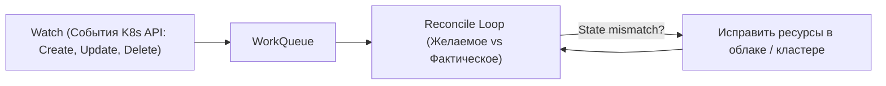

# 🐹 02. Go для DevOps: CLI-инструменты, Горутины и K8s Controllers

## 🚀 Почему Go — главный язык Cloud Native?

Почти весь современный стек DevOps написан на **Go (Golang)**: Docker, Kubernetes, Terraform, Prometheus, Helm, ArgoCD, Grafana, Istio, Nomad.

### Преимущества Go:
1. **Статическая компиляция:** На выходе получается один бинарник без внешних зависимостей (`libc`, Python runtime), который можно положить в `scratch` / `distroless` контейнер.
2. **Низкое потребление RAM и CPU:** Микросервис на Go стартует за миллисекунды и потребляет 10-20 МБ памяти.
3. **Легковесная конкурентность (Goroutines):** Обработка тысяч параллельных сетевых запросов и проверок состояния нод без блокировок.

---

## ⚡ Параллельный Health-Checker на Goroutines и Channels

Пример высокопроизводительной утилиты для одновременного пинга сотен сервисов с контролем таймаутов:

```go
package main

import (
	"context"
	"fmt"
	"net/http"
	"sync"
	"time"
)

type CheckResult struct {
	URL        string
	StatusCode int
	Duration   time.Duration
	Err        error
}

func checkURL(ctx context.Context, url string, client *http.Client, results chan<- CheckResult, wg *sync.WaitGroup) {
	defer wg.Done()

	start := time.Now()
	req, err := http.NewRequestWithContext(ctx, http.MethodGet, url, nil)
	if err != nil {
		results <- CheckResult{URL: url, Err: err}
		return
	}

	resp, err := client.Do(req)
	duration := time.Since(start)

	if err != nil {
		results <- CheckResult{URL: url, Duration: duration, Err: err}
		return
	}
	defer resp.Body.Close()

	results <- CheckResult{URL: url, StatusCode: resp.StatusCode, Duration: duration}
}

func main() {
	endpoints := []string{
		"https://google.com",
		"https://github.com",
		"https://kubernetes.io",
		"https://httpbin.org/delay/1",
	}

	// Ограничиваем общее время всех проверок 3 секундами
	ctx, cancel := context.WithTimeout(context.Background(), 3*time.Second)
	defer cancel()

	client := &http.Client{Timeout: 2 * time.Second}
	results := make(chan CheckResult, len(endpoints))
	var wg sync.WaitGroup

	for _, url := range endpoints {
		wg.Add(1)
		go checkURL(ctx, url, client, results, &wg)
	}

	// Ждем завершения всех горутин в отдельном потоке
	go func() {
		wg.Wait()
		close(results)
	}()

	// Читаем результаты по мере поступления
	for res := range results {
		if res.Err != nil {
			fmt.Printf("❌ [FAIL] %s - Error: %v\n", res.URL, res.Err)
		} else {
			fmt.Printf("✅ [OK]   %s - Status: %d (%v)\n", res.URL, res.StatusCode, res.Duration)
		}
	}
}
```

---

## 🛠️ Создание профессиональных CLI с помощью `spf13/cobra`

Фреймворк **Cobra** используется в `kubectl`, `hugo` и `gh CLI`.

```go
package main

import (
	"fmt"
	"os"

	"github.com/spf13/cobra"
)

var rootCmd = &cobra.Command{
	Use:   "devopsctl",
	Short: "devopsctl — утилита для автоматизации инфраструктуры",
}

var clusterCmd = &cobra.Command{
	Use:   "drain-node [node_name]",
	Short: "Безопасно выводит ноду из эксплуатации",
	Args:  cobra.ExactArgs(1),
	Run: func(cmd *cobra.Command, args []string) {
		nodeName := args[0]
		force, _ := cmd.Flags().GetBool("force")
		fmt.Printf("Вывод ноды %s (force=%v)...\n", nodeName, force)
	},
}

func init() {
	clusterCmd.Flags().BoolP("force", "f", false, "Принудительный вывод без ожидания")
	rootCmd.AddCommand(clusterCmd)
}

func main() {
	if err := rootCmd.Execute(); err != nil {
		fmt.Println(err)
		os.Exit(1)
	}
}
```

---

## ☸️ Архитектура Kubernetes Operators / Controllers

Custom Controller реализует бесконечный цикл сверки (Reconciliation Loop):



---

## 🔬 Deep Dive: controller-runtime и производительность Go-инструментов

### Горутины с ограничением конкурентности

```go
sem := make(chan struct{}, 16)          // максимум 16 параллельных запросов
var wg sync.WaitGroup
for _, host := range hosts {
    wg.Add(1)
    go func(h string) {
        defer wg.Done()
        sem <- struct{}{}               // acquire
        defer func() { <-sem }()        // release
        checkHost(ctx, h)
    }(host)
}
wg.Wait()
// В современном Go: errgroup с SetLimit(16) — то же самое + агрегация ошибок
```

### pprof: найти утечку за 3 команды

```go
import _ "net/http/pprof"
go http.ListenAndServe("localhost:6060", nil)   // только на debug-интерфейсе!
```

```bash
go tool pprof -http=:8080 http://localhost:6060/debug/pprof/heap
curl localhost:6060/debug/pprof/goroutine?debug=1 | head -50
```

### Cobra CLI: флаги, которые ждут ревьюеры

```go
rootCmd := &cobra.Command{
    Use:   "kube-cleaner",
    SilenceUsage: true,                       // usage только по ошибке флагов
    RunE: func(cmd *cobra.Command, args []string) error {
        dryRun, _ := cmd.Flags().GetBool("dry-run")
        return run(dryRun)
    },
}
rootCmd.Flags().Bool("dry-run", true, "show what would be deleted")   // safe by default
```

!!! tip «Go для K8s операторов»
    kubebuilder генерирует каркас: `make init && make create api GroupVersion=infra/v1 Kind=Database`. Дальше пишете только Reconcile — RBAC маркеры, webhooks и манифесты генерируются автоматически.

---

<!-- enriched:v1 -->

## 🧨 Типовые грабли Production

| Симптом | Причина | Быстрое решение |
| :--- | :--- | :--- |
| Пайплайн зеленый, прод сломан | Разница окружений / secrets не из Vault | Проверять конфиги через `conftest` + smoke-тесты после деплоя |
| `terraform apply` висит на lock | Умерший CI оставил lock | `force-unlock` после проверки активности |
| Ansible «работает» но ничего не меняет | `changed_when` не настроен | Явные `changed_when`/`failed_when` для команд |
| GitOps откатывает ручной фикс | Drift между Git и кластером | Править только в Git; `selfHeal` оставить включенным |

!!! warning «Идемпотентность — закон»
    Любой скрипт/плейбук/модуль должен быть безопасно перезапускаемым. Если второй прогон меняет состояние — это баг, который однажды уронит прод.

## 🧪 Hands-on Lab

```bash
go vet ./... && golangci-lint run 2>/dev/null || go vet ./...; \
go test -race -coverprofile=cover.out ./... && go tool cover -func=cover.out | tail -1
```

## ✅ Чек-лист зрелости темы

- [ ] Все изменения проходят через PR с обязательным review
- [ ] Секреты никогда не хранятся в коде/стейте (Vault/SOPS/secret manager)
- [ ] Есть dry-run/plan этап и он виден в MR
- [ ] Откат воспроизводим одной командой (< 10 минут)
- [ ] Логи пайплайна содержат версии артефактов (image digest, commit SHA)
