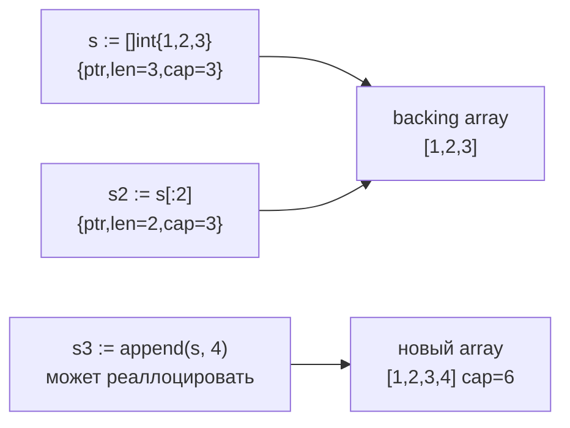
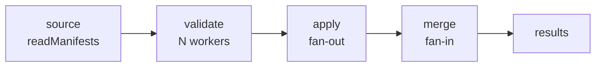
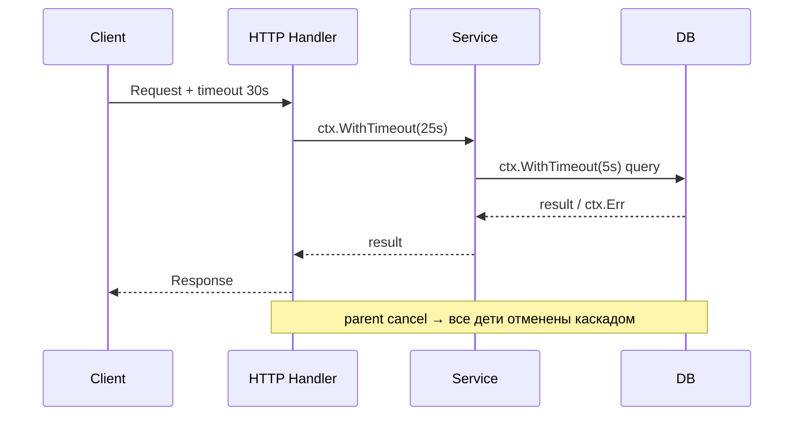
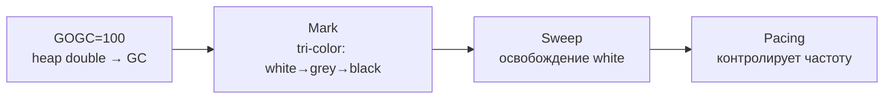
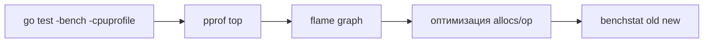

# 🐹 02. Go для DevOps: полный языковой курс + практика

> Уровень: Junior→Senior. Go — язык всего cloud-native стека (Docker, K8s, Prometheus, Terraform, Helm, etcd). Цель: читать чужой код уверенно, писать CLI-утилиты, операторы и высоконагруженные сервисы без сюрпризов рантайма.

**Оглавление:** 1. Основы · 1.1 Slices/Maps · 1.2 Structs/Methods · 2. Структуры и интерфейсы · 3. Ошибки · 4. Generics · 5. Горутины и каналы · 6. Context · 7. sync и race · 8. Память и GC · 9. Тесты · 10. Модули и CLI · 11. Сеть и ОС · 12. Наблюдаемость · 13. Безопасность · 14. pprof · 15. Грабли · 16. Production checklist · 17. Проверь себя · 18. Практика

---

## 1. Основы: пакеты, переменные, нулевые значения

```go
package main

import (
	"fmt"
	"os"
)

var global = "константа верхнего уровня" // видим в пакете

func main() {
	name := "api"              // короткое объявление (только внутри функций)
	var port int = 8080        // явное
	var timeout float64        // нулевое значение: 0 (не nil!)
	var enabled bool           // false
	var host string            // "" (пустая строка)
	fmt.Println(name, port, timeout, enabled, host == "")

	// Нулевые значения — Go НИКОГДА не даёт «мусор»: int=0, string="", slice=nil, map=nil
	if len(os.Args) > 1 {
		fmt.Println("arg:", os.Args[1])
	}
}
```

**Ключевое отличие от Python:** статическая типизация + компиляция. Ошибки типов ловятся ДО запуска; бинарник — один файл без зависимостей.

```bash
CGO_ENABLED=0 GOOS=linux go build -o server ./src   # статический бинарник для контейнера
go vet ./...                                        # статический анализ — обязательно
```

### Константы, iota, пакеты

```go
package config

const (
	EnvProd    = "prod"
	EnvStage   = "stage"
	EnvDev     = "dev"
	RoleAPIMask = 1 << iota // iota = 0,1,2... — автоинкремент для флагов
	RoleWorker
	RoleScheduler
)

func DefaultPort() int { return 8080 }
```

Правила пакетов:

| Правило | Пример | Комментарий |
| :--- | :--- | :--- |
| Имя пакета = имя директории | `package httputil` | импорт `.../httputil` |
| Экспорт = заглавная буква | `func Parse()` vs `func parse()` | только `Parse` виден извне |
| `internal/` | `internal/auth` | не импортируется извне модуля |
| `init()` | `func init() { flag.StringVar(...) }` | вызывается при импорте, без гарантий порядка между пакетами |

```go
// go.mod объявляет модуль и версию Go
// module github.com/org/dtk
// go 1.22
// require github.com/spf13/cobra v1.8.1
```

---

## 1.1 Слайсы и карты: устройство памяти

Слайс — не массив, а дескриптор `{ptr, len, cap}` (24 байта на 64-bit). Карта — указатель на `hmap`.



```go
package main

import "fmt"

func demoSlice() {
	a := []int{1, 2, 3}
	b := a[:2]               // делит backing array!
	b[0] = 99
	fmt.Println(a[0])        // 99 — сюрприз!

	// Безопасная копия:
	c := make([]int, len(a))
	copy(c, a)
	c[0] = 1

	// Полный срез ограничивает cap и разрывает aliasing:
	d := a[:2:2]             // len=2 cap=2, append аллоцирует новый массив
	d = append(d, 42)
	fmt.Println(a, d)

	// Pre-allocation — ключ к производительности:
	out := make([]string, 0, len(a)) // cap = len(a), 0 аллокаций при append
	for _, v := range a {
		out = append(out, fmt.Sprint(v))
	}
	_ = out
}

func demoMap() {
	var m map[string]int // nil-карта: чтение ok, запись паника!
	// m["x"] = 1 // panic: assignment to entry in nil map
	m = make(map[string]int)
	m["x"] = 1

	// Проверка наличия:
	if v, ok := m["y"]; ok {
		fmt.Println(v)
	}

	// Карта не потокобезопасна — см. раздел 7
}
```

**Failure modes:**

| Ошибка | Симптом | Лечение |
| :--- | :--- | :--- |
| `append` инвалидирует указатели | старый слайс видит мусор после реаллокации | не хранить указатели на элементы слайса без копирования |
| nil map запись | `panic` | `make` перед записью, или `var m = map[K]V{}` |
| Слайс алиасинг в API | вызывающий видит мутацию | документировать или `copy`/`append(nil, s...)` |
| Строки — неизменяемы | `s[0] = 'x'` не компилируется | `[]byte(s)` / `[]rune(s)` с копией |

---

## 1.2 Структуры, методы, указатели, встраивание

```go
type Server struct { // поля с заглавной буквы = экспортируются
	Name     string
	IP       string
	Tags     map[string]string
	Replicas int
}

// Метод — функция с receiver'ом (value receiver копирует)
func (s Server) IsProd() bool {
	return s.Tags["env"] == "prod"
}

// Указательный receiver — может менять объект и избегает копирования больших структур
func (s *Server) Scale(delta int) {
	if s == nil {
		return // защита от nil-получателя — идиома
	}
	s.Replicas += delta
}

// Встраивание (embedding) = композиция, не наследование
type HealthProbe struct {
	Server            // встраиваем Server: поля и методы промотируются
	URL      string
	Timeout  time.Duration
}

func demoEmbedding() {
	h := HealthProbe{Server: Server{Name: "api", Replicas: 3}, URL: "http://api/healthz"}
	h.Scale(2)           // делегируется в Server.Scale
	fmt.Println(h.Name)  // промотированное поле
	fmt.Println(h.Server.Name)
}
```

**Value vs pointer receiver — когда что:**

| Критерий | Value `func (s Server)` | Pointer `func (s *Server)` |
| :--- | :--- | :--- |
| Мутирует состояние | нет | да |
| Размер структуры > 64 байт | копирование дорого | дешевле |
| Нужна консистентность интерфейса | если один метод pointer — все pointer | — |
| Nil-безопасность | не вызывается на nil | можно защититься `if s == nil` |

```go
// Пакетный API: маленькие значения — по значению, большие/мутабельные — по указателю
func NewServer(name string) *Server {
	return &Server{Name: name, Tags: make(map[string]string), Replicas: 1}
}
```

---

## 2. Структуры, методы, интерфейсы

### Интерфейсы: неявная реализация (самое важное в Go)

```go
type Prober interface { // интерфейс = набор методов
	Check(ctx context.Context) error
}

// НИКАКИХ "implements" — тип реализует интерфейс автоматически,
// если имеет нужные методы:
type HTTPProbe struct{ URL string }

func (h HTTPProbe) Check(ctx context.Context) error {
	req, err := http.NewRequestWithContext(ctx, http.MethodGet, h.URL, nil)
	if err != nil {
		return err
	}
	resp, err := http.DefaultClient.Do(req)
	if err != nil {
		return err
	}
	defer resp.Body.Close()
	if resp.StatusCode != 200 {
		return fmt.Errorf("status %d", resp.StatusCode)
	}
	return nil
}

func WaitFor(ctx context.Context, p Prober) error { // функция принимает ЛЮБОЙ тип с Check()
	for i := 0; i < 30; i++ {
		if err := p.Check(ctx); err == nil {
			return nil
		}
		select {
		case <-time.After(time.Second):
		case <-ctx.Done():
			return ctx.Err()
		}
	}
	return fmt.Errorf("timeout")
}
```

**Идиома Go:** «Принимай интерфейсы, возвращай структуры». Интерфейсы объявляет **потребитель**, не автор типа.

### Интерфейсы изнутри: typed nil, assertion, composition

Интерфейс = пара `(type, value)`. Nil-интерфейс = оба nil.

```go
// ЛОВУШКА typed nil — самый частый баг Go!
type MyError struct{ msg string }

func (e *MyError) Error() string { return e.msg }

func do() error {
	var p *MyError // nil
	return p       // interface{type=*MyError, value=nil} != nil !!!
}

func demoTypedNil() {
	err := do()
	fmt.Println(err != nil) // true — сюрприз!
	// Правильно:
	// if p == nil { return nil }
	// return p
}

// Проверка и исправление:
func doFixed() error {
	var p *MyError
	if p == nil {
		return nil // явный nil-интерфейс
	}
	return p
}
```

```go
// Type assertion и type switch — безопасный даункаст
func handleErr(err error) {
	var ve *ValidationError
	if errors.As(err, &ve) {
		fmt.Println("validation:", ve.Field)
		return
	}
	switch e := err.(type) {
	case *MyError:
		fmt.Println("my:", e.msg)
	case nil:
		fmt.Println("no error")
	default:
		fmt.Println("unknown:", e)
	}
}

// Композиция интерфейсов + segregation
type Reader interface{ Read(p []byte) (int, error) }
type Writer interface{ Write(p []byte) (int, error) }
type ReadWriter interface {
	Reader
	Writer
}

// Dependency inversion: узкий интерфейс у потребителя
type HealthChecker interface {
	Healthy(ctx context.Context) (bool, error)
}

// Compile-time проверка реализации:
var _ Prober = (*HTTPProbe)(nil)
var _ HealthChecker = (*HealthProbe)(nil)
```

| Приём | Зачем | Пример |
| :--- | :--- | :--- |
| Маленькие интерфейсы (1-2 метода) | легко мокать, слабые зависимости | `io.Reader`, `HealthChecker` |
| Объявлять у потребителя | не тащить лишнее | `type S3Getter interface{ Get(...) }` в пакете бэкапа |
| `any`/`interface{}` только на границе | JSON, рефлексия | `func Print(v any)` |
| Защита typed nil | `return nil` явно | `if err == nil { return nil }` |

---

## 3. Ошибки: errors.Is/As, таксономия

В Go нет исключений. Ошибка — обычное значение (последний возвращаемый аргумент):

```go
func load(path string) ([]byte, error) {
	data, err := os.ReadFile(path)
	if err != nil {
		return nil, fmt.Errorf("load %s: %w", path, err) // %w = оборачиваем ошибку
	}
	return data, nil
}

func main() {
	data, err := load("config.yaml")
	if err != nil {
		log.Fatal(err) // "load config.yaml: open ...: no such file"
	}
	_ = data
}
```

```go
// Sentinel + wrapped + custom + Is/As
var ErrNotFound = errors.New("not found") // sentinel

type ValidationError struct{ Field string }

func (e *ValidationError) Error() string { return "bad field: " + e.Field }

func demoErrors() {
	err := fmt.Errorf("wrapped: %w", ErrNotFound)
	fmt.Println(errors.Is(err, ErrNotFound)) // true по цепочке %w

	ve := &ValidationError{Field: "image"}
	err2 := fmt.Errorf("validate: %w", ve)
	var target *ValidationError
	if errors.As(err2, &target) {
		fmt.Println(target.Field)
	}
}
```

### Таксономия ошибок: transient vs permanent

```go
// Доменные ошибки с поведением
type AppError struct {
	Code      string
	Msg       string
	Retryable bool
	Cause     error
}

func (e *AppError) Error() string { return fmt.Sprintf("%s: %s", e.Code, e.Msg) }
func (e *AppError) Unwrap() error { return e.Cause }

func IsRetryable(err error) bool {
	var ae *AppError
	if errors.As(err, &ae) {
		return ae.Retryable
	}
	// Сетевые временные ошибки
	var ne net.Error
	if errors.As(err, &ne) && ne.Timeout() {
		return true
	}
	return false
}

func fetchWithRetry(ctx context.Context, url string) error {
	backoff := time.Second
	for i := 0; i < 5; i++ {
		err := fetch(ctx, url)
		if err == nil {
			return nil
		}
		if !IsRetryable(err) {
			return err // permanent — не ретраим
		}
		select {
		case <-time.After(backoff):
			backoff *= 2
		case <-ctx.Done():
			return ctx.Err()
		}
	}
	return fmt.Errorf("exhausted retries")
}
```

| Категория | Примеры | Стратегия |
| :--- | :--- | :--- |
| Permanent | `ErrNotFound`, `ValidationError`, 400 Bad Request | не ретраить, сообщить пользователю |
| Transient | `context.DeadlineExceeded`, 503, `net.Error Timeout` | ретрай с backoff + jitter |
| Timeout/Cancel | `ctx.Err()` | пробросить наверх, не логировать как ошибку |
| Неизвестная | `fmt.Errorf("...: %w", err)` без типа | логировать + алертить |

```go
// errors.Join — несколько ошибок одновременно (Go 1.20+)
func closeAll(closers []io.Closer) error {
	var errs []error
	for _, c := range closers {
		if err := c.Close(); err != nil {
			errs = append(errs, err)
		}
	}
	return errors.Join(errs...) // nil если всё ok
}
```

**Идиома:** обрабатывай ошибку ИЛИ передавай наверх — никогда не то и другое (`log` + `return err` — двойной лог запрещён). `%w` только один раз на цепочку, иначе дублирование.

---

## 4. Generics: тип-параметры и constraints

```go
// Утилита для любого comparable типа
func Contains[T comparable](xs []T, x T) bool {
	for _, v := range xs {
		if v == x {
			return true
		}
	}
	return false
}

// Ограничения (constraints) с тильдой ~ (включает именованные типы)
type Number interface{ ~int | ~int64 | ~float64 }

func Sum[T Number](xs []T) T {
	var s T
	for _, v := range xs {
		s += v
	}
	return s
}

// Generic структура — типобезопасный кэш
type Cache[K comparable, V any] struct {
	mu   sync.RWMutex
	data map[K]V
}

func NewCache[K comparable, V any]() *Cache[K, V] {
	return &Cache[K, V]{data: make(map[K]V)}
}

func (c *Cache[K, V]) Get(k K) (V, bool) {
	c.mu.RLock()
	defer c.mu.RUnlock()
	v, ok := c.data[k]
	return v, ok
}

func (c *Cache[K, V]) Set(k K, v V) {
	c.mu.Lock()
	defer c.mu.Unlock()
	c.data[k] = v
}
```

### Generics vs интерфейсы vs рефлексия

| Подход | Когда | Цена |
| :--- | :--- | :--- |
| `interface` | разное поведение, полиморфизм рантайма | динамический диспетчеризация, аллокации |
| `generics` | одинаковая логика над разными типами данных | мономорфизация на компиляции, без боксинга |
| `reflect` | неизвестные типы на рантайме (JSON, ORM) | медленно, теряет типобезопасность |

```go
// Type sets — объединение ограничений
type Ordered interface{ ~int | ~string | ~float64 }

func MaxT Ordered T {
	if a > b {
		return a
	}
	return b
}

// Не злоупотреблять: если нужен только один метод — интерфейс проще генерика
```

⚠️ Генерики — не замена интерфейсам: интерфейсы полиморфны в рантайме, генерики — специализация на компиляции. Не пишите `GenericFactoryAbstractBuilder`.

---

## 5. Горутины, каналы, select

```go
// Горутина = лёгкий поток (стартует за наносекунды, стек 2KB)
go doWork()

// WaitGroup: дождаться всех
var wg sync.WaitGroup
for _, host := range hosts {
	wg.Add(1)
	go func(h string) {
		defer wg.Done()
		checkHost(h)
	}(host)
}
wg.Wait()
```

```go
// Канал: передача данных между горутинами
results := make(chan string, len(hosts)) // буферизованный
for _, h := range hosts {
	go func(h string) { results <- probe(h) }(h)
}
for range hosts {
	fmt.Println(<-results)
}
```

```go
// Современный вариант: errgroup (ограничение конкурентности + ошибки)
g, ctx := errgroup.WithContext(ctx)
g.SetLimit(16) // max 16 параллельно!
for _, h := range hosts {
	h := h
	g.Go(func() error { return checkHost(ctx, h) })
}
if err := g.Wait(); err != nil {
	log.Fatal(err)
} // первая ошибка отменяет ctx
```

```go
// select: несколько каналов + таймаут + отмена
select {
case res := <-results:
	fmt.Println(res)
case <-time.After(5 * time.Second):
	return fmt.Errorf("timeout")
case <-ctx.Done():
	return ctx.Err()
}
```

### Каналы: правила выживания

| Операция | nil chan | открытый | закрытый |
| :--- | :--- | :--- | :--- |
| send `<-` | блок навсегда | блок/буфер | **паника** |
| receive `->` | блок навсегда | блок/буфер | мгновенно zero-value, ok=false |
| close | паника | ok | паника |

```go
// Закрывает ТОЛЬКО отправитель
for job := range ch { // выход по закрытию — идиома
	process(job)
}
val, ok := <-ch // ok=false — канал закрыт и пуст
```

### Паттерны: worker pool, pipeline, fan-in/fan-out

```go
// Worker pool с bounded concurrency
jobs := make(chan string, len(urls))
results := make(chan Result, len(urls))
var wg sync.WaitGroup
for i := 0; i < 20; i++ {
	wg.Add(1)
	go func() {
		defer wg.Done()
		for url := range jobs {
			results <- check(url)
		}
	}()
}
for _, u := range urls {
	jobs <- u
}
close(jobs)
go func() { wg.Wait(); close(results) }()
for r := range results {
	collect(r)
}

// Pipeline: стадии соединяются каналами
func validateStage(ctx context.Context, in <-chan Manifest) <-chan Manifest {
	out := make(chan Manifest)
	go func() {
		defer close(out)
		for m := range in {
			if err := validate(m); err == nil {
				select {
				case out <- m:
				case <-ctx.Done():
					return
				}
			}
		}
	}()
	return out
}

// Fan-out/fan-in через errgroup
```



**Failure modes concurrency:**

| Режим отказа | Симптом | Диагностика |
| :--- | :--- | :--- |
| Горутина-утечка | рост `runtime.NumGoroutine()` | `pprof goroutine` |
| Дедлок | все горутины спят | `curl :6060/debug/pprof/goroutine?debug=1` |
| Гонка | недетерминированная порча | `go test -race` |
| Backpressure отсутствует | OOM при всплеске | bounded channel + `SetLimit` |

---

## 6. Context: отмена и таймауты (глубоко)

**Правило:** `ctx` — первый параметр любой функции, которая может блокироваться.

```go
func fetch(ctx context.Context, url string) error {
	ctx, cancel := context.WithTimeout(ctx, 5*time.Second)
	defer cancel() // ОБЯЗАТЕЛЬНО: иначе утечка таймера!

	req, err := http.NewRequestWithContext(ctx, http.MethodGet, url, nil)
	if err != nil {
		return err
	}
	resp, err := http.DefaultClient.Do(req)
	if err != nil {
		return err // context deadline exceeded
	}
	defer resp.Body.Close()
	return nil
}
```

### Жизненный цикл запроса: HTTP → service → DB



```go
// Проброс контекста через слои:
func Handler(w http.ResponseWriter, r *http.Request) {
	ctx, cancel := context.WithTimeout(r.Context(), 25*time.Second)
	defer cancel()
	if err := service.Deploy(ctx, cfg); err != nil {
		if errors.Is(err, context.DeadlineExceeded) {
			http.Error(w, "timeout", 504)
			return
		}
		http.Error(w, err.Error(), 500)
	}
}

func (s *Service) Deploy(ctx context.Context, cfg Config) error {
	// ctx уже с дедлайном, DB получит тот же ctx
	return s.repo.Save(ctx, cfg)
}

// Values — только request-scoped метаданные, не опциональные параметры!
type ctxKey string

const traceIDKey ctxKey = "traceID"

func WithTraceID(ctx context.Context, id string) context.Context {
	return context.WithValue(ctx, traceIDKey, id)
}
func TraceID(ctx context.Context) string {
	v, _ := ctx.Value(traceIDKey).(string)
	return v
}
```

**Антипаттерны context:**

| Антипаттерн | Почему плохо | Правильно |
| :--- | :--- | :--- |
| Хранить `ctx` в struct | утечка, неясный lifecycle | передавать как аргумент |
| `context.Background()` внутри сервиса | теряется отмена родителя | принимать `ctx` извне |
| `WithValue` для конфига | не типобезопасно, скрытые зависимости | явные параметры |
| Забыть `defer cancel()` | утечка таймера/памяти | `defer cancel()` сразу после создания |

---

## 7. sync и race detector

```go
var mu sync.Mutex
var counter int

mu.Lock()
counter++
mu.Unlock()

// sync.Once — одноразовая инициализация
var once sync.Once
var config *Config

func GetConfig() *Config {
	once.Do(func() { config = loadConfig() })
	return config
}

// RWMutex для read-heavy кэшей
var rw sync.RWMutex
var cache = make(map[string]string)

func Get(key string) string {
	rw.RLock()
	defer rw.RUnlock()
	return cache[key]
}

// atomic для простых счётчиков без мьютекса
var reqs atomic.Int64

func inc() { reqs.Add(1) }

// sync.Pool — переиспользование буферов (снижает GC)
var bufPool = sync.Pool{New: func() any { return new(bytes.Buffer) }}

func usePool() {
	b := bufPool.Get().(*bytes.Buffer)
	defer bufPool.Put(b)
	b.Reset()
	b.WriteString("hello")
}
```

```bash
go test -race ./...        # детектор гонок данных — ОБЯЗАТЕЛЕН в CI!
# WARNING: DATA RACE — найдена некорректная работа с общей памятью
go vet ./...               # copylocks, printf, unreachable
```

### Когда что использовать

| Примитив | Когда | Цена |
| :--- | :--- | :--- |
| `Mutex` | защита общей памяти, короткие секции | блокировка |
| `RWMutex` | много читателей, мало писателей | дороже Mutex |
| `atomic` | один счётчик/флаг | без блокировок, быстро |
| `Once` | одноразовая инициализация | — |
| `Cond` | ожидание условия | редко, сложнее каналов |
| Канал | передача владения данными | синхронизация + копирование |

---

## 8. Память и рантайм: stack/heap, GC

### Stack vs heap и escape analysis

Go компилятор решает, где аллоцировать, через escape analysis.

```bash
go build -gcflags="-m" ./... 2>&1 | grep escapes
# ./main.go:12: &Server escapes to heap
# ./main.go:15: moved to heap: buf
```

```go
// Не убегает — на стеке (быстро, без GC)
func onStack() {
	var buf [1024]byte
	process(buf[:])
}

// Убегает — в куче (GC)
func escapes() *Server {
	s := &Server{Name: "api"} // & берётся и возвращается → heap
	return s
}

func alsoEscapes() {
	s := make([]int, 10000) // большой слайс → heap
	use(s)
}
```

### GC: tri-color mark & sweep, GOGC, GOMEMLIMIT



| Переменная | Что делает | Типично |
| :--- | :--- | :--- |
| `GOGC` | % роста heap до следующего GC (100 = double) | 100, в проде 50-200 |
| `GOMEMLIMIT` | мягкий лимит памяти (Go 1.19+) | `512MiB` в контейнере |
| `GOMAXPROCS` | число OS тредов | `runtime.NumCPU()` |

```go
// Тюнинг для контейнера 512MiB:
 // GOMEMLIMIT=450MiB GOGC=80 go run ./cmd/server
 // — GC запустится раньше, избегая OOMKill

// Профилирование аллокаций:
 // go test -bench=. -benchmem
 // BenchmarkX-8 1000 1234 ns/op 512 B/op 7 allocs/op
```

**Failure modes памяти:**

| Проблема | Симптом | Лечение |
| :--- | :--- | :--- |
| Утечка горутин | RSS растёт, `NumGoroutine` ↑ | `pprof goroutine`, `goleak` |
| Высокий allocs/op | GC pressure, latency spikes | `sync.Pool`, pre-alloc `make(...,cap)` |
| Большой heap | OOMKill в k8s | `GOMEMLIMIT`, `pprof heap` |
| Copy locks | `go vet` ругается | не копировать `Mutex` по значению |

---

## 9. Тесты и бенчмарки

```go
// server_test.go — файл рядом с кодом, функции Test*
func TestParseReplicas(t *testing.T) {
	tests := []struct { // table-driven — стандарт Go
		name    string
		in      string
		want    int
		wantErr bool
	}{
		{"ok", "5", 5, false},
		{"neg", "-1", 0, true},
		{"empty", "", 0, true},
	}
	for _, tt := range tests {
		t.Run(tt.name, func(t *testing.T) {
			got, err := ParseReplicas(tt.in)
			if tt.wantErr && err == nil {
				t.Fatal("ожидали ошибку")
			}
			if got != tt.want {
				t.Fatalf("got %d want %d", got, tt.want)
			}
		})
	}
}

func BenchmarkProbe(b *testing.B) {
	for b.Loop() { // Go 1.21+ или for i:=0; i<b.N; i++
		probe("http://example.com")
	}
}

func FuzzParseReplicas(f *testing.F) {
	f.Add("5")
	f.Add("-1")
	f.Fuzz(func(t *testing.T, s string) {
		v, err := ParseReplicas(s)
		if err == nil && v < 0 {
			t.Fatalf("отрицательное без ошибки: %d", v)
		}
	})
}
```

```bash
go test ./... -race -cover -count=1
go test -bench=. -benchmem ./...
go test -fuzz=FuzzParseReplicas -fuzztime=30s
go vet ./... && staticcheck ./...
```

---

## 10. Модули и CLI: Cobra

```bash
go mod init github.com/user/kubeclean
go get github.com/spf13/cobra@latest
go mod tidy
go build -o kubeclean .
```

```go
rootCmd := &cobra.Command{
	Use:   "kubeclean",
	Short: "Чистка завершённых подов",
	Version: version,
	SilenceUsage: true,
	RunE: func(cmd *cobra.Command, args []string) error {
		dry, _ := cmd.Flags().GetBool("dry-run")
		return run(cmd.Context(), dry)
	},
}
rootCmd.Flags().Bool("dry-run", true, "показать без удаления") // safe by default
rootCmd.AddCommand(versionCmd)
```

```bash
go run . --help
go run . --dry-run=false
```

---

## 11. Сеть и система: net/http, os/exec

```go
// HTTP-клиент с таймаутом (дефолтный клиент БЕЗ таймаута — ловушка!)
client := &http.Client{
	Timeout: 10 * time.Second,
	Transport: &http.Transport{
		MaxIdleConns:        100,
		IdleConnTimeout:     90 * time.Second,
		TLSHandshakeTimeout: 5 * time.Second,
	},
}
resp, err := client.Get(url)
if err != nil {
	return err
}
defer resp.Body.Close()

// JSON с ограничением размера (защита от OOM)
var pods struct {
	Items []struct {
		Metadata struct{ Name string `json:"name"` } `json:"metadata"` `json:"metadata"`
	} `json:"items"`
}
dec := json.NewDecoder(io.LimitReader(resp.Body, 10<<20)) // 10 MiB max
if err := dec.Decode(&pods); err != nil {
	return err
}

// Запуск внешних команд (без shell — безопасно)
out, err := exec.CommandContext(ctx, "kubectl", "get", "pods", "-n", "prod", "-o", "json").Output()
if err != nil {
	var ee *exec.ExitError
	if errors.As(err, &ee) {
		return fmt.Errorf("kubectl exit %d: %s", ee.ExitCode(), string(ee.Stderr))
	}
	return err
}

// Сигналы и graceful shutdown
ctx, stop := signal.NotifyContext(context.Background(), os.Interrupt, syscall.SIGTERM)
defer stop()
<-ctx.Done()
```

**Networking failure modes:**

| Ошибка | Причина | Митигация |
| :--- | :--- | :--- |
| Нет таймаута | вечное зависание | `Client{Timeout}` + `context.WithTimeout` |
| Утечка Body | не вызван `Close` | `defer resp.Body.Close()` сразу после `err==nil` |
| FD leak | много `exec.Command` без `Wait` | `CommandContext` + проверка `ExitError` |
| DNS без таймаута | `DefaultResolver` без контекста | `net.Resolver` с `ctx` |

---

## 12. Наблюдаемость: логи, метрики, трейсы, pprof

```go
// Логи: slog (Go 1.21+) — структурированные, уровни
import "log/slog"

func initLogger() *slog.Logger {
	h := slog.NewJSONHandler(os.Stdout, &slog.HandlerOptions{Level: slog.LevelInfo})
	return slog.New(h)
}

func demoLog() {
	slog.Info("deploy started", "name", "api", "replicas", 3)
	slog.Error("deploy failed", "err", err, "retryable", IsRetryable(err))
}

// Метрики: prometheus client
var httpDuration = prometheus.NewHistogramVec(prometheus.HistogramOpts{
	Name: "http_request_duration_seconds",
	Help: "Latency",
}, []string{"path", "code"})

func instrument(next http.Handler) http.Handler {
	return http.HandlerFunc(func(w http.ResponseWriter, r *http.Request) {
		start := time.Now()
		next.ServeHTTP(w, r)
		httpDuration.WithLabelValues(r.URL.Path, "200").Observe(time.Since(start).Seconds())
	})
}

// Трейсы: otel
import "go.opentelemetry.io/otel"

func traced(ctx context.Context) {
	ctx, span := otel.Tracer("dtk").Start(ctx, "deploy")
	defer span.End()
	span.SetAttributes(attribute.String("service", "api"))
	if err != nil {
		span.RecordError(err)
		span.SetStatus(codes.Error, err.Error())
	}
}
```

| Сигнал | Инструмент | Куда |
| :--- | :--- | :--- |
| Logs | `slog` JSON | stdout → Loki/ELK |
| Metrics | `prometheus/client_golang` | `/metrics` → Prometheus |
| Traces | `otel` | OTLP → Jaeger/Tempo |
| Profiles | `net/http/pprof` | `:6060/debug/pprof` |

---

## 13. Безопасность: supply chain и рантайм

```bash
govulncheck ./...          # достижимые CVE, не шум
go vet ./...               # printf, copylocks
staticcheck ./...          # 100+ проверок
golangci-lint run          # агрегатор
gosec ./...                # tainted input, weak crypto
```

```go
// Не конкатенировать shell — только exec с аргументами
// Плохо: exec.Command("sh", "-c", "kubectl get "+userInput)
// Хорошо:
exec.CommandContext(ctx, "kubectl", "get", "pods", "-n", ns)

// Секреты: не в логах, не в ошибках
func redact(s string) string {
	if len(s) < 4 {
		return "***"
	}
	return s[:2] + "***" + s[len(s)-2:]
}

// TOCTOU при работе с файлами
f, err := os.OpenFile(path, os.O_CREATE|os.O_EXCL|os.O_WRONLY, 0600) // атомарно
if err != nil {
	return err
}
defer f.Close()
```

| Риск | Митигация | Инструмент |
| :--- | :--- | :--- |
| Уязвимые зависимости | `govulncheck`, Renovate | CI nightly |
| Инъекция через exec | `CommandContext` без shell | `gosec G204` |
| Утечка секретов | `slog` без `token` полей, ` redact` | review |
| Race / TOCTOU | `-race`, `O_EXCL` | тесты |

---

## 14. pprof: профилирование

```go
import _ "net/http/pprof" // регистрирует /debug/pprof на default mux
go func() { http.ListenAndServe("localhost:6060", nil) }() // ТОЛЬКО localhost!
```

```bash
go tool pprof -http=:8080 http://localhost:6060/debug/pprof/heap
go tool pprof -http=:8080 http://localhost:6060/debug/pprof/profile?seconds=30
curl localhost:6060/debug/pprof/goroutine?debug=1 | head    # утечка горутин
go test -bench=. -cpuprofile cpu.out -memprofile mem.out && go tool pprof cpu.out
```



---

## 15. Грабли языка

| Грабля | Суть | Решение |
| :--- | :--- | :--- |
| Nil interface != nil struct | интерфейс с nil-указателем внутри ≠ nil | возвращать `nil` явно, не указатель |
| Slice aliasing | `s2 := s1[:2]` делит массив; append может изменить s1 | `copy` или полный срез `s1[:2:2]` |
| Loop variable capture (до 1.22) | горутина видит последнее значение `i` | `i := i` / параметр горутины (в 1.22+ исправлено) |
| Горутина-утечка | горутина ждёт канал, который никто не закроет | context + buffered channels |
| Дефолтный http.Client без таймаута | вечное ожидание | `&http.Client{Timeout: 10*time.Second}` |
| map не потокобезопасен | гонка при записи | sync.Mutex / sync.Map |
| Копирование Mutex | `go vet` copylocks | передавать `*sync.Mutex` |
| errors %w vs %v | теряется цепочка | `%w` для проброса |
| defer в цикле | накапливаются до конца функции | вынести в функцию или не defer |

---

## 16. Production checklist

| Категория | Проверка | Команда/Критерий |
| :--- | :--- | :--- |
| Сборка | статический бинарник, -trimpath, версия вшита | `CGO_ENABLED=0 go build -trimpath -ldflags="-s -w -X main.version=$(git describe)"` |
| Линтинг | vet, staticcheck, race clean | `go vet ./... && go test -race ./...` |
| Тесты | покрытие, fuzz, bench | `go test -cover -fuzz=. -fuzztime=30s` |
| Зависимости | govulncheck, sum проверка | `govulncheck ./...; go mod tidy && git diff --exit-code` |
| Рантайм | GOMEMLIMIT, GOGC, pprof localhost | `GOMEMLIMIT=450MiB` в deployment |
| Наблюдаемость | логи JSON, метрики, трейсы | `/metrics` и `slog` в stdout |
| Сеть | таймауты, retry только transient | `Client{Timeout}` + `IsRetryable` |
| Безопасность | non-root distroless, no shell exec | `FROM gcr.io/distroless/static:nonroot` |
| CLI UX | --help, --dry-run safe, --output json | `dtk --help` читаем |

---

## 17. Проверь себя — 10 вопросов

**В1. Чем Go-интерфейсы отличаются от Java/C#-интерфейсов, и почему это важно для тестирования?**

<details><summary>Ответ</summary>
Реализация неявная: тип удовлетворяет интерфейсу просто наличием методов, без объявления. Это позволяет объявить интерфейс в месте ПОТРЕБЛЕНИЯ и подменить зависимость моком в тестах, не трогая код типа. Узкие интерфейсы (1-2 метода) — легко мокать.
</details>

**В2. Найдите ошибку: `resp, err := http.Get(url)` — дальше сразу `resp.Body`. Что не так?**

<details><summary>Ответ</summary>
Не проверен err — при ошибке resp=nil, будет паника. И нет defer resp.Body.Close() — утечка соединений. Порядок: err check → defer Close → работа. Плюс дефолтный http.Get без таймаута — вечное ожидание.
</details>

**В3. Сценарий: горутины пишут в map без мьютекса — тест проходит, в проде паника. Почему тест не поймал?**

<details><summary>Ответ</summary>
Гонка данных недетерминирована: в тесте планировщик мог не столкнуть горутины. Детектор: go test -race (TSan) — ловит на уровне доступа к памяти. Правило: -race в CI всегда, map защищаем sync.Mutex/RWMutex.
</details>

**В4. Зачем `defer cancel()` сразу после `context.WithTimeout`, если таймаут «и так сработает»?**

<details><summary>Ответ</summary>
Без cancel таймер контекста живёт до истечения — утечка ресурсов (таймеры/память) для каждого вызова. cancel освобождает их немедленно после завершения функции; vet/линтеры проверяют это. Особенно критично в циклах/хендлерах с тысячами вызовов.
</details>

**В5. Что выведет программа с `for i := 0; i < 3; i++ { go fmt.Println(i) }` на Go 1.20 и на 1.22+, и почему?**

<details><summary>Ответ</summary>
Go ≤1.21: все горутины захватывают ОДНУ переменную i → обычно «3 3 3» (к моменту печати цикл дошёл до конца). Go 1.22+: переменная цикла создаётся заново на каждой итерации → «0 1 2» в произвольном порядке. Фикс для старых версий: `i := i` внутри цикла или параметр горутины `go func(v int){...}(i)`.
</details>

**В6. Что такое typed nil и как он ломает `if err != nil`? Покажите фикс.**

<details><summary>Ответ</summary>
`var p *MyError = nil; var err error = p` → интерфейс хранит (type=*MyError, value=nil), не равен nil. Проверка `err != nil` true, хотя указатель nil. Дальше `err.Error()` — паника если метод без защиты. Фикс: `if p == nil { return nil }` возвращать явный nil-интерфейс, не типизированный. Или `func do() (*MyError, error)` не смешивать.
</details>

**В7. Чем `errors.Is` отличается от `==`, а `errors.As` от type assertion? Когда что?**

<details><summary>Ответ</summary>
`==` сравнивает только верхний уровень, `errors.Is` идёт по цепочке `%w` (Unwrap). Type assertion `err.(*MyError)` тоже только верхний, `errors.As` ищет по всей цепочке и корректно работает с обёртками. Используй Is для sentinel (ErrNotFound), As для структурных ошибок с полями.
</details>

**В8. Stack vs heap: когда переменная убегает в кучу и как это увидеть?**

<details><summary>Ответ</summary>
Убегает, если компилятор не может доказать, что она не нужна после возврата функции: возврат `&local`, передача в интерфейс, большой размер, замыкание. Увидеть: `go build -gcflags="-m"` — `escapes to heap`. Кучные аллокации давят на GC → смотреть `benchmem` allocs/op, оптимизировать через `sync.Pool`, pre-alloc.
</details>

**В9. Почему `GOMEMLIMIT` важнее `GOGC` в Kubernetes, и как их сочетать?**

<details><summary>Ответ</summary>
GOGC — относительный (процент роста heap), не знает лимит пода → может OOMKill. GOMEMLIMIT — абсолютный мягкий лимит, GC подстраивается под него, держит heap ниже limit'а пода. Сочетание: `GOMEMLIMIT=0.9*limit` + `GOGC=80` для баланса latency/throughput. Проверять через `pprof heap` и метрики `go_memstats_heap_inuse_bytes`.
</details>

**В10. Как спроектировать retry: какие ошибки ретраить, как избежать thundering herd?**

<details><summary>Ответ</summary>
Ретрай только transient: 503/429, `net.Error` Timeout, `AppError.Retryable`, не 400/404/ValidationError. Использовать exponential backoff с jitter (`backoff * 2 + rand`), лимит попыток, уважать `Retry-After` и `ctx.Done()`. Идемпотентность обязательна; логировать каждую попытку с `attempt` полем. `errors.Is/As` для классификации.
</details>

---

## 18. Практика — 4 задания (сокращено)

*См. оригинальные задания в разделе 2.6 — health-checker, table-driven, Cobra CLI, pprof.*

---

---

*Назад
---

*Назад к обзору: [Python для DevOps](01-python-for-devops.md) · Раздел 08*

---

## 🧭 Что дальше

| Шаг | Материал |
| :--- | :--- |
| 💪 Практика | Задачи по Go |
| 🎤 Проверить себя | Карточки Go в тренажёре |
| 📚 Глубже | [02 Fundamentals Deep](02-go-fundamentals-deep.md) → [03 Concurrency](03-go-concurrency-patterns.md) |

