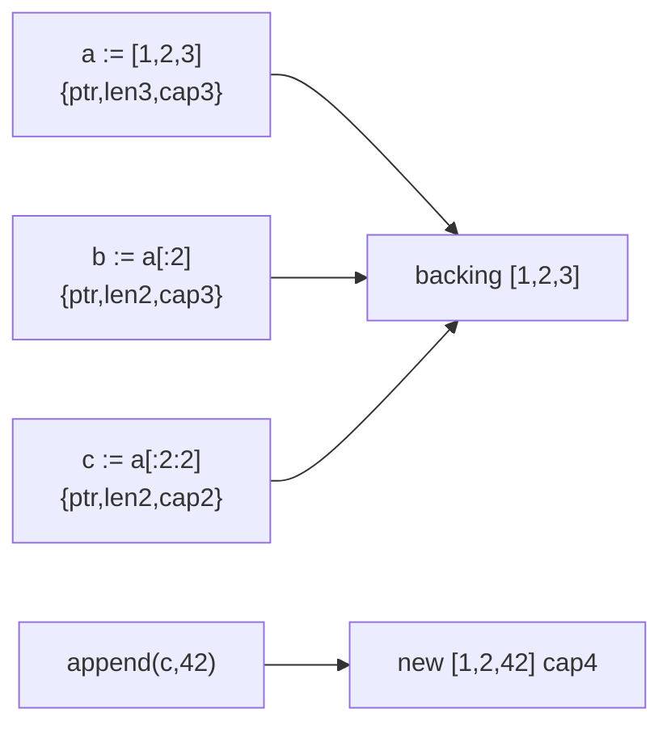
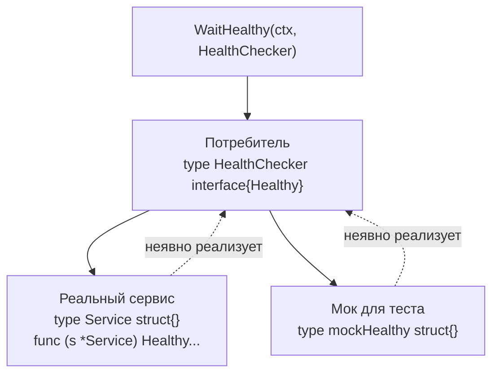
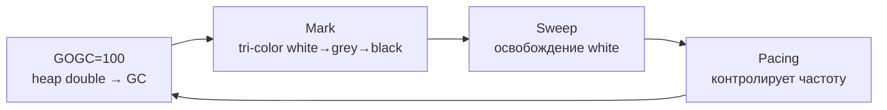

# 🐹 02. Go Fundamentals Deep: Типы, Интерфейсы, Ошибки, Generics

> Глубокий разбор языкового ядра для продакшна: как устроены типы, почему интерфейсы — инверсия зависимостей, как не утонуть в ошибках и когда generics спасают, а когда вредят. Весь код — `gofmt` + `go vet` чист.

**Оглавление:** 1. Система типов · 2. Slices/Maps/Strings · 3. Structs/Methods · 4. Интерфейсы · 5. Ошибки · 6. Generics · 7. Пакеты и zero value · 8. Память и рантайм · 9. Сеть и система · 10. Наблюдаемость · 11. Безопасность · 12. Production checklist · 13. Грабли · 14. Проверь себя · 15. Лабы

---

## 🧩 Система типов: value vs reference семантика

Всё в Go копируется **по значению**. Структура присваивается копией, слайс/мапа/канал — копией заголовка (указатель на данные внутри):

```go
type DeployConfig struct {
	Name     string
	Replicas int32
	Tags     []string          // слайс = {ptr, len, cap} — 24 байта заголовка
	Labels   map[string]string // мапа = указатель на hmap — 8 байт
}

func mutate(c DeployConfig) {
	c.Replicas = 99      // НЕ видно снаружи (копия)
	c.Tags[0] = "hacked" // ВИДНО снаружи! общий backing array
}

func demoValueSemantics() {
	cfg := DeployConfig{Name: "api", Replicas: 3, Tags: []string{"v1", "v2"}}
	mutate(cfg)
	// cfg.Replicas == 3, cfg.Tags[0] == "hacked"
}
```

| Тип | Размер | Копируется как | Мутация видна? |
| :--- | :--- | :--- | :--- |
| `int`, `struct` | значение | копия всех полей | нет |
| `[]T` | 24 байта `{ptr,len,cap}` | копия заголовка, данные общие | да, через элементы |
| `map[K]V` | 8 байт `*hmap` | копия указателя | да |
| `string` | 16 байт `{ptr,len}` | копия заголовка, данные immutable | нет (копия) |
| `*T` | 8 байт | копия указателя | да |

```go
// Правило проектирования API:
// маленькие иммутабельные структуры → по значению;
// большие/мутабельные → *DeployConfig + комментарий о мутации.

func NewDeployConfig(name string) *DeployConfig {
	return &DeployConfig{
		Name:   name,
		Tags:   make([]string, 0, 4),
		Labels: make(map[string]string),
	}
}

// Передача большого объекта по значению — дорого (копирование) + escape в heap
func ByValue(c DeployConfig)  {} // копирует всю структуру
func ByPointer(c *DeployConfig) {} // копирует 8 байт
```

---

## 📦 Слайсы, карты, строки: устройство

### Слайсы

```go
func sliceInternals() {
	// Литерал — аллоцирует backing array
	a := []int{1, 2, 3} // len=3 cap=3 ptr→[1,2,3]

	// Срез — делит массив, без аллокации
	b := a[:2] // len=2 cap=3 ptr→тот же массив
	b[0] = 99  // меняет a[0]!

	// Полный срез — ограничивает cap, разрывает aliasing
	c := a[:2:2] // len=2 cap=2
	c = append(c, 42) // аллоцирует новый массив, a не трогает

	// Append — рост cap: 2x до 1024, затем 1.25x
	var s []int
	for i := 0; i < 5; i++ {
		s = append(s, i)
		// cap: 0→1→2→4→4→8
	}

	// Pre-allocation — обязательно для hot path
	n := 10000
	out := make([]string, 0, n)
	for i := 0; i < n; i++ {
		out = append(out, "x")
	}
	_ = out

	// Копирование — явное
	dst := make([]int, len(a))
	copy(dst, a)
}
```



### Карты

```go
func mapInternals() {
	var m map[string]int // nil: чтение ok (zero), запись — panic!
	// m["x"] = 1 // panic: assignment to entry in nil map
	if _, ok := m["x"]; !ok {
		// ok == false, zero value
	}
	m = make(map[string]int, 8) // hint на 8 элементов — меньше реаллокаций
	m["x"] = 1

	// Итерация — рандомизирована (не полагайся на порядок!)
	for k, v := range m {
		_ = k
		_ = v
	}

	// Удаление
	delete(m, "x")

	// Карта — не потокобезопасна! См. sync раздел
}

func mapNotThreadSafe() {
	m := make(map[string]int)
	var mu sync.RWMutex
	mu.Lock()
	m["x"]++
	mu.Unlock()
	mu.RLock()
	_ = m["x"]
	mu.RUnlock()
}
```

### Строки и руны

```go
func stringInternals() {
	s := "привет" // UTF-8, len=12 байт, но 6 рун
	fmt.Println(len(s), len([]rune(s))) // 12 6

	// Строки immutable: s[0] = 'x' — не компилируется
	b := []byte(s)  // копия байт, можно менять
	b[0] = 'П'
	s2 := string(b) // новая строка

	// Эффективная конкатенация — не +, а Builder
	var sb strings.Builder
	sb.Grow(1024)
	for i := 0; i < 100; i++ {
		sb.WriteString("x")
	}
	_ = sb.String()

	// Срез строки делит данные (как слайс), но строки immutable — безопасно
	sub := s[:6] // "при" — 6 байт, может разрезать руну! осторожно
	_ = sub
	// Правильно по рунам:
	r := []rune(s)
	sub2 := string(r[:2]) // "пр"
	_ = sub2
}
```

---

## 🏗️ Структуры, методы, указатели, встраивание

```go
type Server struct {
	Name     string
	IP       string
	Tags     map[string]string
	Replicas int
}

// Value receiver — копирует, не мутирует
func (s Server) IsProd() bool {
	return s.Tags["env"] == "prod"
}

// Pointer receiver — может менять, дешевле для больших структур
func (s *Server) Scale(delta int) {
	if s == nil {
		return // защита от nil-получателя
	}
	s.Replicas += delta
}

func (s *Server) Clone() *Server {
	if s == nil {
		return nil
	}
	cp := *s
	cp.Tags = make(map[string]string, len(s.Tags))
	for k, v := range s.Tags {
		cp.Tags[k] = v
	}
	return &cp
}
```

### Встраивание (embedding) — композиция

```go
type HealthProbe struct {
	Server                // встраиваем: поля и методы промотируются
	URL     string
	Timeout time.Duration
}

func (h *HealthProbe) Check(ctx context.Context) error {
	if h.Server.IsProd() && h.Timeout == 0 {
		h.Timeout = 5 * time.Second
	}
	req, _ := http.NewRequestWithContext(ctx, http.MethodGet, h.URL, nil)
	resp, err := http.DefaultClient.Do(req)
	if err != nil {
		return err
	}
	defer resp.Body.Close()
	if resp.StatusCode != 200 {
		return fmt.Errorf("status %d", resp.StatusCode)
	}
	return nil
}

func demoEmbedding() {
	h := HealthProbe{
		Server: Server{Name: "api", Replicas: 3, Tags: map[string]string{"env": "prod"}},
		URL:    "http://api/healthz",
	}
	h.Scale(2)          // делегируется в Server.Scale
	fmt.Println(h.Name) // промотированное поле
	fmt.Println(h.Server.Name)
}

// Встраивание интерфейсов — для декораторов
type LoggingProbe struct {
	Prober Prober // композиция интерфейса
	Log    *slog.Logger
}

func (l *LoggingProbe) Check(ctx context.Context) error {
	l.Log.Info("probe start", "probe", fmt.Sprintf("%T", l.Prober))
	err := l.Prober.Check(ctx)
	if err != nil {
		l.Log.Error("probe failed", "err", err)
	}
	return err
}
```

| Приём | Когда | Пример |
| :--- | :--- | :--- |
| Value receiver | не мутирует, маленький объект (<64B) | `func (s Server) IsProd()` |
| Pointer receiver | мутирует / большой объект | `func (s *Server) Scale()` |
| Embedding struct | расширяешь без наследования | `HealthProbe { Server }` |
| Embedding interface | декоратор/мидлварь | `LoggingProbe { Prober }` |

```go
// Пакетная инкапсуляция: экспортируемое vs приватное
// server.go в пакете deploy
type server struct { // приватный тип
	name string
}
func NewServer(name string) *server { return &server{name: name} }
func (s *server) Name() string      { return s.name } // экспортируемый метод

// internal/ — жёсткая инкапсуляция: никто вне модуля не импортирует
```

---

## 🎭 Интерфейсы изнутри: itable и неявная реализация

Интерфейс = пара указателей `(type descriptor, data)`:

```go
var n Notifier = SlackNotifier{} // (itab: *SlackNotifier→Notifier, data: &{})
var e Notifier                   // nil интерфейс: оба nil

// ЛОВУШКА №1: typed nil
func find() Notifier {
	var p *SlackNotifier // вернёт nil-указатель
	return p             // интерфейс НЕ nil: (type=*SlackNotifier, data=nil)!
}

func demoTypedNil() {
	if find() != nil {
		// true! Хотя внутри nil
		find().Send(context.Background(), "hi") // паника или NPE
	}
	// Правильно:
	var p *SlackNotifier
	if p == nil {
		return nil // явный nil-интерфейс
	}
	return p
}

// Демонстрация различия
func typedNilDemo() {
	var p *MyError
	var err error = p
	fmt.Println(p == nil)   // true
	fmt.Println(err == nil) // false — typed nil!
	fmt.Printf("err type %T value %v\n", err, err)
}

type MyError struct{ msg string }

func (e *MyError) Error() string {
	if e == nil {
		return "<nil MyError>" // защита
	}
	return e.msg
}

// Ловушка №2: реализация через pointer receiver доступна только у *T
type S struct{}

func (s *S) Hello() {}

func demoPointerReceiver() {
	// var i interface{ Hello() } = S{}  // ❌ compile error: S не реализует (метод у *S)
	var j interface{ Hello() } = &S{} // ✅
	_ = j
}

// Compile-time проверка:
var _ Prober = (*HealthProbe)(nil)
var _ Prober = (*HTTPProbe)(nil)
```

### Type assertion, type switch, composition

```go
func handleValue(v any) {
	// Assertion — безопасная
	if s, ok := v.(string); ok {
		fmt.Println("string", s)
	}
	// Switch — исчерпывающая
	switch x := v.(type) {
	case string:
		fmt.Println("string", x)
	case int:
		fmt.Println("int", x)
	case nil:
		fmt.Println("nil")
	case Prober:
		x.Check(context.Background())
	default:
		fmt.Printf("unknown %T\n", x)
	}
}

// Композиция интерфейсов + segregation
type Reader interface{ Read(p []byte) (int, error) }
type Writer interface{ Write(p []byte) (int, error) }
type ReadWriter interface {
	Reader
	Writer
}

// Dependency inversion: узкий интерфейс у потребителя
type HealthChecker interface {
	Healthy(ctx context.Context) (bool, error)
}

// Потребитель объявляет ровно то, что использует:
func WaitHealthy(ctx context.Context, h HealthChecker) error {
	ticker := time.NewTicker(500 * time.Millisecond)
	defer ticker.Stop()
	for {
		ok, err := h.Healthy(ctx)
		if err != nil {
			return err
		}
		if ok {
			return nil
		}
		select {
		case <-ticker.C:
		case <-ctx.Done():
			return ctx.Err()
		}
	}
}

// Любой сервис с таким методом подходит — тестируется подстановкой мока
type mockHealthy struct{ ok bool }

func (m *mockHealthy) Healthy(ctx context.Context) (bool, error) { return m.ok, nil }
```



| Приём | Зачем | Антипаттерн |
| :--- | :--- | :--- |
| Маленькие интерфейсы (1-2 метода) | легко мокать, слабые зависимости | `type Service interface{ 20 методов }` |
| Объявлять у потребителя | не тащить лишнее | объявлять у автора типа |
| `any` только на границе | JSON, рефлексия | `func Do(any)` везде |
| Проверка `var _ Interface = (*Type)(nil)` | ловит слом на компиляции | без проверки узнаёшь в рантайме |

---

## 📦 Ошибки: wrapping и errors.Is/As, таксономия

`error` — просто интерфейс `Error() string`. Идиоматика с Go 1.13:

```go
import (
	"errors"
	"fmt"
	"time"
)

var ErrNotFound = errors.New("resource not found") // sentinel-ошибка

type RateLimitError struct { // структурная ошибка с данными
	RetryAfter time.Duration
}

func (e *RateLimitError) Error() string { return fmt.Sprintf("rate limited, retry after %s", e.RetryAfter) }

func getDeployment(name string) (*Deployment, error) {
	resp, err := api.Get(name)
	if err != nil {
		return nil, fmt.Errorf("get deployment %q: %w", name, err)
	}
	if resp.StatusCode == 404 {
		return nil, fmt.Errorf("get deployment %q: %w", name, ErrNotFound) // %w = wrap!
	}
	if resp.StatusCode == 429 {
		return nil, &RateLimitError{RetryAfter: 5 * time.Second}
	}
	return decode(resp), nil
}

// Вызывающий код различает сценарии:
func caller() {
	_, err := getDeployment("api")
	if errors.Is(err, ErrNotFound) { // проверка цепочки wrap'ов
		// создать
	}
	var rl *RateLimitError
	if errors.As(err, &rl) { // извлечение типа из цепочки
		time.Sleep(rl.RetryAfter)
	}
}
```

### Sentinel vs структурные vs wrap

| Вид | Когда | Пример | Проверка |
| :--- | :--- | :--- | :--- |
| Sentinel `ErrXxx` | ожидаемое состояние | `ErrNotFound` | `errors.Is` |
| Структурная `*MyError` | нужны поля | `RateLimitError{RetryAfter}` | `errors.As` |
| Wrapped `%w` | проброс наверх с контекстом | `fmt.Errorf("…: %w", err)` | `Is/As` по цепочке |
| `%v` | приватная деталь, не классифицируется | `fmt.Errorf("…: %v", err)` | не `Is` |

```go
// Правило %w: один wrap на уровень, не дублировать
func load(path string) ([]byte, error) {
	data, err := os.ReadFile(path)
	if err != nil {
		return nil, fmt.Errorf("load %s: %w", path, err) // один %w
	}
	return data, nil
}

// errors.Join — несколько ошибок (Go 1.20+)
func closeAll(closers []io.Closer) error {
	var errs []error
	for _, c := range closers {
		if err := c.Close(); err != nil {
			errs = append(errs, err)
		}
	}
	return errors.Join(errs...) // nil если всё ok
}

// AppError — доменная ошибка с кодом
type AppError struct {
	Code      string
	Msg       string
	Retryable bool
	Cause     error
}

func (e *AppError) Error() string { return fmt.Sprintf("%s: %s", e.Code, e.Msg) }
func (e *AppError) Unwrap() error { return e.Cause }

func IsRetryable(err error) bool {
	var ae *AppError
	if errors.As(err, &ae) {
		return ae.Retryable
	}
	var rl *RateLimitError
	if errors.As(err, &rl) {
		return true
	}
	return false
}
```

### Таксономия: transient vs permanent

| Категория | Примеры | Стратегия | Логировать |
| :--- | :--- | :--- | :--- |
| Permanent | `ErrNotFound`, `ValidationError`, 400 | не ретраить, сообщить пользователю | warn |
| Transient | 503, 429, `DeadlineExceeded` | ретрай с backoff+jitter | info + attempt |
| Canceled | `context.Canceled` | пробросить, не логировать как ошибку | debug |
| Unknown | обёрнутый без типа | логировать + алертить | error |

```go
func fetchWithRetry(ctx context.Context, url string) error {
	backoff := time.Second
	for i := 0; i < 5; i++ {
		err := fetch(ctx, url)
		if err == nil {
			return nil
		}
		if !IsRetryable(err) {
			return err
		}
		select {
		case <-time.After(backoff):
			backoff *= 2
			if backoff > 10*time.Second {
				backoff = 10 * time.Second
			}
		case <-ctx.Done():
			return ctx.Err()
		}
	}
	return fmt.Errorf("exhausted retries")
}
```

**Правила:**
- `fmt.Errorf(...: %w)` при переносе наверх; `%v` — если нижняя ошибка приватная деталь.
- Sentinel-ошибки (`ErrXxx`) для ожидаемых сценариев; структуры — когда нужны поля.
- `panic` — только для программных ошибок (nil map write, index bug); всё остальное — `error`.
- Не логировать и возвращать одновременно — двойной лог.

---

}

func (c *Cache[K, V]) Set(k K, v V) {
	c.mu.Lock()
	defer c.mu.Unlock()
	c.data[k] = v
}

// Generic Set
type Set[T comparable] map[T]struct{}

func NewSetT comparable Set[T] {
	s := make(Set[T], len(vals))
	for _, v := range vals {
		s[v] = struct{}{}
	}
	return s
}

// Type sets — объединение
type Ordered interface{ ~int | ~string | ~float64 }

func MaxT Ordered T {
	if a > b {
		return a
	}
	return b
}

// Реальный кейс DevOps: generic GetOrLoad
func GetOrLoadK comparable, V any
	return v, nil
}
```

### Generics vs интерфейсы vs рефлексия

| Подход | Когда | Цена | Пример |
| :--- | :--- | :--- | :--- |
| `interface` | разное поведение, полиморфизм рантайма | динамика, аллокации | `Notifier` |
| `generics` | одинаковая логика над разными ТИПАМИ данных | мономорфизация, без боксинга | `Sum`, `Cache` |
| `reflect` | неизвестные типы на рантайме | медленно, unsafe | `json.Marshal` |

```go
// Не пишите GenericFactoryAbstractBuilder — антипаттерн
// Плохо: type Factory[T any] interface{ Create() T } — избыточно
// Хорошо: интерфейс с поведением, генерик с данными

// Когда генерик излишен:
func SumInt(xs []int) int { var s int; for _, v := range xs { s += v }; return s } // проще без генерика если один тип
```

⚠️ Генерики — не замена интерфейсам: интерфейсы полиморфны в рантайме, генерики — специализация на компиляции. Критерий: если нужен полиморфизм поведения — интерфейс; если одинаковый алгоритм над разными типами — генерик.

---

## 🗺️ Нулевые значения как фича

```go
var mu sync.Mutex        // готов к работе, zero value = разблокирован
var buf bytes.Buffer     // готов к записи
var wg sync.WaitGroup    // готов
var m sync.Map           // готов
cfg := &Config{}         // все поля нулевые — часто валидное состояние!

// Функциональные опции поверх zero-value:
type ServerOpt struct {
	addr    string
	timeout time.Duration
	tls     bool
}

type Option func(*ServerOpt)

func WithTimeout(d time.Duration) Option { return func(s *ServerOpt) { s.timeout = d } }
func WithTLS() Option                   { return func(s *ServerOpt) { s.tls = true } }
func WithAddr(a string) Option          { return func(s *ServerOpt) { s.addr = a } }

func NewServer(opts ...Option) *ServerOpt {
	s := &ServerOpt{addr: ":8080", timeout: 30 * time.Second} // разумные дефолты
	for _, o := range opts {
		o(s)
	}
	return s
}

func demoOptions() {
	s := NewServer(WithTimeout(5*time.Second), WithTLS())
	_ = s
	// Расширяемо без breaking changes: новая опция = новая функция
}
```

| Тип | Zero value | Готов к использованию? |
| :--- | :--- | :--- |
| `sync.Mutex` | unlocked | да |
| `bytes.Buffer` | пустой буфер | да |
| `sync.WaitGroup` | counter 0 | да |
| `*Config` | nil | нет, нужна проверка |
| `map[K]V` | nil | чтение да, запись panic |
| `[]T` | nil | чтение/append да (аллоцирует) |

---

## 🧠 Память и рантайм: stack/heap, GC

### Stack vs heap, escape analysis

```go
func onStack() {
	var buf [1024]byte
	process(buf[:]) // не убегает — на стеке, быстро
}

func escapes() *Server {
	s := &Server{Name: "api"} // & возвращается → heap
	return s
}

func alsoEscapes() {
	s := make([]int, 10000) // большой → heap
	use(s)
}

func viaInterface() {
	s := Server{Name: "api"}
	var i any = s // боксинг в interface → heap
	_ = i
}
```

```bash
go build -gcflags="-m" ./... 2>&1 | grep escapes
# ./main.go:12: &Server escapes to heap
# ./main.go:15: moved to heap: buf
# ./main.go:20: s does not escape
```

```go
// Оптимизация: избегать аллокаций в hot path
func sumNoAlloc(xs []int) int {
	var s int
	for _, v := range xs {
		s += v
	}
	return s // 0 allocs
}

func sumWithAlloc(xs []int) int {
	s := make([]int, len(xs)) // лишняя аллокация!
	copy(s, xs)
	var tot int
	for _, v := range s {
		tot += v
	}
	return tot
}

// go test -bench=. -benchmem покажет B/op, allocs/op
```

### GC: tri-color, GOGC, GOMEMLIMIT, pacing



| Переменная | Что делает | Типично | Когда менять |
| :--- | :--- | :--- | :--- |
| `GOGC` | % роста heap до GC (100=double) | 100 | CPU vs memory tradeoff |
| `GOMEMLIMIT` | мягкий лимит памяти (1.19+) | `512MiB` | в контейнере обязательно |
| `GOMAXPROCS` | число P (потоков) | `NumCPU` | в k8s с лимитами CPU |

```go
// Тюнинг для пода 512MiB:
// GOMEMLIMIT=450MiB GOGC=80 go run ./cmd/server
// — GC запустится раньше, избегая OOMKill

// Метрики runtime
var m runtime.MemStats
runtime.ReadMemStats(&m)
fmt.Println(m.HeapInuse, m.NumGC)

// pprof heap
// go tool pprof -http=:8080 http://localhost:6060/debug/pprof/heap
```

| Проблема | Симптом | Лечение |
| :--- | :--- | :--- |
| Высокий allocs/op | GC pressure, latency spikes | `sync.Pool`, pre-alloc |
| Большой heap | OOMKill | `GOMEMLIMIT`, `pprof heap` |
| Copy locks | `go vet: copylocks` | передавать `*Mutex` |
| Утечка горутин | `NumGoroutine` ↑ | `goleak`, `pprof goroutine` |

---

## 🌐 Сеть и система для fundamentals

```go
// HTTP клиент — всегда с таймаутом!
client := &http.Client{
	Timeout: 10 * time.Second,
	Transport: &http.Transport{
		MaxIdleConns:        100,
		IdleConnTimeout:     90 * time.Second,
		TLSHandshakeTimeout: 5 * time.Second,
	},
}

func fetchLimited(ctx context.Context, url string) ([]byte, error) {
	req, _ := http.NewRequestWithContext(ctx, http.MethodGet, url, nil)
	resp, err := client.Do(req)
	if err != nil {
		return nil, err
	}
	defer resp.Body.Close()
	// Ограничить размер — защита от OOM
	limited := io.LimitReader(resp.Body, 10<<20) // 10 MiB
	return io.ReadAll(limited)
}

// os/exec без shell — безопасно
func kubectlGet(ctx context.Context, ns string) ([]byte, error) {
	out, err := exec.CommandContext(ctx, "kubectl", "get", "pods", "-n", ns, "-o", "json").Output()
	if err != nil {
		var ee *exec.ExitError
		if errors.As(err, &ee) {
			return nil, fmt.Errorf("kubectl exit %d: %s", ee.ExitCode(), string(ee.Stderr))
		}
		return nil, err
	}
	return out, nil
}

// Сигналы
func withSignal(ctx context.Context) context.Context {
	ctx, stop := signal.NotifyContext(ctx, os.Interrupt, syscall.SIGTERM)
	// defer stop() в вызывающем
	_ = stop
	return ctx
}
```

---

## 🔭 Наблюдаемость: fundamentals

```go
import "log/slog"

func initLogger() *slog.Logger {
	h := slog.NewJSONHandler(os.Stdout, &slog.HandlerOptions{Level: slog.LevelInfo})
	return slog.New(h)
}

func demoObs() {
	slog.Info("deploy", "name", "api", "replicas", 3)
	// {"time":"...","level":"INFO","msg":"deploy","name":"api","replicas":3}
}

// Prometheus
var cacheHits = prometheus.NewCounter(prometheus.CounterOpts{
	Name: "cache_hits_total",
	Help: "hits",
})

func init() { prometheus.MustRegister(cacheHits) }

// pprof — только localhost!
import _ "net/http/pprof"
go func() { http.ListenAndServe("localhost:6060", nil) }()
```

| Сигнал | Библиотека | Куда |
| :--- | :--- | :--- |
| Logs | `slog` JSON | stdout → Loki |
| Metrics | `prometheus/client_golang` | `/metrics` |
| Traces | `otel` | OTLP |
| Profiles | `pprof` | `:6060` |

---

## 🔒 Безопасность: fundamentals

```bash
go vet ./...
govulncheck ./...
staticcheck ./...
golangci-lint run
```

```go
// Не конкатенировать shell
// Плохо: exec.Command("sh","-c","kubectl get "+input)
// Хорошо:
exec.CommandContext(ctx, "kubectl", "get", "pods", "-n", ns)

// Секреты — не в логах
func redact(s string) string {
	if len(s) < 4 {
		return "***"
	}
	return s[:2] + "***" + s[len(s)-2:]
}

// TOCTOU — атомарное создание
f, err := os.OpenFile(path, os.O_CREATE|os.O_EXCL|os.O_WRONLY, 0600)
if err != nil {
	return err
}
defer f.Close()
```

| Риск | Митигация |
| :--- | :--- |
| Утечка секретов | redact, `slog` без токенов |
| Injection | `CommandContext` без shell |
| Race | `-race` |
| Vuln deps | `govulncheck` |

---

## ✅ Production checklist: fundamentals

| Категория | Проверка | Команда |
| :--- | :--- | :--- |
| Типы | нет копирования больших структур по значению | `go vet -copylocks` |
| Интерфейсы | typed nil защищён | `if p==nil {return nil}` |
| Ошибки | `%w` и `Is/As` | `go vet` + review |
| Generics | не вместо интерфейсов | review |
| Память | escape + benchmem | `go build -gcflags="-m"`, `benchmem` |
| Линт | vet/staticcheck | `golangci-lint` |
| Безопасность | govulncheck | `govulncheck ./...` |

---

## ❌ Грабли fundamentals

| Грабля | Суть | Решение |
| :--- | :--- | :--- |
| Typed nil | `return p` где `p *T == nil` → интерфейс != nil | `if p==nil {return nil}` |
| Slicing alias | `b:=a[:2]` делит массив | `copy` или `a[:2:2]` |
| Map write без make | panic | `make(map[K]V)` |
| Копирование Mutex | `go vet: copylocks` | `*sync.Mutex` |
| Generics overuse | `Factory[T]` вместо интерфейса | интерфейс для поведения |

---

## ✅ Проверь себя — 10 вопросов

**В1. Почему мутация `c.Tags[0]` видна вызывающему, а `c.Replicas = 99` нет?**
<details><summary>Ответ</summary>
Структура передана копией: поле Replicas скопировано, изменение локально. Поле Tags — копия заголовка слайса, но он ссылается на тот же backing array в куче; запись через него видна всем держателям этого массива. Фикс — передавать `*DeployConfig` или делать `copy`.
</details>

**В2. Что такое «typed nil» и почему `err != nil` может быть true при nil-указателе?**
<details><summary>Ответ</summary>
Интерфейс хранит (тип, значение). Возврат nil-указателя конкретного типа даёт пару (T, nil) — интерфейс не равен nil (нужна пара nil,nil). Лечится возвратом явного `nil` или проверкой `if p==nil {return nil}` перед возвратом интерфейса.
</details>

**В3. Чем %w отличается от %v в fmt.Errorf?**
<details><summary>Ответ</summary>
`%w` оборачивает ошибку, сохраняя её в цепочке `Unwrap()`: `errors.Is/As` смогут найти sentinel/тип наверху. `%v` только форматирует текст — информация о типе теряется, `errors.Is` всегда false.
</details>

**В4. Когда выбрать интерфейс, а когда генерики?**
<details><summary>Ответ</summary>
Разные реализации с разным поведением (Notifier: slack/telegram) — интерфейс, полиморфизм рантайма. Одинаковая логика над разными ТИПАМИ данных (Sum по числам, Contains) — генерики, без боксинга и рефлексии. Генерики не заменяют поведение, только типы.
</details>

**В5. Что даёт паттерн functional options поверх zero-value структур?**
<details><summary>Ответ</summary>
Конструктор с разумными дефолтами + расширяемый список опций без breaking changes (новая опция = новая функция, старые вызовы не меняются), читаемые вызовы `NewServer(WithTimeout(5*time.Second))` вместо позиционных аргументов с нулями.
</details>

**В6. Stack vs heap: как понять, где аллоцируется переменная, и зачем это знать?**
<details><summary>Ответ</summary>
`go build -gcflags="-m"` показывает `escapes to heap`. На стеке — быстро, без GC; в куче — давление на GC. Убегает, если адрес возвращается, уходит в interface, или большой размер. Оптимизация — `sync.Pool`, pre-alloc, избегать боксинга в hot path. Смотреть `benchmem` allocs/op.
</details>

**В7. Чем `errors.Is` отличается от `==`, а `errors.As` от type assertion, и когда что?**
<details><summary>Ответ</summary>
`==` сравнивает только верхний уровень, `Is` идёт по цепочке `%w`. `As` ищет по цепочке и работает с обёртками, type assertion — только верхний. `Is` для sentinel (`ErrNotFound`), `As` для структур с полями (`*RateLimitError`). `As` требует указатель на указатель.
</details>

**В8. Что такое `comparable` и `~T` в constraints, и когда нужен `type set`?**
<details><summary>Ответ</summary>
`comparable` — можно сравнивать `==` (ключи карт, `Contains`). `~T` — включает `T` и все именованные типы с underlying `T` (например, `type MyInt int` для `~int`). Type set `~int | ~string` — ограничение, что T один из списка. Нужно для generic функций, работающих над несколькими типами (Sum, Max).
</details>

**В9. Почему `GOMEMLIMIT` важнее `GOGC` в Kubernetes?**
<details><summary>Ответ</summary>
GOGC — относительный (процент роста), не знает лимит пода → может OOMKill. GOMEMLIMIT — абсолютный мягкий лимит, GC подстраивается, держит heap ниже limit. В контейнере: `GOMEMLIMIT=0.9*limit`, `GOGC=80`. Проверять через `pprof heap` и `go_memstats_heap_inuse_bytes`.
</details>

**В10. Как спроектировать retry, чтобы не усугубить outage (thundering herd)?**
<details><summary>Ответ</summary>
Ретрай только transient (429/5xx, timeout), не permanent (400/404). Exponential backoff с jitter (`base + rand`), лимит попыток, уважать `Retry-After` и `ctx.Done()`, идемпотентность обязательна. Классифицировать через `errors.Is/As` и `IsRetryable()`, метрика `retries_total`. Circuit breaker при массовых ошибках.
</details>

---

## 🧪 Лабораторные

### Lab 1: Поймай typed nil

```go
package main

import (
	"errors"
	"fmt"
)

type MyError struct{ msg string }

func (e *MyError) Error() string { return e.msg }

func bad() error {
	var p *MyError
	return p // typed nil!
}

func good() error {
	var p *MyError
	if p == nil {
		return nil
	}
	return p
}

func main() {
	fmt.Println("bad == nil?", bad() == nil)   // false
	fmt.Println("good == nil?", good() == nil) // true
	var target *MyError
	fmt.Println(errors.As(bad(), &target)) // true, но это баг!
}
```

```bash
go run lab.go
go vet ./... # не ловит, только review и тест на nil
```

### Lab 2: Escape analysis и benchmem

```go
package main

import "testing"

func withAlloc(n int) []int {
	s := make([]int, n)
	for i := range s {
		s[i] = i
	}
	return s
}

func preAlloc(n int) []int {
	s := make([]int, 0, n)
	for i := 0; i < n; i++ {
		s = append(s, i)
	}
	return s
}

func BenchmarkAlloc(b *testing.B) {
	b.ReportAllocs()
	for i := 0; i < b.N; i++ {
		_ = withAlloc(1000)
	}
}
```

```bash
go test -bench=. -benchmem
go build -gcflags="-m" ./... 2>&1 | grep escape
```

### Lab 3: Generics vs interface — измерь

```go
func SumGeneric[T Number](xs []T) T { var s T; for _, v := range xs { s += v }; return s }
func SumInterface(xs []int) int     { var s int; for _, v := range xs { s += v }; return s }

func BenchmarkGeneric(b *testing.B) {
	xs := make([]int, 1000)
	for i := 0; i < b.N; i++ {
		SumGeneric(xs)
	}
}
```

```bash
go test -bench=. -benchmem
# Разница allocs/op = 0 в обоих, но генерик без боксинга, интерфейс с any — аллокации
```

---

*Что дальше:* [03. Конкурентность](03-go-concurrency-patterns.md) · [01. Go для DevOps](02-go-for-devops.md)