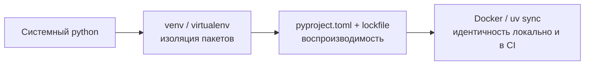

# 🐍 02. Python: Окружения, Зависимости и Упаковка

## 🧱 Проблема окружений и её решения



| Инструмент | Скорость | Lockfile | Статус |
|---|---|---|---|
| **pip + venv** | базовая | ❌ (requirements.txt вручную) | встроен везде |
| **Poetry** | средняя | ✅ poetry.lock | зрелый, удобный CLI |
| **Pipenv** | медленная | ✅ | теряет популярность |
| **uv** ⚡ | в 10–100× быстрее pip | ✅ uv.lock | новый стандарт (Rust) |
| **conda/mamba** | средняя | ✅ env.yml | ML/science, не-Python зависимости |

```bash
# --- uv: современный минимум ---
uv init mytool && cd mytool
uv add httpx typer                 # добавить зависимости
uv run pytest                      # запуск в окружении проекта (авто-sync)
uv lock --upgrade                  # обновить lockfile
uv python install 3.12             # даже сам интерпретатор ставит uv

# --- классика, которую встретите на каждом шагу ---
python -m venv .venv && source .venv/bin/activate
pip install -r requirements.txt
pip freeze > requirements.txt      # ⚠️ это lockfile только для приложения, не библиотеки
```

!!! tip "Разделение requirements"
    Библиотека объявляет *минимальные* требования (loose pins); приложение фиксирует *точные* версии (lock). Перепутать = получить невоспроизводимые сборки или нерешаемые конфликты.

## 📦 pyproject.toml: единый стандарт

`setup.py` устарел; всё описывается декларативно:

```toml
[project]
name = "devops-toolkit"
version = "1.4.0"
requires-python = ">=3.11"
dependencies = [
    "httpx>=0.27,<0.29",
    "typer[all]>=0.12",
    "kubernetes~=30.0",
]
[project.optional-dependencies]
dev = ["pytest", "mypy", "ruff"]     # extras: pip install '.[dev]'
[project.scripts]
dtk = "devops_toolkit.cli:app"       # консольная команда после pip install

[build-system]
requires = ["hatchling"]
build-backend = "hatchling.build"

[tool.ruff]                          # конфиги инструментов живут тут же
line-length = 100
[tool.pytest.ini_options]
addopts = "-q --cov=devops_toolkit"
```

```bash
pipx install build && python -m build       # собрать wheel + sdist в dist/
twine upload dist/*                          # публикация в PyPI (или приватный Nexus)
pip install dist/devops_toolkit-1.4.0-py3-none-any.whl   # установка из wheel
```

**Wheel vs sdist:** wheel — готовый бинарный артефакт (быстрая установка без сборки); sdist — исходники (нужны при установке). В CI всегда публикуйте wheel; для pure-Python он универсален (`py3-none-any`).

## 🧬 Управление версиями зависимостей

```text
~=30.0    → >=30.0, <31        «совместимая» версия (PEP 440)
>=0.27,<0.29                   диапазон для библиотек
==1.4.2                        точный пин (приложения)
!=2.0.*                        исключение битой версии
```

Конфликт зависимостей — диагностика и выход:

```bash
pip install --dry-run package          # проверить разрешимость без установки
pipdeptree -p kubernetes               # дерево зависимостей пакета
uv pip compile requirements.in -o requirements.lock --generate-hashes   # хэшированный lock (supply chain)
```

Приватные индексы (Nexus/Artifactory):

```bash
pip install --index-url https://nexus.local/repository/pypi/simple/ \
            --extra-index-url https://pypi.org/simple my-private-lib
# PIP_INDEX_URL / UV_INDEX_URL в переменных CI
```

## 🏗️ Структура production-проекта

```text
devops-toolkit/
├── pyproject.toml           # метаданные, зависимости, конфиги инструментов
├── uv.lock                  # lockfile — коммитить!
├── src/
│   └── devops_toolkit/
│       ├── __init__.py
│       ├── cli.py
│       └── core/
├── tests/
├── .pre-commit-config.yaml
└── Dockerfile               # multi-stage: builder → runtime
```

```dockerfile
FROM python:3.12-slim AS builder
COPY --from=ghcr.io/astral-sh/uv:latest /uv /usr/local/bin/uv
WORKDIR /app
COPY pyproject.toml uv.lock ./
RUN uv sync --frozen --no-dev --no-install-project

FROM python:3.12-slim
WORKDIR /app
COPY --from=builder /app/.venv /app/.venv
COPY src/ ./src/
ENV PATH="/app/.venv/bin:$PATH" PYTHONUNBUFFERED=1
CMD ["python", "-m", "devops_toolkit"]
```

Ключевые детали: `--frozen` (не обновлять lock), `--no-install-project` в билдере (кэш слоёв зависимостей), `PYTHONUNBUFFERED` (логи сразу в stdout).

## ❓ Пять вопросов для самопроверки

---


## ✅ Проверь себя

> Отвечай вслух до раскрытия ответа. Если «не помню» — вернись к разделу.


**В1. Чем wheel отличается от sdist и что публиковать в CI?**
<details><summary>Ответ</summary>
Wheel — собранный дистрибутив, устанавливается без выполнения кода сборки и без компилятора; sdist — архив исходников, из которого wheel собирается на месте. Для pure-Python публикуйте wheel (универсальный) — установка мгновенная и безопаснее.
</details>

**В2. Почему `pip freeze > requirements.txt` — плохой lockfile для библиотеки?**
<details><summary>Ответ</summary>
Он фиксирует ВСЕ транзитивные зависимости текущей машины, лишая пользователей возможности разрешения конфликтов. Библиотека должна объявлять loose-диапазоны в pyproject.toml; точные lock'и — дело приложений (poetry.lock/uv.lock).
</details>

**В3. Что делает `uv sync --frozen` и почему это важно в Docker?**
<details><summary>Ответ</summary>
Устанавливает окружение строго по uv.lock без его обновления. Без frozen любая новая версия зависимости могла бы попасть в сборку между коммитом и билдом — воспроизводимость ломается.
</details>

**В4. Как в одном проекте держать dev-зависимости отдельно от runtime?**
<details><summary>Ответ</summary>
Optional-dependencies/extras: `[project.optional-dependencies] dev = [...]`, установка `pip install -e '.[dev]'`. В продовой сборке ставится только базовый набор (`--no-dev` у uv, экспорт без extras) — меньше поверхность атаки и размер образа.
</details>

**В5. Зачем multi-stage Dockerfile с отдельным этапом builder?**
<details><summary>Ответ</summary>
Компиляторы, заголовочные файлы и uv остаются в билдере; в рантайм копируется только готовый `.venv`. Итог: образ меньше в разы, нет тулчейна = меньше CVE, кэш слоёв зависимостей работает пока lock не изменился.
</details>

---

*Что дальше:* [03. Тестирование pytest](03-python-testing-pytest.md) · [01. Python для DevOps](01-python-for-devops.md)
