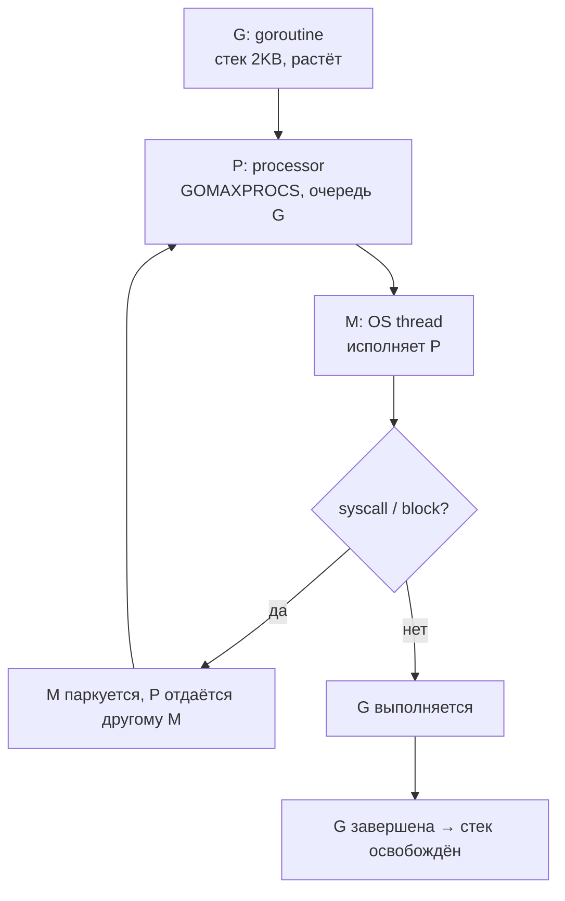
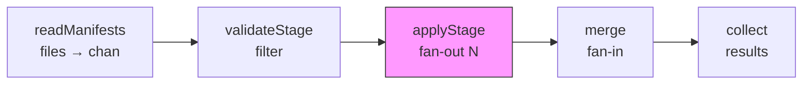
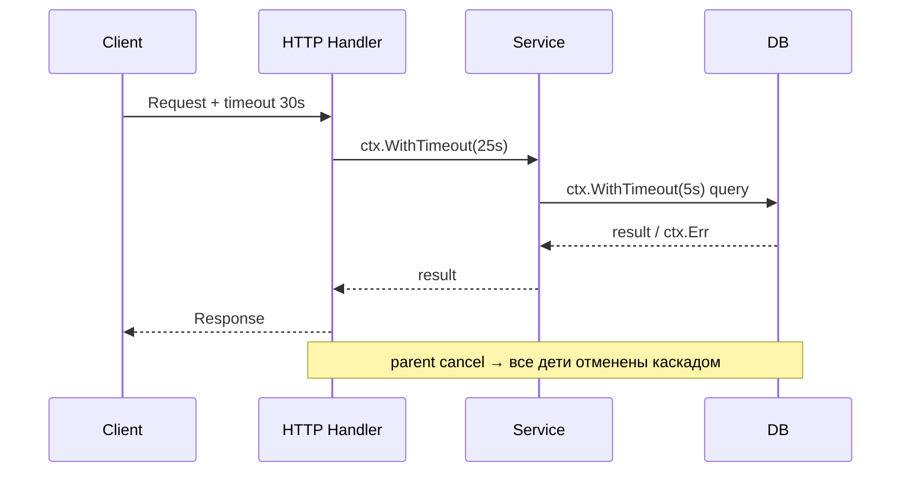
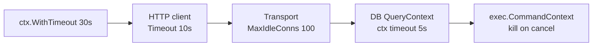

# 🔀 03. Go Конкурентность: Goroutines, Channels, Context, errgroup — Production Deep Dive

> Глубокий разбор конкурентности Go для продакшна: планировщик, каналы, select, sync-примитивы, worker pools, pipeline, контекст, утечки, race detector, deadlocks и наблюдаемость. Весь код — `gofmt` + `go vet` чист, `go test -race` зелёный.

**Оглавление:** 1. Модель · 2. Горутины · 3. Каналы · 4. Select · 5. Worker Pool · 6. Pipeline · 7. Fan-out/fan-in · 8. Context · 9. sync · 10. errgroup · 11. Память и GC · 12. Сеть и система · 13. Наблюдаемость · 14. Безопасность · 15. Race и утечки · 16. Production checklist · 17. Проверь себя · 18. Лабы

---

## 🧵 Модель: M:N планировщик за 3 абзаца

Горутина — функция в конкурентном исполнении стоимостью ~2 КБ стека (растёт/сжимается до 1 ГБ). Планировщик Go мультиплексирует миллионы горутин на потоки ОС (`GOMAXPROCS` воркеров, по умолчанию `NumCPU`). Блокирующий syscall отдаёт поток, остальные горутины живут дальше. Отсюда правило: **не создавайте пулы «на всякий случай» — ограничивайте параллелизм семантикой задачи** (лимит соединений API, а не ядер CPU).



| Компонент | Что это | Настраивается | Типично |
| :--- | :--- | :--- | :--- |
| `G` | горутина | создаёшь `go f()` | миллионы |
| `P` | логический процессор | `GOMAXPROCS` | `NumCPU` |
| `M` | OS thread | `GOMAXPROCS` + блокирующие | `~NumCPU` |
| `GOMAXPROCS` | лимит P | `runtime.GOMAXPROCS`, `GOMAXPROCS` env | `NumCPU` в Go 1.21+ c cgroup |

```go
package main

import (
	"fmt"
	"runtime"
)

func init() {
	fmt.Println("NumCPU", runtime.NumCPU())
	fmt.Println("GOMAXPROCS", runtime.GOMAXPROCS(0))
	// В контейнере k8s с limits: Go 1.21+ читает cgroup автоматом
	// Проверь: GOMAXPROCS должен совпадать с cpu limit, иначе throttling
}
```

**Failure mode планировщика:**

| Проблема | Симптом | Диагностика | Фикс |
| :--- | :--- | :--- | :--- |
| CPU throttling | latency spikes, `GOMAXPROCS` > limit | `kubectl top`, `runtime.GOMAXPROCS` | `GOMAXPROCS=limit` или `automaxprocs` |
| Блокирующий syscall без отдачи P | мало параллелизма | `pprof` — много `syscall` | `netpoll` или `go` + `SetLimit` |
| Слишком много горутин | OOM, `NumGoroutine` 100k+ | `pprof goroutine` | bounded pool |

---

## 🌱 Горутины: жизненный цикл, стоимость, утечки

```go
// Горутина стартует за ~1 мкс, стек 2KB
go doWork()

// Передача параметров — копия значения, не замыкание!
for _, host := range hosts {
	host := host // Go 1.22+ уже копирует автоматически, но явно безопаснее
	go func(h string) {
		checkHost(h)
	}(host)
}

// До Go 1.22 — обязательна копия!
for i := 0; i < 3; i++ {
	i := i
	go func() { fmt.Println(i) }()
}
```

```go
// WaitGroup: дождаться всех
var wg sync.WaitGroup
for _, host := range hosts {
	wg.Add(1)
	go func(h string) {
		defer wg.Done()
		checkHost(h)
	}(host)
}
wg.Wait()

// Горутина с возвратом ошибки — через канал или errgroup
errCh := make(chan error, len(hosts))
for _, h := range hosts {
	go func(h string) { errCh <- checkHost(h) }(h)
}
for range hosts {
	if err := <-errCh; err != nil {
		fmt.Println(err)
	}
}
```

```go
// Утечка: горутина ждёт канал, который никто не читает
func leaky() {
	ch := make(chan int)
	go func() {
		ch <- 42 // блок навсегда, если никто не читает → утечка
	}()
	// ch никто не читает, горутина висит вечно
}

// Фикс: контекст или буфер + select
func fixed(ctx context.Context) {
	ch := make(chan int, 1)
	go func() {
		select {
		case ch <- 42:
		case <-ctx.Done():
		}
	}()
	select {
	case v := <-ch:
		fmt.Println(v)
	case <-ctx.Done():
	}
}
```

| Стоимость | Значение | Комментарий |
| :--- | :--- | :--- |
| Стек | 2 KB старт, растёт | vs 1 MB у OS thread |
| Создание | ~1 мкс | vs ~1 мс у thread |
| Переключение | ~100 нс | кооперативное + preemptive |
| Лимит | миллионы | ограничивается памятью |

---

## 📮 Channels: правила выживания

```go
ch := make(chan Job)      // небуферизованный: send ждёт receive (синхронизация)
ch2 := make(chan Job, 100) // буфер: send ждёт только при полном буфере (backpressure)
```

| Операция | nil chan | открытый | закрытый |
|---|---|---|---|
| send `<-` | блок навсегда | блок/буфер | **паника** |
| receive `->` | блок навсегда | блок/буфер | мгновенно zero-value, ok=false |
| close | паника | ok | паника |
| `len`/`cap` | 0 | текущие | 0 после drain |

```go
// Закрывает ТОЛЬКО отправитель. Получатели читают так:
for job := range ch { // выход по закрытию канала — идиоматичный цикл
	process(job)
}
val, ok := <-ch // ok=false — канал закрыт и пуст

// Не закрывай канал со стороны получателя — паника у отправителей!
// Не делай double close — паника

func producer(jobs chan<- string, urls []string) {
	defer close(jobs) // отправитель закрывает
	for _, u := range urls {
		jobs <- u
	}
}

func consumer(jobs <-chan string) {
	for u := range jobs {
		fmt.Println(u)
	}
}
```

### Буфер vs небуфер

| Тип | Семантика | Когда использовать | Риск |
| :--- | :--- | :--- | :--- |
| `make(chan T)` | rendezvous, send ждёт receive | синхронизация, сигнал готовности | deadlock если забыли receive |
| `make(chan T, N)` | очередь N, backpressure | ограниченная очередь, batch | OOM если N большой, нет backpressure |
| `make(chan T, 1)` | семафор, try-send | флаг, latest value | потеря данных если не читают |

```go
// Buffered как семафор — ограничение параллелизма
sem := make(chan struct{}, 20) // max 20
for _, task := range tasks {
	sem <- struct{}{}
	go func(t Task) {
		defer func() { <-sem }()
		process(t)
	}(task)
}

// Try-send без блока
select {
case ch <- val:
	// отправлено
default:
	// буфер полон — дроп или логика
}
```

---

## 🔀 Select и таймауты

```go
select {
case res := <-ch:
	use(res)
case <-ctx.Done():
	return ctx.Err()
case <-time.After(5 * time.Second):
	return fmt.Errorf("timeout")
}

// Типичный паттерн: done-канал
done := make(chan struct{})
go func() {
	defer close(done)
	doWork()
}()
select {
case <-done:
	// готово
case <-time.After(10 * time.Second):
	return fmt.Errorf("deadline")
}

// Non-blocking
select {
case ch <- val:
	fmt.Println("sent")
default:
	fmt.Println("would block")
}

// Random выбор: если несколько case готовы — выбирается случайно
select {
case ch1 <- 1:
case ch2 <- 1:
	// равновероятно
}
```

```go
// Таймер — не забывать Stop!
timer := time.NewTimer(5 * time.Second)
defer timer.Stop()
select {
case <-timer.C:
	return fmt.Errorf("timeout")
case res := <-ch:
	if !timer.Stop() {
		<-timer.C
	}
	return res
}

// Или time.After — проще, но аллоцирует таймер каждый раз
```

---

## 🏭 Worker pool с ограничением (bounded)

```go
// Классический worker pool: N воркеров, задачи через канал, сбор результатов
jobs := make(chan string, len(urls))
results := make(chan Result, len(urls))
var wg sync.WaitGroup
for i := 0; i < 20; i++ { // лимит параллелизма = 20
	wg.Add(1)
	go func() {
		defer wg.Done()
		for url := range jobs {
			results <- check(url)
		}
	}()
}
for _, u := range urls {
	jobs <- u
}
close(jobs)
go func() { wg.Wait(); close(results) }() // закрыть после ВСЕХ воркеров
for r := range results {
	collect(r)
}
```

```go
// С контекстом и отменой — каждая горутина уважает ctx
func workerPool(ctx context.Context, urls []string) ([]Result, error) {
	jobs := make(chan string)
	results := make(chan Result)
	errCh := make(chan error, 1)

	var wg sync.WaitGroup
	for i := 0; i < 20; i++ {
		wg.Add(1)
		go func() {
			defer wg.Done()
			for {
				select {
				case url, ok := <-jobs:
					if !ok {
						return
					}
					res, err := check(ctx, url)
					if err != nil {
						select {
						case errCh <- err:
						default:
						}
						return
					}
					select {
					case results <- res:
					case <-ctx.Done():
						return
					}
				case <-ctx.Done():
					return
				}
			}
		}()
	}

	go func() {
		defer close(jobs)
		for _, u := range urls {
			select {
			case jobs <- u:
			case <-ctx.Done():
				return
			}
		}
	}()

	go func() {
		wg.Wait()
		close(results)
	}()

	var out []Result
	for r := range results {
		out = append(out, r)
	}
	select {
	case err := <-errCh:
		return nil, err
	default:
		return out, nil
	}
}
```

| Параметр | Как выбрать | Проверка |
| :--- | :--- | :--- |
| `workers` | лимит API/DB, не CPU | `SetLimit` = 20 для внешних API |
| `buffer` | 0 для синхронизации, N для очереди | `len(chan)` метрика |
| `ctx` | всегда | `go vet` + review |

---

## 🔗 Pipeline: стадии через каналы

```go
// Pipeline: стадии соединяются каналами, каждая уважает ctx
func readManifests(ctx context.Context) <-chan Manifest {
	out := make(chan Manifest)
	go func() {
		defer close(out)
		for _, f := range files {
			select {
			case out <- load(f):
			case <-ctx.Done():
				return
			}
		}
	}()
	return out
}

func validateStage(ctx context.Context, in <-chan Manifest) <-chan Manifest {
	out := make(chan Manifest)
	go func() {
		defer close(out)
		for m := range in {
			if err := validate(m); err != nil {
				continue // дроп невалидных, не паника
			}
			select {
			case out <- m:
			case <-ctx.Done():
				return
			}
		}
	}()
	return out
}

func applyStage(ctx context.Context, in <-chan Manifest) <-chan Result {
	out := make(chan Result)
	go func() {
		defer close(out)
		for m := range in {
			res, err := apply(ctx, m)
			if err != nil {
				res.Err = err
			}
			select {
			case out <- res:
			case <-ctx.Done():
				return
			}
		}
	}()
	return out
}

func pipeline(ctx context.Context) {
	source := readManifests(ctx)      // <-chan Manifest
	validated := validateStage(ctx, source)
	applied := applyStage(ctx, validated)
	for r := range applied {
		fmt.Println(r)
	}
}
```



**Pipeline failure modes:**

| Отказ | Симптом | Фикс |
| :--- | :--- | :--- |
| Стадия не закрывает out | deadlock downstream | `defer close(out)` |
| Стадия не читает ctx.Done | утечка при отмене | `select` с `ctx.Done()` в каждом send |
| Не буферизованный канал в pipeline | низкая пропускная | `make(chan T, 64)` |
| Одна медленная стадия | backpressure на всю цепочку | bounded worker в стадии |

---

## 🪭 Fan-out / fan-in

```go
// Fan-out: N воркеров на один вход
func fanOut(ctx context.Context, in <-chan Job, n int) []<-chan Result {
	outs := make([]<-chan Result, n)
	for i := 0; i < n; i++ {
		out := make(chan Result)
		outs[i] = out
		go func() {
			defer close(out)
			for job := range in {
				res, err := handle(ctx, job)
				if err != nil {
					continue
				}
				select {
				case out <- res:
				case <-ctx.Done():
					return
				}
			}
		}()
	}
	return outs
}

// Fan-in: merge N каналов в один
func fanIn(ctx context.Context, chans ...<-chan Result) <-chan Result {
	out := make(chan Result)
	var wg sync.WaitGroup
	wg.Add(len(chans))
	for _, ch := range chans {
		go func(c <-chan Result) {
			defer wg.Done()
			for v := range c {
				select {
				case out <- v:
				case <-ctx.Done():
					return
				}
			}
		}(ch)
	}
	go func() {
		wg.Wait()
		close(out)
	}()
	return out
}

func demoFan(ctx context.Context) {
	in := make(chan Job)
	go func() {
		defer close(in)
		for _, j := range jobs {
			in <- j
		}
	}()
	outs := fanOut(ctx, in, 5)
	merged := fanIn(ctx, outs...)
	for r := range merged {
		fmt.Println(r)
	}
}
```

---

## ⛔ Context: контракты, которые надо соблюдать

```go
func deploy(ctx context.Context, cfg Config) error {
	req, err := http.NewRequestWithContext(ctx, http.MethodPost, url, body) // ctx в запрос!
	if err != nil {
		return err
	}
	_, err = http.DefaultClient.Do(req)
	return err
}

// Правила:
// 1. ctx — ПЕРВЫЙ параметр функции.
// 2. Не хранить ctx в структуре — передавать явно.
// 3. Всегда уважать ctx.Done(): долгие циклы проверяют его каждую итерацию.
// 4. context.WithTimeout(parent, 30*time.Second); defer cancel() ОБЯЗАТЕЛЬНО (утечка таймера).
```

```go
ctx, cancel := context.WithTimeout(ctx, 30*time.Second)
defer cancel()

// Цепочка: parent отменился → все дети отменены каскадом.
values := context.WithValue(ctx, traceIDKey, id) // только request-scoped метаданные!

// Propagation: HTTP → service → DB
func Handler(w http.ResponseWriter, r *http.Request) {
	ctx, cancel := context.WithTimeout(r.Context(), 10*time.Second)
	defer cancel()
	if err := service.Do(ctx, req); err != nil {
		if errors.Is(err, context.DeadlineExceeded) {
			http.Error(w, "timeout", 504)
			return
		}
		http.Error(w, err.Error(), 500)
	}
}

func (s *Service) Do(ctx context.Context, req Request) error {
	// DB тоже с ctx
	return s.db.QueryContext(ctx, "SELECT ...", req.ID)
}
```



| Антипаттерн | Почему плохо | Правильно |
| :--- | :--- | :--- |
| Хранить `ctx` в struct | утечка, неясный lifecycle | передавать как аргумент |
| `context.Background()` внутри сервиса | теряется отмена родителя | принимать `ctx` извне |
| `WithValue` для конфига | не типобезопасно, скрытые зависимости | явные параметры |
| Забыть `defer cancel()` | утечка таймера/памяти | `defer cancel()` сразу |
| `WithValue` с string ключом | коллизии | `type ctxKey string` |

---

## 🚦 sync-примитивы и когда они лучше каналов

```go
	g.SetLimit(10)
	for _, svc := range svcs {
		svc := svc
		g.Go(func() error {
			if err := restart(ctx, svc); err != nil {
				return fmt.Errorf("restart %s: %w", svc, err)
			}
			return nil
		})
	}
	return g.Wait() // первая ошибка + отмена остальных
}

// Семафор — альтернатива без errgroup
import "golang.org/x/sync/semaphore"
sem := semaphore.NewWeighted(20)
for _, svc := range svcs {
	if err := sem.Acquire(ctx, 1); err != nil {
		return err
	}
	go func(s string) {
		defer sem.Release(1)
		restart(ctx, s)
	}(svc)
}
```

Это заменяет 90% рукописных worker-pool'ов: лимит + отмена + первая ошибка — три строки. `SetLimit` — backpressure из коробки.

---

## 🧠 Память и GC в конкурентности

```go
// Escape в конкурентности: данные горутины обычно в heap
func concurrentEscape() {
	x := 42
	go func() { fmt.Println(x) }() // x убегает в heap (замыкание)
}

// sync.Pool для снижения GC pressure в hot path
var bufPool = sync.Pool{New: func() any { return new(bytes.Buffer) }}

func handleRequest() {
	buf := bufPool.Get().(*bytes.Buffer)
	defer bufPool.Put(buf)
	buf.Reset()
	// используем buf без аллокаций
}

// GOMEMLIMIT в конкурентном сервисе
// GOMEMLIMIT=450MiB GOGC=80 go run ./cmd/server
// — частый GC, но нет OOMKill при всплеске горутин

// pprof для конкурентности
// go tool pprof -http=:8080 http://localhost:6060/debug/pprof/heap
// go tool pprof -http=:8080 http://localhost:6060/debug/pprof/goroutine
```

| Проблема | Симптом | Диагностика | Фикс |
| :--- | :--- | :--- | :--- |
| Много аллокаций в горутинах | GC pressure, high `allocs/op` | `benchmem` | `Pool`, pre-alloc |
| Утечка горутин → heap | RSS ↑ | `pprof goroutine` | `ctx` + `goleak` |
| `GOMAXPROCS` mismatch | throttling | `runtime.GOMAXPROCS` | `automaxprocs` |

---

## 🌐 Сеть и система в конкурентности

```go
// HTTP клиент с таймаутом и лимитом соединений — обязательно в конкурентном коде!
client := &http.Client{
	Timeout: 10 * time.Second,
	Transport: &http.Transport{
		MaxIdleConns:        100,
		MaxIdleConnsPerHost: 20,
		IdleConnTimeout:     90 * time.Second,
	},
}

// Конкурентный fetch с лимитом и контекстом
func fetchAll(ctx context.Context, urls []string) ([]string, error) {
	g, ctx := errgroup.WithContext(ctx)
	g.SetLimit(20)
	results := make([]string, len(urls))
	var mu sync.Mutex
	for i, url := range urls {
		i, url := i, url
		g.Go(func() error {
			req, _ := http.NewRequestWithContext(ctx, http.MethodGet, url, nil)
			resp, err := client.Do(req)
			if err != nil {
				return err
			}
			defer resp.Body.Close()
			body, _ := io.ReadAll(io.LimitReader(resp.Body, 1<<20))
			mu.Lock()
			results[i] = string(body)
			mu.Unlock()
			return nil
		})
	}
	return results, g.Wait()
}

// os/exec с контекстом — отмена убивает процесс
func runKubectl(ctx context.Context, ns string) ([]byte, error) {
	ctx, cancel := context.WithTimeout(ctx, 15*time.Second)
	defer cancel()
	out, err := exec.CommandContext(ctx, "kubectl", "get", "pods", "-n", ns, "-o", "json").Output()
	if err != nil {
		var ee *exec.ExitError
		if errors.As(err, &ee) {
			return nil, fmt.Errorf("exit %d: %s", ee.ExitCode(), string(ee.Stderr))
		}
		return nil, err
	}
	return out, nil
}
```



---

## 🔭 Наблюдаемость конкурентности

```go
import "log/slog"

// Метрики конкурентности
var (
	goroutinesGauge = prometheus.NewGauge(prometheus.GaugeOpts{
		Name: "go_goroutines",
		Help: "Current goroutines",
	})
	queueDepth = prometheus.NewGauge(prometheus.GaugeOpts{
		Name: "worker_queue_depth",
		Help: "Jobs in queue",
	})
)

func init() {
	prometheus.MustRegister(goroutinesGauge, queueDepth)
	go func() {
		for {
			goroutinesGauge.Set(float64(runtime.NumGoroutine()))
			queueDepth.Set(float64(len(jobs)))
			time.Sleep(5 * time.Second)
		}
	}()
}

// Логи с traceID
func worker(ctx context.Context, job Job) {
	slog.Info("job start", "job", job.ID, "trace", TraceID(ctx))
	if err := process(ctx, job); err != nil {
		slog.Error("job failed", "job", job.ID, "err", err)
	}
}

// pprof — обязательно для диагностики утечек
import _ "net/http/pprof"
go func() { http.ListenAndServe("localhost:6060", nil) }()
// curl localhost:6060/debug/pprof/goroutine?debug=1 | grep -A 5 "workerPool"
```

| Сигнал | Что смотреть | Инструмент | Алерт |
| :--- | :--- | :--- | :--- |
| Goroutines | рост без падения | `go_goroutines` | `> 5000` |
| Queue depth | backpressure | `queue_depth` | `> cap*0.8` |
| Latency | p95/p99 | histogram | `p99 > 1s` |
| Errors | rate | `errors_total` | `rate > 0.05` |
| Profiles | heap/goroutine | `pprof` | — |

---

## 🔒 Безопасность конкурентности

```go
// Гонка — не только panic, но и порча данных без симптомов
var m = make(map[string]int) // небезопасно!

func badConcurrent() {
	go func() { m["x"] = 1 }()
	go func() { fmt.Println(m["x"]) }() // DATA RACE
}

func goodConcurrent() {
	var mu sync.RWMutex
	m := make(map[string]int)
	go func() {
		mu.Lock()
		m["x"] = 1
		mu.Unlock()
	}()
	go func() {
		mu.RLock()
		_ = m["x"]
		mu.RUnlock()
	}()
}

// TOCTOU в конкурентном коде
func checkAndUse(path string) error {
	// Плохо: проверка и использование — разные операции, гонка
	if _, err := os.Stat(path); err == nil {
		// файл мог удалиться между Stat и Open!
		return use(path)
	}
	// Хорошо: атомарная операция
	f, err := os.OpenFile(path, os.O_CREATE|os.O_EXCL|os.O_WRONLY, 0600)
	if err != nil {
		return err
	}
	defer f.Close()
	return nil
}

// Rate limiting для защиты от конкурентных штормов
import "golang.org/x/time/rate"
var limiter = rate.NewLimiter(100, 200) // 100 RPS, burst 200
func handler(w http.ResponseWriter, r *http.Request) {
	if !limiter.Allow() {
		http.Error(w, "too many requests", 429)
		return
	}
	process(r)
}
```

| Риск | Митигация | Инструмент |
| :--- | :--- | :--- |
| Data race | `Mutex`/`atomic`, `-race` | `go test -race` |
| TOCTOU | атомарные операции `O_EXCL` | review |
| Шторм запросов | rate limiter, circuit breaker | `x/time/rate` |
| Утечка секретов в логах | не логировать `ctx.Value` с токеном | `redact` |

---

## 💀 Race detector и утечки горутин

```bash
go test -race ./...                  # ОБЯЗАТЕЛЬНО в CI
go run -race main.go                 # гонка найдётся даже в рантайме
go vet ./...                         # copylocks: копирование мьютекса и др.
```

```go
// Детектор утечек в тестах: goleak проверит, что после теста не осталось горутин
import "go.uber.org/goleak"
func TestMain(m *testing.M) {
	goleak.VerifyTestMain(m,
		goleak.IgnoreTopFunction("net/http.(*persistConn).writeLoop"),
	)
}

func TestWorkerPool(t *testing.T) {
	defer goleak.VerifyNone(t)
	// ... тест, который должен завершить все горутины
}

// Ручная проверка в тесте
func TestNoLeak(t *testing.T) {
	before := runtime.NumGoroutine()
	doWork()
	time.Sleep(100 * time.Millisecond)
	after := runtime.NumGoroutine()
	if after > before+5 { // допуск на фоновые горутины
		t.Fatalf("leak: before %d after %d", before, after)
		pprof.Lookup("goroutine").WriteTo(os.Stdout, 1)
	}
}
```

Типовая утечка: горутина пишет в канал, который больше никто не читает → вечный блок. Лечение: `select` с `ctx.Done()`, буферизованный канал, или owner закрывает.

```go
// Утечка из-за забытого Done()
func leakyWorker(jobs <-chan Job) {
	go func() {
		for job := range jobs {
			process(job) // если jobs никогда не закроется и не отменится — утечка
		}
	}()
}

// Фикс: контекст
func fixedWorker(ctx context.Context, jobs <-chan Job) {
	go func() {
		for {
			select {
			case job, ok := <-jobs:
				if !ok {
					return
				}
				process(job)
			case <-ctx.Done():
				return
			}
		}
	}()
}
```

---

## ✅ Production checklist: конкурентность

| Категория | Проверка | Команда |
| :--- | :--- | :--- |
| Лимит | все `go` с `SetLimit` или `semaphore` | `grep -r "go func"` + review |
| Канал | закрывает отправитель, не получатель | `go vet` |
| Контекст | каждый `go` уважает `ctx.Done()` | review + `goleak` |
| Гонка | `go test -race` зелёный | `go test -race ./...` |
| Утечка | `goleak` в TestMain | `goleak.VerifyTestMain` |
| Профили | `pprof goroutine` чист | `curl :6060/debug/pprof/goroutine?debug=1` |
| Таймауты | каждый внешний вызов с `WithTimeout` | `grep -r "http.Get" | grep -v "Context"` |
| Backpressure | buffered chan + метрика depth | `queue_depth` gauge |
| GOMAXPROCS | совпадает с limit | `runtime.GOMAXPROCS(0)` |
| GOMEMLIMIT | установлен в deployment | `env \| grep GOMEMLIMIT` |

---

## ✅ Проверь себя — 10 вопросов

**В1. Кто закрывает канал и почему закрытие получателем — баг?**
<details><summary>Ответ</summary>
Отправитель: только он знает, когда данные закончились. Close со стороны получателя ломает контракт (отправители запаникуют при следующем send), двойной close паникует. Получатель узнаёт о закрытии по завершению range/ok=false. Если несколько отправителей — координируйте через sync.WaitGroup и закрывайте после Wait.
</details>

**В2. Зачем defer cancel() сразу после context.WithTimeout, если timeout сам истечёт?**
<details><summary>Ответ</summary>
Без cancel ресурсы контекста (таймер, запись в родителя) живут до срабатывания таймаута — при тысячах быстрых операций это накопление мусора и ложные отмены. Cancel освобождает немедленно; vet/линтеры ловят потерянный cancel. В цикле — обязательно defer внутри функции-обёртки, не в самом цикле.
</details>

**В3. Чем errgroup.WithContext отличается от простого WaitGroup?**
<details><summary>Ответ</summary>
WaitGroup только ждёт завершения всех. errgroup: (1) возвращает первую ошибку, (2) связанный ctx отменяется при первой ошибке — остальные задачи получают сигнал остановиться, (3) SetLimit задаёт параллелизм. Для «запусти N и обработай ошибки» это стандарт. Семантика: первая ошибка → cancel остальных.
</details>

**В4. Горутина утекла: как диагностировать?**
<details><summary>Ответ</summary>
Симптом: растёт runtime.NumGoroutine()/RSS, не падает после нагрузки. Инструменты: pprof goroutine profile (curl :6060/debug/pprof/goroutine?debug=1) покажет стеки всех горутин сгруппированно — сотня одинаковых стеков на «чтении канала» укажет виновника; в тестах goleak падает при остатке горутин; метрика go_goroutines в Prometheus.
</details>

**В5. Когда mutex предпочтительнее канала?**
<details><summary>Ответ</summary>
Защита общего состояния (кэш, счётчик, карта конфигов): короткие критические секции, нет передачи владения. Каналы — когда данные переходят между владельцами (очередь задач, pipeline). Мьютекс вокруг канала — признак смешения моделей. RWMutex для read-heavy, atomic для одиночных счётчиков.
</details>

**В6. Что такое backpressure и как его реализовать в Go?**
<details><summary>Ответ</summary>
Backpressure — замедление продюсера, когда консьюмер не успевает, чтобы не исчерпать память. В Go: буферизованный канал фиксированного размера + блокирующий send (естественный backpressure), errgroup.SetLimit/semaphore для лимита параллелизма, select с default для дропа, метрика queue_depth и алерт. Без backpressure — OOM при всплеске.
</details>

**В7. Чем buffered канал отличается от unbuffered в плане гарантии доставки?**
<details><summary>Ответ</summary>
Unbuffered: send блокируется до receive — гарантия, что получатель взял значение (rendezvous), используется для синхронизации. Buffered: send блокируется только при полном буфере — очередь, продюсер не ждёт, если есть место. Выбор: unbuffered для сигналов готовности, buffered для очередей с backpressure. Размер буфера — часть API контракта.
</details>

**В8. Как правильно остановить pipeline при ошибке в одной из стадий?**
<details><summary>Ответ</summary>
Через контекст: создать ctx, передать во все стадии, при ошибке вызвать cancel(). Каждая стадия должна select на ctx.Done() при каждом send/receive и вернуть. errgroup.WithContext делает это автоматом: первая ошибка → cancel. Не забыть defer cancel() и закрывать каналы только отправителем. Логировать, какая стадия упала.
</details>

**В9. Почему time.After в select внутри цикла — утечка, и чем заменить?**
<details><summary>Ответ</summary>
time.After создаёт новый таймер каждый раз, старый не останавливается до срабатывания — в цикле тысячи таймеров висят до истечения. Заменить на time.NewTimer, переиспользовать с Reset/Stop, или time.Tick → NewTicker с Stop. Defer timer.Stop() и dren канала при Stop == false.
</details>

**В10. Как отличить deadlock от livelock и что делать в каждом случае?**
<details><summary>Ответ</summary>
Deadlock: все горутины спят на каналах/мьютексах, прогресса нет — Go runtime паникует «all goroutines are asleep». Лечится порядком мьютексов, таймаутами, pprof goroutine. Livelock: горутины активны, но без прогресса (ретрай без паузы, два воркера постоянно уступают друг другу) — 100% CPU, но работа не движется. Лечится backoff, jitter, лимитом попыток.
</details>

---

## 🧪 Лабораторные

### Lab 1: Worker pool с метриками

```go
package main

import (
	"context"
	"fmt"
	"time"

	"golang.org/x/sync/errgroup"
)

func check(ctx context.Context, url string) error {
	req, _ := http.NewRequestWithContext(ctx, http.MethodGet, url, nil)
	resp, err := http.DefaultClient.Do(req)
	if err != nil {
		return err
	}
	defer resp.Body.Close()
	if resp.StatusCode != 200 {
		return fmt.Errorf("status %d", resp.StatusCode)
	}
	return nil
}

func main() {
	urls := []string{"http://example.com", "http://example.org"}
	g, ctx := errgroup.WithContext(context.Background())
	g.SetLimit(5)
	for _, u := range urls {
		u := u
		g.Go(func() error { return check(ctx, u) })
	}
	if err := g.Wait(); err != nil {
		fmt.Println("fail", err)
	}
}
```

```bash
go mod init lab && go get golang.org/x/sync/errgroup
go test -race -count=1 ./...
curl localhost:6060/debug/pprof/goroutine?debug=1 | head -n 50
```

### Lab 2: Pipeline с отменой

```go
func TestPipelineCancel(t *testing.T) {
	ctx, cancel := context.WithCancel(context.Background())
	source := readManifests(ctx)
	validated := validateStage(ctx, source)
	// Отменяем через 10мс
	go func() { time.Sleep(10 * time.Millisecond); cancel() }()
	for range validateStage(ctx, validated) {
		// должен быстро выйти, не висеть
	}
	// Проверь goleak: горутин не осталось
}
```

### Lab 3: Поиск гонки

```go
// +build ignore
package main

import "sync"

var m = make(map[string]int)

func race() {
	var wg sync.WaitGroup
	for i := 0; i < 100; i++ {
		wg.Add(1)
		go func(i int) {
			defer wg.Done()
			m["x"] = i // race!
		}(i)
	}
	wg.Wait()
}

func fixed() {
	var mu sync.Mutex
	var wg sync.WaitGroup
	for i := 0; i < 100; i++ {
		wg.Add(1)
		go func(i int) {
			defer wg.Done()
			mu.Lock()
			m["x"] = i
			mu.Unlock()
		}(i)
	}
	wg.Wait()
}
```

```bash
go test -race -run TestRace
# Должно показать WARNING: DATA RACE в race(), и чисто в fixed()
```

---

*Что дальше:* [04. Тестирование](04-go-testing-benchmarks.md) · [07. client-go](07-go-k8s-client-go.md)