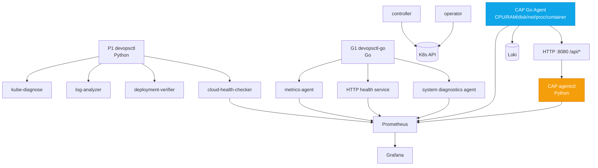
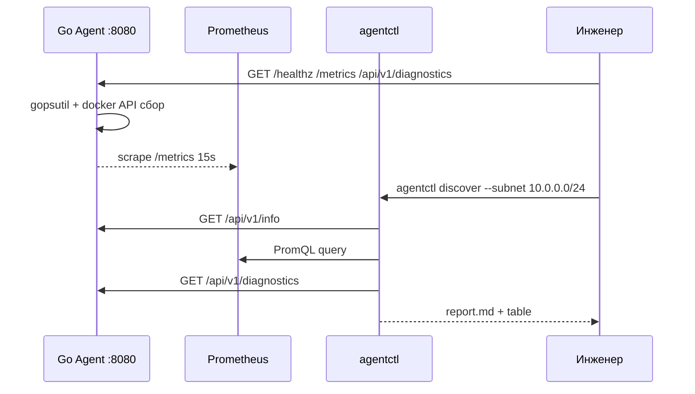
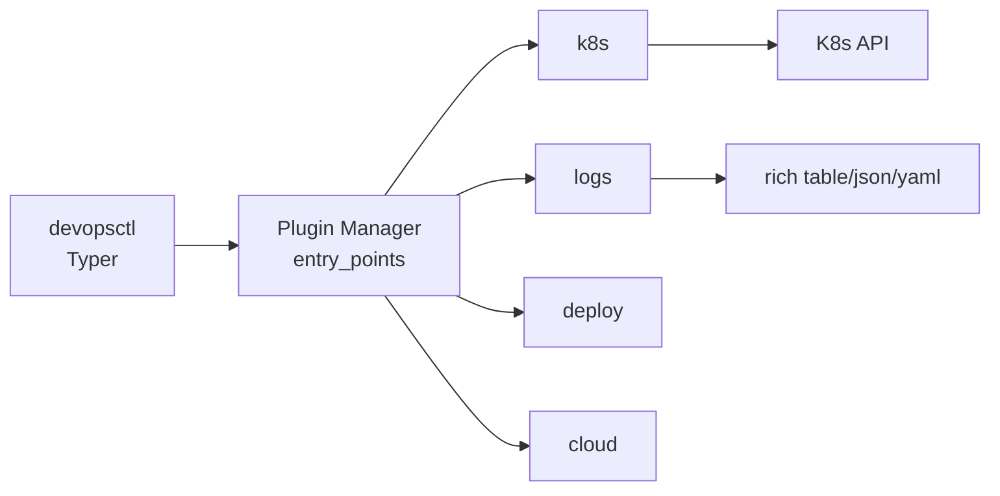
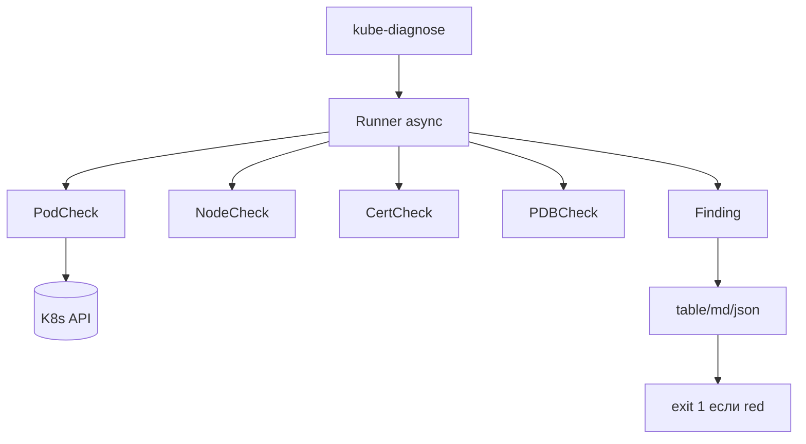
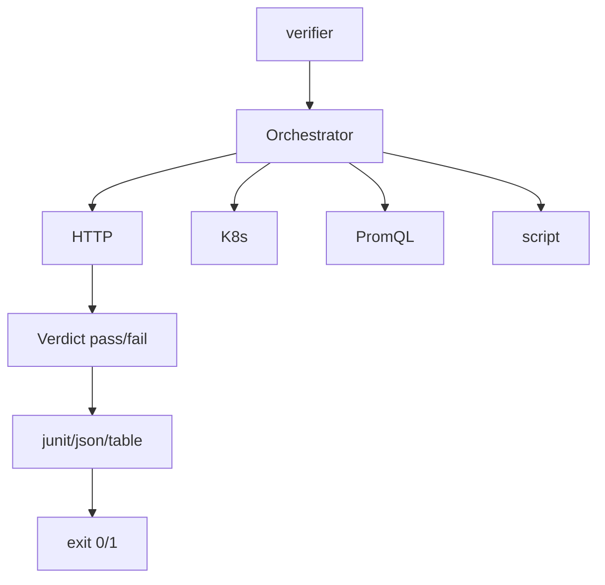
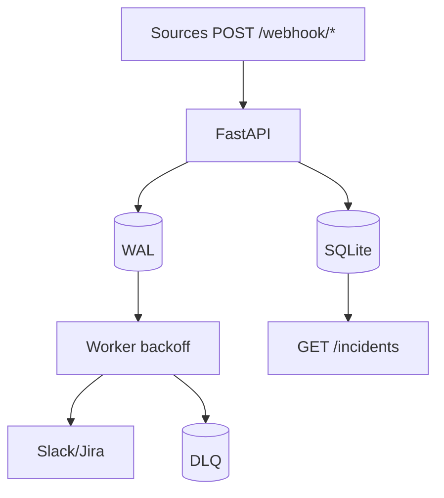
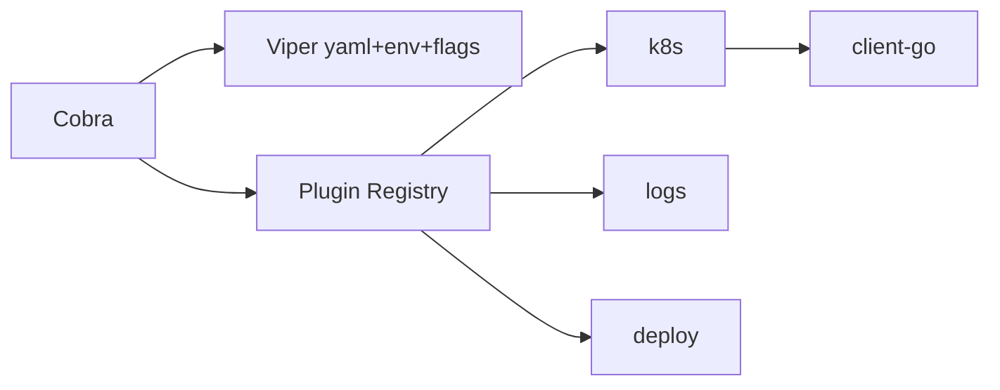
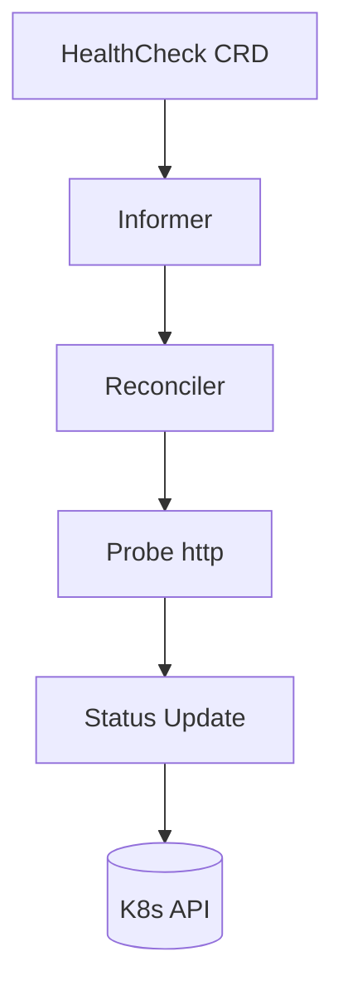
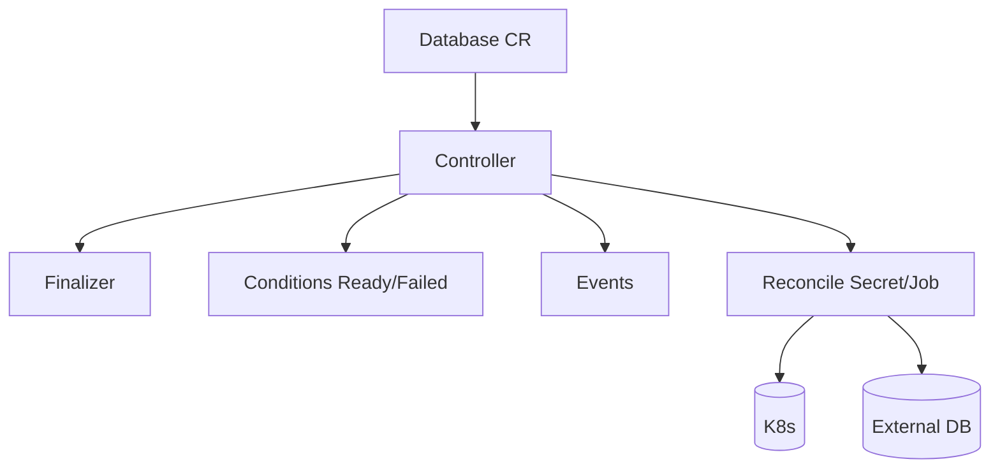
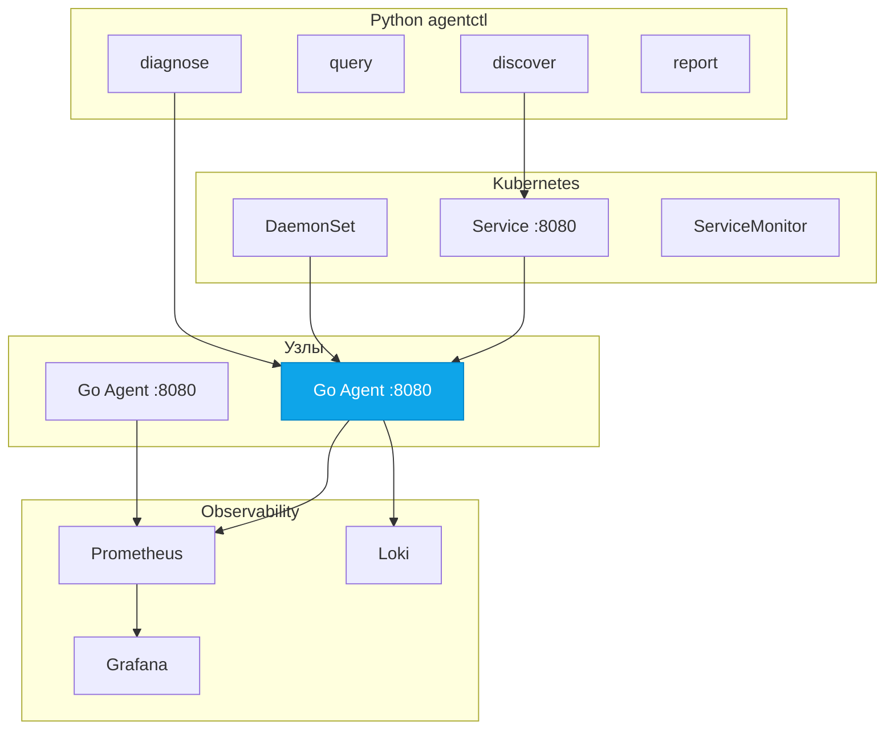

# 🛠️ 03. Мини-проекты Python и Go для Портфолио — Production Grade

> 12+1 проектов уровня production: от CLI-тулкитов до оператора Kubernetes и капстона «агент + CLI». Каждый проект — законченный продукт с архитектурой, тестами, Docker, CI, наблюдаемостью и README. Не «todo-list», а инструменты, которые реально используют DevOps-инженеры. Теория: [01 Python](01-python-for-devops.md), [02 Go](02-go-for-devops.md).

## 📑 Оглавление

- Карта портфолио
- Сквозные стандарты
- Сквозная архитектура
- Python-проекты — P1 devopsctl, P2 kube-diagnose, P3 log-analyzer, P4 deployment-verifier, P5 cloud-health-checker, P6 incident-collector
- Go-проекты — G1 devopsctl-go, G2 metrics-agent, G3 HTTP health service, G4 Kubernetes controller, G5 operator, G6 system diagnostics agent
- Capstone — Go агент + Python agentctl
- Как оформить · Проверь себя

---

## 🗺️ Карта портфолио — 12 + 1 проектов

| № | Проект | Язык | Назначение | Ключевой стек | Сигнал в резюме |
|---|--------|------|------------|---------------|-----------------|
| P1 | **devopsctl** | Python | Единый CLI-тулкит | Typer, rich, pydantic | CLI-дизайн, плагины |
| P2 | **kube-diagnose** | Python | Диагностика K8s | kubernetes-asyncio, typer | K8s API |
| P3 | **log-analyzer** | Python | Анализ логов, аномалии | asyncio, regex, rich | Обработка данных |
| P4 | **deployment-verifier** | Python | Верификация деплоев | httpx, jsonschema, tenacity | Надёжность релизов |
| P5 | **cloud-health-checker** | Python | Health-check 100+ endpoints | asyncio+aiohttp, prometheus_client | Concurrency, антифлап |
| P6 | **incident-collector** | Python | Сбор инцидентов, WAL | FastAPI, httpx, SQLite | Webhook, очереди |
| G1 | **devopsctl-go** | Go | Порт devopsctl на Go | Cobra, Viper, lipgloss | Кроссплатформенность |
| G2 | **metrics-agent** | Go | Сбор CPU/RAM/disk/net | gopsutil, prometheus | Системное прогр. |
| G3 | **HTTP health service** | Go | HTTP /healthz, /metrics | net/http, chi, pprof | HTTP-сервис |
| G4 | **Kubernetes controller** | Go | Контроллер CRD | controller-runtime | K8s-контроллеры |
| G5 | **operator** | Go | Оператор с финализаторами | kubebuilder, OLM | Production-оператор |
| G6 | **system diagnostics agent** | Go | Диагностика узла | gopsutil, cobra | Observability |
| CAP | **Go agent + Python agentctl** | Go+Python | **Капстон** | Go agent + Python CLI | Full-stack DevOps |

| Проект | Handbook-модуль | Вакансия-сигнал |
|---|---|---|
| P1, G1 | 08 Python/Go, 13 Инструменты | Автоматизация |
| P2, G4, G5 | 07 Kubernetes | K8s-автоматизация |
| P3 | 09 Observability, ELK | Логи |
| P4 | 05 CI/CD, 06 GitOps | Прогрессивная доставка |
| P5, G2, G3 | 09 Observability | SRE-мониторинг |
| P6 | 09 Observability, 13 DR | On-call |
| CAP | Всё сразу | SRE + Platform |

---

## 📐 Сквозные стандарты production-grade

Каждый из 12 проектов обязан соответствовать 14 критериям. Чек-лист приёмки:

| № | Аспект | Минимум для зачёта | Как проверить |
|---|--------|-------------------|---------------|
| 1 | **Architecture** | mermaid-диаграмма + компоненты и потоки | `README` содержит `mermaid` |
| 2 | **Requirements** | Функциональные + нефункциональные (perf, SLO) | Таблица в README |
| 3 | **Implementation** | <300 строк/модуль, интерфейсы, SOLID | `golangci-lint` / `ruff` чистый |
| 4 | **Tests** | ≥70% покрытие, unit+integration, моки | `pytest`/`go test` + бейдж |
| 5 | **Logging** | Структурированные JSON-логи, уровни, trace_id | `jq` парсит логи |
| 6 | **Config** | 12-factor: env+YAML+flags, валидация pydantic/Viper | `config.example.yaml` |
| 7 | **CLI** | `--help`, `--version`, `--config`, subcommands, автокомплит | `bin --help` |
| 8 | **Error handling** | Типизированные ошибки, ретраи с backoff | Тест на сетевой сбой |
| 9 | **Packaging** | `pyproject.toml`/`go.mod`, semver, `make build` | `pip install`/`go install` |
| 10 | **Docker** | Multi-stage, <60МБ Python / <25МБ Go, non-root, healthcheck | `docker images`, `dive` |
| 11 | **CI** | GitHub Actions: lint+test+build+docker+security | Бейдж `passing` |
| 12 | **Security** | Non-root, `gosec`/`bandit`/`trivy` чистые, SARIF | Артефакт SARIF |
| 13 | **Observability** | `/metrics` Prometheus, `/healthz`+`/readyz` | `curl /metrics` |
| 14 | **README** | Проблема → GIF → Quick start 3 строки → Архитектура → Ограничения | Ревью 2 мин |

| Уровень | Критерий | Пример |
|---|---|---|
| L1 Учебный | Скрипт работает у автора | `python main.py` |
| L2 Портфолио | L1 + README + Dockerfile | `docker run ghcr.io/you/proj --help` |
| **L3 Production** | **L2 + тесты + CI + метрики + graceful shutdown** | **PR с CI green + Grafana** |
| L4 Хайринговый | L3 + нагрузка + SLI/SLO | 1000 rps в README |

> Цель модуля — довести каждый проект до **L3**, один-два — до L4.

---

## 🏗️ Сквозная архитектура портфолио





---

## 🐍 Python-проекты (6 штук)

---

### 🐍 P1: devopsctl — единый CLI-тулкит DevOps-инженера (Python)

> Заменяет 20 bash-скриптов одним типизированным CLI с плагинами: `devopsctl k8s diagnose`, `devopsctl logs analyze`, `devopsctl deploy verify`. Портфолио-аналог `kubectl`/`gh`.

#### 🏗️ Architecture


#### 📋 Requirements
| Категория | Требование | SLO |
|---|---|---|
| Функциональные | k8s, logs, deploy, cloud, config subcommands | 100% документированы |
| Конфиг | ~/.config/devopsctl/config.yaml + env DEVOPSCTL_* + flags | pydantic валидация |
| Производительность | Старт <300ms, tail 10k строк/сек | p95 <500ms |
| Совместимость | Python 3.11+, Linux/macOS, completion | CI 3.11-3.13 |

#### 🔨 Implementation
```python
from pydantic import BaseSettings, Field
class Settings(BaseSettings):
    kubeconfig: str = Field('~/.kube/config')
    log_level: str = 'info'
```

#### 📦 Production-чеклист (14 аспектов)
| Аспект | Решение |
|---|---|
| **Architecture** | Typer → core → adapters → plugins; Plugin.register(app: Typer) |
| **Requirements** | Таблица выше + SLO старт <300ms |
| **Implementation** | Typer+rich+pydantic+httpx; <300 строк/модуль, SOLID |
| **Tests** | pytest ≥75%, CliRunner golden, kind integration, pytest-cov |
| **Logging** | structlog JSON в проде, rich в dev, trace_id via contextvars |
| **Config** | pyyaml + BaseSettings, merge flags>env>file, config.example.yaml |
| **CLI** | --help иерархический, --version, --config, -o json/yaml/table, completion bash/zsh/fish |
| **Error handling** | Иерархия DevopsctlError, tenacity retry, exit 1/2/3, --debug traceback |
| **Packaging** | pyproject.toml, entry devopsctl=devopsctl.cli:app, pipx install |
| **Docker** | Multi-stage slim, <60МБ, non-root, HEALTHCHECK devopsctl --version |
| **CI** | GitHub Actions: ruff+mypy+pytest+docker+trivy, бейджи |
| **Security** | bandit+pip-audit+trivy чистые, kubeconfig 0600, фильтр секретов в логах |
| **Observability** | Опционально /metrics при watch, devopsctl_command_duration_seconds |
| **README** | Проблема → GIF → 3 строки старт → mermaid → Плагины 50 строк → Ограничения |

**Критерии приёмки:**

- [ ] `pytest`/`go test` зелёный, `ruff`/`golangci-lint` чистый
- [ ] Docker <60МБ Python / <25МБ Go, non-root, `trivy` 0 HIGH
- [ ] `/metrics` и `/healthz` отвечают, README с mermaid и GIF

---

### 🐍 P2: kube-diagnose — диагностика кластера Kubernetes (Python)

> Наследник infra-doctor/kstats на Python: одна команда собирает состояние кластера и выдаёт вердикт red/yellow/green с fix-hints. Плагинная архитектура проверок.

#### 🏗️ Architecture


#### 📋 Requirements
| Категория | Требование | SLO |
|---|---|---|
| Проверки | ≥8: pod restarts, NotReady, cert<14d, PDB, quotas, HPA, disk pressure, failed jobs |  |
| Выход | table (rich), markdown, json, --fix-hints |  |
| Контракт | exit 0 если нет red, 1 если red (cron), 2 ошибка |  |
| Производительность | 200 подов <2с |  |

#### 🔨 Implementation
```python
@dataclass
class Finding:
    check: str
    severity: Severity
```

#### 📦 Production-чеклист (14 аспектов)
| Аспект | Решение |
|---|---|
| **Architecture** | Runner → Checker async run(ctx)->Finding; registry, context с client |
| **Requirements** | 8 чеков, table/md/json, exit коды для CI, <2с на 200 подов |
| **Implementation** | kubernetes-asyncio, tenacity, pydantic, async gather + semaphore |
| **Tests** | Fake client, kind chaos (OOMKilled), json jq фильтр, ≥80% чеков |
| **Logging** | structlog JSON per-check {check, duration_ms, findings} |
| **Config** | kube-diagnose.yaml + env KUBE_DIAGNOSE_*, checks.threshold, fail_on |
| **CLI** | --namespace shop --output table/json, --fix-hints, --watch --interval 30, --checks filter |
| **Error handling** | KubeConfigError, RBAC hint, timeout 10s → YELLOW, tenacity 3× |
| **Packaging** | pyproject.toml, kube-diagnose entry, kubernetes-asyncio |
| **Docker** | slim non-root 65532, ENTRYPOINT kube-diagnose |
| **CI** | pytest+ruff+mypy, kind integration, docker, trivy |
| **Security** | Только get/list/watch, ClusterRole minimal, bandit чистый, no shell=True |
| **Observability** | Опц. :9090/metrics kube_diagnose_findings{severity}, SARIF json |
| **README** | Таблица проверок, вывод с 🔴🟡🟢, ClusterRole YAML, плагин за 50 строк |

**Критерии приёмки:**

- [ ] `pytest`/`go test` зелёный, `ruff`/`golangci-lint` чистый
- [ ] Docker <60МБ Python / <25МБ Go, non-root, `trivy` 0 HIGH
- [ ] `/metrics` и `/healthz` отвечают, README с mermaid и GIF

---

### 🐍 P3: log-analyzer — анализатор логов с детекцией аномалий (Python)

> grep+jq+awk в одном: парсит nginx/json/syslog, строит гистограмму по времени, детектит всплеск 5xx и медленные запросы (z-score). Потоковая обработка 10GB без OOM.

#### 🏗️ Architecture
_CLI → Core → Adapters → Output; плагинная архитектура._

#### 📋 Requirements
| Категория | Требование | SLO |
|---|---|---|
| Парсеры | nginx combined, json, syslog, кастом regex из YAML |  |
| Детекция | Всплеск >3σ, p95>threshold, топ-10 ошибок |  |
| Выход | table, json, html с графиком |  |
| Производительность | 1GB <10с, память <200МБ |  |

#### 🔨 Implementation
```python
NGINX_RE = re.compile(r'(?P<ip>\S+) - - \[(?P<time>[^\]]+)\]')
def parse_line(l):
    m=NGINX_RE.match(l)
    return {'ip':m['ip']} if m else None
```

#### 📦 Production-чеклист (14 аспектов)
| Аспект | Решение |
|---|---|
| **Architecture** | Inputs(file/glob/s3) → Parsers(regex/json) → Normalizer → Pipeline(filter/group/detect) → Reporter |
| **Requirements** | 4 парсера, z-score детекция, html отчёт, 1GB <10с |
| **Implementation** | asyncio+aiofiles chunked, dateutil, rich, typer, YAML паттерны |
| **Tests** | Фикстура 100 строк с аномалией, hypothesis для парсеров, benchmark 1GB |
| **Logging** | JSON {lines, errors, duration_ms}, rich прогресс-бар в интерактиве |
| **Config** | log-analyzer.yaml inputs/parsers/detect, env LOG_ANALYZER_SINCE |
| **CLI** | --file, --glob, --parser nginx, --since 1h, --group-by path, --output html |
| **Error handling** | Битые строки → YELLOW не падают, parse_errors счётчик, regex ConfigError |
| **Packaging** | pyproject.toml extras [s3] boto3, entry log-analyzer |
| **Docker** | slim non-root, <60МБ, HEALTHCHECK |
| **CI** | ruff+mypy+pytest-cov+bandit+trivy+benchmark |
| **Security** | Нет eval, regex лимит, S3 IAM role, bandit чистый |
| **Observability** | --serve :9090 log_analyzer_lines, log_analyzer_anomalies, JSON → Loki |
| **README** | Проблема → table с аномалией → Quick start → YAML паттерны → Бенчмарк |

**Критерии приёмки:**

- [ ] `pytest`/`go test` зелёный, `ruff`/`golangci-lint` чистый
- [ ] Docker <60МБ Python / <25МБ Go, non-root, `trivy` 0 HIGH
- [ ] `/metrics` и `/healthz` отвечают, README с mermaid и GIF

---

### 🐍 P4: deployment-verifier — верификация деплоев (Python)

> Пост-деплой чек после helm upgrade/kubectl rollout: HTTP /healthz, rollout status, PromQL error_rate, smoke.sh. Фейлит CI если не прошло.

#### 🏗️ Architecture


#### 📋 Requirements
| Категория | Требование | SLO |
|---|---|---|
| Checks | http(status+jsonpath), k8s(readyReplicas), promql(lt), script |  |
| Интеграция | Вызов из CI, exit 1 фейлит пайплайн |  |
| Выход | junit.xml, json, table |  |
| Тайминги | retries 5, interval 10s, timeout 120s |  |

#### 🔨 Implementation
```python
import httpx, jsonpath_ng
async def http_check(spec):
    async with httpx.AsyncClient(timeout=5) as c:
        r=await c.get(spec['url'])
```

#### 📦 Production-чеклист (14 аспектов)
| Аспект | Решение |
|---|---|
| **Architecture** | Orchestrator → checks (http/k8s/promql/script) → Verdict → Reporter(junit/json/table) |
| **Requirements** | 4 типа чеков, junit для CI, ретраи, jsonschema валидация |
| **Implementation** | httpx async, kubernetes-asyncio, prometheus_api_client, tenacity backoff |
| **Tests** | respx моки, fake k8s, prometheus stub, docker-compose httpbin, kind e2e |
| **Logging** | JSON per-check {check, attempt, status, retry_in}, rich прогресс |
| **Config** | verifier.yaml checks[] + timeout/retries, env VERIFIER_CONFIG, jsonschema |
| **CLI** | --config verifier.yaml --wait 120 --output table/junit, --check filter, --dry-run |
| **Error handling** | Timeout FAIL detail, сетевой ретрай, PromQL ConfigError на старте |
| **Packaging** | pyproject.toml, httpx tenacity pyyaml jsonschema |
| **Docker** | Multi-stage slim non-root, ENTRYPOINT deployment-verifier |
| **CI** | pytest+ruff+mypy+docker+trivy, Actions snippet в README |
| **Security** | Фильтр Authorization в логах, bandit, script таймаут sandbox |
| **Observability** | --serve /metrics verifier_check_duration, verifier_success, Loki |
| **README** | Проблема → verifier.yaml пример → 3 строки старт → mermaid → CI интеграция |

**Критерии приёмки:**

- [ ] `pytest`/`go test` зелёный, `ruff`/`golangci-lint` чистый
- [ ] Docker <60МБ Python / <25МБ Go, non-root, `trivy` 0 HIGH
- [ ] `/metrics` и `/healthz` отвечают, README с mermaid и GIF

---

### 🐍 P5: cloud-health-checker — мульти-провайдерный health-checker (Python)

> Наследник healthcheck-cluster: asyncio+aiohttp 100+ таргетов за <2с, гистерезис up→degraded 2 фейла →down 5, Prometheus /metrics, webhook алерты. Расширен до TCP/gRPC/cloud.

#### 🏗️ Architecture
```mermaid
graph TD
    C[targets.yaml] --> S[Scheduler asyncio]
    S --> W[Workers aiohttp+tcp]
    W --> ST[State up/degraded/down]
    ST --> H[History] & A[Alerts webhook] & M[/metrics]
```

#### 📋 Requirements
| Категория | Требование | SLO |
|---|---|---|
| Таргеты | HTTP(S), TCP, DNS, gRPC, cloud ELB | 100+ таргетов |
| Антифлап | Гистерезис 2/5, recover 3 | 1 сбой ≠ алерт |
| Метрики | healthcheck_up, latency histogram, state | Prometheus |
| Алёрты | Webhook/Slack/PagerDuty retry | at-least-once |

#### 🔨 Implementation
```python
class TargetState:
    def record(self, ok):
        if ok:
            self.failures=0; self.success+=1
```

#### 📦 Production-чеклист (14 аспектов)
| Аспект | Решение |
|---|---|
| **Architecture** | Scheduler → Workers(aiohttp Semaphore 100) → StateMachine → History → Alerts → Prometheus |
| **Requirements** | 5 типов таргетов, антифлап 2/5/3, histogram, webhook |
| **Implementation** | asyncio+aiohttp TCPConnector 100, prometheus_client, signal SIGTERM graceful |
| **Tests** | TargetState переходы unit, aiohttp test server, 100 таргетов <2с benchmark |
| **Logging** | JSON {target, state, latency_ms, attempt, prev_state}, debug per-probe |
| **Config** | targets.yaml targets[] + webhook + prometheus + state thresholds, env HEALTHCHECK_* |
| **CLI** | --config targets.yaml --interval 30, --once --output json, --serve :9090, --validate |
| **Error handling** | Timeout 5s retry 1× jitter, webhook очередь memory+disk backoff |
| **Packaging** | pyproject.toml aiohttp prometheus_client pyyaml |
| **Docker** | Multi-stage slim <60МБ non-root, EXPOSE 9090, HEALTHCHECK wget /healthz |
| **CI** | pytest-cov+ruff+mypy+docker+trivy+compose demo prometheus+httpbin |
| **Security** | TLS verify, bandit, webhook env secret, read-only rootfs |
| **Observability** | /metrics healthcheck_up{target}, latency, state, /healthz self |
| **README** | GIF 100 таргетов, targets.yaml, mermaid, антифлап диаграмма, PromQL примеры |

**Критерии приёмки:**

- [ ] `pytest`/`go test` зелёный, `ruff`/`golangci-lint` чистый
- [ ] Docker <60МБ Python / <25МБ Go, non-root, `trivy` 0 HIGH
- [ ] `/metrics` и `/healthz` отвечают, README с mermaid и GIF

---

### 🐍 P6: incident-collector — сборщик инцидентов и нотификаций (Python)

> Приёмник вебхуков Alertmanager/PagerDuty: нормализация в Incident, WAL append-only, delivery с backoff+jitter, DLQ, SQLite/Postgres. Наследник webhook-relay на Python.

#### 🏗️ Architecture


#### 📋 Requirements
| Категория | Требование | SLO |
|---|---|---|
| Приём | Любой POST → pydantic, 202 сразу |  |
| Доставка | Backoff+jitter max 10, DLQ, порядок |  |
| Хранение | SQLite default, Postgres опц. |  |
| API | GET /incidents?since&severity, /metrics, /healthz |  |

#### 🔨 Implementation
```python
class Incident(BaseModel):
    id:str; source:str; severity:str
    title:str; timestamp:datetime
async def append_wal(i, path='data/wal.log'):
```

#### 📦 Production-чеклист (14 аспектов)
| Аспект | Решение |
|---|---|
| **Architecture** | FastAPI /webhook/* → WAL(aiofiles) → Queue → Worker(exponential backoff) → Targets/DLQ → DB |
| **Requirements** | Нормализация, 202 ack, WAL fsync, DLQ, query API |
| **Implementation** | FastAPI+uvicorn, pydantic, httpx, aiofiles, prometheus_client |
| **Tests** | Incident валидация, WAL restore, respx mock, kill -9 0 потерь, TestClient |
| **Logging** | JSON {incident_id, source, attempt, backoff, target}, X-Request-Id trace |
| **Config** | collector.yaml server/wal/delivery/targets/db, env COLLECTOR_* |
| **CLI** | --config --port 8080, incidents list --since 1h, dlq list/retry |
| **Error handling** | 422 валидация, 5xx ретрай 4xx→DLQ, WAL fsync restore при старте |
| **Packaging** | pyproject.toml fastapi uvicorn httpx aiofiles |
| **Docker** | slim non-root, VOLUME /data, EXPOSE 8080, HEALTHCHECK /healthz |
| **CI** | pytest TestClient, ruff+mypy, docker, trivy, compose mock-receiver |
| **Security** | X-API-Key опц., slowapi rate limit, bandit, trivy, без секретов в WAL |
| **Observability** | /metrics incidents_received/delivered/dlq, queue_depth, Loki trace |
| **README** | curl POST пример, docker-compose, WAL гарантия, 1000 rps тест |

**Критерии приёмки:**

- [ ] `pytest`/`go test` зелёный, `ruff`/`golangci-lint` чистый
- [ ] Docker <60МБ Python / <25МБ Go, non-root, `trivy` 0 HIGH
- [ ] `/metrics` и `/healthz` отвечают, README с mermaid и GIF

---

## 🐹 Go-проекты (6 штук)

---

### 🐹 G1: devopsctl-go — единый CLI-тулкит на Go (Go)

> Порт devopsctl на Go: кроссплатформенность, старт <50ms, single-binary. Совместим по командам и конфигам с Python-версией.

#### 🏗️ Architecture


#### 📋 Requirements
| Категория | Требование | SLO |
|---|---|---|
| CLI | Совместимость с Python по флагам | 100% паритет |
| Производительность | Старт <50ms, бинарник <25МБ | time |
| Сборка | linux/darwin/windows × amd64/arm64 goreleaser | 6 артефактов |
| Конфиг | ~/.config/devopsctl-go/config.yaml Viper |  |

#### 🔨 Implementation
```go
type Plugin interface{ Name() string; Register(*cobra.Command) }
type Config struct{
    Kubeconfig string `mapstructure:"kubeconfig" validate:"required"`
    LogLevel string `mapstructure:"log_level"`
```

#### 📦 Production-чеклист (14 аспектов)
| Аспект | Решение |
|---|---|
| **Architecture** | cmd/Cobra → internal/core → adapters → pkg/plugins, Viper flags>env>file>defaults |
| **Requirements** | 4 команды паритет, <50ms, 6 платформ goreleaser |
| **Implementation** | spf13/cobra+viper+charmbracelet/lipgloss, validator |
| **Tests** | go test cover, fake clientset, bats e2e, golangci-lint |
| **Logging** | slog JSON handler прод, tint dev, fields trace_id plugin duration_ms |
| **Config** | config.example.yaml, env DEVOPSCTL_KUBECONFIG, validator |
| **CLI** | --help, k8s diagnose --namespace prod, logs analyze, completion bash |
| **Error handling** | fmt.Errorf %w, errors.Is/As, SilenceUsage, cenkalti/backoff |
| **Packaging** | go.mod, CGO_ENABLED=0, ldflags -s -w, Makefile, goreleaser |
| **Docker** | Multi-stage golang alpine → distroless static:nonroot <25МБ |
| **CI** | setup-go, golangci-lint, go test -race, goreleaser snapshot, trivy |
| **Security** | gosec+govulncheck+trivy, CGO 0, nonroot, без секретов в логах |
| **Observability** | --serve /metrics devopsctl_go_duration, pprof --pprof |
| **README** | Установка go install/brew/docker, Quick start, mermaid, Python vs Go |

**Критерии приёмки:**

- [ ] `pytest`/`go test` зелёный, `ruff`/`golangci-lint` чистый
- [ ] Docker <60МБ Python / <25МБ Go, non-root, `trivy` 0 HIGH
- [ ] `/metrics` и `/healthz` отвечают, README с mermaid и GIF

---

### 🐹 G2: metrics-agent — лёгкий сборщик метрик хоста (Go)

> Минималистичный агент CPU/RAM/disk/network → Prometheus /metrics. Без зависимостей, <15МБ, для bare-metal и VM.

#### 🏗️ Architecture
_CLI → Core → Adapters → Output; плагинная архитектура._

#### 📋 Requirements
| Категория | Требование | SLO |
|---|---|---|
| Метрики | node_cpu, memory, disk, network, load1 |  |
| HTTP | GET /metrics /healthz /readyz p95 <10ms |  |
| Ресурсы | <20МБ RAM <1% CPU idle <15МБ bin |  |
| Конфиг | agent.yaml + env + flags Viper |  |

#### 🔨 Implementation
```go
type CPUCollector struct{ gauge *prometheus.GaugeVec }
func (c *CPUCollector) Collect() error {
    p,_:=cpu.Percent(0,false)
    c.gauge.WithLabelValues("total").Set(p[0])
```

#### 📦 Production-чеклист (14 аспектов)
| Аспект | Решение |
|---|---|
| **Architecture** | Collectors(gopsutil cpu/mem/disk/net/host) → Prometheus Registry → HTTP :9100/metrics |
| **Requirements** | 5 метрик, 3 endpoints, <20МБ, Viper конфиг |
| **Implementation** | gopsutil, prometheus/client_golang, slog JSON, graceful SIGTERM |
| **Tests** | Мок gopsutil интерфейс, httptest /metrics, promtool check, docker curl |
| **Logging** | slog JSON {collector, duration_ms, trace_id}, LOG_LEVEL |
| **Config** | agent.yaml server/collectors, env METRICS_AGENT_ADDR |
| **CLI** | --config agent.yaml --addr :9100, --version, curl /metrics|grep node_cpu |
| **Error handling** | Ошибка collector → лог не крашит остальных, /readyz 503 если failing >1m, timeout 5s |
| **Packaging** | go.mod CGO_ENABLED=0 ldflags -X version, Makefile |
| **Docker** | golang alpine → distroless nonroot <15МБ, EXPOSE 9100, HEALTHCHECK |
| **CI** | go test -race -cover, golangci-lint, govulncheck, promtool, trivy |
| **Security** | gosec чистый, non-root, readOnlyRootFS, no-new-privileges, trivy 0 HIGH |
| **Observability** | Self metrics agent_scrape_duration, agent_collector_errors, pprof :6060 |
| **README** | Проблема → docker run → таблица метрик → docker-compose Prometheus+Grafana |

**Критерии приёмки:**

- [ ] `pytest`/`go test` зелёный, `ruff`/`golangci-lint` чистый
- [ ] Docker <60МБ Python / <25МБ Go, non-root, `trivy` 0 HIGH
- [ ] `/metrics` и `/healthz` отвечают, README с mermaid и GIF

---

### 🐹 G3: HTTP health service — HTTP-сервис проверки здоровья (Go)

> Production-grade шаблон Go-микросервиса: /healthz, /readyz, /metrics, graceful shutdown, structured logs, pprof.

#### 🏗️ Architecture
```mermaid
graph TD
    LB[LB] --> H[chi :8080]
    H --> H1[/healthz] & H2[/readyz] & H3[/metrics] & H4[/api/*]
    H2 --> D[DB/cache checks]
    H --> M[Middleware logging+metrics]
```

#### 📋 Requirements
| Категория | Требование | SLO |
|---|---|---|
| Endpoints | /healthz 200, /readyz 200/503, /metrics, /debug/pprof p95 <5ms |  |
| Shutdown | SIGTERM drain 30s 0 dropped |  |
| Логи | JSON trace_id X-Request-Id |  |
| Конфиг | config.yaml+env+flags Viper |  |

#### 🔨 Implementation
```go
r:=chi.NewRouter()
r.Use(middleware.RequestID, middleware.Recoverer, promMiddleware)
r.Get("/healthz", func(w http.ResponseWriter,r *http.Request){w.Write([]byte("ok"))})
r.Get("/readyz", readinessHandler) // checkDB
```

#### 📦 Production-чеклист (14 аспектов)
| Аспект | Решение |
|---|---|
| **Architecture** | net/http+chi, prometheus, slog, middleware chain, graceful shutdown 30s WaitGroup |
| **Requirements** | 4 endpoints, drain 30s, JSON logs, Viper |
| **Implementation** | chi, prometheus, slog, signal.NotifyContext, context timeout |
| **Tests** | httptest /healthz /readyz 503, middleware, hey нагрузка, SIGTERM 0 dropped |
| **Logging** | slog JSON middleware {method, path, status, duration_ms, trace_id}, X-Request-Id gen |
| **Config** | config.yaml server/readiness/log_level, env HEALTH_ADDR |
| **CLI** | --config --addr :8080, curl /healthz /readyz /metrics /debug/pprof |
| **Error handling** | recover → 500 + stack, readiness 503 Retry-After, healthz всегда 200 |
| **Packaging** | go.mod CGO 0 ldflags -X version, Makefile, goreleaser |
| **Docker** | distroless non-root, EXPOSE 8080, HEALTHCHECK wget /healthz |
| **CI** | go test -race, golangci-lint, govulncheck, hey load, trivy |
| **Security** | gosec, non-root, readOnlyRootFS, seccomp, pprof только ENABLE_PPROF |
| **Observability** | http_requests_total, http_duration, go_*, process_*, Loki trace |
| **README** | Проблема → go run → Endpoints таблица → mermaid → graceful диаграмма |

**Критерии приёмки:**

- [ ] `pytest`/`go test` зелёный, `ruff`/`golangci-lint` чистый
- [ ] Docker <60МБ Python / <25МБ Go, non-root, `trivy` 0 HIGH
- [ ] `/metrics` и `/healthz` отвечают, README с mermaid и GIF

---

### 🐹 G4: Kubernetes controller — контроллер для кастомного ресурса (Go)

> Контроллер для CRD HealthCheck: spec {url, interval} → probe → status {state, lastCheck} с антифлапом и requeueAfter.

#### 🏗️ Architecture


#### 📋 Requirements
| Категория | Требование | SLO |
|---|---|---|
| CRD | HealthCheck spec.url interval status.state up/degraded/down |  |
| Reconcile | Probe каждые interval антифлап 2/5 requeueAfter |  |
| RBAC | get/list/watch/update healthchecks, get pods |  |
| Тесты | envtest + fake client make test |  |

#### 🔨 Implementation
```go
type HealthCheckSpec struct{ URL string `json:"url"`; Interval string `json:"interval"` }
func (r *Reconciler) Reconcile(ctx context.Context, req ctrl.Request) (ctrl.Result, error) {
    var hc opsv1.HealthCheck; r.Get(ctx, req.NamespacedName, &hc)
    ok,msg:=r.probe(hc.Spec.URL)
```

#### 📦 Production-чеклист (14 аспектов)
| Аспект | Решение |
|---|---|
| **Architecture** | kubebuilder/controller-runtime, HealthCheck CRD, Reconciler probe→status→requeueAfter |
| **Requirements** | CRD spec/status, антифлап, RBAC minimal, envtest |
| **Implementation** | controller-runtime Manager, client-go, prometheus healthcheck_state |
| **Tests** | fake client+httptest Reconcile, envtest create CR→status, kind e2e |
| **Logging** | logr JSON {healthcheck, state, duration_ms}, Reconcile ID |
| **Config** | manager.yaml env INTERVAL_DEFAULT, --metrics :8080 --health :8081 |
| **CLI** | make run, make deploy IMG=ghcr.io/you/controller:0.1.0, kubectl apply samples |
| **Error handling** | probe timeout 5s → status.message, Update conflict retry.OnConflict, recover Requeue |
| **Packaging** | go.mod controller-runtime, Makefile build/docker-build/deploy, Dockerfile kubebuilder |
| **Docker** | golang → distroless nonroot <30МБ, USER 65532 |
| **CI** | make test envtest, golangci-lint, docker, trivy, kind e2e |
| **Security** | RBAC minimal, gosec+trivy, nonroot, readOnlyRootFS |
| **Observability** | controller_runtime_reconcile_total, healthcheck_state, /metrics /healthz |
| **README** | CRD пример, make deploy, mermaid Reconcile, kubectl get пример |

**Критерии приёмки:**

- [ ] `pytest`/`go test` зелёный, `ruff`/`golangci-lint` чистый
- [ ] Docker <60МБ Python / <25МБ Go, non-root, `trivy` 0 HIGH
- [ ] `/metrics` и `/healthz` отвечают, README с mermaid и GIF

---

### 🐹 G5: operator — полноценный Kubernetes-оператор (Go)

> Расширение G4 до оператора с финализаторами, Conditions, Events, OLM. Database CR → Secret+Job+Service, финализатор чистит внешний ресурс.

#### 🏗️ Architecture


#### 📋 Requirements
| Категория | Требование | SLO |
|---|---|---|
| CRD | Database spec.engine/version/size status.conditions phase |  |
| Финализаторы | Блокируют удаление пока не удалён внешний ресурс |  |
| События | Recorder.Event Normal/Warning |  |
| OLM | bundle+scorecard проходят CSV |  |

#### 🔨 Implementation
```go
type DatabaseSpec struct{ Engine string `json:"engine"`; Version string `json:"version"` }
func (r *Reconciler) Reconcile(ctx context.Context, req ctrl.Request) (ctrl.Result, error) {
    if db.DeletionTimestamp.IsZero(){
        controllerutil.AddFinalizer(&db, finalizer)
```

#### 📦 Production-чеклист (14 аспектов)
| Аспект | Решение |
|---|---|
| **Architecture** | kubebuilder, Database CRD, Finalizer, Conditions meta.SetStatusCondition, Events, OLM bundle |
| **Requirements** | Database CR, финализатор, Conditions Ready, Events, OLM CSV |
| **Implementation** | controllerutil, apimeta, record.EventRecorder, provision/deleteExternal |
| **Tests** | fake client финализатор, envtest Secret+Conditions, scorecard make bundle |
| **Logging** | logr JSON {database, phase}, Events в kubectl describe |
| **Config** | manager.yaml env, RBAC databases+secrets+jobs+events, ClusterRole |
| **CLI** | make install, make run, make deploy, kubectl wait --for=condition=Ready |
| **Error handling** | provision err → RequeueAfter 10s Condition Failed Event Warning, delete err → Requeue no remove |
| **Packaging** | Makefile, Dockerfile, bundle/OLM, go.mod, goreleaser manager |
| **Docker** | distroless <30МБ nonroot USER 65532 |
| **CI** | make test envtest, bundle, scorecard, golangci-lint, kind e2e, trivy |
| **Security** | RBAC minimal, gosec+trivy, nonroot seccomp, Secret токен не в логах |
| **Observability** | controller_runtime_reconcile_total, database_phase, /metrics /healthz, kube-state-metrics |
| **README** | CRD пример, make deploy, mermaid финализатор, OLM bundle, Ограничения |

**Критерии приёмки:**

- [ ] `pytest`/`go test` зелёный, `ruff`/`golangci-lint` чистый
- [ ] Docker <60МБ Python / <25МБ Go, non-root, `trivy` 0 HIGH
- [ ] `/metrics` и `/healthz` отвечают, README с mermaid и GIF

---

### 🐹 G6: system diagnostics agent — агент системной диагностики (Go)

> Go-версия infra-doctor: агент на узле собирает df/fd/systemd/conntrack/certs/K8s → /metrics + /api/v1/diagnostics. Плагинная архитектура чеков.

#### 🏗️ Architecture
_CLI → Core → Adapters → Output; плагинная архитектура._

#### 📋 Requirements
| Категория | Требование | SLO |
|---|---|---|
| Чеки | ≥8: диски fd systemd conntrack certs K8s PDB memory custom |  |
| API | GET /api/v1/diagnostics?format, /metrics /healthz /readyz |  |
| Плагины | Один файл checks/mycheck.go + регистрация |  |
| Производительность | Все чеки <2с read-only |  |

#### 🔨 Implementation
```go
type Checker interface{ Name() string; Check(context.Context) ([]Finding,error) }
type Finding struct{ Check string; Severity Severity; Title string; Hint string; Fix string }
func (c *DiskCheck) Check(ctx context.Context) ([]Finding,error){
    u,_:=disk.UsageWithContext(ctx, "/var")
```

#### 📦 Production-чеклист (14 аспектов)
| Аспект | Решение |
|---|---|
| **Architecture** | Runner parallel checks → Finding red/yellow/green → HTTP /api + /metrics + JSON logs, registry |
| **Requirements** | 8 чеков, 4 endpoints, плагин 50 строк, <2с read-only |
| **Implementation** | gopsutil, client-go, prometheus, slog, chi, interface Checker |
| **Tests** | Моки /proc systemctl disk stub, docker systemd mock, custom plugin register тест |
| **Logging** | slog JSON {check, severity, duration_ms, findings}, trace_id per-request |
| **Config** | diagnostics.yaml server/checks threshold, env DIAG_ADDR |
| **CLI** | --config diagnostics.yaml --addr :9101, curl /api/v1/diagnostics, --check disk --output json |
| **Error handling** | Чек timeout 5s → YELLOW, permission → YELLOW hint --allow-privileged |
| **Packaging** | go.mod CGO 0 ldflags, Makefile, goreleaser |
| **Docker** | alpine/distroless nonroot EXPOSE 9101, gopsutil без внешних утилит |
| **CI** | go test -race, golangci-lint, govulncheck, kind e2e, trivy |
| **Security** | Read-only, gosec, non-root, no-new-privileges, trivy, ClusterRole read-only |
| **Observability** | /metrics diagnostics_findings{check,severity}, diagnostics_duration, Loki |
| **README** | Таблица чеков, docker run, mermaid, плагин 50 строк, curl примеры |

**Критерии приёмки:**

- [ ] `pytest`/`go test` зелёный, `ruff`/`golangci-lint` чистый
- [ ] Docker <60МБ Python / <25МБ Go, non-root, `trivy` 0 HIGH
- [ ] `/metrics` и `/healthz` отвечают, README с mermaid и GIF

---

## 🚀 Capstone-проект: система мониторинга Go agent + Python agentctl

> Финальный проект, объединяющий всё: Go-агент на каждом узле собирает CPU/RAM/disk/network/processes/containers → Prometheus-метрики + structured JSON-логи + HTTP API с health endpoints и graceful shutdown → Docker → Kubernetes DaemonSet. Python CLI `agentctl` дискаверит агентов, опрашивает метрики, запускает диагностики и экспортирует отчёт.

### 🎯 Цель капстона

Показать **full-stack DevOps**: системное программирование (Go) + K8s + observability + CLI (Python) + CI/CD. Один репозиторий, два языка, один пайплайн.

### 🏗️ Architecture — Capstone




### 📋 Requirements — Capstone

| Категория | Требование | SLO |
|---|---|---|
| **Go agent сбор** | CPU per-core/total, RAM, disk per mount+inode, network per iface, processes top10, containers docker/containerd | 10s, <5ms/collector |
| **Prometheus** | `/metrics` HELP/TYPE, histogram agent_collect_duration_seconds | promtool check |
| **Логи** | Structured JSON slog, уровни, trace_id | jq |
| **HTTP API** | `/healthz` 200, `/readyz` 200/503, `/metrics`, `/api/v1/metrics`, `/api/v1/diagnostics`, `/api/v1/info` | p95 <20ms |
| **Graceful shutdown** | SIGTERM drain 30s 0 dropped | hey |
| **Docker** | Multi-stage distroless non-root HEALTHCHECK <25МБ | dive |
| **Kubernetes** | DaemonSet+Service+ServiceMonitor+ConfigMap readOnlyRootFS | kubectl apply -f k8s/ |
| **agentctl discover** | K8s + subnet scan asyncio+httpx 100 узлов <5с | |
| **agentctl query/diagnose/report** | GET /api/v1/* + PromQL, md/json/html | |

### 🔨 Implementation — Go agent

```go
type Collector interface { Name() string; Collect(context.Context) error; Metrics() []prometheus.Collector }
type CPUCollector struct { total *prometheus.GaugeVec }
func (c *CPUCollector) Collect(ctx context.Context) error {
    percents, _ := cpu.PercentWithContext(ctx, 0, true)
    avg:=0.0; for _,p:=range percents{avg+=p}; avg/=float64(len(percents))
    c.total.WithLabelValues("total").Set(avg); return nil
}
func main(){
    reg:=prometheus.NewRegistry()
    collectors:=[]Collector{NewCPUCollector(reg), NewMemCollector(reg), NewDiskCollector(reg), NewNetCollector(reg), NewProcessCollector(reg), NewContainerCollector(reg)}
    ctx,stop:=signal.NotifyContext(context.Background(), syscall.SIGTERM, syscall.SIGINT); defer stop()
    go func(){ ticker:=time.NewTicker(10*time.Second); for{ select{ case <-ticker.C: for _,c:=range collectors{ c.Collect(ctx)}; case <-ctx.Done(): return } } }()
    srv:=server.New(cfg, logger, reg); server.Run(ctx, srv)
}
```

```go
r:=chi.NewRouter()
r.Use(middleware.RequestID, middleware.Recoverer, promMiddleware)
r.Get("/healthz", func(w http.ResponseWriter,r *http.Request){ json.NewEncoder(w).Encode(map[string]string{"status":"ok"}) })
r.Get("/readyz", func(w http.ResponseWriter,r *http.Request){ if !ready(){ http.Error(w,`{"status":"not ready"}`,503); return } })
r.Handle("/metrics", promhttp.HandlerFor(reg, promhttp.HandlerOpts{}))
r.Get("/api/v1/metrics", handleMetricsJSON)
```

### 🔨 Implementation — Python agentctl

```python
import typer, httpx, asyncio
from rich.console import Console
app = typer.Typer(help="CLI для Go-агентов")
@app.command()
def discover(subnet: str = typer.Option("10.0.0.0/24"), k8s: bool = True, output: str = "table"):
    agents=[]
    if k8s: agents+=discover_via_k8s()
    agents+=asyncio.run(scan_subnet(subnet))
    render(agents, output)
async def scan_subnet(subnet: str):
    import ipaddress
    net=ipaddress.ip_network(subnet)
    async with httpx.AsyncClient(timeout=2) as c:
        return [str(ip) for ip,ok in zip(net.hosts(), await asyncio.gather(*[probe(c,str(ip)) for ip in net.hosts()])) if ok]
def discover_via_k8s():
    from kubernetes import client, config
    config.load_kube_config(); v1=client.CoreV1Api()
    eps=v1.read_namespaced_endpoints("go-agent","monitoring")
    return [f"{a.ip}:8080" for s in eps.subsets for a in s.addresses]
@app.command()
def diagnose(agent: str = "", full: bool = False, output: str = "table"):
    agents=discover_all() if not agent else [agent]
    results=asyncio.run(gather_diagnostics(agents, full))
    render_diagnostics(results, output)
    if any(r["severity"]=="red" for r in results): raise typer.Exit(1)
```

### 🧪 Tests — Capstone

| Компонент | Тесты | Команда |
|---|---|---|
| Go collectors | Мок gopsutil, httptest /metrics | `go test ./... -race -cover` |
| Go HTTP | httptest /healthz /readyz /api/* | `go test -tags=integration` |
| agentctl | pytest+respx, CliRunner | `pytest --cov=agentctl --cov-fail-under=70` |
| E2E | docker-compose agent+prom+agentctl | `make e2e` |
| K8s E2E | kind + kubectl apply -f k8s/ | `make k8s-e2e` |

```bash
go test ./... -race -coverprofile=cover.out; golangci-lint run; promtool check metrics <(curl -s localhost:8080/metrics)
pytest --cov=agentctl --cov-fail-under=70; ruff check .; mypy agentctl
docker-compose -f capstone/docker-compose.yml up -d && agentctl discover --subnet 172.20.0.0/24
```

### 📝 Logging — Capstone

```json
{"ts":"2026-08-28T10:00:00Z","level":"info","msg":"collect tick","collector":"cpu","duration_ms":3,"trace_id":"abc123"}
{"level":"info","msg":"http request","method":"GET","path":"/api/v1/diagnostics","status":200,"duration_ms":12,"trace_id":"abc123"}
```

Go slog JSON прод, tint dev, trace_id X-Request-Id. Python rich интерактив, --output json.

### ⚙️ Config — Capstone

```yaml
# Go agent config.yaml
server: { addr: ":8080", shutdown_timeout: 30s }
collectors:
  cpu: { enabled: true, interval: 10s }
  disk: { enabled: true, paths: ["/", "/var"], inode: true }
  net: { enabled: true }
  process: { enabled: true, top_n: 10 }
  container: { enabled: true, runtime: "auto" }
log_level: info
# Python agentctl.yaml
discovery: { k8s: {enabled: true, namespace: monitoring, service: go-agent}, subnet: "10.0.0.0/24" }
prometheus: { url: "http://prometheus:9090" }
```

Env AGENT_ADDR, AGENTCTL_PROMETHEUS_URL; validator + pydantic, --validate.

### 💻 CLI — Capstone

```bash
go-agent --config config.yaml --addr :8080
curl localhost:8080/healthz | jq
curl localhost:8080/metrics | head
curl localhost:8080/api/v1/diagnostics?full=true | jq
agentctl discover --subnet 10.0.0.0/24 --output table
agentctl discover --k8s --output json | jq
agentctl query --agent 10.0.0.5:8080
agentctl diagnose --agent 10.0.0.5:8080 --full --output table
agentctl report --output report.md --format markdown
```

### 🚨 Error handling — Capstone

| Ошибка | Go agent | Python agentctl |
|---|---|---|
| Collector timeout | context 5s → log error metric agent_collector_errors | — |
| Docker недоступен | YELLOW finding warn | — |
| HTTP 5xx | 503 Retry-After slog | tenacity retry 3× |
| K8s discover fail | — | fallback subnet hint kubectl auth can-i |
| SIGTERM | Shutdown 30s WaitGroup | SIGINT CancelledError |

### 📦 Packaging — Capstone

```toml
# go.mod
module github.com/you/monitoring-agent
go 1.22
require (github.com/shirou/gopsutil/v4 v4.24.0; github.com/prometheus/client_golang v1.19.0)
# pyproject.toml
[project]
name = "agentctl"
version = "0.3.0"
dependencies = ["typer[all]>=0.12","httpx>=0.27","rich>=13","pyyaml","kubernetes","jinja2"]
[project.scripts]
agentctl = "agentctl.cli:app"
```

`make build`, `goreleaser`, `python -m build`.

### 🐳 Docker — Capstone

```dockerfile
FROM golang:1.22-alpine AS builder
WORKDIR /src
COPY . .
RUN CGO_ENABLED=0 go build -ldflags="-s -w -X main.version=0.3.0" -o /bin/go-agent ./cmd/agent
FROM gcr.io/distroless/static:nonroot
COPY --from=builder /bin/go-agent /go-agent
USER nonroot:nonroot
EXPOSE 8080
HEALTHCHECK --interval=30s CMD ["/go-agent","--health-check"]
ENTRYPOINT ["/go-agent"]
```

```dockerfile
FROM python:3.12-slim AS builder
WORKDIR /app
COPY pyproject.toml README.md ./
COPY agentctl ./agentctl
RUN pip install build && python -m build --wheel
FROM python:3.12-slim
RUN useradd -m app
COPY --from=builder /app/dist/*.whl /tmp/
RUN pip install --no-cache-dir /tmp/*.whl && rm -rf /tmp/*.whl
USER app
ENTRYPOINT ["agentctl"]
```

```yaml
services:
  go-agent: { build: ./go-agent, ports: ["8080:8080"], volumes: ["/var/run/docker.sock:/var/run/docker.sock:ro"], read_only: true }
  prometheus: { image: prom/prometheus:v2.53.0, ports: ["9090:9090"] }
```

`docker-compose up --build` → `curl localhost:8080/metrics`, `agentctl diagnose`.

### ☸️ Kubernetes — Capstone

```yaml
apiVersion: apps/v1
kind: DaemonSet
metadata: { name: go-agent, namespace: monitoring }
spec:
  selector: { matchLabels: { app: go-agent } }
  template:
    metadata: { labels: { app: go-agent } }
    spec:
      serviceAccountName: go-agent
      containers:
      - name: agent
        image: ghcr.io/you/go-agent:0.3.0
        args: ["--config","/config/config.yaml"]
        ports: [{ containerPort: 8080, name: http }]
        volumeMounts: [{ name: config, mountPath: /config }, { name: dockersock, mountPath: /var/run/docker.sock, readOnly: true }]
        livenessProbe: { httpGet: { path: /healthz, port: 8080 }, initialDelaySeconds: 5, periodSeconds: 10 }
        readinessProbe: { httpGet: { path: /readyz, port: 8080 }, initialDelaySeconds: 5, periodSeconds: 10 }
        resources: { requests: { cpu: 50m, memory: 64Mi }, limits: { cpu: 200m, memory: 128Mi } }
        securityContext: { runAsUser: 65532, runAsNonRoot: true, readOnlyRootFilesystem: true, allowPrivilegeEscalation: false, capabilities: { drop: ["ALL"] } }
      volumes: [{ name: config, configMap: { name: go-agent-config } }, { name: dockersock, hostPath: { path: /var/run/docker.sock } }]
---
apiVersion: v1
kind: Service
metadata: { name: go-agent, namespace: monitoring }
spec: { selector: { app: go-agent }, ports: [{ port: 8080, targetPort: 8080 }] }
---
apiVersion: monitoring.coreos.com/v1
kind: ServiceMonitor
metadata: { name: go-agent, namespace: monitoring }
spec: { selector: { matchLabels: { app: go-agent } }, endpoints: [{ port: http, interval: 15s, path: /metrics }] }
```

```bash
kubectl apply -f k8s/
kubectl rollout status daemonset/go-agent -n monitoring
kubectl port-forward svc/go-agent 8080:8080 -n monitoring &
curl localhost:8080/healthz | jq
agentctl discover --k8s --output table
agentctl report --output report.md && cat report.md
```

### 🔄 CI — Capstone

```yaml
jobs:
  go-agent: { runs-on: ubuntu-latest, steps: [checkout, setup-go 1.22, golangci-lint, go test -race, docker build, trivy sarif] }
  agentctl: { runs-on: ubuntu-latest, steps: [setup-python 3.12, ruff+mypy, pytest --cov 70, docker build, trivy] }
  e2e: { needs: [go-agent, agentctl], steps: [docker-compose up -d, curl /healthz, curl /metrics|grep agent_cpu, agentctl discover, agentctl report] }
```

Бейджи: go-agent passing, agentctl passing, e2e passing, coverage 78%, trivy 0 HIGH.

### 🔒 Security — Capstone

| Слой | Мера |
|---|---|
| Образ | distroless nonroot runAsUser 65532 readOnlyRootFS drop ALL |
| Секреты | Нет в образе, Secret+env |
| Сканеры | gosec govulncheck bandit pip-audit trivy HIGH=0 SARIF |
| Сеть | NetworkPolicy Prometheus→агент, RBAC minimal |
| Зависимости | Dependabot |

### 📊 Observability — Capstone

```
# HELP agent_cpu_percent CPU
agent_cpu_percent{core="total"} 14.1
# HELP agent_memory_bytes Memory
agent_memory_bytes{type="used"} 2.1e9
# HELP agent_disk_bytes Disk
agent_disk_bytes{mount="/",type="used"} 1.2e10
# HELP agent_network_bytes Network
agent_network_bytes{iface="eth0",dir="rx"} 1.5e12
# HELP agent_process_cpu Top processes
agent_process_cpu{pid="123",name="nginx"} 4.2
```

Grafana: CPU, Memory, Disk, Network I/O, Top processes, Container CPU. Loki: `{app="go-agent"} | json | severity="error"`.

### 📖 README — Capstone

```
# monitoring-agent — Go agent + Python agentctl
Проблема: нет единого взгляда на узлы/контейнеры → ssh+df+ps вручную.
Быстрый старт: kubectl apply -f k8s/; agentctl discover --k8s; agentctl report --output report.md
Архитектура: mermaid выше
Эндпоинты: таблица /healthz /readyz /metrics /api/v1/*
Конфиг: config.example.yaml + env
Наблюдаемость: Grafana скрин + PromQL
Безопасность: non-root distroless trivy
Ограничения: нет eBPF/GPU, containerd только docker.sock
```

**Критерии приёмки капстона:**

- [ ] Go agent: GET /metrics, /healthz, /readyz, /api/v1/metrics, /api/v1/diagnostics, /api/v1/info
- [ ] Сбор CPU/RAM/disk/network/processes/containers в /metrics и /api/v1/metrics
- [ ] Structured JSON slog с уровнями и trace_id
- [ ] Graceful shutdown SIGTERM 30s drain 0 dropped (hey -c 10 -n 1000)
- [ ] Docker distroless non-root <25МБ HEALTHCHECK
- [ ] Kubernetes DaemonSet+Service+ServiceMonitor в kind, discover --k8s находит
- [ ] agentctl discover (k8s+subnet), query, diagnose, report md/json/html, health
- [ ] agentctl report --output report.md генерирует отчёт
- [ ] CI green: go test, pytest, golangci-lint, ruff, trivy, promtool, e2e compose/kind

---

## 💡 Как оформить проекты в портфолио

1. **README решает**: проблема → GIF/скриншот → быстрый старт 3 строки → архитектура mermaid → конфигурация → ограничения честно. Ревьюер 2 мин — понимает ценность?
2. **Каждый проект закрывает раздел handbook'а**: P1/G1 → [08 Python/Go](./01-python-for-devops.md), P2/G6 → 01.5 Диагностика, P3 → 09 Observability, P4 → 05 CI/CD, P5/G3 → 09 Observability, P6 → 13 DR, G4/G5 → 07 Kubernetes, CAP → всё сразу.
3. **CI обязателен**: lint+test+build+docker+security — бейджи passing в шапке.
4. **Версионирование**: semver теги v0.1.0, CHANGELOG.md, goreleaser/python -m build, ghcr.io образы.
5. **Нагрузка в README**: hey/k6/pytest-benchmark цифры (1000 rps, 100 таргетов <2с, 1GB <10с) — сигнал «думает про прод».
6. **Честные ограничения**: «только docker» «нет HA» + Roadmap лучше молчания.
7. **Связь проектов**: devopsctl → kube-diagnose/log-analyzer; metrics-agent → HTTP service → capstone. Портфолио — система.
8. **См. также**: 19.2 Портфолио — здесь языковой уровень, там продуктовый.

### 📦 Шаблон production-README

```markdown
# <project> — one-line value prop
[](...) 
## Быстрый старт (3 строки)
...
## Архитектура
...

| Секция | Что внутри |
|---|---|
| Проблема | Кому больно, как сейчас решают |
| Решение | Что делает, GIF |
| Быстрый старт | docker run / pipx install + 1 команда |
| Архитектура | mermaid + потоки данных |
| Конфигурация | config.example.yaml + env таблица |
```

---

## ✅ Проверь себя

**В1. Чем пет-проект «для портфолио» отличается от учебного скрипта?**
<details><summary>Ответ</summary>
README с архитектурной диаграммой и быстрым стартом; CI с тестами; контейнеризация; конфигурация через env; обработка ошибок и логирование; теги релизов. Ревьюер смотрит инженерную зрелость — 3 проекта «как в проде» сильнее 10 черновиков. Каждый проект этого модуля до L3: тесты ≥70%, JSON-логи, /metrics, graceful shutdown, distroless, CI с trivy.
</details>

**В2. Какой минимальный набор проектов закрывает большинство требований вакансий?**
<details><summary>Ответ</summary>
(1) Инфраструктурное: Terraform+Ansible+мониторинг (P5/G2/CAP); (2) платформенное: оператор/CLI для K8s (G4/G5, P1/G1); (3) автоматизационное: CI/CD с GitOps и секретами Vault (P4) + логи/инциденты (P3/P6). Каждый демонстрирует отдельный стек и связывается в единую историю — капстон это показывает.
</details>

**В3. Как доказать в резюме, что проект твой и рабочий?**
<details><summary>Ответ</summary>
Публичный репозиторий с историей коммитов (не один коммит «всё сразу»), живая демо-ссылка/скринкаст, метрики («деплой с 40 мин до 4», «100 таргетов <2с»), CI зелёный, образ ghcr.io trivy 0 HIGH, Grafana скрин, report.md артефакт в CI.
</details>

**В4. Когда проект стоит забросить?**
<details><summary>Ответ</summary>
Когда перестал учить новому и не идёт в портфолио-историю. Правило: доводим до «демо за 5 минут» и freeze. Незавершённые 80% хуже завершённых маленьких: в интервью спросят «а что если нагрузка ×10?» — ответ нужен на каждом пункте резюме. Для 12 проектов: 8 до L3, 2 до L4, остальные freeze на L2.
</details>

**В5. Как выбрать между Python и Go для нового проекта?**
<details><summary>Ответ</summary>
Python: быстрая разработка, богатая экосистема, CLI-тулкиты, анализ логов (P1-P6). Go: single-binary, старт <50ms, <25МБ, для агентов/операторов/HTTP (G1-G6, CAP). Правило: на каждом узле/DaemonSet — Go; glue-код, данные, интерактивный CLI — Python. В портфолио покажите оба.
</details>

**В6. Что обязательно в capstone Go agent + Python agentctl?**
<details><summary>Ответ</summary>
Go agent: сбор CPU/RAM/disk/network/processes/containers → Prometheus /metrics + structured JSON logs + HTTP API (/healthz, /readyz) + graceful shutdown 30s + Docker distroless <25МБ non-root + Kubernetes DaemonSet+Service+ServiceMonitor. Python agentctl (Typer+rich): discover (k8s API + subnet scan), query (agent+Prometheus), diagnose (параллельно), report (md/json/html), health. Связка: agentctl находит агентов, опрашивает /api/v1/* и Prometheus, генерирует report.md. CI: go test + pytest + docker + trivy + e2e в compose/kind.
</details>

---

## 🧭 Куда дальше

| Шаг | Действие | Артефакт |
|---|---|---|
| 1 | Выберите 2 Python + 2 Go из 12, доведите до L3 за 2 недели каждый | 4 репо с CI green |
| 2 | Соберите капстон (Go agent + agentctl) — 3 недели по чек-листу | report.md + Grafana скрин |
| 3 | Добавьте оставшиеся 8 проектов по 1 в неделю (L2→L3) | 12 репо + капстон |
| 4 | Свяжите в резюме: «Платформа мониторинга: DaemonSet-агент (Go) + CLI (Python) + Prometheus + Grafana, 100 узлов, <25МБ» | Резюме + собеседование |

> **Правило портфолио:** 3 проекта «как в проде» (L3) сильнее 10 черновиков. Начните с P1/G1 + P5/G2 + CAP — покрывают 80% вопросов DevOps/SRE.

