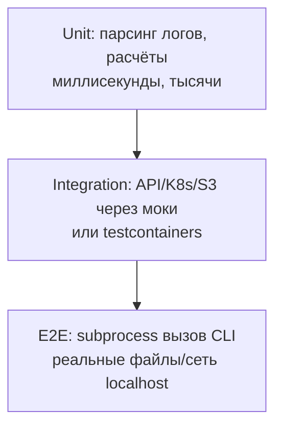

# 🧪 03. Python: Pytest на Продакшн-Уровне

## 🎯 Философия тестов DevOps-инструментов

Тестируем три слоя: чистая логика (unit), интеграция с внешними системами (моки/containers), end-to-end (CLI запускается как бинарник). Пирамида перевёрнута нельзя: e2e медленны и хрупки.



## 🔧 Fixtures: от простых до фабрик

```python
import pytest, httpx

@pytest.fixture(scope="session")
def api_client(k8s_env):
    """Сессия: один клиент на весь прогон."""
    with httpx.Client(base_url="http://localhost:8080", timeout=5) as c:
        yield c                       # teardown после всех тестов

@pytest.fixture
def tmp_config(tmp_path):             # tmp_path — встроенная fixture
    p = tmp_path / "config.yaml"
    p.write_text("replicas: 3\nimage: nginx:1.25")
    return p

@pytest.fixture
def user_factory(db):
    """Фабрика: несколько объектов с разными параметрами."""
    created = []
    def _make(name="test", role="viewer"):
        u = db.create_user(name=name, role=role); created.append(u)
        return u
    yield _make
    for u in created: db.delete_user(u.id)

def test_admin_can_delete(api_client, user_factory):
    admin = user_factory(role="admin")
    assert api_client.delete(f"/users/{user_factory().id}", headers=token(admin)).status_code == 204
```

Scope-иерархия: `function < class < module < package < session`. Ошибочный выбор scope = «плавающие» тесты от общего состояния.

## 📊 Parametrize: одна логика — десятки кейсов

```python
@pytest.mark.parametrize(
    "log_line, expected",
    [
        ('127.0.0.1 - "GET / HTTP/1.1" 200', ("GET", 200)),
        ('10.0.0.9 - "POST /api HTTP/1.1" 500', ("POST", 500)),
        ("broken line", None),
        ('"DELETE /x" 403', ("DELETE", 403)),
    ],
    ids=["get-ok", "post-err", "garbage", "delete-forbidden"],
)
def test_parse_log(log_line, expected):
    assert parse_log_line(log_line) == expected

# Комбинации:
@pytest.mark.parametrize("region", ["eu", "us"])
@pytest.mark.parametrize("storage", ["s3", "minio"])   # 2×2 = 4 теста
def test_backup(region, storage): ...
```

## 🎭 Моки: патчим правильные места

**Золотое правило:** патчить там, где имя **используется**, не где определено.

```python
# app/deploy.py
from kubernetes import client as k8s
def scale(ns: str, name: str, replicas: int):
    apps = k8s.AppsV1Api()
    apps.patch_namespaced_deployment_scale(...)

# tests/test_deploy.py
from unittest.mock import patch, MagicMock
@patch("app.deploy.k8s.AppsV1Api")            # ← путь ИМПОРТА в модуле под тестом!
def test_scale(mock_api):
    instance = mock_api.return_value
    scale("prod", "web", 5)
    instance.patch_namespaced_deployment_scale.assert_called_once()
```

```python
# Ответы по умолчанию и исключения:
mock_api.return_value.list_namespaced_pod.side_effect = [
    pods_page1, pods_page2,
]
instance.get.side_effect = httpx.TimeoutException("timeout")

# Проверка аргументов:
call = instance.patch_namespaced_deployment_scale.call_args
assert call.args[0].spec.replicas == 5
```

## 🚫 Отсечение внешнего мира: responses/respx, moto, testcontainers

| Зависимость | Замена |
|---|---|
| HTTP API | `respx` (httpx) / `responses` (requests) — перехват на уровне клиента |
| AWS | `moto` — эмуляция S3/EC2/IAM в памяти |
| Postgres/Redis/Kafka | testcontainers — реальные контейнеры в тестах |
| K8s API | `kubernetes-mock`/fake-clientset или envtest |

```python
import respx, httpx

@respx.mock
def test_webhook_retries():
    route = respx.post("https://hooks.local/alert").mock(
        side_effect=[httpx.ConnectError, httpx.Response(200)]
    )
    assert deliver_alert(payload) is True          # первая попытка упала, retry спас
    assert route.call_count == 2
```

## 📈 Coverage, маркеры и конфигурация

```toml
[tool.pytest.ini_options]
addopts = "-q --strict-markers --cov=src --cov-report=term-missing --cov-fail-under=80"
markers = ["slow: долгие интеграционные", "e2e: требует kind-кластер"]
filterwarnings = ["error::DeprecationWarning"]

[tool.coverage.run]
branch = true
omit = ["*/tests/*"]
```

```bash
pytest -m "not slow and not e2e"          # быстрый прогон
pytest -x -k "scale and not dry_run"      # стоп на первой ошибке, фильтр по имени
pytest --lf                               # только упавшие в прошлый раз
pytest -vv --tb=short tests/test_deploy.py::test_scale
```

## 🎲 Property-based: hypothesis

Задача «парсер всегда валидный вывод»: вместо ручных примеров генерируются сотни входов.

```python
from hypothesis import given, strategies as st

@given(st.text(min_size=1))
def test_never_crashes(log_line):
    result = parse_log_line(log_line)     # либо корректный результат, либо None
    assert result is None or len(result) == 2
```

## ❓ Пять вопросов для самопроверки

---


## ✅ Проверь себя

> Отвечай вслух до раскрытия ответа. Если «не помню» — вернись к разделу.


**В1. Почему патчат `app.deploy.k8s.AppsV1Api`, а не `kubernetes.client.AppsV1Api`?**
<details><summary>Ответ</summary>
`from x import y` копирует ссылку в namespace модуля-потребителя. Патч источника изменит оригинал, но локальная ссылка в app.deploy уже указывает на старый объект. Правило: patch там, где объект ищется во время выполнения.
</details>

**В2. Когда session-scoped fixture опасна?**
<details><summary>Ответ</summary>
Когда тесты мутируют состояние объекта: порядок выполнения начинает влиять, появляются «зависимые» тесты и ложные падения при параллельном прогоне (xdist). Session — для read-only ресурсов: клиент API, контейнер БД.
</details>

**В3. Как протестировать функцию, которая делает 3 HTTP-вызова с retry?**
<details><summary>Ответ</summary>
respx/responses с `side_effect=[ошибка, ошибка, Response(200)]` + проверка `route.call_count == 3`. Так проверяется и логика повторов, и обработка ошибок без реальной сети.
</details>

**В4. Что даёт `--strict-markers` и зачем он?**
<details><summary>Ответ</summary>
Запрещает опечатки в именах маркеров: неизвестный `@pytest.mark.sloww` станет ошибкой сбора, а не молча проигнорированным маркером. Обязателен в CI, где «тихий» пропуск slow-тестов незаметен.
</details>

**В5. Чем property-based тест отличается от parametrize?**
<details><summary>Ответ</summary>
Parametrize проверяет заранее заданные примеры; hypothesis генерирует сотни случайных входов из стратегии и минимизирует найденный контрпример (shrinking). Хорош для инвариантов: «парсер не падает», «roundtrip encode→decode == identity».
</details>

---

*Что дальше:* [04. Asyncio и конкурентность](04-python-asyncio-concurrency.md) · [05. Типизация и ruff](05-python-typing-mypy-ruff.md)
