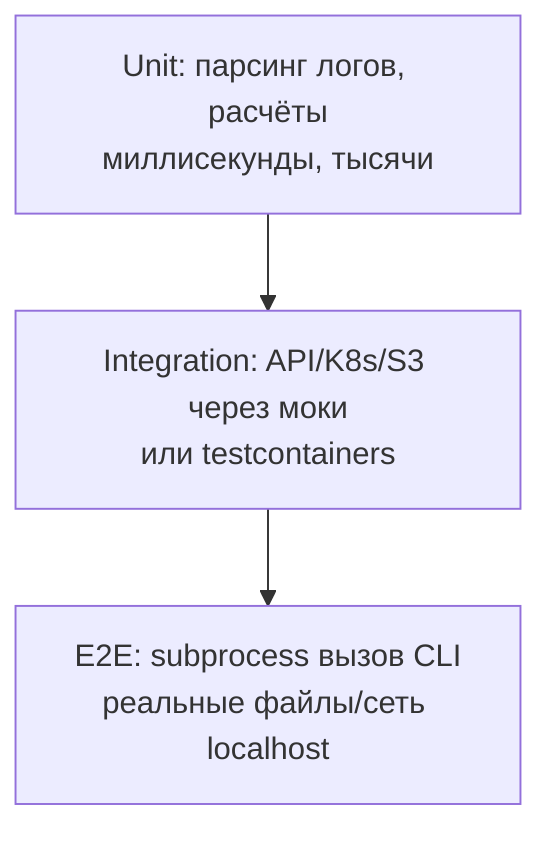

# 🧪 03. Python: Pytest на Продакшн-Уровне

> Уровень: Senior. Цель: тесты, которые ловят баги до продакшена, а не создают новые. Пирамида, изоляция, детерминизм, скорость.

## 🎯 Философия тестов DevOps-инструментов

Тестируем три слоя: чистая логика (unit), интеграция с внешними системами (моки/containers), end-to-end (CLI запускается как бинарник). Пирамида перевёрнута нельзя: e2e медленны и хрупки.



| Слой | Скорость | Зависимости | Доля в проекте |
|---|---|---|---|
| Unit | <10ms | нет | 70% |
| Integration | 100ms-2s | моки / контейнеры | 20% |
| E2E | секунды | реальный бинарник | 10% |

**Правило:** если интеграционный тест можно переписать как unit без потери покрытия — переписывайте. Медленные тесты не запускают.

---

## 🔧 Fixtures: от простых до фабрик

```python
import pytest, httpx

@pytest.fixture(scope="session")
def api_client(k8s_env):
    """Сессия: один клиент на весь прогон."""
    with httpx.Client(base_url="http://localhost:8080", timeout=5) as c:
        yield c                       # teardown после всех тестов

@pytest.fixture
def tmp_config(tmp_path):             # tmp_path — встроенная fixture
    p = tmp_path / "config.yaml"
    p.write_text("replicas: 3\nimage: nginx:1.25")
    return p

@pytest.fixture
def user_factory(db):
    """Фабрика: несколько объектов с разными параметрами."""
    created = []
    def _make(name="test", role="viewer"):
        u = db.create_user(name=name, role=role); created.append(u)
        return u
    yield _make
    for u in created: db.delete_user(u.id)

def test_admin_can_delete(api_client, user_factory):
    admin = user_factory(role="admin")
    assert api_client.delete(f"/users/{user_factory().id}", headers=token(admin)).status_code == 204
```

Scope-иерархия: `function < class < module < package < session`. Ошибочный выбор scope = «плавающие» тесты от общего состояния.

### Fixtures — глубоко

**Что:** fixture — функция-поставщик ресурса с жизненным циклом (setup → yield → teardown). `yield` делит fixture на setup/teardown; `return` — только setup.

**Почему:** изоляция, переиспользование, автоматический teardown даже при падении теста.

```python
import pytest
import pathlib

# Простая fixture:
@pytest.fixture
def sample_log():
    return '127.0.0.1 - "GET / HTTP/1.1" 200\n'

# Fixture с teardown через yield:
@pytest.fixture
def temp_dir(tmp_path):
    d = tmp_path / "work"
    d.mkdir()
    print(f"setup {d}")
    yield d
    print(f"teardown {d}")
    # tmp_path и так удалится, но для БД/контейнеров — явная очистка

# Scope — время жизни:
@pytest.fixture(scope="module")
def expensive_resource():
    # создаётся 1 раз на модуль, а не на каждый тест
    conn = connect_db()
    yield conn
    conn.close()

# Autouse — применяется ко всем тестам без явного запроса:
@pytest.fixture(autouse=True)
def reset_env(monkeypatch):
    monkeypatch.delenv("KUBECONFIG", raising=False)

# Параметризованная fixture:
@pytest.fixture(params=["eu", "us"])
def region(request):
    return request.param  # тест запустится 2 раза с разными region

def test_region(region):
    assert region in ("eu", "us")

# Фабрика + финализация через request.addfinalizer (альтернатива yield):
@pytest.fixture
def make_user(request, db):
    users = []
    def _make(name="test"):
        u = db.create(name); users.append(u); return u
    def cleanup():
        for u in users: db.delete(u.id)
    request.addfinalizer(cleanup)
    return _make
```

**Встроенные fixtures pytest:**

| Fixture | Что даёт | Scope |
|---|---|---|
| `tmp_path` | `Path` к пустому временному каталогу | function |
| `tmp_path_factory` | фабрика временных каталогов | session |
| `capsys` / `capfd` | перехват stdout/stderr | function |
| `caplog` | перехват логов | function |
| `monkeypatch` | патч env/dict/attr с откатом | function |
| `request` | доступ к метаданным теста | function |

```python
def test_logging(caplog, capsys, monkeypatch, tmp_path):
    import logging
    monkeypatch.setenv("ENV", "test")  # откатится после теста
    with caplog.at_level(logging.INFO):
        logging.getLogger("app").info("hello %s", "world")
    assert "hello world" in caplog.text
    print("to stdout")
    assert "to stdout" in capsys.readouterr().out
    p = tmp_path / "out.txt"
    p.write_text("data")
    assert p.read_text() == "data"
```

**Failure — общий mutable state:**

```python
# ❌ Session-scoped mutable — тесты зависят от порядка:
@pytest.fixture(scope="session")
def shared_list():
    return []  # один список на все тесты!

def test_a(shared_list): shared_list.append(1)
def test_b(shared_list): assert shared_list == []  # упадёт если test_a был раньше!

# ✅ Function scope или копия:
@pytest.fixture
def fresh_list():
    return []

# Или фабрика, возвращающая новый объект каждый раз
```

**Performance:** `scope="session"` экономит секунды на тяжёлых ресурсах (контейнер БД), но требует read-only или изоляции транзакциями. `scope="function"` безопасен, но медленнее.

---

## 📊 Parametrize: одна логика — десятки кейсов

```python
@pytest.mark.parametrize(
    "log_line, expected",
    [
        ('127.0.0.1 - "GET / HTTP/1.1" 200', ("GET", 200)),
        ('10.0.0.9 - "POST /api HTTP/1.1" 500', ("POST", 500)),
        ("broken line", None),
        ('"DELETE /x" 403', ("DELETE", 403)),
    ],
    ids=["get-ok", "post-err", "garbage", "delete-forbidden"],
)
def test_parse_log(log_line, expected):
    assert parse_log_line(log_line) == expected

# Комбинации:
@pytest.mark.parametrize("region", ["eu", "us"])
@pytest.mark.parametrize("storage", ["s3", "minio"])   # 2×2 = 4 теста
def test_backup(region, storage): ...
```

### Parametrize — глубоко

```python
import pytest

# Несколько параметров — декартово произведение при stacked декораторах:
@pytest.mark.parametrize("replicas", [1, 3, 50])
@pytest.mark.parametrize("env", ["dev", "prod"])
def test_deploy(env, replicas):  # 6 комбинаций
    ...

# Один декоратор с несколькими аргументами — явные пары:
@pytest.mark.parametrize("inp,expected", [
    pytest.param("5", 5, id="str-5"),
    pytest.param("0", 0, id="zero"),
    pytest.param("abc", None, marks=pytest.mark.xfail(reason="invalid")),
])
def test_parse(inp, expected):
    if expected is None:
        with pytest.raises(ValueError):
            parse_replicas(inp)
    else:
        assert parse_replicas(inp) == expected

# Indirect — параметр идёт в fixture:
@pytest.fixture
def image(request):
    return f"registry/{request.param}:latest"

@pytest.mark.parametrize("image", ["nginx", "redis"], indirect=True)
def test_image(image):  # image == "registry/nginx:latest"
    assert image.startswith("registry/")

# Генерация динамических id:
def idfn(val):
    return f"val={val!r}"

@pytest.mark.parametrize("x", [1, 100], ids=idfn)
def test_x(x): ...
```

**Когда parametrize vs hypothesis:**

| Критерий | parametrize | hypothesis |
|---|---|---|
| Входы | явные, читаемые | случайные, сотни |
| Цель | проверить известные границы | найти неизвестные баги (shrinking) |
| Детерминизм | полный | детерминизм через `derandomize` + seed |
| Пример | коды ответа 200/500/403 | «любая строка не должна ронять парсер» |

---

## 🎭 Моки: патчим правильные места

**Золотое правило:** патчить там, где имя **используется**, не где определено.

```python
# app/deploy.py
from kubernetes import client as k8s
def scale(ns: str, name: str, replicas: int):
    apps = k8s.AppsV1Api()
    apps.patch_namespaced_deployment_scale(...)

# tests/test_deploy.py
from unittest.mock import patch, MagicMock
@patch("app.deploy.k8s.AppsV1Api")            # ← путь ИМПОРТА в модуле под тестом!
def test_scale(mock_api):
    instance = mock_api.return_value
    scale("prod", "web", 5)
    instance.patch_namespaced_deployment_scale.assert_called_once()
```

```python
# Ответы по умолчанию и исключения:
mock_api.return_value.list_namespaced_pod.side_effect = [
    pods_page1, pods_page2,
]
instance.get.side_effect = httpx.TimeoutException("timeout")

# Проверка аргументов:
call = instance.patch_namespaced_deployment_scale.call_args
assert call.args[0].spec.replicas == 5
```

### Моки — глубоко: mock vs fake vs stub

```python
from unittest.mock import Mock, MagicMock, patch, call, AsyncMock, sentinel

# Mock vs MagicMock — MagicMock поддерживает магические методы (__iter__, __enter__):
m = Mock()
# m.__iter__  # AttributeError — нужен MagicMock для with/context

mm = MagicMock()
with mm as x:  # работает
    pass

# sentinel — уникальный объект для проверки «передали именно это»:
from unittest.mock import sentinel
def test_sentinel():
    m = Mock()
    m(sentinel.UNSET)
    m.assert_called_with(sentinel.UNSET)

# Spec — мок проверяет что атрибут реально есть у оригинала:
from kubernetes.client import AppsV1Api
mock_api = Mock(spec=AppsV1Api)  # m.unknown_method → AttributeError
# spec_set — ещё строже: нельзя добавить несуществующий атрибут

# autospec — автоматически spec для patch:
@patch("app.deploy.AppsV1Api", autospec=True)
def test_autospec(mock_cls):
    ...

# Assert helpers:
mock = Mock()
mock(1, 2, key="val")
mock.assert_called_once()
mock.assert_called_with(1, 2, key="val")
mock.assert_called_once_with(1, 2, key="val")
print(mock.call_count)        # 1
print(mock.call_args)         # call(1, 2, key='val')
print(mock.call_args_list)    # [call(1, 2, key='val')]
# call-объекты для сложных проверок:
mock2 = Mock()
mock2.method(1); mock2.method(2)
assert mock2.method.call_args_list == [call(1), call(2)]

# side_effect — последовательность / исключение / функция:
mock.get.side_effect = [ValueError("first"), "ok"]  # первый вызов — исключение, второй — "ok"
mock.compute.side_effect = lambda x: x * 2           # функция

# AsyncMock для async-кода:
import asyncio
mock_fetch = AsyncMock(return_value={"status": "ok"})
async def test_async():
    result = await mock_fetch()
    assert result == {"status": "ok"}
    mock_fetch.assert_awaited_once()

# monkeypatch — лёгкая альтернатива patch (встроен в pytest):
def test_monkeypatch(monkeypatch):
    monkeypatch.setenv("API_URL", "http://test")
    monkeypatch.setattr("app.deploy.fetch", lambda url: {"mock": True})
    monkeypatch.chdir("/tmp")
    # откатится автоматически
```

**Где патчить — схема:**

```text
kubernetes/client/__init__.py  — определение AppsV1Api
app/deploy.py                  — from kubernetes.client import AppsV1Api  (копия ссылки)
tests/test_deploy.py           — patch("app.deploy.AppsV1Api")  ✅  (там где используется)
                               — patch("kubernetes.client.AppsV1Api")  ❌ (не влияет на app.deploy)
```

**Failure — патч не сработал:** проверьте `import app.deploy; print(app.deploy.AppsV1Api)` до и после патча — если не MagicMock, путь неверный. Также `patch` как декоратор патчит на время функции, как контекстный менеджер — на блок `with`.

---

## 🚫 Отсечение внешнего мира: responses/respx, moto, testcontainers

| Зависимость | Замена | Плюсы | Минусы |
|---|---|---|---|
| HTTP API (requests) | `responses` — перехват на уровне адаптера | без сети, точно | только requests |
| HTTP API (httpx) | `respx` — перехват httpx | async + sync | только httpx |
| AWS | `moto` — эмуляция S3/EC2/IAM в памяти | быстро, без Docker | не 100% покрытие API |
| Postgres/Redis/Kafka | testcontainers | реальный сервис | медленнее, нужен Docker |
| K8s API | `kubernetes-mock` / fake-clientset | быстро | ограниченные сценарии |
| Файловая система | `pyfakefs` / `tmp_path` | изоляция | не ловит права доступа |

```python
import respx, httpx

@respx.mock
def test_webhook_retries():
    route = respx.post("https://hooks.local/alert").mock(
        side_effect=[httpx.ConnectError, httpx.Response(200)]
    )
    assert deliver_alert(payload) is True          # первая попытка упала, retry спас
    assert route.call_count == 2
```

### Примеры интеграционных замен

```python
# moto — S3 без AWS:
import boto3
from moto import mock_aws

@mock_aws
def test_s3_upload():
    client = boto3.client("s3", region_name="us-east-1")
    client.create_bucket(Bucket="my-bucket")
    client.put_object(Bucket="my-bucket", Key="backup.tar", Body=b"data")
    objs = client.list_objects_v2(Bucket="my-bucket")
    assert objs["KeyCount"] == 1

# respx — httpx с retry:
import respx, httpx

@respx.mock
def test_retry_on_timeout():
    respx.get("https://api.local/pods").mock(
        side_effect=[httpx.ConnectTimeout("timeout"), httpx.Response(200, json=[{"name": "api"}])]
    )
    # ваш код с retry должен пережить первый ConnectTimeout
    result = fetch_pods_with_retry("https://api.local/pods")
    assert len(result) == 1

# testcontainers — реальный Postgres:
import pytest
from testcontainers.postgres import PostgresContainer

@pytest.fixture(scope="module")
def postgres():
    with PostgresContainer("postgres:16-alpine") as pg:
        yield pg.get_connection_url()
        # контейнер убьётся на выходе

def test_db_migration(postgres):
    engine = create_engine(postgres)
    run_migrations(engine)
    assert table_exists(engine, "deployments")

# responses — для requests:
import responses

@responses.activate
def test_requests_mock():
    responses.add(responses.GET, "https://api.local/health", json={"ok": True}, status=200)
    r = requests.get("https://api.local/health")
    assert r.json() == {"ok": True}
```

**Выбор:** moto/respx для быстрых unit-интеграционных; testcontainers когда нужна реальная семантика (транзакции, типы Postgres). В CI testcontainers требует Docker-in-Docker или доступный Docker socket.

---

## 📈 Coverage, маркеры и конфигурация

```toml
[tool.pytest.ini_options]
addopts = "-q --strict-markers --cov=src --cov-report=term-missing --cov-fail-under=80 --strict-config"
markers = ["slow: долгие интеграционные", "e2e: требует kind-кластер", "unit: быстрые без сети"]
filterwarnings = ["error::DeprecationWarning", "error::ResourceWarning"]
testpaths = ["tests"]
pythonpath = ["src"]

[tool.coverage.run]
branch = true
omit = ["*/tests/*", "*/__main__.py"]
source = ["devops_toolkit"]

[tool.coverage.report]
exclude_lines = ["pragma: no cover", "if TYPE_CHECKING:", "raise NotImplementedError"]
show_missing = true
```

```bash
pytest -m "not slow and not e2e"          # быстрый прогон
pytest -x -k "scale and not dry_run"      # стоп на первой ошибке, фильтр по имени
pytest --lf                               # только упавшие в прошлый раз
pytest --ff                               # сначала упавшие, затем остальные
pytest -vv --tb=short tests/test_deploy.py::test_scale
pytest -n auto                            # параллельно через pytest-xdist
pytest --cov --cov-report=html && open htmlcov/index.html
```

### Coverage — что означают цифры

```bash
pytest --cov=src --cov-report=term-missing
# Name                    Stmts   Miss Branch BrPart  Cover   Missing
# src/deploy.py              42      3     10      1    91%   88-90, 112->115
# Branch 112->115 — ветка if не покрыта (else не тестировался)
```

| Метрика | Что меряет | Цель |
|---|---|---|
| Line coverage | строки исполнены | 80%+ |
| Branch coverage | обе ветки `if`/`for` | 80%+ (ловит `if dry_run: return`) |
| `pragma: no cover` | исключить недостижимый код | `if TYPE_CHECKING:` |

**Failure — 100% покрытие ≠ отсутствие багов:** coverage меряет исполнение, не корректность. Комбинация `parametrize` + `hypothesis` покрывает границы, которые line-coverage не видит.

### Маркеры и конфигурация

```python
# conftest.py — общие fixtures и хуки:
import pytest

def pytest_configure(config):
    config.addinivalue_line("markers", "slow: marks as slow")

def pytest_collection_modifyitems(config, items):
    # автоматически пометить тесты с fake-к8s как slow:
    for item in items:
        if "k8s" in item.nodeid:
            item.add_marker(pytest.mark.slow)

# Использование маркеров:
@pytest.mark.slow
@pytest.mark.e2e
def test_full_deploy(): ...

@pytest.mark.skip(reason="нужен GPU")
def test_gpu(): ...

@pytest.mark.skipif(sys.platform == "win32", reason="только linux")
def test_linux_only(): ...

@pytest.mark.xfail(reason="баг #123, починят в 1.5", strict=False)
def test_known_bug(): ...

# parametrize + marks:
@pytest.mark.parametrize("x", [
    pytest.param(1, marks=pytest.mark.slow),
    pytest.param(2),
])
def test_x(x): ...
```

---

## 🎲 Property-based: hypothesis

Задача «парсер всегда валидный вывод»: вместо ручных примеров генерируются сотни входов.

```python
from hypothesis import given, strategies as st

@given(st.text(min_size=1))
def test_never_crashes(log_line):
    result = parse_log_line(log_line)     # либо корректный результат, либо None
    assert result is None or len(result) == 2
```

### Hypothesis — глубоко

```python
from hypothesis import given, strategies as st, assume, example, settings, HealthCheck

# Стратегии:
# st.integers(min_value=1, max_value=50)  — replicas
# st.text(alphabet="abc", min_size=1)     — короткие строки
# st.lists(st.integers(), min_size=1)     — списки
# st.dictionaries(st.text(), st.integers()) — словари
# st.from_regex(r"^\d+\.\d+\.\d+\.\d+$")  — IP-адреса
# st.builds(Pod, name=st.text(min_size=1)) — объекты

@given(st.integers(min_value=1, max_value=50))
def test_replicas_roundtrip(n):
    cfg = DeployConfig(name="api", image="api:1.0", replicas=n)
    assert cfg.replicas == n

@given(st.text())
@example("")           # явный пример + гипотеза генерирует остальные
@example("broken line without quotes")
def test_parse_never_raises(s):
    # assume — отбросить неподходящие входы:
    # assume(len(s) > 0)  # не тестировать пустые
    result = parse_log_line(s)
    assert result is None or (len(result) == 2 and isinstance(result[1], int))

# Инвариант — encode/decode roundtrip:
@given(st.dictionaries(st.text(min_size=1), st.integers()))
def test_json_roundtrip(d):
    assert json.loads(json.dumps(d)) == d

# Stateful testing — для деплой-автомата:
from hypothesis.stateful import RuleBasedStateMachine, rule, invariant

class DeploymentMachine(RuleBasedStateMachine):
    def __init__(self):
        super().__init__()
        self.replicas = 1
    @rule(n=st.integers(1, 50))
    def scale(self, n):
        self.replicas = n
    @invariant()
    def replicas_in_range(self):
        assert 1 <= self.replicas <= 50

# Настройки:
@settings(max_examples=200, deadline=500, suppress_health_check=[HealthCheck.too_slow])
@given(st.text())
def test_slow_parser(s):
    parse_log_line(s)
```

**Shrinking:** при падении hypothesis минимизирует контрпример (например, из 100-символьной строки найдёт минимальный `"\x00"` который ломает парсер). Это бесценно для дебага.

**CI:**

```bash
pytest --hypothesis-seed=0  # детерминизм
# hypothesis сохраняет failing examples в .hypothesis/examples/ — коммитьте!
```

---

## 🚀 Параллельность тестов и изоляция

```bash
pip install pytest-xdist pytest-timeout

# Параллельно на всех ядрах:
pytest -n auto
# По балансировке нагрузки (медленные тесты равномерно):
pytest -n auto --dist loadscope  # тесты одного модуля на одном воркере (shared fixtures)
pytest -n 4 --dist loadfile

# Таймаут на тест (защита от зависания):
pytest --timeout=10 --timeout-method=thread
# или per-test:
@pytest.mark.timeout(5)
def test_slow(): ...

# Повтор flaky-тестов:
pip install pytest-rerunfailures
pytest --reruns 3 --reruns-delay 1
```

**Failure — xdist + shared state:** `scope="session"` fixture с mutable состоянием + `-n auto` → гонки между воркерами (каждый воркер — отдельный процесс, но если ресурс внешний — БД/файл — гонка). Решение: `scope="function"` или изоляция через `tmp_path`/`testcontainers` с уникальными именами.

---

## 🔍 Отладка тестов

```bash
pytest --pdb                    # дроп в pdb на первом падении
pytest --trace                  # дроп в начале каждого теста
pytest -vv --tb=long            # полный traceback
pytest -vv --tb=short --showlocals  # локальные переменные в traceback
pytest --log-cli-level=DEBUG -s # логи + stdout без капчи
pytest --setup-show             # показать порядок fixtures
pytest --fixtures -v            # список всех доступных fixtures
pytest --collect-only -q        # что будет запущено (без выполнения)
```

```python
# В коде — breakpoint():
def test_debug():
    x = compute()
    breakpoint()  # Python 3.7+ — дроп в pdb (или ipdb если установлен)
    assert x == 42

# Логи в тестах:
import logging
def test_with_logs(caplog):
    caplog.set_level(logging.DEBUG)
    do_something()
    assert "started" in caplog.text
    for record in caplog.records:
        assert record.levelname != "ERROR"
```

---

## ❓ Десять вопросов для самопроверки

---

## ✅ Проверь себя

> Отвечай вслух до раскрытия ответа. Если «не помню» — вернись к разделу.


**В1. Почему патчат `app.deploy.k8s.AppsV1Api`, а не `kubernetes.client.AppsV1Api`?**
<details><summary>Ответ</summary>
`from x import y` копирует ссылку в namespace модуля-потребителя. Патч источника изменит оригинал, но локальная ссылка в app.deploy уже указывает на старый объект. Правило: patch там, где объект ищется во время выполнения (lookup). Проверьте через `app.deploy.k8s is kubernetes.client` после патча.
</details>

**В2. Когда session-scoped fixture опасна?**
<details><summary>Ответ</summary>
Когда тесты мутируют состояние объекта: порядок выполнения начинает влиять, появляются «зависимые» тесты и ложные падения при параллельном прогоне (xdist). Session — только для read-only ресурсов: клиент API, контейнер БД с транзакционным откатом. Mutable — только function scope.
</details>

**В3. Как протестировать функцию, которая делает 3 HTTP-вызова с retry?**
<details><summary>Ответ</summary>
respx/responses с `side_effect=[ошибка, ошибка, Response(200)]` + проверка `route.call_count == 3`. Так проверяется и логика повторов, и обработка ошибок без реальной сети. Для httpx — respx, для requests — responses.
</details>

**В4. Что даёт `--strict-markers` и зачем он?**
<details><summary>Ответ</summary>
Запрещает опечатки в именах маркеров: неизвестный `@pytest.mark.sloww` станет ошибкой сбора, а не молча проигнорированным маркером. Обязателен в CI, где «тихий» пропуск slow-тестов незаметен и тесты не фильтруются.
</details>

**В5. Чем property-based тест отличается от parametrize?**
<details><summary>Ответ</summary>
Parametrize проверяет заранее заданные примеры (известные границы); hypothesis генерирует сотни случайных входов из стратегии и минимизирует найденный контрпример (shrinking). Хорош для инвариантов: «парсер не падает», «roundtrip encode→decode == identity». Дополняют друг друга.
</details>

**В6. Что сломается если запустить `pytest -n auto` с `scope="session"` fixture, которая создаёт файл `/tmp/shared.json`?**
<details><summary>Ответ</summary>
Каждый xdist-воркер — отдельный процесс, но файл один — гонка записи/чтения, тесты падают рандомно. Фикс: `tmp_path_factory` с уникальным именем на воркера, или `scope="function"` + `tmp_path`, или filelock. Для БД — уникальная схема/контейнер на воркера.
</details>

**В7. Почему `mock.assert_called_with(sentinel.UNSET)` лучше `mock.assert_called_with(None)` для проверки дефолта?**
<details><summary>Ответ</summary>
`None` — легитимное значение аргумента; тест не отличит «передали None» от «не передали и сработал дефолт None». `sentinel.UNSET` — уникальный объект, которого нет в прод-коде, поэтому проверка точна. Паттерн: `def f(x=sentinel.UNSET): if x is sentinel.UNSET: x = default`.
</details>

**В8. Как отличить нужный уровень изоляции: Mock vs Fake (moto) vs testcontainers?**
<details><summary>Ответ</summary>
Mock — проверка вызовов (был ли вызван `patch_scale` с нужными аргументами), но не семантики. Fake (moto) — эмулирует поведение S3 в памяти, проверяет логику без сети, но не 100% точен. Testcontainers — реальный Postgres/Redis, точная семантика, но медленно и нужен Docker. Выбор по пирамиде: mock для unit, moto для интеграционных, containers для критичных e2e.
</details>

**В9. Что означает `Branch coverage 112->115` в отчёте и почему line coverage её не видит?**
<details><summary>Ответ</summary>
Ветка `if` на строке 112 (например `if dry_run:`) имеет переход на 115 (else/выход), который не был исполнен — тест покрыл только `dry_run=True`, но не `False` (или наоборот). Line coverage покажет обе строки как «покрытые» если они в одной функции, branch — поймает непокрытую логику ветвления.
</details>

**В10. Как заставить hypothesis воспроизводимо падать на том же примере в CI и локально?**
<details><summary>Ответ</summary>
`pytest --hypothesis-seed=0` фиксирует seed, плюс hypothesis сохраняет failing examples в `.hypothesis/examples/` (коммитьте каталог) и использует `@example` для явных регрессий. Без seed — разные прогоны генерируют разные входы, баг может «исчезнуть» между запусками.
</details>

---

## 🧪 Лаборатория: напиши полный набор тестов для парсера

**Цель:** покрыть unit + integration + property-based.

```python
# src/parser.py
import re
PAT = re.compile(r'"(?P<method>\S+) [^"]*"\s+(?P<code>\d{3})')
def parse_log_line(line: str) -> tuple[str, int] | None:
    m = PAT.search(line)
    if not m:
        return None
    return m["method"], int(m["code"])
```

```python
# tests/test_parser.py
import pytest
from hypothesis import given, strategies as st
from src.parser import parse_log_line

# 1. Parametrize — известные кейсы:
@pytest.mark.parametrize("line,expected", [
    ('127.0.0.1 - "GET / HTTP/1.1" 200', ("GET", 200)),
    ('"POST /api HTTP/1.1" 500', ("POST", 500)),
    ("broken", None),
    ("", None),
], ids=["get", "post", "broken", "empty"])
def test_parse(line, expected):
    assert parse_log_line(line) == expected

# 2. Property — не падает ни на чём:
@given(st.text())
def test_never_crashes(s):
    r = parse_log_line(s)
    assert r is None or (isinstance(r[0], str) and isinstance(r[1], int))

# 3. Fixture + tmp_path — парсер файла:
def test_parse_file(tmp_path):
    log = tmp_path / "app.log"
    log.write_text('127.0.0.1 - "GET / HTTP/1.1" 200\nbroken\n"POST /x" 500\n')
    lines = log.read_text().splitlines()
    results = [parse_log_line(l) for l in lines]
    assert results == [("GET", 200), None, ("POST", 500)]

# 4. Mock — внешний вызов не нужен, но если парсер зовёт API:
from unittest.mock import patch
@patch("src.parser.fetch_extra")
def test_with_mock(mock_fetch):
    mock_fetch.return_value = {"ok": True}
    assert parse_log_line('"GET /" 200') == ("GET", 200)
    mock_fetch.assert_not_called()  # парсер не должен звать API для обычных строк
```

**Запуск:**
```bash
pytest tests/test_parser.py -v --cov=src --cov-report=term-missing --cov-fail-under=80
pytest -n auto --dist loadfile  # параллель
pytest --hypothesis-seed=0      # детерминизм
```

**Failure injection:** добавьте в `parse_log_line` баг — `int(m["code"])` без try/except и скормите `'"GET /" 9999'` (4-значный код) — parametrize поймает, property найдёт через shrinking.

---

*Что дальше:* [04. Asyncio и конкурентность](04-python-asyncio-concurrency.md) · [05. Типизация и ruff](05-python-typing-mypy-ruff.md)
