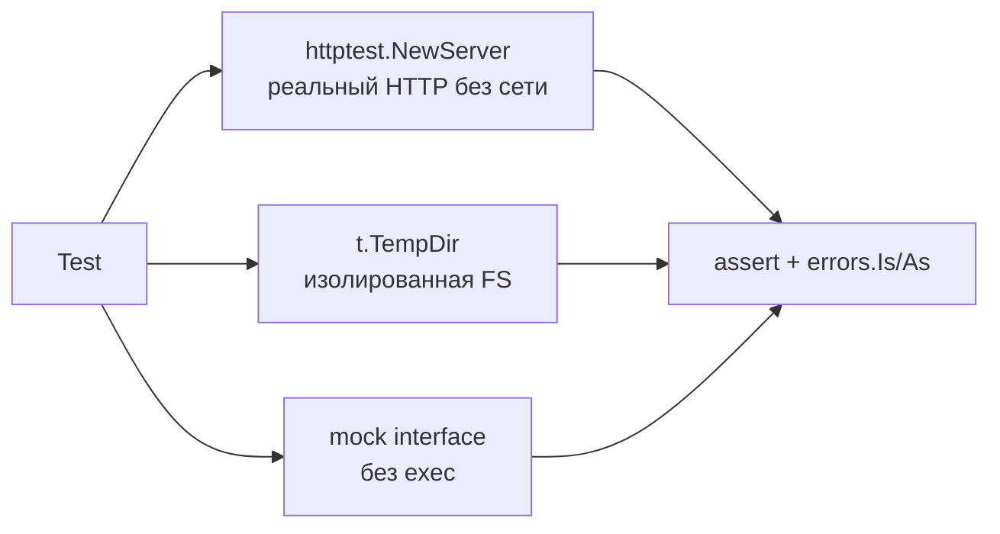
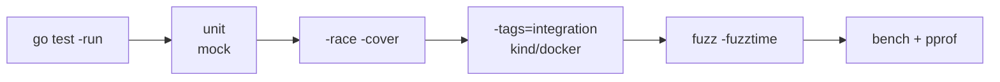

# 🧪 04. Go Тестирование: Table-Driven, Моки, Fuzzing, Benchmarks — Production Deep Dive

> Полный цикл качества Go-проекта: table-driven тесты, моки через интерфейсы, fuzzing, benchmarks, `go vet`, `staticcheck`, race detector, golden files, httptest, coverage и CI. Весь код — `gofmt` + `go vet` чист.

**Оглавление:** 1. Table-driven · 2. Моки · 3. Benchmarks · 4. Fuzzing · 5. Golden/httptest · 6. Vet/Staticcheck · 7. Память и GC · 8. Сеть и система · 9. Наблюдаемость · 10. Безопасность · 11. CI · 12. Production checklist · 13. Проверь себя · 14. Лабы

---

## 📋 Table-driven tests: канон языка

```go
func TestParseImage(t *testing.T) {
	tests := []struct {
		name    string
		image   string
		want    ImageRef
		wantErr bool
	}{
		{"full", "nginx:1.25.3", ImageRef{"nginx", "1.25.3"}, false},
		{"no tag", "nginx", ImageRef{"nginx", "latest"}, false},
		{"registry+port+digest", "reg.local:5000/app@sha256:abc", ImageRef{"app", "sha256:abc"}, false},
		{"empty", "", ImageRef{}, true},
		{"with port", "reg:5000/ns/app:1.0", ImageRef{"app", "1.0"}, false},
	}
	for _, tt := range tests {
		tt := tt
		t.Run(tt.name, func(t *testing.T) {
			t.Parallel() // каждый сабтест параллельно — быстрее
			got, err := ParseImage(tt.image)
			if (err != nil) != tt.wantErr {
				t.Fatalf("err = %v, wantErr %v", err, tt.wantErr)
			}
			if got != tt.want {
				t.Errorf("got %+v, want %+v", got, tt.want)
			}
		})
	}
}
```

```bash
go test ./... -run TestParseImage/no_tag -v    # один кейс
go test ./... -run TestParseImage -count=1 -v  # без кэша
go test -failfast ./pkg/...                     # стоп на первой ошибке
gotestsum --format testname ./...               # красивый вывод в CI
go test -shuffle=on ./...                       # рандом порядок — ловит зависимости между тестами
```

### Когда table-driven, а когда нет

| Кейс | Подход | Почему |
| :--- | :--- | :--- |
| Парсер, валидатор | table-driven | много входов → одинаковая логика |
| Интеграция с сетью | один тест + httptest | сложная подготовка |
| Конкурентность | отдельный Test с -race | детерминизм |
| Golden files | сравнение с эталоном | большой вывод |

```go
// Helper для сокращения boilerplate — обязательно t.Helper()
func assertNoError(t *testing.T, err error) {
	t.Helper()
	if err != nil {
		t.Fatalf("unexpected error: %v", err)
	}
}

func TestHelper(t *testing.T) {
	err := do()
	assertNoError(t, err)
}

// Cleanup — гарантированная уборка
func TestWithTempDir(t *testing.T) {
	dir := t.TempDir() // автоматом удалится после теста
	if err := os.WriteFile(dir+"/cfg.yaml", []byte("x"), 0644); err != nil {
		t.Fatal(err)
	}
	t.Cleanup(func() { fmt.Println("cleanup") })
}
```

---

## 🎭 Моки: интерфейсы вместо фреймворков

Go-идиома: зависимость — маленький интерфейс; тест подставляет реализацию.

```go
// Продакшн-код зависит от интерфейса:
type ClusterClient interface {
	ScaleDeployment(ctx context.Context, ns, name string, n int32) error
	GetDeployment(ctx context.Context, ns, name string) (*Deployment, error)
}

func Rollout(ctx context.Context, c ClusterClient, cfg Config) error {
	d, err := c.GetDeployment(ctx, cfg.Namespace, cfg.Name)
	if err != nil {
		return fmt.Errorf("get: %w", err)
	}
	if d.Replicas == cfg.Replicas {
		return nil // уже в нужном состоянии
	}
	return c.ScaleDeployment(ctx, cfg.Namespace, cfg.Name, cfg.Replicas)
}

// Тест: ручной мок или mockery-generated:
type mockCluster struct {
	scaled  int32
	get     *Deployment
	wantErr error
}

func (m *mockCluster) ScaleDeployment(_ context.Context, _, _ string, n int32) error {
	m.scaled = n
	return m.wantErr
}
func (m *mockCluster) GetDeployment(_ context.Context, _, _ string) (*Deployment, error) {
	if m.wantErr != nil {
		return nil, m.wantErr
	}
	return m.get, nil
}

func TestRollout(t *testing.T) {
	mc := &mockCluster{get: &Deployment{Replicas: 1}, wantErr: nil}
	err := Rollout(context.Background(), mc, Config{Namespace: "prod", Name: "api", Replicas: 3})
	if err != nil {
		t.Fatal(err)
	}
	if mc.scaled != 3 {
		t.Fatalf("want 3 got %d", mc.scaled)
	}
}

func TestRollout_GetError(t *testing.T) {
	mc := &mockCluster{wantErr: errors.New("api down")}
	err := Rollout(context.Background(), mc, Config{})
	if !errors.Is(err, mc.wantErr) {
		t.Fatal("want wrapped error")
	}
}
```

```bash
mockery --all --output ./mocks     # генерация моков из интерфейсов (или gomock/mockgen)
go generate ./...                   # //go:generate mockery --name ClusterClient
testify/assert                     # assert.Equal/T.NoError/Contains — меньше boilerplate
```

| Инструмент | Когда | Плюсы |
| :--- | :--- | :--- |
| Ручной мок (struct) | 1-2 метода | просто, без зависимостей |
| `mockery` | много интерфейсов | генерация, `EXPECT()` |
| `gomock` | legacy | — |
| `testify/mock` | быстро | `On/Return/AssertExpectations` |

```go
// testify — меньше if'ов
import "github.com/stretchr/testify/assert"
import "github.com/stretchr/testify/require"

func TestWithTestify(t *testing.T) {
	mc := &mockCluster{}
	err := Rollout(context.Background(), mc, Config{Replicas: 3, Namespace: "ns", Name: "n"})
	require.NoError(t, err)
	assert.Equal(t, int32(3), mc.scaled)
}
```

---

## ⚡ Benchmarks: измеряем, а не верим

```go
func BenchmarkParseLog(b *testing.B) {
	data := loadFixture("access-1m.log")
	b.ResetTimer() // не меряем загрузку фикстуры
	for i := 0; i < b.N; i++ {
		_ = ParseLog(data)
	}
}

// С аллокациями:
func BenchmarkJSON(b *testing.B) {
	data := []byte(`{"name":"api","replicas":3}`)
	b.ReportAllocs()
	b.ResetTimer()
	for i := 0; i < b.N; i++ {
		var v map[string]any
		_ = json.Unmarshal(data, &v)
	}
}

// Go 1.21+ — b.Loop()
func BenchmarkModern(b *testing.B) {
	for b.Loop() {
		_ = ParseLog([]byte("127.0.0.1 - - [28/Aug/2026]"))
	}
}
```

```bash
go test -bench=. -benchmem ./parser/
# BenchmarkParseLog-8   500   2341000 ns/op   1204567 B/op   312 allocs/op
go test -bench=. -cpuprofile cpu.out && go tool pprof cpu.out    # сразу профиль!
benchstat old.txt new.txt        # статистически честное сравнение версий

# Сравнение до/после оптимизации
go test -bench=. -count=10 > old.txt
# ... оптимизация ...
go test -bench=. -count=10 > new.txt
benchstat old.txt new.txt
# name     old time/op  new time/op  delta
# ParseLog 2.34ms ±2%  1.12ms ±1%  -52.14%  (p=0.000 n=10)
```

**Allocs/op — главный показатель:** каждая аллокация ≈ давление на GC. Ускорение часто = переиспользование буферов (`sync.Pool`), pre-allocation (`make([]T, 0, len(x))`).

```go
// Оптимизация allocs — пример
func slow(s string) string {
	return strings.ToUpper(strings.TrimSpace(s)) // 2 аллокации
}

func fast(s string) string {
	// strings.TrimSpace аллоцирует только если есть что тримить
	s = strings.TrimSpace(s)
	// strings.ToUpper — одна аллокация
	return strings.ToUpper(s)
}

func withPool(b *testing.B) {
	var pool = sync.Pool{New: func() any { return new(bytes.Buffer) }}
	b.ReportAllocs()
	for b.Loop() {
		buf := pool.Get().(*bytes.Buffer)
		buf.Reset()
		buf.WriteString("hello")
		_ = buf.String()
		pool.Put(buf)
	}
}
```

| Метрика | Что значит | Порог |
| :--- | :--- | :--- |
| `ns/op` | время на операцию | смотреть delta через benchstat |
| `B/op` | байт на операцию | меньше → меньше GC |
| `allocs/op` | аллокаций на операцию | стремиться к 0 в hot path |

---

## 🎲 Fuzzing: находим краевые случаи за вас

```go
func FuzzParseImage(f *testing.F) {
	f.Add("nginx:1.25")
	f.Add("")
	f.Add("a/b/c:d:e")
	f.Add("reg.local:5000/app@sha256:abc")
	f.Fuzz(func(t *testing.T, image string) {
		ref, err := ParseImage(image)
		if err == nil {
			if ref.Tag == "" && ref.Digest == "" {
				t.Errorf("valid parse without tag/digest for %q", image) // инвариант нарушен
			}
			// Round-trip: парсим → сериализуем → парсим снова = то же
			s := ref.String()
			ref2, err2 := ParseImage(s)
			if err2 != nil {
				t.Fatalf("round-trip failed for %q → %q: %v", image, s, err2)
			}
			if ref != ref2 {
				t.Errorf("round-trip mismatch %v vs %v", ref, ref2)
			}
		}
	})
}

// Fuzz для парсера длительности
func FuzzParseDuration(f *testing.F) {
	f.Add("5m30s")
	f.Fuzz(func(t *testing.T, s string) {
		d, err := ParseDuration(s)
		if err == nil && d < 0 {
			t.Fatalf("отрицательная длительность без ошибки для %q", s)
		}
	})
}
```

```bash
go test -fuzz=FuzzParseImage -fuzztime=30s ./...   # минуты в CI nightly
go test -fuzz=FuzzParseImage -fuzztime=10s -fuzzminimizetime=5s
# Найденные краевые входы автоматически сохраняются в testdata/fuzz/ как регресс-кейсы.
ls testdata/fuzz/FuzzParseImage/
# 3a1b...  — каждый файл — минимальный контрпример
```

| Режим | Когда | Время |
| :--- | :--- | :--- |
| `-fuzztime=10s` | PR, быстро | 10s |
| `-fuzztime=30s` | nightly | 30s |
| `-fuzztime=5m` | перед релизом | 5m |

```go
// Fuzz + инвариант — мощнее 100 ручных кейсов
func FuzzJSONRoundTrip(f *testing.F) {
	f.Add([]byte(`{"name":"api"}`))
	f.Fuzz(func(t *testing.T, data []byte) {
		var v map[string]any
		if err := json.Unmarshal(data, &v); err != nil {
			return // невалидный JSON — ok
		}
		out, err := json.Marshal(v)
		if err != nil {
			t.Fatalf("marshal failed: %v", err)
		}
		var v2 map[string]any
		if err := json.Unmarshal(out, &v2); err != nil {
			t.Fatalf("round-trip unmarshal failed: %v", err)
		}
	})
}
```

---

## 🧱 Golden files и httptest

```go
// Golden files: сравнение вывода с эталоном (-update для обновления эталона)
var update = flag.Bool("update", false, "update golden files")

func TestRenderManifest(t *testing.T) {
	got := Render(Config{Name: "api", Replicas: 3})
	golden := "testdata/manifest.golden"
	if *update {
		if err := os.WriteFile(golden, []byte(got), 0644); err != nil {
			t.Fatal(err)
		}
	}
	want, err := os.ReadFile(golden)
	if err != nil {
		t.Fatal(err)
	}
	if string(want) != got {
		t.Fatalf("mismatch:\nwant:\n%s\ngot:\n%s", want, got)
	}
}

// Или с testify + golden
func TestRenderWithGolden(t *testing.T) {
	got := Render(cfg)
	golden := "testdata/manifest.golden"
	if *update {
		os.WriteFile(golden, []byte(got), 0644)
	}
	want, _ := os.ReadFile(golden)
	assert.Equal(t, string(want), got)
}
```

```go
// HTTP-тесты без сети — httptest
func TestDeploy(t *testing.T) {
	srv := httptest.NewServer(http.HandlerFunc(func(w http.ResponseWriter, r *http.Request) {
		assert.Equal(t, "/api/v1/deploy", r.URL.Path)
		assert.Equal(t, "Bearer token", r.Header.Get("Authorization"))
		if r.Method != http.MethodPost {
			t.Errorf("want POST got %s", r.Method)
		}
		w.WriteHeader(503)
		w.Write([]byte(`{"error":"temporarily unavailable"}`))
	}))
	defer srv.Close()

	client := NewClient(srv.URL, "token")
	err := client.Deploy(context.Background(), Config{Name: "api"})
	if err == nil {
		t.Fatal("want error for 503")
	}
	var apiErr *APIError
	if !errors.As(err, &apiErr) {
		t.Fatalf("want APIError got %T", err)
	}
	if apiErr.Status != 503 {
		t.Fatalf("want 503 got %d", apiErr.Status)
	}
}

// httptest с TLS
func TestTLS(t *testing.T) {
	srv := httptest.NewTLSServer(http.HandlerFunc(func(w http.ResponseWriter, r *http.Request) {
		w.Write([]byte("ok"))
	}))
	defer srv.Close()
	client := srv.Client() // уже с CA
	resp, err := client.Get(srv.URL)
	require.NoError(t, err)
	defer resp.Body.Close()
}

// Table-driven + httptest
func TestClientTable(t *testing.T) {
	tests := []struct {
		name       string
		status     int
		wantErr    bool
		retryable  bool
	}{
		{"ok", 200, false, false},
		{"not found", 404, true, false},
		{"retry", 503, true, true},
	}
	for _, tt := range tests {
		t.Run(tt.name, func(t *testing.T) {
			srv := httptest.NewServer(http.HandlerFunc(func(w http.ResponseWriter, r *http.Request) {
				w.WriteHeader(tt.status)
			}))
			defer srv.Close()
			err := NewClient(srv.URL).Do(context.Background())
			if (err != nil) != tt.wantErr {
				t.Fatalf("err %v wantErr %v", err, tt.wantErr)
			}
		})
	}
}
```

---

## 🔍 Vet, staticcheck, lint: ловим баги до продa

```bash
go vet ./...                              # встроен, обязателен
# copylocks: копирование sync.Mutex по значению
# printf: несоответствие формата
# unreachable: недостижимый код

staticcheck ./...                         # honnef.co/go/tools/cmd/staticcheck
# SA1019: использование deprecated API
# SA6002: аргумент должен быть *T, не T

golangci-lint run ./...                   # агрегатор 100+ линтеров
# errcheck: не проверен error
# govet, ineffassign, unused, misspell

go run honnef.co/go/tools/cmd/staticcheck@latest ./...
```

```go
// Примеры, которые ловит vet
func vetExamples() {
	var mu sync.Mutex
	m := mu // vet: copylocks — копирование мьютекса!
	_ = m

	// printf mismatch
	var s string
	fmt.Printf("%d", s) // vet: printf

	// unreachable
	return
	fmt.Println("never") // vet: unreachable
}

// staticcheck: неявный typed nil
func bad() error {
	var p *MyError
	return p // SA? — не ловит, но review должен
}

// errcheck
func badErrcheck() {
	os.Remove("/tmp/x") // errcheck: unchecked error
}
func goodErrcheck() {
	_ = os.Remove("/tmp/x") // явно игнорируем
}
```

```yaml
# .golangci.yml — конфиг для проекта
linters:
  enable:
    - errcheck
    - govet
    - staticcheck
    - ineffassign
    - unused
    - goimports
    - misspell
run:
  timeout: 5m
```

| Инструмент | Что ловит | Когда |
| :--- | :--- | :--- |
| `go vet` | copylocks, printf, unreachable | каждый PR, быстро |
| `staticcheck` | 100+ багов | каждый PR |
| `golangci-lint` | агрегатор | CI, 2-5 мин |
| `govulncheck` | CVE reachable | nightly |
| `gosec` | security | PR |

---

## 🧠 Память и рантайм в тестах

```go
func TestAllocs(t *testing.T) {
	allocs := testing.AllocsPerRun(100, func() {
		_ = ParseImage("nginx:1.25")
	})
	if allocs > 2 {
		t.Fatalf("too many allocs: %v", allocs)
	}
}

func BenchmarkWithAllocs(b *testing.B) {
	b.ReportAllocs()
	for b.Loop() {
		_ = Sum([]int{1, 2, 3, 4, 5})
	}
	// до: 3 allocs/op, после оптимизации с pre-alloc: 1
}

// go test -bench=. -benchmem -memprofile mem.out
// go tool pprof -http=:8080 mem.out

// Escape analysis в тестах
// go test -gcflags="-m" ./... 2>&1 | grep escape
```

| Метрика | Как смотреть | Порог для hot path |
| :--- | :--- | :--- |
| `allocs/op` | `benchmem` | 0-1 |
| `B/op` | `benchmem` | < 1KB |
| `heap_inuse` | `pprof heap` | стабилен |
| `escapes` | `-gcflags="-m"` | минимум |

```go
// sync.Pool в бенчмарках — честное измерение без GC шума
var pool = sync.Pool{New: func() any { return make([]byte, 1024) }}

func BenchmarkPool(b *testing.B) {
	b.ReportAllocs()
	for b.Loop() {
		buf := pool.Get().([]byte)
		_ = process(buf)
		pool.Put(buf)
	}
}
```

---

## 🌐 Сеть и система в тестах

```go
func TestWithTContext(t *testing.T) {
	ctx, cancel := context.WithTimeout(context.Background(), 5*time.Second)
	defer cancel()
	// httptest с контекстом
	srv := httptest.NewServer(http.HandlerFunc(func(w http.ResponseWriter, r *http.Request) {
		select {
		case <-time.After(100 * time.Millisecond):
			w.Write([]byte("ok"))
		case <-r.Context().Done():
			// клиент отменил — не пишем
		}
	}))
	defer srv.Close()
	req, _ := http.NewRequestWithContext(ctx, http.MethodGet, srv.URL, nil)
	resp, err := http.DefaultClient.Do(req)
	require.NoError(t, err)
	defer resp.Body.Close()
}

// Тест на файловую систему — t.TempDir
func TestFileOps(t *testing.T) {
	dir := t.TempDir()
	path := dir + "/config.yaml"
	if err := os.WriteFile(path, []byte("replicas: 3"), 0644); err != nil {
		t.Fatal(err)
	}
	data, err := os.ReadFile(path)
	require.NoError(t, err)
	assert.Contains(t, string(data), "replicas")
}

// Параллельные тесты с t.Parallel + race
func TestParallel(t *testing.T) {
	t.Parallel()
	// ... не трогаем глобальное состояние!
}

// Тест с exec — мокаем через интерфейс, не вызываем реальный kubectl
type ExecMock struct {
	Output []byte
	Err    error
}
func (m *ExecMock) Run(ctx context.Context, args ...string) ([]byte, error) {
	return m.Output, m.Err
}
```



---

## 🔭 Наблюдаемость тестов

```go
// Логи в тестах — t.Log, не fmt.Println
func TestWithLog(t *testing.T) {
	t.Log("starting test with", "replicas", 3)
	// видно только при -v или при падении
}

// Coverage — знать, что не покрыто
// go test -race -covermode=atomic -coverprofile=coverage.out ./...
// go tool cover -func=coverage.out | tail -1
// go tool cover -html=coverage.out -o coverage.html

// Трассировка тестов — pprof в бенчмарке
func BenchmarkWithTrace(b *testing.B) {
	f, _ := os.Create("/tmp/trace.out")
	trace.Start(f)
	defer trace.Stop()
	for b.Loop() {
		_ = work()
	}
}
// go tool trace /tmp/trace.out

// Метрики в тестах — не нужны, но можно проверить
func TestMetrics(t *testing.T) {
	reg := prometheus.NewRegistry()
	counter := prometheus.NewCounter(prometheus.CounterOpts{Name: "test_total"})
	reg.MustRegister(counter)
	counter.Inc()
	mfs, _ := reg.Gather()
	assert.Equal(t, 1.0, mfs[0].GetMetric()[0].GetCounter().GetValue())
}
```

| Сигнал | Инструмент | Куда |
| :--- | :--- | :--- |
| Logs | `t.Log`, `slog` в тесте | stdout при -v |
| Coverage | `go tool cover` | `coverage.html` |
| Trace | `runtime/trace` | `go tool trace` |
| Profile | `pprof` | `go tool pprof` |

---

## 🔒 Безопасность тестов

```go
// Не хардкодить секреты в тестах — даже в testdata
func TestWithSecret(t *testing.T) {
	token := os.Getenv("TEST_TOKEN")
	if token == "" {
		t.Skip("TEST_TOKEN not set")
	}
	// ...
}

// t.Setenv — изолирует env в тесте, параллельно безопасно (Go 1.21+)
func TestEnv(t *testing.T) {
	t.Setenv("API_URL", "http://test.local")
	assert.Equal(t, "http://test.local", os.Getenv("API_URL"))
}

// Проверка на утечку горутин — goleak
func TestMain(m *testing.M) {
	goleak.VerifyTestMain(m)
}
func TestLeak(t *testing.T) {
	defer goleak.VerifyNone(t)
	go func() { time.Sleep(10 * time.Millisecond) }()
	// goleak поймает, если горутина осталась
}

// govulncheck в CI — даже тесты могут тянуть уязвимые транзитивы
// go vet -copylocks ловит копирование мьютекса в тестах тоже
```

| Риск | Митигация |
| :--- | :--- |
| Секреты в репо | `t.Setenv`, env из CI secrets |
| Утечка горутин | `goleak` |
| Race в тестах | `-race` |
| Зависимость от порядка | `-shuffle=on` |

---

## 🚦 CI-набор Go-проекта (расширенный)

```yaml
test:go:
  stage: test
  image: golang:1.22
  variables:
    GOMAXPROCS: "4"
    GOMEMLIMIT: "1GiB"
  script:
    - go vet ./...
    - go run honnef.co/go/tools/cmd/staticcheck@latest ./...
    - go test -race -shuffle=on -covermode=atomic -coverprofile=coverage.out ./...
    - go tool cover -func=coverage.out | tail -1      # total: NN%
    - go test -bench=. -benchmem -count=1 ./... | tee bench.txt
    - go run golang.org/x/vuln/cmd/govulncheck@latest ./...
    - go build ./...                                   # сборка = smoke
  coverage: '/total:\s+\d+\.\d+%/'
  artifacts:
    reports:
      coverage_report:
        coverage_format: cobertura
        path: coverage.out
    paths: [bench.txt, coverage.html]
  cache: { paths: [.gopath] }

fuzz:go:
  stage: test
  image: golang:1.22
  script:
    - go test -fuzz=FuzzParseImage -fuzztime=30s ./...
  rules:
    - if: $CI_PIPELINE_SOURCE == "schedule" # nightly

bench:compare:
  stage: test
  script:
    - benchstat old.txt new.txt
  needs: [test:go]
```

```bash
# Локально прогнать всё как в CI
go vet ./... && staticcheck ./... && go test -race -shuffle=on -coverprofile=coverage.out ./... && go tool cover -func=coverage.out
```

---

## ✅ Production checklist: тестирование

| Категория | Проверка | Команда | Порог |
| :--- | :--- | :--- | :--- |
| Unit | table-driven + t.Parallel | `go test -run` | 80%+ coverage |
| Race | `-race` чист | `go test -race` | 0 гонок |
| Vet | `go vet` чист | `go vet ./...` | 0 |
| Lint | `staticcheck` | `staticcheck ./...` | 0 |
| Fuzz | `fuzz` nightly | `go test -fuzz=.` | 0 паник |
| Bench | benchstat без регресса | `benchstat` | delta < 5% |
| Coverage | atomic | `go tool cover` | >70% |
| Goleak | нет утечек | `goleak.VerifyNone` | 0 |
| Shuffle | порядок не важен | `-shuffle=on` | 0 |

---


## Дополнение: TestMain, testify suite, интеграционные тесты

```go
// TestMain — глобальная подготовка/проверка
func TestMain(m *testing.M) {
	// Подготовка: поднять тестовый etcd, postgres в Docker
	// go run github.com/ory/dockertest
	goleak.VerifyTestMain(m,
		goleak.IgnoreTopFunction("net/http.(*persistConn).writeLoop"),
	)
	code := m.Run()
	// Уборка
	os.Exit(code)
}

// testify suite — для сложных сценариев с общим setup
import "github.com/stretchr/testify/suite"

type DeploySuite struct {
	suite.Suite
	client *mockCluster
}

func (s *DeploySuite) SetupTest() {
	s.client = &mockCluster{get: &Deployment{Replicas: 1}}
}
func (s *DeploySuite) TestRollout() {
	err := Rollout(context.Background(), s.client, Config{Replicas: 3})
	s.NoError(err)
	s.Equal(int32(3), s.client.scaled)
}
func TestDeploySuite(t *testing.T) { suite.Run(t, new(DeploySuite)) }

// Интеграционный тест с build tag
//go:build integration
package deploy_test

func TestIntegrationK8s(t *testing.T) {
	if testing.Short() {
		t.Skip("skip integration")
	}
	// требует реального кластера или kind
}
```

```bash
go test -run TestIntegration -tags=integration -v
go test -short ./... # без интеграции
```



| Тег | Когда | Команда |
| :--- | :--- | :--- |
| `unit` | каждый PR | `go test ./...` |
| `integration` | nightly/kind | `go test -tags=integration` |
| `fuzz` | nightly | `go test -fuzz=.` |
| `bench` | ручной | `go test -bench=.` |


## ✅ Проверь себя — 10 вопросов

**В1. Почему table-driven — стандарт именно в Go?**
<details><summary>Ответ</summary>
Нет наследования и параметризованных тестов из других языков; структуры + t.Run дают то же самое нативно: читаемая таблица кейсов, именованные сабтесты (запуск по -run), параллельность через t.Parallel(). Один шаблон покрывает все позитивные/негативные сценарии без дублирования. Helper с t.Helper() для чистых стеков.
</details>

**В2. Зачем мок через интерфейс, а не monkey-patching как в Python?**
<details><summary>Ответ</summary>
В Go нет патчинга рантайма (статическая компиляция). Инъекция зависимости через интерфейсный параметр/поле структуры — единственный чистый способ; он же заставляет проектировать узкие интерфейсы у потребителя (dependency inversion). Генерация через mockery — для больших интерфейсов.
</details>

**В3. О чём говорит высокое allocs/op в бенчмарке?**
<details><summary>Ответ</summary>
Каждая аллокация — работа для GC и промахи по кэшу. Высокий счётчик при CPU-bound коде указывает на лишние промежуточные слайсы/строки: лечится pre-allocation (make с capacity), переиспользованием буферов (sync.Pool), bytes.Buffer вместо конкатенации. Смотреть B/op и allocs/op вместе.
</details>

**В4. Что делает fuzz-тест полезнее сотни рукописных кейсов?**
<details><summary>Ответ</summary>
Генератор ищет входы, о которых вы не подумали (юникод, переполнения, вложенность), и проверяет ИНВАРИАНТЫ («валидный разбор всегда даёт нет пустой тег», round-trip). Контрпримеры сохраняются как постоянные регрессионные тесты в testdata/fuzz. Запуск — -fuzztime в nightly.
</details>

**В5. Зачем в CI обязательно `-race`, если локально тесты зелёные?**
<details><summary>Ответ</summary>
Гонка данных недетерминирована: проявляется под нагрузкой/на многоядерных CI-раннерах. Race detector инструментирует доступы к памяти и ловит конкурирующие обращения даже если «повезло» с порядком исполнения. Пропуск гонки в проде = редкие порчи данных без видимой причины. Обязателен -race и -shuffle=on.
</details>

**В6. Чем `go vet` отличается от `staticcheck` и `golangci-lint`?**
<details><summary>Ответ</summary>
go vet — встроен, ловит базу (copylocks, printf, unreachable) — быстро, каждый PR. staticcheck — 100+ более глубоких проверок (SA*), deprecated, сомнительные интерфейсы. golangci-lint — агрегатор 100+ линтеров (errcheck, vet, staticcheck, ineffassign) — медленнее, но один вызов в CI. Порядок: vet → staticcheck → golangci-lint.
</details>

**В7. Что такое golden files и когда они лучше table-driven?**
<details><summary>Ответ</summary>
Сравнение вывода с эталонным файлом testdata/*.golden — для большого вывода (рендер манифеста, JSON). -update флаг для обновления эталона. Лучше table-driven, когда вывод большой и таблица станет нечитаемой. Минус — дифф в файле, не в коде. Комбинировать: table-driven для логики, golden для рендера.
</details>

**В8. Как правильно бенчмаркать, чтобы не мерять шум?**
<details><summary>Ответ</summary>
b.ResetTimer() после подготовки фикстуры, b.ReportAllocs(), b.Loop() (или b.N), -count=10 и benchstat для статистики, -benchmem, изолировать от GC (sync.Pool), фиксировать GOMAXPROCS/GOMEMLIMIT, не мерять I/O в CPU-бенче. Сравнивать old/new через benchstat, не одно число.
</details>

**В9. Почему `t.Parallel()` может сломать тест, и как это предотвратить?**
<details><summary>Ответ</summary>
Параллельные сабтесты делят процесс: гонка за глобальными переменными, файлами, env. Фикс: не трогать глобальное состояние, использовать t.TempDir (изолирован), t.Setenv (безопасен с Go 1.21), моки через интерфейсы, а не глобальные синглтоны. Запускать с -race и -shuffle=on для выявления.
</details>

**В10. Как `goleak` находит утечку горутин и что делать с ложными срабатываниями?**
<details><summary>Ответ</summary>
Сравнивает список горутин до и после теста (runtime.Stack), падает если остались. Ложные — фоновые горутины runtime/pprof/http. Фикс: IgnoreTopFunction для известных фоновых, или расширить список игнорируемых в VerifyTestMain. В тесте — defer goleak.VerifyNone(t) + убедиться, что все горутины уважают ctx.Done().
</details>

---

## 🧪 Лабораторные

### Lab 1: Добавь fuzz к парсеру и найди баг

```go
func ParseImage(s string) (ImageRef, error) {
	if s == "" {
		return ImageRef{}, errors.New("empty")
	}
	// ... наивная реализация
}
func FuzzParseImage(f *testing.F) {
	f.Add("nginx:1.25")
	f.Fuzz(func(t *testing.T, s string) {
		ref, err := ParseImage(s)
		if err == nil && ref.Name == "" {
			t.Errorf("empty name for %q", s)
		}
	})
}
```

```bash
go test -fuzz=FuzzParseImage -fuzztime=10s ./...
cat testdata/fuzz/FuzzParseImage/*
go test -run FuzzParseImage -v # контрпример теперь постоянный тест
```

### Lab 2: Bench + pprof — найди аллокацию

```go
func BenchmarkRender(b *testing.B) {
	cfg := Config{Name: "api", Replicas: 100}
	b.ReportAllocs()
	for b.Loop() {
		_ = Render(cfg)
	}
}
```

```bash
go test -bench=BenchmarkRender -benchmem -memprofile mem.out
go tool pprof -http=:8080 mem.out
# Найди в top: strings.Join аллоцирует — замени на strings.Builder
```

### Lab 3: httptest + golden — покрой API

```go
func TestAPI_Golden(t *testing.T) {
	srv := httptest.NewServer(http.HandlerFunc(apiHandler))
	defer srv.Close()
	resp, _ := http.Get(srv.URL + "/manifest?ns=prod")
	body, _ := io.ReadAll(resp.Body)
	golden := "testdata/api.golden"
	if *update { os.WriteFile(golden, body, 0644) }
	want, _ := os.ReadFile(golden)
	assert.Equal(t, string(want), string(body))
}
```

---

*Что дальше:* [05. Modules и зависимости](05-go-modules-dependencies.md) · [10. Профилирование](10-go-performance-tooling.md)
