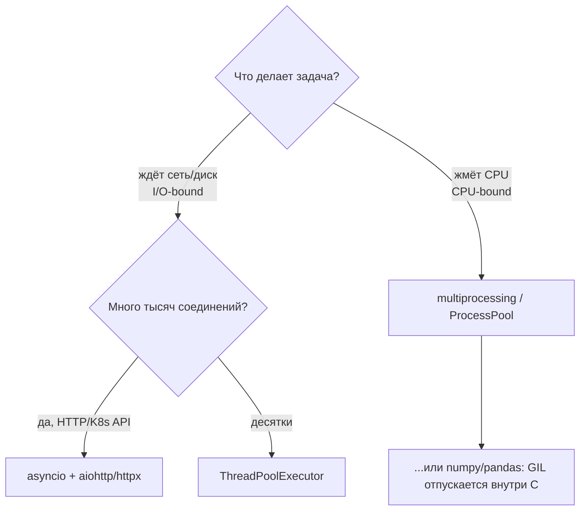

# ⚡ 04. Python: Asyncio, GIL и Конкурентность

## 🗺️ Карта выбора: потоки, процессы, asyncio



| Модель | Переключение | Подходит | Не подходит |
|---|---|---|---|
| Потоки | вытесняющее, GIL на байткоде | I/O, блокирующие SDK | CPU-нагрузка |
| Процессы | нет общей памяти | парсинг логов, хэширование | лёгкие задачи (overhead fork) |
| asyncio | кооперативное | 10k+ сетевых операций | блокирующие вызовы без обёрток |

**GIL:** глобальная блокировка интерпретатора — один поток исполняет байткод Python. При I/O GIL освобождается (поэтому потоки помогают), при чистом CPU — нет. В Python 3.13 есть экспериментальный free-threaded build, в 3.12+ — `subinterpreters`; в проде пока считаем GIL данным.

## 🔄 Asyncio: основы и типовые паттерны

```python
import asyncio, httpx

async def check_url(client, url):
    r = await client.get(url)
    return url, r.status_code

async def main():
    urls = [f"https://svc-{i}.local/health" for i in range(500)]
    async with httpx.AsyncClient(timeout=3) as client:
        results = await asyncio.gather(
            *(check_url(client, u) for u in urls), return_exceptions=True
        )
    ok = [(u, s) for u, s in results if not isinstance(s, Exception)]
    print(f"healthy {len(ok)}/{len(urls)}")

asyncio.run(main())
```

### Ограничение параллелизма: семафор

500 одновременных соединений уронят сервис или упрутся в ulimit:

```python
sem = asyncio.Semaphore(50)

async def bounded(client, url):
    async with sem:
        return await check_url(client, url)

# Или батчами через очередь-пул воркеров:
async def worker(queue, client, results):
    while True:
        url = await queue.get()
        try:
            results.append(await check_url(client, url))
        finally:
            queue.task_done()

async def pool(urls, workers=50):
    q = asyncio.Queue(maxsize=100)          # backpressure!
    ...
```

### Таймауты и отмена — обязательны

```python
async with asyncio.timeout(5):              # Python 3.11+
    data = await fetch_all()

# Гонка «кто быстрее» (fallback-зеркало):
result = await asyncio.wait_for(primary(), timeout=2)

# Отмена каскадная: cancel() бросает CancelledError внутрь корутины;
# корутина обязана её не глотать, а подчистить ресурсы:
try:
    await long_op()
except asyncio.CancelledError:
    await cleanup()                          # без await после этого — сразу raise
    raise
```

## ⚠️ Ловушки async-кода

1. **Блокирующий вызов замораживает весь loop.**

```python
time.sleep(10)          # ❌ стоит весь event loop
await asyncio.sleep(10) # ✅
requests.get(...)       # ❌
await httpx.get(...)    # ✅

# Старая блокирующая библиотека? Выносим в поток:
await asyncio.to_thread(boto3_client.list_buckets)     # ✅ стандартный мост
loop.run_in_executor(None, blocking_fn, arg)           # эквивалент вручную
```

2. **Забытый `await`** — корутина создана, но не запущена (`RuntimeWarning: coroutine was never awaited`). Включайте `-W error::RuntimeWarning` в CI.
3. **Общая мутабельная память** между корутинами: переключения непредсказуемы; для критичных секций `asyncio.Lock`, а не «и так сойдёт».

## 🧵 Потоки и процессы: когда они правильный ответ

```python
from concurrent.futures import ThreadPoolExecutor, ProcessPoolExecutor

# Блокирующие SDK (boto3, kubernetes-client) → пул потоков:
with ThreadPoolExecutor(max_workers=20) as ex:
    for res in ex.map(lambda n: describe_instance(n), instance_ids):
        process(res)

# CPU-работа (хэши, парсинг гигабайтов) → процессы:
with ProcessPoolExecutor(max_workers=8) as ex:
    for digest in ex.map(hash_file, files):      # map сохраняет порядок
        store(digest)
```

Аргументы процессов пикливаются — передаваемые объекты должны быть serializable; общие данные — через `multiprocessing.Manager`/`SharedMemory` (избегать без нужды).

## 🔬 Диагностика живого процесса

```bash
py-spy dump --pid 1234            # стек всех потоков БЕЗ остановки сервиса
py-spy record -p 1234 -o profile.svg --duration 30   # flamegraph
py-spy top -p 1234                # live-топ функций

# Внутри asyncio: где зависла корутина?
python -X dev app.py               # debug-mode: медленные колбэки >100ms, незакрытые ресурсы
asyncio.run(main(), debug=True)    # то же программно
```

Типовой разбор инцидента «сервис перестал отвечать»: `py-spy dump` показывает стек в `sock.recv` из синхронной библиотеки, вызванной прямо в корутине → мостик `to_thread`.

## ❓ Пять вопросов для самопроверки

---


## ✅ Проверь себя

> Отвечай вслух до раскрытия ответа. Если «не помню» — вернись к разделу.


**В1. Почему ThreadPool не ускоряет вычисление SHA-256 по миллиону файлов, а ProcessPool ускоряет?**
<details><summary>Ответ</summary>
Хэширование — чистый CPU, GIL разрешает исполнять байткод только одному потоку. Процессы имеют независимые интерпретаторы и ядра. Нюанс: hashlib для больших буферов отпускает GIL внутри C — на очень больших файлах потоки тоже дадут ускорение.
</details>

**В2. Как правильно вызвать блокирующую библиотеку (boto3) внутри async-кода?**
<details><summary>Ответ</summary>
`await asyncio.to_thread(fn)` или run_in_executor: вызов уходит в поток, event loop продолжает обслуживать другие корутины. Прямой вызов заблокирует ВСЕ соединения приложения.
</details>

**В3. Что произойдёт без `return_exceptions=True` в asyncio.gather?**
<details><summary>Ответ</summary>
Первое исключение немедленно выбросится из gather, остальные таски продолжат жить «осиротевшими» (не отменёнными автоматически до завершения gather). Для массовых проверок это теряет результаты и может подвесить выход — либо return_exceptions, либо TaskGroup (автоотмена siblings).
</details>

**В4. Зачем ограничивать параллелизм Semaphore'ом, если loop и так один?**
<details><summary>Ответ</summary>
Однопоточность не спасает от 10k открытых сокетов и исчерпания файловых дескрипторов/пула БД/лимитов API цели. Семафор (или max_connections клиента) задаёт backpressure — устойчивую пропускную способность вместо лавины таймаутов.
</details>

**В5. Сервис на FastAPI периодически «замирает». Первые три команды диагностики?**
<details><summary>Ответ</summary>
1) `py-spy dump --pid` — стеки потоков (ищем блокирующий вызов в event-loop-потоке); 2) перезапуск с `-X dev`/debug=True — предупреждения о медленных колбэках и незакрытых ресурсах; 3) метрики пула соединений/семафоров. Классическая причина — sync-вызов (requests, time.sleep, тяжёлый SQL) в async-обработчике.
</details>

---

*Что дальше:* [05. Типизация mypy/ruff](05-python-typing-mypy-ruff.md) · [06. CLI-приложения](06-python-cli-apps.md)
