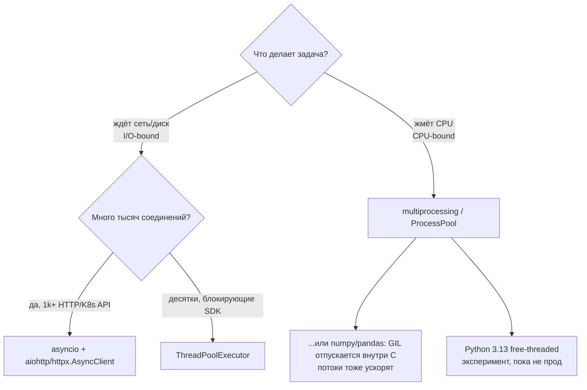
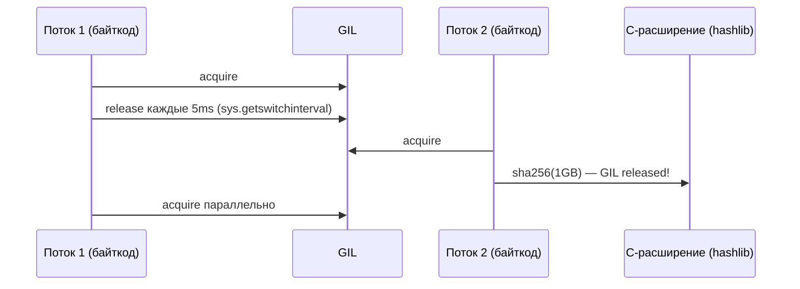
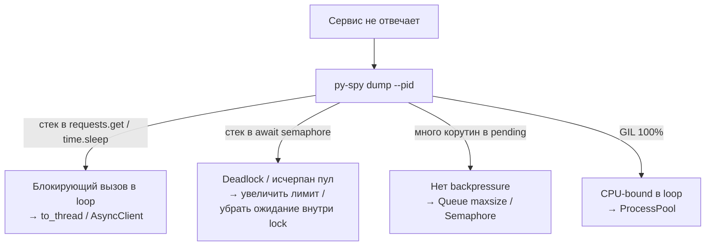

# ⚡ 04. Python: Asyncio, GIL и Конкурентность

> Уровень: Senior. Цель: выбрать правильную модель параллелизма, не заморозить прод, диагностировать зависания. I/O-bound vs CPU-bound vs GIL.

## 🗺️ Карта выбора: потоки, процессы, asyncio



| Модель | Переключение | Память | Подходит | Не подходит | Оверхед задачи |
|---|---|---|---|---|---|
| Потоки (`threading`) | вытесняющее, GIL на байткоде | общая (осторожно!) | I/O, блокирующие SDK (boto3) | CPU-нагрузка | ~50KB стек |
| Процессы (`multiprocessing`) | нет общей памяти (pickle) | изолированная | парсинг логов, хэширование | лёгкие задачи (fork cost) | ~10MB процесс |
| asyncio | кооперативное (`await`) | общая, но без гонок если без `await` внутри | 10k+ сетевых операций | блокирующие вызовы без обёрток | ~3KB корутина |
| `subinterpreters` (3.12+) | изоляция GIL | изолированная | эксперимент CPU-параллелизма | незрелый API | — |

**GIL — глубоко:**

```python
# GIL: глобальная блокировка интерпретатора — один поток исполняет байткод Python.
# При I/O GIL освобождается (поэтому потоки помогают для сети/диска), при чистом CPU — нет.
# В Python 3.13 есть экспериментальный free-threaded build (--disable-gil), в 3.12+ — subinterpreters;
# в проде пока считаем GIL данным.

import sys, threading, time

def cpu_bound(n):
    s = 0
    for i in range(n):
        s += i * i
    return s

# Потоки НЕ ускорят CPU-bound:
start = time.perf_counter()
threads = [threading.Thread(target=cpu_bound, args=(5_000_00,)) for _ in range(4)]
for t in threads: t.start()
for t in threads: t.join()
print(f"threads {time.perf_counter()-start:.2f}s")

# Процессы — ускорят:
from concurrent.futures import ProcessPoolExecutor
start = time.perf_counter()
with ProcessPoolExecutor(max_workers=4) as ex:
    list(ex.map(cpu_bound, [5_000_00]*4))
print(f"processes {time.perf_counter()-start:.2f}s")
# Но: fork на Linux копирует память (CoW), на macOS/Windows — spawn (перезапуск)!

# GIL отпускается внутри C-расширений на больших буферах:
import hashlib
# hashlib.sha256(data) — GIL освобождается на время хеширования C-кодом,
# поэтому ThreadPool для хешей больших файлов ТОЖЕ даёт ускорение (нюанс!)
```



---

## 🔄 Asyncio: основы и типовые паттерны

```python
import asyncio, httpx

async def check_url(client, url):
    r = await client.get(url)
    return url, r.status_code

async def main():
    urls = [f"https://svc-{i}.local/health" for i in range(500)]
    async with httpx.AsyncClient(timeout=3) as client:
        results = await asyncio.gather(
            *(check_url(client, u) for u in urls), return_exceptions=True
        )
    ok = [(u, s) for u, s in results if not isinstance(s, Exception)]
    print(f"healthy {len(ok)}/{len(urls)}")

asyncio.run(main())
```

### Event loop — что это

**Что:** один поток, цикл `while True: достать готовую задачу → выполнить до await → отдать управление`. `await` — точка где корутина добровольно отдаёт управление loop'у.

**Internals:**

```python
import asyncio

async def demo():
    print("start")
    await asyncio.sleep(1)  # отдаёт управление loop'у на 1с
    print("after 1s")
    # await fetch() — аналогично, но ждёт сеть

# asyncio.run() — создаёт новый loop, запускает корутину, закрывает loop
asyncio.run(demo())

# Внутри: loop = asyncio.new_event_loop(); loop.run_until_complete(demo())

# Корутина — объект, а не результат! Без await она не исполнится:
async def foo(): return 42
coro = foo()  # <coroutine object>
print(coro)   # не 42!
# await coro  # только так получим 42
# Забытый await — RuntimeWarning: coroutine was never awaited
```

**Почему кооперативность — и сила и риск:** переключение только на `await`. Если в корутине нет `await` 100ms — весь loop стоит (все 10k соединений ждут). Диагностика: `python -X dev` + `asyncio.run(..., debug=True)`.

### Ограничение параллелизма: семафор и очереди

500 одновременных соединений уронят сервис или упрутся в ulimit:

```python
import asyncio, httpx

sem = asyncio.Semaphore(50)

async def bounded(client, url):
    async with sem:
        return await check_url(client, url)

async def main_bounded(urls):
    async with httpx.AsyncClient(timeout=3, limits=httpx.Limits(max_connections=50)) as client:
        results = await asyncio.gather(*(bounded(client, u) for u in urls), return_exceptions=True)
        print(results)
```

**Пул воркеров через Queue — с backpressure:**

```python
import asyncio

async def worker(queue: asyncio.Queue, client, results: list):
    while True:
        url = await queue.get()
        if url is None:  # sentinel — сигнал остановки
            queue.task_done()
            break
        try:
            results.append(await check_url(client, url))
        except Exception as e:
            results.append((url, e))
        finally:
            queue.task_done()

async def pool(urls, workers=50):
    q: asyncio.Queue = asyncio.Queue(maxsize=100)  # backpressure! продюсер ждёт если очередь полна
    results: list = []
    async with httpx.AsyncClient(timeout=3) as client:
        # запустить воркеров:
        ws = [asyncio.create_task(worker(q, client, results)) for _ in range(workers)]
        # наполнить очередь:
        for u in urls:
            await q.put(u)
        # дождаться обработки:
        await q.join()
        # остановить воркеров:
        for _ in ws:
            await q.put(None)
        await asyncio.gather(*ws)
    return results

# Альтернатива — asyncio.TaskGroup (3.11+) с автоотменой:
async def with_taskgroup(urls):
    results = []
    async with asyncio.TaskGroup() as tg:
        for u in urls:
            tg.create_task(fetch_one(u, results))
    # TaskGroup ждёт всех; если один упал — остальные отменяются автоматически
    # vs gather(return_exceptions=False) — первое исключение, остальные «осиротевшие»
```

**Таблица — как ограничить:**

| Способ | Где лимит | Плюс |
|---|---|---|
| `Semaphore(50)` | в коде | просто, точно 50 одновременно |
| `httpx.Limits(max_connections=50)` | в клиенте | пул соединений + keep-alive |
| `Queue(maxsize=100)` | между продюсером и воркерами | backpressure, не копим 10k задач в памяти |
| `asyncio.TaskGroup` | группа тасок | автоотмена siblings при ошибке |

### Таймауты и отмена — обязательны

```python
import asyncio

async def demo_timeouts():
    async with asyncio.timeout(5):              # Python 3.11+ (заменяет wait_for для блоков)
        data = await fetch_all()

    # Гонка «кто быстрее» (fallback-зеркало):
    try:
        result = await asyncio.wait_for(primary(), timeout=2)
    except TimeoutError:
        result = await fallback()  # primary не успела — берём fallback

    # Отмена каскадная: cancel() бросает CancelledError внутрь корутины;
    # корутина обязана её не глотать, а подчистить ресурсы:
    try:
        await long_op()
    except asyncio.CancelledError:
        await cleanup()                          # без await после этого — сразу raise
        raise

    # Shield — защитить критичную операцию от отмены:
    await asyncio.shield(save_to_db())  # даже если внешний Task отменён, save завершится

# wait_for vs timeout:
# wait_for — оборачивает одну корутину, отменяет её при таймауте
# timeout — контекстный менеджер для блока, читаемее для нескольких await
```

**Failure — глотание CancelledError:**

```python
import asyncio, logging
log = logging.getLogger(__name__)

async def demo_cancel_handling():
    # ❌ Убивает отмену — таска никогда не завершится:
    try:
        await long_op()
    except asyncio.CancelledError:
        log.info("cancelled, ignoring")  # не перебросили — TaskGroup/gather повиснет!
        raise  # даже в «плохом» примере перебрасываем для компилируемости

    # ✅ Всегда перебрасывайте:
    try:
        await long_op()
    except asyncio.CancelledError:
        await cleanup()
        raise
    # Или не ловите CancelledError вообще — finally достаточно:
    try:
        await long_op()
    finally:
        await cleanup()  # выполнится и при отмене, и при успехе
```

### Gather vs TaskGroup vs as_completed — выбор

```python
import asyncio

async def fetch(n, delay=0.1):
    await asyncio.sleep(delay)
    if n == 3:
        raise ValueError("bad 3")
    return n

async def demo_gather():
    # gather — все сразу, результат в порядке входа:
    results = await asyncio.gather(fetch(1), fetch(2), fetch(3), return_exceptions=True)
    # [1, 2, ValueError] — порядок сохранён, ошибки как значения

    # gather без return_exceptions — первое исключение вылетает, остальные «осиротевшие»:
    try:
        await asyncio.gather(fetch(1), fetch(3))
    except ValueError:
        pass  # fetch(1) уже завершился, но gather не отменил его

    # TaskGroup — структурированная конкурентность (3.11+):
    try:
        async with asyncio.TaskGroup() as tg:
            tg.create_task(fetch(1))
            tg.create_task(fetch(3))  # упадёт → tg отменит fetch(1) если он ещё идёт
    except* ValueError as eg:  # ExceptionGroup!
        print(eg.exceptions)

    # as_completed — обрабатывать по мере готовности (стриминг):
    for coro in asyncio.as_completed([fetch(1, 0.3), fetch(2, 0.1)]):
        result = await coro  # первым придёт fetch(2) (0.1с)
        print(result)

    # wait — низкоуровневый контроль:
    done, pending = await asyncio.wait(
        [asyncio.create_task(fetch(1)), asyncio.create_task(fetch(2))],
        timeout=0.15, return_when=asyncio.FIRST_COMPLETED
    )
    for t in pending: t.cancel()  # не дождались — отменяем
```

| Паттерн | Порядок | Ошибки | Отмена siblings | Когда |
|---|---|---|---|---|
| `gather(return_exceptions=False)` | входной | первая вылетает | нет (осиротевшие) | когда все должны успеть |
| `gather(return_exceptions=True)` | входной | как значения | нет | массовые проверки (500 URL) |
| `TaskGroup` | нет | ExceptionGroup | да (авто) | структурированные задачи |
| `as_completed` | готовности | вылетают по одной | вручную | стриминг результатов |
| `wait(FIRST_COMPLETED)` | готовности | в done | вручную | гонки/таймауты |

---

## ⚠️ Ловушки async-кода

1. **Блокирующий вызов замораживает весь loop.**

```python
import time, asyncio, httpx, requests

async def demo_blocking():
    time.sleep(10)          # ❌ стоит весь event loop (10с ни одна корутина не идёт)
    await asyncio.sleep(10) # ✅ отдаёт управление

    requests.get("https://example.com")       # ❌ блокирует loop на секунды
    async with httpx.AsyncClient() as c:
        await c.get("https://example.com")    # ✅
    # await httpx.get(...)    # ❌ httpx.get — синхронный! нужен AsyncClient

    # Старая блокирующая библиотека? Выносим в поток:
    await asyncio.to_thread(boto3_client.list_buckets)     # ✅ стандартный мост (3.9+)
    loop = asyncio.get_running_loop()
    await loop.run_in_executor(None, blocking_fn, arg)     # эквивалент вручную (старее)

    # CPU в async — тоже в executor:
    await asyncio.to_thread(hash_file, path)  # иначе loop стоит пока хешируется
```

2. **Забытый `await`** — корутина создана, но не запущена (`RuntimeWarning: coroutine was never awaited`). Включайте `-W error::RuntimeWarning` в CI. `ruff` правило `ASYNC100`/`ASYNC109` ловит часть случаев.

3. **Общая мутабельная память** между корутинами: переключения только на `await`, но если `await` внутри — гонка.

```python
# ❌ Гонка: две корутины одновременно читают-пишут:
counter = 0
async def inc():
    global counter
    tmp = counter
    await asyncio.sleep(0)  # переключение — другая корутина меняет counter!
    counter = tmp + 1

# ✅ Lock для критичных секций:
lock = asyncio.Lock()
async def inc_safe():
    global counter
    async with lock:
        tmp = counter
        await asyncio.sleep(0)
        counter = tmp + 1

# Но лучше — без разделяемого состояния: Queue, возвращаемые значения, gather
```

4. **Незакрытые ресурсы — `ResourceWarning`:**

```python
import httpx, asyncio

async def demo_resources():
    # ❌ Клиент не закрыт:
    client = httpx.AsyncClient()
    await client.get("https://example.com")
    await client.aclose()  # забыли — утечка соединений (для примера закрыли)

    # ✅ Контекстный менеджер:
    async with httpx.AsyncClient() as client2:
        await client2.get("https://example.com")
    # или try/finally с aclose
```

---

## 🧵 Потоки и процессы: когда они правильный ответ

```python
from concurrent.futures import ThreadPoolExecutor, ProcessPoolExecutor, as_completed

# Блокирующие SDK (boto3, kubernetes-client) → пул потоков:
with ThreadPoolExecutor(max_workers=20) as ex:
    for res in ex.map(lambda n: describe_instance(n), instance_ids):
        process(res)

# CPU-работа (хэши, парсинг гигабайтов) → процессы:
with ProcessPoolExecutor(max_workers=8) as ex:
    for digest in ex.map(hash_file, files):      # map сохраняет порядок
        store(digest)

# as_completed — стриминг по готовности:
with ThreadPoolExecutor(max_workers=20) as ex:
    futures = {ex.submit(describe_instance, nid): nid for nid in instance_ids}
    for fut in as_completed(futures):
        nid = futures[fut]
        try:
            print(nid, fut.result(timeout=5))
        except Exception as e:
            print(f"{nid} failed: {e}")
```

**Детали и failure modes:**

```python
# ThreadPool — GIL, но I/O отпускает GIL → ускорение есть:
# ProcessPool — pickle аргументов/результатов → объекты должны быть serializable:

# ❌ Не сериализуемо — упадёт в ProcessPool:
# ex.submit(lambda: x)  # lambda не пиклится (в общем случае)
# ex.submit(open)        # файловый объект не пиклится

# ✅ Топ-левел функции + простые типы:
def hash_file(path: str) -> str:
    import hashlib
    return hashlib.sha256(open(path, "rb").read()).hexdigest()

# Общие данные — через Manager/SharedMemory (избегать без нужды):
from multiprocessing import Manager
with Manager() as m:
    shared = m.dict()
    # но это медленно (IPC) — лучше map/reduce

# Размер пула — формула:
# I/O-bound threads: 2-4 × CPU cores, или лимит API (20-50)
# CPU-bound processes: CPU cores (или cores-1 чтобы не забить хост)
import os
print(os.cpu_count())  # подсказка для max_workers

# Graceful shutdown — обработка Ctrl+C:
import signal
# ThreadPoolExecutor — демонические потоки не мешают выходу, но могут оборваться mid-task
# ProcessPoolExecutor — SIGTERM дочерним, нужен try/except KeyboardInterrupt вокруг map
```

| Параметр | ThreadPool | ProcessPool |
|---|---|---|
| Общение | общая память (GIL) | pickle через pipe |
| Стартовый cost | микросекунды | миллисекунды (fork/spawn) |
| Утечка памяти | общая — одна утечка на всех | изолированная |
| Отладка | стек общий | стек отдельный, `py-spy` на PID |
| Когда | boto3, DB, API | CPU, изоляция падений |

---

## 🔬 Диагностика живого процесса

```bash
py-spy dump --pid 1234            # стек всех потоков БЕЗ остановки сервиса
py-spy record -p 1234 -o profile.svg --duration 30   # flamegraph
py-spy top -p 1234                # live-топ функций (htop для Python)

# Внутри asyncio: где зависла корутина?
python -X dev app.py               # debug-mode: медленные колбэки >100ms, незакрытые ресурсы
# или программно:
asyncio.run(main(), debug=True)    # то же
# Переменные окружения:
PYTHONASYNCIODEBUG=1 python app.py
PYTHONTRACEMALLOC=1 python app.py  # трассировка аллокаций

# Логирование медленных колбэков:
import logging, asyncio
logging.basicConfig(level=logging.DEBUG)
async def slow():
    await asyncio.sleep(0.2)  # debug-mode предупредит если колбэк >100ms
```

Типовой разбор инцидента «сервис перестал отвечать»: `py-spy dump` показывает стек в `sock.recv` из синхронной библиотеки, вызванной прямо в корутине → мостик `to_thread` + `timeout`.

**Чеклист инцидента:**



---

## 🧪 Тестирование async-кода

```python
import pytest, asyncio, httpx, respx

# pytest-asyncio — маркер для async тестов:
@pytest.mark.asyncio
async def test_check_url():
    async with httpx.AsyncClient() as client:
        # respx для httpx:
        with respx.mock:
            respx.get("https://svc.local/health").mock(return_value=httpx.Response(200))
            url, code = await check_url(client, "https://svc.local/health")
            assert code == 200

# Таймаут на тест — защита от зависших корутин:
@pytest.mark.asyncio
@pytest.mark.timeout(2)
async def test_with_timeout():
    await asyncio.sleep(0.1)
    assert True

# Мок async-функции:
from unittest.mock import AsyncMock, patch

@patch("app.fetch", new_callable=AsyncMock)
@pytest.mark.asyncio
async def test_mocked(mock_fetch):
    mock_fetch.return_value = {"ok": True}
    result = await fetch_with_retry()
    mock_fetch.assert_awaited()

# Проверка что корутина отменилась:
@pytest.mark.asyncio
async def test_cancel():
    task = asyncio.create_task(asyncio.sleep(10))
    task.cancel()
    with pytest.raises(asyncio.CancelledError):
        await task
```

**Failure — `pytest-asyncio` mode:** с 0.23 `asyncio_mode = auto` (в `pyproject.toml`) позволяет не ставить `@pytest.mark.asyncio` на каждый тест. Без него — тест соберётся как `async def`, но не запустится (warning).

### Дополнительные паттерны: очереди, стриминг, бэкпрессура

```python
import asyncio, json

# Паттерн: producer → queue → consumers (fan-out)
async def producer(queue: asyncio.Queue, files: list[str]):
    for f in files:
        await queue.put(f)
    for _ in range(3):  # столько sentinel, сколько воркеров
        await queue.put(None)

async def consumer(queue: asyncio.Queue, out: list):
    while True:
        item = await queue.get()
        if item is None:
            queue.task_done()
            break
        try:
            data = await asyncio.to_thread(open(item).read)
            out.append(json.loads(data))
        finally:
            queue.task_done()

async def fanout(files: list[str]):
    q: asyncio.Queue = asyncio.Queue(maxsize=10)
    out: list = []
    prod = asyncio.create_task(producer(q, files))
    cons = [asyncio.create_task(consumer(q, out)) for _ in range(3)]
    await asyncio.gather(prod, *cons)
    await q.join()
    return out

# Паттерн: стрим результатов по мере готовности (async generator):
async def stream_results(urls: list[str]):
    sem = asyncio.Semaphore(20)
    async def fetch_one(url: str):
        async with sem:
            await asyncio.sleep(0.05)  # имитация сети
            return url, 200
    # as_completed — отдаём клиенту сразу, не ждём всех:
    for coro in asyncio.as_completed([fetch_one(u) for u in urls]):
        yield await coro

async def demo_stream():
    async for url, code in stream_results([f"https://svc-{i}.local" for i in range(10)]):
        print(url, code)
```

### Subinterpreters и free-threaded Python — что ждать

```python
# Python 3.12+ — subinterpreters (PEP 684): каждый интерпретатор со своим GIL
# Пока экспериментальны, API через concurrent.interpreters (3.13+)
# import concurrent.interpreters  # 3.13
# interp = concurrent.interpreters.create()
# interp.exec('x = 42')

# Python 3.13 free-threaded (--disable-gil):
# - GIL отключается, потоки реально параллелят CPU
# - Цена: медленнее однопоточный код (~10%), новые гонки внутри C-расширений
# - В проде — ждать 3.14+ и поддержки numpy/pandas

# Практический вывод на 2026:
# - CPU-bound → ProcessPool (стабильно)
# - I/O-bound много соединений → asyncio (стабильно)
# - Эксперименты с free-threaded — только для бенчмарков, не для прод-деплойментов
```

### Профилирование async-кода

```bash
# Бенчмарк разных моделей на одной задаче (500 healthchecks):
hyperfine --warmup 2 'python sync_fetch.py' 'python async_fetch.py' 'python threaded_fetch.py'

# yappi — профилирование с поддержкой async:
pip install yappi
python -m yappi -o callgrind.out async_fetch.py
py-spy record -o flame.svg -- python async_fetch.py  # flamegraph с async-стеками

# Метрики в проде — счётчики:
# - queue.qsize() — длина очереди (бэкпрессура)
# - semaphore._value — свободные слоты
# - asyncio.all_tasks() — число живых задач (утечка если растёт бесконечно)
```

### Чеклист выбора модели — таблица решений

| Задача | Объём | Рекомендация | Почему |
|---|---|---|---|
| 10 HTTP-запросов | мало | `httpx.Client` sync | проще, без async |
| 500 HTTP-запросов | много | `asyncio + Semaphore(50)` | 10× быстрее, контроль лимита |
| 10k WebSocket | очень много | `asyncio + uvloop` | uvloop быстрее stdlib loop |
| Хеши 1M файлов | CPU | `ProcessPool(cores)` | GIL, изоляция падений |
| Парсинг гигабайта логов | CPU+I/O | `ProcessPool` + `mmap` | параллельный парсинг |
| boto3 вызовы | I/O блокирующий | `ThreadPool(20)` | boto3 sync, GIL отпускается |
| Смешанная (API+CPU) | — | `asyncio` + `to_thread`/`ProcessPool` | loop для I/O, пулы для тяжёлого |

**uvloop — ускорение event loop:**

```bash
pip install uvloop
import asyncio, uvloop
asyncio.set_event_loop_policy(uvloop.EventLoopPolicy())
# uvloop быстрее stdlib на 2-4× для большого числа соединений (на epoll/kqueue)
# Нюанс: uvloop не на Windows, не в free-threaded
```

---

## ❓ Десять вопросов для самопроверки

---

## ✅ Проверь себя

> Отвечай вслух до раскрытия ответа. Если «не помню» — вернись к разделу.


**В1. Почему ThreadPool не ускоряет вычисление SHA-256 по миллиону файлов, а ProcessPool ускоряет?**
<details><summary>Ответ</summary>
Хэширование малыми блоками — чистый Python-байткод + GIL (один поток исполняет байткод). Процессы имеют независимые интерпретаторы и ядра, GIL на процесс свой. Нюанс: hashlib для больших буферов отпускает GIL внутри C — на очень больших файлах (GB) потоки тоже дадут ускорение, т.к. время в C без GIL.
</details>

**В2. Как правильно вызвать блокирующую библиотеку (boto3) внутри async-кода?**
<details><summary>Ответ</summary>
`await asyncio.to_thread(fn, *args)` или `await loop.run_in_executor(None, fn, arg)`: вызов уходит в поток из пула, event loop продолжает обслуживать другие корутины. Прямой вызов `boto3.client.list_buckets()` заблокирует ВСЕ соединения приложения на секунды.
</details>

**В3. Что произойдёт без `return_exceptions=True` в asyncio.gather?**
<details><summary>Ответ</summary>
Первое исключение немедленно выбросится из gather, остальные таски продолжат жить «осиротевшими» (не отменёнными автоматически до завершения gather). Для массовых проверок это теряет результаты и может подвесить выход — либо return_exceptions=True, либо TaskGroup (автоотмена siblings через ExceptionGroup).
</details>

**В4. Зачем ограничивать параллелизм Semaphore'ом, если loop и так один?**
<details><summary>Ответ</summary>
Однопоточность не спасает от 10k открытых сокетов и исчерпания файловых дескрипторов (ulimit -n 1024 по умолчанию), пула БД/лимитов API цели. Семафор (или max_connections клиента, или Queue maxsize) задаёт backpressure — устойчивую пропускную способность вместо лавины таймаутов и OOM.
</details>

**В5. Сервис на FastAPI периодически «замирает». Первые три команды диагностики?**
<details><summary>Ответ</summary>
1) `py-spy dump --pid` — стеки всех потоков (ищем блокирующий вызов в event-loop-потоке: requests, time.sleep, тяжёлый SQL); 2) перезапуск с `python -X dev` / `asyncio.run(debug=True)` — предупреждения о медленных колбэках >100ms и незакрытых ресурсах; 3) метрики пула соединений/семафоров + `py-spy top`. Классическая причина — sync-вызов в async-обработчике.
</details>

**В6. Чем `asyncio.gather` отличается от `asyncio.TaskGroup` при ошибке одной из задач?**
<details><summary>Ответ</summary>
gather без return_exceptions — бросает первое исключение, но остальные задачи продолжают работу «осиротевшими». TaskGroup — при ошибке одной задачи автоматически отменяет все sibling-задачи и собирает исключения в ExceptionGroup (except*). TaskGroup — структурированная конкурентность, gather — «запустить и собрать».
</details>

**В7. Почему `await asyncio.sleep(0)` может исправить гонку, но не является правильным решением?**
<details><summary>Ответ</summary>
`sleep(0)` отдаёт управление loop'у, позволяя другим корутинам выполниться, но порядок остаётся недетерминированным — гонка лишь маскируется. Правильно: `asyncio.Lock` для критичной секции, или `Queue` для передачи данных, или отсутствие shared mutable state вообще.
</details>

**В8. Что утечёт если не закрыть `httpx.AsyncClient` и как это поймать в тестах?**
<details><summary>Ответ</summary>
Соединения (сокеты) и пул коннектов останутся открытыми — утечка FD, `ResourceWarning: unclosed transport`. Ловится `python -W error::ResourceWarning` или `PYTHONASYNCIODEBUG=1`, или `pytest` с `filterwarnings = ["error::ResourceWarning"]`. Фикс: `async with AsyncClient() as client:` или `try/finally: await client.aclose()`.
</details>

**В9. Когда `ProcessPoolExecutor` упадёт с `PicklingError`, а `ThreadPoolExecutor` — нет?**
<details><summary>Ответ</summary>
Процессы передают аргументы/результаты через pickle между интерпретаторами: lambda, локальные функции, открытые файлы, threading.Lock — не пиклятся. Потоки делят память и не пиклят — им можно передавать любые объекты. Фикс: вынести функцию на верхний уровень модуля, передавать только сериализуемые типы (str, int, bytes, dataclass без файлов).
</details>

**В10. Как реализовать «гонку с таймаутом» — primary 2с, иначе fallback — без утечки зависшей primary?**
<details><summary>Ответ</summary>
`try: result = await asyncio.wait_for(primary(), timeout=2) except TimeoutError: result = await fallback()` — wait_for отменит primary при таймауте (бросит CancelledError внутрь). Альтернатива: `async with asyncio.timeout(2):` (3.11+). Без отмены зависшая primary останется висеть и держать ресурсы; shield не нужен тут, т.к. отмена желательна.
</details>

---

## 🧪 Лаборатория: найди блокировку и внедри backpressure

**Цель:** воспроизвести и починить замерзший loop.

```python
# lab_blocking.py — запустите и диагностируйте
import asyncio, time

async def bad_fetch(n):
    time.sleep(0.5)  # ❌ блокирует loop — все 10 задач идут 5с последовательно
    return n

async def good_fetch(n):
    await asyncio.sleep(0.5)  # ✅ параллельно — 10 задач за 0.5с
    return n

# Замер:
async def main():
    import time as t
    start = t.perf_counter()
    await asyncio.gather(*(bad_fetch(i) for i in range(5)))
    print(f"bad: {t.perf_counter()-start:.2f}s")  # ~2.5с

    start = t.perf_counter()
    await asyncio.gather(*(good_fetch(i) for i in range(5)))
    print(f"good: {t.perf_counter()-start:.2f}s")  # ~0.5с

asyncio.run(main())
# Запустите с: python -X dev lab_blocking.py  — увидите предупреждение о блокировке
```

**Задание 2 — Semaphore:**

```python
# lab_semaphore.py — без лимита уроните лимит FD
import asyncio, httpx

async def fetch_many(urls, limit=10):
    sem = asyncio.Semaphore(limit)
    async def bounded(url):
        async with sem:
            async with httpx.AsyncClient() as client:
                # имитация сети:
                await asyncio.sleep(0.05)
                return url
    return await asyncio.gather(*(bounded(u) for u in urls))

# Попробуйте limit=1000 с 10000 urls — увидите OSError: too many open files
# Поставьте limit=50 — стабильно.
```

**Проверь себя:** `bad` в 5× медленнее `good` из-за `time.sleep`; `good` с `Semaphore` не превышает лимит FD.

### Задание 3: failure injection — уроните FD лимит

```python
# lab_fd_limit.py — покажите что без Semaphore падаем
import asyncio, resource

# Узнайте лимит:
soft, hard = resource.getrlimit(resource.RLIMIT_NOFILE)
print(f"FD limit soft={soft} hard={hard}")  # обычно 1024

# Симулируйте открытие 2000 соединений без лимита:
async def open_many(n, limit=None):
    sem = asyncio.Semaphore(limit) if limit else None
    async def fake_conn(i):
        if sem:
            async with sem:
                await asyncio.sleep(0.01)
        else:
            await asyncio.sleep(0.01)
        return i
    return await asyncio.gather(*(fake_conn(i) for i in range(n)))

# Без лимита — OSError: too many open files (на реальном httpx)
# С лимитом — стабильно:
# asyncio.run(open_many(2000, limit=100))

# Проверка метрики:
# watch 'ls /proc/$(pgrep -f lab_fd)/fd | wc -l'  — число открытых FD
```

**Разбор:** FD-лимит 1024 — классическая причина `OSError` при массовых опросах K8s API. Semaphore = защита, `ulimit -n 4096` — временный костыль, правильнее — бэкпрессура.

### Чеклист production async-сервиса

| Пункт | Проверка | Инструмент |
|---|---|---|
| Нет блокировок в loop | `python -X dev` чист | `-W error::ResourceWarning` |
| Backpressure везде | Queue maxsize / Semaphore | метрики `qsize`, `sem._value` |
| Таймауты на всё | `timeout`/`wait_for` | `asyncio.timeout` |
| Graceful shutdown | `TaskGroup` + `cancel` | `signal` handler |
| Лимит соединений | `httpx.Limits` | `max_connections` |
| Мониторинг | `all_tasks()` не растёт | Prometheus gauge |

---

*Что дальше:* [05. Типизация mypy/ruff](05-python-typing-mypy-ruff.md) · [06. CLI-приложения](06-python-cli-apps.md)
