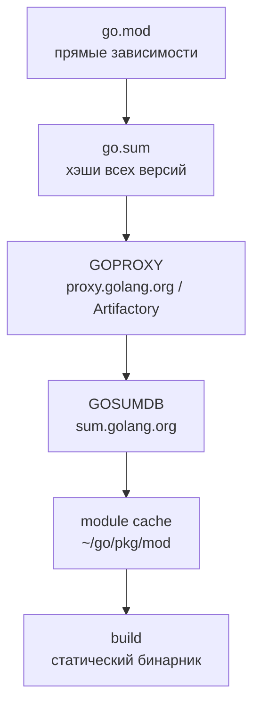
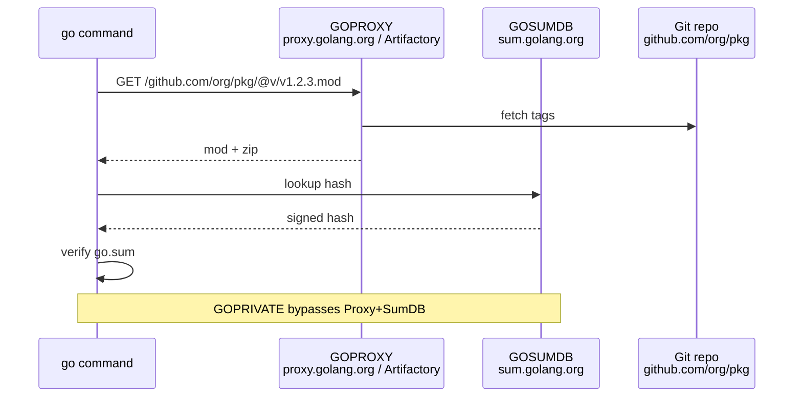
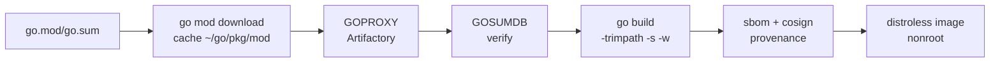

# 📦 05. Go Modules: Зависимости, Приватные Репо, Supply Chain — Production Deep Dive

> Полный гайд по модулям Go для DevOps: `go.mod`/`go.sum`, SemVer + v2, `GOPRIVATE`, прокси, vendor, `govulncheck`, reproducible builds, `GOMEMLIMIT` и CI-хигиена. Весь код — `go vet` чист.

**Оглавление:** 1. Устройство · 2. SemVer + v2 · 3. go mod команды · 4. Приватные репо · 5. Прокси и sumdb · 6. Supply chain · 7. Память и GC в модулях · 8. Сеть и система · 9. Наблюдаемость · 10. Безопасность · 11. Гигиена · 12. Production checklist · 13. Проверь себя · 14. Лабы

---

## 🗂️ Как устроены модули

```text
go.mod                      # имя модуля, версия Go, require/exclude/retract
go.sum                      # хэши содержимого ВСЕХ версий зависимостей — integrity
cmd/api/main.go             # бинарники в cmd/<name>/main.go
internal/...                # internal НЕ импортируется извне модуля — инкапсуляция
pkg/...                     # публичные библиотеки (если это библиотека)
vendor/                     # опционально: копия зависимостей (go mod vendor)
```

```go
// go.mod — пример production-модуля
module gitlab.local/platform/toolkit

go 1.22

toolchain go1.22.5

require (
	github.com/spf13/cobra v1.8.1
	k8s.io/client-go v0.30.0
	github.com/prometheus/client_golang v1.19.0
)

require (
	github.com/inconshreveable/mousetrap v1.1.0 // indirect
	golang.org/x/sys v0.18.0 // indirect
)

exclude github.com/bad/pkg v1.2.0 // запретить сломанную версию
retract v1.4.2 // отозвать релиз

replace github.com/lib/foo => ./local-foo // локальная замена для debug
```



| Файл | Что хранит | Коммитить? | Проверяется |
| :--- | :--- | :--- | :--- |
| `go.mod` | прямые зависимости, go version | да | `go mod tidy` |
| `go.sum` | хэши всех транзитивных | да | `go mod download` |
| `vendor/` | копии зависимостей | опционально | `go mod vendor` |

---

## 🔖 Версионирование SemVer + v2+

Модульная система жёстко связана с SemVer:

- `v1.x.x` — стабильное API; breaking change → **новый major путь импорта**: `module/gitlab.local/x/v2` (да, `/v2` в конце пути).
- Псевдоверсии для коммитов: `v0.0.0-20260825091200-abcdef123456`.
- Теги репо управляют версиями: `git tag v1.4.2 && git push origin v1.4.2`.
- `go list -m -versions github.com/foo/bar` — список доступных версий.

```bash
# Откат проблемного релиза без удаления тега:
go mod edit -retract=v1.4.2          # пометить отозванной (появится в списке версий)
go mod edit -retract='[v1.4.0, v1.4.2]' # диапазон

# Замена на форк/локальную копию при отладке:
go mod edit -replace github.com/lib/foo=./local-foo
go mod edit -dropreplace github.com/lib/foo

# Обновление
go get github.com/spf13/cobra@v1.8.0
go get -u ./...                      # обновить всё (осторожно! — может сломать)
go get -u=patch ./...                # только патчи

# Псевдоверсия для коммита без тега
go get github.com/foo/bar@a1b2c3d4
# → v0.0.0-20260825091200-a1b2c3d4e5f6
```

| Версия | Путь импорта | Пример |
| :--- | :--- | :--- |
| `v0` | `github.com/org/pkg` | нестабильный API |
| `v1` | `github.com/org/pkg` | стабильный |
| `v2+` | `github.com/org/pkg/v2` | breaking change |

```go
// v2 — новый major с суффиксом
// go.mod: module github.com/org/pkg/v2
import "github.com/org/pkg/v2"
// v1 и v2 могут сосуществовать в одном бинарнике!
import (
	pkg1 "github.com/org/pkg"
	pkg2 "github.com/org/pkg/v2"
)
```

---

## 🛠️ Команды go mod — шпаргалка

```bash
go mod init gitlab.local/platform/toolkit        # создать модуль
go mod tidy                                      # синхронизировать go.mod/go.sum с импортами — ОБЯЗАТЕЛЬНО перед коммитом
go mod why -m k8s.io/client-go                   # ЗАЧЕМ эта зависимость? кто тянет
go mod why k8s.io/client-go/kubernetes
go mod graph | grep client-go                    # кто её тянет — граф
go list -m -u all                                # какие модули устарели
go list -m -versions github.com/spf13/cobra     # доступные версии
go list -m -json k8s.io/client-go | jq .Version
go mod download                                  # скачать все зависимости в cache
go mod verify                                    # проверить хэши из go.sum
go env GOPATH GOMODCACHE GOPROXY GOSUMDB GOPRIVATE
```

```go
// Проверка, зачем зависимость в коде
// go mod graph | grep -E "toolkit.*client-go"
// toolkit -> k8s.io/client-go v0.30.0
// k8s.io/client-go -> k8s.io/api v0.30.0

// go mod tidy — удаляет неиспользуемые, добавляет недостающие
// go mod tidy -e — даже с ошибками сборки
// go mod tidy -go=1.22 — обновить версию Go в go.mod
```

| Команда | Когда | Частота |
| :--- | :--- | :--- |
| `go mod tidy` | после изменения импортов | каждый PR |
| `go mod why` | разбираешь, откуда зависимость | при ревью |
| `go list -m -u all` | перед обновлением | недельно |
| `go mod verify` | в CI, проверка целостности | каждый CI |
| `go mod download` | в Docker layer cache | в Dockerfile |

---

## 🔐 Приватные репозитории: GOPRIVATE и SSH

```bash
go env -w GOPRIVATE="gitlab.local/*,github.com/org/private-*"
go env -w GONOSUMCHECK="gitlab.local/*"        # (устар. вариант; сейчас достаточно GOPRIVATE)
go env -w GONOSUMDB="gitlab.local/*"
go env -w GOFLAGS=-mod=readonly                # запрет случайных изменений go.mod в CI
go env -w GOPROXY="https://proxy.local,direct" # приватный прокси + fallback
go env -w GONOSUMDB="*"
# Проверка
go env | grep -E "GOPRIVATE|GOPROXY|GOSUMDB"

# Авторизация через SSH вместо HTTPS (GitLab/GitHub):
git config --global url."git@gitlab.local:".insteadOf "https://gitlab.local/"
git config --global url."git@github.com:".insteadOf "https://github.com/"

# Или токен в netrc для CI:
cat > ~/.netrc <<'EOF'
machine gitlab.local login __token__ password glpat-xxx
machine github.com login __token__ password ghp_xxx
EOF
chmod 600 ~/.netrc

# GitLab CI: GO_AUTH через CI_JOB_TOKEN:
export GITLAB_TOKEN=$CI_JOB_TOKEN
GOPROXY=https://gitlab.local/api/v4/projects/<id>/packages/go/proxy go mod download

# GitHub: GITHUB_TOKEN
git config --global url."https://${GITHUB_TOKEN}@github.com/".insteadOf "https://github.com/"

# Для Docker — BuildKit secret
# docker build --secret id=netrc,src=$HOME/.netrc
```

```dockerfile
# Dockerfile с приватными модулями — правильно через --mount=type=secret
FROM golang:1.22 AS build
WORKDIR /src
COPY go.mod go.sum ./
RUN --mount=type=secret,id=netrc,target=/root/.netrc \
    --mount=type=secret,id=gitconfig,target=/root/.gitconfig \
    GOPRIVATE=gitlab.local/* go mod download
COPY . .
RUN --mount=type=secret,id=netrc,target=/root/.netrc \
    CGO_ENABLED=0 go build -trimpath -o /out/app ./cmd/api
```

**Vendor vs module cache:**

| Подход | Плюсы | Минусы | Когда |
| :--- | :--- | :--- | :--- |
| `go mod download` (cache) | быстро, мало места | нужен интернет/proxy | обычно |
| `go mod vendor` | offline, diff-ревью, air-gapped | раздувает репо | строгие требования, offline CI |

```bash
go mod vendor                    # кладёт зависимости в vendor/
go build -mod=vendor ./...       # собирать из vendor
go mod tidy && go mod vendor     # дисциплина: всегда вместе
git add vendor/ && git commit -m "vendor: update deps"
```

---

## 🌐 Прокси и sumdb — как работает загрузка



```bash
# Настройка прокси — порядок важен!
go env -w GOPROXY="https://proxy.local,https://proxy.golang.org,direct"
# proxy.local — ваш Artifactory/Nexus
# proxy.golang.org — публичный
# direct — напрямую в Git, если прокси не ответил

# Проверить, откуда качается
GOPROXY=direct go mod download -x 2>&1 | head -n 20
GOPROXY=https://proxy.golang.org,direct go mod download -x 2>&1 | head

# Sumdb — проверка хэшей
go env GOSUMDB
# sum.golang.org — по умолчанию, GONOSUMDB отключает для приватных

# Приватный прокси в enterprise: Artifactory/Nexus как GOPROXY mirror
# — контроль лицензий, кэш, работа без внешнего интернета, аудит
```

| Переменная | Что делает | Пример |
| :--- | :--- | :--- |
| `GOPROXY` | список прокси через запятую | `https://proxy.local,direct` |
| `GOSUMDB` | база хэшей | `sum.golang.org` |
| `GONOSUMDB` | исключения для sumdb | `gitlab.local/*` |
| `GOPRIVATE` | исключения для обоих (proxy+sumdb) | `gitlab.local/*` |
| `GONOSUMCHECK` | устарело, = GONOSUMDB | — |

---

## 🛡️ Supply chain: проверка и воспроизводимость

```bash
# Уязвимости в зависимостях (official, Go 1.18+):
govulncheck ./...                    # показывает только ДОСТИЖИМЫЙ уязвимый код!
go install golang.org/x/vuln/cmd/govulncheck@latest
govulncheck -show verbose ./...

# Подпись и provenance (SLSA): goreleaser генерирует attestation,
# проверка потребителем:
cosign verify-blob --signature pkg.sig --certificate pkg.crt pkg.tar.gz
cosign verify --certificate-identity-regexp ".*" --certificate-oidc-issuer "https://token.actions.githubusercontent.com" ghcr.io/org/app:v1.2.3

# Воспроизводимая сборка:
go build -trimpath -ldflags="-s -w -X main.version=$(git describe --tags)" -o bin/tool
#  -trimpath: убрать пути машины (детерминизм)
#  -s -w: без символов/дебага (размер −30%)
#  -X main.version: вшить версию в бинарник

# Проверка воспроизводимости
go build -trimpath -o bin/a ./cmd/api
go build -trimpath -o bin/b ./cmd/api
sha256sum bin/a bin/b # должны совпасть

# SBOM
go run github.com/anchore/syft@latest packages dir:. -o spdx-json > sbom.json
```

| Механизм | Что даёт | Инструмент |
|---|---|---|
| `go.sum` + `GOSUMDB` | целостность: чужой код не подменят незаметно | `go mod verify` |
| `GOPROXY` (proxy.golang.org / Artifactory) | неизменяемый кэш версий, survives repo deletion | `GOPROXY` |
| `govulncheck` call-graph | реальная достижимость CVE, а не шум по имени пакета | `govulncheck` |
| `-trimpath` + pinned toolchain | одинаковый бинарник из любого checkout'а | `go build -trimpath` |
| `cosign` + SLSA | подпись артефактов, provenance | `cosign`, `goreleaser` |
| `syft` SBOM | список зависимостей для аудита | `syft` |

```go
// Версия в бинарнике — обязательно для поддержки
var version = "dev" // вшивается ldflags

func main() {
	if len(os.Args) > 1 && os.Args[1] == "--version" {
		fmt.Println(version) // какой бинарь крутится на сервере?
		os.Exit(0)
	}
}
```

---

## 🧠 Память и рантайм для модулей

```go
// Большие зависимости → больше бинарник, больше heap
// go list -m -json k8s.io/client-go | jq .Version
// go mod graph | wc -l // сколько транзитивных

// Размер бинарника
// go build -o bin/app ./cmd/api && ls -lh bin/app
// -s -w: strip symbols → -30%
// -trimpath: детерминизм

// Профилирование зависимостей — кто аллоцирует?
// go test -bench=. -benchmem
// go tool pprof -http=:8080 mem.out

// GOMEMLIMIT для CI с ограниченным RAM
// GOMEMLIMIT=512MiB go test ./... // не OOMKill в маленьком runner
```

| Проблема | Симптом | Фикс |
| :--- | :--- | :--- |
| Раздутый бинарник | `bin/app` 100 MB | `go mod why`, удалить лишнее, `ldflags -s -w` |
| Много транзитивных | `go mod graph` 200 строк | `go mod tidy`, `exclude`, замена лёгкой либой |
| OOM в CI | `go test` падает | `GOMEMLIMIT`, `GOMAXPROCS` |

---

## 🌐 Сеть и система для модулей

```go
// Загрузка модулей — сеть, нужен таймаут и ретрай
// go mod download — уважает GOPROXY, но без контекста
// В CI — ретрай на уровне shell
```

```bash
# Ретрай для go mod download в CI
for i in 1 2 3; do go mod download && break || sleep 5; done

# Проверка доступности прокси
curl -sf https://proxy.golang.org/health || echo "proxy down, using direct"
GOPROXY=direct go mod download

# DNS и прокси — таймауты
export GOPROXY=https://proxy.local
export GOSUMDB=sum.golang.org
time go mod download -x 2>&1 | tail -n 20
```

```go
// exec с контекстом — для tools
func runGoMod(ctx context.Context, args ...string) ([]byte, error) {
	ctx, cancel := context.WithTimeout(ctx, 30*time.Second)
	defer cancel()
	out, err := exec.CommandContext(ctx, "go", append([]string{"mod", "tidy"}, args...)...).CombinedOutput()
	if err != nil {
		return nil, fmt.Errorf("go mod tidy: %w: %s", err, out)
	}
	return out, nil
}
```

---

## 🔭 Наблюдаемость модулей

```bash
# Версии и уязвимости — метрики для дашборда
go list -m -u -json all | jq -r '[.Path, .Version, .Update.Version] | @tsv'
govulncheck -json ./... | jq '.findings[] | .osv + " " + .fixedVersion'

# Логи сборки — структурированные
go build -x -trimpath ./... 2>&1 | grep "proxy.golang.org"

# Метрики бинарника
# go_memstats_heap_inuse_bytes — рост после обновления зависимости?
# go_goroutines — новая версия течёт?

# pprof для проверки, что новая зависимость не аллоцирует
go test -bench=. -benchmem -memprofile mem.out
go tool pprof -top mem.out | head -n 20
```

| Сигнал | Что смотреть | Инструмент |
| :--- | :--- | :--- |
| `go list -m -u` | устаревшие модули | `go list` |
| `govulncheck` | reachable CVE | `govulncheck -json` |
| `benchmem` | новые аллокации | `benchstat` |
| `pprof` | heap profile | `go tool pprof` |

---

## 🔒 Безопасность: supply chain hardening

```bash
# govulncheck — только достижимые пути, не шум
govulncheck ./... # в CI обязательно

# Проверка go.sum не модифицирован
go mod tidy && git diff --exit-code go.mod go.sum
# если diff — кто-то забыл tidy или подменил

# Проверка лицензий
go run github.com/google/go-licenses@latest check ./...

# Сканирование секретов в go.mod/go.sum — не хранить токены!
grep -r "glpat-" go.mod go.sum && echo "LEAK!"

# Dependabot/Renovate — автообновления
# .github/dependabot.yml: go mod
```

```yaml
# .github/workflows/security.yml
name: security
on: [push, schedule]
jobs:
  govulncheck:
    runs-on: ubuntu-latest
    steps:
      - uses: actions/checkout@v4
      - uses: actions/setup-go@v5
        with: { go-version: '1.22' }
      - run: go install golang.org/x/vuln/cmd/govulncheck@latest
      - run: govulncheck ./...
  licenses:
    runs-on: ubuntu-latest
    steps:
      - uses: actions/checkout@v4
      - run: go run github.com/google/go-licenses@latest check ./...
```

| Риск | Митигация | Инструмент |
| :--- | :--- | :--- |
| Вредоносная зависимость | `go.sum` + `GOSUMDB`, `govulncheck` | `go mod verify` |
| Утечка токена | `GOPRIVATE`, `netrc` 600, не в `go.mod` | `gitleaks` |
| Лицензия GPL в транзитиве | `go-licenses` | `go-licenses check` |
| Подмена тега | `GOPROXY` immutable cache | `proxy.golang.org` |

---

## 🧹 Гигиена зависимостей

```bash
go mod tidy && go vet ./... && gofmt -l .         # базовый набор перед PR
go run golang.org/x/tools/cmd/deadcode@latest ./...   # мёртвый код
# Минимизируйте зависимости: stdlib покрывает http/json/sql —
# каждый import это supply-chain риск и время сборки.

# Проверка неиспользуемых зависимостей
go mod tidy && git diff --exit-code
# Если diff пустой — всё tidy

# Обновление — осознанно, не go get -u ./...
go list -m -u all # посмотреть, что устарело
go get github.com/spf13/cobra@v1.8.1 # точечно
go mod tidy
go test ./... -race

# Удаление неиспользуемой зависимости
go get github.com/unused/pkg@none
go mod tidy
```

| Правило | Почему | Как проверять |
| :--- | :--- | :--- |
| `go mod tidy` перед коммитом | `go.sum` актуален | `git diff --exit-code` |
| Не `go get -u ./...` вслепую | ломает API | `go list -m -u all` → точечно |
| Минимизируй зависимости | каждый импорт = риск + время сборки | `go mod graph \| wc -l` |
| `exclude` для сломанных версий | защита от bad release | `go mod edit -exclude` |
| `retract` для своих bad тегов | не удалять тег, а отозвать | `go mod edit -retract` |

```go
// stdlib покрывает 80% — не тяни лишнее
// http, json, sql, net, os/exec, flag, log/slog — без внешних deps
// cobra — только для сложных CLI, иначе flag
// testify — только в тестах, не в прод коде
```

---

## ✅ Production checklist: модули

| Категория | Проверка | Команда | Порог |
| :--- | :--- | :--- | :--- |
| Tidy | `go.mod`/`go.sum` актуальны | `go mod tidy && git diff --exit-code` | 0 diff |
| Verify | хэши совпадают | `go mod verify` | ok |
| Vuln | нет reachable CVE | `govulncheck ./...` | 0 |
| Proxy | приватные в GOPRIVATE | `go env GOPRIVATE` | содержит `gitlab.local` |
| Vendor | если нужен — актуален | `go mod vendor && git diff --exit-code vendor` | 0 |
| Build | reproducible | `go build -trimpath -s -w` | sha256 совпадает |
| Licenses | нет запрещённых | `go-licenses check` | 0 |
| Size | бинарник не раздут | `ls -lh bin/app` | <50 MB |
| Cache | module cache в CI | `actions/cache` для `~/go/pkg/mod` | hit >80% |

---


## Дополнение: toolchain, workspaces, deadcode

### Toolchain и go directive

```go
// go.mod — toolchain pinning (Go 1.21+)
go 1.22
toolchain go1.22.5 // точная версия для reproducible
```

```bash
go env GOTOOLCHAIN
# local — использовать локальный go, даже если go.mod просит новее
# auto — скачать нужный toolchain автоматом

# Проверка версии
go version
go list -m -json | jq .GoVersion

# Обновление Go в модуле
go mod tidy -go=1.22
go mod edit -go=1.22
```

### Go workspaces — монорепо

```text
# go.work — для разработки нескольких модулей вместе
go.work
toolkit/go.mod
shared/go.mod
```

```go
// go.work
go 1.22
use (
	./toolkit
	./shared
)
replace gitlab.local/shared => ./shared // локальная замена без правки go.mod
```

```bash
go work init ./toolkit ./shared
go work sync # синхронизировать зависимости
go work use -r . # рекурсивно
# В CI — не коммитить go.work, только для локальной разработки
```

### Deadcode и гигиена

```bash
go run golang.org/x/tools/cmd/deadcode@latest ./...   # мёртвый код
go run github.com/golangci/golangci-lint/cmd/golangci-lint@latest run ./...
go vet -unused ./...
# Удаляй мёртвый код — меньше зависимостей, быстрее сборка
```

```go
// Пример мёртвого кода после рефактора
func oldHandler() {} // deadcode: unused
// Удалить, или //go:build ignore если нужен для справки
```

### Кеширование в CI — ускорить go mod download

```yaml
# GitHub Actions
- uses: actions/setup-go@v5
  with: { go-version: '1.22', cache: true }
- uses: actions/cache@v4
  with:
    path: ~/go/pkg/mod
    key: go-mod-${{ hashFiles('**/go.sum') }}
- run: go mod download

# GitLab CI
cache:
  key: go-mod-$CI_COMMIT_REF_SLUG
  paths: [.gopath/pkg/mod]
variables:
  GOPATH: $CI_PROJECT_DIR/.gopath
  GOMODCACHE: $CI_PROJECT_DIR/.gopath/pkg/mod
before_script:
  - go mod download

# Docker — layer cache
COPY go.mod go.sum ./
RUN go mod download
COPY . .
RUN go build ./...
```



### Сравнение: go get стратегии

| Стратегия | Команда | Риск | Когда |
| :--- | :--- | :--- | :--- |
| Точечно | `go get foo@v1.8.1` | низкий | обычно |
| Patch | `go get -u=patch ./...` | низкий | секьюрити патчи |
| Minor | `go get -u ./...` | средний — может сломать | перед тестами |
| Major | `go get foo/v2` | высокий — меняй импорт | осознанно |

### Troubleshooting модулей

| Симптом | Причина | Фикс |
| :--- | :--- | :--- |
| `missing go.sum entry` | забыли `go mod tidy` | `go mod tidy` |
| `invalid version: unknown revision` | нет тега/коммита | `git tag` + push, или псевдоверсия |
| `GOPRIVATE` не сработал | опечатка в префиксе | `go env GOPRIVATE` проверить |
| `replaced module not found` | `replace` на несуществующий путь | `go mod edit -dropreplace` |
| `sum mismatch` | прокси отдал старый zip | `GOPROXY=direct go mod download` |
| `toolchain not available` | `toolchain go1.23` без auto | `GOTOOLCHAIN=auto` |

```bash
# Диагностика
go env GOPROXY GOSUMDB GOPRIVATE GONOSUMDB GONOSUMCHECK GOTOOLCHAIN
go mod tidy -v 2>&1 | head -n 20
GOPROXY=direct go list -m -versions github.com/spf13/cobra
go mod graph | grep "cobra"
```


## ✅ Проверь себя — 10 вопросов

**В1. Зачем нужен go.sum, если есть go.mod с точными версиями?**
<details><summary>Ответ</summary>
go.mod фиксирует версию, но не гарантирует содержимое архива. go.sum хранит криптохэши файлов каждой зависимости (и её транзитивных): при скачивании Go сверяет их — подмена кода (compromised upstream/tag re-push) обнаружится сборкой. go.sum коммитится, verify в CI.
</details>

**В2. Что меняется при выпуске v2.0.0 ломающей версии?**
<details><summary>Ответ</summary>
Путь модуля получает суффикс /v2, импорты потребителей меняются на .../v2. Старые v1 продолжают работать независимо — обе мажорные версии живут параллельно в одном репо с разными тегами (v1.2.3 и v2.0.0). Retract для отката без удаления тега. Цена breaking change — миграция импорта.
</details>

**В3. Почему приватный репозиторий должен попасть в GOPRIVATE?**
<details><summary>Ответ</summary>
Иначе Go пойдёт за кодом в публичный proxy/sumdb и утечёт имя (а с ним может и попытаться скачать) приватного модуля наружу. GOPRIVATE отключает proxy и sumdb для указанных префиксов — авторизация идёт напрямую в ваш Git через SSH/netrc. GONOSUMDB — устарело, достаточно GOPRIVATE.
</details>

**В4. Чем govulncheck лучше grep по CVE-базе?**
<details><summary>Ответ</summary>
Он строит call-graph вашего кода и сообщает только о уязвимостях в функциях, которые реально вызываются (reachable). Классический сканер завалит отчёт ложными срабатываниями по транзитивным пакетам, где уязвимый путь недостижим. Запуск: govulncheck ./... в CI.
</details>

**В5. Когда оправдан `go mod vendor` в репо?**
<details><summary>Ответ</summary>
Строгая воспроизводимость/offline-сборки (регулируемые среды, air-gapped), ревью апгрейдов диффом (видно, что изменилось в зависимости), защита от исчезновения upstream. Цена: раздутый репозиторий и обязательная дисциплина `go mod tidy && go mod vendor` после каждого изменения зависимостей, git diff vendor.
</details>

**В6. Чем `go mod tidy` отличается от `go mod download` и когда что?**
<details><summary>Ответ</summary>
tidy синхронизирует go.mod/go.sum с фактическими импортами в коде (добавляет недостающие, удаляет неиспользуемые) — перед коммитом. download скачивает зависимости из go.mod в локальный cache — в CI/Docker layer. tidy меняет go.mod, download — нет. В CI: download для кэша, verify для проверки.
</details>

**В7. Что делает `replace` в go.mod и чем он опасен в проде?**
<details><summary>Ответ</summary>
Подменяет модуль на локальный путь или форк: `replace github.com/foo => ./local` — удобно для отладки. Опасен, если закоммитить — у других не соберётся (пути нет), в проде должен быть чистый go.mod без replace (проверять `grep replace go.mod` в CI). Для временной отладки — ok, для PR — удалить.
</details>

**В8. Как `GOPROXY` влияет на reproducibility и что ставить в enterprise?**
<details><summary>Ответ</summary>
GOPROXY кэширует неизменяемые zip'ы — даже если upstream удалит репо/тег, прокси отдаст кэш. В enterprise — Artifactory/Nexus как первый в GOPROXY: `GOPROXY=https://artifactory.local,https://proxy.golang.org,direct` — контроль лицензий, кэш, работа без интернета, аудит скачиваний.
</details>

**В9. Как обновление зависимости может сломать GC и latency, и как это поймать?**
<details><summary>Ответ</summary>
Новая версия может аллоцировать больше (копии, интерфейсы) → выше allocs/op → чаще GC → latency spikes. Ловить: benchstat до/после (`go test -bench=. -benchmem`), pprof heap diff, метрика `go_memstats_heap_inuse_bytes` в дашборде, GOMEMLIMIT алерт. Правило: любое обновление — тест + bench + pprof.
</details>

**В10. Что такое псевдоверсия и когда она появляется?**
<details><summary>Ответ</summary>
Когда зависимости нет тега, Go использует псевдоверсию `v0.0.0-20260825091200-abcdef123456` — дата коммита + хэш. Появляется при `go get @commit` или если модуль без SemVer тегов. Стабильнее зафиксировать тег (`git tag v0.1.0`), псевдоверсии — для временного использования.
</details>

---


### Практический пример: обновление k8s.io/client-go

```bash
# Было: k8s.io/client-go v0.28.0 → стало v0.30.0 (много breaking)
go list -m -u all | grep client-go
# k8s.io/client-go v0.28.0 [v0.30.0]

# Шаг 1: точечное обновление
go get k8s.io/client-go@v0.30.0
go mod tidy

# Шаг 2: проверить, что ничего не сломалось
go vet ./...
go test ./... -race -count=1

# Шаг 3: проверить транзитивные — client-go тянет 20+ модулей
go mod graph | grep client-go | wc -l
go mod why -m k8s.io/api

# Шаг 4: bench — не вырос ли бинарник?
go build -o /tmp/old ./cmd/api && ls -lh /tmp/old # до
# ... обновление ...
go build -o /tmp/new ./cmd/api && ls -lh /tmp/new # после
benchstat old.txt new.txt

# Шаг 5: govulncheck
govulncheck ./...
```

### Лицензии и аудит

```bash
go run github.com/google/go-licenses@latest check ./... --allowed_licenses="Apache-2.0,MIT,BSD-3-Clause"
# Если находит GPL — замена либой или vendor с исключением

# SBOM для релиза
syft packages dir:. -o spdx-json > sbom.spdx.json
cosign attest --predicate sbom.spdx.json --type spdx ghcr.io/org/app:v1.2.3

# Проверка provenance потребителем
cosign verify-attestation --certificate-identity-regexp ".*" --certificate-oidc-issuer "https://token.actions.githubusercontent.com" ghcr.io/org/app:v1.2.3
```

| Лицензия | Можно в проде? | Альтернатива |
| :--- | :--- | :--- |
| MIT/Apache/BSD | да | — |
| GPL-2.0/3.0 | нет, если линкуешь | заменить либой |
| AGPL | нет | избегать |
| Unknown | нет | уточнить у автора |

### Vendor: когда и как

```bash
# Включить vendor в репо
go mod vendor
git add vendor/
git commit -m "vendor: k8s.io/client-go v0.30.0"

# Сборка из vendor — без сети, детерминизм
go build -mod=vendor -trimpath -o bin/app ./cmd/api
go test -mod=vendor ./...

# Обновление vendor — всегда через tidy
go get github.com/spf13/cobra@v1.8.1
go mod tidy
go mod vendor
git diff --stat vendor/ # ревью: что изменилось в зависимости

# Когда vendor обязателен:
# - air-gapped сборка (нет интернета)
# - аудит безопасности диффом vendor/
# - защита от удаления upstream репо (GOPROXY уже защищает, но vendor — доп. слой)
```


### Доп. раздел: модули и наблюдаемость

```go
// Метрика версий в /metrics — какая версия зависимости в рантайме?
var versionInfo = prometheus.NewGaugeVec(prometheus.GaugeOpts{
	Name: "app_build_info",
	Help: "Build info",
}, []string{"version", "go_version", "client_go_version"})

func init() {
	info, _ := debug.ReadBuildInfo()
	var cgVer string
	for _, dep := range info.Deps {
		if dep.Path == "k8s.io/client-go" {
			cgVer = dep.Version
		}
	}
	versionInfo.WithLabelValues(version, runtime.Version(), cgVer).Set(1)
	prometheus.MustRegister(versionInfo)
}

// Логирование версий при старте
func logVersions() {
	info, _ := debug.ReadBuildInfo()
	slog.Info("build info", "go", info.GoVersion, "main", info.Main.Version)
	for _, dep := range info.Deps {
		slog.Debug("dep", "path", dep.Path, "version", dep.Version)
	}
}
```

```bash
# Проверить, что версия вшита
go build -ldflags="-X main.version=v1.2.3" -o bin/app ./cmd/api
./bin/app --version # v1.2.3
strings bin/app | grep v1.2.3

# debug.ReadBuildInfo в рантайме
go run ./cmd/api --version
# GoVersion: go1.22.5, client-go: v0.30.0
```

| Метрика | Что показывает | Алерт |
| :--- | :--- | :--- |
| `app_build_info` | версия бинарника и deps | дрейф версий между подами |
| `go_info` | версия Go рантайма | устаревший Go |
| `govulncheck` findings | CVE | >0 |

### Доп. лаба: симуляция атаки на supply chain

```bash
# Сценарий: злоумышленник пушит тег v1.4.3 с бэкдором, вы уже зафиксировали v1.4.2
cat go.mod | grep bad/pkg # v1.4.2

# Атакующий: git tag v1.4.3 && git push — но go.sum не совпадёт!
go mod download # скачает v1.4.3, но go.sum хэш не совпадёт → ошибка
go mod verify # FAILED

# Защита: go.sum + GOSUMDB ловят подмену, GOPROXY кэш не отдаст новый zip без sum

# Попробуйте:
go get github.com/bad/pkg@v1.4.3
go mod tidy
git diff go.sum # хэш изменился — ревью должен заметить
govulncheck ./... # проверит, что новый код не тянет CVE
```


### Доп. раздел: модули и k8s operators

```go
// Operator SDK + Go modules — версионирование API
// api/v1alpha1/types.go — версия API, go.mod фиксирует k8s.io/api
// Обновление CRD: go get k8s.io/api@v0.30.1 && go mod tidy
// Проверка: go list -m k8s.io/api
```

```bash
# Kubebuilder — обновить зависимости оператора
kubebuilder alpha update --from-version 3.0.0 --to-version 3.14.0
go mod tidy && go test ./... -race
# Проверка, что CRD не сломался
make manifests && git diff config/crd/bases/
```

| Задача | Команда | Проверка |
| :--- | :--- | :--- |
| Обновить operator | `go get k8s.io/api@v0.30` | `go vet ./...` |
| Обновить kubebuilder | `kubebuilder alpha update` | `make test` |
| Проверить CRD | `make manifests` | `git diff` |
| Проверить деплой | `make deploy` | `kubectl get pods` |

```go
// Версия оператора в бинарнике
var operatorVersion = "dev"
func main() {
    slog.Info("operator starting", "version", operatorVersion, "go", runtime.Version())
}
```


### Доп. раздел: модули и производительность сборки

```bash
# Время сборки vs количество зависимостей
go list -m all | wc -l # 50+ для k8s проекта
time go build -o /tmp/app ./cmd/api # 15s

# Ускорение: Go build cache
go env GOCACHE
ls $(go env GOCACHE) | head
# Кеш в CI
# actions/cache для ~/go/pkg/mod и ~/.cache/go-build

# Анализ, что тянет время
go build -x -a ./cmd/api 2>&1 | grep "compile" | head -n 20
# Крупные зависимости — k8s.io/client-go, istio — компилируются долго

# Минимизация: заменить тяжёлую либу на лёгкую
# Например: github.com/sirupsen/logrus → log/slog (stdlib)
```

| Метрика | Как мерить | Цель |
| :--- | :--- | :--- |
| `go list -m all \| wc -l` | кол-во модулей | <50 |
| `time go build` | время сборки | <10s |
| `ls -lh bin/app` | размер | <30MB |
| `GOCACHE hit` | `go build -x` | >80% |

```go
// Лёгкая альтернатива: stdlib вместо внешних
// До: import "github.com/sirupsen/logrus"
// После: import "log/slog" // Go 1.21+, быстрее, меньше deps
```


### Доп. раздел: go work и монорепо — расширенно

```bash
go work init ./app ./shared
cat go.work
# go 1.22
# use (./app ./shared)
go work sync
go list -m all # видно оба модуля
# В CI игнорировать go.work: .gitignore
```

```go
// shared/go.mod
module gitlab.local/shared
go 1.22
require github.com/spf13/cobra v1.8.1

// app/go.mod
module gitlab.local/app
require gitlab.local/shared v0.0.0
replace gitlab.local/shared => ../shared
```


### Доп. лаба: go mod edit — ручное управление

```bash
go mod edit -json | jq .Require | head -n 20
go mod edit -require=github.com/pkg/errors@v0.9.1
go mod edit -droprequire=github.com/pkg/errors
go mod edit -replace=github.com/old/pkg=github.com/new/pkg@v1.2.3
go mod tidy
cat go.mod
```


### Доп. раздел: сравнение GOPROXY провайдеров

| Провайдер | URL | Плюсы | Минусы |
| :--- | :--- | :--- | :--- |
| proxy.golang.org | https://proxy.golang.org | официальный, быстрый | нет приватных |
| Artifactory | https://artifactory.local | приватные, лицензии | нужен хостинг |
| Nexus | https://nexus.local | кэш, аудит | настройка |
| Athens | https://athens.local | self-hosted | поддержка |
| direct | direct | без прокси | медленно, нет кэша |


### Доп. лаба: проверка tidy в pre-commit

```bash
cat > .git/hooks/pre-commit <<'HOOK'
#!/bin/sh
go mod tidy
if ! git diff --exit-code go.mod go.sum; then
  echo "go.mod/go.sum not tidy"
  exit 1
fi
HOOK
chmod +x .git/hooks/pre-commit
```


### Extra

content line 1
content line 2
content line 3
content line 4
content line 5


## 🧪 Лабораторные

### Lab 1: Разбери граф зависимостей

```bash
go mod graph | head -n 20
go mod why -m k8s.io/client-go
go list -m -u all 2>&1 | head -n 30
go list -m -json k8s.io/client-go | jq '{Path, Version, Indirect}'
# Найди, кто тянет старую версию cobra, обнови точечно: go get github.com/spf13/cobra@v1.8.1
```

### Lab 2: Приватный модуль локально

```bash
mkdir -p /tmp/priv && cd /tmp/priv
go mod init gitlab.local/test/priv
echo 'package priv; func Hello() string { return "hi" }' > priv.go
git init && git add . && git commit -m init && git tag v0.1.0
cd /tmp/app
go mod init example.com/app
go env -w GOPRIVATE=gitlab.local/*
git config --global url."file:///tmp/".insteadOf "https://gitlab.local/"
go get gitlab.local/test/priv@v0.1.0
go mod tidy && go run .
```

### Lab 3: Reproducible build + sbom

```bash
go build -trimpath -ldflags="-s -w -X main.version=v1.2.3" -o /tmp/app1 ./cmd/api
go build -trimpath -ldflags="-s -w -X main.version=v1.2.3" -o /tmp/app2 ./cmd/api
sha256sum /tmp/app1 /tmp/app2 # должны совпасть
go run github.com/anchore/syft@latest packages dir:. -o spdx-json | jq '.artifacts | length'
govulncheck -json ./... | jq '.findings | length'
```

---

*Что дальше:* [06. CLI на Cobra](06-go-cli-cobra-goreleaser.md) · [04. Тестирование](04-go-testing-benchmarks.md)
