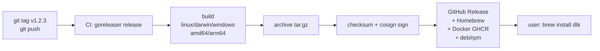
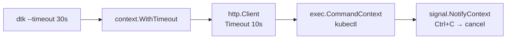

# ⌨️ 06. Go CLI: Cobra, Кросс-Компиляция, goreleaser — Production Deep Dive

> Построение production CLI на Go: `flag` vs `Cobra`, команды, флаги, конфиги, `viper`/`koanf`, кросс-компиляция, `goreleaser`, дистрибуция, наблюдаемость и безопасность. Весь код — `gofmt` + `go vet` чист.

**Оглавление:** 1. Каркас Cobra · 2. Флаги и конфиг · 3. Подкоманды · 4. UX · 5. Сигналы · 6. Кросс-компиляция · 7. goreleaser · 8. Память · 9. Сеть и система · 10. Наблюдаемость · 11. Безопасность · 12. Production checklist · 13. Проверь себя · 14. Лабы

---

## 🏗️ Каркас инструмента на Cobra

Cobra (используется kubectl, docker, helm, gh) даёт команды/подкоманды, флаги, help, автокомплит и генерацию доки из коробки. Альтернатива — stdlib `flag` для простых утилит с одним действием.

```go
// cmd/root.go
package cmd

import "github.com/spf13/cobra"

var (
	output  string
	verbose bool
	version = "dev" // вшивается ldflags
)

var rootCmd = &cobra.Command{
	Use:   "dtk",
	Short: "DevOps Toolkit — управление деплоями",
	Long:  `dtk — утилита для деплоев, статусов и отката. Примеры: dtk rollout web --image web:1.42`,
	Version: version,                       // dtk --version
	SilenceUsage:  true,                    // не показывать usage при ошибке РАНТАЙМА
	SilenceErrors: true,                    // ошибки печатаем сами
	PersistentPreRunE: func(cmd *cobra.Command, args []string) error {
		// инициализация логгера до любой команды
		initLogger(verbose)
		return nil
	},
}

func init() {
	rootCmd.PersistentFlags().StringVarP(&output, "output", "o", "table", "формат вывода: table|json|yaml")
	rootCmd.PersistentFlags().BoolVarP(&verbose, "verbose", "v", false, "debug logging")
	rootCmd.AddCommand(rolloutCmd, statusCmd, versionCmd)
}

func Execute() error { return rootCmd.Execute() }
```

```go
// cmd/rollout.go
package cmd

import (
	"context"
	"fmt"

	"github.com/spf13/cobra"
)

var (
	image  string
	dryRun bool
)

var rolloutCmd = &cobra.Command{
	Use:     "rollout NAME --image IMG",
	Short:   "Деплой новой версии",
	Args:    cobra.ExactArgs(1),                 // валидация позиционных аргументов
	Example: `  dtk rollout web --image web:1.42 --dry-run
  dtk rollout api --image api:v2 --output json`,
	RunE: func(cmd *cobra.Command, args []string) error {   // RunE = ошибка как error
		if image == "" {
			return fmt.Errorf("--image обязателен")
		}
		return doRollout(cmd.Context(), args[0], image, dryRun, output)
	},
}

func init() {
	rolloutCmd.Flags().StringVar(&image, "image", "", "образ (обязателен)")
	rolloutCmd.Flags().BoolVar(&dryRun, "dry-run", true, "показать без применения (safe by default)")
	_ = rolloutCmd.MarkFlagRequired("image")
	rolloutCmd.Flags().StringVarP(&output, "output", "o", "table", "table|json|yaml")
}
```

**RunE вместо Run:** возвращайте error, а не log.Fatal внутри — тестируемость и единый exit-code путь. Флаги валидируются `cmd.MarkFlagRequired`.

```bash
go build -o dtk . && ./dtk rollout web --image web:1
./dtk --help
./dtk rollout --help
./dtk completion bash > /etc/bash_completion.d/dtk       # автокомплит бесплатно
./dtk completion zsh > "${fpath[1]}/_dtk"
./dtk completion fish > ~/.config/fish/completions/dtk.fish
./dtk rollout web --image web:1 --dry-run=false --output json | jq
```

| Команда | Что делает | Пример |
| :--- | :--- | :--- |
| `rootCmd` | точка входа, глобальные флаги | `dtk --verbose` |
| `rolloutCmd` | подкоманда | `dtk rollout web` |
| `PersistentFlags` | наследуются подкомандами | `--output` везде |
| `Flags` | только для команды | `--image` только rollout |

---

## 🎛️ Флаги, конфиги и env: flag, viper, koanf

```go
// Простой вариант — stdlib flag (достаточно для утилит без подкоманд)
package main

import (
	"flag"
	"fmt"
	"os"
)

func mainFlag() {
	ns := flag.String("namespace", "default", "namespace")
	jsonOut := flag.Bool("json", false, "JSON output")
	flag.Parse()
	fmt.Println(*ns, *jsonOut, flag.Args())
}

// Cobra + viper — конфиг из файла + env + флаги (приоритет: флаг > env > файл > дефолт)
import "github.com/spf13/viper"

func initConfig() {
	viper.SetConfigName("dtk")
	viper.SetConfigType("yaml")
	viper.AddConfigPath("$HOME/.dtk")
	viper.AddConfigPath(".")
	viper.SetEnvPrefix("DTK")
	viper.AutomaticEnv() // DTK_NAMESPACE → namespace
	_ = viper.ReadInConfig() // игнорируем отсутствие файла
	// Bind флаги
	_ = viper.BindPFlag("namespace", rootCmd.PersistentFlags().Lookup("namespace"))
}

// Cobra + koanf — более гибкий (альтернатива viper)
import "github.com/knadh/koanf/v2"

// Приоритет: флаг > env > файл > дефолт
func loadConfig() Config {
	var cfg Config
	// 1. дефолты
	cfg.Namespace = "default"
	// 2. файл
	if data, err := os.ReadFile("dtk.yaml"); err == nil {
		_ = yaml.Unmarshal(data, &cfg)
	}
	// 3. env
	if v := os.Getenv("DTK_NAMESPACE"); v != "" {
		cfg.Namespace = v
	}
	// 4. флаг уже в переменной
	return cfg
}
```

```yaml
# dtk.yaml — пример конфига
namespace: prod
output: json
timeout: 30s
kubeconfig: ~/.kube/config
```

```bash
# Приоритет — демонстраия
cat dtk.yaml # namespace: prod
DTK_NAMESPACE=stage dtk status --namespace dev # dev побеждает (флаг)
DTK_NAMESPACE=stage dtk status                 # stage (env > файл)
dtk status                                    # prod (файл)
```

| Источник | Приоритет | Пример |
| :--- | :--- | :--- |
| Флаг | 1 (высший) | `--namespace dev` |
| Env | 2 | `DTK_NAMESPACE=stage` |
| Файл | 3 | `dtk.yaml` |
| Дефолт | 4 | `StringVar(..., "default")` |

```go
// Валидация конфига — fail fast
func (c Config) Validate() error {
	if c.Namespace == "" {
		return errors.New("namespace required")
	}
	if c.Timeout < 0 {
		return fmt.Errorf("timeout must be >=0, got %s", c.Timeout)
	}
	if c.Output != "table" && c.Output != "json" && c.Output != "yaml" {
		return fmt.Errorf("output must be table|json|yaml, got %q", c.Output)
	}
	return nil
}
```

---

## 🧩 Подкоманды и валидация: args, PreRun, subcommands

```go
// Подкоманды — каждая в своём файле, регистрируется в init()
var statusCmd = &cobra.Command{
	Use:   "status [NAME]",
	Short: "Статус деплоев",
	Args:  cobra.MaximumNArgs(1), // 0 или 1 имя
	RunE: func(cmd *cobra.Command, args []string) error {
		ns, _ := cmd.Flags().GetString("namespace")
		if len(args) == 1 {
			return showOne(cmd.Context(), ns, args[0])
		}
		return showAll(cmd.Context(), ns)
	},
}

var versionCmd = &cobra.Command{
	Use:   "version",
	Short: "Версия",
	Run: func(cmd *cobra.Command, args []string) {
		fmt.Println(version)
	},
}

// Валидация args — встроенные
// cobra.NoArgs, ExactArgs(1), MaximumNArgs(1), MinimumNArgs(1), RangeArgs(1,3)

// PreRun — проверка перед RunE
var rolloutCmd2 = &cobra.Command{
	Use: "rollout NAME",
	PreRunE: func(cmd *cobra.Command, args []string) error {
		if image == "" {
			return fmt.Errorf("--image required")
		}
		if _, err := ParseImage(image); err != nil {
			return fmt.Errorf("bad --image: %w", err)
		}
		return nil
	},
	RunE: func(cmd *cobra.Command, args []string) error {
		return doRollout(cmd.Context(), args[0], image, dryRun)
	},
}

// Группы команд (для больших CLI)
func init() {
	rootCmd.AddGroup(&cobra.Group{ID: "deploy", Title: "Deploy:"})
	rolloutCmd.GroupID = "deploy"
	statusCmd.GroupID = "deploy"
}
```

```go
// Тестируемость: RunE возвращает error, не os.Exit
func TestRolloutRequiresImage(t *testing.T) {
	cmd := rolloutCmd
	cmd.SetArgs([]string{"web"}) // без --image
	err := cmd.Execute()
	if err == nil {
		t.Fatal("want error")
	}
	assert.Contains(t, err.Error(), "--image")
}

func TestStatus(t *testing.T) {
	// Мокаем deps через интерфейс, не exec
	mock := &mockK8s{deployments: []Deployment{{Name: "api"}}}
	orig := k8sClient
	k8sClient = mock
	defer func() { k8sClient = orig }()
	err := showAll(context.Background(), "prod")
	require.NoError(t, err)
}
```

---

## 🎨 UX: вывод, цвета, машиночитаемость

```go
// Таблицы: text/tabwriter из stdlib — без зависимостей
import "text/tabwriter"

func renderTable(deps []Deployment) {
	w := tabwriter.NewWriter(os.Stdout, 0, 4, 2, ' ', 0)
	fmt.Fprintln(w, "NAME\tREADY\tRESTARTS\tAGE")
	for _, d := range deps {
		fmt.Fprintf(w, "%s\t%d/%d\t%d\t%s\n", d.Name, d.Ready, d.Replicas, d.Restarts, age(d))
	}
	w.Flush()
}

// Машиночитаемый режим для пайплайнов:
func render(deps []Deployment, format string) error {
	switch format {
	case "json":
		enc := json.NewEncoder(os.Stdout)
		enc.SetIndent("", "  ")
		return enc.Encode(deps)
	case "yaml":
		data, _ := yaml.Marshal(deps)
		fmt.Print(string(data))
		return nil
	default:
		renderTable(deps)
		return nil
	}
}

// Цвет только на TTY:
import "golang.org/x/term"

func colorize(s, color string) string {
	if !term.IsTerminal(int(os.Stdout.Fd())) {
		return s // не в терминале — без цвета
	}
	if os.Getenv("NO_COLOR") != "" {
		return s // уважать no-color.org
	}
	return color + s + "\x1b[0m"
}

// Прогресс-бар для долгих операций
import "github.com/schollz/progressbar/v3"

func withProgress(total int, fn func(int)) {
	bar := progressbar.Default(int64(total))
	for i := 0; i < total; i++ {
		fn(i)
		bar.Add(1)
	}
}
```

```bash
# UX проверки
dtk status --output json | jq '.items | length' # пайплайн
dtk status | column -t                           # человек
NO_COLOR=1 dtk status | cat -A                   # без ANSI
dtk rollout web --image web:1 --dry-run | grep "would" # safe by default
```

| Режим | Флаг | Для кого | Формат |
| :--- | :--- | :--- | :--- |
| Human | `--output table` (дефолт) | человек в терминале | `tabwriter` |
| Machine | `--output json` | CI, jq, скрипты | `json` |
| YAML | `--output yaml` | `kubectl`-стиль | `yaml` |

---

## 📡 Сигналы и graceful shutdown CLI (долгие операции)

```go
// Долгая операция с отменой по Ctrl+C
func longRollout(ctx context.Context) error {
	for _, step := range steps {
		select {
		case <-ctx.Done():
			return ctx.Err() // прервано — состояние сохранено, можно повторить
		default:
		}
		if err := doStep(ctx, step); err != nil {
			return err
		}
	}
	return nil
}

func main() {
	ctx, stop := signal.NotifyContext(context.Background(), os.Interrupt, syscall.SIGTERM)
	defer stop()
	if err := longRollout(ctx); err != nil {
		if errors.Is(err, context.Canceled) {
			fmt.Fprintln(os.Stderr, "interrupted; состояние сохранено, повторный запуск безопасен")
			os.Exit(130) // 128 + SIGINT
		}
		fmt.Fprintln(os.Stderr, "error:", err)
		os.Exit(1)
	}
}

// Timeout для CLI — с флагом
var timeout time.Duration

func init() {
	rootCmd.PersistentFlags().DurationVar(&timeout, "timeout", 30*time.Second, "таймаут операции")
}

func runWithTimeout(ctx context.Context, fn func(context.Context) error) error {
	ctx, cancel := context.WithTimeout(ctx, timeout)
	defer cancel()
	return fn(ctx)
}
```

```go
// SIGHUP — перезагрузка конфига без рестарта (для демонов)
func watchSIGHUP(ctx context.Context) {
	ch := make(chan os.Signal, 1)
	signal.Notify(ch, syscall.SIGHUP)
	go func() {
		for range ch {
			slog.Info("reloading config")
			loadConfig()
		}
	}()
}
```

| Сигнал | Код | Действие CLI |
| :--- | :--- | :--- |
| `SIGINT` (Ctrl+C) | 130 | отмена `ctx`, graceful exit |
| `SIGTERM` (k8s) | 143 | то же, что SIGINT |
| `SIGHUP` | — | reload config (демоны) |

---

## 🚀 Кросс-компиляция: суперспособность Go

Один исходник → бинарники под все платформы без toolchain'ов:

```bash
CGO_ENABLED=0 GOOS=linux   GOARCH=amd64 go build -ldflags="-s -w" -o dist/dtk-linux-amd64 ./cmd/dtk
CGO_ENABLED=0 GOOS=linux   GOARCH=arm64 go build -o dist/dtk-linux-arm64      # Raspberry/M1 runners, Graviton
CGO_ENABLED=0 GOOS=darwin  GOARCH=amd64 go build -o dist/dtk-darwin-amd64
CGO_ENABLED=0 GOOS=darwin  GOARCH=arm64 go build -o dist/dtk-darwin-arm64      # Apple Silicon
CGO_ENABLED=0 GOOS=windows GOARCH=amd64 go build -o dist/dtk-windows-amd64.exe
CGO_ENABLED=0 GOOS=linux   GOARCH=arm64 GOOS=linux go build -o dist/dtk # и freebsd, openbsd

file dist/*
# dtk-linux-amd64:   ELF 64-bit LSB executable, x86-64, statically linked
# dtk-darwin-arm64:  Mach-O 64-bit arm64 executable
# dtk-windows-amd64.exe: PE32+ executable

# Проверка размера
ls -lh dist/
# 8-12 MB каждый — статика, без зависимостей libc

# Сжатие — upx (опционально, но ломает cosign — осторожно)
upx --best dist/dtk-linux-amd64 # 8 MB → 3 MB
```

| Переменная | Что делает | Типично |
| :--- | :--- | :--- |
| `CGO_ENABLED=0` | статика без cgo, без libc | `0` для CLI |
| `GOOS` | OS | `linux`, `darwin`, `windows` |
| `GOARCH` | архитектура | `amd64`, `arm64` |
| `GOARM` | ARM версия | `7` для armv7 |

```go
//go:build linux

package main

// +build tag — платформо-специфичный код
func platformSpecific() { fmt.Println("linux") }

//go:build darwin

func platformSpecific() { fmt.Println("darwin") }
```

`CGO_ENABLED=0` = чисто статическая сборка → работает в **scratch/distroless** контейнере:

```dockerfile
FROM golang:1.22 AS build
WORKDIR /src
COPY go.mod go.sum ./
RUN go mod download
COPY . .
RUN CGO_ENABLED=0 go build -trimpath -ldflags="-s -w -X main.version=$VERSION" -o /out/dtk ./cmd/dtk

FROM gcr.io/distroless/static-debian12:nonroot
COPY --from=build /out/dtk /usr/local/bin/dtk
USER nonroot:nonroot
ENTRYPOINT ["dtk"]
# Итог: ~8 МБ, ноль CVE из ОС, non-root, нет shell.
```

---

## 📦 goreleaser: релиз одной командой

`.goreleaser.yaml` — декларативный релиз:

```yaml
version: 2
project_name: dtk
before:
  hooks:
    - go mod tidy
    - go vet ./...
    - go test -race ./...
builds:
  - env: [CGO_ENABLED=0]
    goos: [linux, darwin, windows]
    goarch: [amd64, arm64]
    ldflags: ["-s -w -X main.version={{.Version}} -X main.commit={{.Commit}}"]
    flags: [-trimpath]
archives:
  - formats: [tar.gz]
    name_template: "dtk_{{.Version}}_{{.Os}}_{{.Arch}}"
    files:
      - README.md
      - LICENSE
checksum:
  name_template: checksums.txt          # SHA256 всех артефактов
signs:
  - artifacts: checksum                 # cosign подпись чексуммы!
    args: ["sign-blob", "--output-signature", "${signature}", "${artifact}"]
changelog:
  use: git
  sort: asc
  filters: { exclude: ["^docs:", "^test:"] }
brews:
  - repository: { owner: org, name: homebrew-tap }
    folder: Formula
    homepage: https://github.com/org/dtk
    description: "DevOps Toolkit"
nfpms:
  - formats: [deb, rpm]
    vendor: Org
    homepage: https://github.com/org/dtk
docker:
  - image_templates: ["ghcr.io/org/dtk:{{.Version}}", "ghcr.io/org/dtk:latest"]
    dockerfile: Dockerfile
    build_flag_templates: ["--platform=linux/amd64,linux/arm64"]
```

```bash
goreleaser check                    # валидация конфига
goreleaser release --snapshot --clean  # локальная репетиция — без пуша тега, в dist/
ls dist/
# dtk_v0.1.0_linux_amd64.tar.gz  checksums.txt  checksums.txt.sig  config.yaml

goreleaser release --clean          # по тегу v* в CI — публикует GitHub Release + brew + docker
# Требует: GITHUB_TOKEN, COSIGN_PRIVATE_KEY

# Ручной тест релиза
go install github.com/goreleaser/goreleaser@latest
goreleaser build --snapshot --clean --single-target
./dist/dtk_linux_amd64_v1/dtk --version # v0.0.0-next
```



Результат релизного пайплайна: бинарники + checksums + подписи + changelog + обновление пакетных менеджеров — ноль ручных шагов.

```yaml
# .github/workflows/release.yml
name: release
on:
  push:
    tags: ["v*"]
jobs:
  goreleaser:
    runs-on: ubuntu-latest
    permissions: { contents: write, packages: write, id-token: write }
    steps:
      - uses: actions/checkout@v4
        with: { fetch-depth: 0 }
      - uses: actions/setup-go@v5
        with: { go-version: '1.22' }
      - uses: sigstore/cosign-installer@v3
      - uses: goreleaser/goreleaser-action@v5
        with: { args: release --clean }
        env:
          GITHUB_TOKEN: ${{ secrets.GITHUB_TOKEN }}
          COSIGN_PRIVATE_KEY: ${{ secrets.COSIGN_PRIVATE_KEY }}
```

---

## 🧠 Память и рантайм для CLI

```go
// CLI — короткий процесс, но тоже важно
//go:build ignore
package main

import (
	"runtime"
	"runtime/pprof"
)

func main() {
	// Профилирование CLI — редкий, но полезный приём
	f, _ := os.Create("cpu.pprof")
	pprof.StartCPUProfile(f)
	defer pprof.StopCPUProfile()
	// ... CLI логика
}

// GOMEMLIMIT для CLI с большим выводом (например, dtk get pods --all-namespaces)
// GOMEMLIMIT=256MiB dtk get pods -A -o json # не OOM на большом кластере

// Escape — CLI часто аллоцирует для вывода
func renderJSON(deps []Deployment) {
	enc := json.NewEncoder(os.Stdout) // аллоцирует буфер
	enc.SetIndent("", "  ")
	enc.Encode(deps)
	// Оптимизация: переиспользовать encoder с sync.Pool если часто
}
```

| Метрика | Для CLI | Проверка |
| :--- | :--- | :--- |
| `allocs/op` | рендер таблицы — не аллоцировать в цикле | `benchmem` |
| `GOMEMLIMIT` | большие выборки | `GOMEMLIMIT=256MiB dtk ...` |
| `GOMAXPROCS` | CLI обычно 1, но `GOMAXPROCS=1` в контейнере | `runtime.GOMAXPROCS` |

---

## 🌐 Сеть и система для CLI

```go
// HTTP клиент в CLI — всегда с таймаутом и контекстом!
var client = &http.Client{
	Timeout: 10 * time.Second,
	Transport: &http.Transport{
		MaxIdleConns:        20,
		IdleConnTimeout:     30 * time.Second,
		TLSHandshakeTimeout: 5 * time.Second,
	},
}

func fetchWithContext(ctx context.Context, url string) ([]byte, error) {
	req, _ := http.NewRequestWithContext(ctx, http.MethodGet, url, nil)
	resp, err := client.Do(req)
	if err != nil {
		return nil, err
	}
	defer resp.Body.Close()
	return io.ReadAll(io.LimitReader(resp.Body, 10<<20)) // лимит 10 MiB
}

// exec с контекстом — уважает Ctrl+C
func kubectl(ctx context.Context, args ...string) ([]byte, error) {
	ctx, cancel := context.WithTimeout(ctx, 15*time.Second)
	defer cancel()
	out, err := exec.CommandContext(ctx, "kubectl", args...).CombinedOutput()
	if err != nil {
		var ee *exec.ExitError
		if errors.As(err, &ee) {
			return nil, fmt.Errorf("kubectl %v: exit %d: %s", args, ee.ExitCode(), string(ee.Stderr))
		}
		return nil, err
	}
	return out, nil
}

// Чтение kubeconfig — уважать KUBECONFIG env
func kubeConfig() string {
	if v := os.Getenv("KUBECONFIG"); v != "" {
		return v
	}
	home, _ := os.UserHomeDir()
	return home + "/.kube/config"
}
```



---

## 🔭 Наблюдаемость CLI

```go
// Логи — в stderr, вывод — в stdout (разделение для пайпов!)
import "log/slog"

var logLevel = new(slog.LevelVar)

func initLogger(verbose bool) {
	if verbose {
		logLevel.Set(slog.LevelDebug)
	}
	h := slog.NewTextHandler(os.Stderr, &slog.HandlerOptions{Level: logLevel})
	slog.SetDefault(slog.New(h))
}

func demoLog() {
	slog.Debug("fetching deployments", "namespace", "prod") // только с -v
	slog.Info("rollout started", "name", "api", "image", "api:1.2")
	slog.Error("rollout failed", "err", err)
}

// Вывод — в stdout, логи — в stderr → пайп чистый
// dtk status -o json | jq . # jq видит только JSON, не логи

// Метрики — для CLI-демонов, не для одноразовых команд
// Трассировка — otel для CLI, если вызывает API
import "go.opentelemetry.io/otel"
func traced(ctx context.Context) {
	ctx, span := otel.Tracer("dtk").Start(ctx, "rollout")
	defer span.End()
	// ...
}

// Версия в логах — обязательно
func logVersion() {
	slog.Info("starting", "version", version, "commit", commit, "go", runtime.Version())
}
```

| Сигнал | Куда | Пример |
| :--- | :--- | :--- |
| Логи | `stderr` | `slog` Text/JSON |
| Вывод | `stdout` | `json`/`table` |
| Ошибки | `stderr` + exit code | `fmt.Fprintln(os.Stderr)` |
| Трассировка | OTLP (для демонов) | `otel` |

---

## 🔒 Безопасность CLI

```go
// 1. Не логировать секреты
func redact(s string) string {
	if len(s) < 4 {
		return "***"
	}
	return s[:2] + "***" + s[len(s)-2:]
}
slog.Info("using token", "token", redact(token))

// 2. exec без shell — защита от инъекции
// Плохо: exec.Command("sh", "-c", "kubectl get "+userInput)
// Хорошо:
exec.CommandContext(ctx, "kubectl", "get", "pods", "-n", ns)

// 3. Проверка прав файла kubeconfig
func checkKubeConfig(path string) error {
	fi, err := os.Stat(path)
	if err != nil {
		return err
	}
	if fi.Mode().Perm()&0077 != 0 {
		return fmt.Errorf("kubeconfig %s is world-readable: %o", path, fi.Mode().Perm())
	}
	return nil
}

// 4. TOCTOU — атомарное создание
f, err := os.OpenFile("/tmp/dtk.lock", os.O_CREATE|os.O_EXCL|os.O_WRONLY, 0600)

// 5. govulncheck для CLI зависимостей
// govulncheck ./...
```

| Риск | Митигация | Инструмент |
| :--- | :--- | :--- |
| Секреты в логах | `redact` | review |
| Shell injection | `CommandContext` без `sh -c` | `gosec G204` |
| World-readable kubeconfig | `0600`, проверка `Perm()` | `os.Stat` |
| Уязвимые deps | `govulncheck` | CI |
| Подмена бинарника | `cosign verify-blob` | `goreleaser sign` |

---

## ✅ Production checklist: CLI

| Категория | Проверка | Команда |
| :--- | :--- | :--- |
| Args | валидация `ExactArgs`, `MarkFlagRequired` | `dtk rollout --help` |
| Errors | `RunE` возвращает error, `SilenceUsage` | `go vet` |
| Output | `table` + `json` + `yaml`, `stdout` vs `stderr` | `dtk -o json \| jq` |
| Signals | `signal.NotifyContext` | `kill -TERM` тест |
| Timeout | `--timeout` флаг + `WithTimeout` | `dtk --timeout 1s` |
| Completion | bash/zsh/fish | `dtk completion bash` |
| Version | `--version` вшит | `dtk --version` |
| Build | `CGO_ENABLED=0 -trimpath -s -w` | `file dist/*` |
| Release | `goreleaser --snapshot` чист | `goreleaser check` |
| Security | `govulncheck`, `gosec` | `govulncheck ./...` |
| Docs | `dtk --help` читаем, примеры | `dtk rollout --help` |

---

## ✅ Проверь себя — 10 вопросов

**В1. Почему RunE предпочтительнее Run с os.Exit внутри?**
<details><summary>Ответ</summary>
Ошибка возвращается наверх в одно место, где принимается решение об exit-code и логировании: тестируемость (вызов RunE в тесте без процесса), единый формат сообщений, возможность defer-очистки. os.Exit пропускает defer и делает функцию нетестируемой. SilenceUsage/SilenceErrors контролируют, печатать ли usage при ошибке.
</details>

**В2. Что даёт CGO_ENABLED=0 для DevOps-инструмента?**
<details><summary>Ответ</summary>
Полностью статический бинарник без зависимости от libc/glibc версии: запускается в scratch/distroless, на любом дистрибутиве и Alpine, в chroot, с любым glibc. Минус — потеря cgo-библиотек (например, системного DNS-резолвера частично меняется поведение, но netgo почти идентичен) — обычно несущественно для CLI.
</details>

**В3. Зачем CLI флаг `-o json`, если есть люди в терминале?**
<details><summary>Ответ</summary>
Инструмент встраивается в автоматизации: CI парсит JSON (jq), человек смотрит таблицу. Один источник правды вместо отдельного API-эндпоинта; контракт вывода стабилен между версиями. Разделение stdout (данные) и stderr (логи) — пайп чистый.
</details>

**В4. Как вшить версию сборки в бинарник?**
<details><summary>Ответ</summary>
Переменная пакета `var version = "dev"` + линковка при сборке: `-ldflags "-X main.version=$(git describe --tags) -X main.commit=$(git rev-parse HEAD)"`. Cobra Version печатает реальный релиз. goreleaser делает это автоматом через `ldflags: -X main.version={{.Version}}`. Обязательно логировать version при старте.
</details>

**В5. Что goreleaser добавляет к голому кросс-компиляционному скрипту?**
<details><summary>Ответ</summary>
Весь релизный протокол: матрица OS/ARCH, архивация, генерация и ПОДПИСЬ checksums (cosign), changelog из коммитов, публикация GitHub/GitLab release, обновление brew/scoop/choco, docker multi-arch, deb/rpm, sbom. Snapshot-режим позволяет репетировать релиз локально. Один `goreleaser release --clean` вместо 50 строк скрипта.
</details>

**В6. Чем PersistentFlags отличаются от Flags и когда что?**
<details><summary>Ответ</summary>
PersistentFlags наследуются всеми подкомандами (глобальные: --verbose, --output, --kubeconfig), Flags — только для конкретной команды (--image для rollout). Определять глобальные в rootCmd.PersistentFlags, локальные в subCmd.Flags. Bind через viper для конфига.
</details>

**В7. Почему логи CLI должны идти в stderr, а вывод — в stdout?**
<details><summary>Ответ</summary>
Чтобы пайп не ломался: `dtk status -o json | jq` — jq должен видеть только JSON, не логи. Логи в stderr видны человеку, но не попадают в пайп. slog в CLI — в stderr, fmt.Println вывода — в stdout. Проверка: `dtk -o json 2>/dev/null | jq`.
</details>

**В8. Как `signal.NotifyContext` улучшает CLI с долгими операциями?**
<details><summary>Ответ</summary>
Создаёт контекст, который отменяется при SIGINT/SIGTERM (Ctrl+C, k8s termination). Долгая операция select на ctx.Done() и graceful exit с сохранением состояния (можно повторить). Defer stop() освобождает сигнал-хендлер. Timeout флаг + WithTimeout для лимита.
</details>

**В9. Что такое `SilenceUsage` и `SilenceErrors` в Cobra и зачем они?**
<details><summary>Ответ</summary>
SilenceUsage: не печатать usage при ошибке выполнения (логическая ошибка, не неверные флаги) — чтобы не спамить help при каждом 500. SilenceErrors: не печатать ошибку автоматом, печатаем сами в Execute() с нужным форматом. Вместе — контроль вывода.
</details>

**В10. Как протестировать Cobra-команду без запуска процесса?**
<details><summary>Ответ</summary>
Создать команду, вызвать `cmd.SetArgs([]string{...})`, `cmd.Execute()` или `cmd.RunE`, проверить возвращённую error, а зависимости — через интерфейсы/моки (не exec). Для вывода — `cmd.SetOut(&buf)` и проверка buf.String(). Для ошибок — `errors.Is/As`. Не использовать os.Exit в RunE.
</details>

---


### Доп. пример: генерация доки и man страниц

```bash
# Cobra генерирует доку автоматом
go run ./cmd/dtk gendoc --help
# Генерация markdown для docs/
mkdir -p docs/cli
go run ./cmd/dtk --help
# В коде:
import "github.com/spf13/cobra/doc"
func genDocs() {
    os.MkdirAll("docs/cli", 0755)
    doc.GenMarkdownTree(rootCmd, "docs/cli")
    doc.GenManTree(rootCmd, &doc.GenManHeader{Title: "dtk", Section: "1"}, "man/")
}
ls docs/cli/
# dtk.md  dtk_rollout.md  dtk_status.md
man/man1/dtk.1
```

```go
// Кастомный help с примерами
rootCmd.SetHelpFunc(func(cmd *cobra.Command, args []string) {
    fmt.Fprintf(cmd.OutOrStdout(), "%s\n\n%s\n", cmd.Long, cmd.UsageString())
    if cmd.HasAvailableSubCommands() {
        fmt.Fprintln(cmd.OutOrStdout(), "Доступные команды:")
        for _, c := range cmd.Commands() {
            fmt.Fprintf(cmd.OutOrStdout(), "  %-15s %s\n", c.Name(), c.Short)
        }
    }
})
```

| Артефакт | Команда | Где |
| :--- | :--- | :--- |
| Markdown | `GenMarkdownTree` | `docs/cli/` |
| Man | `GenManTree` | `man/` |
| Bash completion | `completion bash` | `/etc/bash_completion.d/` |
| JSON schema | `clidoc` | — |
```


### Доп. лаба: тестирование help вывода

```go
func TestHelp(t *testing.T) {
    buf := new(bytes.Buffer)
    rootCmd.SetOut(buf)
    rootCmd.SetArgs([]string{"--help"})
    _ = rootCmd.Execute()
    assert.Contains(t, buf.String(), "DevOps Toolkit")
}
```


## 🧪 Лабораторные

### Lab 1: Добавь команду и флаг

```go
// Добавь команду dtk rollback
var rollbackCmd = &cobra.Command{
	Use:   "rollback NAME --to REV",
	Short: "Откат деплоя",
	Args:  cobra.ExactArgs(1),
	RunE: func(cmd *cobra.Command, args []string) error {
		to, _ := cmd.Flags().GetInt("to")
		return doRollback(cmd.Context(), args[0], to)
	},
}
func init() {
	rollbackCmd.Flags().Int("to", 0, "ревизия (обязателен)")
	_ = rollbackCmd.MarkFlagRequired("to")
	rootCmd.AddCommand(rollbackCmd)
}
```

```bash
go run . rollback --help # проверка
go run . rollback web --to 2 --dry-run
go test -run TestRollback -v
```

### Lab 2: JSON + table вывод с тестом

```go
func TestRender(t *testing.T) {
	deps := []Deployment{{Name: "api", Ready: 3, Replicas: 3}}
	// JSON
	var buf bytes.Buffer
	rootCmd.SetOut(&buf)
	rootCmd.SetArgs([]string{"status", "-o", "json"})
	_ = rootCmd.Execute()
	var out []Deployment
	require.NoError(t, json.Unmarshal(buf.Bytes(), &out))
	assert.Equal(t, "api", out[0].Name)
}
```

### Lab 3: Кросс-компиляция и goreleaser snapshot

```bash
CGO_ENABLED=0 go build -trimpath -ldflags="-s -w -X main.version=v0.1.0" -o /tmp/dtk ./cmd/dtk
/tmp/dtk --version # v0.1.0
file /tmp/dtk # statically linked

goreleaser check
goreleaser release --snapshot --clean
ls dist/
cat dist/checksums.txt
cosign verify-blob --signature dist/checksums.txt.sig --certificate dist/checksums.txt.pem dist/checksums.txt
```

---

*Что дальше:* [07. client-go](07-go-k8s-client-go.md) · [05. Modules](05-go-modules-dependencies.md)

`
