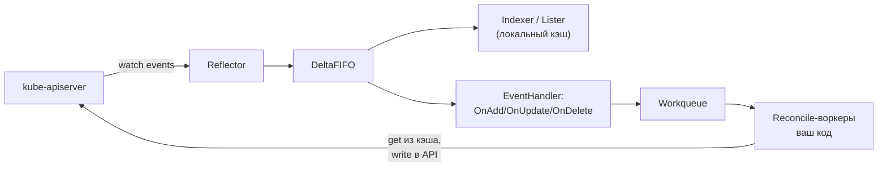

# ☸️ 07. Go client-go: Informers, Listers, Workqueue

## 🧠 Проблема: почему не «просто REST-клиент»

Наивный контроллер опрашивает API каждую секунду → убивает etcd. client-go решает это паттерном **Informer**: watch-поток + локальный кэш + обработчики событий.



## 🛠️ Минимальный informer-контроллер

```go
package main

import (
    corev1 "k8s.io/api/core/v1"
    "k8s.io/client-go/informers"
    "k8s.io/client-go/kubernetes"
    "k8s.io/client-go/tools/cache"
    "k8s.io/client-go/tools/clientcmd"
    "k8s.io/client-go/util/workqueue"
)

func main() {
    cfg, _ := clientcmd.BuildConfigFromFlags("", kubeconfigPath())
    client := kubernetes.NewForConfigOrDie(cfg)

    factory := informers.NewSharedInformerFactory(client, 30*time.Second) // resync 30с
    podInf := factory.Core().V1().Pods().Informer()

    queue := workqueue.NewTypedRateLimitingQueue(
        workqueue.DefaultTypedControllerRateLimiter[string]())

    _, err := podInf.AddEventHandler(cache.ResourceEventHandlerFuncs{
        AddFunc: func(obj interface{}) {
            key, _ := cache.MetaNamespaceKeyFunc(obj)
            queue.Add(key)
        },
        UpdateFunc: func(_, newObj interface{}) {
            key, _ := cache.MetaNamespaceKeyFunc(newObj)
            queue.Add(key)                      // дедупликация в очереди!
        },
        DeleteFunc: func(obj interface{}) {
            key, _ := cache.DeletionHandlingMetaNamespaceKeyFunc(obj)
            queue.Add(key)
        },
    })
    if err != nil { panic(err) }

    stopCh := make(chan struct{})
    defer close(stopCh)
    factory.Start(stopCh)
    factory.WaitForCacheSync(stopCh)           // кэш прогрелся — можно работать

    for i := 0; i < 4; i++ {                   // воркеры
        go worker(podInf.GetStore(), queue, client)
    }
    <-stopCh
}

func worker(store cache.Store, q workqueue.TypedRateLimitingInterface[string],
    c *kubernetes.Clientset) {
    for processNext(store, q, c) {
    }
}
```

## ⚙️ Workqueue: три гарантии

| Свойство | Значение |
|---|---|
| Дедупликация | 100 update'ов одного пода = 1 задача |
| Rate limiting | экспоненциальные ретраи упавших reconcile |
| Dirty re-add | `AddRateLimited(key)` вернёт ключ после backoff |

```go
func processNext(store cache.Store,
    q workqueue.TypedRateLimitingInterface[string], c *kubernetes.Clientset) bool {
    key, shutdown := q.Get()
    if shutdown { return false }
    defer q.Done(key)

    ns, name, _ := cache.SplitMetaNamespaceKey(key)
    obj, exists, err := store.GetByKey(key)          // ЧТЕНИЕ ИЗ КЭША, не из API!
    if err != nil || !exists {
        q.Forget(key); return true                   // удалён — забываем
    }
    pod := obj.(*corev1.Pod)

    if err := annotate(c, ns, name); err != nil {
        q.AddRateLimited(key)                        // ретрай с backoff
        return true
    }
    q.Forget(key)                                    // успех — сбросить счётчик ретраев
    return true
}
```

## 📊 Lister: чтения из кэша

```go
lister := factory.Core().V1().Pods().Lister()
pods, err := lister.Pods("prod").List(labels.SelectorFromSet(
    labels.Set{"app": "web"}))          // микросекунды, ноль нагрузки на API

pod, err := lister.Pods("prod").Get("web-7d9f")   // по имени
```

⚠️ Кэш может отставать от API на миллисекунды. Паттерн: читаете из lister, пишете через optimistic concurrency (`ResourceVersion`) — конфликт ловится retry.

## 🧭 Level-triggered vs edge-triggered

Ключевая философия Kubernetes-контроллеров:

- **Edge-triggered** («отреагируй на событие») — хрупко: пропустили event → разъехалось навсегда.
- **Level-triggered** («приведи мир к желаемому состоянию») — каждый sync пересчитывает полный diff и чинит всё. Resync-период + периодические таймеры дают самовосстановление даже после пропущенных событий.

Поэтому reconcile идемпотентен: одинаковый вход → безопасный повторный прогон.

## 🔬 Отладка и метрики

```bash
# Логи informer'а: что пришло из watch?
kubectl logs deploy/my-controller | grep -i reflector

# Утечка watch-соединений / рестарты: смотреть на клиенте
curl localhost:8080/debug/pprof/goroutine?debug=1   # стеки
# Метрики client-go: rest_client_requests_total, workqueue_depth,
# workqueue_retries_total — стандартный дашборд контроллера.
```

RBAC контроллера — минимальный: get/list/watch на наблюдаемый тип + права на мутации, которые он делает (см. [08](08-go-operators-kubebuilder.md) — kubebuilder генерирует это из маркеров).

## ❓ Пять вопросов для самопроверки

---


## ✅ Проверь себя

> Отвечай вслух до раскрытия ответа. Если «не помню» — вернись к разделу.


**В1. Зачем informer держит локальный кэш, если есть API?**
<details><summary>Ответ</summary>
Reconcile-логика читает состояние часто (десятки объектов за цикл). Прямые запросы создали бы лавину нагрузки на apiserver/etcd всего кластера. Кэш даёт консистентные снапшоты за микросекунды; API используется только для записи.
</details>

**В2. Что случится, если reconcile упадёт с ошибкой?**
<details><summary>Ответ</summary>
Ключ возвращается в очередь через AddRateLimited: повторная попытка после экспоненциального backoff. После N неудач ключ уходит в slow queue/дропается счётчиком — контроллер не должен терять события молча, метрика workqueue_retries сигнализирует о проблемах.
</details>

**В3. Почему UpdateFunc шлёт в очередь оба объекта, но используют обычно только новый?**
<details><summary>Ответ</summary>
Старый нужен редко (diff полей), но очередь всё равно дедуплицирует по ключу. Важно другое: сравнение ResourceVersion позволяет отсечь шумные update'ы без изменений; level-triggered reconcile всё равно пересчитывает полное желаемое состояние.
</details>

**В4. Что такое WaitForCacheSync и что будет без него?**
<details><summary>Ответ</summary>
Барьер старта: informer должен слить начальный LIST в кэш до начала обработки. Без ожидания воркеры увидят пустой/частичный кэш и примут решения на неполных данных (удалили то, чего «не существует») — классический инцидент первых секунд работы контроллера.
</details>

**В5. Чем lister.Get отличается от client.Get?**
<details><summary>Ответ</summary>
Lister читает из памяти (быстро, возможно чуть устаревшее состояние); client.Get ходит в apiserver (истинное состояние, нагрузка, квоты). Правило: читать — lister; писать — client; при критичной свежести — client.Get перед мутацией с проверкой ResourceVersion.
</details>

---

*Что дальше:* [08. Операторы на kubebuilder](08-go-operators-kubebuilder.md) · Python-вариант: [kopf](07-python-kubernetes-kopf-operators.md)
