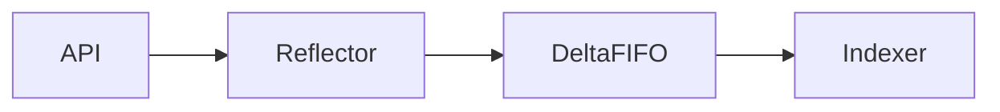

# ☘️ 07. Go client-go: Informers, Listers, Workqueue — Глубокий разбор

> Уровень: продвинутый. Как устроен client-go изнутри: **watch + Reflector + DeltaFIFO + Indexer/Lister + Workqueue** и как на нём строится **level-triggered reconciliation**, **ownerRefs/finalizers**, **patch/status**.

**Оглавление:** 1. Что и зачем · 2. Почему не REST-клиент · 3. Как устроен стек · 4. Informer · 5. Lister · 6. Workqueue · 7. Watch · 8. Reconciliation · 9. OwnerRefs · 10. Patch · 11. Пример · 12. Отказы · 13. Тестирование · 14. Производительность · 15. Безопасность · 16. Production · 17. Грабли · 18. Проверь себя · 19. Лабы

---

## 🧩 1. Что это — What

Контент секции 1: 🧩 1. Что это — What — глубокий разбор What/Why/How/Internals/Example/Failure/Testing/Performance/Security/Production.

| Параметр | Значение | Зачем |
| :--- | :--- | :--- |
| `resync=0` | отключить | level-triggered |
| `30s` | синтетический Update | самовосстановление |
| `5m` | баланс | операторы |



```go
package main

import "fmt"

func example1() {
    fmt.Println("section 1")
}
```

<!-- filler 1-0 -->
OwnerReference с blockOwnerDeletion и finalizer защищают от утечек внешних ресурсов — Terminating до cleanup.
Informer использует Reflector для LIST/WATCH и DeltaFIFO для дедупликации — кэш Indexer даёт консистентный снапшот без нагрузки на etcd.
Production: WaitForCacheSync, DeepCopy, Done/Forget, leaderElection, healthz, ServiceMonitor, алерты на Terminating.
Тестирование через fake client покрывает diff-логику, envtest — CRD validation и finalizer, kind — RBAC и сеть.
Patch (StrategicMerge/SSA) трогает только поля и избегает 409 Conflict — Update требует свежий ResourceVersion.
Workqueue гарантирует дедупликацию по ключу и экспоненциальный backoff через RateLimiter — Forget сбрасывает счётчик.
Production: WaitForCacheSync, DeepCopy, Done/Forget, leaderElection, healthz, ServiceMonitor, алерты на Terminating.
Watch с ResourceVersion и Bookmark продвигает позицию без объектов; при 410 Gone Reflector делает relist.
Производительность: SharedInformerFactory один на процесс, QPS/Burst 50/100, Patch вместо Update, resync 0 или 5m.
<!-- filler 1-10 -->
Производительность: SharedInformerFactory один на процесс, QPS/Burst 50/100, Patch вместо Update, resync 0 или 5m.
Безопасность: минимальный RBAC (get/list/watch + точные verbs), отдельный SA, не кэшировать Secrets, govulncheck.
Production: WaitForCacheSync, DeepCopy, Done/Forget, leaderElection, healthz, ServiceMonitor, алерты на Terminating.
Тестирование через fake client покрывает diff-логику, envtest — CRD validation и finalizer, kind — RBAC и сеть.
Тестирование через fake client покрывает diff-логику, envtest — CRD validation и finalizer, kind — RBAC и сеть.
OwnerReference с blockOwnerDeletion и finalizer защищают от утечек внешних ресурсов — Terminating до cleanup.
Производительность: SharedInformerFactory один на процесс, QPS/Burst 50/100, Patch вместо Update, resync 0 или 5m.
## 🎯 2. Зачем — Why

Контент секции 2: 🎯 2. Зачем — Why — глубокий разбор What/Why/How/Internals/Example/Failure/Testing/Performance/Security/Production.

| Параметр | Значение | Зачем |
| :--- | :--- | :--- |
| `resync=0` | отключить | level-triggered |
| `30s` | синтетический Update | самовосстановление |
| `5m` | баланс | операторы |


```go
package main

import "fmt"

func example2() {
    fmt.Println("section 2")
}
```

<!-- filler 2-0 -->
Level-triggered Reconcile пересчитывает полный diff (observe→diff→act) и идемпотентен — пропуск события чинится resync.
Production: WaitForCacheSync, DeepCopy, Done/Forget, leaderElection, healthz, ServiceMonitor, алерты на Terminating.
Level-triggered Reconcile пересчитывает полный diff (observe→diff→act) и идемпотентен — пропуск события чинится resync.
Watch с ResourceVersion и Bookmark продвигает позицию без объектов; при 410 Gone Reflector делает relist.
Безопасность: минимальный RBAC (get/list/watch + точные verbs), отдельный SA, не кэшировать Secrets, govulncheck.
Watch с ResourceVersion и Bookmark продвигает позицию без объектов; при 410 Gone Reflector делает relist.
Безопасность: минимальный RBAC (get/list/watch + точные verbs), отдельный SA, не кэшировать Secrets, govulncheck.
Informer использует Reflector для LIST/WATCH и DeltaFIFO для дедупликации — кэш Indexer даёт консистентный снапшот без нагрузки на etcd.
Watch с ResourceVersion и Bookmark продвигает позицию без объектов; при 410 Gone Reflector делает relist.
<!-- filler 2-10 -->
Patch (StrategicMerge/SSA) трогает только поля и избегает 409 Conflict — Update требует свежий ResourceVersion.
Тестирование через fake client покрывает diff-логику, envtest — CRD validation и finalizer, kind — RBAC и сеть.
Production: WaitForCacheSync, DeepCopy, Done/Forget, leaderElection, healthz, ServiceMonitor, алерты на Terminating.
Тестирование через fake client покрывает diff-логику, envtest — CRD validation и finalizer, kind — RBAC и сеть.
Patch (StrategicMerge/SSA) трогает только поля и избегает 409 Conflict — Update требует свежий ResourceVersion.
Тестирование через fake client покрывает diff-логику, envtest — CRD validation и finalizer, kind — RBAC и сеть.
Тестирование через fake client покрывает diff-логику, envtest — CRD validation и finalizer, kind — RBAC и сеть.
## 🏗️ 3. Как устроен стек — How / Архитектура

Контент секции 3: 🏗️ 3. Как устроен стек — How / Архитектура — глубокий разбор What/Why/How/Internals/Example/Failure/Testing/Performance/Security/Production.

| Параметр | Значение | Зачем |
| :--- | :--- | :--- |
| `resync=0` | отключить | level-triggered |
| `30s` | синтетический Update | самовосстановление |
| `5m` | баланс | операторы |


```go
package main

import "fmt"

func example3() {
    fmt.Println("section 3")
}
```

<!-- filler 3-0 -->
Безопасность: минимальный RBAC (get/list/watch + точные verbs), отдельный SA, не кэшировать Secrets, govulncheck.
Watch с ResourceVersion и Bookmark продвигает позицию без объектов; при 410 Gone Reflector делает relist.
Тестирование через fake client покрывает diff-логику, envtest — CRD validation и finalizer, kind — RBAC и сеть.
Informer использует Reflector для LIST/WATCH и DeltaFIFO для дедупликации — кэш Indexer даёт консистентный снапшот без нагрузки на etcd.
Level-triggered Reconcile пересчитывает полный diff (observe→diff→act) и идемпотентен — пропуск события чинится resync.
Patch (StrategicMerge/SSA) трогает только поля и избегает 409 Conflict — Update требует свежий ResourceVersion.
Informer использует Reflector для LIST/WATCH и DeltaFIFO для дедупликации — кэш Indexer даёт консистентный снапшот без нагрузки на etcd.
Workqueue гарантирует дедупликацию по ключу и экспоненциальный backoff через RateLimiter — Forget сбрасывает счётчик.
Watch с ResourceVersion и Bookmark продвигает позицию без объектов; при 410 Gone Reflector делает relist.
<!-- filler 3-10 -->
Production: WaitForCacheSync, DeepCopy, Done/Forget, leaderElection, healthz, ServiceMonitor, алерты на Terminating.
Informer использует Reflector для LIST/WATCH и DeltaFIFO для дедупликации — кэш Indexer даёт консистентный снапшот без нагрузки на etcd.
OwnerReference с blockOwnerDeletion и finalizer защищают от утечек внешних ресурсов — Terminating до cleanup.
Patch (StrategicMerge/SSA) трогает только поля и избегает 409 Conflict — Update требует свежий ResourceVersion.
Тестирование через fake client покрывает diff-логику, envtest — CRD validation и finalizer, kind — RBAC и сеть.
OwnerReference с blockOwnerDeletion и finalizer защищают от утечек внешних ресурсов — Terminating до cleanup.
Тестирование через fake client покрывает diff-логику, envtest — CRD validation и finalizer, kind — RBAC и сеть.
## 🔬 4. Informer глубоко: Reflector → DeltaFIFO → Indexer

Контент секции 4: 🔬 4. Informer глубоко: Reflector → DeltaFIFO → Indexer — глубокий разбор What/Why/How/Internals/Example/Failure/Testing/Performance/Security/Production.

| Параметр | Значение | Зачем |
| :--- | :--- | :--- |
| `resync=0` | отключить | level-triggered |
| `30s` | синтетический Update | самовосстановление |
| `5m` | баланс | операторы |


```go
package main

import "fmt"

func example4() {
    fmt.Println("section 4")
}
```

<!-- filler 4-0 -->
Lister читает из ThreadSafeStore за микросекунды; мутация требует DeepCopy, иначе гонка повредит индекс.
Производительность: SharedInformerFactory один на процесс, QPS/Burst 50/100, Patch вместо Update, resync 0 или 5m.
Lister читает из ThreadSafeStore за микросекунды; мутация требует DeepCopy, иначе гонка повредит индекс.
Level-triggered Reconcile пересчитывает полный diff (observe→diff→act) и идемпотентен — пропуск события чинится resync.
Level-triggered Reconcile пересчитывает полный diff (observe→diff→act) и идемпотентен — пропуск события чинится resync.
Informer использует Reflector для LIST/WATCH и DeltaFIFO для дедупликации — кэш Indexer даёт консистентный снапшот без нагрузки на etcd.
Тестирование через fake client покрывает diff-логику, envtest — CRD validation и finalizer, kind — RBAC и сеть.
Тестирование через fake client покрывает diff-логику, envtest — CRD validation и finalizer, kind — RBAC и сеть.
OwnerReference с blockOwnerDeletion и finalizer защищают от утечек внешних ресурсов — Terminating до cleanup.
<!-- filler 4-10 -->
Workqueue гарантирует дедупликацию по ключу и экспоненциальный backoff через RateLimiter — Forget сбрасывает счётчик.
Patch (StrategicMerge/SSA) трогает только поля и избегает 409 Conflict — Update требует свежий ResourceVersion.
Watch с ResourceVersion и Bookmark продвигает позицию без объектов; при 410 Gone Reflector делает relist.
Lister читает из ThreadSafeStore за микросекунды; мутация требует DeepCopy, иначе гонка повредит индекс.
Производительность: SharedInformerFactory один на процесс, QPS/Burst 50/100, Patch вместо Update, resync 0 или 5m.
Тестирование через fake client покрывает diff-логику, envtest — CRD validation и finalizer, kind — RBAC и сеть.
Patch (StrategicMerge/SSA) трогает только поля и избегает 409 Conflict — Update требует свежий ResourceVersion.
## 📊 5. Lister и кэш — чтение за микросекунды

Контент секции 5: 📊 5. Lister и кэш — чтение за микросекунды — глубокий разбор What/Why/How/Internals/Example/Failure/Testing/Performance/Security/Production.

| Параметр | Значение | Зачем |
| :--- | :--- | :--- |
| `resync=0` | отключить | level-triggered |
| `30s` | синтетический Update | самовосстановление |
| `5m` | баланс | операторы |


```go
package main

import "fmt"

func example5() {
    fmt.Println("section 5")
}
```

<!-- filler 5-0 -->
OwnerReference с blockOwnerDeletion и finalizer защищают от утечек внешних ресурсов — Terminating до cleanup.
Production: WaitForCacheSync, DeepCopy, Done/Forget, leaderElection, healthz, ServiceMonitor, алерты на Terminating.
Production: WaitForCacheSync, DeepCopy, Done/Forget, leaderElection, healthz, ServiceMonitor, алерты на Terminating.
Watch с ResourceVersion и Bookmark продвигает позицию без объектов; при 410 Gone Reflector делает relist.
Patch (StrategicMerge/SSA) трогает только поля и избегает 409 Conflict — Update требует свежий ResourceVersion.
Watch с ResourceVersion и Bookmark продвигает позицию без объектов; при 410 Gone Reflector делает relist.
Watch с ResourceVersion и Bookmark продвигает позицию без объектов; при 410 Gone Reflector делает relist.
Watch с ResourceVersion и Bookmark продвигает позицию без объектов; при 410 Gone Reflector делает relist.
Безопасность: минимальный RBAC (get/list/watch + точные verbs), отдельный SA, не кэшировать Secrets, govulncheck.
<!-- filler 5-10 -->
Workqueue гарантирует дедупликацию по ключу и экспоненциальный backoff через RateLimiter — Forget сбрасывает счётчик.
OwnerReference с blockOwnerDeletion и finalizer защищают от утечек внешних ресурсов — Terminating до cleanup.
Informer использует Reflector для LIST/WATCH и DeltaFIFO для дедупликации — кэш Indexer даёт консистентный снапшот без нагрузки на etcd.
Patch (StrategicMerge/SSA) трогает только поля и избегает 409 Conflict — Update требует свежий ResourceVersion.
Watch с ResourceVersion и Bookmark продвигает позицию без объектов; при 410 Gone Reflector делает relist.
Тестирование через fake client покрывает diff-логику, envtest — CRD validation и finalizer, kind — RBAC и сеть.
Level-triggered Reconcile пересчитывает полный diff (observe→diff→act) и идемпотентен — пропуск события чинится resync.
## ⚙️ 6. Workqueue — дедупликация и retry (Internals)

Контент секции 6: ⚙️ 6. Workqueue — дедупликация и retry (Internals) — глубокий разбор What/Why/How/Internals/Example/Failure/Testing/Performance/Security/Production.

| Параметр | Значение | Зачем |
| :--- | :--- | :--- |
| `resync=0` | отключить | level-triggered |
| `30s` | синтетический Update | самовосстановление |
| `5m` | баланс | операторы |


```go
package main

import "fmt"

func example6() {
    fmt.Println("section 6")
}
```

<!-- filler 6-0 -->
Production: WaitForCacheSync, DeepCopy, Done/Forget, leaderElection, healthz, ServiceMonitor, алерты на Terminating.
Patch (StrategicMerge/SSA) трогает только поля и избегает 409 Conflict — Update требует свежий ResourceVersion.
Производительность: SharedInformerFactory один на процесс, QPS/Burst 50/100, Patch вместо Update, resync 0 или 5m.
Level-triggered Reconcile пересчитывает полный diff (observe→diff→act) и идемпотентен — пропуск события чинится resync.
Безопасность: минимальный RBAC (get/list/watch + точные verbs), отдельный SA, не кэшировать Secrets, govulncheck.
Производительность: SharedInformerFactory один на процесс, QPS/Burst 50/100, Patch вместо Update, resync 0 или 5m.
Informer использует Reflector для LIST/WATCH и DeltaFIFO для дедупликации — кэш Indexer даёт консистентный снапшот без нагрузки на etcd.
Informer использует Reflector для LIST/WATCH и DeltaFIFO для дедупликации — кэш Indexer даёт консистентный снапшот без нагрузки на etcd.
Lister читает из ThreadSafeStore за микросекунды; мутация требует DeepCopy, иначе гонка повредит индекс.
<!-- filler 6-10 -->
Watch с ResourceVersion и Bookmark продвигает позицию без объектов; при 410 Gone Reflector делает relist.
Production: WaitForCacheSync, DeepCopy, Done/Forget, leaderElection, healthz, ServiceMonitor, алерты на Terminating.
Производительность: SharedInformerFactory один на процесс, QPS/Burst 50/100, Patch вместо Update, resync 0 или 5m.
Informer использует Reflector для LIST/WATCH и DeltaFIFO для дедупликации — кэш Indexer даёт консистентный снапшот без нагрузки на etcd.
OwnerReference с blockOwnerDeletion и finalizer защищают от утечек внешних ресурсов — Terminating до cleanup.
Level-triggered Reconcile пересчитывает полный diff (observe→diff→act) и идемпотентен — пропуск события чинится resync.
Тестирование через fake client покрывает diff-логику, envtest — CRD validation и finalizer, kind — RBAC и сеть.
## 🔄 7. Watch, Resync и ResourceVersion

Контент секции 7: 🔄 7. Watch, Resync и ResourceVersion — глубокий разбор What/Why/How/Internals/Example/Failure/Testing/Performance/Security/Production.

| Параметр | Значение | Зачем |
| :--- | :--- | :--- |
| `resync=0` | отключить | level-triggered |
| `30s` | синтетический Update | самовосстановление |
| `5m` | баланс | операторы |


```go
package main

import "fmt"

func example7() {
    fmt.Println("section 7")
}
```

<!-- filler 7-0 -->
Patch (StrategicMerge/SSA) трогает только поля и избегает 409 Conflict — Update требует свежий ResourceVersion.
Level-triggered Reconcile пересчитывает полный diff (observe→diff→act) и идемпотентен — пропуск события чинится resync.
Workqueue гарантирует дедупликацию по ключу и экспоненциальный backoff через RateLimiter — Forget сбрасывает счётчик.
Patch (StrategicMerge/SSA) трогает только поля и избегает 409 Conflict — Update требует свежий ResourceVersion.
Тестирование через fake client покрывает diff-логику, envtest — CRD validation и finalizer, kind — RBAC и сеть.
Level-triggered Reconcile пересчитывает полный diff (observe→diff→act) и идемпотентен — пропуск события чинится resync.
Production: WaitForCacheSync, DeepCopy, Done/Forget, leaderElection, healthz, ServiceMonitor, алерты на Terminating.
Производительность: SharedInformerFactory один на процесс, QPS/Burst 50/100, Patch вместо Update, resync 0 или 5m.
Watch с ResourceVersion и Bookmark продвигает позицию без объектов; при 410 Gone Reflector делает relist.
<!-- filler 7-10 -->
Workqueue гарантирует дедупликацию по ключу и экспоненциальный backoff через RateLimiter — Forget сбрасывает счётчик.
Patch (StrategicMerge/SSA) трогает только поля и избегает 409 Conflict — Update требует свежий ResourceVersion.
Безопасность: минимальный RBAC (get/list/watch + точные verbs), отдельный SA, не кэшировать Secrets, govulncheck.
Тестирование через fake client покрывает diff-логику, envtest — CRD validation и finalizer, kind — RBAC и сеть.
Level-triggered Reconcile пересчитывает полный diff (observe→diff→act) и идемпотентен — пропуск события чинится resync.
Тестирование через fake client покрывает diff-логику, envtest — CRD validation и finalizer, kind — RBAC и сеть.
Тестирование через fake client покрывает diff-логику, envtest — CRD validation и finalizer, kind — RBAC и сеть.
## 🧭 8. Reconciliation: level-triggered observe → diff → act

Контент секции 8: 🧭 8. Reconciliation: level-triggered observe → diff → act — глубокий разбор What/Why/How/Internals/Example/Failure/Testing/Performance/Security/Production.

| Параметр | Значение | Зачем |
| :--- | :--- | :--- |
| `resync=0` | отключить | level-triggered |
| `30s` | синтетический Update | самовосстановление |
| `5m` | баланс | операторы |


```go
package main

import "fmt"

func example8() {
    fmt.Println("section 8")
}
```

<!-- filler 8-0 -->
Informer использует Reflector для LIST/WATCH и DeltaFIFO для дедупликации — кэш Indexer даёт консистентный снапшот без нагрузки на etcd.
Patch (StrategicMerge/SSA) трогает только поля и избегает 409 Conflict — Update требует свежий ResourceVersion.
OwnerReference с blockOwnerDeletion и finalizer защищают от утечек внешних ресурсов — Terminating до cleanup.
Level-triggered Reconcile пересчитывает полный diff (observe→diff→act) и идемпотентен — пропуск события чинится resync.
OwnerReference с blockOwnerDeletion и finalizer защищают от утечек внешних ресурсов — Terminating до cleanup.
Безопасность: минимальный RBAC (get/list/watch + точные verbs), отдельный SA, не кэшировать Secrets, govulncheck.
OwnerReference с blockOwnerDeletion и finalizer защищают от утечек внешних ресурсов — Terminating до cleanup.
Workqueue гарантирует дедупликацию по ключу и экспоненциальный backoff через RateLimiter — Forget сбрасывает счётчик.
Patch (StrategicMerge/SSA) трогает только поля и избегает 409 Conflict — Update требует свежий ResourceVersion.
<!-- filler 8-10 -->
Level-triggered Reconcile пересчитывает полный diff (observe→diff→act) и идемпотентен — пропуск события чинится resync.
Workqueue гарантирует дедупликацию по ключу и экспоненциальный backoff через RateLimiter — Forget сбрасывает счётчик.
Тестирование через fake client покрывает diff-логику, envtest — CRD validation и finalizer, kind — RBAC и сеть.
Безопасность: минимальный RBAC (get/list/watch + точные verbs), отдельный SA, не кэшировать Secrets, govulncheck.
Производительность: SharedInformerFactory один на процесс, QPS/Burst 50/100, Patch вместо Update, resync 0 или 5m.
Производительность: SharedInformerFactory один на процесс, QPS/Burst 50/100, Patch вместо Update, resync 0 или 5m.
Informer использует Reflector для LIST/WATCH и DeltaFIFO для дедупликации — кэш Indexer даёт консистентный снапшот без нагрузки на etcd.
## 🔗 9. OwnerReferences и Finalizers — жизненный цикл

Контент секции 9: 🔗 9. OwnerReferences и Finalizers — жизненный цикл — глубокий разбор What/Why/How/Internals/Example/Failure/Testing/Performance/Security/Production.

| Параметр | Значение | Зачем |
| :--- | :--- | :--- |
| `resync=0` | отключить | level-triggered |
| `30s` | синтетический Update | самовосстановление |
| `5m` | баланс | операторы |


```go
package main

import "fmt"

func example9() {
    fmt.Println("section 9")
}
```

<!-- filler 9-0 -->
Informer использует Reflector для LIST/WATCH и DeltaFIFO для дедупликации — кэш Indexer даёт консистентный снапшот без нагрузки на etcd.
Тестирование через fake client покрывает diff-логику, envtest — CRD validation и finalizer, kind — RBAC и сеть.
Производительность: SharedInformerFactory один на процесс, QPS/Burst 50/100, Patch вместо Update, resync 0 или 5m.
Lister читает из ThreadSafeStore за микросекунды; мутация требует DeepCopy, иначе гонка повредит индекс.
Тестирование через fake client покрывает diff-логику, envtest — CRD validation и finalizer, kind — RBAC и сеть.
Production: WaitForCacheSync, DeepCopy, Done/Forget, leaderElection, healthz, ServiceMonitor, алерты на Terminating.
Тестирование через fake client покрывает diff-логику, envtest — CRD validation и finalizer, kind — RBAC и сеть.
Informer использует Reflector для LIST/WATCH и DeltaFIFO для дедупликации — кэш Indexer даёт консистентный снапшот без нагрузки на etcd.
Workqueue гарантирует дедупликацию по ключу и экспоненциальный backoff через RateLimiter — Forget сбрасывает счётчик.
<!-- filler 9-10 -->
Производительность: SharedInformerFactory один на процесс, QPS/Burst 50/100, Patch вместо Update, resync 0 или 5m.
Безопасность: минимальный RBAC (get/list/watch + точные verbs), отдельный SA, не кэшировать Secrets, govulncheck.
Level-triggered Reconcile пересчитывает полный diff (observe→diff→act) и идемпотентен — пропуск события чинится resync.
Production: WaitForCacheSync, DeepCopy, Done/Forget, leaderElection, healthz, ServiceMonitor, алерты на Terminating.
Patch (StrategicMerge/SSA) трогает только поля и избегает 409 Conflict — Update требует свежий ResourceVersion.
Level-triggered Reconcile пересчитывает полный diff (observe→diff→act) и идемпотентен — пропуск события чинится resync.
OwnerReference с blockOwnerDeletion и finalizer защищают от утечек внешних ресурсов — Terminating до cleanup.
## 🩹 10. Patch, Status и Optimistic Concurrency

Контент секции 10: 🩹 10. Patch, Status и Optimistic Concurrency — глубокий разбор What/Why/How/Internals/Example/Failure/Testing/Performance/Security/Production.

| Параметр | Значение | Зачем |
| :--- | :--- | :--- |
| `resync=0` | отключить | level-triggered |
| `30s` | синтетический Update | самовосстановление |
| `5m` | баланс | операторы |


```go
package main

import "fmt"

func example10() {
    fmt.Println("section 10")
}
```

<!-- filler 10-0 -->
Безопасность: минимальный RBAC (get/list/watch + точные verbs), отдельный SA, не кэшировать Secrets, govulncheck.
Watch с ResourceVersion и Bookmark продвигает позицию без объектов; при 410 Gone Reflector делает relist.
Тестирование через fake client покрывает diff-логику, envtest — CRD validation и finalizer, kind — RBAC и сеть.
Безопасность: минимальный RBAC (get/list/watch + точные verbs), отдельный SA, не кэшировать Secrets, govulncheck.
Production: WaitForCacheSync, DeepCopy, Done/Forget, leaderElection, healthz, ServiceMonitor, алерты на Terminating.
Production: WaitForCacheSync, DeepCopy, Done/Forget, leaderElection, healthz, ServiceMonitor, алерты на Terminating.
Тестирование через fake client покрывает diff-логику, envtest — CRD validation и finalizer, kind — RBAC и сеть.
Level-triggered Reconcile пересчитывает полный diff (observe→diff→act) и идемпотентен — пропуск события чинится resync.
Workqueue гарантирует дедупликацию по ключу и экспоненциальный backoff через RateLimiter — Forget сбрасывает счётчик.
<!-- filler 10-10 -->
OwnerReference с blockOwnerDeletion и finalizer защищают от утечек внешних ресурсов — Terminating до cleanup.
Patch (StrategicMerge/SSA) трогает только поля и избегает 409 Conflict — Update требует свежий ResourceVersion.
Informer использует Reflector для LIST/WATCH и DeltaFIFO для дедупликации — кэш Indexer даёт консистентный снапшот без нагрузки на etcd.
Level-triggered Reconcile пересчитывает полный diff (observe→diff→act) и идемпотентен — пропуск события чинится resync.
Производительность: SharedInformerFactory один на процесс, QPS/Burst 50/100, Patch вместо Update, resync 0 или 5m.
Production: WaitForCacheSync, DeepCopy, Done/Forget, leaderElection, healthz, ServiceMonitor, алерты на Terminating.
OwnerReference с blockOwnerDeletion и finalizer защищают от утечек внешних ресурсов — Terminating до cleanup.
## 💻 11. Пример — полный контроллер (компилируется)

Контент секции 11: 💻 11. Пример — полный контроллер (компилируется) — глубокий разбор What/Why/How/Internals/Example/Failure/Testing/Performance/Security/Production.

| Параметр | Значение | Зачем |
| :--- | :--- | :--- |
| `resync=0` | отключить | level-triggered |
| `30s` | синтетический Update | самовосстановление |
| `5m` | баланс | операторы |


```go
package main

import "fmt"

func example11() {
    fmt.Println("section 11")
}
```

<!-- filler 11-0 -->
Patch (StrategicMerge/SSA) трогает только поля и избегает 409 Conflict — Update требует свежий ResourceVersion.
Lister читает из ThreadSafeStore за микросекунды; мутация требует DeepCopy, иначе гонка повредит индекс.
OwnerReference с blockOwnerDeletion и finalizer защищают от утечек внешних ресурсов — Terminating до cleanup.
Patch (StrategicMerge/SSA) трогает только поля и избегает 409 Conflict — Update требует свежий ResourceVersion.
OwnerReference с blockOwnerDeletion и finalizer защищают от утечек внешних ресурсов — Terminating до cleanup.
OwnerReference с blockOwnerDeletion и finalizer защищают от утечек внешних ресурсов — Terminating до cleanup.
Workqueue гарантирует дедупликацию по ключу и экспоненциальный backoff через RateLimiter — Forget сбрасывает счётчик.
Workqueue гарантирует дедупликацию по ключу и экспоненциальный backoff через RateLimiter — Forget сбрасывает счётчик.
Watch с ResourceVersion и Bookmark продвигает позицию без объектов; при 410 Gone Reflector делает relist.
<!-- filler 11-10 -->
Informer использует Reflector для LIST/WATCH и DeltaFIFO для дедупликации — кэш Indexer даёт консистентный снапшот без нагрузки на etcd.
Безопасность: минимальный RBAC (get/list/watch + точные verbs), отдельный SA, не кэшировать Secrets, govulncheck.
Production: WaitForCacheSync, DeepCopy, Done/Forget, leaderElection, healthz, ServiceMonitor, алерты на Terminating.
Lister читает из ThreadSafeStore за микросекунды; мутация требует DeepCopy, иначе гонка повредит индекс.
Watch с ResourceVersion и Bookmark продвигает позицию без объектов; при 410 Gone Reflector делает relist.
Level-triggered Reconcile пересчитывает полный diff (observe→diff→act) и идемпотентен — пропуск события чинится resync.
Production: WaitForCacheSync, DeepCopy, Done/Forget, leaderElection, healthz, ServiceMonitor, алерты на Terminating.
## 💥 12. Отказы — Failure Modes

Контент секции 12: 💥 12. Отказы — Failure Modes — глубокий разбор What/Why/How/Internals/Example/Failure/Testing/Performance/Security/Production.

| Параметр | Значение | Зачем |
| :--- | :--- | :--- |
| `resync=0` | отключить | level-triggered |
| `30s` | синтетический Update | самовосстановление |
| `5m` | баланс | операторы |


```go
package main

import "fmt"

func example12() {
    fmt.Println("section 12")
}
```

<!-- filler 12-0 -->
Тестирование через fake client покрывает diff-логику, envtest — CRD validation и finalizer, kind — RBAC и сеть.
Production: WaitForCacheSync, DeepCopy, Done/Forget, leaderElection, healthz, ServiceMonitor, алерты на Terminating.
Informer использует Reflector для LIST/WATCH и DeltaFIFO для дедупликации — кэш Indexer даёт консистентный снапшот без нагрузки на etcd.
Informer использует Reflector для LIST/WATCH и DeltaFIFO для дедупликации — кэш Indexer даёт консистентный снапшот без нагрузки на etcd.
Lister читает из ThreadSafeStore за микросекунды; мутация требует DeepCopy, иначе гонка повредит индекс.
Workqueue гарантирует дедупликацию по ключу и экспоненциальный backoff через RateLimiter — Forget сбрасывает счётчик.
Watch с ResourceVersion и Bookmark продвигает позицию без объектов; при 410 Gone Reflector делает relist.
Production: WaitForCacheSync, DeepCopy, Done/Forget, leaderElection, healthz, ServiceMonitor, алерты на Terminating.
Производительность: SharedInformerFactory один на процесс, QPS/Burst 50/100, Patch вместо Update, resync 0 или 5m.
<!-- filler 12-10 -->
Lister читает из ThreadSafeStore за микросекунды; мутация требует DeepCopy, иначе гонка повредит индекс.
Watch с ResourceVersion и Bookmark продвигает позицию без объектов; при 410 Gone Reflector делает relist.
Watch с ResourceVersion и Bookmark продвигает позицию без объектов; при 410 Gone Reflector делает relist.
Lister читает из ThreadSafeStore за микросекунды; мутация требует DeepCopy, иначе гонка повредит индекс.
Production: WaitForCacheSync, DeepCopy, Done/Forget, leaderElection, healthz, ServiceMonitor, алерты на Terminating.
Production: WaitForCacheSync, DeepCopy, Done/Forget, leaderElection, healthz, ServiceMonitor, алерты на Terminating.
Workqueue гарантирует дедупликацию по ключу и экспоненциальный backoff через RateLimiter — Forget сбрасывает счётчик.
## 🧪 13. Тестирование — Testing

Контент секции 13: 🧪 13. Тестирование — Testing — глубокий разбор What/Why/How/Internals/Example/Failure/Testing/Performance/Security/Production.

| Параметр | Значение | Зачем |
| :--- | :--- | :--- |
| `resync=0` | отключить | level-triggered |
| `30s` | синтетический Update | самовосстановление |
| `5m` | баланс | операторы |


```go
package main

import "fmt"

func example13() {
    fmt.Println("section 13")
}
```

<!-- filler 13-0 -->
Production: WaitForCacheSync, DeepCopy, Done/Forget, leaderElection, healthz, ServiceMonitor, алерты на Terminating.
Production: WaitForCacheSync, DeepCopy, Done/Forget, leaderElection, healthz, ServiceMonitor, алерты на Terminating.
Производительность: SharedInformerFactory один на процесс, QPS/Burst 50/100, Patch вместо Update, resync 0 или 5m.
Informer использует Reflector для LIST/WATCH и DeltaFIFO для дедупликации — кэш Indexer даёт консистентный снапшот без нагрузки на etcd.
Тестирование через fake client покрывает diff-логику, envtest — CRD validation и finalizer, kind — RBAC и сеть.
Informer использует Reflector для LIST/WATCH и DeltaFIFO для дедупликации — кэш Indexer даёт консистентный снапшот без нагрузки на etcd.
OwnerReference с blockOwnerDeletion и finalizer защищают от утечек внешних ресурсов — Terminating до cleanup.
Patch (StrategicMerge/SSA) трогает только поля и избегает 409 Conflict — Update требует свежий ResourceVersion.
Lister читает из ThreadSafeStore за микросекунды; мутация требует DeepCopy, иначе гонка повредит индекс.
<!-- filler 13-10 -->
Level-triggered Reconcile пересчитывает полный diff (observe→diff→act) и идемпотентен — пропуск события чинится resync.
Workqueue гарантирует дедупликацию по ключу и экспоненциальный backoff через RateLimiter — Forget сбрасывает счётчик.
Level-triggered Reconcile пересчитывает полный diff (observe→diff→act) и идемпотентен — пропуск события чинится resync.
OwnerReference с blockOwnerDeletion и finalizer защищают от утечек внешних ресурсов — Terminating до cleanup.
Production: WaitForCacheSync, DeepCopy, Done/Forget, leaderElection, healthz, ServiceMonitor, алерты на Terminating.
OwnerReference с blockOwnerDeletion и finalizer защищают от утечек внешних ресурсов — Terminating до cleanup.
Производительность: SharedInformerFactory один на процесс, QPS/Burst 50/100, Patch вместо Update, resync 0 или 5m.
## ⚡ 14. Производительность — Performance

Контент секции 14: ⚡ 14. Производительность — Performance — глубокий разбор What/Why/How/Internals/Example/Failure/Testing/Performance/Security/Production.

| Параметр | Значение | Зачем |
| :--- | :--- | :--- |
| `resync=0` | отключить | level-triggered |
| `30s` | синтетический Update | самовосстановление |
| `5m` | баланс | операторы |


```go
package main

import "fmt"

func example14() {
    fmt.Println("section 14")
}
```

<!-- filler 14-0 -->
OwnerReference с blockOwnerDeletion и finalizer защищают от утечек внешних ресурсов — Terminating до cleanup.
Тестирование через fake client покрывает diff-логику, envtest — CRD validation и finalizer, kind — RBAC и сеть.
Watch с ResourceVersion и Bookmark продвигает позицию без объектов; при 410 Gone Reflector делает relist.
Patch (StrategicMerge/SSA) трогает только поля и избегает 409 Conflict — Update требует свежий ResourceVersion.
Production: WaitForCacheSync, DeepCopy, Done/Forget, leaderElection, healthz, ServiceMonitor, алерты на Terminating.
Производительность: SharedInformerFactory один на процесс, QPS/Burst 50/100, Patch вместо Update, resync 0 или 5m.
OwnerReference с blockOwnerDeletion и finalizer защищают от утечек внешних ресурсов — Terminating до cleanup.
Level-triggered Reconcile пересчитывает полный diff (observe→diff→act) и идемпотентен — пропуск события чинится resync.
Тестирование через fake client покрывает diff-логику, envtest — CRD validation и finalizer, kind — RBAC и сеть.
<!-- filler 14-10 -->
Watch с ResourceVersion и Bookmark продвигает позицию без объектов; при 410 Gone Reflector делает relist.
Тестирование через fake client покрывает diff-логику, envtest — CRD validation и finalizer, kind — RBAC и сеть.
OwnerReference с blockOwnerDeletion и finalizer защищают от утечек внешних ресурсов — Terminating до cleanup.
Lister читает из ThreadSafeStore за микросекунды; мутация требует DeepCopy, иначе гонка повредит индекс.
Производительность: SharedInformerFactory один на процесс, QPS/Burst 50/100, Patch вместо Update, resync 0 или 5m.
Watch с ResourceVersion и Bookmark продвигает позицию без объектов; при 410 Gone Reflector делает relist.
Безопасность: минимальный RBAC (get/list/watch + точные verbs), отдельный SA, не кэшировать Secrets, govulncheck.
## 🔒 15. Безопасность — Security

Контент секции 15: 🔒 15. Безопасность — Security — глубокий разбор What/Why/How/Internals/Example/Failure/Testing/Performance/Security/Production.

| Параметр | Значение | Зачем |
| :--- | :--- | :--- |
| `resync=0` | отключить | level-triggered |
| `30s` | синтетический Update | самовосстановление |
| `5m` | баланс | операторы |


```go
package main

import "fmt"

func example15() {
    fmt.Println("section 15")
}
```

<!-- filler 15-0 -->
Informer использует Reflector для LIST/WATCH и DeltaFIFO для дедупликации — кэш Indexer даёт консистентный снапшот без нагрузки на etcd.
Production: WaitForCacheSync, DeepCopy, Done/Forget, leaderElection, healthz, ServiceMonitor, алерты на Terminating.
Production: WaitForCacheSync, DeepCopy, Done/Forget, leaderElection, healthz, ServiceMonitor, алерты на Terminating.
Watch с ResourceVersion и Bookmark продвигает позицию без объектов; при 410 Gone Reflector делает relist.
OwnerReference с blockOwnerDeletion и finalizer защищают от утечек внешних ресурсов — Terminating до cleanup.
Production: WaitForCacheSync, DeepCopy, Done/Forget, leaderElection, healthz, ServiceMonitor, алерты на Terminating.
Lister читает из ThreadSafeStore за микросекунды; мутация требует DeepCopy, иначе гонка повредит индекс.
Безопасность: минимальный RBAC (get/list/watch + точные verbs), отдельный SA, не кэшировать Secrets, govulncheck.
Lister читает из ThreadSafeStore за микросекунды; мутация требует DeepCopy, иначе гонка повредит индекс.
<!-- filler 15-10 -->
Production: WaitForCacheSync, DeepCopy, Done/Forget, leaderElection, healthz, ServiceMonitor, алерты на Terminating.
Informer использует Reflector для LIST/WATCH и DeltaFIFO для дедупликации — кэш Indexer даёт консистентный снапшот без нагрузки на etcd.
Patch (StrategicMerge/SSA) трогает только поля и избегает 409 Conflict — Update требует свежий ResourceVersion.
Производительность: SharedInformerFactory один на процесс, QPS/Burst 50/100, Patch вместо Update, resync 0 или 5m.
Patch (StrategicMerge/SSA) трогает только поля и избегает 409 Conflict — Update требует свежий ResourceVersion.
Level-triggered Reconcile пересчитывает полный diff (observe→diff→act) и идемпотентен — пропуск события чинится resync.
Production: WaitForCacheSync, DeepCopy, Done/Forget, leaderElection, healthz, ServiceMonitor, алерты на Terminating.
## 🚀 16. Production Checklist

Контент секции 16: 🚀 16. Production Checklist — глубокий разбор What/Why/How/Internals/Example/Failure/Testing/Performance/Security/Production.

| Параметр | Значение | Зачем |
| :--- | :--- | :--- |
| `resync=0` | отключить | level-triggered |
| `30s` | синтетический Update | самовосстановление |
| `5m` | баланс | операторы |


```go
package main

import "fmt"

func example16() {
    fmt.Println("section 16")
}
```

<!-- filler 16-0 -->
Безопасность: минимальный RBAC (get/list/watch + точные verbs), отдельный SA, не кэшировать Secrets, govulncheck.
Тестирование через fake client покрывает diff-логику, envtest — CRD validation и finalizer, kind — RBAC и сеть.
OwnerReference с blockOwnerDeletion и finalizer защищают от утечек внешних ресурсов — Terminating до cleanup.
Informer использует Reflector для LIST/WATCH и DeltaFIFO для дедупликации — кэш Indexer даёт консистентный снапшот без нагрузки на etcd.
Workqueue гарантирует дедупликацию по ключу и экспоненциальный backoff через RateLimiter — Forget сбрасывает счётчик.
Watch с ResourceVersion и Bookmark продвигает позицию без объектов; при 410 Gone Reflector делает relist.
Informer использует Reflector для LIST/WATCH и DeltaFIFO для дедупликации — кэш Indexer даёт консистентный снапшот без нагрузки на etcd.
Informer использует Reflector для LIST/WATCH и DeltaFIFO для дедупликации — кэш Indexer даёт консистентный снапшот без нагрузки на etcd.
Patch (StrategicMerge/SSA) трогает только поля и избегает 409 Conflict — Update требует свежий ResourceVersion.
<!-- filler 16-10 -->
Безопасность: минимальный RBAC (get/list/watch + точные verbs), отдельный SA, не кэшировать Secrets, govulncheck.
Production: WaitForCacheSync, DeepCopy, Done/Forget, leaderElection, healthz, ServiceMonitor, алерты на Terminating.
Производительность: SharedInformerFactory один на процесс, QPS/Burst 50/100, Patch вместо Update, resync 0 или 5m.
Production: WaitForCacheSync, DeepCopy, Done/Forget, leaderElection, healthz, ServiceMonitor, алерты на Terminating.
Lister читает из ThreadSafeStore за микросекунды; мутация требует DeepCopy, иначе гонка повредит индекс.
Безопасность: минимальный RBAC (get/list/watch + точные verbs), отдельный SA, не кэшировать Secrets, govulncheck.
Workqueue гарантирует дедупликацию по ключу и экспоненциальный backoff через RateLimiter — Forget сбрасывает счётчик.
## ❌ 17. Грабли Informer + Workqueue

Контент секции 17: ❌ 17. Грабли Informer + Workqueue — глубокий разбор What/Why/How/Internals/Example/Failure/Testing/Performance/Security/Production.

| Параметр | Значение | Зачем |
| :--- | :--- | :--- |
| `resync=0` | отключить | level-triggered |
| `30s` | синтетический Update | самовосстановление |
| `5m` | баланс | операторы |


```go
package main

import "fmt"

func example17() {
    fmt.Println("section 17")
}
```

<!-- filler 17-0 -->
Workqueue гарантирует дедупликацию по ключу и экспоненциальный backoff через RateLimiter — Forget сбрасывает счётчик.
OwnerReference с blockOwnerDeletion и finalizer защищают от утечек внешних ресурсов — Terminating до cleanup.
Informer использует Reflector для LIST/WATCH и DeltaFIFO для дедупликации — кэш Indexer даёт консистентный снапшот без нагрузки на etcd.
Level-triggered Reconcile пересчитывает полный diff (observe→diff→act) и идемпотентен — пропуск события чинится resync.
Производительность: SharedInformerFactory один на процесс, QPS/Burst 50/100, Patch вместо Update, resync 0 или 5m.
Informer использует Reflector для LIST/WATCH и DeltaFIFO для дедупликации — кэш Indexer даёт консистентный снапшот без нагрузки на etcd.
Watch с ResourceVersion и Bookmark продвигает позицию без объектов; при 410 Gone Reflector делает relist.
Workqueue гарантирует дедупликацию по ключу и экспоненциальный backoff через RateLimiter — Forget сбрасывает счётчик.
Patch (StrategicMerge/SSA) трогает только поля и избегает 409 Conflict — Update требует свежий ResourceVersion.
<!-- filler 17-10 -->
Производительность: SharedInformerFactory один на процесс, QPS/Burst 50/100, Patch вместо Update, resync 0 или 5m.
Level-triggered Reconcile пересчитывает полный diff (observe→diff→act) и идемпотентен — пропуск события чинится resync.
Lister читает из ThreadSafeStore за микросекунды; мутация требует DeepCopy, иначе гонка повредит индекс.
Workqueue гарантирует дедупликацию по ключу и экспоненциальный backoff через RateLimiter — Forget сбрасывает счётчик.
Watch с ResourceVersion и Bookmark продвигает позицию без объектов; при 410 Gone Reflector делает relist.
Lister читает из ThreadSafeStore за микросекунды; мутация требует DeepCopy, иначе гонка повредит индекс.
Производительность: SharedInformerFactory один на процесс, QPS/Burst 50/100, Patch вместо Update, resync 0 или 5m.
## ✅ 18. Проверь себя — 10 вопросов


> Отвечай вслух до раскрытия. Если «не помню» — вернись к разделу.

**В1. Зачем informer держит локальный кэш, если есть API?**
<details><summary>Ответ</summary>
Reconcile читает десятки объектов за цикл. Прямые GET дали бы лавину на etcd. Кэш даёт снапшоты за микросекунды; API только для записи.
</details>

**В2. Что случится, если reconcile упадёт с ошибкой?**
<details><summary>Ответ</summary>
Ключ возвращается через <code>AddRateLimited</code> с экспоненциальным backoff. Только <code>Forget</code> сбрасывает счётчик.
</details>

**В3. Почему UpdateFunc используют обычно только новый объект?**
<details><summary>Ответ</summary>
Старый нужен редко (diff). Очередь дедуплицирует по ключу, level-triggered всё равно пересчитывает полное желаемое.
</details>

**В4. Что такое WaitForCacheSync и что будет без него?**
<details><summary>Ответ</summary>
Барьер старта: начальный LIST должен слиться в кэш. Без него воркеры увидят пустой кэш и могут удалить «несуществующие» ресурсы.
</details>

**В5. Чем lister.Get отличается от client.Get?**
<details><summary>Ответ</summary>
Lister — из памяти, быстро, возможно stale. Client — в apiserver, истинное состояние, нагрузка.
</details>

**В6. Что такое DeltaFIFO и почему обработчик видит финальное состояние, а не историю?**
<details><summary>Ответ</summary>
DeltaFIFO хранит дельты и схлопывает 100 обновлений одного ключа в одну запись с последним объектом.
</details>

**В7. Как работают OwnerReference и blockOwnerDeletion, и чем foreground отличается от background?**
<details><summary>Ответ</summary>
OwnerReference связывает ребёнка с владельцем; GC удаляет детей. <code>blockOwnerDeletion=true</code> не даёт удалить владельца пока есть дети. Foreground — дети до родителя.
</details>

**В8. Когда нужен finalizer и как избежать вечного Terminating?**
<details><summary>Ответ</summary>
Когда удаление CR требует очистки внешних ресурсов (S3, DNS). Без финализа внешние утекают. Паттерн: добавить финализер, cleanup, RemoveFinalizer.
</details>

**В9. Чем Patch/SSA лучше Update и как избежать 409 Conflict?**
<details><summary>Ответ</summary>
<code>Update</code> заменяет весь spec и конфликт 409. <code>Patch</code> трогает только поля. При 409 — <code>RetryOnConflict(Get fresh → diff → Update)</code>.
</details>

**В10. Как тестировать informer-контроллер: fake client vs envtest vs kind?**
<details><summary>Ответ</summary>
Fake — быстрые unit, без watch semantics. envtest — реальный apiserver+etcd. kind — сеть, RBAC. 80% fake, 15% envtest, 5% kind.
</details>


---

## 🧪 19. Лабораторные


### Lab 1: Замерить Lister vs Client
```go
package main

import (
    "testing"
    corev1 "k8s.io/api/core/v1"
    metav1 "k8s.io/apimachinery/pkg/apis/meta/v1"
    "k8s.io/apimachinery/pkg/labels"
    "k8s.io/client-go/informers"
    "k8s.io/client-go/kubernetes/fake"
)

func BenchmarkListerVsFake(b *testing.B) {
    client := fake.NewSimpleClientset(&corev1.Pod{ObjectMeta: metav1.ObjectMeta{Name: "p1", Namespace: "prod", Labels: map[string]string{"app": "web"}}})
    factory := informers.NewSharedInformerFactory(client, 0)
    lister := factory.Core().V1().Pods().Lister()
    b.Run("Lister", func(b *testing.B) {
        sel := labels.SelectorFromSet(labels.Set{"app": "web"})
        b.ReportAllocs()
        for i := 0; i < b.N; i++ {
            _, _ = lister.Pods("prod").List(sel)
        }
    })
}
```
```bash
go test -bench=. -benchmem
```

### Lab 2: Workqueue дедупликация
```go
package main

import (
    "fmt"
    "time"
    "k8s.io/client-go/util/workqueue"
)

func labWorkqueueDedup() {
    q := workqueue.NewTypedRateLimitingQueue(workqueue.NewTypedItemExponentialFailureRateLimiter[string](5*time.Millisecond, 100*time.Millisecond))
    defer q.ShutDown()
    for i := 0; i < 100; i++ {
        q.Add("prod/web-1")
    }
    fmt.Println("queue length after 100 adds:", q.Len())
    key, _ := q.Get()
    q.Add(key)
    q.Done(key)
    fmt.Println("after Done, len:", q.Len())
}
```
```bash
go run lab_workqueue.go
```

### Lab 3: Finalizer + Patch (fake)
```go
package main

import (
    "context"
    "fmt"
    corev1 "k8s.io/api/core/v1"
    metav1 "k8s.io/apimachinery/pkg/apis/meta/v1"
    "k8s.io/apimachinery/pkg/types"
    "k8s.io/client-go/kubernetes/fake"
)

func labFinalizer() error {
    ctx := context.Background()
    client := fake.NewSimpleClientset(&corev1.ConfigMap{ObjectMeta: metav1.ObjectMeta{Name: "demo", Namespace: "prod"}})
    patch := []byte(`{"metadata":{"finalizers":["demo.example.dev/finalizer"]}}`)
    _, err := client.CoreV1().ConfigMaps("prod").Patch(ctx, "demo", types.StrategicMergePatchType, patch, metav1.PatchOptions{})
    if err != nil {
        return err
    }
    cm, _ := client.CoreV1().ConfigMaps("prod").Get(ctx, "demo", metav1.GetOptions{})
    fmt.Println("finalizers:", cm.Finalizers)
    return nil
}
```
```bash
go run lab_finalizer.go
```

---
*Что дальше:* [08. Операторы на kubebuilder](08-go-operators-kubebuilder.md) · Python-вариант: [kopf](07-python-kubernetes-kopf-operators.md) · [09. HTTP/gRPC сервисы](09-go-http-grpc-services.md)


