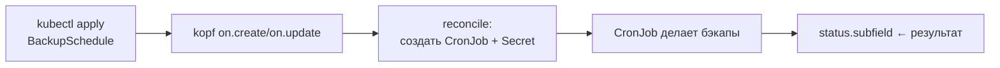

# 🤖 07. Python: Kubernetes-Операторы на Kopf

## 🧠 Оператор за 60 секунд

Оператор = контроллер, кодирующий операционные знания: CRD описывает желаемое состояние, цикл reconcile приводит кластер к нему. Python-вариант — **kopf**: декораторы вместо informer-boilerplate.



## 🛠️ Минимальный оператор: CustomResource + реакция

CRD (упрощённый):

```yaml
apiVersion: apiextensions.k8s.io/v1
kind: CustomResourceDefinition
metadata: { name: backupschedules.example.dev }
spec:
  group: example.dev
  scope: Namespaced
  names: { kind: BackupSchedule, plural: backupschedules, shortNames: [bsched] }
  versions:
    - name: v1
      served: true
      storage: true
      subresources: { status: {} }
      schema:
        openAPIV3Schema:
          type: object
          properties:
            spec:
              type: object
              required: [schedule, target]
              properties:
                schedule: { type: string }     # cron-выражение
                target: { type: string }       # PVC или БД
                retention: { type: integer, default: 7 }
```

Логика (`operator.py`):

```python
import kopf, kubernetes, yaml

@kopf.on.startup()
def configure(settings: kopf.OperatorSettings, **_):
    settings.peering.name = "kopf-peer"          # HA: выбор лидера
    settings.watching.server_timeout = 5 * 60

@kopf.on.create("example.dev", "v1", "backupschedules")
async def create_schedule(spec, meta, namespace, logger, **_):
    name = meta["name"]
    cronjob = {
        "apiVersion": "batch/v1",
        "kind": "CronJob",
        "metadata": {"name": f"{name}-backup", "namespace": namespace,
                     "labels": {"managed-by": "backup-operator"}},
        "spec": {
            "schedule": spec["schedule"],
            "jobTemplate": {"spec": {"template": {"spec": {
                "restartPolicy": "OnFailure",
                "containers": [{
                    "name": "backup",
                    "image": "backup-tool:2.1",
                    "args": ["run", f"--target={spec['target']}",
                             f"--retention={spec.get('retention', 7)}"],
                }],
            }}}},
        },
    }
    api = kubernetes.client.BatchV1Api()
    api.create_namespaced_cron_job(namespace, cronjob)
    return {"cronjob": f"{name}-backup"}         # → записывается в status.kopf

@kopf.on.field("example.dev", "v1", "backupschedules",
               field="spec.schedule", old=None, new=None)
async def schedule_changed(old, new, meta, namespace, **_):
    if new is not None:                           # патчим только CronJob'ы
        patch = {"spec": {"schedule": new}}
        kubernetes.client.BatchV1Api().patch_namespaced_cron_job(
            f"{meta['name']}-backup", namespace, patch)
```

Запуск локально против kind:

```bash
pip install kopf kubernetes
kopf run operator.py --verbose --namespace demo   # dev-режим без Docker
```

## 📡 Жизненный цикл: все хуки, которые пригодятся

| Хук | Срабатывает |
|---|---|
| `on.create` / `on.update` / `on.delete` | события ресурса |
| `on.resume` | рестарт оператора: недоделанные reconciles |
| `on.field(field="spec.x")` | изменение конкретного поля |
| `@kopf.timer("pods", interval=60)` | периодический обход (drift-check) |
| `@kopf.daemon(...)` | долгоживущий воркер на объект |
| `@kopf.on.event(...)` | сырые события без retries (для метрик/логов) |

**Важно:** `on.update` получает и старый, и новый body — сверяйте `old/new`, иначе reconcile будет перезаписывать чужие поля. Идемпотентность: повторный create при уже существующем CronJob должен патчить, а не падать.

## 🧱 Продакшн-обвязка

```dockerfile
FROM python:3.12-slim
RUN pip install --no-cache-dir kopf kubernetes
COPY operator.py /
USER 65534
ENTRYPOINT ["kopf", "run", "/operator.py", "--liveness=http://0.0.0.0:8080/healthz"]
```

```yaml
# RBAC минимальных прав (не cluster-admin!)
rules:
  - apiGroups: ["example.dev"], resources: ["backupschedules"], verbs: ["get","list","watch","patch"]
  - apiGroups: ["batch"], resources: ["cronjobs"], verbs: ["create","update","patch","delete"]
  - apiGroups: [""], resources: ["events"], verbs: ["create"]
```

Метрики: `prometheus_client` + `start_http_server(9090)` — счётчики reconcile/error/duration. Алерты: `rate(operator_errors_total[5m]) > 0`.

Тесты: `pytest-kopf`-подход — вызвать хендлеры напрямую с фейковыми bodies + mock kubernetes.client; интеграционно — envtest/kind.

## ❓ Пять вопросов для самопроверки

---


## ✅ Проверь себя

> Отвечай вслух до раскрытия ответа. Если «не помню» — вернись к разделу.


**В1. Зачем нужен хук on.resume, если есть on.create?**
<details><summary>Ответ</summary>
После падения/рестарта оператора ресурсы уже существуют — create не придёт. Resume гарантирует доделывание незавершённых reconcile'ов (например, CronJob создан, но статус не записан). Без него состояние расходится после каждого рестарта.
</details>

**В2. Почему RBAC оператора не должен быть cluster-admin?**
<details><summary>Ответ</summary>
Компрометация pod'а оператора = компрометация кластера. Принцип least privilege: только глаголы по нужным ресурсам (patch на свои CRD, create на порождаемые объекты). Аудитор и admission-политики требуют обоснования каждого права.
</details>

**В3. Как сделать handler идемпотентным?**
<details><summary>Ответ</summary>
Не полагаться на однократность: перед созданием — get/create-or-patch; перезапись полей детерминирована из spec; статус писать через патч, а не накопление. Kopf сам ретраит упавшие хендлеры с exponential backoff — двойной прогон обязан быть безопасным.
</details>

**В4. Чем @kopf.timer отличается от @kopf.on.event?**
<details><summary>Ответ</summary>
Event — реакция на изменения из watch-потока (мгновенно, может пропустить при переподключении). Timer — периодический полный обход независимо от событий: ловит drift (кто-то руками поменял CronJob) и чинит его. Для self-healing нужен timer поверх событий.
</details>

**В5. Где оператор хранит вычисленное состояние и почему не в памяти процесса?**
<details><summary>Ответ</summary>
В status самого ресурса (kopf возвращает dict из хендлера → status.kopf) или вложенных ресурсах. Память процесса теряется при рестарте и не переживает HA-инстансы; status версионируется etcd, виден kubectl get -o yaml и является единственным источником для resume.
</details>

---

*Что дальше:* [08. FastAPI для платформенных сервисов](08-python-fastapi-services.md) · Go-версия операторов: [Go 08](02-go-fundamentals-deep.md)
