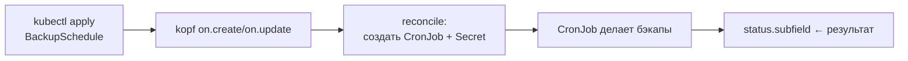

# 🤖 07. Python: Kubernetes-Операторы на Kopf

> Уровень: Senior. Цель: оператор, который переживает рестарты, сетевые разрывы, drift и чужие правки, не течёт по памяти и не роняет кластер. Kopf lifecycle, K8s client watch/patch, диагностика Pending/CrashLoop/ImagePull/OOM/NotReady.

## 🧠 Оператор за 60 секунд

Оператор = контроллер, кодирующий операционные знания: CRD описывает желаемое состояние, цикл reconcile приводит кластер к нему. Python-вариант — **kopf**: декораторы вместо informer-boilerplate.



**Когда Python-оператор, когда Go:** Python — быстрая автоматизация, ≤50 CR, нет жёстких latency требований. Go (kubebuilder) — высокая нагрузка, 1000+ объектов, webhook'и, admission.

## 🛠️ Минимальный оператор: CustomResource + реакция

CRD (упрощённый):

```yaml
apiVersion: apiextensions.k8s.io/v1
kind: CustomResourceDefinition
metadata: { name: backupschedules.example.dev }
spec:
  group: example.dev
  scope: Namespaced
  names: { kind: BackupSchedule, plural: backupschedules, shortNames: [bsched] }
  versions:
    - name: v1
      served: true
      storage: true
      subresources: { status: {} }
      schema:
        openAPIV3Schema:
          type: object
          properties:
            spec:
              type: object
              required: [schedule, target]
              properties:
                schedule: { type: string }     # cron-выражение
                target: { type: string }       # PVC или БД
                retention: { type: integer, default: 7 }
```

Логика (`operator.py`):

```python
import kopf
import kubernetes
import yaml

@kopf.on.startup()
def configure(settings: kopf.OperatorSettings, **__):
    settings.peering.name = "kopf-peer"
    settings.watching.server_timeout = 5 * 60
    settings.watching.client_timeout = 6 * 60
    settings.batching.worker_limit = 50

@kopf.on.create("example.dev", "v1", "backupschedules")
async def create_schedule(spec, meta, namespace, logger, patch, **__):
    name = meta["name"]
    cronjob = {
        "apiVersion": "batch/v1",
        "kind": "CronJob",
        "metadata": {"name": f"{name}-backup", "namespace": namespace,
                     "labels": {"managed-by": "backup-operator", "owner": name}},
        "spec": {
            "schedule": spec["schedule"],
            "jobTemplate": {"spec": {"template": {"spec": {
                "restartPolicy": "OnFailure",
                "containers": [{
                    "name": "backup",
                    "image": "backup-tool:2.1",
                    "args": ["run", f"--target={spec['target']}",
                             f"--retention={spec.get('retention', 7)}"],
                    "resources": {"requests": {"memory": "128Mi", "cpu": "100m"},
                                  "limits": {"memory": "512Mi", "cpu": "500m"}},
                }],
            }}}},
        },
    }
    api = kubernetes.client.BatchV1Api()
    # Идемпотентность: create-or-patch
    try:
        api.create_namespaced_cron_job(namespace, cronjob)
        logger.info(f"created CronJob {name}-backup")
    except kubernetes.client.exceptions.ApiException as e:
        if e.status == 409:
            api.patch_namespaced_cron_job(f"{name}-backup", namespace, {"spec": cronjob["spec"]})
            logger.info(f"patched existing CronJob {name}-backup")
        else:
            raise
    patch.status["cronjob"] = f"{name}-backup"
    patch.status["phase"] = "Ready"
    return {"cronjob": f"{name}-backup"}

@kopf.on.field("example.dev", "v1", "backupschedules", field="spec.schedule")
async def schedule_changed(old, new, meta, namespace, logger, **__):
    if old == new:
        return
    if new is not None:
        patch = {"spec": {"schedule": new}}
        kubernetes.client.BatchV1Api().patch_namespaced_cron_job(
            f"{meta['name']}-backup", namespace, patch)
        logger.info(f"schedule patched {old} -> {new}")
```

Запуск локально против kind:

```bash
pip install kopf kubernetes
kopf run operator.py --verbose --namespace demo   # dev-режим без Docker
kopf run operator.py --liveness=http://0.0.0.0:8080/healthz --standalone
```

## 📡 Жизненный цикл: все хуки, которые пригодятся

| Хук | Срабатывает | Типичное применение |
|---|---|---|
| `on.create` / `on.update` / `on.delete` | события ресурса | основной reconcile |
| `on.resume` | рестарт оператора: недоделанные reconciles | догнать состояние после падения |
| `on.field(field="spec.x")` | изменение конкретного поля | точечный патч, дешевле full reconcile |
| `@kopf.timer("pods", interval=60)` | периодический обход (drift-check) | self-healing: чинить ручные правки |
| `@kopf.daemon(...)` | долгоживущий воркер на объект | polling внешнего API |
| `@kopf.on.event(...)` | сырые события без retries (для метрик/логов) | наблюдаемость |
| `@kopf.on.probe(id="health")` | liveness | — |

**Важно:** `on.update` получает и старый, и новый body — сверяйте `old/new`, иначе reconcile будет перезаписывать чужие поля. Идемпотентность: повторный create при уже существующем CronJob должен патчить, а не падать.

```python
import kopf

@kopf.on.update("example.dev", "v1", "backupschedules")
async def update_schedule(spec, old, new, meta, namespace, logger, **__):
    # Только если spec изменился — не трогать status изменения
    if old.get("spec") == new.get("spec"):
        return
    logger.info(f"spec diff: {old.get('spec')} -> {new.get('spec')}")
    # ... reconcile

@kopf.on.delete("example.dev", "v1", "backupschedules", optional=True)
async def delete_schedule(meta, namespace, logger, **__):
    name = meta["name"]
    # Каскадное удаление через ownerReferences — лучше чем руками
    # Если without ownerRef — чистим сами:
    try:
        kubernetes.client.BatchV1Api().delete_namespaced_cron_job(f"{name}-backup", namespace)
    except kubernetes.client.exceptions.ApiException as e:
        if e.status != 404:
            raise
    logger.info(f"deleted {name}-backup")

@kopf.on.resume("example.dev", "v1", "backupschedules")
async def resume_schedule(spec, meta, namespace, logger, **__):
    # Проверить что CronJob на месте, если нет — пересоздать
    try:
        kubernetes.client.BatchV1Api().read_namespaced_cron_job(f"{meta['name']}-backup", namespace)
    except kubernetes.client.exceptions.ApiException as e:
        if e.status == 404:
            logger.warning(f"resume: CronJob missing, recreating {meta['name']}")
            await create_schedule(spec, meta, namespace, logger, patch={}, **{})

@kopf.timer("example.dev", "v1", "backupschedules", interval=300, idle=60)
async def drift_check(spec, meta, namespace, logger, **__):
    # Раз в 5 минут сверить желаемое и фактическое
    cj = kubernetes.client.BatchV1Api().read_namespaced_cron_job(f"{meta['name']}-backup", namespace)
    if cj.spec.schedule != spec["schedule"]:
        logger.warning(f"drift detected: {cj.spec.schedule} != {spec['schedule']}, fixing")
        kubernetes.client.BatchV1Api().patch_namespaced_cron_job(
            f"{meta['name']}-backup", namespace, {"spec": {"schedule": spec["schedule"]}})

@kopf.daemon("example.dev", "v1", "backupschedules", cancellation_timeout=5)
async def poll_external(spec, meta, namespace, logger, stopped, **__):
    while not stopped:
        await check_backup_health(spec["target"])
        await stopped.wait(60)
```

### Peering и HA

```python
@kopf.on.startup()
def configure_ha(settings: kopf.OperatorSettings, **__):
    settings.peering.name = "backup-operator-peering"
    settings.peering.mandatory = True  # только один лидер активен
    # requires RBAC на leases.coordination.k8s.io
```

---

## 🔧 K8s Python-клиент глубоко: watch, patch, diagnose

### Клиент, конфигурации, сессии

```python
import kubernetes
from kubernetes import client, config, watch

# Внутри кластера — ServiceAccount:
# config.load_incluster_config()
# Локально — kubeconfig:
config.load_kube_config(context="kind-demo")
# или явно:
config.load_kube_config(config_file="/tmp/kubeconfig")

# Клиенты — по группам API:
v1 = client.CoreV1Api()
apps = client.AppsV1Api()
batch = client.BatchV1Api()
custom = client.CustomObjectsApi()
# Настройка timeout/retry:
cfg = client.Configuration.get_default_copy()
cfg.verify_ssl = True
cfg.retries = 3
api_client = client.ApiClient(configuration=cfg)
v1 = client.CoreV1Api(api_client)

# Пагинация — limit + continue:
ret = v1.list_namespaced_pod(namespace="prod", limit=100)
while ret.metadata._continue:
    ret = v1.list_namespaced_pod(namespace="prod", limit=100, _continue=ret.metadata._continue)
    for pod in ret.items:
        print(pod.metadata.name)
```

### Watch — поток событий

```python
import kubernetes
from kubernetes import watch

w = watch.Watch()
for event in w.stream(v1.list_namespaced_pod, namespace="prod", timeout_seconds=300):
    obj = event["object"]
    typ = event["type"]  # ADDED, MODIFIED, DELETED, ERROR
    print(f"{typ} {obj.metadata.name} phase={obj.status.phase}")
    if typ == "ERROR":
        print(obj)
        break

# Watch с resourceVersion — возобновление после разрыва:
rv = "0"
while True:
    try:
        for event in w.stream(v1.list_namespaced_pod, namespace="prod", resource_version=rv, timeout_seconds=60):
            rv = event["object"].metadata.resource_version
            # handle
    except kubernetes.client.exceptions.ApiException as e:
        if e.status == 410:  # Gone — RV слишком стар
            rv = "0"
        else:
            raise
    except Exception:
        import time; time.sleep(5)
```

**Failure:** watch без `timeout_seconds` может висеть вечно без heartbeat — ставьте 60-300s + relist.

### Patch — стратегический, merge, JSON

```python
from kubernetes import client

# Merge patch (простой):
apps.patch_namespaced_deployment(
    "web", "prod",
    body={"spec": {"replicas": 5}}
)

# Strategic merge — для полей с patchStrategy (containers):
# kubernetes python client использует JSON merge по умолчанию для strategic
apps.patch_namespaced_deployment(
    "web", "prod",
    body={"spec": {"template": {"spec": {"containers": [{"name": "web", "image": "web:1.42"}]}}}}
)

# JSON Patch (RFC6902) — точечные операции:
custom.patch_namespaced_custom_object(
    "example.dev", "v1", "prod", "backupschedules", "my-backup",
    body=[{"op": "replace", "path": "/spec/retention", "value": 14}]
)

# Server-side apply (рекомендуемый для операторов — декларативно):
apps.patch_namespaced_deployment(
    "web", "prod",
    body={
        "apiVersion": "apps/v1", "kind": "Deployment",
        "metadata": {"name": "web", "namespace": "prod"},
        "spec": {"replicas": 5}
    },
    field_manager="backup-operator",
    force=True
)
```

### Диагностика: Pending/CrashLoop/ImagePull/OOM/NotReady/no endpoints

```python
from kubernetes import client

v1 = client.CoreV1Api()
apps = client.AppsV1Api()

def diagnose_pod(name: str, namespace: str):
    pod = v1.read_namespaced_pod(name, namespace)
    phase = pod.status.phase
    print(f"phase={phase}")
    for cs in (pod.status.container_statuses or []):
        print(f"  container {cs.name}: ready={cs.ready} restarts={cs.restart_count}")
        state = cs.state
        if state.waiting:
            print(f"    waiting: {state.waiting.reason} {state.waiting.message}")
            # ImagePullBackOff -> проверить image, secret
            # CrashLoopBackOff -> логи, liveness
            # Pending -> см. ниже
        if state.terminated:
            print(f"    terminated: {state.terminated.reason} exit={state.terminated.exit_code}")
            if state.terminated.reason == "OOMKilled":
                print("    -> увеличьте limits.memory или ищите утечку (tracemalloc/py-spy)")
    # Events — главная подсказка:
    events = v1.list_namespaced_event(namespace, field_selector=f"involvedObject.name={name}")
    for e in events.items[-10:]:
        print(f"  event {e.reason}: {e.message}")

def diagnose_pending(pod_name: str, namespace: str):
    pod = v1.read_namespaced_pod(pod_name, namespace)
    # Pending причины:
    # - Insufficient cpu/memory -> kubectl describe pod покажет FailedScheduling
    # - PVC not bound -> storage
    # - NodeSelector/Affinity не совпал
    # - Taints
    events = v1.list_namespaced_event(namespace, field_selector=f"involvedObject.name={pod_name}")
    for e in events.items:
        if e.reason == "FailedScheduling":
            print(f"SCHEDULING: {e.message}")
    # Проверить ресурсы нод:
    for node in v1.list_node().items:
        print(f"node {node.metadata.name} allocatable={node.status.allocatable}")

def diagnose_service(name: str, namespace: str):
    svc = v1.read_namespaced_service(name, namespace)
    eps = v1.read_namespaced_endpoints(name, namespace)
    if not eps.subsets:
        print(f"SERVICE {name} has NO ENDPOINTS -> селектор не совпал или pod NotReady")
        print(f"  selector={svc.spec.selector}")
        pods = v1.list_namespaced_pod(namespace, label_selector=",".join(f"{k}={v}" for k,v in (svc.spec.selector or {}).items()))
        for p in pods.items:
            print(f"  pod {p.metadata.name} ready={p.status.conditions[-1].type if p.status.conditions else 'unknown'}")
            diagnose_pod(p.metadata.name, namespace)
    # Проверить NetworkPolicy, readinessProbe
```

**Таблица диагностики:**

| Симптом | kubectl | Python-клиент | Причина | Фикс |
|---|---|---|---|---|
| Pending | `describe pod` → FailedScheduling | events reason FailedScheduling | ресурсы, PVC, affinity | увеличить quota, поправить PVC/selector |
| ImagePullBackOff | `waiting reason=ImagePullBackOff` | container_status.state.waiting | неверный image, нет ImagePullSecret | `kubectl set image`, создать secret |
| CrashLoopBackOff | `terminated exit 1` + restarts++ | restart_count растёт | приложение падает | `kubectl logs --previous`, увеличить `initialDelaySeconds` |
| OOMKilled | `terminated reason OOMKilled` | terminated.reason | limits.memory мал | поднять limits, профилировать память |
| NotReady | `Ready=False` | conditions Ready False | readinessProbe падает | поправить probe, проверить зависимости |
| No endpoints | `endpoints subsets empty` | endpoints.subsets None | селектор не совпал | `label` pod'а vs `selector` svc |
| 403 Forbidden | ApiException 403 | client exception | RBAC | добавить Role/ClusterRole |

---

## 📁 Файлы, ОС, система — для оператора

Оператор живёт в pod'е: ограниченный FS, сигналы, файловые дескрипторы.

```python
import pathlib
import os
import signal
import resource
import shutil

# Диск — проверить перед записью большого бэкапа:
total, used, free = shutil.disk_usage("/tmp" if os.name != "posix" else "/")
print(f"free {free//1024**2}MB")

# FD лимиты — важно для watch (много соединений):
soft, hard = resource.getrlimit(resource.RLIMIT_NOFILE) if hasattr(resource, "getrlimit") else (1024, 4096)
print(f"FD {soft}/{hard}")

# Сигналы — kopf сам обрабатывает SIGTERM, но для daemon:
import kopf
@kopf.on.startup()
def setup_signals(settings: kopf.OperatorSettings, **__):
    settings.posting.enabled = True  # события в K8s Events

# File locking — одноразовый Job через flock:
try:
    import fcntl
    lock = open("/tmp/operator.lock", "w")
    fcntl.flock(lock, fcntl.LOCK_EX | fcntl.LOCK_NB)
except (ImportError, BlockingIOError):
    pass

# Subprocess — вызов kubectl/helm из оператора (осторожно!):
import subprocess
result = subprocess.run(
    ["helm", "upgrade", "--install", "myapp", "./chart", "-n", "prod", "--atomic", "--timeout", "5m"],
    capture_output=True, text=True, timeout=360, check=False
)
if result.returncode != 0:
    raise kopf.TemporaryError(f"helm failed: {result.stderr[:500]}", delay=60)
# Никогда shell=True с пользовательским вводом!
```

### Process discovery — найти зомби-Job'ы

```python
from kubernetes import client

batch = client.BatchV1Api()
jobs = batch.list_namespaced_job("prod")
for j in jobs.items:
    if j.status.failed and (j.status.failed or 0) > 3:
        print(f"failing job {j.metadata.name} failed={j.status.failed}")
        # удалить или алертить
```

---

## 🌐 Networking глубоко — внутри оператора

```python
import socket
import ssl
import ipaddress

# Проверка DNS до API сервера (диагностика):
import kubernetes
cfg = kubernetes.client.Configuration.get_default_copy()
print(f"host={cfg.host}")
host = cfg.host.split("://")[1].split(":")[0].split("/")[0]
print(socket.gethostbyname(host))

# TLS — verify_ssl:
cfg.verify_ssl = True
cfg.ssl_ca_cert = "/var/run/secrets/kubernetes.io/serviceaccount/ca.crt"
# verify=False в операторе = MITM кластера!

# Socket для health сервера оператора (kopf --liveness):
import http.server
class HealthHandler(http.server.BaseHTTPRequestHandler):
    def do_GET(self):
        if self.path == "/healthz":
            self.send_response(200)
            self.end_headers()
            self.wfile.write(b"ok")
        else:
            self.send_response(404)
            self.end_headers()
    def log_message(self, format, *args):
        pass

# Unix socket — для sidecar коммуникации:
sock = socket.socket(socket.AF_UNIX, socket.SOCK_STREAM)
try:
    sock.connect("/var/run/operator.sock")
    sock.sendall(b"ping")
except OSError:
    pass

# Port checker — ждать БД перед reconciles:
def wait_for_db(host: str, port: int, timeout: float = 30):
    import time
    deadline = time.monotonic() + timeout
    while time.monotonic() < deadline:
        try:
            with socket.create_connection((host, port), timeout=2):
                return True
        except OSError:
            time.sleep(1)
    raise TimeoutError(f"db {host}:{port} not ready")
```

---

## 🚨 Exceptions глубоко

```python
import kopf

# Kopf различает Permanent vs Temporary:
@kopf.on.create("example.dev", "v1", "backupschedules")
async def create(spec, meta, **__):
    try:
        await create_cronjob()
    except ValueError as e:
        # Не ретраить — баг в spec, пользователь должен поправить
        raise kopf.PermanentError(f"bad spec: {e}") from e
    except OSError as e:
        # Ретрай с backoff — сеть, API недоступен
        raise kopf.TemporaryError(f"transient: {e}", delay=30) from e

# ExceptionGroup — параллельные reconciles:
async def reconcile_all():
    errors = []
    for ns in ["prod", "staging"]:
        try:
            await reconcile(ns)
        except Exception as e:
            errors.append(e)
    if errors:
        raise ExceptionGroup("reconcile failures", errors)

# except* — разделить retryable vs fatal:
try:
    raise ExceptionGroup("eg", [kopf.TemporaryError("timeout"), kopf.PermanentError("bad")])
except* kopf.TemporaryError as eg:
    print(f"will retry: {eg.exceptions}")
except* kopf.PermanentError as eg:
    print(f"permanent: {eg.exceptions}")

# Цепочки — не терять первопричину:
try:
    kubernetes.client.BatchV1Api().create_namespaced_cron_job("ns", {})
except kubernetes.client.exceptions.ApiException as e:
    if e.status == 422:
        raise kopf.PermanentError(f"validation: {e.body}") from e
    raise kopf.TemporaryError(f"api {e.status}") from e
```

### Трансляция ошибок: K8s API → domain → status

```python
def set_status(patch, phase: str, msg: str):
    patch.status["phase"] = phase
    patch.status["message"] = msg
    patch.status["last_update"] = __import__("datetime").datetime.utcnow().isoformat()

@kopf.on.create("example.dev", "v1", "backupschedules")
async def create_with_status(spec, patch, **__):
    try:
        await do_create(spec)
        set_status(patch, "Ready", "CronJob created")
    except kopf.PermanentError as e:
        set_status(patch, "Failed", str(e))
        raise
    except kopf.TemporaryError as e:
        set_status(patch, "Pending", str(e))
        raise
```

---

## 📝 Logging глубоко

```python
import logging
import sys
import json
import contextvars

# Kopf даёт logger в хендлеры — но настройте root для своих модулей:
def setup_operator_logging(json_logs: bool = True):
    handler = logging.StreamHandler(sys.stderr)
    if json_logs:
        from pythonjsonlogger import jsonlogger
        handler.setFormatter(jsonlogger.JsonFormatter(
            "%(asctime)s %(levelname)s %(name)s %(message)s %(correlation)s"
        ))
    else:
        handler.setFormatter(logging.Formatter("%(asctime)s %(levelname)s %(name)s %(message)s"))
    root = logging.getLogger()
    root.handlers = [handler]
    root.setLevel(logging.INFO)
    logging.getLogger("kopf").setLevel(logging.INFO)
    logging.getLogger("kubernetes").setLevel(logging.WARNING)

# Correlation — по UID объекта:
cid = contextvars.ContextVar("cid", default="-")

@kopf.on.create("example.dev", "v1", "backupschedules")
async def create_logged(meta, logger, **__):
    uid = meta.get("uid", "")[:8]
    cid.set(uid)
    logger.info(f"reconcile uid={uid} name={meta['name']}")
    # Все логи этого reconcile — с uid

# Маскирование секретов:
class MaskFilter(logging.Filter):
    def filter(self, record):
        msg = record.getMessage()
        for secret in ["password", "token", "secret"]:
            if secret in msg.lower():
                record.msg = msg.replace(secret, "***")
                record.args = ()
        return True
```

**Loki/ELK:** оператор пишет JSON в stderr -> Fluent Bit / Promtail -> Loki с labels `{app="backup-operator", namespace="prod"}`; алерты по `rate({app="backup-operator"} |= "ERROR" [5m])`.

---

## 🔒 Security

```python
# RBAC — least privilege:
# rules:
#   - apiGroups: ["example.dev"], resources: ["backupschedules"], verbs: ["get","list","watch","patch"]
#   - apiGroups: ["batch"], resources: ["cronjobs","jobs"], verbs: ["create","patch","delete","get"]
#   - apiGroups: [""], resources: ["events"], verbs: ["create"]
#   - apiGroups: ["coordination.k8s.io"], resources: ["leases"], verbs: ["get","create","update"]

# Secrets — не в env plaintext, а в volume:
# env.valueFrom.secretKeyRef или projected volume
import pathlib
token = pathlib.Path("/var/run/secrets/backup/token").read_text().strip() if pathlib.Path("/var/run/secrets/backup/token").exists() else ""

# YAML — только safe_load для CR spec:
import yaml
# yaml.safe_load(user_yaml)  # не yaml.load!

# SSRF — если оператор фетчит URL из spec.target:
import ipaddress, socket, urllib.parse
def validate_target(url: str):
    host = urllib.parse.urlparse(url).hostname
    ip = ipaddress.ip_address(socket.gethostbyname(host))
    if ip.is_private or ip.is_loopback:
        raise kopf.PermanentError(f"private target blocked: {url}")

# Подпись образов — verify в операторе перед деплоем:
import subprocess
subprocess.run(["cosign", "verify", image, "--certificate-identity", "ci@company"], check=True, timeout=30)

# pip-audit, trivy:
# pip-audit --desc
# trivy image backup-operator:1.0
```

---

## 📊 Data processing — обработка манифестов

```python
import yaml
import json
import gzip
import pathlib

# Манифесты — multi-doc YAML:
with open("manifests.yaml", encoding="utf-8") as f:
    docs = list(yaml.safe_load_all(f))
    print(f"loaded {len(docs)} docs")

# Генерация манифеста из шаблона:
template = pathlib.Path("cronjob.yaml.tmpl").read_text()
rendered = template.replace("{{schedule}}", "0 2 * * *").replace("{{target}}", "prod-db")
data = yaml.safe_load(rendered)

# JSON Patch для манифестов:
import jsonpatch
patch = jsonpatch.JsonPatch([{"op": "replace", "path": "/spec/schedule", "value": "0 3 * * *"}])
new_doc = patch.apply(data)

# Gzip бэкапы:
import gzip
with gzip.open("/tmp/dump.sql.gz", "wt", encoding="utf-8") as f:
    f.write("backup data")
with gzip.open("/tmp/dump.sql.gz", "rt", encoding="utf-8") as f:
    print(f.read()[:100])

# Tar — архивы чартов:
import tarfile
with tarfile.open("chart.tar.gz", "r:gz") as tar:
    for m in tar.getmembers():
        if m.name.startswith("/") or ".." in m.name:
            continue
        print(m.name)
```

---

## 🗄️ Databases — состояние оператора

Оператор может хранить checkpoint'ы в ConfigMap, Secret или внешней БД.

```python
import psycopg_pool

pool = psycopg_pool.ConnectionPool(
    "host=postgres.prod.svc dbname=operator user=op password=secret connect_timeout=5",
    min_size=1, max_size=5
)

def save_checkpoint(name: str, status: str):
    with pool.connection() as conn:
        with conn.transaction():
            conn.execute(
                "INSERT INTO checkpoints(name, status, updated) VALUES (%s,%s, now()) "
                "ON CONFLICT (name) DO UPDATE SET status=%s, updated=now()",
                (name, status, status)
            )

def get_checkpoint(name: str):
    with pool.connection() as conn:
        row = conn.execute("SELECT status FROM checkpoints WHERE name=%s", (name,)).fetchone()
        return row[0] if row else None

# Health — для probe:
def db_health() -> bool:
    try:
        with pool.connection() as conn:
            conn.execute("SELECT 1").fetchone()
        return True
    except Exception:
        return False

@kopf.on.probe(id="db")
async def check_db(**__):
    if not db_health():
        raise kopf.PermanentError("db not ready")
```

---

## 🔭 Observability

```python
from prometheus_client import Counter, Histogram, Gauge, make_asgi_app
import time

RECONCILES = Counter("operator_reconciles_total", "reconciles", ["result"])
DURATION = Histogram("operator_reconcile_seconds", "duration", ["op"])
QUEUE = Gauge("operator_queue_size", "queue")

@kopf.on.create("example.dev", "v1", "backupschedules")
async def create_observed(spec, meta, **__):
    start = time.perf_counter()
    try:
        await do_create(spec)
        RECONCILES.labels("success").inc()
    except kopf.TemporaryError:
        RECONCILES.labels("retry").inc()
        raise
    except Exception:
        RECONCILES.labels("error").inc()
        raise
    finally:
        DURATION.labels("create").observe(time.perf_counter() - start)

# /metrics и /healthz — kopf уже даёт --liveness, добавьте свой:
from fastapi import FastAPI
import prometheus_client

metrics_app = FastAPI()
metrics_app.mount("/metrics", make_asgi_app())

# Трассировка:
from opentelemetry import trace
tracer = trace.get_tracer("operator")
with tracer.start_as_current_span("reconcile") as span:
    span.set_attribute("cr.name", "my-backup")
```

---

## 🔄 CI/CD — lint → test → security → build → SBOM → scan → publish

```yaml
stages: [lint, test, security, build, publish]

lint:
  stage: lint
  image: ghcr.io/astral-sh/uv:python3.12-bookworm-slim
  script:
    - uv sync --frozen
    - uv run ruff format --check .
    - uv run ruff check .
    - uv run mypy operator.py --ignore-missing-imports
    - uv run pyright --stats

unit:
  stage: test
  script:
    - uv run pytest tests/unit -q --cov=. --cov-fail-under=70 -n auto
    # тесты вызывают хендлеры напрямую с фейковыми bodies + mock kubernetes.client

integration:
  stage: test
  image: docker:24
  services: [docker:24-dind]
  script:
    - kind create cluster --name test
    - kubectl apply -f crd.yaml
    - kopf run operator.py --verbose &
    - kubectl apply -f test-cr.yaml
    - kubectl wait --for=condition=Ready backupschedule/my-backup --timeout=60s
    - pytest tests/integration -q

security:
  stage: security
  script:
    - uv run pip-audit --desc
    - trivy fs --severity HIGH,CRITICAL --exit-code 1 .
    - uv run bandit -r . -f json

build:
  stage: build
  script:
    - docker build -t $CI_REGISTRY_IMAGE:$CI_COMMIT_SHA .
    - uv run cyclonedx-py environment -o sbom.json
  artifacts: {paths: [sbom.json]}

scan:
  stage: build
  script:
    - trivy image --severity HIGH,CRITICAL --exit-code 1 $CI_REGISTRY_IMAGE:$CI_COMMIT_SHA
    - cosign sign --yes $CI_REGISTRY_IMAGE:$CI_COMMIT_SHA

publish:
  stage: publish
  script:
    - docker push $CI_REGISTRY_IMAGE:$CI_COMMIT_SHA
  rules: [{if: '$CI_COMMIT_TAG'}]
```

```dockerfile
FROM python:3.12-slim
RUN pip install --no-cache-dir kopf kubernetes prometheus-client
COPY operator.py /
USER 65534
ENTRYPOINT ["kopf", "run", "/operator.py", "--liveness=http://0.0.0.0:8080/healthz"]
HEALTHCHECK CMD curl -f http://localhost:8080/healthz || exit 1
```

---

## 💥 Failure modes — оператор

| Симптом | Причина | Диагностика | Лечение |
|---|---|---|---|
| `Watch expired (410 Gone)` | RV устарел | логи kopf `resource version too old` | kopf сам relist, но проверьте `server_timeout` |
| `Missed events` | watch разрыв без relist | нет `on.resume` | добавить `on.resume` + `timer` drift-check |
| `Double create 409` | ретрай без идемпотентности | ApiException 409 | `get/create-or-patch` |
| `Leader conflict` | два лидера | lease ошибки | `peering.mandatory=True` + RBAC leases |
| `OOMKilled` | утечка памяти, большой список | `kubectl top pod`, tracemalloc | pagination limit, `lru_cache` с maxsize |
| `Pending cronjob` | quota | FailedScheduling | увеличить quota |
| `ImagePullBackOff` в порождённом Job | неверный image | container_status | fallback image, ImagePullSecret |

---

## 🧱 Продакшн-обвязка

```dockerfile
FROM python:3.12-slim
RUN pip install --no-cache-dir kopf kubernetes prometheus-client
COPY operator.py /
USER 65534
ENTRYPOINT ["kopf", "run", "/operator.py", "--liveness=http://0.0.0.0:8080/healthz"]
```

```yaml
# RBAC минимальных прав (не cluster-admin!)
rules:
  - apiGroups: ["example.dev"], resources: ["backupschedules"], verbs: ["get","list","watch","patch"]
  - apiGroups: ["example.dev"], resources: ["backupschedules/status"], verbs: ["patch","update"]
  - apiGroups: ["batch"], resources: ["cronjobs","jobs"], verbs: ["create","update","patch","delete","get","list","watch"]
  - apiGroups: [""], resources: ["events"], verbs: ["create"]
  - apiGroups: ["coordination.k8s.io"], resources: ["leases"], verbs: ["get","create","update"]
```

Метрики: `prometheus_client` + `start_http_server(9090)` — счётчики reconcile/error/duration. Алерты: `rate(operator_errors_total[5m]) > 0`.

Тесты: `pytest-kopf`-подход — вызвать хендлеры напрямую с фейковыми bodies + mock kubernetes.client; интеграционно — envtest/kind.

---

## 🧪 Лаборатория

### Lab 1 — запустить оператор локально на kind

```bash
kind create cluster --name lab
kubectl apply -f crd.yaml
pip install kopf kubernetes
kopf run operator.py --verbose --namespace default &
kubectl apply -f - <<EOF
apiVersion: example.dev/v1
kind: BackupSchedule
metadata: {name: demo}
spec: {schedule: "*/5 * * * *", target: "my-pvc", retention: 3}
EOF
kubectl get backupschedules -o yaml
kubectl get cronjobs
# Проверьте: удалите CronJob руками -> timer через 5 мин должен восстановить
kubectl delete cronjob demo-backup
sleep 310 && kubectl get cronjobs  # восстановлен?
```

### Lab 2 — диагностика Pending / CrashLoop / OOM

```python
# lab_diagnose.py — создайте pod с ошибками и диагностируйте
from kubernetes import client, config
config.load_kube_config()
v1 = client.CoreV1Api()

# Создать pod с неверным image:
body = {
    "apiVersion": "v1", "kind": "Pod",
    "metadata": {"name": "bad-image", "namespace": "default"},
    "spec": {"containers": [{"name": "c", "image": "no-such-image:999", "resources": {"limits": {"memory": "10Mi"}}}],
             "restartPolicy": "Never"}
}
try:
    v1.create_namespaced_pod("default", body)
except Exception as e:
    print(e)

# Диагностировать:
import time; time.sleep(5)
pod = v1.read_namespaced_pod("bad-image", "default")
print(pod.status.container_statuses[0].state.waiting.reason)  # ImagePullBackOff
# События:
for e in v1.list_namespaced_event("default", field_selector="involvedObject.name=bad-image").items[-5:]:
    print(e.reason, e.message)
# Удалить:
v1.delete_namespaced_pod("bad-image", "default")
```

### Lab 3 — watch + patch + file locking

```python
# lab_watch_patch.py
from kubernetes import client, config, watch
config.load_kube_config()
v1 = client.CoreV1Api()
w = watch.Watch()
# Создать тестовый ConfigMap:
try:
    v1.create_namespaced_config_map("default", {"metadata": {"name": "demo-cm"}, "data": {"key": "1"}})
except client.exceptions.ApiException as e:
    if e.status != 409:
        raise
# Watch 10 секунд:
import threading, time
def watcher():
    for event in w.stream(v1.list_namespaced_config_map, namespace="default", timeout_seconds=10):
        print(event["type"], event["object"].metadata.name)
t = threading.Thread(target=watcher, daemon=True)
t.start()
time.sleep(1)
# Patch:
v1.patch_namespaced_config_map("demo-cm", "default", {"data": {"key": "2"}})
time.sleep(2)
w.stop()
print("watch done")
```

---

## ✅ Проверь себя

> Отвечай вслух до раскрытия ответа. Если «не помню» — вернись к разделу.

**В1. Зачем нужен хук on.resume, если есть on.create?**
<details><summary>Ответ</summary>
После падения/рестарта оператора ресурсы уже существуют — create не придёт. Resume гарантирует доделывание незавершённых reconcile'ов (например, CronJob создан, но статус не записан). Без него состояние расходится после каждого рестарта.
</details>

**В2. Почему RBAC оператора не должен быть cluster-admin?**
<details><summary>Ответ</summary>
Компрометация pod'а оператора = компрометация кластера. Принцип least privilege: только глаголы по нужным ресурсам (patch на свои CRD, create на порождаемые объекты). Аудитор и admission-политики требуют обоснования каждого права.
</details>

**В3. Как сделать handler идемпотентным?**
<details><summary>Ответ</summary>
Не полагаться на однократность: перед созданием — get/create-or-patch; перезапись полей детерминирована из spec; статус писать через патч, а не накопление. Kopf сам ретраит упавшие хендлеры с exponential backoff — двойной прогон обязан быть безопасным.
</details>

**В4. Чем @kopf.timer отличается от @kopf.on.event?**
<details><summary>Ответ</summary>
Event — реакция на изменения из watch-потока (мгновенно, может пропустить при переподключении). Timer — периодический полный обход независимо от событий: ловит drift (кто-то руками поменял CronJob) и чинит его. Для self-healing нужен timer поверх событий.
</details>

**В5. Где оператор хранит вычисленное состояние и почему не в памяти процесса?**
<details><summary>Ответ</summary>
В status самого ресурса (kopf возвращает dict из хендлера → status.kopf) или вложенных ресурсах. Память процесса теряется при рестарте и не переживает HA-инстансы; status версионируется etcd, виден kubectl get -o yaml и является единственным источником для resume.
</details>

**В6. Что означает `ContainerStatus waiting reason ImagePullBackOff` и как оператор должен реагировать?**
<details><summary>Ответ</summary>
Kubelet не смог скачать образ (нет такого тега, приватный registry без secret, сеть). Оператор не должен бесконечно ретраить — ставить `phase=Failed` с `TemporaryError(delay=300)` для 429/5xx и `PermanentError` для 404/неверного имени; алертить. Проверять `container_statuses` и `events` с reason `Failed`/`BackOff`.
</details>

**В7. Как отличить OOMKilled от CrashLoopBackOff в `pod.status` и что делать в каждом случае?**
<details><summary>Ответ</summary>
OOMKilled — `terminated.reason == "OOMKilled"` (exit 137), память превысила limits → увеличить `resources.limits.memory` или профилировать утечку (tracemalloc). CrashLoop — `waiting reason CrashLoopBackOff` + `restartCount` растёт, `terminated.exitCode !=0` но не OOM → смотреть `logs --previous`, проверять livenessProbe, `initialDelaySeconds`.
</details>

**В8. Почему `watch.Watch().stream(..., timeout_seconds=300)` с `resource_version` и обработкой 410 Gone — обязательно?**
<details><summary>Ответ</summary>
Без таймаута watch повиснет без heartbeat; без RV — после разрыва пропустит события; 410 Gone означает что RV слишком стар (etcd compact) — нужен relist с `rv="0"`. Kopf делает это сам, но прямой клиент должен: `except ApiException 410: rv="0"`.
</details>

**В9. Чем `TemporaryError(delay=30)` отличается от `PermanentError` в kopf и как это связано с ExceptionGroup?**
<details><summary>Ответ</summary>
Temporary — kopf ретраит с backoff (сеть, 5xx), Permanent — не ретраит, ставит ошибку в status (баг в spec). Параллельные reconciles могут собрать обе ошибки в `ExceptionGroup` — `except* TemporaryError` ретраит только retryable, `except* PermanentError` маркирует Failed.
</details>

**В10. Как предотвратить SSRF если `spec.target` — URL который оператор фетчит?**
<details><summary>Ответ</summary>
Валидировать перед запросом: резолвить host → `ip_address.is_private/is_loopback/is_link_local` → блокировать private ranges (169.254.169.254 metadata!). Allowlist доменов, `httpx` с `verify=True`, таймаутом и `follow_redirects=False` (редирект на metadata). Логировать без тела ответа.
</details>

---

*Что дальше:* [08. FastAPI для платформенных сервисов](08-python-fastapi-services.md) · Go-версия операторов: [Go 08](02-go-fundamentals-deep.md)
