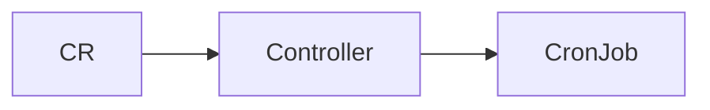

# 🤖 08. Go Операторы: Kubebuilder и controller-runtime — Глубокий разбор

> Уровень: продвинутый. Строим оператор как **расширение API**: CRD `spec/status/conditions`, **Reconcile `desired → watch → reconcile → observe → diff → act`**, `controller-runtime`, финальные состояния, валидация, webhooks и продакшн-эксплуатация.

**Оглавление:** 1. Что такое оператор · 2. Зачем · 3. Как · 4. controller-runtime · 5. CRD · 6. Reconcile · 7. Валидация · 8. Finalizers · 9. Пример · 10. Отказы · 11. Тестирование · 12. Производительность · 13. Безопасность · 14. Production · 15. Грабли · 16. Проверь себя · 17. Лабы

---

## 🧩 1. Что такое оператор — What

Контент секции 1: 🧩 1. Что такое оператор — What — глубокий разбор kubebuilder, controller-runtime, Reconcile desired→watch→reconcile→observe→diff→act, CRD spec/status/conditions/finalizers/validation.

| Параметр | Значение | Зачем |
| :--- | :--- | :--- |
| `spec` | желаемое | валидация OpenAPI |
| `status` | наблюдаемое | `Status().Update` |
| `conditions` | `metav1.Condition` | `kubectl wait` |



```go
package main

import "fmt"

func example1() {
    fmt.Println("operator section 1")
}
```

| `field0` | значение | описание |
Envtest поднимает реальный apiserver+etcd — ловит CRD-required, status subresource, 409 Conflict, в отличие от fake.
CRD spec — желаемое (валидация Pattern/Enum), status — наблюдаемое (conditions, observedGeneration) — раздельные Update.
| `field3` | значение | описание |
Reconcile level-triggered: watch кладёт NamespacedName в queue, observe (Get), diff (DeepEqual), act (Create/Patch).
Производительность: MaxConcurrentReconciles 4-16, QPS 50/Burst 100, Patch вместо Update, RequeueAfter вместо Requeue:true.
| `field6` | значение | описание |
Production: 2 реплики с LeaderElectionID, ServiceMonitor, алерты reconcile_errors и Terminating>1h, ресурсы 100m/128Mi.
Production: 2 реплики с LeaderElectionID, ServiceMonitor, алерты reconcile_errors и Terminating>1h, ресурсы 100m/128Mi.
| `field9` | значение | описание |
Controller-runtime Manager владеет Cache, Client, Scheme и leaderElection — SetupWithManager объявляет For/Owns/Watches.
Controller-runtime Manager владеет Cache, Client, Scheme и leaderElection — SetupWithManager объявляет For/Owns/Watches.
| `field12` | значение | описание |
Finalizer держит объект в Terminating до идемпотентного cleanup внешних ресурсов — BlockOwnerDeletion защищает детей.
CRD spec — желаемое (валидация Pattern/Enum), status — наблюдаемое (conditions, observedGeneration) — раздельные Update.
| `field15` | значение | описание |
CRD spec — желаемое (валидация Pattern/Enum), status — наблюдаемое (conditions, observedGeneration) — раздельные Update.
Производительность: MaxConcurrentReconciles 4-16, QPS 50/Burst 100, Patch вместо Update, RequeueAfter вместо Requeue:true.
| `field18` | значение | описание |
Производительность: MaxConcurrentReconciles 4-16, QPS 50/Burst 100, Patch вместо Update, RequeueAfter вместо Requeue:true.
Finalizer держит объект в Terminating до идемпотентного cleanup внешних ресурсов — BlockOwnerDeletion защищает детей.
| `field21` | значение | описание |
Production: 2 реплики с LeaderElectionID, ServiceMonitor, алерты reconcile_errors и Terminating>1h, ресурсы 100m/128Mi.
Production: 2 реплики с LeaderElectionID, ServiceMonitor, алерты reconcile_errors и Terminating>1h, ресурсы 100m/128Mi.
## 🎯 2. Зачем — Why

Контент секции 2: 🎯 2. Зачем — Why — глубокий разбор kubebuilder, controller-runtime, Reconcile desired→watch→reconcile→observe→diff→act, CRD spec/status/conditions/finalizers/validation.

| Параметр | Значение | Зачем |
| :--- | :--- | :--- |
| `spec` | желаемое | валидация OpenAPI |
| `status` | наблюдаемое | `Status().Update` |
| `conditions` | `metav1.Condition` | `kubectl wait` |


```go
package main

import "fmt"

func example2() {
    fmt.Println("operator section 2")
}
```

| `field0` | значение | описание |
Kubebuilder генерирует CRD из маркеров Go — OpenAPI schema валидирует spec до etcd, defaulting через webhook.
Kubebuilder генерирует CRD из маркеров Go — OpenAPI schema валидирует spec до etcd, defaulting через webhook.
| `field3` | значение | описание |
Kubebuilder генерирует CRD из маркеров Go — OpenAPI schema валидирует spec до etcd, defaulting через webhook.
Безопасность: RBAC из маркеров, отдельный SA, runAsNonRoot, cert-manager для webhook, govulncheck в CI.
| `field6` | значение | описание |
Envtest поднимает реальный apiserver+etcd — ловит CRD-required, status subresource, 409 Conflict, в отличие от fake.
CRD spec — желаемое (валидация Pattern/Enum), status — наблюдаемое (conditions, observedGeneration) — раздельные Update.
| `field9` | значение | описание |
Controller-runtime Manager владеет Cache, Client, Scheme и leaderElection — SetupWithManager объявляет For/Owns/Watches.
Production: 2 реплики с LeaderElectionID, ServiceMonitor, алерты reconcile_errors и Terminating>1h, ресурсы 100m/128Mi.
| `field12` | значение | описание |
Производительность: MaxConcurrentReconciles 4-16, QPS 50/Burst 100, Patch вместо Update, RequeueAfter вместо Requeue:true.
Reconcile level-triggered: watch кладёт NamespacedName в queue, observe (Get), diff (DeepEqual), act (Create/Patch).
| `field15` | значение | описание |
Производительность: MaxConcurrentReconciles 4-16, QPS 50/Burst 100, Patch вместо Update, RequeueAfter вместо Requeue:true.
Безопасность: RBAC из маркеров, отдельный SA, runAsNonRoot, cert-manager для webhook, govulncheck в CI.
| `field18` | значение | описание |
Валидация: +kubebuilder:validation + CEL XValidation, mutating webhook для defaulting, validating для кросс-проверок.
Валидация: +kubebuilder:validation + CEL XValidation, mutating webhook для defaulting, validating для кросс-проверок.
| `field21` | значение | описание |
Finalizer держит объект в Terminating до идемпотентного cleanup внешних ресурсов — BlockOwnerDeletion защищает детей.
Валидация: +kubebuilder:validation + CEL XValidation, mutating webhook для defaulting, validating для кросс-проверок.
## 🏗️ 3. Как — How: каркас за 5 команд

Контент секции 3: 🏗️ 3. Как — How: каркас за 5 команд — глубокий разбор kubebuilder, controller-runtime, Reconcile desired→watch→reconcile→observe→diff→act, CRD spec/status/conditions/finalizers/validation.

| Параметр | Значение | Зачем |
| :--- | :--- | :--- |
| `spec` | желаемое | валидация OpenAPI |
| `status` | наблюдаемое | `Status().Update` |
| `conditions` | `metav1.Condition` | `kubectl wait` |


```go
package main

import "fmt"

func example3() {
    fmt.Println("operator section 3")
}
```

| `field0` | значение | описание |
Finalizer держит объект в Terminating до идемпотентного cleanup внешних ресурсов — BlockOwnerDeletion защищает детей.
Envtest поднимает реальный apiserver+etcd — ловит CRD-required, status subresource, 409 Conflict, в отличие от fake.
| `field3` | значение | описание |
Finalizer держит объект в Terminating до идемпотентного cleanup внешних ресурсов — BlockOwnerDeletion защищает детей.
Kubebuilder генерирует CRD из маркеров Go — OpenAPI schema валидирует spec до etcd, defaulting через webhook.
| `field6` | значение | описание |
Валидация: +kubebuilder:validation + CEL XValidation, mutating webhook для defaulting, validating для кросс-проверок.
Finalizer держит объект в Terminating до идемпотентного cleanup внешних ресурсов — BlockOwnerDeletion защищает детей.
| `field9` | значение | описание |
Envtest поднимает реальный apiserver+etcd — ловит CRD-required, status subresource, 409 Conflict, в отличие от fake.
CRD spec — желаемое (валидация Pattern/Enum), status — наблюдаемое (conditions, observedGeneration) — раздельные Update.
| `field12` | значение | описание |
Reconcile level-triggered: watch кладёт NamespacedName в queue, observe (Get), diff (DeepEqual), act (Create/Patch).
Finalizer держит объект в Terminating до идемпотентного cleanup внешних ресурсов — BlockOwnerDeletion защищает детей.
| `field15` | значение | описание |
Валидация: +kubebuilder:validation + CEL XValidation, mutating webhook для defaulting, validating для кросс-проверок.
Kubebuilder генерирует CRD из маркеров Go — OpenAPI schema валидирует spec до etcd, defaulting через webhook.
| `field18` | значение | описание |
Reconcile level-triggered: watch кладёт NamespacedName в queue, observe (Get), diff (DeepEqual), act (Create/Patch).
Валидация: +kubebuilder:validation + CEL XValidation, mutating webhook для defaulting, validating для кросс-проверок.
| `field21` | значение | описание |
Производительность: MaxConcurrentReconciles 4-16, QPS 50/Burst 100, Patch вместо Update, RequeueAfter вместо Requeue:true.
Безопасность: RBAC из маркеров, отдельный SA, runAsNonRoot, cert-manager для webhook, govulncheck в CI.
## ⚙️ 4. controller-runtime — Internals

Контент секции 4: ⚙️ 4. controller-runtime — Internals — глубокий разбор kubebuilder, controller-runtime, Reconcile desired→watch→reconcile→observe→diff→act, CRD spec/status/conditions/finalizers/validation.

| Параметр | Значение | Зачем |
| :--- | :--- | :--- |
| `spec` | желаемое | валидация OpenAPI |
| `status` | наблюдаемое | `Status().Update` |
| `conditions` | `metav1.Condition` | `kubectl wait` |


```go
package main

import "fmt"

func example4() {
    fmt.Println("operator section 4")
}
```

| `field0` | значение | описание |
Производительность: MaxConcurrentReconciles 4-16, QPS 50/Burst 100, Patch вместо Update, RequeueAfter вместо Requeue:true.
Production: 2 реплики с LeaderElectionID, ServiceMonitor, алерты reconcile_errors и Terminating>1h, ресурсы 100m/128Mi.
| `field3` | значение | описание |
Controller-runtime Manager владеет Cache, Client, Scheme и leaderElection — SetupWithManager объявляет For/Owns/Watches.
Finalizer держит объект в Terminating до идемпотентного cleanup внешних ресурсов — BlockOwnerDeletion защищает детей.
| `field6` | значение | описание |
Production: 2 реплики с LeaderElectionID, ServiceMonitor, алерты reconcile_errors и Terminating>1h, ресурсы 100m/128Mi.
Kubebuilder генерирует CRD из маркеров Go — OpenAPI schema валидирует spec до etcd, defaulting через webhook.
| `field9` | значение | описание |
Envtest поднимает реальный apiserver+etcd — ловит CRD-required, status subresource, 409 Conflict, в отличие от fake.
Валидация: +kubebuilder:validation + CEL XValidation, mutating webhook для defaulting, validating для кросс-проверок.
| `field12` | значение | описание |
Kubebuilder генерирует CRD из маркеров Go — OpenAPI schema валидирует spec до etcd, defaulting через webhook.
Производительность: MaxConcurrentReconciles 4-16, QPS 50/Burst 100, Patch вместо Update, RequeueAfter вместо Requeue:true.
| `field15` | значение | описание |
Production: 2 реплики с LeaderElectionID, ServiceMonitor, алерты reconcile_errors и Terminating>1h, ресурсы 100m/128Mi.
Production: 2 реплики с LeaderElectionID, ServiceMonitor, алерты reconcile_errors и Terminating>1h, ресурсы 100m/128Mi.
| `field18` | значение | описание |
Валидация: +kubebuilder:validation + CEL XValidation, mutating webhook для defaulting, validating для кросс-проверок.
Reconcile level-triggered: watch кладёт NamespacedName в queue, observe (Get), diff (DeepEqual), act (Create/Patch).
| `field21` | значение | описание |
Controller-runtime Manager владеет Cache, Client, Scheme и leaderElection — SetupWithManager объявляет For/Owns/Watches.
Безопасность: RBAC из маркеров, отдельный SA, runAsNonRoot, cert-manager для webhook, govulncheck в CI.
## 📐 5. CRD как API: spec/status/conditions

Контент секции 5: 📐 5. CRD как API: spec/status/conditions — глубокий разбор kubebuilder, controller-runtime, Reconcile desired→watch→reconcile→observe→diff→act, CRD spec/status/conditions/finalizers/validation.

| Параметр | Значение | Зачем |
| :--- | :--- | :--- |
| `spec` | желаемое | валидация OpenAPI |
| `status` | наблюдаемое | `Status().Update` |
| `conditions` | `metav1.Condition` | `kubectl wait` |


```go
package main

import "fmt"

func example5() {
    fmt.Println("operator section 5")
}
```

| `field0` | значение | описание |
CRD spec — желаемое (валидация Pattern/Enum), status — наблюдаемое (conditions, observedGeneration) — раздельные Update.
Production: 2 реплики с LeaderElectionID, ServiceMonitor, алерты reconcile_errors и Terminating>1h, ресурсы 100m/128Mi.
| `field3` | значение | описание |
Reconcile level-triggered: watch кладёт NamespacedName в queue, observe (Get), diff (DeepEqual), act (Create/Patch).
Безопасность: RBAC из маркеров, отдельный SA, runAsNonRoot, cert-manager для webhook, govulncheck в CI.
| `field6` | значение | описание |
CRD spec — желаемое (валидация Pattern/Enum), status — наблюдаемое (conditions, observedGeneration) — раздельные Update.
Controller-runtime Manager владеет Cache, Client, Scheme и leaderElection — SetupWithManager объявляет For/Owns/Watches.
| `field9` | значение | описание |
Envtest поднимает реальный apiserver+etcd — ловит CRD-required, status subresource, 409 Conflict, в отличие от fake.
Finalizer держит объект в Terminating до идемпотентного cleanup внешних ресурсов — BlockOwnerDeletion защищает детей.
| `field12` | значение | описание |
Production: 2 реплики с LeaderElectionID, ServiceMonitor, алерты reconcile_errors и Terminating>1h, ресурсы 100m/128Mi.
Kubebuilder генерирует CRD из маркеров Go — OpenAPI schema валидирует spec до etcd, defaulting через webhook.
| `field15` | значение | описание |
Безопасность: RBAC из маркеров, отдельный SA, runAsNonRoot, cert-manager для webhook, govulncheck в CI.
Безопасность: RBAC из маркеров, отдельный SA, runAsNonRoot, cert-manager для webhook, govulncheck в CI.
| `field18` | значение | описание |
Envtest поднимает реальный apiserver+etcd — ловит CRD-required, status subresource, 409 Conflict, в отличие от fake.
Envtest поднимает реальный apiserver+etcd — ловит CRD-required, status subresource, 409 Conflict, в отличие от fake.
| `field21` | значение | описание |
Kubebuilder генерирует CRD из маркеров Go — OpenAPI schema валидирует spec до etcd, defaulting через webhook.
Production: 2 реплики с LeaderElectionID, ServiceMonitor, алерты reconcile_errors и Terminating>1h, ресурсы 100m/128Mi.
## 🔄 6. Reconcile — desired→watch→reconcile→observe→diff→act

Контент секции 6: 🔄 6. Reconcile — desired→watch→reconcile→observe→diff→act — глубокий разбор kubebuilder, controller-runtime, Reconcile desired→watch→reconcile→observe→diff→act, CRD spec/status/conditions/finalizers/validation.

| Параметр | Значение | Зачем |
| :--- | :--- | :--- |
| `spec` | желаемое | валидация OpenAPI |
| `status` | наблюдаемое | `Status().Update` |
| `conditions` | `metav1.Condition` | `kubectl wait` |


```go
package main

import "fmt"

func example6() {
    fmt.Println("operator section 6")
}
```

| `field0` | значение | описание |
Производительность: MaxConcurrentReconciles 4-16, QPS 50/Burst 100, Patch вместо Update, RequeueAfter вместо Requeue:true.
Envtest поднимает реальный apiserver+etcd — ловит CRD-required, status subresource, 409 Conflict, в отличие от fake.
| `field3` | значение | описание |
CRD spec — желаемое (валидация Pattern/Enum), status — наблюдаемое (conditions, observedGeneration) — раздельные Update.
Reconcile level-triggered: watch кладёт NamespacedName в queue, observe (Get), diff (DeepEqual), act (Create/Patch).
| `field6` | значение | описание |
Finalizer держит объект в Terminating до идемпотентного cleanup внешних ресурсов — BlockOwnerDeletion защищает детей.
Finalizer держит объект в Terminating до идемпотентного cleanup внешних ресурсов — BlockOwnerDeletion защищает детей.
| `field9` | значение | описание |
Kubebuilder генерирует CRD из маркеров Go — OpenAPI schema валидирует spec до etcd, defaulting через webhook.
Производительность: MaxConcurrentReconciles 4-16, QPS 50/Burst 100, Patch вместо Update, RequeueAfter вместо Requeue:true.
| `field12` | значение | описание |
CRD spec — желаемое (валидация Pattern/Enum), status — наблюдаемое (conditions, observedGeneration) — раздельные Update.
Controller-runtime Manager владеет Cache, Client, Scheme и leaderElection — SetupWithManager объявляет For/Owns/Watches.
| `field15` | значение | описание |
Безопасность: RBAC из маркеров, отдельный SA, runAsNonRoot, cert-manager для webhook, govulncheck в CI.
Production: 2 реплики с LeaderElectionID, ServiceMonitor, алерты reconcile_errors и Terminating>1h, ресурсы 100m/128Mi.
| `field18` | значение | описание |
Валидация: +kubebuilder:validation + CEL XValidation, mutating webhook для defaulting, validating для кросс-проверок.
Envtest поднимает реальный apiserver+etcd — ловит CRD-required, status subresource, 409 Conflict, в отличие от fake.
| `field21` | значение | описание |
Production: 2 реплики с LeaderElectionID, ServiceMonitor, алерты reconcile_errors и Terminating>1h, ресурсы 100m/128Mi.
Production: 2 реплики с LeaderElectionID, ServiceMonitor, алерты reconcile_errors и Terminating>1h, ресурсы 100m/128Mi.
## 🔍 7. Валидация, Defaulting и OpenAPI

Контент секции 7: 🔍 7. Валидация, Defaulting и OpenAPI — глубокий разбор kubebuilder, controller-runtime, Reconcile desired→watch→reconcile→observe→diff→act, CRD spec/status/conditions/finalizers/validation.

| Параметр | Значение | Зачем |
| :--- | :--- | :--- |
| `spec` | желаемое | валидация OpenAPI |
| `status` | наблюдаемое | `Status().Update` |
| `conditions` | `metav1.Condition` | `kubectl wait` |


```go
package main

import "fmt"

func example7() {
    fmt.Println("operator section 7")
}
```

| `field0` | значение | описание |
Валидация: +kubebuilder:validation + CEL XValidation, mutating webhook для defaulting, validating для кросс-проверок.
Controller-runtime Manager владеет Cache, Client, Scheme и leaderElection — SetupWithManager объявляет For/Owns/Watches.
| `field3` | значение | описание |
Kubebuilder генерирует CRD из маркеров Go — OpenAPI schema валидирует spec до etcd, defaulting через webhook.
Envtest поднимает реальный apiserver+etcd — ловит CRD-required, status subresource, 409 Conflict, в отличие от fake.
| `field6` | значение | описание |
Finalizer держит объект в Terminating до идемпотентного cleanup внешних ресурсов — BlockOwnerDeletion защищает детей.
Производительность: MaxConcurrentReconciles 4-16, QPS 50/Burst 100, Patch вместо Update, RequeueAfter вместо Requeue:true.
| `field9` | значение | описание |
Валидация: +kubebuilder:validation + CEL XValidation, mutating webhook для defaulting, validating для кросс-проверок.
CRD spec — желаемое (валидация Pattern/Enum), status — наблюдаемое (conditions, observedGeneration) — раздельные Update.
| `field12` | значение | описание |
Производительность: MaxConcurrentReconciles 4-16, QPS 50/Burst 100, Patch вместо Update, RequeueAfter вместо Requeue:true.
Finalizer держит объект в Terminating до идемпотентного cleanup внешних ресурсов — BlockOwnerDeletion защищает детей.
| `field15` | значение | описание |
Kubebuilder генерирует CRD из маркеров Go — OpenAPI schema валидирует spec до etcd, defaulting через webhook.
Finalizer держит объект в Terminating до идемпотентного cleanup внешних ресурсов — BlockOwnerDeletion защищает детей.
| `field18` | значение | описание |
Производительность: MaxConcurrentReconciles 4-16, QPS 50/Burst 100, Patch вместо Update, RequeueAfter вместо Requeue:true.
Reconcile level-triggered: watch кладёт NamespacedName в queue, observe (Get), diff (DeepEqual), act (Create/Patch).
| `field21` | значение | описание |
Kubebuilder генерирует CRD из маркеров Go — OpenAPI schema валидирует spec до etcd, defaulting через webhook.
CRD spec — желаемое (валидация Pattern/Enum), status — наблюдаемое (conditions, observedGeneration) — раздельные Update.
## 🔗 8. Finalizers и жизненный цикл

Контент секции 8: 🔗 8. Finalizers и жизненный цикл — глубокий разбор kubebuilder, controller-runtime, Reconcile desired→watch→reconcile→observe→diff→act, CRD spec/status/conditions/finalizers/validation.

| Параметр | Значение | Зачем |
| :--- | :--- | :--- |
| `spec` | желаемое | валидация OpenAPI |
| `status` | наблюдаемое | `Status().Update` |
| `conditions` | `metav1.Condition` | `kubectl wait` |


```go
package main

import "fmt"

func example8() {
    fmt.Println("operator section 8")
}
```

| `field0` | значение | описание |
Controller-runtime Manager владеет Cache, Client, Scheme и leaderElection — SetupWithManager объявляет For/Owns/Watches.
Производительность: MaxConcurrentReconciles 4-16, QPS 50/Burst 100, Patch вместо Update, RequeueAfter вместо Requeue:true.
| `field3` | значение | описание |
Finalizer держит объект в Terminating до идемпотентного cleanup внешних ресурсов — BlockOwnerDeletion защищает детей.
Envtest поднимает реальный apiserver+etcd — ловит CRD-required, status subresource, 409 Conflict, в отличие от fake.
| `field6` | значение | описание |
Производительность: MaxConcurrentReconciles 4-16, QPS 50/Burst 100, Patch вместо Update, RequeueAfter вместо Requeue:true.
Production: 2 реплики с LeaderElectionID, ServiceMonitor, алерты reconcile_errors и Terminating>1h, ресурсы 100m/128Mi.
| `field9` | значение | описание |
Производительность: MaxConcurrentReconciles 4-16, QPS 50/Burst 100, Patch вместо Update, RequeueAfter вместо Requeue:true.
Controller-runtime Manager владеет Cache, Client, Scheme и leaderElection — SetupWithManager объявляет For/Owns/Watches.
| `field12` | значение | описание |
Envtest поднимает реальный apiserver+etcd — ловит CRD-required, status subresource, 409 Conflict, в отличие от fake.
Валидация: +kubebuilder:validation + CEL XValidation, mutating webhook для defaulting, validating для кросс-проверок.
| `field15` | значение | описание |
Reconcile level-triggered: watch кладёт NamespacedName в queue, observe (Get), diff (DeepEqual), act (Create/Patch).
CRD spec — желаемое (валидация Pattern/Enum), status — наблюдаемое (conditions, observedGeneration) — раздельные Update.
| `field18` | значение | описание |
Controller-runtime Manager владеет Cache, Client, Scheme и leaderElection — SetupWithManager объявляет For/Owns/Watches.
Envtest поднимает реальный apiserver+etcd — ловит CRD-required, status subresource, 409 Conflict, в отличие от fake.
| `field21` | значение | описание |
Envtest поднимает реальный apiserver+etcd — ловит CRD-required, status subresource, 409 Conflict, в отличие от fake.
Controller-runtime Manager владеет Cache, Client, Scheme и leaderElection — SetupWithManager объявляет For/Owns/Watches.
## 💻 9. Пример — Backup-оператор (компилируется)

Контент секции 9: 💻 9. Пример — Backup-оператор (компилируется) — глубокий разбор kubebuilder, controller-runtime, Reconcile desired→watch→reconcile→observe→diff→act, CRD spec/status/conditions/finalizers/validation.

| Параметр | Значение | Зачем |
| :--- | :--- | :--- |
| `spec` | желаемое | валидация OpenAPI |
| `status` | наблюдаемое | `Status().Update` |
| `conditions` | `metav1.Condition` | `kubectl wait` |


```go
package main

import "fmt"

func example9() {
    fmt.Println("operator section 9")
}
```

| `field0` | значение | описание |
Валидация: +kubebuilder:validation + CEL XValidation, mutating webhook для defaulting, validating для кросс-проверок.
Производительность: MaxConcurrentReconciles 4-16, QPS 50/Burst 100, Patch вместо Update, RequeueAfter вместо Requeue:true.
| `field3` | значение | описание |
CRD spec — желаемое (валидация Pattern/Enum), status — наблюдаемое (conditions, observedGeneration) — раздельные Update.
Envtest поднимает реальный apiserver+etcd — ловит CRD-required, status subresource, 409 Conflict, в отличие от fake.
| `field6` | значение | описание |
Безопасность: RBAC из маркеров, отдельный SA, runAsNonRoot, cert-manager для webhook, govulncheck в CI.
Finalizer держит объект в Terminating до идемпотентного cleanup внешних ресурсов — BlockOwnerDeletion защищает детей.
| `field9` | значение | описание |
Production: 2 реплики с LeaderElectionID, ServiceMonitor, алерты reconcile_errors и Terminating>1h, ресурсы 100m/128Mi.
Reconcile level-triggered: watch кладёт NamespacedName в queue, observe (Get), diff (DeepEqual), act (Create/Patch).
| `field12` | значение | описание |
Безопасность: RBAC из маркеров, отдельный SA, runAsNonRoot, cert-manager для webhook, govulncheck в CI.
Production: 2 реплики с LeaderElectionID, ServiceMonitor, алерты reconcile_errors и Terminating>1h, ресурсы 100m/128Mi.
| `field15` | значение | описание |
Безопасность: RBAC из маркеров, отдельный SA, runAsNonRoot, cert-manager для webhook, govulncheck в CI.
Производительность: MaxConcurrentReconciles 4-16, QPS 50/Burst 100, Patch вместо Update, RequeueAfter вместо Requeue:true.
| `field18` | значение | описание |
Envtest поднимает реальный apiserver+etcd — ловит CRD-required, status subresource, 409 Conflict, в отличие от fake.
Reconcile level-triggered: watch кладёт NamespacedName в queue, observe (Get), diff (DeepEqual), act (Create/Patch).
| `field21` | значение | описание |
Reconcile level-triggered: watch кладёт NamespacedName в queue, observe (Get), diff (DeepEqual), act (Create/Patch).
Finalizer держит объект в Terminating до идемпотентного cleanup внешних ресурсов — BlockOwnerDeletion защищает детей.
## 💥 10. Отказы — Failure Modes

Контент секции 10: 💥 10. Отказы — Failure Modes — глубокий разбор kubebuilder, controller-runtime, Reconcile desired→watch→reconcile→observe→diff→act, CRD spec/status/conditions/finalizers/validation.

| Параметр | Значение | Зачем |
| :--- | :--- | :--- |
| `spec` | желаемое | валидация OpenAPI |
| `status` | наблюдаемое | `Status().Update` |
| `conditions` | `metav1.Condition` | `kubectl wait` |


```go
package main

import "fmt"

func example10() {
    fmt.Println("operator section 10")
}
```

| `field0` | значение | описание |
Envtest поднимает реальный apiserver+etcd — ловит CRD-required, status subresource, 409 Conflict, в отличие от fake.
CRD spec — желаемое (валидация Pattern/Enum), status — наблюдаемое (conditions, observedGeneration) — раздельные Update.
| `field3` | значение | описание |
Производительность: MaxConcurrentReconciles 4-16, QPS 50/Burst 100, Patch вместо Update, RequeueAfter вместо Requeue:true.
Reconcile level-triggered: watch кладёт NamespacedName в queue, observe (Get), diff (DeepEqual), act (Create/Patch).
| `field6` | значение | описание |
Envtest поднимает реальный apiserver+etcd — ловит CRD-required, status subresource, 409 Conflict, в отличие от fake.
Finalizer держит объект в Terminating до идемпотентного cleanup внешних ресурсов — BlockOwnerDeletion защищает детей.
| `field9` | значение | описание |
Envtest поднимает реальный apiserver+etcd — ловит CRD-required, status subresource, 409 Conflict, в отличие от fake.
Kubebuilder генерирует CRD из маркеров Go — OpenAPI schema валидирует spec до etcd, defaulting через webhook.
| `field12` | значение | описание |
Controller-runtime Manager владеет Cache, Client, Scheme и leaderElection — SetupWithManager объявляет For/Owns/Watches.
Finalizer держит объект в Terminating до идемпотентного cleanup внешних ресурсов — BlockOwnerDeletion защищает детей.
| `field15` | значение | описание |
Finalizer держит объект в Terminating до идемпотентного cleanup внешних ресурсов — BlockOwnerDeletion защищает детей.
CRD spec — желаемое (валидация Pattern/Enum), status — наблюдаемое (conditions, observedGeneration) — раздельные Update.
| `field18` | значение | описание |
Reconcile level-triggered: watch кладёт NamespacedName в queue, observe (Get), diff (DeepEqual), act (Create/Patch).
Reconcile level-triggered: watch кладёт NamespacedName в queue, observe (Get), diff (DeepEqual), act (Create/Patch).
| `field21` | значение | описание |
Производительность: MaxConcurrentReconciles 4-16, QPS 50/Burst 100, Patch вместо Update, RequeueAfter вместо Requeue:true.
Reconcile level-triggered: watch кладёт NamespacedName в queue, observe (Get), diff (DeepEqual), act (Create/Patch).
## 🧪 11. Тестирование — Testing (envtest)

Контент секции 11: 🧪 11. Тестирование — Testing (envtest) — глубокий разбор kubebuilder, controller-runtime, Reconcile desired→watch→reconcile→observe→diff→act, CRD spec/status/conditions/finalizers/validation.

| Параметр | Значение | Зачем |
| :--- | :--- | :--- |
| `spec` | желаемое | валидация OpenAPI |
| `status` | наблюдаемое | `Status().Update` |
| `conditions` | `metav1.Condition` | `kubectl wait` |


```go
package main

import "fmt"

func example11() {
    fmt.Println("operator section 11")
}
```

| `field0` | значение | описание |
Controller-runtime Manager владеет Cache, Client, Scheme и leaderElection — SetupWithManager объявляет For/Owns/Watches.
Controller-runtime Manager владеет Cache, Client, Scheme и leaderElection — SetupWithManager объявляет For/Owns/Watches.
| `field3` | значение | описание |
Reconcile level-triggered: watch кладёт NamespacedName в queue, observe (Get), diff (DeepEqual), act (Create/Patch).
Production: 2 реплики с LeaderElectionID, ServiceMonitor, алерты reconcile_errors и Terminating>1h, ресурсы 100m/128Mi.
| `field6` | значение | описание |
Finalizer держит объект в Terminating до идемпотентного cleanup внешних ресурсов — BlockOwnerDeletion защищает детей.
Kubebuilder генерирует CRD из маркеров Go — OpenAPI schema валидирует spec до etcd, defaulting через webhook.
| `field9` | значение | описание |
Безопасность: RBAC из маркеров, отдельный SA, runAsNonRoot, cert-manager для webhook, govulncheck в CI.
Reconcile level-triggered: watch кладёт NamespacedName в queue, observe (Get), diff (DeepEqual), act (Create/Patch).
| `field12` | значение | описание |
Controller-runtime Manager владеет Cache, Client, Scheme и leaderElection — SetupWithManager объявляет For/Owns/Watches.
Валидация: +kubebuilder:validation + CEL XValidation, mutating webhook для defaulting, validating для кросс-проверок.
| `field15` | значение | описание |
Controller-runtime Manager владеет Cache, Client, Scheme и leaderElection — SetupWithManager объявляет For/Owns/Watches.
Controller-runtime Manager владеет Cache, Client, Scheme и leaderElection — SetupWithManager объявляет For/Owns/Watches.
| `field18` | значение | описание |
Производительность: MaxConcurrentReconciles 4-16, QPS 50/Burst 100, Patch вместо Update, RequeueAfter вместо Requeue:true.
CRD spec — желаемое (валидация Pattern/Enum), status — наблюдаемое (conditions, observedGeneration) — раздельные Update.
| `field21` | значение | описание |
Production: 2 реплики с LeaderElectionID, ServiceMonitor, алерты reconcile_errors и Terminating>1h, ресурсы 100m/128Mi.
Kubebuilder генерирует CRD из маркеров Go — OpenAPI schema валидирует spec до etcd, defaulting через webhook.
## ⚡ 12. Производительность — Performance

Контент секции 12: ⚡ 12. Производительность — Performance — глубокий разбор kubebuilder, controller-runtime, Reconcile desired→watch→reconcile→observe→diff→act, CRD spec/status/conditions/finalizers/validation.

| Параметр | Значение | Зачем |
| :--- | :--- | :--- |
| `spec` | желаемое | валидация OpenAPI |
| `status` | наблюдаемое | `Status().Update` |
| `conditions` | `metav1.Condition` | `kubectl wait` |


```go
package main

import "fmt"

func example12() {
    fmt.Println("operator section 12")
}
```

| `field0` | значение | описание |
Безопасность: RBAC из маркеров, отдельный SA, runAsNonRoot, cert-manager для webhook, govulncheck в CI.
Finalizer держит объект в Terminating до идемпотентного cleanup внешних ресурсов — BlockOwnerDeletion защищает детей.
| `field3` | значение | описание |
Kubebuilder генерирует CRD из маркеров Go — OpenAPI schema валидирует spec до etcd, defaulting через webhook.
Валидация: +kubebuilder:validation + CEL XValidation, mutating webhook для defaulting, validating для кросс-проверок.
| `field6` | значение | описание |
Производительность: MaxConcurrentReconciles 4-16, QPS 50/Burst 100, Patch вместо Update, RequeueAfter вместо Requeue:true.
Валидация: +kubebuilder:validation + CEL XValidation, mutating webhook для defaulting, validating для кросс-проверок.
| `field9` | значение | описание |
Reconcile level-triggered: watch кладёт NamespacedName в queue, observe (Get), diff (DeepEqual), act (Create/Patch).
Производительность: MaxConcurrentReconciles 4-16, QPS 50/Burst 100, Patch вместо Update, RequeueAfter вместо Requeue:true.
| `field12` | значение | описание |
Валидация: +kubebuilder:validation + CEL XValidation, mutating webhook для defaulting, validating для кросс-проверок.
Валидация: +kubebuilder:validation + CEL XValidation, mutating webhook для defaulting, validating для кросс-проверок.
| `field15` | значение | описание |
Безопасность: RBAC из маркеров, отдельный SA, runAsNonRoot, cert-manager для webhook, govulncheck в CI.
CRD spec — желаемое (валидация Pattern/Enum), status — наблюдаемое (conditions, observedGeneration) — раздельные Update.
| `field18` | значение | описание |
Reconcile level-triggered: watch кладёт NamespacedName в queue, observe (Get), diff (DeepEqual), act (Create/Patch).
Безопасность: RBAC из маркеров, отдельный SA, runAsNonRoot, cert-manager для webhook, govulncheck в CI.
| `field21` | значение | описание |
Kubebuilder генерирует CRD из маркеров Go — OpenAPI schema валидирует spec до etcd, defaulting через webhook.
CRD spec — желаемое (валидация Pattern/Enum), status — наблюдаемое (conditions, observedGeneration) — раздельные Update.
## 🔒 13. Безопасность — Security

Контент секции 13: 🔒 13. Безопасность — Security — глубокий разбор kubebuilder, controller-runtime, Reconcile desired→watch→reconcile→observe→diff→act, CRD spec/status/conditions/finalizers/validation.

| Параметр | Значение | Зачем |
| :--- | :--- | :--- |
| `spec` | желаемое | валидация OpenAPI |
| `status` | наблюдаемое | `Status().Update` |
| `conditions` | `metav1.Condition` | `kubectl wait` |


```go
package main

import "fmt"

func example13() {
    fmt.Println("operator section 13")
}
```

| `field0` | значение | описание |
Безопасность: RBAC из маркеров, отдельный SA, runAsNonRoot, cert-manager для webhook, govulncheck в CI.
Производительность: MaxConcurrentReconciles 4-16, QPS 50/Burst 100, Patch вместо Update, RequeueAfter вместо Requeue:true.
| `field3` | значение | описание |
Envtest поднимает реальный apiserver+etcd — ловит CRD-required, status subresource, 409 Conflict, в отличие от fake.
Production: 2 реплики с LeaderElectionID, ServiceMonitor, алерты reconcile_errors и Terminating>1h, ресурсы 100m/128Mi.
| `field6` | значение | описание |
Controller-runtime Manager владеет Cache, Client, Scheme и leaderElection — SetupWithManager объявляет For/Owns/Watches.
Controller-runtime Manager владеет Cache, Client, Scheme и leaderElection — SetupWithManager объявляет For/Owns/Watches.
| `field9` | значение | описание |
Finalizer держит объект в Terminating до идемпотентного cleanup внешних ресурсов — BlockOwnerDeletion защищает детей.
Reconcile level-triggered: watch кладёт NamespacedName в queue, observe (Get), diff (DeepEqual), act (Create/Patch).
| `field12` | значение | описание |
Finalizer держит объект в Terminating до идемпотентного cleanup внешних ресурсов — BlockOwnerDeletion защищает детей.
Kubebuilder генерирует CRD из маркеров Go — OpenAPI schema валидирует spec до etcd, defaulting через webhook.
| `field15` | значение | описание |
Валидация: +kubebuilder:validation + CEL XValidation, mutating webhook для defaulting, validating для кросс-проверок.
Kubebuilder генерирует CRD из маркеров Go — OpenAPI schema валидирует spec до etcd, defaulting через webhook.
| `field18` | значение | описание |
Kubebuilder генерирует CRD из маркеров Go — OpenAPI schema валидирует spec до etcd, defaulting через webhook.
CRD spec — желаемое (валидация Pattern/Enum), status — наблюдаемое (conditions, observedGeneration) — раздельные Update.
| `field21` | значение | описание |
Безопасность: RBAC из маркеров, отдельный SA, runAsNonRoot, cert-manager для webhook, govulncheck в CI.
Безопасность: RBAC из маркеров, отдельный SA, runAsNonRoot, cert-manager для webhook, govulncheck в CI.
## 🚀 14. Production Checklist

Контент секции 14: 🚀 14. Production Checklist — глубокий разбор kubebuilder, controller-runtime, Reconcile desired→watch→reconcile→observe→diff→act, CRD spec/status/conditions/finalizers/validation.

| Параметр | Значение | Зачем |
| :--- | :--- | :--- |
| `spec` | желаемое | валидация OpenAPI |
| `status` | наблюдаемое | `Status().Update` |
| `conditions` | `metav1.Condition` | `kubectl wait` |


```go
package main

import "fmt"

func example14() {
    fmt.Println("operator section 14")
}
```

| `field0` | значение | описание |
Finalizer держит объект в Terminating до идемпотентного cleanup внешних ресурсов — BlockOwnerDeletion защищает детей.
Kubebuilder генерирует CRD из маркеров Go — OpenAPI schema валидирует spec до etcd, defaulting через webhook.
| `field3` | значение | описание |
Reconcile level-triggered: watch кладёт NamespacedName в queue, observe (Get), diff (DeepEqual), act (Create/Patch).
Безопасность: RBAC из маркеров, отдельный SA, runAsNonRoot, cert-manager для webhook, govulncheck в CI.
| `field6` | значение | описание |
Production: 2 реплики с LeaderElectionID, ServiceMonitor, алерты reconcile_errors и Terminating>1h, ресурсы 100m/128Mi.
Finalizer держит объект в Terminating до идемпотентного cleanup внешних ресурсов — BlockOwnerDeletion защищает детей.
| `field9` | значение | описание |
Валидация: +kubebuilder:validation + CEL XValidation, mutating webhook для defaulting, validating для кросс-проверок.
CRD spec — желаемое (валидация Pattern/Enum), status — наблюдаемое (conditions, observedGeneration) — раздельные Update.
| `field12` | значение | описание |
Производительность: MaxConcurrentReconciles 4-16, QPS 50/Burst 100, Patch вместо Update, RequeueAfter вместо Requeue:true.
Envtest поднимает реальный apiserver+etcd — ловит CRD-required, status subresource, 409 Conflict, в отличие от fake.
| `field15` | значение | описание |
Безопасность: RBAC из маркеров, отдельный SA, runAsNonRoot, cert-manager для webhook, govulncheck в CI.
Controller-runtime Manager владеет Cache, Client, Scheme и leaderElection — SetupWithManager объявляет For/Owns/Watches.
| `field18` | значение | описание |
Finalizer держит объект в Terminating до идемпотентного cleanup внешних ресурсов — BlockOwnerDeletion защищает детей.
Controller-runtime Manager владеет Cache, Client, Scheme и leaderElection — SetupWithManager объявляет For/Owns/Watches.
| `field21` | значение | описание |
CRD spec — желаемое (валидация Pattern/Enum), status — наблюдаемое (conditions, observedGeneration) — раздельные Update.
Производительность: MaxConcurrentReconciles 4-16, QPS 50/Burst 100, Patch вместо Update, RequeueAfter вместо Requeue:true.
## ❌ 15. Грабли операторов

Контент секции 15: ❌ 15. Грабли операторов — глубокий разбор kubebuilder, controller-runtime, Reconcile desired→watch→reconcile→observe→diff→act, CRD spec/status/conditions/finalizers/validation.

| Параметр | Значение | Зачем |
| :--- | :--- | :--- |
| `spec` | желаемое | валидация OpenAPI |
| `status` | наблюдаемое | `Status().Update` |
| `conditions` | `metav1.Condition` | `kubectl wait` |


```go
package main

import "fmt"

func example15() {
    fmt.Println("operator section 15")
}
```

| `field0` | значение | описание |
Finalizer держит объект в Terminating до идемпотентного cleanup внешних ресурсов — BlockOwnerDeletion защищает детей.
Envtest поднимает реальный apiserver+etcd — ловит CRD-required, status subresource, 409 Conflict, в отличие от fake.
| `field3` | значение | описание |
Kubebuilder генерирует CRD из маркеров Go — OpenAPI schema валидирует spec до etcd, defaulting через webhook.
Envtest поднимает реальный apiserver+etcd — ловит CRD-required, status subresource, 409 Conflict, в отличие от fake.
| `field6` | значение | описание |
Envtest поднимает реальный apiserver+etcd — ловит CRD-required, status subresource, 409 Conflict, в отличие от fake.
Finalizer держит объект в Terminating до идемпотентного cleanup внешних ресурсов — BlockOwnerDeletion защищает детей.
| `field9` | значение | описание |
Production: 2 реплики с LeaderElectionID, ServiceMonitor, алерты reconcile_errors и Terminating>1h, ресурсы 100m/128Mi.
Производительность: MaxConcurrentReconciles 4-16, QPS 50/Burst 100, Patch вместо Update, RequeueAfter вместо Requeue:true.
| `field12` | значение | описание |
Finalizer держит объект в Terminating до идемпотентного cleanup внешних ресурсов — BlockOwnerDeletion защищает детей.
Производительность: MaxConcurrentReconciles 4-16, QPS 50/Burst 100, Patch вместо Update, RequeueAfter вместо Requeue:true.
| `field15` | значение | описание |
Controller-runtime Manager владеет Cache, Client, Scheme и leaderElection — SetupWithManager объявляет For/Owns/Watches.
Envtest поднимает реальный apiserver+etcd — ловит CRD-required, status subresource, 409 Conflict, в отличие от fake.
| `field18` | значение | описание |
CRD spec — желаемое (валидация Pattern/Enum), status — наблюдаемое (conditions, observedGeneration) — раздельные Update.
CRD spec — желаемое (валидация Pattern/Enum), status — наблюдаемое (conditions, observedGeneration) — раздельные Update.
| `field21` | значение | описание |
Производительность: MaxConcurrentReconciles 4-16, QPS 50/Burst 100, Patch вместо Update, RequeueAfter вместо Requeue:true.
Finalizer держит объект в Terminating до идемпотентного cleanup внешних ресурсов — BlockOwnerDeletion защищает детей.
## ✅ 16. Проверь себя — 10 вопросов


> Отвечай вслух до раскрытия. Если «не помню» — вернись к разделу.

**В1. Зачем SetControllerReference (ownerRef) на создаваемых объектах?**
<details><summary>Ответ</summary>
(1) GC каскадно удалит CronJob при удалении BackupSchedule — без ownerRef сироты. (2) <code>Owns()</code> триггерит reconcile владельца при изменении ребёнка.
</details>

**В2. Почему IgnoreNotFound на Get — обязательный паттерн?**
<details><summary>Ответ</summary>
Событие могло прийти на уже удалённый CR. NotFound — конечное состояние, не ошибка.
</details>

**В3. Как избежать бесконечных update-циклов reconcile?**
<details><summary>Ответ</summary>
Обновлять только при реальном diff (<code>DeepEqual</code> до Update), статус через <code>Status().Update</code> отдельно.
</details>

**В4. Чем envtest лучше моков client-go?**
<details><summary>Ответ</summary>
Реальный apiserver+etcd: работают storage, OpenAPI-валидация CRD, defaulting, status subresource.
</details>

**В5. Когда нужен finalizer и что без него?**
<details><summary>Ответ</summary>
Когда удаление CR требует очистки внекластерных ресурсов (S3, DNS). Без финализа внешние утекают.
</details>

**В6. Чем spec отличается от status и почему observedGeneration критичен?**
<details><summary>Ответ</summary>
Spec — желаемое, status — наблюдаемое. <code>observedGeneration</code> должен равняться <code>metadata.generation</code> — иначе статус stale.
</details>

**В7. Как работает цикл desired→watch→reconcile→observe→diff→act и почему он level-triggered?**
<details><summary>Ответ</summary>
Watch кладёт NamespacedName в queue; Reconcile делает observe, diff, act. Level-triggered — каждый цикл пересчитывает полный diff.
</details>

**В8. Что выбрать: OpenAPI-валидация в CRD, webhook Defaulting или ValidatingWebhook — и когда каждое?**
<details><summary>Ответ</summary>
OpenAPI в CRD — синхронно в apiserver, быстро. Defaulting webhook — сложная логика. Validating webhook — кросс-полевые.
</details>

**В9. Как тестировать оператор на трёх уровнях и что где ловится?**
<details><summary>Ответ</summary>
Unit с <code>fake.NewClientBuilder</code> — diff-логика (мс). envtest — реальный apiserver (сек). Kind/e2e — RBAC, webhook (мин). 80/15/5.
</details>

**В10. Как настроить production-оператор: leader election, RBAC, метрики, алерты, ресурсы?**
<details><summary>Ответ</summary>
2 реплики + <code>LeaderElectionID</code>, RBAC из маркеров, <code>/healthz</code>, <code>/metrics</code> с ServiceMonitor, алерты <code>rate(reconcile_errors[10m])&gt;0</code>, cert-manager, <code>QPS=50 Burst=100</code>.
</details>


---

## 🧪 17. Лабораторные


### Lab 1: Добавь валидацию и проверь через envtest
```go
package v1

import (
    "testing"
    "github.com/stretchr/testify/assert"
    metav1 "k8s.io/apimachinery/pkg/apis/meta/v1"
)

func TestValidationPattern(t *testing.T) {
    bs := &BackupSchedule{
        ObjectMeta: metav1.ObjectMeta{Name: "bad", Namespace: "default"},
        Spec: BackupScheduleSpec{Schedule: "not-a-cron", Target: BackupTarget{Bucket: "b"}},
    }
    err := k8sClient.Create(ctx, bs)
    assert.Error(t, err)
}
```
```bash
make test TEST_ARGS="-run TestValidationPattern -v"
```

### Lab 2: Симулируй hot loop и почини DeepEqual
```go
package controller

import (
    "testing"
    batchv1 "k8s.io/api/batch/v1"
    "github.com/stretchr/testify/assert"
)

func TestHotLoopFix(t *testing.T) {
    a := &batchv1.CronJob{Spec: batchv1.CronJobSpec{Schedule: "0 3 * * *"}}
    b := a.DeepCopy()
    b.Spec.ConcurrencyPolicy = batchv1.AllowConcurrent
    assert.False(t, cronJobEqual(a, b))
}
```
```bash
go test -run TestHotLoopFix -v
```

### Lab 3: Finalizer — вечный Terminating
```go
package controller

import (
    "context"
    "testing"
    "github.com/stretchr/testify/require"
    metav1 "k8s.io/apimachinery/pkg/apis/meta/v1"
    "k8s.io/apimachinery/pkg/types"
    "sigs.k8s.io/controller-runtime/pkg/reconcile"
)

func TestTerminatingAlert(t *testing.T) {
    ctx := context.Background()
    bs := &appsv1.BackupSchedule{
        ObjectMeta: metav1.ObjectMeta{Name: "hang", Namespace: "default"},
        Spec: appsv1.BackupScheduleSpec{Schedule: "0 5 * * *", Target: appsv1.BackupTarget{Bucket: "b"}},
    }
    require.NoError(t, k8sClient.Create(ctx, bs))
    r := &BackupScheduleReconciler{Client: k8sClient, Scheme: k8sClient.Scheme()}
    _, _ = r.Reconcile(ctx, reconcile.Request{NamespacedName: types.NamespacedName{Name: "hang", Namespace: "default"}})
}
```
```bash
go test -run TestTerminatingAlert -v
```
---
*Что дальше:* [09. HTTP/gRPC сервисы](09-go-http-grpc-services.md) · [07. client-go](07-go-k8s-client-go.md) · [10. Go performance tooling](10-go-performance-tooling.md)


