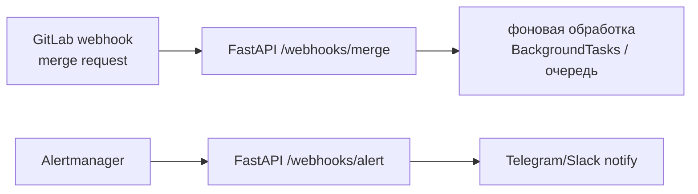

# 🌐 08. Python: FastAPI для Платформенных Сервисов

## 🎯 Где FastAPI в DevOps-мире

Не пользовательские веб-приложения, а: webhook-приёмники (GitLab/Grafana/Alertmanager), внутренние API платформы (обёртки над K8s/Vault), health/metrics-эндпоинты операторов, callback-сервисы CI.



## ⚙️ Минимальный сервис с типизацией и валидацией

```python
from fastapi import FastAPI, HTTPException, BackgroundTasks, Request, status
from pydantic import BaseModel, Field
import hmac, hashlib

app = FastAPI(title="Deploy Trigger API", version="1.0")

class MergeEvent(BaseModel):
    object_kind: str
    project: dict
    object_attributes: dict = Field(..., alias="object_attributes")

@app.post("/webhooks/gitlab", status_code=status.HTTP_202_ACCEPTED)
async def gitlab_webhook(
    request: Request,
    event: MergeEvent,
    background: BackgroundTasks,
    x_gitlab_token: str = Header(),
):
    verify_token(x_gitlab_token)                       # секрет из ENV!
    if event.object_kind != "merge_request":
        return {"ignored": event.object_kind}
    background.add_task(process_merge, event.model_dump())   # ответ сразу, работа потом
    return {"queued": True}

def process_merge(evt: dict) -> None:
    ...  # тяжёлое: вызов ArgoCD API, обновление манифестов

@app.get("/healthz")
async def healthz():
    return {"status": "ok"}
```

Ключевое: **async-обработчики + Pydantic-валидация тела** = невалидный payload отбивается 422 до вашей логики; `alias` принимает snake/camel без ручных преобразований.

## 🔐 Аутентификация webhook'ов

```python
import os, time

def verify_token(token: str) -> None:
    if not hmac.compare_digest(token, os.environ["GITLAB_WEBHOOK_TOKEN"]):
        raise HTTPException(status_code=401, detail="bad token")
        # compare_digest — constant-time, против timing-атак. НЕ == !

# Подпись GitHub-style: X-Hub-Signature-256 = sha256 HMAC тела секретом
def verify_signature(body: bytes, sig_header: str) -> None:
    expected = "sha256=" + hmac.new(os.environ["SECRET"].encode(), body, hashlib.sha256).hexdigest()
    if not hmac.compare_digest(expected, sig_header):
        raise HTTPException(401, "invalid signature")
```

Плюс защита от replay: проверка заголовка `X-Gitlab-Event-UUID`/timestamp на свежесть.

## 🧵 Фоновые задачи vs очередь

| Механизм | Гарантии | Когда |
|---|---|---|
| `BackgroundTasks` | in-process, теряются при рестарте | быстрые действия, потеря некритична |
| ARQ/Dramatiq/Celery + Redis/RabbitMQ | персистентность, ретраи | обязательная доставка |
| Kafka | лог событий, реплей | аудит/интеграции |

Webhook-обработчики должны отвечать **быстро** (<5 сек, иначе отправитель отменит соединение): принять → ACK → обработать асинхронно.

## 📊 Observability из коробки

```python
from prometheus_client import Counter, Histogram, make_asgi_app
import time

REQUESTS = Counter("api_requests_total", "HTTP requests", ["method", "path", "code"])
LATENCY = Histogram("api_latency_seconds", "Latency", ["path"])

@app.middleware("http")
async def metrics_middleware(request: Request, call_next):
    start = time.perf_counter()
    response = await call_next(request)
    path = request.scope.get("route").path if "route" in request.scope else request.url.path
    REQUESTS.labels(request.method, path, response.status_code).inc()
    LATENCY.labels(path).observe(time.perf_counter() - start)
    return response

app.mount("/metrics", make_asgi_app())     # Prometheus endpoint

# Структурированные JSON-логи (для Loki/ELK): structlog или python-json-logger
```

Graceful shutdown: uvicorn сам дождётся завершения in-flight запросов (`--timeout-graceful-shutdown 30`); фоновые задачи — только через внешнюю очередь, иначе рестарт их убивает.

## 🧪 Тесты и деплой

```python
from fastapi.testclient import TestClient   # sync, без сети
client = TestClient(app)

def test_webhook_rejects_bad_token(monkeypatch):
    monkeypatch.setenv("GITLAB_WEBHOOK_TOKEN", "real")
    r = client.post("/webhooks/gitlab", headers={"x-gitlab-token": "wrong"}, json={...})
    assert r.status_code == 401

def test_webhook_queues_work(mocker):
    task = mocker.patch("main.process_merge")
    r = client.post("/webhooks/gitlab", headers=ok_headers, json=payload)
    assert r.status_code == 202 and r.json() == {"queued": True}
```

```dockerfile
FROM python:3.12-slim
RUN pip install --no-cache-dir fastapi uvicorn[standard] httpx prometheus-client
COPY app.py /
USER 65534:65534
CMD ["uvicorn", "app:app", "--host", "0.0.0.0", "--port", "8080", \
     "--workers", "2", "--proxy-headers", "--timeout-graceful-shutdown", "30"]
```

За Ingress — rate-limit; за LB — healthcheck на `/healthz`; readiness отличать от liveness (readiness проверяет зависимости, liveness — только живость процесса).

## ❓ Пять вопросов для самопроверки

---


## ✅ Проверь себя

> Отвечай вслух до раскрытия ответа. Если «не помню» — вернись к разделу.


**В1. Почему webhook-эндпоинт обязан отвечать быстро и как это обеспечить?**
<details><summary>Ответ</summary>
Отправитель (GitLab/Alertmanager) держит таймаут ~10 сек и может считать доставку неудачной при медленной обработке, ретраями создавая дубликаты. Паттерн: валидировать+ACK мгновенно, работу уносить в BackgroundTasks/очередь.
</details>

**В2. Чем `hmac.compare_digest` лучше обычного `==` для проверки токенов?**
<details><summary>Ответ</summary>
== сравнивает байты до первого расхождения — время ответа утечёт длину совпадающего префикса (timing attack), позволяя подобрать токен по символам. compare_digest выполняется за константное время независимо от позиции несовпадения.
</details>

**В3. Что произойдёт с BackgroundTasks при рестарте pod'а?**
<details><summary>Ответ</summary>
Они умрут вместе с процессом — гарантий нет. Для критичных операций (деплой, начисления) нужна внешняя очередь с персистентностью и ретраями (Redis/RabbitMQ); BackgroundTasks годятся для «best effort» вроде кэш-инвалидации.
</details>

**В4. Зачем middleware собирает метрики по route.path, а не по request.url.path?**
<details><summary>Ответ</summary>
URL содержит конкретные id (/deploys/web-123) — кардинальность меток взорвёт Prometheus. Route-паттерн (/deploys/{name}) даёт ограниченный набор серий. Правило метрик: никаких user-specific значений в labels.
</details>

**В5. Чем readiness отличается от liveness в контексте FastAPI-сервиса?**
<details><summary>Ответ</summary>
Liveness — «процесс жив» (дешёвая проверка, падение = рестарт). Readiness — «могу принимать трафик»: включает проверку зависимостей (БД, Redis). Если БД лежит, liveness оставляет под живым (не рестартует зря), а readiness выводит его из балансировки.
</details>

---

*Что дальше:* [09. Boto3 и AWS SDK deep](09-python-boto3-moto-deep.md) · [07. Kopf-операторы](07-python-kubernetes-kopf-operators.md)
