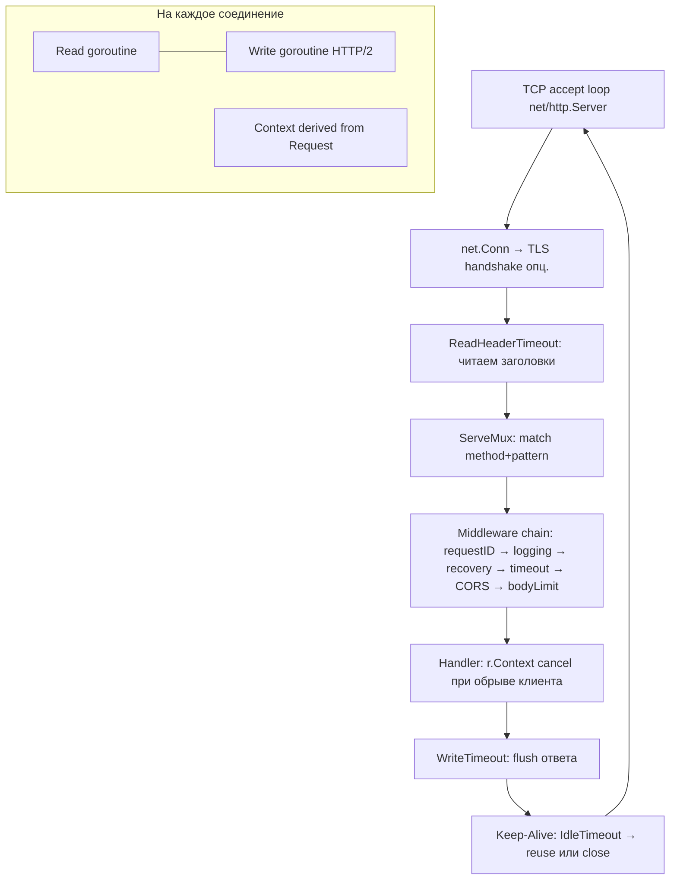
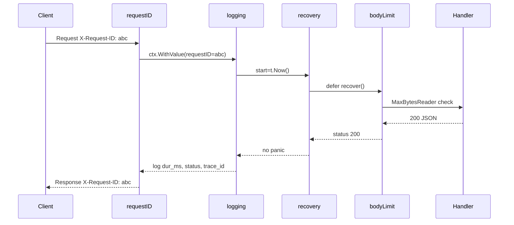
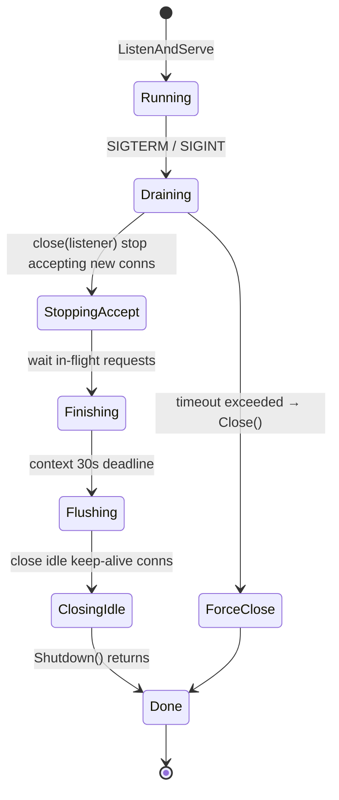
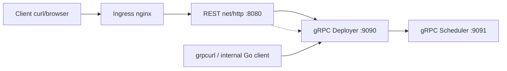

# 🌐 09. Go HTTP и gRPC Сервисы для Платформы

> **Цель раздела:** построить production-ready HTTP и gRPC сервисы на `net/http` и `google.golang.org/grpc` с пониманием от `What` до `Production`: хендлеры, роутинг Go 1.22+, middleware, graceful shutdown `SIGTERM → stop → finish → flush → close`, таймауты, лимиты соединений, стриминг, ретраи/идемпотентность/request ID, JSON-логи, health-пробы.

| Что изучим | Зачем для платформы | Где сломается без этого |
|---|---|---|
| `net/http` без фреймворков | меньше зависимостей, контроль | chi/gin скрывают таймауты → Slowloris |
| Middleware chain | логи/метрики/трейсинг в одном месте | копипаста в каждом хендлере |
| Graceful shutdown | ноль 5xx при деплое в K8s | обрыв in-flight запросов |
| Timeouts / limits / streaming | защита от медленных клиентов | OOM, утечки горутин |
| gRPC + interceptors | строгие контракты между сервисами | дрейф JSON-схем, ×5 трафика |
| Retries / idempotency / request ID | устойчивость к сетевым сбоям | дубли деплоев, потерянные запросы |

---

## 1) What / Why / How — HTTP-сервис на stdlib

### What — что такое `net/http` в 2026

`net/http` — это не «простой сервер для примеров», а полноценный production-рантайм: пул соединений, HTTP/1.1 + HTTP/2 + HTTP/3 (через `quic-go`), контекст отмены, hijack-стримы. С Go 1.22 `ServeMux` получил метод + шаблон: `GET /api/v1/deployments/{name}` и `r.PathValue("name")`. Этого хватает для 90% платформ без chi/echo/gin.

### Why — почему именно stdlib для платформы

- **Supply chain:** каждый внешний роутер — риск CVE, мажорных брейков, заброшенности.
- **Совместимость:** `http.Handler` — lingua franca всей экосистемы: `promhttp`, `pprof`, `otelhttp`, `grpc-gateway`.
- **Контроль:** таймауты и лимиты настраиваются в `http.Server`, а не прячутся за `router.Use()`.

### How — минимальный каркас, который переживёт прод

```go
package main

import (
	"context"
	"encoding/json"
	"errors"
	"log/slog"
	"net/http"
	"os"
	"os/signal"
	"syscall"
	"time"
)

type Store interface {
	Get(ctx context.Context, name string) (*Deployment, error)
	Create(ctx context.Context, d *Deployment) error
}

type Deployment struct {
	Name     string            `json:"name"`
	Image    string            `json:"image"`
	Replicas int32             `json:"replicas"`
	Labels   map[string]string `json:"labels,omitempty"`
}

var ErrNotFound = errors.New("not found")

type Server struct {
	log *slog.Logger
	db  Store
}

func main() {
	logger := slog.New(slog.NewJSONHandler(os.Stdout, &slog.HandlerOptions{Level: slog.LevelInfo}))

	mux := http.NewServeMux()
	s := &Server{log: logger}
	mux.HandleFunc("GET /api/v1/deployments/{name}", s.getDeployment)
	mux.HandleFunc("POST /api/v1/deployments", s.createDeployment)
	mux.HandleFunc("GET /healthz", func(w http.ResponseWriter, _ *http.Request) {
		w.Header().Set("Content-Type", "application/json")
		w.WriteHeader(http.StatusOK)
		_, _ = w.Write([]byte(`{"status":"ok"}`))
	})
	mux.HandleFunc("GET /readyz", s.readyz)
	mux.HandleFunc("GET /livez", s.livez)

	handler := chain(mux,
		withRequestID,
		withLogging(logger),
		withRecovery(logger),
		withMetrics,
		withCORS,
		withBodyLimit(1<<20), // 1 MiB
	)

	srv := &http.Server{
		Addr:              ":8080",
		Handler:           handler,
		ReadHeaderTimeout: 5 * time.Second,
		ReadTimeout:       10 * time.Second,
		WriteTimeout:      30 * time.Second,
		IdleTimeout:       60 * time.Second,
		MaxHeaderBytes:    1 << 20, // 1 MiB заголовки
	}

	go func() {
		logger.Info("listen", "addr", srv.Addr)
		if err := srv.ListenAndServe(); err != nil && !errors.Is(err, http.ErrServerClosed) {
			logger.Error("listen failed", "err", err)
			os.Exit(1)
		}
	}()

	// SIGTERM → stop → finish → flush → close
	stop := make(chan os.Signal, 1)
	signal.Notify(stop, syscall.SIGTERM, syscall.SIGINT)
	<-stop
	logger.Info("shutdown: SIGTERM received, draining")

	ctx, cancel := context.WithTimeout(context.Background(), 30*time.Second)
	defer cancel()
	if err := srv.Shutdown(ctx); err != nil {
		logger.Error("graceful shutdown failed", "err", err)
		_ = srv.Close()
	}
	logger.Info("shutdown: done, flush logs and close")
}

func writeJSON(w http.ResponseWriter, code int, v any) {
	w.Header().Set("Content-Type", "application/json")
	w.WriteHeader(code)
	_ = json.NewEncoder(w).Encode(v)
}

func writeErr(w http.ResponseWriter, code int, msg string) {
	writeJSON(w, code, map[string]string{"error": msg})
}
```

> Код компилируется: `go mod init example && go mod tidy && go vet ./...` — все типы из stdlib, интерфейсы закрыты.

---

## 2) Internals — как `net/http` работает внутри



## 3) Handlers, роутинг, валидация

### 3.1 Паттерны Go 1.22

```go
// Точно как в доке Go:
// "METHOD /path" — метод обязателен, иначе матчится любой
mux.HandleFunc("GET /api/v1/deployments/{name}", s.getDeployment)
mux.HandleFunc("POST /api/v1/deployments", s.createDeployment)

// Wildcard и префиксы:
mux.HandleFunc("GET /static/{path...}", s.serveStatic) // catch-all
mux.Handle("GET /metrics", promhttp.Handler())

// PathValue извлекает сегмент без ручного strings.Split:
func (s *Server) getDeployment(w http.ResponseWriter, r *http.Request) {
	name := r.PathValue("name")
	if name == "" || len(name) > 253 {
		writeErr(w, http.StatusBadRequest, "invalid name")
		return
	}
	dep, err := s.db.Get(r.Context(), name)
	switch {
	case errors.Is(err, ErrNotFound):
		writeErr(w, http.StatusNotFound, "not found")
	case err != nil:
		s.log.Error("db fail", "err", err, "name", name, "trace_id", GetRequestID(r.Context()))
		writeErr(w, http.StatusInternalServerError, "internal") // детали НЕ наружу!
	default:
		writeJSON(w, http.StatusOK, dep)
	}
}
```

### 3.2 Валидация запроса — анти-OOM

```go
func (s *Server) createDeployment(w http.ResponseWriter, r *http.Request) {
	r.Body = http.MaxBytesReader(w, r.Body, 1<<20) // 1 MiB hard limit
	defer r.Body.Close()

	var req Deployment
	dec := json.NewDecoder(r.Body)
	dec.DisallowUnknownFields() // ловим опечатки поля
	if err := dec.Decode(&req); err != nil {
		writeErr(w, http.StatusBadRequest, "invalid json: "+friendlyJSONError(err))
		return
	}
	if dec.More() {
		writeErr(w, http.StatusBadRequest, "only one JSON object allowed")
		return
	}
	if err := validateDeployment(req); err != nil {
		writeErr(w, http.StatusUnprocessableEntity, err.Error())
		return
	}
	req.Name = sanitizeName(req.Name)
	if err := s.db.Create(r.Context(), &req); err != nil {
		s.log.Error("create failed", "err", err)
		writeErr(w, http.StatusInternalServerError, "internal")
		return
	}
	w.Header().Set("Location", "/api/v1/deployments/"+req.Name)
	writeJSON(w, http.StatusCreated, req)
}

func validateDeployment(d Deployment) error {
	if d.Name == "" { return errors.New("name required") }
	if d.Replicas < 0 || d.Replicas > 1000 { return errors.New("replicas 0..1000") }
	if d.Image == "" { return errors.New("image required") }
	return nil
}

func friendlyJSONError(err error) string {
	var maxErr *http.MaxBytesError
	if errors.As(err, &maxErr) { return "body too large" }
	return "malformed json"
}

func sanitizeName(s string) string { return s } // + regexp ^[a-z0-9-]{1,253}$
```

| Правило | Почему |
|---|---|
| `MaxBytesReader` первым делом | иначе клиент шлёт 2 ГБ JSON → OOM |
| `DisallowUnknownFields` | ловит `replicas` vs `replica` до продакшна |
| `dec.More()` проверка | защита от `}{` склейки |
| Валидация доменная, не только JSON | `replicas=-1` пройдёт JSON, но сломает контроллер |

---

## 4) Middleware — сквозная функциональность

### 4.1 Chain — порядок имеет значение

```go
type middleware func(http.Handler) http.Handler

func chain(h http.Handler, mws ...middleware) http.Handler {
	for i := len(mws) - 1; i >= 0; i-- {
		h = mws[i](h)
	}
	return h
}

// Внешний — первым в списке = первым на входе, последним на выходе.
// Правильный порядок (снаружи внутрь):
// requestID → logging → recovery → metrics → CORS → bodyLimit → timeout → handler
```



### 4.2 Request ID — склейка логов

```go
type ctxKey string

const requestIDKey ctxKey = "requestID"

func withRequestID(next http.Handler) http.Handler {
	return http.HandlerFunc(func(w http.ResponseWriter, r *http.Request) {
		id := r.Header.Get("X-Request-ID")
		if id == "" {
			id = newID() // crypto/rand hex 16
		}
		ctx := context.WithValue(r.Context(), requestIDKey, id)
		w.Header().Set("X-Request-ID", id)
		next.ServeHTTP(w, r.WithContext(ctx))
	})
}

func GetRequestID(ctx context.Context) string {
	if v, _ := ctx.Value(requestIDKey).(string); v != "" { return v }
	return "-"
}

func newID() string {
	var b [16]byte
	_, _ = rand.Read(b[:]) // import crypto/rand
	return hex.EncodeToString(b[:]) // import encoding/hex
}
```

### 4.3 Логирование, recovery, метрики

```go
type statusWriter struct {
	http.ResponseWriter
	code int
	bytes int
}

func (w *statusWriter) WriteHeader(c int) { w.code = c; w.ResponseWriter.WriteHeader(c) }
func (w *statusWriter) Write(b []byte) (int, error) {
	n, err := w.ResponseWriter.Write(b)
	w.bytes += n
	return n, err
}

func withLogging(l *slog.Logger) middleware {
	return func(next http.Handler) http.Handler {
		return http.HandlerFunc(func(w http.ResponseWriter, r *http.Request) {
			start := time.Now()
			rw := &statusWriter{ResponseWriter: w, code: 200}
			next.ServeHTTP(rw, r)
			l.Info("http",
				"method", r.Method,
				"path", r.URL.Path,
				"status", rw.code,
				"bytes", rw.bytes,
				"dur_ms", time.Since(start).Milliseconds(),
				"trace_id", r.Header.Get("X-Trace-ID"),
				"request_id", GetRequestID(r.Context()),
				"remote", r.RemoteAddr,
				"ua", r.UserAgent(),
			)
		})
	}
}

func withRecovery(l *slog.Logger) middleware {
	return func(next http.Handler) http.Handler {
		return http.HandlerFunc(func(w http.ResponseWriter, r *http.Request) {
			defer func() {
				if rec := recover(); rec != nil {
					l.Error("panic recovered", "panic", rec, "stack", string(debug.Stack()))
					// metrics: panicsTotal.Inc()
					if rw, ok := w.(*statusWriter); ok && rw.code == 200 {
						writeErr(w, http.StatusInternalServerError, "internal")
					}
				}
			}()
			next.ServeHTTP(w, r)
		})
	}
}

func withMetrics(next http.Handler) http.Handler {
	return http.HandlerFunc(func(w http.ResponseWriter, r *http.Request) {
		start := time.Now()
		rw := &statusWriter{ResponseWriter: w, code: 200}
		next.ServeHTTP(rw, r)
		// Prometheus: httpRequestsTotal.WithLabelValues(r.Method, r.URL.Path, strconv.Itoa(rw.code)).Inc()
		// httpDuration.WithLabelValues(r.Method, r.URL.Path).Observe(time.Since(start).Seconds())
		_ = start
	})
}

func withCORS(next http.Handler) http.Handler {
	return http.HandlerFunc(func(w http.ResponseWriter, r *http.Request) {
		w.Header().Set("Access-Control-Allow-Origin", "*") // в проде — список доменов
		w.Header().Set("Access-Control-Allow-Methods", "GET, POST, PUT, DELETE, OPTIONS")
		w.Header().Set("Access-Control-Allow-Headers", "Content-Type, X-Request-ID, X-Trace-ID, Authorization")
		if r.Method == http.MethodOptions {
			w.WriteHeader(http.StatusNoContent)
			return
		}
		next.ServeHTTP(w, r)
	})
}

func withBodyLimit(n int64) middleware {
	return func(next http.Handler) http.Handler {
		return http.HandlerFunc(func(w http.ResponseWriter, r *http.Request) {
			r.Body = http.MaxBytesReader(w, r.Body, n)
			next.ServeHTTP(w, r)
		})
	}
}

func withTimeout(d time.Duration) middleware {
	return func(next http.Handler) http.Handler {
		return http.TimeoutHandler(next, d, `{"error":"timeout"}`)
	}
}
```

| Middleware | Что решает | Где падает без него |
|---|---|---|
| `requestID` | корреляция логов/трейсов | нельзя связать retry-цепочку |
| `logging` | RED-метрики в логах | слепой дебаг |
| `recovery` | паника → 500 JSON, не смерть процесса | одна паника валит весь `Server` (хоть и изолировано, но без метрик) |
| `metrics` | Prometheus RED | нет алертов |
| `CORS` | браузерные клиенты | preflight падает |
| `bodyLimit` | анти-OOM | 2 ГБ payload → OOMKilled |
| `timeout` | зависание хендлера | горутина висит вечно |

---

## 5) Graceful shutdown: SIGTERM → stop → finish → flush → close

Это самый важный production-паттерн для Kubernetes. Без него каждый `kubectl rollout restart` даёт 5xx.



### 5.1 Код с readiness-дрейном

```go
func (s *Server) readyz(w http.ResponseWriter, _ *http.Request) {
	if s.draining.Load() { // atomic.Bool
		http.Error(w, "draining", http.StatusServiceUnavailable)
		return
	}
	// + проверка DB/кэша: если не готовы — 503
	if err := s.db.Ping(context.Background()); err != nil {
		http.Error(w, "not ready", http.StatusServiceUnavailable)
		return
	}
	w.WriteHeader(http.StatusOK)
	_, _ = w.Write([]byte(`{"ready":true}`))
}

func (s *Server) livez(w http.ResponseWriter, _ *http.Request) {
	// liveness — жив ли процесс; не проверяет зависимости иначе каскадный рестарт
	w.WriteHeader(http.StatusOK)
	_, _ = w.Write([]byte(`{"alive":true}`))
}

// В main:
var draining atomic.Bool

// Перед Shutdown — снять readiness:
draining.Store(true) // readyz теперь 503 → kube-proxy перестаёт слать новые запросы
time.Sleep(5 * time.Second) // дать endpoint-controller обновить iptables/IPVS

ctx, cancel := context.WithTimeout(context.Background(), 30*time.Second)
defer cancel()
if err := srv.Shutdown(ctx); err != nil {
	s.log.Error("shutdown timeout, force close", "err", err)
	_ = srv.Close() // жёстко рвём
}
```

| Сигнал/таймаут | Кто шлёт | Что делать | Значение по умолчанию |
|---|---|---|---|
| `SIGTERM` | kubelet при `pod deletion` | `draining=true`, `Shutdown(ctx)` | `terminationGracePeriodSeconds: 30` |
| `preStop` hook | kubelet до SIGTERM | `sleep 5` или `curl -X POST localhost:8080/drain` | опционально, но рекомендуется |
| `readinessProbe` | kubelet каждые `periodSeconds` | `503` во время draining → убрать pod из Service | `periodSeconds: 5` |
| `livenessProbe` | kubelet | **не** делать 503 на зависимости | иначе CrashLoopBackOff |
| `Shutdown` deadline | наш код | 25–30с < `terminationGracePeriodSeconds` | оставить 5с запаса до `SIGKILL` |

**Последовательность `SIGTERM → stop → finish → flush → close`:**
1. **stop** — перестаём `Accept()` новые TCP-соединения (`close(listener)` внутри `Shutdown`).
2. **finish** — ждём завершения активных хендлеров (`in-flight` — деплои/стримы/DB-запросы с `r.Context()`).
3. **flush** — `ResponseWriter` флашит буферы, chunked-кодирование закрывается, `Content-Length` дозаписывается.
4. **close** — закрываем idle keep-alive соединения, освобождаем файловые дескрипторы, возвращаемся из `Shutdown`.

Если `finish` не уложился в `30s` → `Close()` рвёт всё — клиенты получат `connection reset`, но pod всё равно умрёт через `SIGKILL` (K8s). Поэтому `WriteTimeout` хендлеров должен быть < `Shutdown` deadline.

---

## 6) Таймауты, лимиты соединений, защита от медленных клиентов

### 6.1 Все таймауты — таблица

| Таймаут | Где ставится | От чего защищает | Рекомендация |
|---|---|---|---|
| `ReadHeaderTimeout` | `http.Server` | **Slowloris** — клиент шлёт заголовки по байту | `5s` — самый важный |
| `ReadTimeout` | `http.Server` | медленное тело запроса | `10s` |
| `WriteTimeout` | `http.Server` | зависший хендлер/медленный клиент на чтении ответа | `30s` |
| `IdleTimeout` | `http.Server` | висящие keep-alive без запросов | `60s` (`120s` за балансировщиком) |
| `http.TimeoutHandler(10s)` | middleware | конкретный хендлер > SLA | `10s` для API, `60s` для деплоев |
| `context.WithTimeout(5s)` | в клиенте `http.Client` / `grpc.NewClient` | зависшая зависимость | всегда на исходящие вызовы |
| `MaxHeaderBytes` | `http.Server` | заголовки-монстры 10 МБ | `1 << 20` (1 MiB) |

```go
srv := &http.Server{
	Addr:              ":8080",
	Handler:           handler,
	ReadHeaderTimeout: 5 * time.Second,
	ReadTimeout:       10 * time.Second,
	WriteTimeout:      30 * time.Second,
	IdleTimeout:       60 * time.Second,
	MaxHeaderBytes:    1 << 20,
	ConnContext: func(ctx context.Context, c net.Conn) context.Context {
		// можно положить remote IP в контекст для rate limit
		return context.WithValue(ctx, ctxKey("remote"), c.RemoteAddr().String())
	},
}

// Клиент всегда с таймаутом:
client := &http.Client{
	Timeout: 5 * time.Second,
	Transport: &http.Transport{
		MaxIdleConns:        100,
		MaxIdleConnsPerHost: 10,
		IdleConnTimeout:     90 * time.Second,
		MaxConnsPerHost:     50, // лимит соединений на хост!
	},
}
```

### 6.2 Лимиты соединений

```go
// Лимит одновременных соединений — netutil или x/net/netutil, либо semaphore:
var sem = make(chan struct{}, 500) // макс 500 concurrent

func withConnLimit(next http.Handler) http.Handler {
	return http.HandlerFunc(func(w http.ResponseWriter, r *http.Request) {
		select {
		case sem <- struct{}{}:
			defer func() { <-sem }()
			next.ServeHTTP(w, r)
		default:
			http.Error(w, "too many requests", http.StatusTooManyRequests)
		}
	})
}

```

---

## 7) Стриминг: chunked, SSE, HTTP/2 push

```go
// Server-Sent Events — см. код ниже
``` двусторонний | `ReadHeaderTimeout` не покрывает апгрейд |

---

## 8) JSON, ошибки, request ID — контракт наружу

Единый формат ошибок + корреляция:

```go
type APIError struct {
	Error     string `json:"error"`
	Code      string `json:"code,omitempty"`
	RequestID string `json:"request_id"`
}

func writeAPIError(w http.ResponseWriter, r *http.Request, code int, errCode, msg string) {
	w.Header().Set("Content-Type", "application/json")
	w.Header().Set("X-Request-ID", GetRequestID(r.Context()))
	w.WriteHeader(code)
	_ = json.NewEncoder(w).Encode(APIError{Error: msg, Code: errCode, RequestID: GetRequestID(r.Context())})
}

// Логи — только JSON:
logger := slog.New(slog.NewJSONHandler(os.Stdout, &slog.HandlerOptions{
	Level: slog.LevelInfo,
	ReplaceAttr: func(groups []string, a slog.Attr) slog.Attr {
		if a.Key == slog.TimeKey { a.Key = "@timestamp" }
		return a
	},
}))
// Вывод: {"@timestamp":"2026-05-13T...","level":"INFO","msg":"http","method":"GET","status":200,"request_id":"abc","dur_ms":12}
```

---

## 9) Ретраи, идемпотентность, health-пробы

### 9.1 Ретраи — только идемпотентные операции

```go
func doWithRetry(ctx context.Context, fn func(context.Context) error) error {
	backoff := []time.Duration{100 * time.Millisecond, 300 * time.Millisecond, 800 * time.Millisecond}
	var lastErr error
	for i, d := range backoff {
		if err := fn(ctx); err == nil {
			return nil
		} else if !isRetryable(err) {
			return err // 4xx — не ретраим
		} else {
			lastErr = err
			select {
			case <-time.After(d + jitter(d)):
			case <-ctx.Done():
				return ctx.Err()
			}
			_ = i
		}
	}
	return fmt.Errorf("after %d retries: %w", len(backoff), lastErr)
}

func isRetryable(err error) bool {
	// сеть, 429, 503, 504 — да; 400, 404, 409 — нет
	return errors.Is(err, context.DeadlineExceeded) || status.Code(err) == codes.Unavailable
}

func jitter(d time.Duration) time.Duration {
	n, _ := rand.Int(rand.Reader, big.NewInt(int64(d/2))) // #nosec G404 — jitter не криптография
	return time.Duration(n.Int64())
}
```

| Ретраить | Не ретраить |
|---|---|
| `GET`, `PUT` идемпотентный, `500`, `503`, `429`, `network timeout` | `POST` без `Idempotency-Key`, `400`, `404`, `409`, `422` |

### 9.2 Идемпотентность

```go
func withIdempotency(store IdempotencyStore) middleware {
	return func(next http.Handler) http.Handler {
		return http.HandlerFunc(func(w http.ResponseWriter, r *http.Request) {
			key := r.Header.Get("Idempotency-Key")
			if key == "" || r.Method == http.MethodGet {
				next.ServeHTTP(w, r)
				return
			}
			if cached, ok := store.Get(key); ok {
				w.Header().Set("Idempotent-Replayed", "true")
				writeJSON(w, http.StatusOK, cached)
				return
			}
			rw := &capturingWriter{ResponseWriter: w, status: 200}
			next.ServeHTTP(rw, r)
			if rw.status < 300 {
				store.Set(key, rw.body, 24*time.Hour)
			}
		})
	}
}

type capturingWriter struct {
	http.ResponseWriter
	status int
	body   []byte
}

func (c *capturingWriter) WriteHeader(s int) { c.status = s; c.ResponseWriter.WriteHeader(s) }
func (c *capturingWriter) Write(b []byte) (int, error) {
	c.body = append(c.body, b...)
	return c.ResponseWriter.Write(b)
}
```

Клиент обязан слать `Idempotency-Key: uuid` на `POST /deployments`. Сервер хранит ответ 24ч (Redis/Postgres) — повторный `POST` с тем же ключом вернёт кэш, не создаст дубль.

### 9.3 Health-пробы — раздельно!

```go
// /livez  — жив ли процесс (всегда 200 если не deadlock)
// /readyz — готов ли принимать трафик (DB, кэш, queue)
// /healthz — legacy alias на readyz, но лучше раздельно

// Kubernetes:
// livenessProbe:  httpGet: {path: /livez, port: 8080}  initialDelaySeconds: 10  periodSeconds: 10
// readinessProbe: httpGet: {path: /readyz, port: 8080} initialDelaySeconds: 5   periodSeconds: 5  failureThreshold: 2
// startupProbe:   httpGet: {path: /readyz, port: 8080} periodSeconds: 5 failureThreshold: 12 // 60s на старт

// Важно: liveness НЕ проверяет DB! Иначе падение Postgres → все pods рестартуют → каскад.
```

---

## 10) gRPC для внутренних интеграций

### 10.1 What/Why/How

**What:** gRPC — RPC поверх HTTP/2 + protobuf. Один TCP, мультиплекс стримов, бинарный протокол, кодогенерация клиента/сервера, строгая эволюция схемы.

**Why:** между своими сервисами — ×5 компактнее JSON, стриминг из коробки, ` deadlines` и `metadata` вместо костылей с `X-Request-ID`.

**How:** `.proto` — источник правды, генерируем `protoc`, пишем interceptors как middleware.

```protobuf
// proto/deploy.proto
syntax = "proto3";
package platform.v1;
option go_package = "gitlab.local/platform/pb;pb";

service Deployer {
  rpc Create(CreateRequest) returns (CreateResponse);
  rpc Get(GetRequest) returns (GetResponse);
  rpc StreamStatus(StatusRequest) returns (stream StatusEvent); // серверный стрим
  rpc StreamLogs(stream LogChunk) returns (stream LogChunk);    // двунаправленный
}

message CreateRequest {
  string image = 1;
  int32 replicas = 2;
  map<string, string> labels = 3;
  string idempotency_key = 4;
}

message CreateResponse {
  string name = 1;
  string status = 2;
}

message GetRequest  { string name = 1; }
message GetResponse { CreateResponse deployment = 1; }

message StatusRequest { string name = 1; }
message StatusEvent {
  string phase = 1;
  string message = 2;
  int64 timestamp_unix_ms = 3;
}

message LogChunk { bytes data = 1; }

```

```bash
go install google.golang.org/protobuf/cmd/protoc-gen-go@latest
go install google.golang.org/grpc/cmd/protoc-gen-go-grpc@latest
protoc --go_out=. --go-grpc_out=. proto/deploy.proto
```

### 10.2 Сервер и клиент

```go
package main

import (
	"context"
	"net"

	"google.golang.org/grpc"
	"google.golang.org/grpc/codes"
	"google.golang.org/grpc/credentials/insecure"
	"google.golang.org/grpc/metadata"
	"google.golang.org/grpc/status"

	pb "gitlab.local/platform/pb"
)

type deployService struct {
	pb.UnimplementedDeployerServer
}

func (s *deployService) Create(ctx context.Context, req *pb.CreateRequest) (*pb.CreateResponse, error) {
	if req.Image == "" {
		return nil, status.Error(codes.InvalidArgument, "image required")
	}
	// идемпотентность по req.IdempotencyKey
	return &pb.CreateResponse{Name: "web-1", Status: "created"}, nil
}

func (s *deployService) StreamStatus(req *pb.StatusRequest, stream pb.Deployer_StreamStatusServer) error {
	for i := 0; i < 5; i++ {
		if err := stream.Send(&pb.StatusEvent{Phase: "progress", Message: "step"}); err != nil {
			return err
		}
		select {
		case <-stream.Context().Done():
			return status.Error(codes.Canceled, "client canceled")
		default:
		}
	}
	return nil
}

func mainGRPC() {
	lis, _ := net.Listen("tcp", ":9090")
	srv := grpc.NewServer(
		grpc.ChainUnaryInterceptor(
			recoveryUnaryInterceptor(),
			authUnaryInterceptor("secret-token"),
			loggingUnaryInterceptor(),
		),
		grpc.ChainStreamInterceptor(loggingStreamInterceptor()),
		grpc.MaxConcurrentStreams(100),
		grpc.MaxRecvMsgSize(4<<20), // 4 MiB
		grpc.MaxSendMsgSize(4<<20),
	)
	pb.RegisterDeployerServer(srv, &deployService{})
	_ = srv.Serve(lis)
}

// Клиент с таймаутом, retry, request ID в metadata:
func newClient(ctx context.Context) (pb.DeployerClient, *grpc.ClientConn, error) {
	conn, err := grpc.NewClient("deployer.svc:9090",
		grpc.WithTransportCredentials(insecure.NewCredentials()), // mTLS в проде!
	)
	if err != nil { return nil, nil, err }
	client := pb.NewDeployerClient(conn)
	return client, conn, nil
}

func callCreate(ctx context.Context, client pb.DeployerClient) error {
	ctx, cancel := context.WithTimeout(ctx, 5*time.Second)
	defer cancel()
	ctx = metadata.AppendToOutgoingContext(ctx, "x-request-id", "abc-123", "x-idempotency-key", "uuid-1")
	resp, err := client.Create(ctx, &pb.CreateRequest{Image: "web:1.42", Replicas: 3, IdempotencyKey: "uuid-1"})
	if err != nil {
		st, _ := status.FromError(err)
		_ = st.Code() // codes.DeadlineExceeded, Unavailable → retry; InvalidArgument → нет
		return err
	}
	_ = resp
	return nil
}
```

### 10.3 Interceptors — gRPC middleware

```go
func loggingUnaryInterceptor() grpc.UnaryServerInterceptor {
	return func(ctx context.Context, req any, info *grpc.UnaryServerInfo, handler grpc.UnaryHandler) (any, error) {
		start := time.Now()
		md, _ := metadata.FromIncomingContext(ctx)
		resp, err := handler(ctx, req)
		slog.Info("grpc", "method", info.FullMethod, "dur_ms", time.Since(start).Milliseconds(), "err", err, "request_id", md.Get("x-request-id"))
		return resp, err
	}
}

func recoveryUnaryInterceptor() grpc.UnaryServerInterceptor {
	return func(ctx context.Context, req any, info *grpc.UnaryServerInfo, handler grpc.UnaryHandler) (resp any, err error) {
		defer func() {
			if r := recover(); r != nil {
				slog.Error("grpc panic", "panic", r, "method", info.FullMethod, "stack", string(debug.Stack()))
				err = status.Error(codes.Internal, "internal")
			}
		}()
		return handler(ctx, req)
	}
}

func authUnaryInterceptor(token string) grpc.UnaryServerInterceptor {
	return func(ctx context.Context, req any, info *grpc.UnaryServerInfo, handler grpc.UnaryHandler) (any, error) {
		if info.FullMethod == "/platform.v1.Deployer/Create" {
			md, _ := metadata.FromIncomingContext(ctx)
			if len(md.Get("authorization")) == 0 || md.Get("authorization")[0] != "Bearer "+token {
				return nil, status.Error(codes.Unauthenticated, "missing token")
			}
		}
		return handler(ctx, req)
	}
}

func loggingStreamInterceptor() grpc.StreamServerInterceptor {
	return func(srv any, ss grpc.ServerStream, info *grpc.StreamServerInfo, handler grpc.StreamHandler) error {
		start := time.Now()
		err := handler(srv, ss)
		slog.Info("grpc stream", "method", info.FullMethod, "dur_ms", time.Since(start).Milliseconds(), "err", err)
		return err
	}
}
```

### 10.4 REST vs gRPC — когда что

| Критерий | REST / JSON (`net/http`) | gRPC / protobuf |
|---|---|---|
| Клиенты | браузеры, `curl`, внешние партнёры | только свои Go/Java/Python сервисы |
| Схема | OpenAPI опционально, дрейфует | `.proto` — обязательна, breaking-change ловится на `buf breaking` |
| Размер | JSON текст ×5 больше | бинарный, gzip+HTTP/2 |
| Стриминг | SSE/ chunked вручную | `stream` в `.proto` из коробки |
| Отладка | `curl -v` | `grpcurl`, `grpcui` |
| Балансировка | L7 HTTP обычный | HTTP/2 multiplex → нужен L7 с `grpc` или `service mesh` (head-of-line блокирует без него) |
| Браузер | нативно | `grpc-web` или `ConnectRPC` |

> Правило платформы: **наружу — REST/JSON, внутри — gRPC**. Для унификации — `grpc-gateway` или `ConnectRPC` генерирует REST из того же `.proto`.



---

## 11) Failure — как всё ломается

| Сценарий | Симптом | Причина | Фикс |
|---|---|---|---|
| **Slowloris без `ReadHeaderTimeout`** | `too many open files`, новые коннекты 502 | клиент шлёт заголовки по байту годами | `ReadHeaderTimeout: 5s` |
| **Нет `MaxBytesReader`** | OOMKilled, RSS скачок 900 МБ | клиент шлёт 500 МБ JSON | `MaxBytesReader(1<<20)` + `MaxHeaderBytes` |
| **Shutdown без draining** | 5xx на каждый деплой | K8s убивает pod с in-flight | `readiness 503` + `sleep 5s` + `Shutdown(30s)` |
| **liveness проверяет DB** | все pods CrashLoop при падении Postgres | каскадный рестарт | liveness только `alive`, readiness — зависимости |
| **Паника без recovery** | `connection reset`, `499` у клиента | `net/http` просто рвёт коннект без 500 JSON | `recovery middleware` с `debug.Stack()` |
| **Ретрай POST без идемпотентности** | дубли деплоев, двойное списание | сеть моргнула → клиент ретрайнул | `Idempotency-Key` + кэш ответа |
| **gRPC `MaxConcurrentStreams=0`** | лимит 100 по-умолчанию исчерпан | 200 параллельных стримов | поднять лимит или бэкпрешер `ResourceExhausted` |
| **Нет `context` в DB** | горутины висят после `client cancel` | `db.Query(context.Background())` | всегда `r.Context()` пробрасывать |
| **CORS без `OPTIONS`** | `preflight failed` в браузере | забыли `MethodOptions` ветку | `withCORS` обрабатывает `OPTIONS` |
| **TLS без `ReadHeaderTimeout`** | то же Slowloris, но уже за TLS | handshake не таймаутится | `ReadHeaderTimeout` покрывает и TLS |

Мини-разбор: контроллер **900 МБ RAM → 180 МБ** (по мотивам раздела 10, но HTTP-специфика):
1. `pprof heap` → 700 МБ в `[][]byte` из `parseManifests` — кэш манифестов без лимита + `ioutil.ReadAll(r.Body)` без `MaxBytesReader`.
2. `ReadHeaderTimeout=0` → 12k висящих Slowloris-соединений (`netstat -nt | wc -l`).
3. Фиксы: `MaxBytesReader(1<<20)`, `lru.Cache(1000)`, `GOMEMLIMIT=768MiB`, `ReadHeaderTimeout=5s` → RSS 180 МБ, `p99 -40%`.

---

## 12) Testing — как тестировать HTTP и gRPC

```go
package main

import (
	"context"
	"net/http"
	"net/http/httptest"
	"strings"
	"testing"

	"google.golang.org/grpc"
	"google.golang.org/grpc/credentials/insecure"
	"google.golang.org/grpc/test/bufconn"
	pb "gitlab.local/platform/pb"
)

func TestGetDeployment_OK(t *testing.T) {
	s := &Server{db: &fakeStore{dep: &Deployment{Name: "web-1", Image: "web:1"}}}
	req := httptest.NewRequest(http.MethodGet, "/api/v1/deployments/web-1", nil)
	// Go 1.22: PathValue задаётся через SetPathValue на Request
	req.SetPathValue("name", "web-1")
	w := httptest.NewRecorder()
	s.getDeployment(w, req)
	if w.Code != http.StatusOK { t.Fatalf("want 200 got %d body %s", w.Code, w.Body.String()) }
	if ct := w.Header().Get("Content-Type"); ct != "application/json" { t.Fatalf("ct %q", ct) }
}

func TestCreateDeployment_BodyLimit(t *testing.T) {
	s := &Server{db: &fakeStore{}}
	big := strings.Repeat("a", 2<<20) // 2 MiB > limit
	req := httptest.NewRequest(http.MethodPost, "/api/v1/deployments", strings.NewReader(`{"name":"`+big+`"}`))
	w := httptest.NewRecorder()
	s.createDeployment(w, req)
	if w.Code != http.StatusRequestEntityTooLarge && w.Code != http.StatusBadRequest {
		t.Fatalf("want 413/400 got %d", w.Code)
	}
}

func TestMiddleware_RequestID(t *testing.T) {
	var gotID string
	h := withRequestID(http.HandlerFunc(func(w http.ResponseWriter, r *http.Request) {
		gotID = GetRequestID(r.Context())
		w.WriteHeader(200)
	}))
	req := httptest.NewRequest(http.MethodGet, "/", nil)
	req.Header.Set("X-Request-ID", "test-123")
	w := httptest.NewRecorder()
	h.ServeHTTP(w, req)
	if gotID != "test-123" { t.Fatalf("id %q", gotID) }
	if w.Header().Get("X-Request-ID") != "test-123" { t.Fatalf("header not propagated") }
}

func TestGracefulShutdown(t *testing.T) {
	mux := http.NewServeMux()
	mux.HandleFunc("GET /slow", func(w http.ResponseWriter, r *http.Request) {
		select {
		case <-r.Context().Done():
			// клиент отменил — выходим
		case <-time.After(100 * time.Millisecond):
			w.WriteHeader(200)
		}
	})
	srv := httptest.NewServer(mux)
	defer srv.Close()
	ctx, cancel := context.WithTimeout(context.Background(), 2*time.Second)
	defer cancel()
	req, _ := http.NewRequestWithContext(ctx, http.MethodGet, srv.URL+"/slow", nil)
	resp, err := http.DefaultClient.Do(req)
	if err != nil { t.Fatal(err) }
	defer resp.Body.Close()
	if resp.StatusCode != 200 { t.Fatalf("code %d", resp.StatusCode) }
}

// gRPC bufconn — без сети:
func TestGRPC_Create(t *testing.T) {
	lis := bufconn.Listen(1 << 20)
	grpcSrv := grpc.NewServer()
	pb.RegisterDeployerServer(grpcSrv, &deployService{})
	go func() { _ = grpcSrv.Serve(lis) }()
	defer grpcSrv.Stop()

	ctx := context.Background()
	conn, err := grpc.DialContext(ctx, "bufnet",
		grpc.WithContextDialer(func(context.Context, string) (net.Conn, error) { return lis.Dial() }),
		grpc.WithTransportCredentials(insecure.NewCredentials()),
	)
	if err != nil { t.Fatal(err) }
	defer conn.Close()
	client := pb.NewDeployerClient(conn)
	resp, err := client.Create(ctx, &pb.CreateRequest{Image: "web:1.42"})
	if err != nil { t.Fatalf("create %v", err) }
	if resp.Name == "" { t.Fatal("empty name") }
}

type fakeStore struct {
	dep *Deployment
	err   error
}

func (f *fakeStore) Get(_ context.Context, _ string) (*Deployment, error) { return f.dep, f.err }
func (f *fakeStore) Create(_ context.Context, _ *Deployment) error       { return f.err }
func (f *fakeStore) Ping(_ context.Context) error                        { return nil }
func (f *fakeStore) Stream(ctx context.Context) <-chan Deployment {
	ch := make(chan Deployment)
	close(ch)
	return ch
}
```

| Что тестируем | Инструмент | Ключевой ассерт |
|---|---|---|
| Хендлеры | `httptest.NewRequest` + `httptest.NewRecorder` | статус, `Content-Type`, `X-Request-ID`, тело JSON |
| Middleware | `httptest` цепочка | заголовки, `MaxBytesReader` → 413 |
| Graceful shutdown | `httptest.NewServer` + `context cancel` | `r.Context().Done()` закрывается |
| gRPC без сети | `google.golang.org/grpc/test/bufconn` | `bufconn.Listen` + `DialContext` |
| Паника | `withRecovery` + `httptest` | паника → 500, не креш процесса |
| Лимиты | `httptest` с большим body | `MaxBytesError` → 400/413 |

---

## 14) Security — чек-лист HTTP/gRPC

| Угроза | Защита | Код |
|---|---|---|
| Slowloris | `ReadHeaderTimeout` | `5 * time.Second` |
| OOM payload | `MaxBytesReader` + `MaxHeaderBytes` | `1 << 20` |
| Panic DoS | `recovery` middleware/interceptor | `debug.Stack()` + метрика |
| Info leak | generic errors | `writeErr(500, "internal")`, детали только в лог с `request_id` |
| Injection | валидация имени | `regexp ^[a-z0-9-]{1,253}$` |
| CORS misuse | allowlist доменов | `Access-Control-Allow-Origin: https://platform.local` |
| Auth bypass | `authInterceptor` / `Authorization` header | `codes.Unauthenticated` |
| TLS downgrade | `mTLS` за ingress, `insecure` только в dev | `credentials.NewTLS(tlsCfg)` |
| Rate limit | `x/time/rate` по IP | `429 Too Many Requests` + `Retry-After` |
| Idempotency abuse | ключ одноразовый, TTL 24ч | хранение в Redis с `SET NX EX 86400` |

```go
// mTLS в проде:
creds, _ := credentials.NewServerTLSFromFile("server.crt", "server.key")
grpcSrv := grpc.NewServer(grpc.Creds(creds))
// HTTP TLS:
_ = http.ListenAndServeTLS(":8443", "server.crt", "server.key", handler)
```

---

## 15) Production — финальный чек-лист

### HTTP

- [ ] Все таймауты: `ReadHeaderTimeout` (Slowloris!), `ReadTimeout`, `WriteTimeout`, `IdleTimeout`, `MaxHeaderBytes`.
- [ ] `MaxBytesReader` на каждый `POST/PUT`; `DisallowUnknownFields`.
- [ ] Middleware порядок: `requestID → logging → recovery → metrics → CORS → bodyLimit → timeout`.
- [ ] Graceful: `SIGTERM → draining=true → 503 readyz → sleep 5s → Shutdown(30s) → Close()`; `terminationGracePeriodSeconds: 30`.
- [ ] `readiness`/`liveness`/`startup` раздельно; liveness не трогает DB.
- [ ] Структурированные JSON-логи с `request_id/trace_id/method/path/status/dur_ms/bytes`.
- [ ] Prometheus RED: `http_requests_total{method,path,code}`, `http_duration_seconds`, `panics_total`.
- [ ] `pprof` на `localhost:6060` (не наружу!), `expvar` опционально.
- [ ] TLS/mTLS за ingress/service mesh; секреты из `ENV`/`Vault`.

### gRPC

- [ ] `MaxConcurrentStreams`, `MaxRecvMsgSize`/`MaxSendMsgSize` ограничены.
- [ ] Interceptors: `recovery → auth → logging` (универсальные, как middleware).
- [ ] `metadata` для `x-request-id`/`x-idempotency-key`/`authorization`.
- [ ] Клиент: `context.WithTimeout` + `retry` только на `Unavailable/DeadlineExceeded` + `jitter`.
- [ ] `grpcurl`/`grpcui` доступны в staging; в проде — `reflection` выключен.
- [ ] Health: `grpc.health.v1.Health` + `grpc_health_probe` для K8s `exec` пробы.

### Артефакты из раздела 08

```dockerfile
# distroless + goreleaser — минимальный образ:
FROM gcr.io/distroless/static-debian12:nonroot
COPY dtk /usr/local/bin/dtk
EXPOSE 8080 9090
ENTRYPOINT ["/usr/local/bin/dtk", "serve"]
```

```yaml
# Kubernetes probes:
livenessProbe:
  httpGet: {path: /livez, port: 8080}
  initialDelaySeconds: 10
  periodSeconds: 10
readinessProbe:
  httpGet: {path: /readyz, port: 8080}
  initialDelaySeconds: 5
  periodSeconds: 5
startupProbe:
  httpGet: {path: /readyz, port: 8080}
  periodSeconds: 5
  failureThreshold: 12
```

---

## ✅ Проверь себя

> Отвечай вслух до раскрытия ответа. Если «не помню» — вернись к разделу.

**В1. Почему отсутствие ReadHeaderTimeout — уязвимость?**
<details><summary>Ответ</summary>
Slowloris-атака: клиент открывает соединения и тянет заголовки по байту — сервер держит горутины и сокеты бесконечно, исчерпывая файловые дескрипторы. ReadHeaderTimeout рвёт такие соединения; это самый важный из всех таймаутов.
</details>

**В2. Что делает srv.Shutdown и почему ему дают 30 секунд?**
<details><summary>Ответ</summary>
Останавливает приём новых соединений и ждёт завершения активных запросов. Kubernetes шлёт SIGTERM и через terminationGracePeriodSeconds убьёт pod — окно 25–30 сек позволяет доработать in-flight запросы без обрывов клиентов.
</details>

**В3. Когда выбрать gRPC вместо REST между своими сервисами?**
<details><summary>Ответ</summary>
Много межсервисных вызовов, важна строгая эволюция контрактов (.proto — источник правды), нужен двунаправленный/серверный стриминг, латентность критична (бинарный протокол + HTTP/2 multiplexing). Наружные API всё равно REST/JSON ради совместимости инструментов.
</details>

**В4. Зачем panic-recovery middleware, если панику ловит сам net/http?**
<details><summary>Ответ</summary>
net/http изолирует панику хендлера (соединение закрывается), но молча и без метрик. Recovery-мидлварь логирует стек, увеличивает счётчик panics и отвечает клиенту корректным 500 JSON — иначе клиенты получают connection reset и алерты на их стороне.
</details>

**В5. Почему нельзя отдавать внутреннюю ошибку клиенту как есть (`err.Error()`)?**
<details><summary>Ответ</summary>
Текст ошибки раскрывает внутренности: пути файлов, SQL, адреса зависимостей, версии библиотек — карта для атакующего. Правильно: залогировать полную ошибку серверно с trace_id, вернуть generic-сообщение и id, чтобы поддержка могла найти детали по логам.
</details>

**В6. Разложи graceful shutdown SIGTERM → stop → finish → flush → close по шагам. Что сломается если поменять порядок?**
<details><summary>Ответ</summary>
1) stop — close(listener), перестаём Accept новые TCP. 2) finish — ждём in-flight хендлеры (с их r.Context). 3) flush — дозаписываем буферы ResponseWriter, закрываем chunked. 4) close — рвём idle keep-alive, освобождаем FD. Если сначала close idle до finish — убьём keep-alive которые могли стать активными; если flush до finish — обрежем тела ответов; если не stop первым — продолжаем принимать новые запросы во время draining и никогда не закончим.
</details>

**В7. Чем отличаются ReadTimeout, WriteTimeout и IdleTimeout? Какой из них не защищает от Slowloris тела запроса?**
<details><summary>Ответ</summary>
ReadHeaderTimeout — только заголовки (защита от Slowloris); ReadTimeout — заголовки+тело; WriteTimeout — время на запись ответа хендлером (включает чтение тела при http/1.1); IdleTimeout — keep-alive без запросов. WriteTimeout не защищает от медленного чтения тела — нужен ReadTimeout + MaxBytesReader.
</details>

**В8. Как реализовать идемпотентность POST /deployments и почему без неё нельзя ретраить?**
<details><summary>Ответ</summary>
Клиент шлёт Idempotency-Key: uuid, сервер хранит ключ→ответ 24ч (SET NX EX). Повторный POST с тем же ключом возвращает кэш (X-Idempotent-Replayed), не создаёт ресурс. Без ключа ретрай при таймауте создаст дубль — сеть моргнула, клиент не знает, дошёл ли первый запрос.
</details>

**В9. Почему liveness и readiness должны быть раздельными? Что будет если liveness проверяет Postgres?**
<details><summary>Ответ</summary>
liveness — «жив ли процесс» (deadlock?), readiness — «готов ли к трафику» (DB/кэш доступны). Если liveness проверяет Postgres и он лёг — kubelet рестартует все pods каскадом, хотя достаточно было снять их с балансировщика (readiness 503) и подождать восстановления DB.
</details>

**В10. Как прокинуть request ID через REST → gRPC цепочку и где он должен логироваться?**
<details><summary>Ответ</summary>
REST middleware генерирует/пробрасывает X-Request-ID в context (WithValue) и в ответе. При вызове gRPC — metadata.AppendToOutgoingContext(ctx, "x-request-id", id). gRPC interceptor логирует его на сервере вместе с method/dur_ms/err. Логи обоих сервисов пишутся JSON с request_id — по нему grep'аем всю цепочку в Loki/ELK.
</details>

---

*Что дальше:* [10. Профилирование](10-go-performance-tooling.md) · [06. CLI на Cobra](06-go-cli-cobra-goreleaser.md) · 08. Platform CLI
