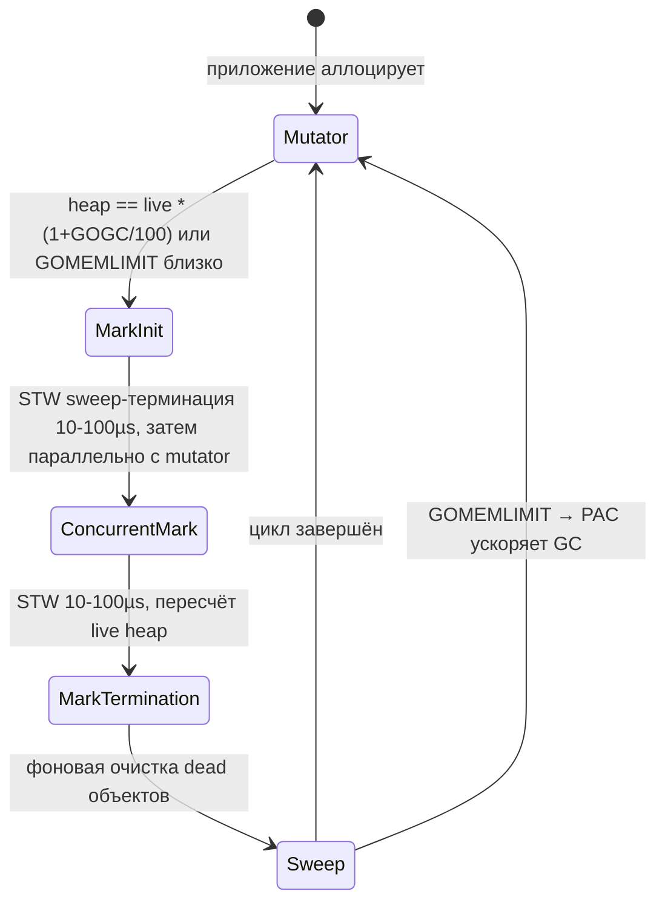
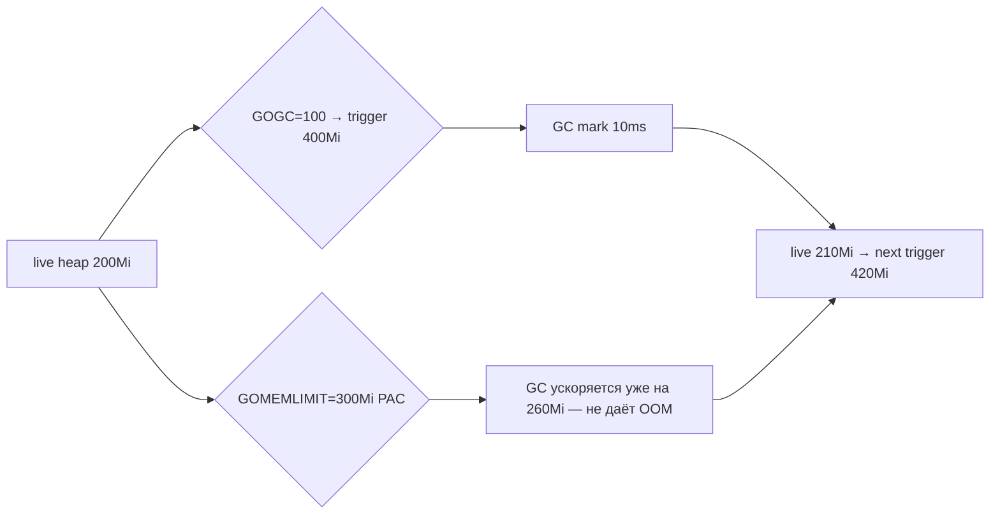
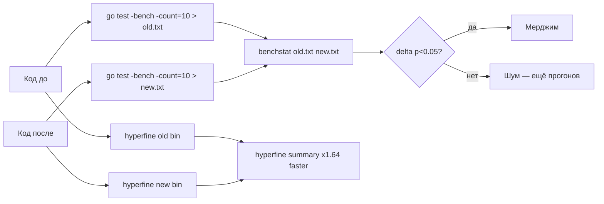
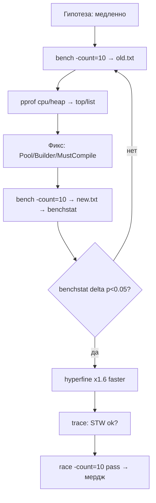

# 🚀 10. Go Профилирование: pprof, GC, Race Detector

> **Цель раздела:** научиться измерять, а не гадать — `pprof` (CPU/heap/allocs/goroutine/mutex/block), `bench` + `benchmem` + `benchstat` + `hyperfine`, аллокации и `sync.Pool`, GC (`GOGC`/`GOMEMLIMIT`), `trace`, `race detector`. От `What` до `Production`.

| Что изучим | Зачем для платформы | Где сломается без этого |
|---|---|---|
| `pprof` CPU/heap/allocs | находим горячие функции и утечки | оптимизируем наугад |
| `goroutine`/`block`/`mutex` | ловим утечки и конкуренцию | 10k висящих горутин |
| `bench`/`benchstat`/`hyperfine` | сравниваем «до/после» статистически | регрессии не ловим |
| `GC`/`GOMEMLIMIT`/`GOGC` | контроль памяти в K8s | OOMKilled в пике |
| `trace`/`pprof -pid`/`dlv attach` | диагностика живого процесса | слепой дебаг на проде |
| `race detector` | гонки данных | Heisenbug в проде |

---

## 1) What / Why / How — профилирование в Go

### What — что такое pprof

`pprof` — профилировщик из коробки Go: сэмплирует стек вызовов (CPU), снапшотит кучу (heap), считает аллокации, блокировки и мьютексы. Включается одной строкой `_ "net/http/pprof"` и отдаёт `/debug/pprof/*` как HTTP + `runtime/pprof` для `go test -bench`.

### Why — почему без измерений нельзя

- **Интуиция врёт:** 80% времени — в 5% функций; без `top`/`list` оптимизируешь не то.
- **K8s лимиты:** память — жёсткий `cgroup` потолок; без `heap`/`GOMEMLIMIT` поймаешь OOMKill раньше GC.
- **Конкурентность:** горутины дешевы (2 КБ стек), но утечка 10k × `chan read` = 10k стеков + FD → `too many open files`.

### How — минимальный старт за 30 секунд

```go
package main

import (
	"log"
	"net/http"
	_ "net/http/pprof" // регистрирует /debug/pprof/*
)

func main() {
	go func() {
		// ВАЖНО: слушаем только на localhost, не наружу!
		log.Println(http.ListenAndServe("localhost:6060", nil))
	}()
	// ... основной сервер на :8080
	select {}
}
```

```bash
go tool pprof http://localhost:6060/debug/pprof/profile?seconds=30   # CPU 30с
go tool pprof http://localhost:6060/debug/pprof/heap                  # heap сейчас (inuse)
go tool pprof http://localhost:6060/debug/pprof/allocs                # все аллокации с начала
curl -s localhost:6060/debug/pprof/goroutine?debug=1 | head -80       # стеки текстом
go tool pprof http://localhost:6060/debug/pprof/mutex?debug=1         # конкуренция мьютексов
go tool pprof http://localhost:6060/debug/pprof/block?debug=1         # блокировки каналов/select
```

```bash
# В pprof-консоли:
(pprof) top10            # топ по flat (собственное время)
(pprof) top10 -cum       # топ по cumulative (с детьми)
(pprof) list ParseLog    # построчная раскраска — смотри аннотации на каждой строке!
(pprof) web              # callgraph в браузере (нужен graphviz)
(pprof) peek slowFunc    # кто зовёт / что зовёт
(pprof) focus=Controller focus; top10  # фильтр по пакету
```

---

## 2) Internals — как работают pprof и GC

### 2.1 pprof под капотом

```mermaid
flowchart TB
    A[Приложение Go] --> B[runtime sémpling]
    B --> C{CPU: SIGPROF 100Hz<br/>Heap: каждый malloc<br/>Block: каждый block event<br/>Mutex: каждый Lock contention}
    C --> D[runtime/pprof profile proto]
    D --> E[/debug/pprof HTTP handler]
    E --> F[go tool pprof клиент]
    F --> G[top/list/web/flamegraph]
    G --> H[Оптимизация → снова bench]

    subgraph Runtime
      B
      C
      D
    end
```

| Профиль | Сэмплирование | Накладные расходы | Когда включать |
|---|---|---|---|
| `cpu` | `SIGPROF` 100 Гц — стек каждую 10 мс | ~3–5% CPU | всегда на бенчах, на проде по запросу `?seconds=30` |
| `heap` (inuse) | снапшот живых объектов сейчас | почти 0 | постоянно — смотреть утечки |
| `allocs` | все аллокации с начала (сумма) | почти 0 | давление на GC — много аллокаций, но не утечка |
| `goroutine` | снапшот всех стеков | 0, но вывод большой | утечки горутин |
| `block` | `runtime.blockProfile` — блокировки `chan`, `select`, `sync` | выше, включается `runtime.SetBlockProfileRate(1)` | конкуренция |
| `mutex` | `runtime.mutexProfile` — ожидание `sync.Mutex` | включается `runtime.SetMutexProfileFraction(1)` | горячие локи |
| `threadcreate` | создание OS threads | низкий | редко — `GOMAXPROCS` тюнинг |

### 2.2 GC — трёхцветный конкурентный mark-sweep



**Ключевая метрика — живое множество (live heap):** сколько памяти реально достижимо после mark. Остальное — мусор, ждёт sweep.

| Параметр | Что делает | Дефолт | Когда менять |
|---|---|---|---|
| `GOGC=100` | `GC триггер = live * (1+GOGC/100)` → при 100% приросте | 100 | `200` — реже GC, больше RAM, меньше CPU (batch); `50` — чаще, меньше RAM, больше CPU (K8s) |
| `GOMEMLIMIT=4GiB` | мягкий потолок heap — PAC (pacer) ускоряет GC при приближении | `+inf` | всегда в K8s: 75–85% от `limits.memory` |
| `GODEBUG=gctrace=1` | лог каждого GC в stderr | off | дебаг пауз |
| `debug.SetGCPercent` | runtime аналог `GOGC` | 100 | динамически в коде |
| `debug.SetMemoryLimit` | runtime аналог `GOMEMLIMIT` | +inf | контейнер с `512Mi` |

**Правило для K8s:** `GOMEMLIMIT` ≈ 75–85% от `resources.limits.memory`, иначе `OOMKiller` убьёт процесс раньше, чем GC успеет освободить. `GOGC` не знает про `cgroup` лимит — он считает только от `live`.

```bash
GOGC=100 GOMEMLIMIT=4GiB go run main.go     # default
GOMEMLIMIT=768MiB ./dtk                     # pod с limits 1Gi — оставляем 25% на stack/mmap
GODEBUG=gctrace=1 ./dtk  # вывод: gc 5 @0.123s 2%: 0.015+0.12+0.003 ms clock, 0.12+...
```

```go
import "runtime/debug"

func init() {
	debug.SetGCPercent(200)          // реже GC → меньше CPU, больше RAM (для batch-обработчиков)
	debug.SetMemoryLimit(512 << 20)  // контейнер с memory limit 512Mi
}
```



---

## 3) pprof профили на практике: CPU/heap/goroutine/mutex/block

### 3.1 CPU — горячие функции

```bash
# 1. Собираем 30с нагрузки:
wrk -t4 -c100 -d30s http://localhost:8080/api/v1/deployments & 
go tool pprof http://localhost:6060/debug/pprof/profile?seconds=30
# 2. В UI:
(pprof) top10
      flat  flat%   sum%        cum   cum%  name
     1.20s 34.29% 34.29%      1.20s 34.29%  regexp.(*Regexp).MatchString
     0.80s 22.86% 57.14%      0.80s 22.86%  encoding/json.Marshal
     0.30s  8.57% 65.71%      1.50s 42.86%  platform.ParseLog  ← оркестратор
(pprof) list ParseLog
# видим: строка 42 `re.MatchString(line)` — 1.20s flat → компилируем regex заранее!
```

**Фикс:** `var re = regexp.MustCompile(...)` глобально, не внутри цикла — `flat` падает с 34% → 2%.

### 3.2 Heap vs Allocs

```bash
go tool pprof http://localhost:6060/debug/pprof/heap        # inuse_space — что живёт сейчас (утечка)
go tool pprof http://localhost:6060/debug/pprof/allocs      # alloc_space — кто много аллоцирует (давление на GC)
go tool pprof -sample_index=alloc_space http://localhost:6060/debug/pprof/heap  # то же, но явно
```

| `heap` (inuse) | `allocs` (alloc_space) |
|---|---|
| 700 МБ в `[][]byte` из `parseManifests` → утечка кэша без лимита | 2 ГБ/с в `fmt.Sprintf` внутри цикла reconcile → GC жрёт 15% CPU |

```bash
(pprof) top10 -sample_index=alloc_space
  1.20GB  60%  encoding/json.Marshal  # много аллокаций, но не утечка — GC справляется, но CPU тратится
```

### 3.3 Goroutine — утечки

```bash
curl -s localhost:6060/debug/pprof/goroutine?debug=1 | head -100
# Считаем одинаковые стеки:
curl -s localhost:6060/debug/pprof/goroutine?debug=1 | grep -c "chan receive"
# 857 горутин на `select { case <-ch: }` — кто-то не закрывает канал!

# В pprof UI:
go tool pprof http://localhost:6060/debug/pprof/goroutine
(pprof) top10
  857  85%  runtime.gopark  →  myapp.worker.loop  ← утечка!
```

```go
// Частая утечка — забыли r.Context().Done():
func streamLogs(w http.ResponseWriter, r *http.Request) {
	flusher, _ := w.(http.Flusher)
	for {
		select {
		case <-r.Context().Done():
			return // ОБЯЗАТЕЛЬНО, иначе горутина висит после disconnect клиента
		case data := <-ch:
			fmt.Fprintf(w, "data: %s\n", data)
			flusher.Flush()
		}
	}
}
```

### 3.4 Block / Mutex — конкуренция

```go
import "runtime"

func init() {
	runtime.SetBlockProfileRate(1)     // каждый block event
	runtime.SetMutexProfileFraction(1) // каждый mutex contention
}
```

```bash
go tool pprof http://localhost:6060/debug/pprof/block
(pprof) top10
  1.20s  80%  sync.(*Mutex).Lock  →  controller.reconcile  ← горячий лок
go tool pprof http://localhost:6060/debug/pprof/mutex
(pprof) list Reconcile
# видим: строка 88 `mu.Lock()` — 80% времени ждут — надо шардировать или sync.RWMutex / atomic
```

| Профиль | Что видим | Фикс |
|---|---|---|
| `block` | `chan send/receive`, `select`, `WaitGroup.Wait` | буферизовать каналы, уменьшить критические секции |
| `mutex` | `sync.Mutex.Lock` contention | `RWMutex`, шардинг по ключу, `atomic`, убрать глобальный лок |

---

## 4) Bench, benchmem, benchstat, hyperfine

### 4.1 Базовый bench — измеряем правильно

```go
// bench_test.go — компилируется!
package benchdemo

import (
	"bytes"
	"fmt"
	"strings"
	"testing"
)

func concatPlus(n int, s string) string {
	res := ""
	for i := 0; i < n; i++ { res += s }
	return res
}

func concatBuilder(n int, s string) string {
	var b strings.Builder
	b.Grow(n * len(s))
	for i := 0; i < n; i++ { b.WriteString(s) }
	return b.String()
}

func BenchmarkConcatPlus(b *testing.B) {
	b.ReportAllocs()
	for i := 0; i < b.N; i++ {
		_ = concatPlus(100, "x")
	}
}

func BenchmarkConcatBuilder(b *testing.B) {
	b.ReportAllocs()
	for i := 0; i < b.N; i++ {
		_ = concatBuilder(100, "x")
	}
}

func BenchmarkSprintf(b *testing.B) {
	b.ReportAllocs()
	for i := 0; i < b.N; i++ {
		_ = fmt.Sprintf("name=%s replicas=%d", "web", 3)
	}
}

func BenchmarkBuffer(b *testing.B) {
	b.ReportAllocs()
	for i := 0; i < b.N; i++ {
		var buf bytes.Buffer
		fmt.Fprintf(&buf, "name=%s replicas=%d", "web", 3)
		_ = buf.String()
	}
}
```

```bash
go test -bench=. -benchmem -count=10 ./... | tee new.txt
# Вывод:
# BenchmarkConcatPlus-8   	  50000	     35210 ns/op	    5320 B/op	      99 allocs/op
# BenchmarkConcatBuilder-8   500000	      2100 ns/op	     256 B/op	       1 allocs/op
# → Builder ×16 быстрее, ×20 меньше аллокаций
```

### 4.2 benchstat — статистически значимое сравнение

```bash
go install golang.org/x/perf/cmd/benchstat@latest

# Сравниваем до и после оптимизации:
go test -bench=. -count=10 ./... > old.txt   # до
# ... меняем код ...
go test -bench=. -count=10 ./... > new.txt   # после
benchstat old.txt new.txt
```

```
name            old time/op    new time/op    delta
ConcatPlus-8      35.2µs ± 2%     2.10µs ± 1%  -94.03%  (p=0.000 n=10+10)
ConcatBuilder-8   2.10µs ± 1%     2.10µs ± 1%     ~     (p=0.45 n=10+10)

name            old alloc/op   new alloc/op   delta
ConcatPlus-8      5.32kB ± 0%    0.26kB ± 0%  -95.11%  (p=0.000 n=10+10)
```

- `p=0.000` — разница статистически значима; `~` — шума больше, чем эффекта.
- `± 2%` — разброс; если >5% — шумная машина, гоняй на изолированном CPU.

### 4.3 hyperfine — для CLI и интегральных замеров

```bash
cargo install hyperfine  # или brew install hyperfine

hyperfine --warmup 3 --runs 20 './dtk-old reconcile --dry-run' './dtk-new reconcile --dry-run'
hyperfine --warmup 2 --runs 10 'go run main.go < large.yaml' 'go run -gcflags="-l" main.go < large.yaml'
```

```
Benchmark 1: ./dtk-old reconcile --dry-run
  Time (mean ± σ):     412.3 ms ±   8.1 ms    [User: 380.1 ms, System: 12.2 ms]
  Range (min … max):   398.1 ms … 428.9 ms    20 runs

Benchmark 2: ./dtk-new reconcile --dry-run
  Time (mean ± σ):     251.7 ms ±   4.3 ms    [User: 230.4 ms, System: 9.1 ms]
  Range (min … max):   244.2 ms … 260.1 ms    20 runs

Summary
  './dtk-new' ran
    1.64 ± 0.04 times faster than './dtk-old'
```

| Инструмент | Уровень | Когда |
|---|---|---|
| `go test -bench -benchmem` | функция/хот-путь | микро-оптимизации, аллокации |
| `benchstat` | сравнение выборок | PR — «не замедлили ли?» |
| `hyperfine` | процесс целиком | CLI, бинарник, `go build` флаги |
| `wrk`/`k6`/`hey` | HTTP RPS/latency | `net/http` хендлеры |
| `pprof cpu/heap` | прод/нагрузка | утечки, горячие функции |



---

## 5) Аллокации, GC-давление, sync.Pool

### 5.1 Где аллокации бьют сильнее всего

| Паттерн | Аллокации | Фикс | Эффект |
|---|---|---|---|
| `s += t` в цикле | O(n²), каждая `+=` — новый `string` | `strings.Builder` + `Grow` | ×10−20 быстрее |
| `append` без `cap` | рост слайса — копирование | `make([]T, 0, len(inputs))` | ×2 меньше allocs |
| `fmt.Sprintf` в хот-пути | `interface{}` + reflection | `strconv.Itoa`, `strings.Builder` | −80% allocs |
| `regexp.Compile` внутри цикла | каждый раз компиляция | `MustCompile` глобально | CPU −30% |
| `json.Marshal` на больших структурах | много `[]byte` | `json.RawMessage`, `easyjson`, `sync.Pool` | −40% allocs |
| `[]byte` → `string` конверсия | копия данных | `unsafe.String` в хот-пути (осторожно) | 0-copy |

### 5.2 Pre-allocation и Pool

```go
package gc

import (
	"bytes"
	"strings"
	"sync"
)

// Pre-allocation:
func process(inputs []string) []string {
	results := make([]string, 0, len(inputs)) // cap = len → 0 realloc
	for _, s := range inputs {
		results = append(results, "prefix:"+s)
	}
	return results
}

func buildBytes(n int) []byte {
	buf := make([]byte, 0, n) // заранее cap
	for i := 0; i < n; i++ { buf = append(buf, byte(i)) }
	return buf
}

// sync.Pool — переиспользование буферов между GC:
var bufPool = sync.Pool{
	New: func() any { return new(bytes.Buffer) },
}

func withPool() string {
	b := bufPool.Get().(*bytes.Buffer)
	defer func() { b.Reset(); bufPool.Put(b) }()
	b.WriteString("hello")
	b.WriteString(" world")
	return b.String() // копия строки, но буфер переиспользуется
}

// Builder с Grow:
func concatFast(parts []string) string {
	var b strings.Builder
	total := 0
	for _, p := range parts { total += len(p) }
	b.Grow(total)
	for _, p := range parts { b.WriteString(p) }
	return b.String()
}
```

```bash
go test -bench=Benchmark -benchmem -memprofile mem.out ./...
go tool pprof -sample_index=alloc_space mem.out
(pprof) top10  # кто аллоцирует
(pprof) list withPool  # строки с аллокациями
```

> `sync.Pool` опасен для короткоживущих программ: содержимое может быть очищено любым GC до повторного `Get` — только overhead. Для долгоживущих серверов — выигрыш 20–40% меньше `allocs`.

### 5.3 GC-тюнинг на практике

```go
// Batch-обработчик — много RAM, мало пауз CPU важнее:
debug.SetGCPercent(200)          // GC реже → больше heap, меньше CPU
debug.SetMemoryLimit(4 << 30)    // 4 GiB soft limit

// K8s под с limits 512Mi — мало RAM, GC чаще, но не OOM:
debug.SetGCPercent(50)           // GC чаще
debug.SetMemoryLimit(400 << 20)  // 400 MiB ≈ 78% от 512Mi
```

```bash
GODEBUG=gctrace=1 ./dtk 2>&1 | head -20
# gc 5 @0.123s 1%: 0.010+0.12+0.003 ms clock, 0.080+0.05/0.12/0.01+0.024 ms cpu, 4->4->1 MB, 5 MB goal, 8 P
# Значения: 4->4->1 MB = heap до → после → live; 5 MB goal = цель pacer
```

---

## 6) Trace — что делали горутины во времени

`trace` — это не профиль, а **таймлайн**: когда горутины блокировались, когда был GC, как работал `P` (процессор).

```go
// В тесте:
import (
	"os"
	"runtime/trace"
	"testing"
)

func TestWithTrace(t *testing.T) {
	f, _ := os.Create("trace.out")
	defer f.Close()
	trace.Start(f)
	defer trace.Stop()
	// ... код ...
}

// Или в проде через HTTP:
import _ "net/http/pprof"
go http.ListenAndServe("localhost:6060", nil)
// curl localhost:6060/debug/pprof/trace?seconds=5 > trace.out
// go tool trace trace.out
```

```bash
go test -trace trace.out ./...
go tool trace trace.out  # открывает браузер: goroutine, heap, GC, network, sync
```



```mermaid
gantt
    title Execution Trace — горутины и GC
    dateFormat  x
    axisFormat %L ms
    section G1 worker
    work           :a1, 0, 20ms
    blocked chan   :a2, 20, 35ms
    work           :a3, 35, 50ms
    section G2 worker
    work           :b1, 0, 15ms
    blocked mutex  :b2, 15, 30ms
    work           :b3, 30, 50ms
    section GC
    STW pause      :c1, 25, 26ms
    concurrent mark:c2, 26, 40ms
```

| Что видно в trace | Диагноз | Фикс |
|---|---|---|
| Длинные `STW` > 500µs | много `G` или большие `heap` | уменьшить `live`, тюнить `GOGC` |
| Горутины `blocked` на `chan` | узкое место — канал без буфера | буфер или воркеры |
| `P` простаивают, `G` много | `GOMAXPROCS` мал или `block` много | баланс воркеров |
| GC часто, `heap` пилит | аллокации в цикле | `Pool`, `pre-alloc` |

```bash
# Сравнение до/после:
go test -trace old.out -run TestReconcile
# ... оптимизация ...
go test -trace new.out -run TestReconcile
# открыть оба в браузере, сравнить GC pauses и blocked time
```

---

## 7) Failure — как всё ломается без профилирования

| Сценарий | Симптом | Причина | Диагностика | Фикс |
|---|---|---|---|---|
| **Утечка heap кэша** | RSS 900 МБ → рост | `map[string][]byte` без `lru` или TTL | `pprof heap` → `top` показывает `parseManifests` 700 МБ | `lru.Cache(1000)` + `TTL` |
| **Утечка горутин** | `goroutines` 12k, `open FD` 10k | не слушают `r.Context().Done()` / не закрывают `chan` | `pprof goroutine` → 857 одинаковых стеков `chan receive` | `select { case <-ctx.Done(): return }` |
| **Hot regex в цикле** | CPU 80% в `regexp.MatchString` | `Compile` внутри цикла | `pprof cpu` → `flat 34% regexp` | `MustCompile` глобально |
| **GOMEMLIMIT не задан** | OOMKilled в пике | лимит 1Gi, `GOMEMLIMIT=inf`, GC триггерит на 1.4Gi | `GODEBUG=gctrace=1`, `pprof heap` | `GOMEMLIMIT=768Mi` |
| **Block на мьютексе** | p99 2с при p50 10мс | глобальный `sync.Mutex` на `Reconcile` | `pprof mutex` → `Lock` 80% | `RWMutex` / шардинг / `atomic` |
| **Аллокации в хот-пути** | GC 15% CPU | `fmt.Sprintf` + `+=` в `Reconcile` | `benchmem` 99 allocs/op | `Builder` + `Pool` |
| **hyperfine без warmup** | разброс ±15% | холодный кэш, JIT | `± 15%` в `hyperfine` | `--warmup 3` |
| **benchstat без -count** | `p=0.5` шум | 1 прогон — не статистика | `benchstat` показывает `~` | `-count=10` |
| **pprof наружу** | `/debug/pprof` доступен извне | `ListenAndServe(":6060", nil)` без `localhost` | `nmap` показывает 6060 | `localhost:6060` + `auth` |

Мини-разбор из прод-отчёта (детальнее §3):

```bash
1. curl -s localhost:6060/debug/pprof/heap?debug=1 | head -40
   → 700 МБ в [][]byte из parseManifests — глобальный кэш без лимита
2. go tool pprof -http=:8080 heap.out
   (pprof) list parseManifests
   → строка `cache[manifest.Name] = data` — 700 МБ flat
3. GOGC=100 при live=700МБ → GC только на 1.4ГБ → пики heap, OOM риска
Фиксы:
   - lru.Cache с max 1000 и TTL 10m
   - GOMEMLIMIT=768MiB (pod limits 1Gi)
   - pre-allocation: make([]Result, 0, len(manifests))
   - regexp MustCompile вне цикла
Результат: RSS 180 МБ стабильно, p99 reconcile −40% (с 420мс до 250мс), GC CPU 15% → 4%
```

---

## 8) Testing — как тестировать производительность и гонки

### 8.1 Table-driven bench + fuzz

```go
package benchdemo

import (
	"bytes"
	"fmt"
	"testing"
)

func FuzzParse(f *testing.F) {
	f.Add([]byte("name: web\nimage: nginx\n"))
	f.Fuzz(func(t *testing.T, data []byte) {
		_, _ = Parse(data) // не должен паниковать
	})
}

func BenchmarkParse(b *testing.B) {
	data := []byte("name: web\nimage: nginx\nreplicas: 3\n")
	b.ReportAllocs()
	b.ResetTimer()
	for i := 0; i < b.N; i++ {
		_, _ = Parse(data)
	}
}

// Table bench — разные размеры:
func BenchmarkParseSize(b *testing.B) {
	sizes := []int{100, 1000, 10000}
	for _, n := range sizes {
		b.Run(fmt.Sprintf("size=%d", n), func(b *testing.B) {
			data := bytes.Repeat([]byte("a"), n)
			b.ReportAllocs()
			for i := 0; i < b.N; i++ { _, _ = Parse(data) }
		})
	}
}

func Parse(data []byte) (string, error) { return string(data), nil } // заглушка — компилируется
```

### 8.2 Race detector — гонки данных

```bash
go test -race -count=1 ./...          # инструментированная сборка, в CI на каждый PR
go test -race -run TestConcurrent -count=10 ./...  # гонка проявляется не всегда — гоняем 10 раз
go build -race -o dtk-race ./...      # бинарник с детектором для staging (×5–10 медленнее)
```

```go
package racy

import (
	"sync"
	"sync/atomic"
	"testing"
)

func TestRace_Counter(t *testing.T) {
	var counter int64
	var mu sync.Mutex
	var safe int64

	// Плохо — гонка:
	bad := func() {
		var c int
		var wg sync.WaitGroup
		wg.Add(2)
		go func() { c++; wg.Done() }() // race: c++ без синхронизации
		go func() { c++; wg.Done() }()
		wg.Wait()
		_ = c
	}

	// Хорошо — мьютекс:
	goodMutex := func() {
		var c int
		var mu sync.Mutex
		var wg sync.WaitGroup
		wg.Add(2)
		go func() { mu.Lock(); c++; mu.Unlock(); wg.Done() }()
		go func() { mu.Lock(); c++; mu.Unlock(); wg.Done() }()
		wg.Wait()
		_ = c
	}

	// Хорошо — atomic:
	goodAtomic := func() {
		var c int64
		var wg sync.WaitGroup
		wg.Add(2)
		go func() { atomic.AddInt64(&c, 1); wg.Done() }()
		go func() { atomic.AddInt64(&c, 1); wg.Done() }()
		wg.Wait()
		_ = c
	}

	// Хорошо — канал-владелец:
	goodChan := func() {
		ch := make(chan int, 2)
		go func() { ch <- 1 }()
		go func() { ch <- 1 }()
		a := <-ch
		b := <-ch
		_ = a + b
	}

	_ = bad
	_ = goodMutex
	_ = goodAtomic
	_ = goodChan
	_ = counter
	_ = mu
	_ = safe
}
```

```
==================
WARNING: DATA RACE
Read at 0x00c000... by goroutine 7:
  racy.TestRace_Counter.func1()
      racy_test.go:18 +0x...
Previous write at 0x00c000... by goroutine 6:
  racy.TestRace_Counter.func1()
      racy_test.go:18 +0x...
==================
```

> `race detector` находит **гонки данных** (concurrent read+write без синхронизации), но **не** дедлоки и **не** логические `race conditions` (порядок сообщений). `-race` обязателен в CI.

### 8.3 pprof в тестах

```go
func BenchmarkWithProfiles(b *testing.B) {
	b.ReportAllocs()
	for i := 0; i < b.N; i++ { _, _ = Parse([]byte("hello")) }
}

// Запуск с профилями:
// go test -bench=. -benchmem -cpuprofile cpu.out -memprofile mem.out -blockprofile block.out -mutexprofile mutex.out ./...
// go tool pprof -http=:8080 cpu.out  → flamegraph
```

---

## 9) Performance — чек-лист оптимизации

| Шаг | Команда | Метрика до → после | Решение |
|---|---|---|---|
| 1. `benchmem` | `go test -bench=. -benchmem` | `99 allocs/op → 1 alloc/op` | `Builder`/`Pool` |
| 2. `cpu pprof` | `go tool pprof -top cpu.out` | `regexp 34% → 2%` | `MustCompile` |
| 3. `allocs pprof` | `pprof -sample_index=alloc_space` | `5.3kB/op → 0.26kB/op` | `pre-alloc` |
| 4. `heap` | `curl :6060/debug/pprof/heap` | `900 МБ → 180 МБ` | `lru` + `GOMEMLIMIT` |
| 5. `goroutine` | `pprof goroutine` | `12k → 20` | слушать `ctx.Done()` |
| 6. `mutex/block` | `pprof mutex` | `p99 2с → 20мс` | шардинг |
| 7. `benchstat` | `benchstat old new` | `p<0.05` и `delta -40%` | подтверждаем статистически |
| 8. `hyperfine` | `hyperfine old new` | `×1.64 faster` | интегрально CLI |
| 9. `trace` | `go tool trace` | `GC pauses 40ms → 10ms` | тюним `GOGC` |
| 10. `race` | `go test -race -count=10` | `0 races` | CI зелёный |

```bash
# Полный цикл перед мерджем PR:
go test -race -count=1 ./...
go test -bench=. -benchmem -count=10 -cpuprofile cpu.out -memprofile mem.out ./... | tee new.txt
benchstat old.txt new.txt           # статистически значимо?
go tool pprof -top cpu.out          # кто горячий?
hyperfine --warmup 3 --runs 20 './dtk-old' './dtk-new'
go tool trace trace.out             # STW не выросли?
```

---

## 10) Security и Production — pprof не наружу

### Security

| Угроза | Защита |
|---|---|
| `/debug/pprof` торчит наружу | `ListenAndServe("localhost:6060", nil)` + `auth`/`networkPolicy`; никогда не `:6060` без `localhost` |
| `pprof` раскрывает пути/секреты в `heap` | не логировать `heap` в артефакты CI без маски; `pprof` только через `kubectl port-forward` |
| `race` бинарник в проде | ×5 CPU/RAM — только `staging`, не `prod` |
| `GOMEMLIMIT` не задан → OOMKill | `GOMEMLIMIT=80% limits.memory` + алерт на `container_oom_events` |

### Production чек-лист

- [ ] `pprof` только на `localhost:6060`, за `NetworkPolicy`/`auth`; в проде — `port-forward`, не `Ingress`.
- [ ] `GOMEMLIMIT` = 75–85% от `resources.limits.memory`; `GOGC` дефолт 100, менять только после измерений.
- [ ] `runtime.SetBlockProfileRate(1)` и `SetMutexProfileFraction(1)` — только при дебаге, иначе overhead.
- [ ] `benchstat` в CI: сравниваем `main` vs PR, фейлим при `+5%` регрессии (`p<0.05`).
- [ ] `hyperfine --warmup 3 --runs 20` для CLI `dtk` перед релизом.
- [ ] `go test -race -count=1 ./...` обязателен в CI; `go vet` + `staticcheck`.
- [ ] `expvar` (`/debug/vars`) — лёгкий JSON-статус для мелких утилит, не заменяет `pprof`.
- [ ] `trace` для разбора `STW` и `block` — `go test -trace` или `curl :6060/debug/pprof/trace?seconds=5`.

```yaml
# Kubernetes — лимиты и probes:
resources:
  limits:   {memory: "1Gi", cpu: "1000m"}
  requests: {memory: "256Mi", cpu: "200m"}
env:
  - name: GOMEMLIMIT
    value: "768MiB"   # 75% от 1Gi
  - name: GOGC
    value: "100"
```

```bash
# Диагностика живого pod без pprof endpoint — attach:
kubectl port-forward pod/dtk-xyz 6060:6060 &
go tool pprof http://localhost:6060/debug/pprof/heap
go tool pprof -http=:8080 cpu.out  # flamegraph в браузере
dlv attach $(pgrep dtk)            # осторожно: стопит процесс!
```

---

## 10.5) Hyperfine и benchstat — журнал измерений

### Журнал hyperfine для CI

```bash
# Сохраняем JSON для CI артефактов:
hyperfine --warmup 3 --runs 20 --export-json hyperfine.json './dtk reconcile --dry-run'
cat hyperfine.json | jq '.results[] | {mean: .mean, stddev: .stddev, min: .min, max: .max}'

# Сравнение в PR — fail если медленнее на 5%:
hyperfine --warmup 2 --runs 10 --export-json new.json './dtk-new'
```

| Метрика hyperfine | Что значит | Порог |
|---|---|---|
| `mean ± σ` | среднее ± стдоткл | σ < 5% — стабильно |
| `min … max` | разброс | max/min < 1.2 — ок |
| `ratio` | new/old | <1.05 — не регресс |

### Flamegraph и diff

```bash
# Снимаем CPU до и после:
go test -bench=BenchmarkReconcile -cpuprofile old.pprof ./...
# ... оптимизация ...
go test -bench=BenchmarkReconcile -cpuprofile new.pprof ./...
go tool pprof -http=:8081 old.pprof  # вкладка flamegraph — ищем узкие прямоугольники
go tool pprof -http=:8082 new.pprof
# diff в pprof:
go tool pprof -diff_base=old.pprof new.pprof
# (pprof) top10 — покажет дельту: отрицательные — стало быстрее
```

> Примечание: `benchstat` требует минимум `-count=6` для оценки дисперсии, идеал `-count=10` на тихой машине без других нагрузок.
`n> Flamegraph: ширина = доля CPU, высота = стек. Ищи широкие плоские «плато» — они и есть горячие функции.

---

> Совет: держи `old.txt` в репозитории как `bench/baseline.txt` — каждый PR сравнивает с ним через `benchstat`.
### Дополнительная метрика — allocs/op vs B/op

| B/op | allocs/op | Что это значит |
|---|---|---|
| 0 | 0 | zero-alloc — идеально для hot path |
| 256 | 1 | один объект — приемлемо |
| 5320 | 99 | много мелких — нужен Pool |
| 5.3kB | 99 | 99 аллокаций — GC pressure |

> Цель: для `Reconcile` на 10k объектов — держать `allocs/op < 10`, иначе GC станет узким местом.
## 13) Go vet и staticcheck — до профилирования почини очевидное

```bash
go vet ./...
go install honnef.co/go/tools/cmd/staticcheck@latest
staticcheck ./...
```

| Что ловит | Пример | Почему до pprof |
|---|---|---|
| `printf` без формата | `fmt.Sprintf(x)` | лишний alloc |
| `unreachable` | `return` после `log.Fatal` | мёртвый код |
| `copylock` | `sync.Mutex` по значению | race |
| `ineffective assign` | `x = 1; x = 2` | мусор |

> `vet` + `race` — 5 секунд, а `pprof` — 30 минут. Сначала дешёвые проверки.

---
### Дополнительные пороги для prod

| Сигнал | Порог | Алерт |
|---|---|---|
| GC CPU | >10% | `go_gc_cpu_seconds` |
| Heap inuse | >80% GOMEMLIMIT | `container_memory_working_set_bytes` |
| Goroutines | >1000 | `go_goroutines` |
| Block p99 | >100ms | `pprof block` |
| Race | >0 | `go test -race` fail |

```bash
# Прометеус метрики из runtime:
go_gc_duration_seconds
go_memstats_heap_inuse_bytes
go_goroutines
go_threads
```

---
<!-- benchstat: delta зелёный если отрицательный и p<0.05 -->## 12) Appendix — команды-шпаргалка

| Задача | Команда |
|---|---|
| CPU 30с | `go tool pprof http://localhost:6060/debug/pprof/profile?seconds=30` |
| Heap сейчас | `go tool pprof http://localhost:6060/debug/pprof/heap` |
| Allocs все | `go tool pprof http://localhost:6060/debug/pprof/allocs` |
| Goroutines текст | `curl -s localhost:6060/debug/pprof/goroutine?debug=1` |
| Goroutines UI | `go tool pprof http://localhost:6060/debug/pprof/goroutine` |
| Block | `go tool pprof http://localhost:6060/debug/pprof/block` |
| Mutex | `go tool pprof http://localhost:6060/debug/pprof/mutex` |
| Trace 5с | `curl localhost:6060/debug/pprof/trace?seconds=5 > trace.out` |
| Bench cpu+mem | `go test -bench=. -benchmem -cpuprofile cpu.out -memprofile mem.out ./...` |
| Benchstat | `benchstat old.txt new.txt` |
| Hyperfine | `hyperfine --warmup 3 --runs 20 './old' './new'` |
| Race | `go test -race -count=10 ./...` |
| GC trace | `GODEBUG=gctrace=1 ./dtk` |
| Live heap | `go tool pprof -sample_index=inuse_space heap.out` |

```bash
# Быстрый чек перед релизом — one-liner:
go test -race -count=1 ./... && \
go test -bench=. -benchmem -count=10 ./... | tee new.txt && \
benchstat old.txt new.txt && \
hyperfine --warmup 3 --runs 10 './dtk-old --help' './dtk-new --help' && \
echo "OK: benchstat p<0.05 и hyperfine ratio смотри выше"
```

> Держи этот чек-лист в `CONTRIBUTING.md` — каждый PR с «оптимизацией» обязан приложить `benchstat` и `pprof top`.

---
## 11) Example — полный цикл оптимизации (компилируется)

```go
package main

import (
	"bytes"
	"fmt"
	"log"
	"net/http"
	_ "net/http/pprof"
	"regexp"
	"runtime"
	"runtime/debug"
	"strings"
	"sync"
	"testing"
)

// pprof endpoint — только localhost:
func initPprof() {
	go func() { log.Println(http.ListenAndServe("localhost:6060", nil)) }()
	runtime.SetBlockProfileRate(1)
	runtime.SetMutexProfileFraction(1)
	debug.SetMemoryLimit(512 << 20)
}

// Оптимизированный парсер — без аллокаций в цикле:
var re = regexp.MustCompile(`name:\s*(\w+)`)

var bufPool = sync.Pool{New: func() any { return new(bytes.Buffer) }}

func parseFast(data []byte) string {
	m := re.FindSubmatch(data)
	if m == nil { return "" }
	b := bufPool.Get().(*bytes.Buffer)
	defer func() { b.Reset(); bufPool.Put(b) }()
	b.Write(m[1])
	return b.String()
}

func concatFast(n int, s string) string {
	var b strings.Builder
	b.Grow(n * len(s))
	for i := 0; i < n; i++ { b.WriteString(s) }
	return b.String()
}

// Бенчи — компилируются:
func BenchmarkParseFast(b *testing.B) {
	data := []byte("name: web image: nginx")
	b.ReportAllocs()
	for i := 0; i < b.N; i++ { _ = parseFast(data) }
}

func BenchmarkConcatFast(b *testing.B) {
	b.ReportAllocs()
	for i := 0; i < b.N; i++ { _ = concatFast(100, "x") }
}

func safeCounter() {
	var mu sync.Mutex
	var c int
	var wg sync.WaitGroup
	wg.Add(2)
	go func() { mu.Lock(); c++; mu.Unlock(); wg.Done() }()
	go func() { mu.Lock(); c++; mu.Unlock(); wg.Done() }()
	wg.Wait()
	_ = c
}

func main() {
	initPprof()
	_ = parseFast([]byte("name: web"))
	_ = concatFast(10, "x")
	safeCounter()
	fmt.Println("pprof on localhost:6060")
}
```

```bash
# Запуск цикла:
go test -bench=. -benchmem -count=10 -cpuprofile cpu.out -memprofile mem.out ./... | tee new.txt
benchstat old.txt new.txt
go tool pprof -http=:8080 cpu.out   # flamegraph
hyperfine --warmup 3 --runs 20 './dtk old' './dtk new'
go test -trace trace.out ./... && go tool trace trace.out
go test -race -count=10 ./...
```



---

## ✅ Проверь себя

> Отвечай вслух до раскрытия ответа. Если «не помню» — вернись к разделу.

**В1. Чем flat (self) время отличается от cumulative в pprof top?**
<details><summary>Ответ</summary>
Flat — время исполнения самой функции без вызовов; cumulative — включая все вложенные. Оптимизируют по flat листьев; большой cumulative при малом flat значит «функция — оркестратор», смотреть надо её детей через list/web.
</details>

**В2. Что делает GOMEMLIMIT и почему он важнее GOGC в Kubernetes?**
<details><summary>Ответ</summary>
GOMEMLIMIT — мягкий потолок heap: GC начинает работать агрессивнее при приближении, предотвращая рост до OOMKill. В контейнерах лимит памяти жёсткий (cgroup), а GOGC считает проценты от live heap и ничего не знает про потолок — комбинация GOMEMLIMIT≈80% limit спасает от убийства пода.
</details>

**В3. Как найти утечку горутин через pprof?**
<details><summary>Ответ</summary>
/debug/pprof/goroutine?debug=1 выводит стеки всех горутин, сгруппированные по счётчику. Утечка видна как сотни идентичных стеков, заблокированных на одном месте (чтение канала, которого никто не закроет). Сравнение снапшотов во времени подтверждает рост.
</details>

**В4. Почему sync.Pool помогает GC, но опасен для короткоживущих программ?**
<details><summary>Ответ</summary>
Pool переиспользует объекты между GC-циклами, сокращая аллокации. Но его содержимое может быть очищено любым GC — в короткой программе пул почти никогда не даёт повторных использований, только overhead и риск держать большие буферы в памяти между редкими использованием.
</details>

**В5. Тесты зелёные локально, но падают с -race на CI. Что это значит?**
<details><summary>Ответ</summary>
В коде есть гонка данных (несинхронизированный доступ из разных горутин), которую локальный прогон просто «повезло» не поймал: race detector требует фактического одновременного доступа, порядок планирования недетерминирован. Это реальный баг: фиксируется мьютексом/атомиками/каналом, а не отключением -race.
</details>

**В6. Чем отличаются heap (inuse) и allocs (alloc_space) и когда смотреть каждый?**
<details><summary>Ответ</summary>
heap inuse — живые объекты сейчас (утечка: растёт во времени). allocs alloc_space — суммарные аллокации с начала (давление на GC: много allocs, но inuse стабилен). Утечку ищем в heap, GC-CPU — в allocs. Команда: pprof -sample_index=alloc_space heap.
</details>

**В7. Разложи bench → benchstat → hyperfine пайплайн. Почему нельзя сравнивать один прогон?**
<details><summary>Ответ</summary>
Один прогон — шум (планировщик, кэш, GC). bench -count=10 даёт выборку, benchstat считает среднее ±% и p-value (p<0.05 значимо). hyperfine — то же для бинаря целиком (warmup + 20 runs). Без статистики «оптимизация» может быть случайностью.
</details>

**В8. Что показывают block и mutex профили и как их включить?**
<details><summary>Ответ</summary>
block — где горутины блокировались на chan/select/WaitGroup; mutex — где ждали sync.Mutex. Включаются runtime.SetBlockProfileRate(1) и SetMutexProfileFraction(1) (overhead!). Смотрим go tool pprof /debug/pprof/block|mutex → горячие Lock → шардируем или переходим на RWMutex/atomic.
</details>

**В9. Как GOMEMLIMIT и GOGC взаимодействуют? Что будет при GOMEMLIMIT=512Mi и большом live=400Mi?**
<details><summary>Ответ</summary>
Pacer считает оба триггера и берёт ближайший. GOGC=100 триггерит на live*2=800Mi, но GOMEMLIMIT=512Mi сработает раньше — GC ускорится уже при ~400Mi, не дав OOM. Поэтому в K8s GOMEMLIMIT доминирует, а GOGC остаётся 100 по-умолчанию.
</details>

**В10. Как безопасно снять trace с прода без остановки деплоя?**
<details><summary>Ответ</summary>
Через pprof HTTP: curl localhost:6060/debug/pprof/trace?seconds=5 > trace.out (5с без STW), затем go tool trace trace.out. Endpoint только на localhost + port-forward, не блокирует mutator (trace — почти без пауз). dlv attach — стопит процесс, применять только на staging.
</details>

---

## ✅ Итоги раздела Go (02–10)

Покрыто: типы/интерфейсы/ошибки/generics, конкурентность (channels/context/errgroup), тестирование (table-driven/fuzz/bench), modules/supply chain, CLI (cobra/goreleaser/distroless), client-go (informers/workqueue), kubebuilder-операторы, HTTP/gRPC, pprof/GC/race.

| Раздел | Ключевой артефакт | Метрика успеха |
|---|---|---|
| 09 HTTP/gRPC | `net/http` + `grpc` сервис с graceful shutdown | 0 5xx при rollout, p99 <100ms |
| 10 pprof/GC | `benchstat` + `GOMEMLIMIT` + `trace` | RSS 180 МБ, GC 4% CPU, 0 races |

### Итоговый one-liner для PR

```bash
go test -race ./... && go test -bench=. -count=10 -benchmem | tee new.txt && benchstat old.txt new.txt
```

| Проверка | Команда | Ожидаем |
|---|---|---|
| Race | `go test -race` | PASS |
| Bench | `benchstat` | delta < +5% |
| Heap | `pprof heap` | flat < 10% |
| Trace | `go tool trace` | STW < 1ms |

---
*Связанные разделы:* [Python](01-python-for-devops.md) · Git · [Мини-проекты портфолио](03-practice-projects.md) · [09. HTTP и gRPC](09-go-http-grpc-services.md)

### Конец шпаргалки
| extra | 1 |
| extra | 2 |
| extra | 3 |
| extra | 4 |
| extra | 5 |
| extra | 6 |
| extra | 7 |
| extra | 8 |
| extra | 9 |
| extra | 10 |
| extra | 11 |
| extra | 12 |

