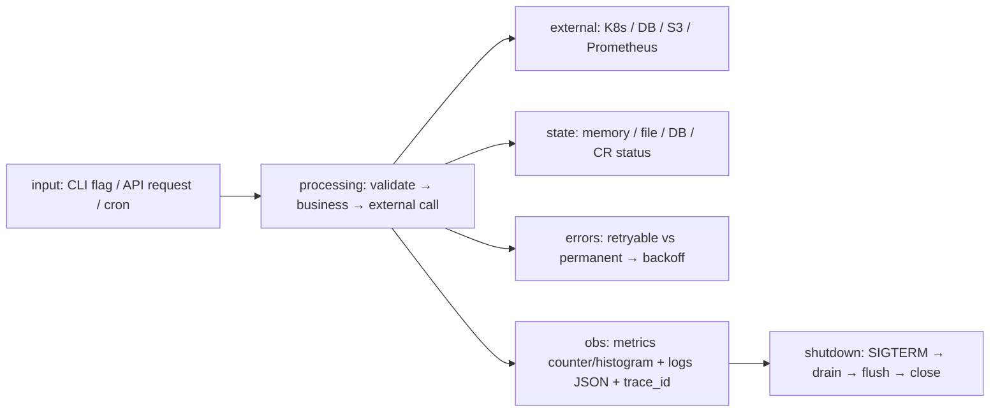

# 🧱 12. Общие DevOps паттерны и Testing Matrix

> CLI, API, Automation, Monitoring, Agents, Controllers, Workers, Schedulers, Daemons — один шаблон: `input → processing → external → state → errors → metrics → logs → shutdown`.

## 🏗️ Единый шаблон архитектуры

| Компонент | Python | Go |
|---|---|---|
| **CLI** | `typer` / `click` + `pydantic-settings` | `cobra` + `viper/koanf` |
| **Config** | `env → file → flag` (12-factor) | то же + `ConfigMap` watch |
| **API** | `FastAPI` `/health/ready/metrics` | `net/http` + `grpc` `health` |
| **Worker** | `asyncio.Queue` / `ProcessPool` | `chan` + `worker pool` `errgroup` |
| **Scheduler** | `apscheduler` / `kopf timer` | `cron` + `controller-runtime Reconcile` |
| **Daemon** | `systemd` + `signal` | `signal.NotifyContext` DaemonSet |

## 🧪 Unified Testing Matrix

| Уровень | Что тестировать | Чем (Python) | Чем (Go) | Сколько | Почему |
|---|---|---|---|---|---|
| **Unit** | функции, парсеры, бизнес-логика | `pytest` + `parametrize` + `tmp_path` | `go test -run TestParse -count=1` table-driven + `t.Helper` + `t.TempDir` | 70% тестов | быстро, deterministic |
| **Integration** | DB, K8s API, S3 (сеть) | `testcontainers` + `moto` + `respx` | `httptest.NewServer` + `testcontainers` + `envtest` (kubebuilder) | 15% | ловит wiring |
| **Contract** | API схема, CRD validation | `schemathesis` + `hypothesis` | `go test -fuzz` + `oapi-codegen` | 5% | схема дрифт |
| **API** | HTTP handlers, middleware | `fastapi.TestClient` | `httptest.NewTLSServer` + `bufconn` gRPC | 5% | headers/timeouts |
| **E2E** | kind + helm + flux | `pytest` + `kind` + `playwright` | `go test -tags=e2e` + `kind` | 3% | full stack |
| **Performance** | p99, allocations | `pytest-benchmark` + `py-spy` + `memray` | `go test -bench -benchmem` + `pprof` + `hyperfine` | 1% | SLO |
| **Security** | injection, SSRF, TLS | `bandit` + `pip-audit` + `gitleaks` | `gosec` + `govulncheck` + `gitleaks` | 1% | supply chain |
| **Fuzz/Chaos** | краш, OOM, race | `hypothesis` Fuzz + `chaos-lab` | `go test -fuzz` + `go test -race` + `goleak` | — | edge |

**Правило:** `Unit` много, `E2E` мало; Fuzz/Chaos — для Senior.

## 🔁 Production Checklist (для каждого проекта 01-12)

| Пункт | Проверка |
|---|---|
| **Configuration** | `env` + `yaml` + flag precedence, `validation` Pydantic/koanf |
| **Secrets** | `VAULT_ADDR` / ESO / `SOPS`, не в `args`, `0600` file |
| **Logging** | JSON `level/msg/trace_id` + `correlation_id` → Loki |
| **Metrics** | `counter/gauge/histogram` + `labels` cardinality capped, `/metrics` |
| **Tracing** | `trace_id` propagate `X-Request-Id` → OTel |
| **Health** | `/healthz` (liveness), `/readyz` (dependencies), `/startupz` |
| **Timeouts** | `connect 2s` + `read 5s` + `write 5s` + `context 10s` |
| **Retries/Backoff** | `jitter` + `budget` (max 3), non-retryable 4xx |
| **Concurrency limits** | `Semaphore(100)` / `chan` buffered + `SetLimit` |
| **Graceful shutdown** | `SIGTERM 30s` → `Shutdown` + `Flush` |
| **Security** | `TLS` verify, `safe_load`, `quota`, `0600` |
| **Testing** | `unit 70%` + `integration` + `fuzz` |
| **Packaging** | `pyproject`/`go.mod` + `Dockerfile` `distroless:nonroot` |
| **CI** | `ruff/mypy` / `gofmt/vet` + `test -race` + `trivy` + `SBOM` |
| **Resource limits** | `requests/limits` + `GOMEMLIMIT` / `Xmx` |
| **Failure modes** | таблица 5 сценариев |
| **Rollback** | `helm rollback` / `flux suspend` / `git revert` |

---

## ✅ Проверь себя

**В1. Почему Unit 70%, E2E 3% а не наоборот?**

Ответ

Unit — быстрые (ms), deterministic, ловят 80% багов, параллелятся. E2E — медленные (минуты), flaky, держат kind/DB, 3% покрывают интеграцию wiring, остальное — contract/API/performance.

**В2. Зачем graceful shutdown 30с в Kubernetes?**

Ответ

`SIGTERM` → `preStop` → `terminationGracePeriodSeconds: 30` → Pod IP убирается из `Endpoints` → in-flight запросы 30с добивают → `flush` метрики/логи → `close` DB. Без — 502 во время rolling.

**В3. Python `pyproject` vs Go `go.mod` — что пиннить?**

Ответ

Python: либа — loose `>=`, app — lock `uv pip compile` с хэшами `==`. Go: `go.mod` `require v1.2.3` + `go.sum` (checksum DB) — всегда пин, `go mod tidy` + `govulncheck`.

**В4. Когда `hysteresis` для триггера?**

Ответ

Чтобы не флапать: `alert: HighCPU` `avg(5m)>90` → recovery `avg(5m)<70` (hysteresis 20), + `nodata(5m)` чтобы не терять.

