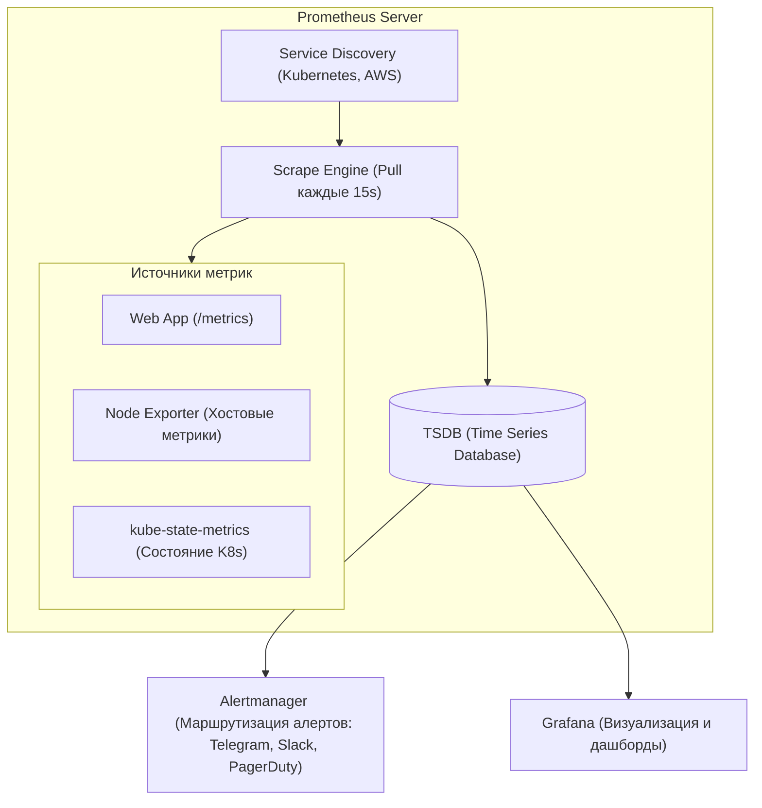

# 📊 01. Prometheus, PromQL, Alertmanager и Grafana

## 🏛️ Архитектура стека Prometheus

Prometheus использует модель **Pull (вытягивание)** метрик по HTTP эндпоинтам `/metrics` в формате OpenMetrics.



---

## 📈 4 типа метрик Prometheus

1. **`Counter` (Счетчик):** Монотонно возрастающее число (сбрасывается только при перезапуске). Пример: `http_requests_total`. Всегда используется с `rate()`.
2. **`Gauge` (Шкала):** Значение может расти и падать. Примеры: потребление памяти `node_memory_Active_bytes`, число реплик `kube_deployment_status_replicas`.
3. **`Histogram` (Гистограмма):** Распределяет замеры по корзинам (buckets). Позволяет вычислять процентили ($p50, p95, p99$) и средние значения.
4. **`Summary`:** Вычисляет процентили на стороне клиента (сложнее агрегировать в распределенной системе).

---

## ⚡ PromQL Cheat Sheet (Ключевые запросы)

### 1. Золотые сигналы (Golden Signals)
```promql
# 1. Traffic (RPS - Количество запросов в секунду по методам)
sum(rate(http_requests_total{job="web-api"}[5m])) by (method, status)

# 2. Errors (Процент 5xx ошибок от общего числа запросов)
sum(rate(http_requests_total{status=~"5.."}[5m])) 
/ 
sum(rate(http_requests_total[5m])) * 100

# 3. Latency (95-й процентиль времени ответа сервиса в секундах)
histogram_quantile(0.95, sum(rate(http_request_duration_seconds_bucket[5m])) by (le))

# 4. Saturation (Утилизация CPU ноды в процентах)
100 - (avg by (instance) (rate(node_cpu_seconds_total{mode="idle"}[5m])) * 100)
```

---

## 🚨 Prometheus Alerting Rules (Шаблон правил)

Файл `alerts.yaml`:
```yaml
groups:
  - name: production-critical-alerts
    rules:
      # Алерт: Под падает в CrashLoopBackOff
      - alert: KubernetesPodCrashLooping
        expr: increase(kube_pod_container_status_restarts_total[5m]) > 3
        for: 2m
        labels:
          severity: critical
        annotations:
          summary: "Pod {{ $labels.pod }} падает слишком часто"
          description: "Контейнер {{ $labels.container }} в namespace {{ $labels.namespace }} перезапустился более 3 раз за 5 минут."

      # Алерт: Заканчивается место на диске
      - alert: HostDiskFillingUp
        expr: (node_filesystem_avail_bytes / node_filesystem_size_bytes) * 100 < 15
        for: 5m
        labels:
          severity: warning
        annotations:
          summary: "Мало места на диске на хосте {{ $labels.instance }}"
          description: "Осталось менее 15% свободного места на файловой системе {{ $labels.mountpoint }}."
```

---

## 🔬 Deep Dive: PromQL для настоящих SLI/SLO

```promql
# Availability SLI за 28 дней (успешные / все запросы)
sum(rate(http_requests_total{job="api", code!~"5.."}[28d]))
/
sum(rate(http_requests_total{job="api"}[28d]))

# p99 latency из histogram_bucket (правильно!)
histogram_quantile(0.99,
  sum by (le) (rate(http_request_duration_seconds_bucket[5m])))

# Error budget burn rate (multi-window, Google SRE workbook):
(
  sum(rate(http_requests_total{code=~"5.."}[1h]))
/ sum(rate(http_requests_total[1h])) > (14.4 * 0.001)   # fast burn: 1h окно
and
  sum(rate(http_requests_total{code=~"5.."}[5m]))
/ sum(rate(http_requests_total[5m])) > (14.4 * 0.001)
)
```

⚠️ **Не усредняйте latency:** `avg(response_time)` скрывает боль пользователей. Только перцентили по гистограммам.

### Кардинальность — главный враг Prometheus

```promql
# Топ-10 самых «тяжелых» метрик по числу серий
topk(10, count by (__name__)({__name__=~".+"}))
```

| Антипаттерн | Серий на сервис | Правильный подход |
| :--- | :--- | :--- |
| `path` label с ID пользователя | миллионы | агрегировать роуты (`/user/:id` → `/user/:id`) |
| unbounded `pod_name` после HPA | рост с репликами | нормально, но следите за churn rate |

### Recording rules: считать заранее то, что рисуется часто

```yaml
groups:
- name: slo
  interval: 30s
  rules:
  - record: job:http_errors:ratio_rate5m
    expr: sum(rate(http_requests_total{code=~"5.."}[5m])) by (job)
        / sum(rate(http_requests_total[5m])) by (job)
```

---

<!-- enriched:v1 -->

## 🧨 Типовые грабли Production

| Симптом | Причина | Быстрое решение |
| :--- | :--- | :--- |
| Алерты не приходят / приходят пачкой | `group_wait`/`repeat_interval` настроены вслепую | Разобрать routing tree на бумаге, тест через `amtool` |
| Дашборд врет относительно реальности | Стейтмент без фильтра по job/instance | Проверить label matching, добавить legend format |
| Рост кардинальности метрик убивает Prometheus | user_id/path в labels | Ограничить cardinality, relabel drop |
| Логи «исчезают» | retention/индекс ротация | Проверить ILM/compactor настройки и объем hot-хранилища |

!!! warning «Сначала SLI, потом дашборды»
    Дашборд без определенного SLO — это арт. Определите SLI (какие запросы считаем хорошими), цель (99.9%), error budget — и только затем рисуйте панели.

## 🧪 Hands-on Lab

```bash
curl -s localhost:9090/api/v1/status/tsdb | jq '.data.headStats' && \
curl -s 'localhost:9090/api/v1/query?query=topk(10,count+by(__name__)({__name__=~%22.%2B%22}))' | jq -r '.data.result[].metric.__name__'
```

## ✅ Чек-лист зрелости темы

- [ ] Есть golden signals на каждый сервис (latency/traffic/errors/saturation)
- [ ] Алерты actionable: каждый требует действия, а не просто информирует
- [ ] Настроены inhibition rules: падение ноды глушит её дочерние алерты
- [ ] Runbook ссылка внутри каждого алерта
- [ ] Проведен учение: симулировали инцидент, проверили доставку нотификаций
