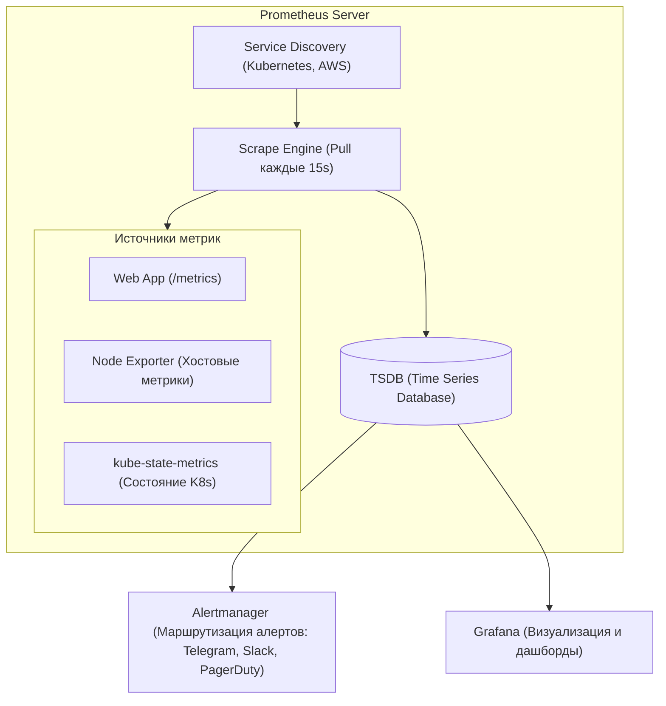

# 📊 01. Prometheus, PromQL, Alertmanager и Grafana

## 🏛️ Архитектура стека Prometheus

Prometheus использует модель **Pull (вытягивание)** метрик по HTTP эндпоинтам `/metrics` в формате OpenMetrics.



---

## 📈 4 типа метрик Prometheus

1. **`Counter` (Счетчик):** Монотонно возрастающее число (сбрасывается только при перезапуске). Пример: `http_requests_total`. Всегда используется с `rate()`.
2. **`Gauge` (Шкала):** Значение может расти и падать. Примеры: потребление памяти `node_memory_Active_bytes`, число реплик `kube_deployment_status_replicas`.
3. **`Histogram` (Гистограмма):** Распределяет замеры по корзинам (buckets). Позволяет вычислять процентили ($p50, p95, p99$) и средние значения.
4. **`Summary`:** Вычисляет процентили на стороне клиента (сложнее агрегировать в распределенной системе).

---

## ⚡ PromQL Cheat Sheet (Ключевые запросы)

### 1. Золотые сигналы (Golden Signals)
```promql
# 1. Traffic (RPS - Количество запросов в секунду по методам)
sum(rate(http_requests_total{job="web-api"}[5m])) by (method, status)

# 2. Errors (Процент 5xx ошибок от общего числа запросов)
sum(rate(http_requests_total{status=~"5.."}[5m])) 
/ 
sum(rate(http_requests_total[5m])) * 100

# 3. Latency (95-й процентиль времени ответа сервиса в секундах)
histogram_quantile(0.95, sum(rate(http_request_duration_seconds_bucket[5m])) by (le))

# 4. Saturation (Утилизация CPU ноды в процентах)
100 - (avg by (instance) (rate(node_cpu_seconds_total{mode="idle"}[5m])) * 100)
```

---

## 🚨 Prometheus Alerting Rules (Шаблон правил)

Файл `alerts.yaml`:
```yaml
groups:
  - name: production-critical-alerts
    rules:
      # Алерт: Под падает в CrashLoopBackOff
      - alert: KubernetesPodCrashLooping
        expr: increase(kube_pod_container_status_restarts_total[5m]) > 3
        for: 2m
        labels:
          severity: critical
        annotations:
          summary: "Pod {{ $labels.pod }} падает слишком часто"
          description: "Контейнер {{ $labels.container }} в namespace {{ $labels.namespace }} перезапустился более 3 раз за 5 минут."

      # Алерт: Заканчивается место на диске
      - alert: HostDiskFillingUp
        expr: (node_filesystem_avail_bytes / node_filesystem_size_bytes) * 100 < 15
        for: 5m
        labels:
          severity: warning
        annotations:
          summary: "Мало места на диске на хосте {{ $labels.instance }}"
          description: "Осталось менее 15% свободного места на файловой системе {{ $labels.mountpoint }}."
```

---

## 🔬 Deep Dive: PromQL для настоящих SLI/SLO

```promql
# Availability SLI за 28 дней (успешные / все запросы)
sum(rate(http_requests_total{job="api", code!~"5.."}[28d]))
/
sum(rate(http_requests_total{job="api"}[28d]))

# p99 latency из histogram_bucket (правильно!)
histogram_quantile(0.99,
  sum by (le) (rate(http_request_duration_seconds_bucket[5m])))

# Error budget burn rate (multi-window, Google SRE workbook):
(
  sum(rate(http_requests_total{code=~"5.."}[1h]))
/ sum(rate(http_requests_total[1h])) > (14.4 * 0.001)   # fast burn: 1h окно
and
  sum(rate(http_requests_total{code=~"5.."}[5m]))
/ sum(rate(http_requests_total[5m])) > (14.4 * 0.001)
)
```

⚠️ **Не усредняйте latency:** `avg(response_time)` скрывает боль пользователей. Только перцентили по гистограммам.

### Кардинальность — главный враг Prometheus

```promql
# Топ-10 самых «тяжелых» метрик по числу серий
topk(10, count by (__name__)({__name__=~".+"}))
```

| Антипаттерн | Серий на сервис | Правильный подход |
| :--- | :--- | :--- |
| `path` label с ID пользователя | миллионы | агрегировать роуты (`/user/:id` → `/user/:id`) |
| unbounded `pod_name` после HPA | рост с репликами | нормально, но следите за churn rate |

### Recording rules: считать заранее то, что рисуется часто

```yaml
groups:
- name: slo
  interval: 30s
  rules:
  - record: job:http_errors:ratio_rate5m
    expr: sum(rate(http_requests_total{code=~"5.."}[5m])) by (job)
        / sum(rate(http_requests_total[5m])) by (job)
```

---

<!-- enriched:v1 -->

## 🧨 Типовые грабли Production (Prometheus — только эта тема)

| Симптом | Причина | Быстрое решение |
| :--- | :--- | :--- |
| `PromQL: rate` 0 при нагрузке | Окно `[1m]` < `2× scrape_interval` | `rate(metric[5m])` при `scrape 15s` → 4× |
| `histogram_quantile` показывает `NaN` | `le` лейбл отсутствует / `avg` вместо гистограммы | `histogram_quantile(0.99, sum(rate(bucket[5m])) by (le))` |
| `increase` скачёт на рестарте пода | Counter сбросился, `rate` пик | Использовать `increase`/`rate` — они сглаживают, не `value - prev` |
| Кардинальность 500k, Prometheus OOM | `user_id` в `labels` | `relabel_configs: - action: drop` + `metric_relabel_configs` |
| `up==0` targets `down` после деплоя | `job` лейбл mismatch `relabel` | `curl http://target:9090/metrics`, `prometheus --log.level=debug` |

!!! warning «Сначала SLI, потом дашборды»
    Дашборд без определенного SLO — это арт. Определите SLI (какие запросы считаем хорошими), цель (99.9%), error budget — и только затем рисуйте панели.

## 🧪 Hands-on Lab (30 минут): от метрики до алерта

!!! abstract "Формат"
    **Стенд:** docker-compose с Prometheus + demo-приложением. **Легенда:** вы добавляете наблюдаемость новому сервису и ловите первый инцидент.

### Шаг 1. Стенд за одну команду

```bash
mkdir obs-lab && cd obs-lab && cat > prometheus.yml <<'EOF'
global: { scrape_interval: 5s }          # короткий интервал для наглядности
scrape_configs:
  - job_name: demo
    static_configs:
      - targets: ["demo-app:8000"]
EOF
cat > docker-compose.yml <<'EOF'
services:
  demo-app:
    image: quay.io/brancz/prometheus-example-app:v0.5.0
    ports: ["8000:8000"]
  prometheus:
    image: prom/prometheus:v2.53.0
    volumes: ["./prometheus.yml:/etc/prometheus/prometheus.yml"]
    ports: ["9090:9090"]
EOF
docker compose up -d && sleep 10
curl -s localhost:9090/api/v1/targets | jq '.data.activeTargets[].health'   # "up"
```

### Шаг 2. Первые запросы PromQL — понять типы метрик

```bash
# Counter: rate обязателен!
curl -s 'localhost:9090/api/v1/query?query=rate(http_requests_total%5B1m%5D)' | jq '.data.result[].value'
# Gauge: текущее значение напрямую
curl -s 'localhost:9090/api/v1/query?query=demo_batch_last_success_timestamp_seconds' | jq -c '.data.result[].metric'
```

**Ожидаемый вывод:** серии с метками `code="200|500", method="get"`.

??? question "Почему нельзя строить графики от http_requests_total напрямую?"
    Это счётчик: он только растёт и переживает рестарты (сброс в 0). График покажет «пилу», а не нагрузку. Всегда `rate()`/`increase()` — они учитывают сбросы и дают единицу «запросов в секунду».

### Шаг 3. Генерируем ошибку и пишем алерт

```bash
# Нагрузим 404-ми, чтобы появился error-rate:
for i in $(seq 1 50); do curl -s localhost:8000/badpath > /dev/null & done; wait

# Проверяем выражение будущего алерта:
curl -s 'localhost:9090/api/v1/query?query=sum(rate(http_requests_total%7Bcode%3D~%225..%22%7D%5B1m%5D))%20/%20sum(rate(http_requests_total%5B1m%5D))' \
  | jq '.data.result[].value[1]'
```

**Ожидаемый вывод:** доля ошибок > 0. Добавим правило:

```yaml
cat >> prometheus.yml <<'EOF'
rule_files: [alerts.yml]
EOF
cat > alerts.yml <<'EOF'
groups:
  - name: demo
    rules:
      - alert: HighErrorRate
        expr: sum(rate(http_requests_total{code=~"5.."}[1m])) / sum(rate(http_requests_total[1m])) > 0.05
        for: 30s
        labels: { severity: warning }
        annotations:
          summary: "Доля 5xx выше 5%"
          runbook_url: "https://wiki/runbooks/high-error-rate"
EOF
docker compose restart prometheus && sleep 10
curl -s localhost:9090/api/v1/rules | jq '.data.groups[].rules[].health'   # "ok"
```

**Критерий успеха:** алерт виден в UI (`/alerts`), состояние firing при повторной атаке 404.

### Шаг 4. Проверь себя (ответы вслух до раскрытия)

1. Histogram vs Summary для латентности — что выбрать и почему?
2. Почему окно rate должно быть ≥ 2× scrape interval?
3. Алерт горит 10 минут, потом сам погас — что вы потеряли, если не смотрели?

<details><summary>Ответы</summary>

1. Histogram: квантили считаются на сервере агрегацией по le, можно менять p99→p95 без релиза; Summary — квантиль посчитан на клиенте, не агрегируется.
2. rate требует ≥2 точек в окне; при меньшем окне будут пропуски/нули.
3. Сигнал о деградации: кратковременные пожары складываются в error budget; нужен keep_firing_for или анализ истории.
</details>

## ✅ Чек-лист зрелости темы

- [ ] Есть golden signals на каждый сервис (latency/traffic/errors/saturation)

    ??? tip "Как закрыть пункт"
        Для каждого сервиса: RPS (traffic), error ratio, latency p99 из histogram, saturation (queue depth/pool usage). Дашборд RED+USE собран из [шаблона 09.8](08-grafana-dashboards-as-code.md), не из UI.

- [ ] Алерты actionable: каждый требует действия, а не просто информирует

    ??? tip "Как закрыть пункт"
        Тест каждого правила: «что я сделаю, увидев это?» Нет действия → правило в дашборд, не в пейджер. Пороги через burn-rate относительно SLO ([09.6](06-alertmanager-and-dashboards-mastery.md)).

- [ ] Настроены inhibition rules: падение ноды глушит её дочерние алерты

    ??? tip "Как закрыть пункт"
        equal: [node] между NodeDown и сервисными алертами этого узла. Проверка учением: выключите узел — должен прийти один алерт, а не двадцать.

- [ ] Runbook ссылка внутри каждого алерта

    ??? tip "Как закрыть пункт"
        annotation runbook_url обязательна (lint правил); ссылка ведёт на раздел с командами диагностики, а не на главную вики. Шаблон runbook — [13.2](../13-disaster-recovery-and-tools/02-database-backups-and-dr-plan.md).

- [ ] Проведен учение: симулировали инцидент, проверили доставку нотификаций

    ??? tip "Как закрыть пункт"
        Раз в квартал: amtool silence проверить, дрель из chaos-lab.sh, замерить MTTA от алерта до реакции. Результат учения — в постмортем-журнал команды.

---

## 🧭 Что дальше

| Шаг | Материал |
| :--- | :--- |
| 🔬 Закрепить | [Lab 06: стек мониторинга](../16-guided-labs/06-lab-observability-stack.md) |
| 💪 Практика | [Задачи по Observability](../15-hands-on-practice/02-100-devops-practical-tasks-part2.md) |
| 🎤 Проверить себя | [Вопросы: PromQL](../14-interview-prep/04-100-devops-interview-questions-bank-part2.md) |
