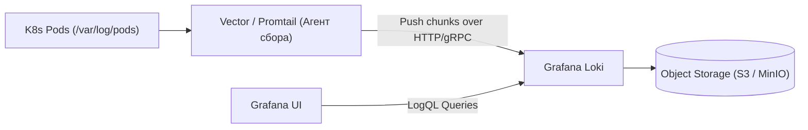
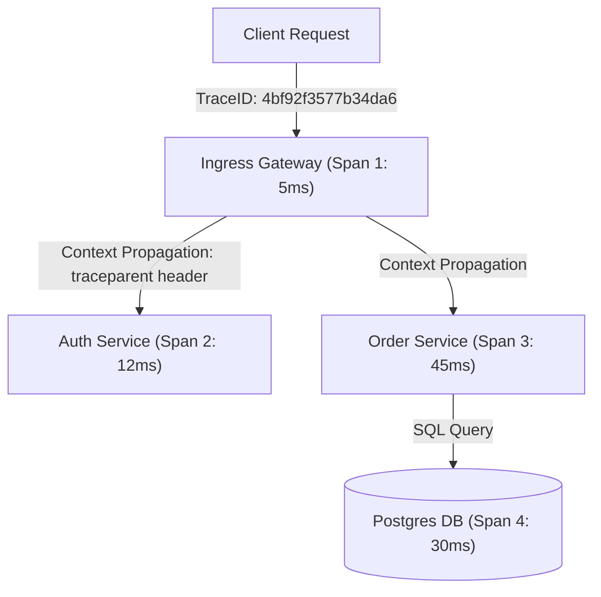

# 📜 02. Сбор логов (Vector, Loki) и Трассировка (OpenTelemetry)

## 🌲 Централизованное логирование: Grafana Loki

В отличие от тяжелого Elasticsearch/OpenSearch, **Grafana Loki** не индексирует весь текст логов, а индексирует только метаданные (лейблы: `namespace`, `pod`, `app`). Сами сырые логи сжимаются и сохраняются в дешевое объектное хранилище (S3/MinIO).



---

## ⚡ LogQL Cheat Sheet (Запросы к логам в Grafana)

```logql
# 1. Простой поиск всех логов приложения в production
{namespace="production", app="web-api"}

# 2. Фильтрация строк по подстроке (поиск ошибок)
{namespace="production", app="web-api"} |= "ERROR" != "timeout_ignored"

# 3. Парсинг JSON-логов и фильтрация по структурированным полям
{app="payment-service"} 
  | json 
  | status_code >= 500 
  | line_format "🚨 [{{.status_code}}] {{.path}} - User: {{.user_id}} Error: {{.error_msg}}"

# 4. Превращение логов в метрики: Расчет количества ошибок в секунду (RPS ошибок)
sum by (status_code) (
  rate({app="payment-service"} | json | status_code >= 400 [5m])
)
```

---

## 🚀 Высокопроизводительный сборщик: Vector

**Vector** (написан на Rust) потребляет в 10 раз меньше памяти, чем Logstash или Fluentd, и выполняет предобработку логов на лету:

Пример `vector.yaml`:
```yaml
sources:
  kubernetes_logs:
    type: kubernetes_logs

transforms:
  parse_json_logs:
    type: remap
    inputs: ["kubernetes_logs"]
    source: |
      # Парсим JSON и удаляем чувствительные данные (маскирование кредиток)
      .parsed = parse_json(.message) ?? {}
      if exists(.parsed.credit_card) {
        .parsed.credit_card = "REDACTED"
      }

sinks:
  loki_out:
    type: loki
    inputs: ["parse_json_logs"]
    endpoint: "http://loki-gateway.monitoring:3100"
    labels:
      namespace: "{{ kubernetes.pod_namespace }}"
      app: "{{ kubernetes.pod_labels.app }}"
    encoding:
      codec: json
```

---

## 🛰️ Распределенная трассировка (OpenTelemetry & Jaeger / Tempo)

Трассировка позволяет отследить путь одного клиентского запроса через десятки микросервисов.



- **Trace:** Полное дерево выполнения запроса от входа до выхода.
- **Span:** Отдельный шаг/вызов внутри сервиса (например, вызов стороннего API или SQL-запрос).
- **OpenTelemetry Collector (OTel):** Вендор-нейтральный прокси для приема, фильтрации и отправки трейсов в Jaeger, Grafana Tempo или Datadog.

---

## 🔬 Deep Dive: Loki label strategy — главная ошибка новичков

Lindi индексирует только лейблы. Каждый уникальный набор лейблов = отдельный поток (stream).

```logql
# ХОРОШО: мало кардинальных лейблов
{app="api", namespace="prod", level="error"}
  | json | line_format "{{.msg}} {{.trace_id}}"

# Метрики из логов: RPS ошибок по коду
sum by (code) (rate({app="api"} | json | status >= 500 [5m]))

# Топ медленных эндпоинтов
topk(5, sum by (route) (rate({app="api"} | json | duration_ms > 500 [5m])))
```

**Правило:** `user_id`, `pod_ip`, `request_id` — только парсингом внутри строки (`| json`), НИКОГДА лейблами.

### OpenTelemetry: единый контекст через все системы

```text
TraceID генерируется на ingress
  → HTTP header traceparent: 00-{trace-id}-{span-id}-01
  → каждый микросервис создает child span
  → логи содержат trace_id → кликабельны из Grafana Tempo!
```

```bash
# Проверка экспорта OTLP
curl -s localhost:4318/v1/traces -X POST \
  -H 'Content-Type: application/x-protobuf' --data-binary @span.bin -o /dev/null -w '%{http_code}\n'
```

Sampling стратегия: head-based 10% для трафика + **всегда сохранять трейсы с errors** (`tail sampling` в Alloy/OTel Collector).

---

<!-- enriched:v1 -->

## 🧨 Типовые грабли Production (Loki — только эта тема)

| Симптом | Причина | Быстрое решение |
| :--- | :--- | :--- |
| `LogQL: rate({...} |= "error" [5m])` 0 | Нет `| json` парсинга перед фильтром | `{app="myapp"} | json | level="error" | rate` |
| Кардинальность `__stream` взрывается | Высокий `label` `request_id` в `stream` | `label` только `app/env`, `request_id` в `detected_fields` |
| `ingester: too many outstanding requests` | `chunk_target_size` мал / `replication_factor` 3 перегруз | `ingester.chunk_target_size: 1.5MB`, `limits_config.ingestion_rate_mb` |
| `Loki: failed to flush chunks` диск | `table_manager` retention vs `compactor` retention mismatch | `compactor.retention_enabled: true`, `limits_config.retention_period: 30d` |

!!! warning «Сначала SLI, потом дашборды»
    Дашборд без определенного SLO — это арт. Определите SLI (какие запросы считаем хорошими), цель (99.9%), error budget — и только затем рисуйте панели.

## 🧪 Hands-on Lab

```bash
curl -s localhost:3100/metrics | grep loki_distributor_lines_received_total && \
curl -sG localhost:3100/loki/api/v1/query_range --data-urlencode 'query={app="api"}' --data-urlencode 'limit=5' | jq '.data.result[].values | length'
```

## ✅ Чек-лист зрелости темы

- [ ] Есть golden signals на каждый сервис (latency/traffic/errors/saturation)

    ??? tip "Как закрыть пункт"
        Четыре сигнала видны на дашборде сервиса: RPS, error ratio, latency p99 (histogram), saturation (очереди/пулы). Собраны provisioning'ом как код ([09.8](08-grafana-dashboards-as-code.md)), а не руками в UI.

- [ ] Алерты actionable: каждый требует действия, а не просто информирует

    ??? tip "Как закрыть пункт"
        Тест правила: «что я сделаю, увидев?» Нет действия → это дашборд-метрика, убрать из пейджера. Пороги — burn-rate относительно SLO ([09.6](06-alertmanager-and-dashboards-mastery.md)). Аудит: % алертов с реальными действиями за месяц.

- [ ] Настроены inhibition rules: падение ноды глушит её дочерние алерты

    ??? tip "Как закрыть пункт"
        equal: [node] связывает NodeDown с сервисными правилами этого узла — один инцидент = один алерт вместо двадцати. Проверка учением: выключить узел, убедиться в единственной нотификации.

- [ ] Runbook ссылка внутри каждого алерта

    ??? tip "Как закрыть пункт"
        annotation runbook_url обязателен (lint правил), ведёт на конкретные команды диагностики, не на главную вики. Шаблон runbook — [13.2](../13-disaster-recovery-and-tools/02-database-backups-and-dr-plan.md).

- [ ] Проведен учение: симулировали инцидент, проверили доставку нотификаций

    ??? tip "Как закрыть пункт"
        Раз в квартал: дрель хаоса → проверить путь правило→AM→канал, замерить MTTA. Заодно проверить silence/amtool и эскалации. Итог учения фиксируется.

---

## 🧭 Что дальше

| Шаг | Материал |
| :--- | :--- |
| 🔬 Закрепить | [Lab 06: Loki и алерты](../16-guided-labs/06-lab-observability-stack.md) |
| ➡️ Дальше | [Alloy cookbook: единый коллектор](07-alloy-pipelines-cookbook.md) |

---

## ✅ Проверь себя

**В1. Почему кардинальность лейблов Loki критична?**
<details><summary>Ответ</summary>
Каждая уникальная комбинация label'ов = отдельный stream/index. Лейбл с pod_id/user_id создаёт миллионы стримов → взрыв индекса и деградация запросов. Правило: в labels только низкокардинальные поля (namespace, app, level); высококардиональные — внутрь строки лога.
</details>

**В2. Что такое trace context propagation и какой стандарт?**
<details><summary>Ответ</summary>
Передача идентификаторов трейсинга через сервисные границы: W3C Trace Context — заголовки traceparent/tracestate (trace-id, span-id, flags). Без прокидывания контекста каждый сервис рисует независимые трейсы и сквозной путь запроса не собирается.
</details>

**В3. Чем структурированные логи лучше строковых?**
<details><summary>Ответ</summary>
JSON-логи фильтруются по полям без regex-парсинга: query по level/service/request_id точен и быстр. Строковые требуют grok-паттернов на ingestion, ломаются при смене формата. Плюс machine-readable для алертов.
</details>

**В4. Sampling трейсов: почему head-based недостаточно?**
<details><summary>Ответ</summary>
Head-based решает сохранить/выбросить трейс в начале — теряются редкие ошибки (решение принято до их появления). Tail-based собирает весь трейс и фильтрует по результату (все errors + 5% успешных) — дороже памятью, но не теряет инциденты.
</details>
