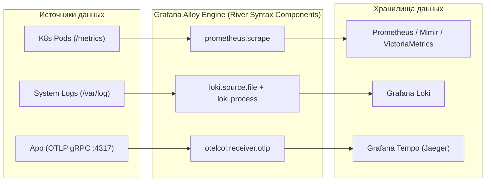

# ⚡ 03. Grafana Alloy: Единый коллектор телеметрии (Metrics, Logs, Traces)

## 🌟 Что такое Grafana Alloy?

**Grafana Alloy** — это современный OpenTelemetry-совместимый коллектор телеметрии от Grafana Labs (пришел на смену устаревшему `Grafana Agent`). Он объединяет сбор **метрик (Prometheus), логов (Loki), трассировок (Tempo/OTel) и профилирования (Pyroscope)** в единый бинарный процесс.



---

## 📝 Конфигурационный язык River: Пример `config.alloy`

Язык конфигурации **River** вдохновлен Terraform HCL: он декларативен и связывает компоненты через направленные графы (DAG):

```river
// -------------------------------------------------------------
// 1. Сбор метрик Kubernetes подов по аннотациям
// -------------------------------------------------------------
discovery.kubernetes "k8s_pods" {
  role = "pod"
}

prometheus.scrape "pods_scraper" {
  targets    = discovery.kubernetes.k8s_pods.targets
  forward_to = [prometheus.remote_write.mimir_backend.receiver]
  scrape_interval = "15s"
}

prometheus.remote_write "mimir_backend" {
  endpoint {
    url = "http://mimir-gateway.monitoring:8080/api/v1/push"
  }
}

// -------------------------------------------------------------
// 2. Прием трассировок по протоколу OpenTelemetry (OTLP)
// -------------------------------------------------------------
otelcol.receiver.otlp "default" {
  grpc {
    endpoint = "0.0.0.0:4317"
  }
  http {
    endpoint = "0.0.0.0:4318"
  }

  output {
    traces = [otelcol.exporter.otlp.tempo_backend.input]
  }
}

otelcol.exporter.otlp "tempo_backend" {
  client {
    endpoint = "tempo-distributor.monitoring:4317"
    tls {
      insecure = true
    }
  }
}

// -------------------------------------------------------------
// 3. Сбор и парсинг логов контейнеров
// -------------------------------------------------------------
loki.source.kubernetes "pod_logs" {
  targets    = discovery.kubernetes.k8s_pods.targets
  forward_to = [loki.process.filter_logs.receiver]
}

loki.process "filter_logs" {
  stage.json {
    expressions = { output = "log", stream = "stream" }
  }

  forward_to = [loki.write.loki_backend.receiver]
}

loki.write "loki_backend" {
  endpoint {
    url = "http://loki-gateway.monitoring:3100/loki/api/v1/push"
  }
}
```

---

## ⚡ Развертывание в Kubernetes через Helm

```bash
# Добавление репозитория Grafana
helm repo add grafana https://grafana.github.io/helm-charts
helm repo update

# Установка Grafana Alloy в режиме DaemonSet на все ноды
helm upgrade --install alloy grafana/alloy \
  --namespace monitoring \
  --create-namespace \
  --set alloy.clustering.enabled=true
```

---

## 🔬 Deep Dive: Alloy River конфиг — компонентная модель

Alloy (наследник Grafana Agent Flow) описывается на языке River: всё есть компоненты со входами/выходами.

```river
// Сбор логов Kubernetes
discovery.kubernetes "pods" {
  role = "pod"
}

discovery.relabel "pods" {
  targets = discovery.kubernetes.pods.targets
  rule {
    source_labels = ["__meta_kubernetes_pod_label_app"]
    target_label  = "app"
  }
}

loki.source.kubernetes "pods" {
  targets    = discovery.relabel.pods.output
  forward_to = [loki.write.default.receiver]
}

loki.write "default" {
  endpoint { url = "http://loki-gateway.monitoring.svc/loki/api/v1/push" }
}

// Метрики тоже сюда же — один агент вместо promtail+otel-collector
prometheus.scrape "demo" {
  targets = [{__address__ = "localhost:12345"}]
  forward_to = [prometheus.remote_write.mimir.receiver]
}
```

### Миграция Promtail → Alloy: чек-лист

1. Promtail deprecated с марта 2025 — миграция обязательна.
2. `alloy convert --source-format=promtail promtail.yml > config.alloy` — автоконвертация.
3. Проверьте pipeline_stages: `json/labeldrop/regex` → `loki.process` stage'и.
4. Cluster-режим: `alloy cluster` для HA распределения нагрузки.

!!! tip «Почему Alloy, а не OTel Collector напрямую»
    Полная совместимость с OTel + встроенный UI отладки (`--stability.level=experimental`) + единый синтаксис River для метрик/логов/трейсов/профилей.

---

<!-- enriched:v1 -->

## 🧨 Типовые грабли Production

| Симптом | Причина | Быстрое решение |
| :--- | :--- | :--- |
| Алерты не приходят / приходят пачкой | `group_wait`/`repeat_interval` настроены вслепую | Разобрать routing tree на бумаге, тест через `amtool` |
| Дашборд врет относительно реальности | Стейтмент без фильтра по job/instance | Проверить label matching, добавить legend format |
| Рост кардинальности метрик убивает Prometheus | user_id/path в labels | Ограничить cardinality, relabel drop |
| Логи «исчезают» | retention/индекс ротация | Проверить ILM/compactor настройки и объем hot-хранилища |

!!! warning «Сначала SLI, потом дашборды»
    Дашборд без определенного SLO — это арт. Определите SLI (какие запросы считаем хорошими), цель (99.9%), error budget — и только затем рисуйте панели.

## 🧪 Hands-on Lab

```bash
kubectl -n monitoring logs deploy/grafana-alloy --tail=20 && \
kubectl -n monitoring exec deploy/grafana-alloy -- wget -qO- localhost:12345/metrics 2>/dev/null | grep alloy_component | head
```

## ✅ Чек-лист зрелости темы

- [ ] Есть golden signals на каждый сервис (latency/traffic/errors/saturation)
- [ ] Алерты actionable: каждый требует действия, а не просто информирует
- [ ] Настроены inhibition rules: падение ноды глушит её дочерние алерты
- [ ] Runbook ссылка внутри каждого алерта
- [ ] Проведен учение: симулировали инцидент, проверили доставку нотификаций
