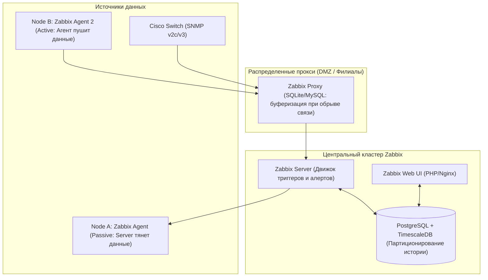

# 🦖 04. Корпоративный мониторинг Zabbix: Архитектура, Агенты и LLD

## 🏛️ Архитектура Zabbix Enterprise

**Zabbix** — классическая распределенная система мониторинга корпоративного уровня, отлично подходящая для физических серверов, гипервизоров (VMware/Proxmox), СХД, баз данных и сетевого оборудования (SNMP).



---

## ⚡ Active против Passive проверок в Zabbix Agent

| Параметр | Пассивные проверки (Passive Checks) | Активные проверки (Active Checks) |
| :--- | :--- | :--- |
| **Инициатор связи** | **Zabbix Server / Proxy** подключается к порту 10050 агента. | **Zabbix Agent 2** сам подключается к порту 10051 сервера. |
| **Файрвол / NAT** | Требуется открытие входящих портов на целевом сервере. | **Работает за NAT/Firewall**, открытых портов на сервере не требуется. |
| **Нагрузка на сервер** | Высокая (сервер держит тысячи исходящих TCP сокетов). | Низкая (агент забирает список задач и шлет пачку метрик раз в минуту). |

---

## 🔍 Низкоуровневое обнаружение: Low-Level Discovery (LLD)

LLD позволяет Zabbix автоматически находить и ставить на мониторинг динамические сущности: физические диски, сетевые интерфейсы, Docker-контейнеры, таблицы баз данных.

### Принцип работы LLD:
1. Discovery Rule выполняет скрипт или команду агента (например, `vfs.fs.discovery`).
2. Агент возвращает JSON со списком макросов:
```json
[
  {"{#FSNAME}": "/", "{#FSTYPE}": "ext4"},
  {"{#FSNAME}": "/data", "{#FSTYPE}": "xfs"},
  {"{#FSNAME}": "/var/log", "{#FSTYPE}": "ext4"}
]
```
3. Zabbix автоматически создает **Элементы данных (Item Prototypes)**, **Триггеры (Trigger Prototypes)** и **Графики** для каждого найденного диска.

---

## ⚖️ Zabbix против Prometheus: Что выбрать?

| Критерий | Zabbix | Prometheus |
| :--- | :--- | :--- |
| **Основной стек** | Железо, Bare-metal, СХД, SNMP свитчи, классические VM | Kubernetes, микросервисы, Cloud-Native, динамические поды |
| **Формат метрик** | Одиночные значения + Текстовая история | Многомерные Time-Series с лейблами (Labels/PromQL) |
| **Хранилище** | Реляционная БД (Postgres/MySQL) | Специализированная TSDB (Append-only blocks) |
| **Порог входа** | Удобный Web UI, настройка мышкой из коробки | Код как конфиг (Yaml, GitOps, Helm, Grafana) |

---

## 🔬 Deep Dive: LLD автодискавери и когда Zabbix лучше Prometheus

LLD (Low-Level Discovery) автоматически создает items/triggers для каждой найденной сущности:

```json
{ "data": [
    { "{#DISK}": "/",     "{#FS_TYPE}": "ext4" },
    { "{#DISK}": "/var",  "{#FS_TYPE}": "xfs"  }
] }
```

Prototype item: `vfs.fs.size[{#DISK},pfree]` → Zabbix сам создаст метрики для каждого диска.

### Zabbix vs Prometheus: честное сравнение

| Критерий | Zabbix | Prometheus |
| :--- | :--- | :--- |
| Модель данных | items (плоские) | многомерные series |
| Сбор | push агенты, SNMP, IPMI, SSH | pull по HTTP |
| Алертинг | встроенный (escalations) | Alertmanager (отдельный) |
| Сила | legacy железо, SNMP-свитчи, БД шаблоны | cloud-native, K8s, длинные запросы |
| HA | встроенный HA proxy режим | Thanos/Mimir/Cortex |

Гибрид — норма: Zabbix мониторит сетевое оборудование и legacy VM, Prometheus — K8s; оба алертят в единую дежурную систему.

### Тюнинг housekeeper (частая причина тормозов Zabbix)

```ini
# zabbix_server.conf
HousekeepingFrequency=1
MaxHousekeeperDelete=5000
CacheSize=2G
HistoryCacheSize=512M
StartPollers=50
StartTrappers=20
```

---

<!-- enriched:v1 -->

## 🧨 Типовые грабли Production

| Симптом | Причина | Быстрое решение |
| :--- | :--- | :--- |
| Алерты не приходят / приходят пачкой | `group_wait`/`repeat_interval` настроены вслепую | Разобрать routing tree на бумаге, тест через `amtool` |
| Дашборд врет относительно реальности | Стейтмент без фильтра по job/instance | Проверить label matching, добавить legend format |
| Рост кардинальности метрик убивает Prometheus | user_id/path в labels | Ограничить cardinality, relabel drop |
| Логи «исчезают» | retention/индекс ротация | Проверить ILM/compactor настройки и объем hot-хранилища |

!!! warning «Сначала SLI, потом дашборды»
    Дашборд без определенного SLO — это арт. Определите SLI (какие запросы считаем хорошими), цель (99.9%), error budget — и только затем рисуйте панели.

## 🧪 Hands-on Lab

```bash
zabbix_server -R diaginfo 2>/dev/null || docker exec zabbix-server zabbix_server -R diaginfo; \
ps aux | grep zabbix | head -5 && curl -s http://localhost:10051/api_jsonrpc.php -X POST -H 'Content-Type: application/json-rpc' -d '{"jsonrpc":"2.0","method":"apiinfo.version","params":{},"id":1}' | head -c 200
```

## ✅ Чек-лист зрелости темы

- [ ] Есть golden signals на каждый сервис (latency/traffic/errors/saturation)
- [ ] Алерты actionable: каждый требует действия, а не просто информирует
- [ ] Настроены inhibition rules: падение ноды глушит её дочерние алерты
- [ ] Runbook ссылка внутри каждого алерта
- [ ] Проведен учение: симулировали инцидент, проверили доставку нотификаций
