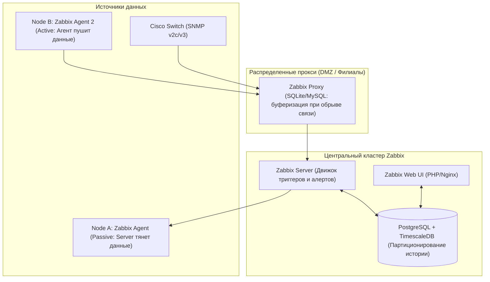

# 🦖 04. Корпоративный мониторинг Zabbix: Архитектура, Агенты и LLD

## 🏛️ Архитектура Zabbix Enterprise

**Zabbix** — классическая распределенная система мониторинга корпоративного уровня, отлично подходящая для физических серверов, гипервизоров (VMware/Proxmox), СХД, баз данных и сетевого оборудования (SNMP).



---

## ⚡ Active против Passive проверок в Zabbix Agent

| Параметр | Пассивные проверки (Passive Checks) | Активные проверки (Active Checks) |
| :--- | :--- | :--- |
| **Инициатор связи** | **Zabbix Server / Proxy** подключается к порту 10050 агента. | **Zabbix Agent 2** сам подключается к порту 10051 сервера. |
| **Файрвол / NAT** | Требуется открытие входящих портов на целевом сервере. | **Работает за NAT/Firewall**, открытых портов на сервере не требуется. |
| **Нагрузка на сервер** | Высокая (сервер держит тысячи исходящих TCP сокетов). | Низкая (агент забирает список задач и шлет пачку метрик раз в минуту). |

---

## 🔍 Низкоуровневое обнаружение: Low-Level Discovery (LLD)

LLD позволяет Zabbix автоматически находить и ставить на мониторинг динамические сущности: физические диски, сетевые интерфейсы, Docker-контейнеры, таблицы баз данных.

### Принцип работы LLD:
1. Discovery Rule выполняет скрипт или команду агента (например, `vfs.fs.discovery`).
2. Агент возвращает JSON со списком макросов:
```json
[
  {"{#FSNAME}": "/", "{#FSTYPE}": "ext4"},
  {"{#FSNAME}": "/data", "{#FSTYPE}": "xfs"},
  {"{#FSNAME}": "/var/log", "{#FSTYPE}": "ext4"}
]
```
3. Zabbix автоматически создает **Элементы данных (Item Prototypes)**, **Триггеры (Trigger Prototypes)** и **Графики** для каждого найденного диска.

---

## ⚖️ Zabbix против Prometheus: Что выбрать?

| Критерий | Zabbix | Prometheus |
| :--- | :--- | :--- |
| **Основной стек** | Железо, Bare-metal, СХД, SNMP свитчи, классические VM | Kubernetes, микросервисы, Cloud-Native, динамические поды |
| **Формат метрик** | Одиночные значения + Текстовая история | Многомерные Time-Series с лейблами (Labels/PromQL) |
| **Хранилище** | Реляционная БД (Postgres/MySQL) | Специализированная TSDB (Append-only blocks) |
| **Порог входа** | Удобный Web UI, настройка мышкой из коробки | Код как конфиг (Yaml, GitOps, Helm, Grafana) |

---

## 🔬 Deep Dive: LLD автодискавери и когда Zabbix лучше Prometheus

LLD (Low-Level Discovery) автоматически создает items/triggers для каждой найденной сущности:

```json
{ "data": [
    { "{#DISK}": "/",     "{#FS_TYPE}": "ext4" },
    { "{#DISK}": "/var",  "{#FS_TYPE}": "xfs"  }
] }
```

Prototype item: `vfs.fs.size[{#DISK},pfree]` → Zabbix сам создаст метрики для каждого диска.

### Zabbix vs Prometheus: честное сравнение

| Критерий | Zabbix | Prometheus |
| :--- | :--- | :--- |
| Модель данных | items (плоские) | многомерные series |
| Сбор | push агенты, SNMP, IPMI, SSH | pull по HTTP |
| Алертинг | встроенный (escalations) | Alertmanager (отдельный) |
| Сила | legacy железо, SNMP-свитчи, БД шаблоны | cloud-native, K8s, длинные запросы |
| HA | встроенный HA proxy режим | Thanos/Mimir/Cortex |

Гибрид — норма: Zabbix мониторит сетевое оборудование и legacy VM, Prometheus — K8s; оба алертят в единую дежурную систему.

### Тюнинг housekeeper (частая причина тормозов Zabbix)

```ini
# zabbix_server.conf
HousekeepingFrequency=1
MaxHousekeeperDelete=5000
CacheSize=2G
HistoryCacheSize=512M
StartPollers=50
StartTrappers=20
```

---

---

## 📦 Zabbix Agent2: установка и zabbix_agent2.conf

```ini
# /etc/zabbix/zabbix_agent2.conf
Server=10.0.0.10,zabbix-proxy.example.com  # кому отвечать на passive
ServerActive=10.0.0.10                      # куда слать active (с запятой failover)
Hostname=web01.example.com                  # должен совпасть с Host в UI
Include=/etc/zabbix/zabbix_agent2.d/*.conf
Plugins.SystemRun.LogRemoteCommands=1
# PSK шифрование passive (добавить в Server тоже)
# TLSConnect=psk
# TLSAccept=psk
# TLSPSKIdentity=web01
# TLSPSKFile=/etc/zabbix/psk.key

# Active checks настройки
BufferSend=5
BufferSize=100
```

```bash
# Установка (Ubuntu 22.04)
wget https://repo.zabbix.com/zabbix/7.0/ubuntu/pool/main/z/zabbix-release/zabbix-release_7.0-1+ubuntu22.04_all.deb
sudo dpkg -i zabbix-release_7.0-1+ubuntu22.04_all.deb && sudo apt update
sudo apt install -y zabbix-agent2
sudo systemctl enable --now zabbix-agent2
zabbix_agent2 -t agent.hostname  # тест
zabbix_agent2 -t vfs.fs.size[/,pfree]

# PSK
openssl rand -hex 32 > /etc/zabbix/psk.key
chmod 600 /etc/zabbix/psk.key
```

### Host registration, item, trigger, template

| Сущность | Что это | Где создать |
|---|---|---|
| **Host** | сервер, который мониторим | Configuration → Hosts → Create, `Host name` = `Hostname` из conf, Interfaces `Agent 10050` или `SNMP`, Groups `Linux servers` |
| **Item** | метрика (key + интервал) | `vfs.fs.size[/,pfree]` каждые 1м, `system.cpu.util[,user]` |
| **Trigger** | условие `last(/host/key)>80` | Prototype в LLD или Template: `{TEMPLATE:system.cpu.util.last()}>90` |
| **Template** | набор items/triggers/graphs | `Template OS Linux by Zabbix agent active` — линкуется к хосту |
| **LLD** | discovery | `vfs.fs.discovery` → `{#FSNAME}` → prototypes |
| **Alert** | action `trigger → media` | `Alerts → Actions → Trigger actions` |

```bash
# API пример: создание хоста (через API)
curl -s http://localhost:8080/api_jsonrpc.php -X POST -H 'Content-Type: application/json' -d '{
  "jsonrpc":"2.0","method":"host.create","params":{
    "host":"web01.example.com","interfaces":[{"type":1,"main":1,"useip":1,"ip":"10.0.0.11","port":"10050"}],
    "groups":[{"groupid":"2"}],"templates":[{"templateid":"10001"}]
  },"auth":"<token>","id":1
}' | jq .
```

---

## 🧪 Runnable Lab: Zabbix 7.0 + Agent2 (Docker Compose, 10 мин)

```yaml
# docker-compose.zabbix.yaml
version: "3.8"
services:
  postgres:
    image: postgres:16-alpine
    environment: { POSTGRES_DB: zabbix, POSTGRES_USER: zabbix, POSTGRES_PASSWORD: zabbix_pwd }
    volumes: [ pgdata:/var/lib/postgresql/data ]
  zabbix-server:
    image: zabbix/zabbix-server-pgsql:7.0-ubuntu
    depends_on: [postgres]
    environment:
      DB_SERVER_HOST: postgres
      POSTGRES_USER: zabbix
      POSTGRES_PASSWORD: zabbix_pwd
    ports: ["10051:10051"]
  zabbix-web:
    image: zabbix/zabbix-web-nginx-pgsql:7.0-ubuntu
    depends_on: [postgres, zabbix-server]
    environment:
      DB_SERVER_HOST: postgres
      POSTGRES_USER: zabbix
      POSTGRES_PASSWORD: zabbix_pwd
      ZBX_SERVER_HOST: zabbix-server
    ports: ["8080:8080"]
  zabbix-agent2:
    image: zabbix/zabbix-agent2:7.0-ubuntu
    environment:
      ZBX_HOSTNAME: demo-host
      ZBX_SERVER_HOST: zabbix-server
      ZBX_SERVER_ACTIVE: zabbix-server
    depends_on: [zabbix-server]

volumes:
  pgdata:
```

```bash
docker compose -f docker-compose.zabbix.yaml up -d
sleep 30 && curl -s http://localhost:8080 | grep -i zabbix | head
# Login: Admin/zabbix → Configuration → Hosts → demo-host (auto)

# Проверка агента
docker exec zabbix-agent2 zabbix_agent2 -t vfs.fs.size[/,pfree]
docker exec zabbix-agent2 zabbix_agent2 -t system.cpu.num
docker exec zabbix-server zabbix_get -s zabbix-agent2 -k agent.hostname

# LLD demo
docker exec zabbix-agent2 zabbix_agent2 -t vfs.fs.discovery | jq .

# Trigger: создать через UI Template OS Linux active → trigger "High CPU >90 5m": {demo-host:system.cpu.util[,user].avg(5m)}>90
# Проверить: docker exec -it demo-host bash -c 'stress-ng --cpu 2 --timeout 60' → alert

# Maintenance: Configuration → Maintenance → Create (suppress во время деплоя)

docker compose -f docker-compose.zabbix.yaml down -v
```

**Maintenance и alert подавление:**

```bash
# Через API создать maintenance на час
curl -s http://localhost:8080/api_jsonrpc.php -X POST -H 'Content-Type: application/json' -d '{
  "jsonrpc":"2.0","method":"maintenance.create",
  "params":{"name":"deploy","active_since":'$(date +%s)',"active_till":'$(($(date +%s)+3600))',"hosts":[{"hostid":"10084"}],"timeperiods":[{"timeperiod_type":0,"start_date":'$(date +%s)',"period":3600}]},
  "auth":"<token>","id":1
}' | jq .
```

<!-- enriched:v1 -->

## 🧨 Типовые грабли Production (Zabbix — только эта тема)

| Симптом | Причина | Быстрое решение |
| :--- | :--- | :--- |
| `ZBX_NOTSUPPORTED: cannot obtain system data` | Агент active/passive mismatch + PSK | `zabbix_agent2 -t agent.hostname`, `ServerActive` vs `Server`, `TLSPSKIdentity` |
| `Housekeeper` 100% CPU, история 1 год | `CacheSize` мал / `HousekeepingFrequency` часто | `CacheSize=2G`, `MaxHousekeeperDelete=5000`, `TimescaleDB` partition |
| LLD создаёт 500 items на один хост | `vfs.fs.discovery` на контейнере с 50 overlay mounts | Фильтр `{#FSTYPE} not in [overlay,tmpfs]` в LLD filter |
| Trigger флапает `up/down` каждую минуту | Нет hysteresis | `recovery_expression: avg(5m)`, `nodata(5m)` |

!!! warning «Сначала SLI, потом дашборды»
    Дашборд без определенного SLO — это арт. Определите SLI (какие запросы считаем хорошими), цель (99.9%), error budget — и только затем рисуйте панели.

## 🧪 Hands-on Lab

```bash
zabbix_server -R diaginfo 2>/dev/null || docker exec zabbix-server zabbix_server -R diaginfo; \
ps aux | grep zabbix | head -5 && curl -s http://localhost:10051/api_jsonrpc.php -X POST -H 'Content-Type: application/json-rpc' -d '{"jsonrpc":"2.0","method":"apiinfo.version","params":{},"id":1}' | head -c 200
```

## ✅ Чек-лист зрелости темы

- [ ] Есть golden signals на каждый сервис (latency/traffic/errors/saturation)

    ??? tip "Как закрыть пункт"
        Четыре сигнала видны на дашборде сервиса: RPS, error ratio, latency p99 (histogram), saturation (очереди/пулы). Собраны provisioning'ом как код ([09.8](08-grafana-dashboards-as-code.md)), а не руками в UI.

- [ ] Алерты actionable: каждый требует действия, а не просто информирует

    ??? tip "Как закрыть пункт"
        Тест правила: «что я сделаю, увидев?» Нет действия → это дашборд-метрика, убрать из пейджера. Пороги — burn-rate относительно SLO ([09.6](06-alertmanager-and-dashboards-mastery.md)). Аудит: % алертов с реальными действиями за месяц.

- [ ] Настроены inhibition rules: падение ноды глушит её дочерние алерты

    ??? tip "Как закрыть пункт"
        equal: [node] связывает NodeDown с сервисными правилами этого узла — один инцидент = один алерт вместо двадцати. Проверка учением: выключить узел, убедиться в единственной нотификации.

- [ ] Runbook ссылка внутри каждого алерта

    ??? tip "Как закрыть пункт"
        annotation runbook_url обязателен (lint правил), ведёт на конкретные команды диагностики, не на главную вики. Шаблон runbook — [13.2](../13-disaster-recovery-and-tools/02-database-backups-and-dr-plan.md).

- [ ] Проведен учение: симулировали инцидент, проверили доставку нотификаций

    ??? tip "Как закрыть пункт"
        Раз в квартал: дрель хаоса → проверить путь правило→AM→канал, замерить MTTA. Заодно проверить silence/amtool и эскалации. Итог учения фиксируется.

---

## 🧭 Что дальше

| Шаг | Материал |
| :--- | :--- |
| 🛠️ Шаблоны | [Правила алертов](../18-templates/03-observability-and-web.md) |
| ⚖️ Сравнение | [Архитектура стека целиком](09-monitoring-stack-architecture.md) |

---

## ✅ Проверь себя

**В1. Архитектура Zabbix: роли сервера, прокси и агента?**
<details><summary>Ответ</summary>
Server — ядро: опрос, триггеры, уведомления, БД. Proxy — сбор данных на площадке/DMZ с буферизацией и передачей серверу (разгружает server, работает через firewall, автономность при обрыве). Agent — источник метрик хоста (active: сам шлёт; passive: отвечает на запросы).
</details>

**В2. Что такое LLD (Low-Level Discovery) и пример?**
<details><summary>Ответ</summary>
Автоматическое создание элементов/триггеров по обнаруженным сущностям: агент возвращает JSON {#FSNAME}, прототипы генерят item/triggers на каждую ФС. Так же — сетевые интерфейсы, диски, сервисы Windows, SNMP-диски. Без LLD каждый диск заводился бы руками.
</details>

**В3. Zabbix vs Prometheus: критерии выбора?**
<details><summary>Ответ</summary>
Zabbix силён в классическом enterprise: SNMP/IPMI/агенты, шаблоны вендоров, встроенные действия эскалации, долгий granular history. Prometheus — cloud-native: pull-модель, PromQL, экспортеры K8s, label-based многомерность. Часто гибрид: Zabbix для железа/сетей, Prometheus для приложений/K8s.
</details>

**В4. Триггер флапает (up/down каждые минуту). Как лечить?**
<details><summary>Ответ</summary>
hysteresis: разные пороги на восстановление (recovery expression), усреднение (avg(5m) вместо last()), multiple/event correlation чтобы не плодить PROBLEM-события, dependency на родительский триггер (роутер упал → не слать алерты на всё за ним).
</details>
