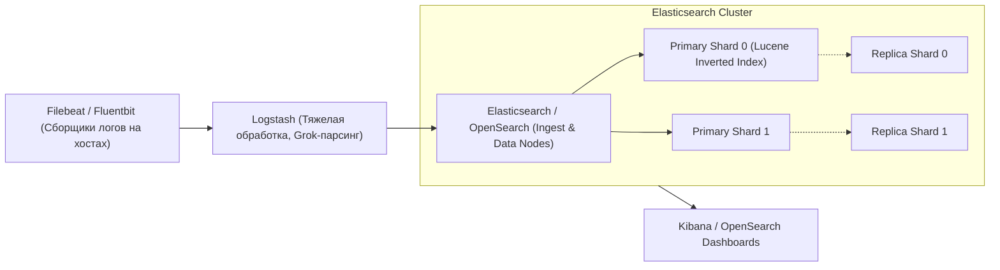
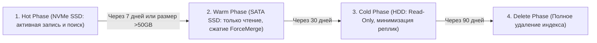

# 🔍 05. Стек ELK / OpenSearch: Индексация, Sharding и Пайплайны

## 🏛️ Архитектура стека ELK / OpenSearch

Стек **ELK (Elasticsearch, Logstash, Kibana)** и его Open-Source форк **OpenSearch** — самый мощный инструмент для полнотекстового поиска, аналитики безопасности (SIEM) и централизованного сбора структурированных логов.



---

## ⚙️ Внутреннее устройство: Инвертированный индекс и шарды

### 1. Inverted Index (Инвертированный индекс Lucene)
Вместо последовательного чтения файла `grep`, Elasticsearch разбивает текст на токены и строит словарь соответствия слов номерам документов:

| Слово (Term) | Документы (Doc IDs) |
| :--- | :--- |
| `NullPointerException` | Doc #1, Doc #42, Doc #105 |
| `HTTP 500` | Doc #14, Doc #42 |

*Результат:* Мгновенный поиск по терабайтам логов за доли секунды.

### 2. Shards (Шарды) и Replicas (Реплики)
- **Primary Shard:** Отдельный независимый экземпляр Apache Lucene. Число первичных шардов задается при создании индекса и не может быть изменено на лету без `_reindex`.
- **Replica Shard:** Точная копия первичного шарда. Обеспечивает отказоустойчивость и распределяет нагрузку на чтение.
- **Золотое правило сайзинга:** Размер одного шарда должен быть в диапазоне **от 10 ГБ до 50 ГБ**.

---

## 🛠️ Шаблон пайплайна Logstash с Grok-фильтром

Конфигурационный файл `/etc/logstash/conf.d/nginx_pipeline.conf`:

```ruby
input {
  beats {
    port => 5044
  }
}

filter {
  if [service] == "nginx" {
    grok {
      match => { 
        "message" => "%{IPORHOST:client_ip} - - \[%{HTTPDATE:timestamp}\] \"%{WORD:http_method} %{URIPATHPARAM:request_path} HTTP/%{NUMBER:http_version}\" %{NUMBER:status_code:int} %{NUMBER:bytes_sent:int} \"%{DATA:referrer}\" \"%{DATA:user_agent}\"" 
      }
      remove_field => ["message"] # Удаляем сырую нераспарсенную строку для экономии диска
    }
    date {
      match => [ "timestamp", "dd/MMM/yyyy:HH:mm:ss Z" ]
      target => "@timestamp"
      remove_field => ["timestamp"]
    }
    geoip {
      source => "client_ip"
      target => "geoip"
    }
  }
}

output {
  elasticsearch {
    hosts => ["http://elasticsearch-cluster:9200"]
    index => "logs-nginx-%{+YYYY.MM.dd}"
  }
}
```

---

## ⏳ Управление жизненным циклом индексов (ILM / ISM)

Стратегия автоматического перемещения индексов по уровням хранения:



---

## ⚡ Lucene & Kibana Query Cheat Sheet (KQL)

```text
# 1. Поиск точного совпадения по полю
service.name: "payment-service" AND status_code: [500 TO 599]

# 2. Поиск по регулярному выражению или наличию поля
_exists_: user_id AND message: /NullPointer.*/

# 3. Исключение шума
service.name: "web-api" AND NOT client_ip: "127.0.0.1"
```

---

## 🔬 Deep Dive: шардинг и ILM — почему кластер «умирает» ночью

Каждый шард — это Lucene индекс: JVM heap overhead ~10% размера шарда. Правило: **шард 10-50GB**, суммарно < 25 шардов на GB heap.

```http
PUT _ilm/policy/logs-policy
{
  "policy": {
    "phases": {
      "hot":    { "actions": { "rollover": { "max_primary_shard_size": "50gb", "max_age": "1d" } } },
      "warm":   { "min_age": "3d",  "actions": { "forcemerge": { "max_num_segments": 1 }, "shrink": { "number_of_shards": 1 } } },
      "delete": { "min_age": "30d", "actions": { "delete": {} } }
    }
  }
}
```

### Ingest pipelines: обогащение до записи

```http
PUT _ingest/pipeline/app-logs
{
  "processors": [
    { "grok": { "field": "message",
                 "patterns": ["%{TIMESTAMP_ISO8601:ts} %{LOGLEVEL:level} %{GREEDYDATA:msg}"] } },
    { "geoip": { "field": "client_ip", "target_field": "geo" } },
    { "user_agent": { "field": "agent" } }
  ]
}
```

### Диагностика производительности поиска

```http
GET logs-*/_search
{ "profile": true,
  "query": { "range": { "@timestamp": { "gte": "now-1h" } } } }

GET _cat/shards?v&h=index,shard,prirep,state,store,node&s=store:desc | head -15
GET _nodes/stats/jvm?filter_path=nodes.*.jvm.mem
```

!!! danger «Красные симптомы»
    `unassigned shards` + `watermark exceeded` = диск переполнен → кластер блокирует запись. Первым делом: `POST _flush/synced`, удалить старые индексы, временно поднять watermark.

---

<!-- enriched:v1 -->

## 🧨 Типовые грабли Production

| Симптом | Причина | Быстрое решение |
| :--- | :--- | :--- |
| Алерты не приходят / приходят пачкой | `group_wait`/`repeat_interval` настроены вслепую | Разобрать routing tree на бумаге, тест через `amtool` |
| Дашборд врет относительно реальности | Стейтмент без фильтра по job/instance | Проверить label matching, добавить legend format |
| Рост кардинальности метрик убивает Prometheus | user_id/path в labels | Ограничить cardinality, relabel drop |
| Логи «исчезают» | retention/индекс ротация | Проверить ILM/compactor настройки и объем hot-хранилища |

!!! warning «Сначала SLI, потом дашборды»
    Дашборд без определенного SLO — это арт. Определите SLI (какие запросы считаем хорошими), цель (99.9%), error budget — и только затем рисуйте панели.

## 🧪 Hands-on Lab

```bash
curl -s localhost:9200/_cluster/health?pretty | head -20 && \
curl -s 'localhost:9200/_cat/allocation?v' && curl -s 'localhost:9200/_cat/indices/logs-*?v&s=store.size:desc' | head -10
```

## ✅ Чек-лист зрелости темы

- [ ] Есть golden signals на каждый сервис (latency/traffic/errors/saturation)

    ??? tip "Как закрыть пункт"
        Четыре сигнала видны на дашборде сервиса: RPS, error ratio, latency p99 (histogram), saturation (очереди/пулы). Собраны provisioning'ом как код ([09.8](08-grafana-dashboards-as-code.md)), а не руками в UI.

- [ ] Алерты actionable: каждый требует действия, а не просто информирует

    ??? tip "Как закрыть пункт"
        Тест правила: «что я сделаю, увидев?» Нет действия → это дашборд-метрика, убрать из пейджера. Пороги — burn-rate относительно SLO ([09.6](06-alertmanager-and-dashboards-mastery.md)). Аудит: % алертов с реальными действиями за месяц.

- [ ] Настроены inhibition rules: падение ноды глушит её дочерние алерты

    ??? tip "Как закрыть пункт"
        equal: [node] связывает NodeDown с сервисными правилами этого узла — один инцидент = один алерт вместо двадцати. Проверка учением: выключить узел, убедиться в единственной нотификации.

- [ ] Runbook ссылка внутри каждого алерта

    ??? tip "Как закрыть пункт"
        annotation runbook_url обязателен (lint правил), ведёт на конкретные команды диагностики, не на главную вики. Шаблон runbook — [13.2](../13-disaster-recovery-and-tools/02-database-backups-and-dr-plan.md).

- [ ] Проведен учение: симулировали инцидент, проверили доставку нотификаций

    ??? tip "Как закрыть пункт"
        Раз в квартал: дрель хаоса → проверить путь правило→AM→канал, замерить MTTA. Заодно проверить silence/amtool и эскалации. Итог учения фиксируется.

---

## 🧭 Что дальше

| Шаг | Материал |
| :--- | :--- |
| 💪 Практика | [Сценарии песочницы: логи](../21-playground/index.md) |
| 🎤 Проверить себя | [Вопросы: ELK](../14-interview-prep/04-100-devops-interview-questions-bank-part2.md) |
