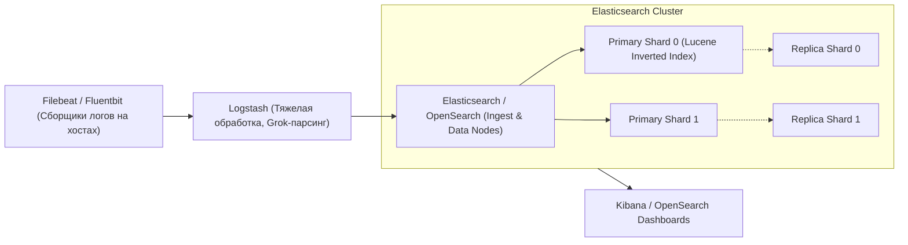

# 🔍 05. Стек ELK / OpenSearch: Индексация, Sharding и Пайплайны

## 🏛️ Архитектура стека ELK / OpenSearch

Стек **ELK (Elasticsearch, Logstash, Kibana)** и его Open-Source форк **OpenSearch** — самый мощный инструмент для полнотекстового поиска, аналитики безопасности (SIEM) и централизованного сбора структурированных логов.



---

## ⚙️ Внутреннее устройство: Инвертированный индекс и шарды

### 1. Inverted Index (Инвертированный индекс Lucene)
Вместо последовательного чтения файла `grep`, Elasticsearch разбивает текст на токены и строит словарь соответствия слов номерам документов:

| Слово (Term) | Документы (Doc IDs) |
| :--- | :--- |
| `NullPointerException` | Doc #1, Doc #42, Doc #105 |
| `HTTP 500` | Doc #14, Doc #42 |

*Результат:* Мгновенный поиск по терабайтам логов за доли секунды.

### 2. Shards (Шарды) и Replicas (Реплики)
- **Primary Shard:** Отдельный независимый экземпляр Apache Lucene. Число первичных шардов задается при создании индекса и не может быть изменено на лету без `_reindex`.
- **Replica Shard:** Точная копия первичного шарда. Обеспечивает отказоустойчивость и распределяет нагрузку на чтение.
- **Золотое правило сайзинга:** Размер одного шарда должен быть в диапазоне **от 10 ГБ до 50 ГБ**.

---

## 🛠️ Шаблон пайплайна Logstash с Grok-фильтром

Конфигурационный файл `/etc/logstash/conf.d/nginx_pipeline.conf`:

```ruby
input {
  beats {
    port => 5044
  }
}

filter {
  if [service] == "nginx" {
    grok {
      match => { 
        "message" => "%{IPORHOST:client_ip} - - \[%{HTTPDATE:timestamp}\] \"%{WORD:http_method} %{URIPATHPARAM:request_path} HTTP/%{NUMBER:http_version}\" %{NUMBER:status_code:int} %{NUMBER:bytes_sent:int} \"%{DATA:referrer}\" \"%{DATA:user_agent}\"" 
      }
      remove_field => ["message"] # Удаляем сырую нераспарсенную строку для экономии диска
    }
    date {
      match => [ "timestamp", "dd/MMM/yyyy:HH:mm:ss Z" ]
      target => "@timestamp"
      remove_field => ["timestamp"]
    }
    geoip {
      source => "client_ip"
      target => "geoip"
    }
  }
}

output {
  elasticsearch {
    hosts => ["http://elasticsearch-cluster:9200"]
    index => "logs-nginx-%{+YYYY.MM.dd}"
  }
}
```

---

## ⏳ Управление жизненным циклом индексов (ILM / ISM)

Стратегия автоматического перемещения индексов по уровням хранения:


---

## ⚡ Lucene & Kibana Query Cheat Sheet (KQL)

```text
# 1. Поиск точного совпадения по полю
service.name: "payment-service" AND status_code: [500 TO 599]

# 2. Поиск по регулярному выражению или наличию поля
_exists_: user_id AND message: /NullPointer.*/

# 3. Исключение шума
service.name: "web-api" AND NOT client_ip: "127.0.0.1"
```

---

## 🔬 Deep Dive: шардинг и ILM — почему кластер «умирает» ночью

Каждый шард — это Lucene индекс: JVM heap overhead ~10% размера шарда. Правило: **шард 10-50GB**, суммарно < 25 шардов на GB heap.

```http
PUT _ilm/policy/logs-policy
{
  "policy": {
    "phases": {
      "hot":    { "actions": { "rollover": { "max_primary_shard_size": "50gb", "max_age": "1d" } } },
      "warm":   { "min_age": "3d",  "actions": { "forcemerge": { "max_num_segments": 1 }, "shrink": { "number_of_shards": 1 } } },
      "delete": { "min_age": "30d", "actions": { "delete": {} } }
    }
  }
}
```

### Ingest pipelines: обогащение до записи

```http
PUT _ingest/pipeline/app-logs
{
  "processors": [
    { "grok": { "field": "message",
                 "patterns": ["%{TIMESTAMP_ISO8601:ts} %{LOGLEVEL:level} %{GREEDYDATA:msg}"] } },
    { "geoip": { "field": "client_ip", "target_field": "geo" } },
    { "user_agent": { "field": "agent" } }
  ]
}
```

### Диагностика производительности поиска

```http
GET logs-*/_search
{ "profile": true,
  "query": { "range": { "@timestamp": { "gte": "now-1h" } } } }

GET _cat/shards?v&h=index,shard,prirep,state,store,node&s=store:desc | head -15
GET _nodes/stats/jvm?filter_path=nodes.*.jvm.mem
```

!!! danger «Красные симптомы»
    `unassigned shards` + `watermark exceeded` = диск переполнен → кластер блокирует запись. Первым делом: `POST _flush/synced`, удалить старые индексы, временно поднять watermark.

---

---

## 🧪 Runnable Lab: Fluent Bit → OpenSearch/Kibana (без облака, 15 мин)

**Архитектура лаба:** `app → Fluent Bit (tail) → OpenSearch (9200) → OpenSearch Dashboards (5601)` + `ILM` + `heap`.

```yaml
# docker-compose.logging.yaml
version: "3.8"
services:
  app:
    image: busybox:1.36
    command: sh -c 'i=0; while true; do echo "$$(date -Iseconds) level=info msg=\"request\" status=200 latency=$$((RANDOM%200))ms request_id=req-$$i" >> /logs/app.log; echo "$$(date -Iseconds) level=error msg=\"db timeout\" request_id=req-$$i" >> /logs/app.log; i=$$((i+1)); sleep 1; done'
    volumes: [ "./logs:/logs" ]

  opensearch:
    image: opensearchproject/opensearch:2.11.0
    environment:
      - discovery.type=single-node
      - bootstrap.memory_lock=true
      - OPENSEARCH_JAVA_OPTS=-Xms512m -Xmx512m
      - plugins.security.disabled=true
    ulimits: { memlock: { soft: -1, hard: -1 }, nofile: { soft: 65536, hard: 65536 } }
    ports: ["9200:9200"]
    volumes: [ "opensearch-data:/usr/share/opensearch/data" ]

  dashboards:
    image: opensearchproject/opensearch-dashboards:2.11.0
    environment:
      - OPENSEARCH_HOSTS=http://opensearch:9200
      - DISABLE_SECURITY_DASHBOARDS_PLUGIN=true
    ports: ["5601:5601"]
    depends_on: [opensearch]

  fluentbit:
    image: cr.fluentbit.io/fluent/fluent-bit:2.2
    volumes:
      - ./fluent-bit.conf:/fluent-bit/etc/fluent-bit.conf:ro
      - ./logs:/logs:ro
    depends_on: [opensearch]

volumes:
  opensearch-data:
```

```ini
# fluent-bit.conf
[SERVICE]
    Flush        1
    Parsers_File parsers.conf

[INPUT]
    Name              tail
    Path              /logs/*.log
    DB                /tmp/flb.db
    Tag               app.*
    Refresh_Interval  5
    Skip_Long_Lines   On

[FILTER]
    Name              parser
    Match             app.*
    Key_Name          log
    Parser            app-json
    Reserve_Data      On

[FILTER]
    Name              modify
    Match             app.*
    Add               cluster lab
    Add               service app

[OUTPUT]
    Name              opensearch
    Match             app.*
    Host              opensearch
    Port              9200
    Index             logs-app
    Type              _doc
    Logstash_Format   On
    Logstash_Prefix   logs-app
    Replace_Dots      On
    Trace_Output      Off
    Trace_Error       On
    Suppress_Type_Name On
```

```ini
# parsers.conf
[PARSER]
    Name   app-json
    Format json
    Time_Key time
    Time_Format %Y-%m-%dT%H:%M:%S%z
```

**Запуск и проверка:**

```bash
mkdir -p logs && docker compose -f docker-compose.logging.yaml up -d
sleep 40 && curl -s http://localhost:9200/_cluster/health?pretty | grep status
curl -s 'http://localhost:9200/_cat/indices/logs-*?v&s=index:desc' | head -20
curl -s 'http://localhost:9200/logs-app-*/_search?pretty' -H 'Content-Type: application/json' -d '{"size":5,"sort":[{"@timestamp":"desc"}]}' | head -80

# Откройте Dashboards: http://localhost:5601 → Management → Dev Tools
# GET _cat/shards?v
# GET logs-app-*/_search { "query": { "match": { "level": "error" } } }

# ILM/ISM тест
curl -s -X PUT http://localhost:9200/_plugins/_ism/policies/rollover-30d -H 'Content-Type: application/json' -d '{
  "policy": {"description":"hot→delete 30d","default_state":"hot","states":[
    {"name":"hot","actions":[{"rollover":{"min_size":"50gb","min_index_age":"1d"}}],"transitions":[{"state_name":"delete","conditions":{"min_index_age":"30d"}}]},
    {"name":"delete","actions":[{"delete":{}}]}
  ]}}' | head -20

# Heap и shards диагностика
curl -s http://localhost:9200/_nodes/stats/jvm?pretty | grep -A5 heap_used_percent
curl -s http://localhost:9200/_cat/allocation?v
curl -s http://localhost:9200/_cat/shards?v | head -20

# Backpressure: остановите opensearch и посмотрите retry в fluentbit
docker compose -f docker-compose.logging.yaml stop opensearch && docker logs fluentbit --tail=50 | grep -i retry

# Cleanup
docker compose -f docker-compose.logging.yaml down -v && rm -rf logs
```

**Sizing шпаргалка для лаба:**

| Параметр | Рекомендация |
|---|---|
| shard size | 10–50GB, <25 shards/GB heap |
| heap | ≤32GB, 50% RAM узла, `Xms==Xmx` |
| replicas | 1 для single-node лаба, 1–2 в проде |
| refresh_interval | 1s near-real-time, 30s для экономии IO |
| rollover | `50gb` или `30d`, не только `1d` |

<!-- enriched:v1 -->

## 🧨 Типовые грабли Production (ELK/OpenSearch — только эта тема)

| Симптом | Причина | Быстрое решение |
| :--- | :--- | :--- |
| `unassigned shards` + `watermark exceeded` | Диск 85% → `read_only_allow_delete` | `PUT _cluster/settings {"transient":{"cluster.routing.allocation.disk.watermark.low":"75%"}}`, удалить старые `logs-*` |
| Shard 200× 1GB → heap 90% | Shard explosion: daily × 5 shards | Rollover `50gb`/`1d` + `shrink` в warm, data stream |
| `rejected execution queue capacity` | `ingestion_rate` / `thread_pool.write.queue_size` | `limits_config.ingestion_rate_mb: 8`, `queue_size: 1000` |
| `geoip` фильтр роняет Logstash | Нет `ingest-geoip` plugin | `bin/elasticsearch-plugin install ingest-geoip` или убрать `geoip` |

!!! warning «Сначала SLI, потом дашборды»
    Дашборд без определенного SLO — это арт. Определите SLI (какие запросы считаем хорошими), цель (99.9%), error budget — и только затем рисуйте панели.

## 🧪 Hands-on Lab

```bash
curl -s localhost:9200/_cluster/health?pretty | head -20 && \
curl -s 'localhost:9200/_cat/allocation?v' && curl -s 'localhost:9200/_cat/indices/logs-*?v&s=store.size:desc' | head -10
```

## ✅ Чек-лист зрелости темы

- [ ] Есть golden signals на каждый сервис (latency/traffic/errors/saturation)

    ??? tip "Как закрыть пункт"
        Четыре сигнала видны на дашборде сервиса: RPS, error ratio, latency p99 (histogram), saturation (очереди/пулы). Собраны provisioning'ом как код ([09.8](08-grafana-dashboards-as-code.md)), а не руками в UI.

- [ ] Алерты actionable: каждый требует действия, а не просто информирует

    ??? tip "Как закрыть пункт"
        Тест правила: «что я сделаю, увидев?» Нет действия → это дашборд-метрика, убрать из пейджера. Пороги — burn-rate относительно SLO ([09.6](06-alertmanager-and-dashboards-mastery.md)). Аудит: % алертов с реальными действиями за месяц.

- [ ] Настроены inhibition rules: падение ноды глушит её дочерние алерты

    ??? tip "Как закрыть пункт"
        equal: [node] связывает NodeDown с сервисными правилами этого узла — один инцидент = один алерт вместо двадцати. Проверка учением: выключить узел, убедиться в единственной нотификации.

- [ ] Runbook ссылка внутри каждого алерта

    ??? tip "Как закрыть пункт"
        annotation runbook_url обязателен (lint правил), ведёт на конкретные команды диагностики, не на главную вики. Шаблон runbook — [13.2](../13-disaster-recovery-and-tools/02-database-backups-and-dr-plan.md).

- [ ] Проведен учение: симулировали инцидент, проверили доставку нотификаций

    ??? tip "Как закрыть пункт"
        Раз в квартал: дрель хаоса → проверить путь правило→AM→канал, замерить MTTA. Заодно проверить silence/amtool и эскалации. Итог учения фиксируется.

---

## 🧭 Что дальше

| Шаг | Материал |
| :--- | :--- |
| 💪 Практика | [Сценарии песочницы: логи](../21-playground/index.md) |
| 🎤 Проверить себя | [Вопросы: ELK](../14-interview-prep/04-100-devops-interview-questions-bank-part2.md) |

---

## ✅ Проверь себя

**В1. Путь документа в Elasticsearch: index → shard → segment?**
<details><summary>Ответ</summary>
Документ попадает в индекс; hash маршрутизации (_id) выбирает primary shard (шардированные Lucene-инстансы), реплика дублирует на другую ноду. Записи идут в in-memory buffer + translog, раз в refresh_interval (1s) формируется новый read-only segment (near-real-time поиск). Сегменты мержатся фоном; flush сбрасывает на диск с очисткой translog.
</details>

**В2. Зачем ILM (Index Lifecycle Management) и типовая политика?**
<details><summary>Ответ</summary>
Индексы растут бесконечно — ILM двигает их по фазам: hot (запись, реплики) → warm (read-only, merge, меньше реплик) → cold (сжатие/дешёвое хранилище) → delete (например 90 дней). Без ILM: переполнение диска и смерть всего кластера из-за одного лога.
</details>

**В3. Что такое shard explosion и как его избежать?**
<details><summary>Ответ</summary>
Тысячи мелких шардов (много индексов × много шардов) съедают heap метаданными и убивают производительность. Профилактика: rollover по размеру (25–50 ГБ/шард), а не только по времени; data streams; уменьшение числа daily-индексов; force-merge в warm-фазе.
</details>

**В4. Elasticsearch vs OpenSearch — что произошло?**
<details><summary>Ответ</summary>
После смены лицензии Elastic (SSPL) AWS форкнул Kibana/Elasticsearch 7.10 в OpenSearch (Apache 2.0): свои версии движков, OpenSearch Dashboards. Функционально близки; выбор чаще диктуют поддержка вендора и лицензионная политика организации.
</details>
