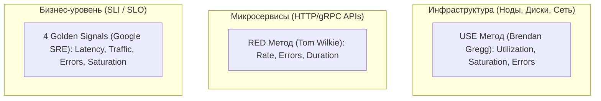
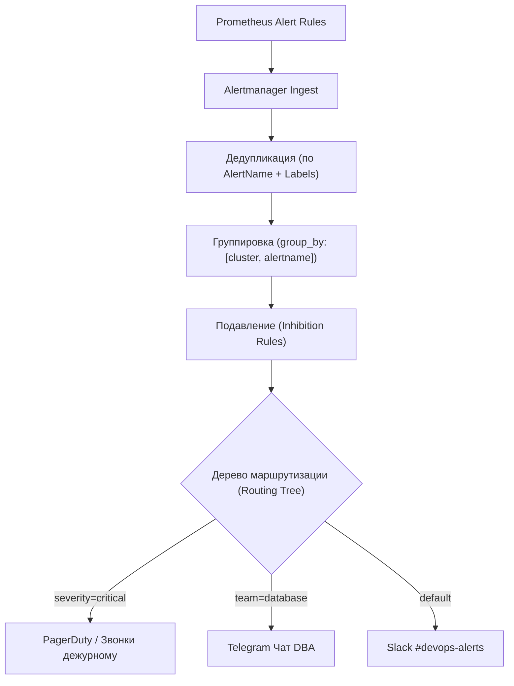

# 🚨 06. Построение дашбордов Grafana и Архитектура Alertmanager

## 📊 Методологии проектирования дашбордов

Создание перегруженных дашбордов («ковры из 100 графиков») мешает дежурному инженеру быстро локализовать аварию. Используйте общепринятые стандарты:



### 1. Метод USE (Для серверов, CPU, RAM, дисков, сетей):
- **Utilization (Утилизация):** Какой процент времени ресурс был занят полезной работой? (например, `% CPU Busy`, `% Disk Space Used`).
- **Saturation (Насыщение):** Насколько велика очередь к ресурсу? (например, `CPU Load Average`, `Disk I/O Queue Length`).
- **Errors (Ошибки):** Были ли сбои? (например, `Network Interface Drops`, `Disk I/O Errors`).

### 2. Метод RED (Для микросервисов и API):
- **Rate (Частота):** Количество запросов в секунду (RPS).
- **Errors (Ошибки):** Количество или процент ошибочных ответов (HTTP 5xx, gRPC error codes).
- **Duration (Длительность):** Время обработки запросов (гистограммы $p50, p95, p99$).

---

## 🎛️ Продвинутые приемы Grafana
1. **Chained Variables (Связанные переменные):** При выборе `Environment: prod` в списке `Namespace` появляются только продакшн неймспейсы.
2. **Row / Panel Repeat:** Автоматическое клонирование строки графиков для каждого пода или диска при выборе `Multi-select`.
3. **Data Links:** Клик по спайку на графике ошибок автоматически открывает логи в Loki или трейс в Tempo с фильтром по времени аварии!

---

## 🌳 Архитектура маршрутизации Alertmanager

Alertmanager отвечает за дедупликацию, группировку, подавление (inhibition) и отправку уведомлений.



---

## 🛠️ Эталонный `alertmanager.yaml` с подавлением и группами

```yaml
global:
  resolve_timeout: 5m

# Корневой роут
route:
  receiver: 'telegram-default-channel'
  group_by: ['alertname', 'cluster', 'namespace']
  group_wait: 30s        # Ждать 30с перед отправкой первого алерта (собрать пачку)
  group_interval: 5m     # Интервал отправки новых алертов в ту же пачку
  repeat_interval: 4h    # Повторять незакрытый алерт раз в 4 часа

  # Дочерние роуты (Routing Tree)
  routes:
    # 1. Критические алерты отправляются в PagerDuty/Opsgenie
    - match:
        severity: critical
      receiver: 'opsgenie-critical'
      continue: true # Продолжать поиск по дереву, чтобы также отправить в Telegram

    # 2. Алерты базы данных направляются в чат DBA
    - match:
        team: database
      receiver: 'telegram-dba-chat'

    # 3. Warning алерты в информационный канал Slack
    - match:
        severity: warning
      receiver: 'slack-warnings'

# Правила подавления (Inhibition Rules)
inhibit_rules:
  # Если вся нода лежит (NodeDown = critical), ПОДАВИТЬ алерты о падении подов на этой ноде!
  - source_match:
      alertname: 'NodeDown'
      severity: 'critical'
    target_match:
      severity: 'warning'
    equal: ['node', 'instance']

# Настройка получателей
receivers:
  - name: 'telegram-default-channel'
    telegram_configs:
      - bot_token: '123456789:ABCdefGHIjklMNOpqrs'
        chat_id: -1001234567890
        parse_mode: 'HTML'
        message: |
          <b>[{{ .Status | toUpper }}] {{ .CommonLabels.alertname }}</b>
          <b>Cluster:</b> {{ .CommonLabels.cluster }}
          <b>Namespace:</b> {{ .CommonLabels.namespace }}
          <b>Описание:</b> {{ .CommonAnnotations.description }}

  - name: 'telegram-dba-chat'
    telegram_configs:
      - bot_token: '123456789:ABCdefGHIjklMNOpqrs'
        chat_id: -1009876543210

  - name: 'opsgenie-critical'
    opsgenie_configs:
      - api_key: 'xxxxxxxx-xxxx-xxxx-xxxx-xxxxxxxxxxxx'
        priority: 'P1'
```

---

## 🔬 Deep Dive: burn-rate алерты вместо статических порогов

Статический «CPU > 90%» шумит и ничего не говорит о пользовательском опыте. SRE-подход — алертить скорость сжигания error budget:

| Окно | Burn rate | Значение |
| :--- | :--- | :--- |
| 1h (+5m подтверждение) | 14.4× | page немедленно: бюджет сгорит за 2 дня |
| 6h (+30m) | 6× | page в рабочее время |
| 3d | 1× | ticket: бюджет истечет за 30 дней |

### Silences vs inhibition — не путать

```bash
# Silence: плановые работы (ручное подавление по времени)
amtool silence add alertname=CertificateExpiring \
  --duration=4h --comment='deploy window' -o json | jq '.id'

# Inhibition: автоматическое подавление зависимых алертов (см. inhibit_rules)
# Проверка маршрутизации без отправки:
amtool config routes test --config.file=alertmanager.yml severity=critical team=database
```

### Дашборд дежурного: правило трех экранов

1. **SLO overview:** burn-rate всех команд, красный = кто виноват.
2. **Service topology:** карта зависимостей с health (Grafana node graph).
3. **Drill-down:** RED каждого сервиса + ссылки на логи (data links).

!!! tip «Тестирование алертов»
    Регулярный GameDay: остановите под в staging, проверьте что: алерт сработал, пришел в нужный канал, runbook открылся, эскалация работает. Не протестированный алерт = его нет.

---

<!-- enriched:v1 -->

## 🧨 Типовые грабли Production

| Симптом | Причина | Быстрое решение |
| :--- | :--- | :--- |
| Алерты не приходят / приходят пачкой | `group_wait`/`repeat_interval` настроены вслепую | Разобрать routing tree на бумаге, тест через `amtool` |
| Дашборд врет относительно реальности | Стейтмент без фильтра по job/instance | Проверить label matching, добавить legend format |
| Рост кардинальности метрик убивает Prometheus | user_id/path в labels | Ограничить cardinality, relabel drop |
| Логи «исчезают» | retention/индекс ротация | Проверить ILM/compactor настройки и объем hot-хранилища |

!!! warning «Сначала SLI, потом дашборды»
    Дашборд без определенного SLO — это арт. Определите SLI (какие запросы считаем хорошими), цель (99.9%), error budget — и только затем рисуйте панели.

## 🧪 Hands-on Lab

```bash
amtool config show --config.file=alertmanager.yml | head -30 && \
amtool alert query http://localhost:9093 | head -10 && \
curl -s localhost:9090/api/v1/rules | jq -r '.data.groups[].rules[] | select(.health != "ok") | .name' | head
```

## ✅ Чек-лист зрелости темы

- [ ] Есть golden signals на каждый сервис (latency/traffic/errors/saturation)

    ??? tip "Как закрыть пункт"
        Четыре сигнала видны на дашборде сервиса: RPS, error ratio, latency p99 (histogram), saturation (очереди/пулы). Собраны provisioning'ом как код ([09.8](08-grafana-dashboards-as-code.md)), а не руками в UI.

- [ ] Алерты actionable: каждый требует действия, а не просто информирует

    ??? tip "Как закрыть пункт"
        Тест правила: «что я сделаю, увидев?» Нет действия → это дашборд-метрика, убрать из пейджера. Пороги — burn-rate относительно SLO ([09.6](06-alertmanager-and-dashboards-mastery.md)). Аудит: % алертов с реальными действиями за месяц.

- [ ] Настроены inhibition rules: падение ноды глушит её дочерние алерты

    ??? tip "Как закрыть пункт"
        equal: [node] связывает NodeDown с сервисными правилами этого узла — один инцидент = один алерт вместо двадцати. Проверка учением: выключить узел, убедиться в единственной нотификации.

- [ ] Runbook ссылка внутри каждого алерта

    ??? tip "Как закрыть пункт"
        annotation runbook_url обязателен (lint правил), ведёт на конкретные команды диагностики, не на главную вики. Шаблон runbook — [13.2](../13-disaster-recovery-and-tools/02-database-backups-and-dr-plan.md).

- [ ] Проведен учение: симулировали инцидент, проверили доставку нотификаций

    ??? tip "Как закрыть пункт"
        Раз в квартал: дрель хаоса → проверить путь правило→AM→канал, замерить MTTA. Заодно проверить silence/amtool и эскалации. Итог учения фиксируется.

---

## 🧭 Что дальше

| Шаг | Материал |
| :--- | :--- |
| 🔬 Закрепить | [Lab 06: алерты в Telegram](../16-guided-labs/06-lab-observability-stack.md) |
| ➡️ Дальше | [Дашборды как код](08-grafana-dashboards-as-code.md) |
