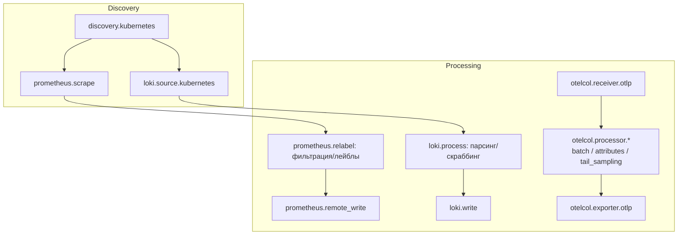

# 🔌 07. Grafana Alloy Cookbook: Пайплайны Метрик, Логов и Трейсов

> Продолжение [03. Grafana Alloy Телеметрия](03-grafana-alloy-telemetry.md): здесь — практическая сборка production-пайплайнов на River.

## ⚙️ Карта компонентов: что чем собирается



Три семейства компонентов:

- **`prometheus.*`** — метрики (scrape, relabel, recording rules, remote_write).
- **`loki.*`** — логи (источники, обработка, запись).
- **`otelcol.*`** — OpenTelemetry-сигналы (трейсы, метрики и логи по OTLP) + `pyroscope.*` для профилей.

---

## 📝 Пайплайн метрик в Kubernetes

```river
// 1. Автообнаружение подов по аннотациям
discovery.kubernetes "pods" {
  role = "pod"
}

// 2. Отбираем только поды с аннотацией prometheus.io/scrape=true
discovery.relabel "pods" {
  targets = discovery.kubernetes.pods.targets

  rule {
    source_labels = ["__meta_kubernetes_pod_annotation_prometheus_io_scrape"]
    regex         = "true"
    action        = "keep"
  }
  rule {
    source_labels = ["__meta_kubernetes_pod_annotation_prometheus_io_path"]
    regex         = "(.+)"
    target_label  = "__metrics_path__"
  }
  rule {
    // namespace -> лейбл namespace (пригодится в дашбордах)
    source_labels = ["__meta_kubernetes_namespace"]
    target_label  = "namespace"
  }
}

// 3. Скрейп
prometheus.scrape "pods" {
  targets             = discovery.relabel.pods.output
  forward_to          = [prometheus.relabel.drop_noise.receiver]
  scrape_interval     = "30s"
  scrape_timeout      = "10s"
  max_scrape_size     = "10MB"
  honor_labels        = true
}

// 4. Срезаем мусор ДО отправки: экономим кардинальность
prometheus.relabel "drop_noise" {
  forward_to = [prometheus.remote_write.mimir.receiver]

  rule {
    source_labels = ["__name__"]
    regex         = "go_gc_.*|go_memstats_alloc_bytes_total|http_request_duration_seconds_bucket"
    action        = "drop"
  }
  rule {
    // пустые bucket'ы гистограмм не нужны
    source_labels = ["le"]
    regex         = "\\+Inf"
    action        = "drop"
  }
}

// 5. Remote write в Mimir/Prometheus
prometheus.remote_write "mimir" {
  endpoint {
    url = "http://mimir-gateway.monitoring/api/v1/push"

    queue_config {
      max_shards     = 50
      max_samples_per_send = 2000
    }
    metadata_config {
      send = false   // метаданные часто не нужны — минус трафик
    }
  }

  wal {
    directory = "/var/lib/alloy/data"
  }
}
```

!!! tip "Релеяйте до scrape, а не после"
    Каждый `prometheus.relabel` перед `remote_write` режет данные **до** WAL и сети. Фильтрация «на входе» дешевле, чем «на выходе» в разы.

---

## 📜 Пайплайн логов: миграция с Promtail

Alloy заменяет Promtail один-в-один. Типовой конфиг для подов:

```river
loki.source.kubernetes "pods" {
  targets    = discovery.kubernetes.pods.targets
  forward_to = [loki.process.parse.receiver]
}

loki.process "parse" {
  forward_to = [loki.write.loki.endpoint_receiver]

  // Парсинг JSON-логов приложения
  stage.json {
    expressions = {
      level   = "level"
      msg     = "message"
      traceid = "trace_id"
      user    = "user_email"
    }
  }

  // Уровень лога -> label (но НЕ высококардинальные поля!)
  stage.labels {
    values = { level = "level" }
  }

  // Скраббинг персональных данных ДО отправки наружу
  stage.replace {
    expression = "(?i)([\\w.+-]+@[\\w-]+\\.[\\w.]+)"
    replace    = "[REDACTED_EMAIL]"
  }
  stage.replace {
    expression = "\"user\":\"[^\"]*\""
    replace    = "\"user\":\"[REDACTED]\""
  }

  // Дамп сырого сообщения при отладке пайплайна
  stage.output { source = "msg" }
}

loki.write "loki" {
  endpoint {
    url = "http://loki-gateway.monitoring/loki/api/v1/push"
    max_backoff_period = "2m"
  }
}
```

Правило лейблов: **в labels идут только `level`, `app`, `namespace`, `env`**. Всё остальное (`traceid`, `user`, `pod` с хешем) — в тело записи, иначе Loki захлебнётся на потоках (см. [Deep Dive в 02](02-logging-loki-and-tracing.md)).

---

## 🛰️ Трейсы через OTLP: батчи и семплирование

```river
otelcol.receiver.otlp "default" {
  grpc { endpoint = "0.0.0.0:4317" }
  http { endpoint = "0.0.0.0:4318" }
  output { traces = { ingest = otelcol.processor.batch.traces.input } }
}

// Группировка спанов перед экспортом — меньше сетевых вызовов
otelcol.processor.batch "traces" {
  timeout = "5s"
  send_batch_size = 8192
  output {
    traces = { sampled = otelcol.processor.tail_sampling.sampled.input }
  }
}

// Tail sampling: оставляем ошибки и медленные запросы всегда, остальное — 10%
otelcol.processor.tail_sampling "sampled" {
  decision_wait   = "10s"
  num_traces      = 50000
  policy {
    name = "errors-always"
    type = "status_code"
    status_code { status_codes = ["ERROR"] }
  }
  policy {
    name = "probabilistic"
    type = "probabilistic"
    probabilistic { sampling_percentage = 10 }
  }
  output { traces = { out = otelcol.exporter.otlp.tempo.input } }
}

otelcol.exporter.otlp "tempo" {
  client {
    endpoint = "tempo-distributor.monitoring:4317"
    tls { insecure = true }
  }
}
```

Приложению достаточно переменных:

```yaml
env:
  - name: OTEL_EXPORTER_OTLP_ENDPOINT
    value: "http://alloy-collector.monitoring:4318"
  - name: OTEL_SERVICE_NAME
    value: "shop-api"
```

---

## 🧩 Режимы деплоя: DaemonSet против кластера Alloy

| | DaemonSet (агент на каждом узле) | Deployment (центральный коллектор) |
| :--- | :--- | :--- |
| Логи, node-metrics | ✅ родная стихия | ❌ нужен путь к файлам узла |
| Приём OTLP от приложений | Возможно, но N точек входа | ✅ единый LB-endpoint |
| Масштабирование | Вместе с узлами | Replicas + HPA |
| Кластеризация | Не нужна | `clustering { name = "alloy" }` + ha pairs |

Production-паттерн — оба слоя: DaemonSet собирает локальное и шлёт в центральный Alloy (`otelcol.exporter.otlp` → центральный receiver), тот делает тяжёлую обработку и семплирование.

```river
// Центральный Alloy: HA через memberlist
clustering {
  name = "alloy-central"
}
```

---

## ⚡ Диагностика самого Alloy

```bash
# UI аллоя: граф пайплайна и health компонентов
kubectl port-forward -n monitoring ds/alloy 12345:12345
open http://localhost:12345            # /component/* показывает состояние каждого блока

# Метрики самого аллоя (следить за очередями!)
curl -s localhost:12345/metrics | grep -E 'alloy_component|prometheus_remote_storage'

# Валидация конфига до применения
alloy fmt --write config.alloy         # форматирование
alloy run --stability.level=experimental --server.http.listen-addr=:12346 config.alloy
```

Ключевые метрики здоровья:

| Метрика | Тревога |
| :--- | :--- |
| `prometheus_remote_storage_samples_pending` растёт | remote_write не успевает — увеличить shards/бандвич |
| `loki_dsc_bytes_written` падает при живых источниках | Пайплайн логов молчит |
| `otelcol_exporter_queue_size` ≈ capacity | Экспортёр захлебнулся, скоро дропы |

---

## 🔬 Deep Dive: где теряются данные и как строится доставка

Цепочка надёжности у каждого семейства своя:

- **Метрики**: WAL на диске агента → retry remote_write. Переживает рестарт агента; при недоступности приёмника копится очередь (`queue_config.max_shards`).
- **Логи**: позиция файла в positions-файле → at-least-once. Возможны дубли при рестарте — Loki дедуплицирует по timestamp+line.
- **Трейсы**: по умолчанию **fire-and-forget**. Если трейсы дороже потери — memory_limiter + persistent queue в exporter'е, но это уже компромисс с задержкой.

Практический вывод: мониторьте сам телеметрический конвейер его же средствами — `alloy_build_info`, очереди exporters, rate дропнутых семплов. Молчащий агент — самый дорогой инцидент: вы узнаёте о нём, когда уже нечего было мониторить.

---

## 🧨 Типовые грабли Production

| Симптом | Причина | Быстрое решение |
| :--- | :--- | :--- |
| Кардинальность Loki/Mimir взорвалась | В labels попали pod-id/request-id/user | Labels только низкокардинальные; остальное в тело/скраббинг |
| Дубликаты логов после рестарта | at-least-once доставка | Норма; проверять дедупликацию на стороне Loki |
| Часть подов не скрейпится | Нет аннотации/не тот port/path | `discovery.relabel` keep-rule; проверить `/metrics` из пода |
| Alloy OOMKill | Тяжёлый tail_sampling без лимитов | `num_traces` вниз, memory_limiter, больше памяти DaemonSet |
| remote_write 429/5xx в логах | Приёмник слабее агента | queue_config вверх, batch_size вниз, горизонталь приёмника |
| Конфиг применился, но граф красный | Опечатка в имени компонента | UI аллоя показывает сломанный компонент и причину |

## 🧪 Hands-on Lab

```bash
# Локальный запуск alloy c demo-конфигом (без k8s)
docker run --rm -p 12345:12345 grafana/alloy:latest run --server.http.listen-addr=0.0.0.0:12345 /etc/alloy/config.alloy

# Быстрая проверка: сколько серий уходит в remote write
curl -s localhost:12345/metrics \
  | grep -E 'prometheus_remote_storage_succeeded_samples_total|_failed_samples_total'

# Проверить, какие таргеты найдены discovery (UI → компонент discovery.kubernetes.pods)
```

## ✅ Чек-лист зрелости темы

- [ ] Фильтрация метрик (relabel drop) стоит ДО remote_write/WAL
- [ ] Лейблы логов низкокардинальны; PII скраббится в пайплайне
- [ ] Трейсы проходят batch + tail_sampling (ошибки не теряются)
- [ ] Есть два слоя Alloy или обоснование одного (DaemonSet vs central)
- [ ] Сам Alloy мониторится: очереди, failed samples, health компонентов
- [ ] Конфиги Alloy версионируются в Git и катятся как код

---

## 🧭 Что дальше

| Шаг | Материал |
| :--- | :--- |
| 🔬 Закрепить | [Lab 06](../16-guided-labs/06-lab-observability-stack.md) |
| 🎤 Проверить себя | [Карточки Observability](../22-trainer/index.md) |

---

## 🎤 Пять вопросов для повторения

---


## ✅ Проверь себя

> Отвечай вслух до раскрытия ответа. Если «не помню» — вернись к разделу.


**В1. Почему фильтрацию метрик (prometheus.relabel drop) ставят до remote_write, а не на стороне приёмника?**

<details><summary>Ответ</summary>

Релей до remote_write режет серии до записи в WAL и отправки по сети — экономятся диск агента, трафик и нагрузка приёмника. Фильтрация на стороне Mimir всё равно пропускает данные через ingest-путь, который и является узким местом.

</details>


**В2. Сформулируйте правило выбора лейблов для Loki и приведите примеры разрешённых и запрещённых значений.**

<details><summary>Ответ</summary>

В labels идут только низкокардинальные поля: level, app, namespace, env. Запрещено: pod с хешем, user_id, request_id, trace_id — каждая уникальная комбинация создаёт поток и убивает ingester. Высококардинальное остаётся в теле записи и ищется фильтром по строке.

</details>


**В3. Что делает tail_sampling в OTel-конвейере Alloy и почему ERROR-трейсы сохраняются всегда?**

<details><summary>Ответ</summary>

Решение о сохранении трейса принимается после его завершения (decision_wait): политики оценивают трейс целиком. Политика status_code=ERROR оставляет все ошибочные трейсы независимо от процента — так дешёвое семплирование (10% успешных) не прячет инциденты.

</details>


**В4. Как распределены обязанности между DaemonSet-Alloy и центральным Alloy в двухслойной схеме?**

<details><summary>Ответ</summary>

DaemonSet собирает локальное (логи узла, node-metrics, скрейп подов) и пересылает в центральный коллектор. Центральный принимает OTLP от приложений, делает тяжёлую обработку: батчинг, семплирование, скраббинг, и экспортирует в Mimir/Loki/Tempo. Масштабируются слои независимо.

</details>


**В5. По каким метрикам понять, что remote_write захлёбывается?**

<details><summary>Ответ</summary>

Растущий prometheus_remote_storage_samples_pending, ненулевой failed/succeeded ratio, рост очереди exporter (otelcol_exporter_queue_size ≈ capacity — скоро дропы). Алерт ставить на pending/failed samples, пока данные ещё не потеряны.

</details>
