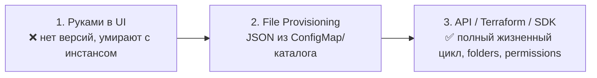

# 📊 08. Grafana as Code: Дашборды через Provisioning и SDK

> Методология «какие панели строить» — в [06. Alertmanager и Дашборды](06-alertmanager-and-dashboards-mastery.md). Здесь — инженерия: как дашборды попадают из Git в Grafana без клика мышкой.

## ⚙️ Три способа доставки дашбордов



| Способ | Создание | Изменение | Удаление | Когда |
| :--- | :--- | :--- | :--- | :--- |
| UI руками | мгновенно | мгновенно | мгновенно | черновики, личные |
| Provisioning (files) | ✅ | ✅ | ❌ не удаляет | простой стек без CI |
| Terraform provider | ✅ | ✅ | ✅ (state) | production-подход |

---

## 📝 Provisioning: JSON из каталога

```yaml
# /etc/grafana/provisioning/dashboards/main.yaml
apiVersion: 1
providers:
  - name: "default"
    orgId: 1
    folder: "Infra"
    type: file
    disableDeletion: false
    updateIntervalSeconds: 30
    options:
      path: /var/lib/grafana/dashboards
      foldersFromFilesStructure: true   # подкаталоги -> папки Grafana
```

В Kubernetes дашборды живут в ConfigMap с лейблом (подхватывает sidecar):

```yaml
apiVersion: v1
kind: ConfigMap
metadata:
  name: shop-overview
  namespace: monitoring
  labels:
    grafana_dashboard: "1"        # grafana-dashboard-sidecar грузит всё с этим лейблом
data:
  shop.json: |
    { "title": "Shop Overview", ... }
```

Экспорт текущего дашборда как отправная точка: **Share → Export → Save to file**, затем вычистить `id` и `meta` — остальное валидный provisioning-JSON.

---

## 🏗️ Анатомия дашборда: переменные решают всё

Хороший дашборд = один шаблон на все окружения. Динамика — через variables:

```json
{
  "title": "Service Overview",
  "templating": {
    "list": [
      {
        "name": "datasource",
        "type": "datasource",
        "query": "prometheus",
        "current": { "text": "Mimir" }
      },
      {
        "name": "namespace",
        "type": "query",
        "datasource": { "type": "prometheus", "uid": "${datasource}" },
        "query": "label_values(kube_pod_info, namespace)",
        "refresh": 2,
        "includeAll": false
      },
      {
        "name": "app",
        "type": "query",
        "definition": "label_values(kube_pod_info{namespace=\"$namespace\"}, app)",
        "query": { "query": "label_values(kube_pod_info{namespace=\"$namespace\"}, app)", "refId": "var" }
      }
    ]
  },
  "panels": [
    {
      "title": "Request Rate (5m)",
      "targets": [
        { "expr": "sum(rate(http_requests_total{namespace=\"$namespace\", app=\"$app\"}[5m])) by (code)" }
      ],
      "fieldConfig": {
        "defaults": {
          "unit": "reqps",
          "thresholds": { "steps": [ { "color": "green", "value": null } ] }
        }
      }
    }
  ]
}
```

Правила, которые экономят часы:

1. **Datasource — переменная** (`${datasource}`), а не UID хардкодом. Дашборд работает и в dev, и в кластере клиента.
2. Каскад переменных: `namespace` → `app` → `pod`. Значения через `label_values(...)`, refresh on time range change.
3. Единицы измерения (`unit`) задавать всегда — «число 0.42» против «420ms» читаются по-разному.
4. Панель-заголовок содержит агрегацию: «p99 latency (5m)» вместо «latency».

---

## 🧱 Library Panels и повторное использование

Библиотечные панели (Library Panels) — общие компоненты, встраиваемые в несколько дашбордов. Поменяли панель «Error rate» — обновилась везде.

```bash
# Через API: создать library panel
curl -X POST "$GRAFANA/api/library-elements" -H "Authorization: Bearer $TOKEN" \
  -d '{"name":"Golden Signals Row","model":{"type":"row","panels":[...]}}'
```

Паттерн: строка «четыре золотых сигнала» (rate, errors, latency p99, saturation) — одна library panel во всех сервисных дашбордах.

---

## 🤖 Terraform-провайдер: полный жизненный цикл

```hcl
terraform {
  required_providers {
    grafana = { source = "grafana/grafana", version = "~> 3.0" }
  }
}

provider "grafana" {
  url  = "https://grafana.company.local"
  auth = var.grafana_token     # service account token, не админ-пароль
}

resource "grafana_folder" "payments" {
  title = "Payments"
}

resource "grafana_data_source" "mimir" {
  type = "prometheus"
  name = "Mimir"
  url  = "http://mimir-gateway.monitoring/api/v1"
}

resource "grafana_dashboard" "shop" {
  folder      = grafana_folder.payments.uid
  config_json = file("${path.module}/dashboards/shop-overview.json")
}

# Алерт-правила тоже as code:
resource "grafana_rule_group" "slo" {
  name             = "shop-slo"
  folder_uid       = grafana_folder.payments.uid
  interval_seconds = 60

  rule {
    name      = "High error rate"
    condition = "B AND C"
    data {
      ref_id = "A"
      model {
        datasource = { type = "prometheus", uid = grafana_data_source.mimir.uid }
        expr       = "sum(rate(http_requests_total{code=~\"5..\"}[5m])) / sum(rate(http_requests_total[5m]))"
      }
    }
    # ... B: threshold >0.01, C: reduce last
    for               = "10m"
    notification_policy_uid = grafana_notification_policy.oncall.uid
  }
}
```

CI для дашбордов: PR с изменением JSON → `terraform plan` показывает diff → мерж → apply. Дашборд получает ревью, историю и откат, как обычный код.

Альтернативы SDK: **Grafana Foundation SDK** (Go/TS/Python — генерация типизированным кодом), **jsonnet + grafonnet** (классика k8s-mixin'ов).

---

## 🔬 Deep Dive: почему дашборды «врут» и как их проверять

Три систематические ошибки, которые делают панель бесполезной:

1. **Range vs Rate**: `rate(counter)` обязан брать окно ≥ 2× scrape_interval. При scrape 30s окно `[1m]` даёт пропуски — берите `[5m]` и пишите это в заголовке.
2. **Двойное суммирование**: `sum(rate(...)) by (pod)` по гистограммам усредняет по бакетам неправильно — для квантилей только `histogram_quantile(quantile, sum(rate(...)) by (le, ...))`.
3. **Absent ≠ ноль**: упавший экспортер рисует пустоту, а не ноль. Панель должна показывать `or vector(0)` или отдельный алерт `absent(...)` — иначе «тишина на графе» выглядит как «всё спокойно».

Чек приёмки нового дашборда:

```bash
# Все запросы дашборда должны выполняться быстро и без ошибок
for q in $(jq -r '.. | .expr? // empty' dashboard.json | sort -u); do
  curl -sg --data-urlencode "query=$q" "$MIMIR/api/v1/query?query=" | jq '.status'
done
```

---

## 🧨 Типовые грабли Production

| Симптом | Причина | Быстрое решение |
| :--- | :--- | :--- |
| После пересоздания Grafana дашборды пропали | Жили только в БД контейнера | Provisioning/terraform; экспорт всего через API в Git |
| Sidecar перезагружает дашборды каждые N сек | Конфликт двух источников одного uid | Один источник правды; uid фиксировать в JSON |
| Terraform хочет пересоздать дашборд каждый план | JSON генерится нестабильно (ключи/порядок) | Нормализовать JSON (`jq -S`), сравнивать нормализованное |
| Переменная `$app` пустая | label отсутствует на новых сериях | includeAll=true или дефолт; проверить `label_values` вручную |
| Граф показывает ступеньки/пропуски | Окно rate меньше 2× scrape interval | `[5m]`+ окна; recording rules для тяжёлых выражений |
| Права слетели после provision | Folder recreated с другим uid | Folder управлять terraform'ом целиком, не руками |

## 🧪 Hands-on Lab

```bash
# 1. Экспорт существующего дашборда в Git (одна команда на бэкап всего)
curl -s "$GRAFANA/api/search?type=dash-db" -H "Authorization: Bearer $TOKEN" \
  | jq -r '.[].uid' | while read u; do
    curl -s "$GRAFANA/api/dashboards/uid/$u" -H "Authorization: Bearer $TOKEN" \
      | jq '.dashboard | del(.id,.version)' > "dashboards/$u.json"
done

# 2. Локальная проверка всех expr из дашборда против Mimir
jq -r '..|.expr? // empty' dashboards/shop.json | sort -u

# 3. Provisioning локально за минуту
docker run --rm -p 3000:3000 -v ./dashboards:/var/lib/grafana/dashboards \
  -v ./provisioning:/etc/grafana/provisioning grafana/grafana:11.2.0
```

## ✅ Чек-лист зрелости темы

- [ ] Ни один production-дашборд не живёт только в UI Grafana
- [ ] Datasource и окружения — переменные, а не хардкод UID
- [ ] Общие панели вынесены в Library Panels
- [ ] Дашборды и алерты версионируются (Terraform/SDK) и проходят PR-review
- [ ] Все expr проверены: окна rate корректны, absent обрабатывается
- [ ] Есть процесс экспорта «ручных» дашбордов обратно в Git (иначе они расплодятся)

---

## 🧭 Что дальше

| Шаг | Материал |
| :--- | :--- |
| 🔬 Закрепить | [Lab 06: дашборд своего приложения](../16-guided-labs/06-lab-observability-stack.md) |
| 🛠️ Шаблоны | [Готовые правила и панели](../18-templates/03-observability-and-web.md) |

---

## 🎤 Пять вопросов для повторения

---


## ✅ Проверь себя

> Отвечай вслух до раскрытия ответа. Если «не помню» — вернись к разделу.


**В1. Перечислите три способа доставки дашбордов и ключевое ограничение file-provisioning.**

<details><summary>Ответ</summary>

UI руками (нет версий), file-provisioning (JSON из каталога/ConfigMap) и Terraform/API. Provisioning создаёт и обновляет, но НЕ удаляет дашборды при исчезновении файла — полный жизненный цикл с удалением даёт только Terraform provider.

</details>


**В2. Зачем datasource оформляют переменной дашборда, а не хардкодят UID?**

<details><summary>Ответ</summary>

Один шаблон начинает работать во всех окружениях (dev/staging/prod, разные инсталляции клиентов) — переключение источника данных становится выбором в выпадающем списке вместо правки JSON каждой панели.

</details>


**В3. Почему окно rate() должно быть не меньше двойного scrape interval?**

<details><summary>Ответ</summary>

rate считает по двум точкам минимум; при окне короче 2×интервала в окно может попасть одна точка или ни одной — график с пропусками и заниженными значениями. Практика: [5m] при scrape 30s, агрегация выносится в recording rules.

</details>


**В4. Какую проблему решает обработка absent()/or vector(0) на панелях и алертах?**

<details><summary>Ответ</summary>

Мёртвый экспортер рисует пустоту, которая визуально неотличима от «нуля и спокойствия». Явный zero-fallback или алерт absent() переводит тишину в сигнал — иначе падение источника данных выглядит как идеальная работа сервиса.

</details>


**В5. Terraform хочет пересоздать дашборд при каждом plan. Причина и лечение?**

<details><summary>Ответ</summary>

Нестабильная генерация JSON: порядок ключей/полей меняется между запусками. Лечение: нормализация (jq -S) перед записью в state, сравнение нормализованного содержимого; источник JSON фиксировать в Git, а не экспортировать каждый раз заново.

</details>
