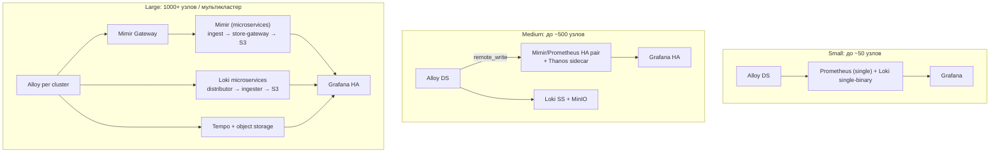

# 🏛️ 09. Архитектура Стека Мониторинга: Масштаб, HA и Кардинальность

> Финальная страница раздела: как собрать Prometheus/Loki/Tempo/Alloy в целостную систему, которая не падает под собственной нагрузкой. Отдельные компоненты — в [01–08](01-prometheus-and-grafana.md).

## ⚙️ Эталонные архитектуры по размеру



Критерии выбора:

- **Один кластер, всё локально**: kube-prometheus-stack из коробки.
- **Долгосрочное хранение метрик** (>15 дней): Thanos **или** Mimir — не оба сразу.
- **Несколько кластеров**: центральный приёмник (Mimir/Loki multi-tenant) + агенты с remote_write; дашборды смотрят в центр.
- **Строгие требования HA**: Grafana ≥2 реплики за LB, приёмники без single point of failure.

---

## 📝 Кардинальность: главный ресурс мониторинга

Кардинальность серии = число уникальных комбинаций лейблов. Она растёт **мультипликативно**:

```text
http_requests_total{
  method=5, code=4, handler=20,
  pod=200, namespace=10
} = 5 × 4 × 20 × 200 × 10 = 800 000 серий из ОДНОЙ метрики
```

### Где смотреть потребление

```promql
# Топ-10 серий по job'ам (Mimir/Prometheus)
topk(10, count by (job) ({__name__=~".+"}))

# Самые «тяжёлые» метрики
topk(10, count by (__name__) ({__name__=~".+"}))

# Сколько серий создаёт конкретный лейбл
count(count by (pod) (kube_pod_info))
```

### Правила гигиены

| Приём | Экономия |
| :--- | :--- |
| Не класть `user_id`, `request_id`, `trace_id` в labels | Порядок величины |
| `method`, `code`, `path` агрегировать шаблоном (`path="/api/users/:id"`) | ×100 на REST API |
| Drop неиспользуемых метрик на агенте (см. [07 Alloy](07-alloy-pipelines-cookbook.md)) | −20–40% |
| Recording rules для горячих запросов | Меньше CPU query-пути |
| Лимиты на tenant (Mimir `max_global_series_per_user`) | Защита от «соседа» |

!!! warning "Кардинальность ловит внезапно"
    Система работает месяцами, затем один сервис добавляет лейбл `session_id` — и ingest-путь ложится за час. Нужны лимиты per-tenant и алерт на скорость роста серий: `deriv(count({__name__=~".+"})[1h:]) > 0`.

---

## 🔐 Мультитенантность и изоляция

В Mimir/Loki/Tempo tenant определяется заголовком `X-Scope-OrgID`:

```river
// Alloy: пометить данные тенантом
prometheus.remote_write "mimir" {
  endpoint {
    url = "http://mimir-gateway/api/v1/push"
    headers = { "X-Scope-OrgID" = "team-payments" }
  }
}
```

Выгоды даже внутри одной компании:

1. **Лимиты и квоты** per-team: один «шумный» сервис не убивает чужой ingest.
2. **Изоляция доступа**: команда видит только свои метрики через datasource с tenant-заголовком.
3. **Стоимость**: chargeback по фактическому объёму серий и логов.

---

## 🚨 HA самого мониторинга: что действительно нужно

Компонент | Схема HA | Комментарий |
| :--- | :--- | :--- |
| Prometheus | Два инстанса, scrape одного и того же | Alertmanager dedup'ит алерты; запросы — через Thanos Query/Mimir |
| Alertmanager | Кластер из 3 | Обязателен gossip-кластер, иначе дубли/потери |
| Grafana | ≥2 реплики + внешняя БД (PG) | Сессии и дашборды вне пода |
| Loki | Read/Write/Backend split или SS | Replication factor ≥2, объектное хранилище |
| Object storage | S3/MinIO с версионированием | Единственное настоящее хранилище истории |

Частая ошибка: два Prometheus пишут в один remote endpoint **как HA-пару**, а приёмник считает их разными источниками → двойные данные. В Mimir это решается `external_labels: {cluster, __replica__}` — replica-дедупликация на стороне приёмника.

---

## ⚖️ Retention и стоимость: где заканчивать

Типовая политика хранения:

```yaml
# Метрики
Prometheus local:      15d          # только оперативные дашборды
Mimir/Thanos S3:
  raw (5s):            30d          # дебаг
  downsampled (5m):    13 месяцев   # тренды, capacity planning
# Логи (Loki)
application:           30d hot + 90d object storage
infrastructure:        14d
security/audit:        365d+ (отдельный tenant)
# Трейсы
tempo:                 7–14d        # дороже всего за байт, семплирование обязательно
```

Экономика: 90% стоимости съедает **объектное хранилище + репликация**, поэтому downsampling метрик и семплирование трейсов дают эффект больше любого тюнинга инстансов.

---

## 🔬 Deep Dive: мониторинг самого мониторинга

Метасистема (минимальный набор правил):

```yaml
# Умершие экспортеры — тишина вместо данных
- alert: TargetDown
  expr: up == 0
  for: 10m

# Приём метрик встал
- alert: RemoteWriteFailing
  expr: rate(prometheus_remote_storage_samples_failed_total[5m]) > 0
  for: 15m

# Взрыв кардинальности
- alert: SeriesExplosion
  expr: deriv(count(count by (__name__,job)({__name__=~".+"}))[1h:5m]) > 1000
  for: 30m

# Алерты перестали доставляться
- alert: AlertmanagerClusterDegraded
  expr: alertmanager_cluster_members < 3
```

Ирония системы: её падение обнаруживается последним. Поэтому — внешний синтетический пробник (uptime-kuma/blackbox из другого сегмента), который проверяет сам Grafana/Mimir HTTP-эндпоинты и шлёт в отдельный канал.

---

## 🧨 Типовые грабли Production

| Симптом | Причина | Быстрое решение |
| :--- | :--- | :--- |
| Метрики двоятся на графиках | HA-пара пишет обе реплики без дедупа | external_labels `__replica__`; дедуп на query-слое |
| Ingest-путь захлебнулся после релиза сервиса | Новый высокий лейбл | Drop-правило на агенте немедленно; фиксить метрику в коде |
| Запросы стали таймаутиться | Топ-дашборд сканирует `{__name__=~".+"}` | Переписать через recording rules; запретить голый матч-олл |
| История метрик исчезла через 15 дней | Только локальная retention Prometheus | Thanos/Mimir + S3 для долгого хранения |
| Loki OOM ночью | Ретеншн-компаунд удаляет огромный объём разом | Инкрементальный retention, таблицы меньшего периода |
| Алерты приходят трижды | Несколько Prometheus без общего Alertmanager-кластера | Один gossip-кластер AM, group_by |

## 🧪 Hands-on Lab

```bash
# Аудит кардинальности своего стека (выполняется в Mimir/Prometheus)
topk(10, count by (job) ({__name__=~".+"}))
topk(15, count by (__name__) ({__name__=~".+"}))

# Найти серии, у которых лейбл подозрительно высококардинален
count by (__name__) ({__name__=~".+"}) * on(__name__) group_left()
sum by (__name__) (label_replace(kube_pod_info, "__name__", "x", "", "")) or vector(0)

# Проверка здоровья приёма
rate(prometheus_remote_storage_samples_failed_total[5m])
prometheus_tsdb_head_series          # текущее число серий в head
```

## ✅ Чек-лист зрелости темы

- [ ] Архитектура соответствует масштабу (single / HA-pair / microservices) и зафиксирована документом
- [ ] Лимиты серий и логов per-tenant настроены, есть алерт на рост кардинальности
- [ ] Retention-политика определена для всех сигналов и подтверждена стоимостью хранения
- [ ] Alertmanager — gossip-кластер, дублей алертов нет
- [ ] Сам стек мониторинга мониторится + внешний синтетический пробник
- [ ] Long-term хранение на объектном сторадже с версионированием, восстановление проверялось

---

## 🧭 Что дальше

| Шаг | Материал |
| :--- | :--- |
| ➡️ Дальше | [Thanos/VictoriaMetrics/OTel](../20-senior-stack/02-observability-at-scale.md) |
| 🎤 Проверить себя | [Карточки Observability](../22-trainer/index.md) |

---

## 🎤 Пять вопросов для повторения

---


## ✅ Проверь себя

> Отвечай вслух до раскрытия ответа. Если «не помню» — вернись к разделу.


**В1. Как посчитать кардинальность метрики и почему она растёт мультипликативно?**

<details><summary>Ответ</summary>

Кардинальность серии = произведение количества уникальных значений каждого лейбла: method(5) × code(4) × handler(20) × pod(200) × ns(10) = 800 000 серий из одной метрики. Поэтому добавление «безобидного» лейбла вроде session_id взрывает ingest за час.

</details>


**В2. HA-пара Prometheus пишет оба инстанса в один приёмник — как избежать задвоения данных?**

<details><summary>Ответ</summary>

Проставить external_labels {cluster, __replica__} обоим инстансам и включить дедупликацию реплик на query/приёмнике (Thanos Query / Mimir). Иначе приёмник считает реплики разными источниками и все значения удваиваются.

</details>


**В3. Как устроена retention-политика для метрик: где живут сырые 5-секундные данные и тренды за год?**

<details><summary>Ответ</summary>

Локальный Prometheus — 15 дней оперативных дашбордов; сырые данные в S3 (Mimir/Thanos) — около месяца; downsampling до 5-минутных агрегатов — 13 месяцев для capacity planning. 90% стоимости съедает объектное хранилище, поэтому downsampling даёт эффект больше тюнинга инстансов.

</details>


**В4. Почему Alertmanager разворачивают gossip-кластером из трёх инстансов?**

<details><summary>Ответ</summary>

Кластер дедуплицирует алерты от нескольких Prometheus и переживает потерю узла. Одиночный AM — single point of failure: умрёт он — умрёт вся доставка нотификаций ровно в момент инцидента.

</details>


**В5. Как узнать, что упал сам мониторинг, если все алерты идут через него?**

<details><summary>Ответ</summary>

Внешний синтетический пробник (uptime-kuma/blackbox из другого сегмента) проверяет HTTP-эндпоинты Grafana/Mimir и шлёт в отдельный канал. Плюс метрики самого стека: up==0 таргетов, RemoteWriteFailing, AlertmanagerClusterDegraded.

</details>
