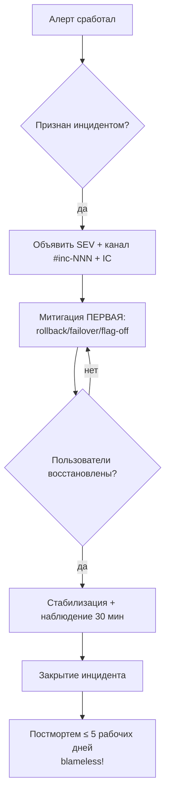

# 🚨 10. SRE-Процессы: Инциденты, Постмортемы, On-call

## 🧭 Роли и уровниseverity: договоритесь ДО инцидента

| Severity | Определение | Реакция | Пример |
|---|---|---|---|
| **SEV1** | полный отказ прод-функции, потеря денег/данных | будить всех, bridge, hourly updates | БД недоступна, checkout лежит |
| **SEV2** | деградация части пользователей/функций | реагировать в течение 15 мин, on-call | p99 ×5, ошибки 5xx >5% |
| **SEV3** | минорная деградация, есть workaround | рабочий день, ticket | медленный админ-панель |

Роли на SEV1+: **Incident Commander** (координация, НЕ чинит руками), **Communications Lead** (статусы стейкхолдерам), **Operations** (диагностика и митигация), **Scribe** (таймлайн решений).



## 🔥 Митигация прежде диагностики

Инцидент ≠ дебаг-сессия. Порядок приоритетов: **остановить кровотечение → понять причину → починить правильно**.

Быстрые рычаги (по возрастанию риска):

```bash
# 1. Feature flag off — мгновенно, без деплоя
curl -X PATCH flags.local/api/flags/checkout-new -d '{"enabled": false}'

# 2. Rollback деплоя — последняя известная хорошая версия
kubectl rollout undo deploy/checkout -n prod
helm rollback checkout 42 -n prod

# 3. Traffic shift — уводим трафик от больного
kubectl argo rollouts abort checkout       # см. Progressive Delivery

# 4. Failover региона/БД
patronictl switchover --master pg-node-1 --candidate pg-node-2

# 5. Scale out — если просто перегрузка
kubectl scale deploy/api --replicas=10
```

**Антипаттерн:** два часа читать исходники в поисках root cause, пока клиенты уходят к конкуренту.

## 📝 Постмортем: blameless шаблон

```markdown
# Postmortem: недоступность checkout 2026-08-25

**Автор:** @ivanov · **Дата:** 2026-08-27 · **SEV:** 2 · **Длительность:** 47 мин

## Summary (3 предложения)
Новый релиз checkout v2.14 вызвал исчерпание пула соединений PostgreSQL
из-за незакрытых транзакций при timeout. Доступность API упала до 62%.

## Impact
- 38 мин полной недоступности оплаты для 12% пользователей (eu-west)
- ~4 200 неуспешных заказов, оценочные потери 1.8M ₽
- SLO error budget месяца: потрачено 34% (было 8%)

## Timeline (UTC)
- 09:12 deploy v2.14 завершён
- 09:19 алерт HighErrorRate сработал
- 09:24 on-call признал SEV2, начал диагностику
- 09:41 rollback начат (после 17 мин поиска причины!)
- 09:52 восстановление подтверждено
- 11:30 постмортем назначен

## Root Cause
ORM-транзакция без context deadline держала соединения...

## Что прошло хорошо / что нет
✅ Алерт сработал за 7 мин · ✅ rollback безопасен
❌ 17 мин ушло на «почему» вместо немедленного отката
❌ Runbook по пулу соединений отсутствовал

## Action Items (каждый с owner и дедлайном!)
| Действие | Owner | Приоритет | Статус |
|---|---|---|---|
| Deadline на все транзакции ORM (lint-правило) | @dev-team | P0 | in progress |
| Авто-rollback при error rate >5% за 5 мин | @platform | P1 | backlog |
| Runbook «исчерпание pg pool» | @oncall | P1 | done |
```

**Blameless = фокус на системе:** не «Иван забыл deadline» а «процесс code review не ловит отсутствующие таймауты». Имена людей в причинах запрещены.

## 📞 On-call: устойчивая система дежурств

```text
Ротация: 2+ инженера, недельная, follow-the-sun если гео-распределены
Primary:   первая линия, ack < 5 мин (PagerDuty/Opsgenie)
Secondary: эскалация через 15 мин без ack
Handoff:   понедельник, 30 мин: открытые тикеты, горячие сервисы, pending action items
```

Правила гигиены:
- **Один сервис — один владелец.** «On-call всей платформы на всё» = burnout.
- Алерт должен быть **actionable**: если нельзя ничего сделать — это дашборд, не страница.
- Шум лечится удалением, а не игнорированием: каждый ложный алерт — action item.
- Компенсация/отдых после ночного инцидента — не бонус, а требование устойчивости.

## 💰 Error Budget Policy: SLO управляют приоритетами

Связь с практикой: SLO 99.9% = бюджет ошибок 43 мин/мес.

| Бюджет | Политика |
|---|---|
| >50% остаток | свободный темп фич |
| 25–50% | заморозить рисковые релизы, усилить тесты |
| <25% | только надёжность-work, обязательный review изменений |
| 0% | feature freeze до восстановления бюджета, IC-разбор |

Без такой политики SLO — декорация: команды продолжают пилить фичи поверх горящего бюджета.

## ❓ Пять вопросов для самопроверки

---


## ✅ Проверь себя

> Отвечай вслух до раскрытия ответа. Если «не помню» — вернись к разделу.


**В1. Почему митигация предшествует поиску root cause?**
<details><summary>Ответ</summary>
Каждая минута инцидента = растущий ущерб пользователям. Rollback/failover восстанавливает сервис за минуты без понимания причины; root cause можно искать спокойно после стабилизации. Обратный порядок превращает 15-минутный инцидент в часовую деградацию.
</details>

**В2. Что делает постмортем blameless и зачем это?**
<details><summary>Ответ</summary>
Анализ фокусируется на системных пробелах (отсутствующий линтер, неполный runbook), а не на ошибках конкретных людей. Люди, боящиеся наказания, скрывают инциденты и детали — организация теряет возможность учиться. Ответственность за предотвращение повторения несёт система процессов.
</details>

**В3. Чем actionable-алерт отличается от информационного?**
<details><summary>Ответ</summary>
Actionable требует действия дежурного прямо сейчас (перезапустить, откатить, эскалировать) и ведёт к нему: содержит symptom, affected scope, первую команду. Информационное («deploy завершён») должно идти в чат/дашборд — иначе оно тренирует on-call игнорировать страницы.
</details>

**В4. Как связаны error budget и скорость разработки?**
<details><summary>Ответ</summary>
Бюджет — измеримый контракт между надёжностью и скоростью: пока ошибки в пределах бюджета, команда выпускает фичи свободно; исчерпание автоматически переключает приоритеты на reliability-work. Это заменяет бесконечные споры «релизить ли в пятницу» данными.
</details>

**В5. Зачем отдельная роль Incident Commander, если есть опытный инженер?**
<details><summary>Ответ</summary>
Совмещение координации и диагностики ломает обе: копающийся в логах IC не обновляет стейкхолдеров и не следит за таймером эскалаций. IC держит картину целиком: роли, решения о митигации, коммуникацию — даже если технически разбирается хуже операторов.
</details>

---

*Что дальше:* [06. Alertmanager и SLO-алерты](06-alertmanager-and-dashboards-mastery.md) · [13. DR и бэкапы](../13-disaster-recovery-and-tools/02-database-backups-and-dr-plan.md)
