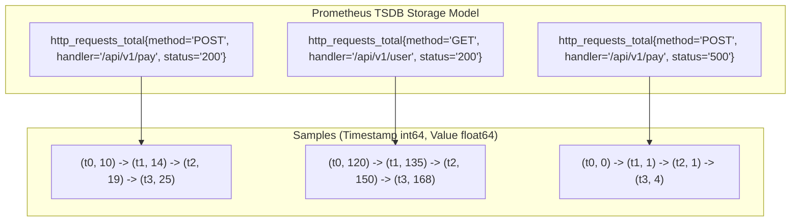
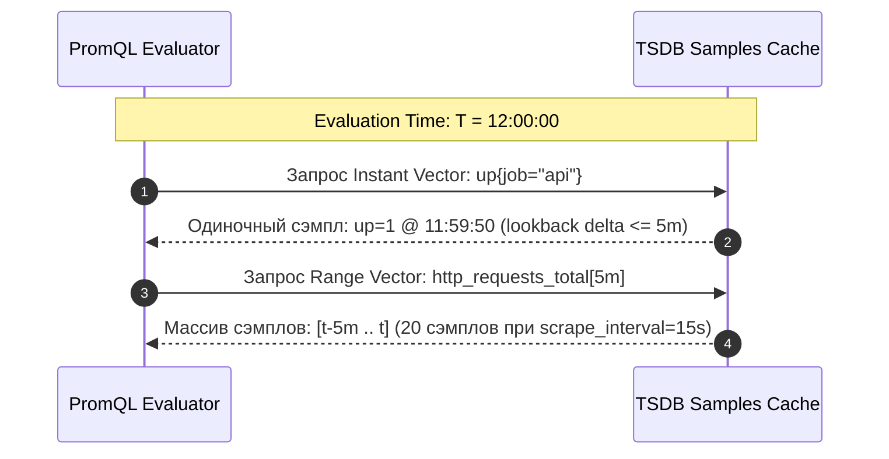
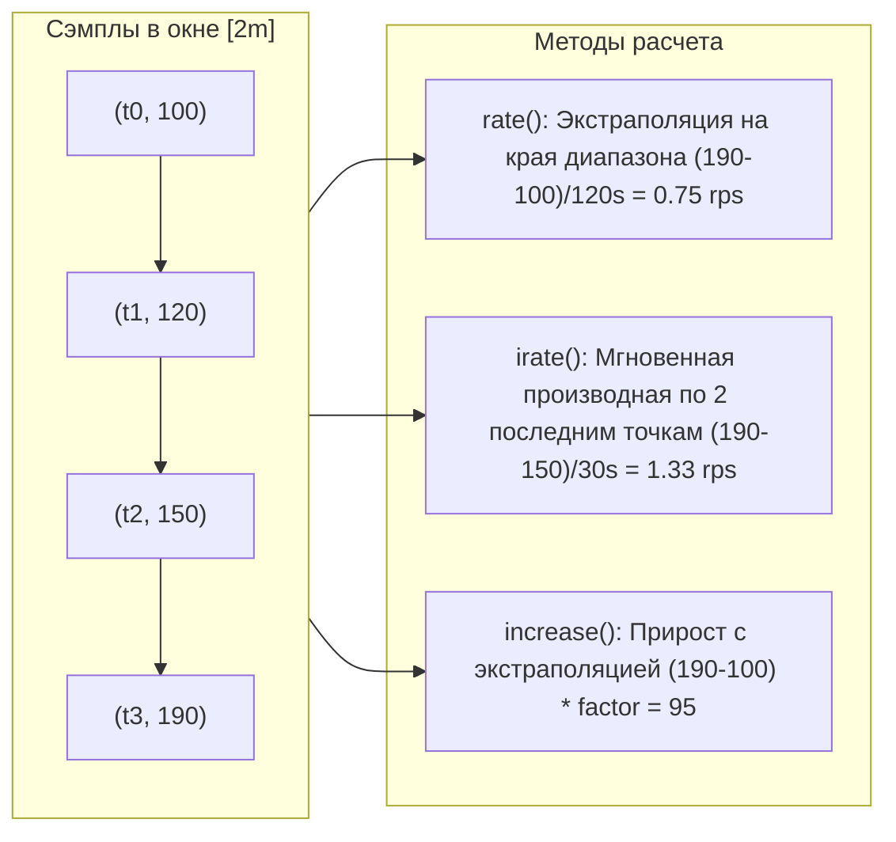
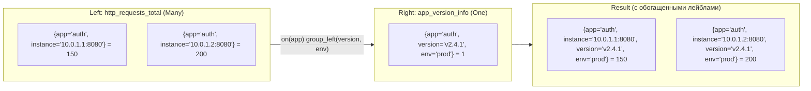

# 🔍 11. PromQL: Фундаментальные основы и базовые вычисления

PromQL (Prometheus Query Language) — это декларативный предметно-ориентированный язык запросов, спроектированный специально для работы с многомерными временными рядами в реальном времени. В отличие от традиционных SQL-подобных языков, PromQL оптимизирован для векторных вычислений над временными срезами и агрегаций распределенных метрик.

---

## 🏛️ Архитектура данных в Prometheus TSDB

Каждый временной ряд (Time Series) в Prometheus однозначно идентифицируется именем метрики и набором пар «ключ-значение» (labels). Внутри TSDB данные хранятся в виде сжатых блоков временных меток (int64 миллисекунды) и значений (float64).



### 4 фундаментальных типа метрик

| Тип метрики | Семантика | Особенности поведения | Типичные сценарии применения |
| :--- | :--- | :--- | :--- |
| **`Counter`** | Монотонно возрастающий счетчик | Сбрасывается только в 0 при рестарте процесса. Никогда не анализируется «сырым». | Количество HTTP-запросов, число ошибок, обработанные байты, счетчик перезапусков. |
| **`Gauge`** | Мгновенное значение (шкала) | Может произвольно расти, уменьшаться или оставаться неизменным. | Использование памяти/CPU, размер очереди, количество активных соединений, температура. |
| **`Histogram`** | Распределение значений по корзинам (buckets) | Накапливает счетчики в корзинах `_bucket{le="..."}`, сумму `_sum` и общее число `_count`. | Время выполнения запросов (latency), размеры payload. Позволяет считать процентили. |
| **`Summary`** | Распределение с расчетом квантилей на клиенте | Вычисляет квантили $\phi$ на клиенте, также отдает `_sum` и `_count`. Нельзя агрегировать между подами! | Локальный расчет задержек без необходимости нагружать сервер корзинами гистограмм. |

> [!WARNING]
> Никогда не используйте функции `rate()`, `irate()` или `increase()` над метриками типа `Gauge`. Эти функции содержат логику детекции сброса (reset correction), предполагая, что любое падение значения является перезапуском сервиса, что приведет к грубейшим искажениям при анализе Gauge.

---

## ⏱️ Типы данных PromQL: Instant Vector vs Range Vector vs Scalar

Понимание типов выражений — ключ к корректному составлению запросов:

1. **Instant Vector (Мгновенный вектор):** Набор временных рядов, где для каждого ряда возвращается ровно **одно** (последнее актуальное на момент запроса) значение.
   - Пример: `http_requests_total{status="200"}`
2. **Range Vector (Вектор интервала):** Набор временных рядов, содержащих **буфер сэмплов** за указанный промежуток времени в прошлом для каждого ряда.
   - Синтаксис: `http_requests_total{status="200"}[5m]`
   - Range-векторы **нельзя** напрямую отобразить на графике в Grafana, они служат входными данными для функций (`rate`, `increase`, `avg_over_time` и т.д.).
3. **Scalar (Скаляр):** Простое числовое значение с плавающей точкой (например, `42` или результат функции `scalar()`).
4. **String (Строка):** Строковый литерал (на данный момент используется ограниченно).



---

## 🧮 Математика rate(), irate() и increase()

Это три основные функции для работы со счетчиками (`Counter`), но математика их расчета кардинально отличается.



### 1. `rate(v[d])` — Первостепенный выбор для мониторинга и алертинга
- **Как работает:** Вычисляет среднюю скорость прироста счетчика в секунду на скользящем окне `d`.
- **Экстраполяция:** Prometheus компенсирует тот факт, что первый и последний сэмплы не совпадают в точности с границами временного окна `[d]`, экстраполируя тренд линейно.
- **Детекция сброса:** Если значение сэмпла меньше предыдущего (например: `100 -> 120 -> 5 -> 15`), Prometheus считает, что произошел перезапуск счетчика, прибавляет предыдущее максимальное значение и продолжает подсчет.

### 2. `increase(v[d])` — Абсолютный прирост за интервал
- **Как работает:** Вычисляет суммарный прирост счетчика за интервал `d`.
- **Формула:** `increase(v[d]) = rate(v[d]) * d (в секундах)`.
- **Ловушка экстраполяции:** Из-за линейной экстраполяции `increase` для целочисленных событий может вернуть дробное число (например, `5.34` запроса).

### 3. `irate(v[d])` — Мгновенная скорость (Instant Rate)
- **Как работает:** Анализирует **только две последние точки** внутри диапазона `[d]` и делит дельту на разницу во времени между ними.
- **Когда использовать:** Только для исследования высокодинамичных всплесков (spikes) на детальных графиках в Grafana.
- **Почему нельзя использовать для алертов:** Чрезвычайно чувствителен к шуму и единичным всплескам; не отражает среднее поведение системы.

---

## 🔗 Сопоставление векторов (Vector Matching): on, ignoring, group_left, group_right

Когда вы выполняете бинарные операции (`+`, `-`, `*`, `/`, `==`, `and`, `unless`) между двумя Instant Vectors, Prometheus сопоставляет ряды по совпадению меток.

### 1. Сопоставление One-to-One (Один-к-одному)

По умолчанию Prometheus требует точного совпадения всех меток. Если метки различаются, применяются модификаторы:
- `on(label_list)` — сопоставлять **только** по указанным меткам.
- `ignoring(label_list)` — сопоставлять по всем меткам, **кроме** указанных.

```promql
# Вычисление доли используемой памяти контейнера относительно лимита
container_memory_working_set_bytes{container="api"}
/ on(pod, namespace)
container_spec_memory_limit_bytes{container="api"}
```

### 2. Сопоставление Many-to-One / One-to-Many (`group_left`, `group_right`)

Когда на одной стороне сопоставления находится больше рядов с одинаковым набором ключей, чем на другой:
- `group_left`: сторона слева имеет мощность "Many" (много рядов сопоставляются с одним справа). Позволяет копировать метки из правого вектора.
- `group_right`: сторона справа имеет мощность "Many".



Пример рабочего запроса:
```promql
# Обогатить метрику RPS информацией о версии и окружении из информационной метрики
rate(http_requests_total[5m])
* on(app) group_left(version, env)
app_version_info
```

---

## 🛠️ CLI & Production PromQL Cheat Sheet

### Тестирование и валидация запросов через cURL & Promtool

```bash
# 1. Выполнение Instant Query через HTTP API Prometheus
curl -sG 'http://prometheus.monitoring.svc.cluster.local:9090/api/v1/query' \
  --data-urlencode 'query=sum(rate(http_requests_total{status=~"5.."}[5m])) by (service)' | jq .

# 2. Выполнение Range Query за последние 30 минут с шагом 15s
curl -sG 'http://prometheus.monitoring.svc.cluster.local:9090/api/v1/query_range' \
  --data-urlencode 'query=rate(node_cpu_seconds_total{mode!="idle"}[2m])' \
  --data-urlencode "start=$(date -u -d '30 minutes ago' +%s)" \
  --data-urlencode "end=$(date -u +%s)" \
  --data-urlencode 'step=15s' | jq .data.result[0]

# 3. Анализ кардинальности TSDB (Топ серий по именам и лейблам)
curl -s 'http://prometheus.monitoring.svc.cluster.local:9090/api/v1/status/tsdb' | jq .data.seriesCountByMetricName[0:10]

# 4. Проверка синтаксиса файлов правил PromQL
promtool check rules /etc/prometheus/rules/*.yaml
```

### Золотой набор продакшн-запросов PromQL

```promql
# 1. Сетевой трафик (Входящий Mbit/s по сетевым интерфейсам хоста)
sum by (instance, device) (rate(node_network_receive_bytes_total{device!~"lo|veth.*|docker.*|flannel.*"}[5m])) * 8 / 1024 / 1024

# 2. Утилизация CPU пода относительно request-лимита в Kubernetes
sum by (pod, namespace) (
  rate(container_cpu_usage_seconds_total{container!=""}[5m])
) 
/ 
sum by (pod, namespace) (
  kube_pod_container_resource_requests{resource="cpu"}
) * 100

# 3. Доля ошибок (Error Rate percentage)
(
  sum(rate(http_requests_total{status=~"5.*"}[5m]))
  /
  sum(rate(http_requests_total[5m]))
) * 100

# 4. Детекция утечки файловых дескрипторов процесса
process_open_fds / process_max_fds > 0.85
```

---

## 🔧 Диагностика и разрешение проблем (Troubleshooting)

### Сценарий 1: Пропадание данных или ступенчатые графики (Graph Gaps)
- **Симптом:** На графике в Grafana появляются разрывы линий при малых интервалах range-вектора.
- **Причина:** Нарушение правила соотношения scrape_interval и range window. Если `scrape_interval = 30s`, а запрос использует `rate(metric[30s])`, Prometheus попадает в ситуацию, когда в интервал попадает ровно 1 сэмпл (для расчета rate нужно минимум 2 сэмпла).
- **Диагностика:**
  ```bash
  # Проверить глобальный scrape_interval в конфигурации Prometheus
  curl -s http://localhost:9090/api/v1/status/config | jq '.data.yaml' | grep scrape_interval
  ```
- **Решение:** Размер окна range-вектора должен быть **минимум в 4 раза больше** `scrape_interval` (например, `rate(metric[2m])` при скрайпе в 30s). В Grafana используйте переменную `$__rate_interval`.

### Сценарий 2: Ошибка "many-to-many matching not allowed"
- **Симптом:** Запрос `metric_a * on(cluster) metric_b` завершается ошибкой: `found duplicate series for the match group`.
- **Причина:** С обеих сторон выражения присутствует несколько рядов с одинаковым значением лейбла `cluster`.
- **Решение:** Уточните список лейблов в `on(...)` или предварительно агрегируйте один из векторов с помощью `sum by (...)`:
  ```promql
  # Исправленный вариант с предварительной агрегацией
  metric_a * on(cluster, region) group_left() sum by (cluster, region) (metric_b)
  ```

---

## 🧠 Проверь себя

1. Почему выражение `increase(http_requests_total[5m])` может возвращать дробные числа для целочисленных счетчиков?
2. В каких случаях функция `irate()` предпочтительнее `rate()`, и почему ее категорически запрещено использовать в Alerting Rules?
3. Что вернет выражение `http_requests_total == 100` — скалярное булево значение или отфильтрованный вектор временных рядов?
4. В чем разница между `sum by (node) (metric)` и `sum without (instance, pod) (metric)`?
5. Что произойдет, если выполнить операцию деления между двумя Instant Vectors без указания `group_left` / `group_right`, если мощность меток слева $N$, а справа $1$?
