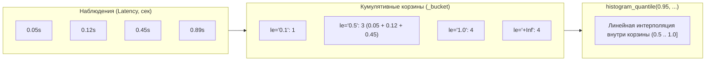
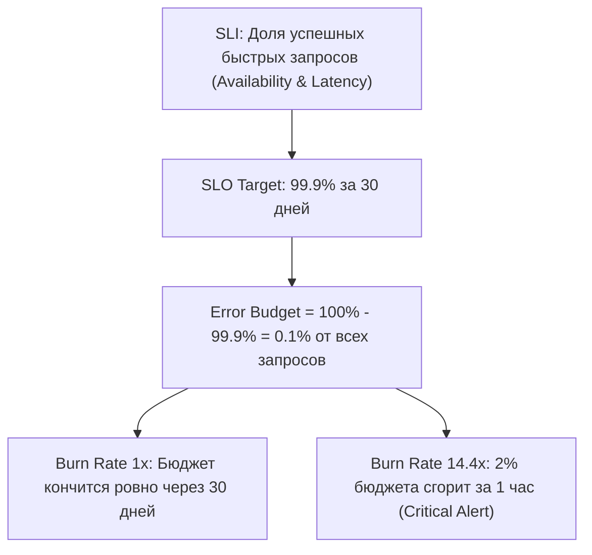
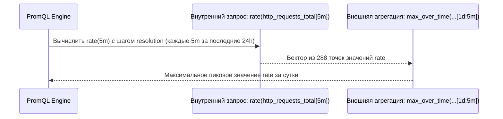

# ⚡ 12. Продвинутый PromQL: Гистограммы, Квантили и Агрегации

Продвинутый анализ данных в PromQL требует глубокого понимания математического аппарата квантилей, работы с составными агрегациями, подзапросами (subqueries) и прогностическими функциями для построения надежных SLI/SLO и мониторинга насыщенности систем.

---

## 📊 Анатомия классических гистограмм и histogram_quantile()

Классическая гистограмма Prometheus экспортирует кумулятивные счетчики сэмплов, попавших в интервалы значений, заданные лейблом `le` (less than or equal):
- `<basename>_bucket{le="0.1"}` — число наблюдений $\le 100\text{ ms}$
- `<basename>_bucket{le="0.5"}` — число наблюдений $\le 500\text{ ms}$
- `<basename>_bucket{le="+Inf"}` — общее число всех наблюдений (всегда равно `<basename>_count`)
- `<basename>_sum` — арифметическая сумма всех измеренных величин



### Математика линейной интерполяции

Функция `histogram_quantile(φ, v)` рассчитывает $\phi$-квантиль ($0 \le \phi \le 1$):
1. Вычисляет суммарное количество сэмплов $N = \text{bucket}_{+\text{Inf}}$.
2. Находит целевой ранг сэмпла: $R = \phi \times N$.
3. Определяет корзину $[le_{\text{lower}}, le_{\text{upper}}]$, в которую попадает ранг $R$.
4. Применяет **линейную интерполяцию** внутри корзины в предположении, что сэмплы распределены равномерно:

$$\text{Quantile} = le_{\text{lower}} + (le_{\text{upper}} - le_{\text{lower}}) \times \frac{R - N_{\text{lower}}}{N_{\text{upper}} - N_{\text{lower}}}$$

### Канонический запрос расчета 95-го и 99-го процентилей

```promql
# p95 задержки HTTP-ответов по сервисам
histogram_quantile(0.95,
  sum by (le, service) (
    rate(http_request_duration_seconds_bucket[5m])
  )
)
```

> [!IMPORTANT]
> При агрегации корзин всегда сохраняйте лейбл `le` в блоке `sum by (le, ...)`! Если убрать `le`, `histogram_quantile` потеряет границы интервалов и вернет `NaN`.

---

## 🧬 Native Histograms (Встроенные экспоненциальные гистограммы)

Начиная с Prometheus 2.40+ (и стабильно в Prometheus 3.x), доступен механизм Native Histograms:
- Нет необходимости вручную настраивать статические корзины `le`.
- Динамические экспоненциальные границы корзин с контролируемой схемой точности (customizable resolution factor).
- Все корзины передаются внутри единого TSDB сэмпла, снижая сетевой оверхед и кардинальность на 80-90%.

```promql
# Запрос процентиля для Native Histograms (без необходимости передачи _bucket)
histogram_quantile(0.99, rate(http_request_duration_seconds[5m]))
```

---

## 🎯 Расчет SLI / SLO и Error Budget

SRE-практика строится на определении Service Level Indicators (SLI) и допустимого бюджета ошибок (Error Budget).



### 1. Availability SLI (Коэффициент доступности)
Отношение успешных HTTP-ответов (не 5xx) к общему объему трафика:

```promql
# Availability SLI за скользящие 30 дней
sum(increase(http_requests_total{job="api-gateway", status!~"5.."}[30d]))
/
sum(increase(http_requests_total{job="api-gateway"}[30d]))
```

### 2. Multi-Window Multi-Burn-Rate Alerts (Google SRE Workbook)
Для предотвращения ложных срабатываний и быстрой реакции на катастрофические сбои применяются согласованные окна проверки скорости сгорания бюджета (Burn Rate):

```promql
# Critical Alert: Сгорание 2% Error Budget за 1 час (Burn Rate = 14.4)
# Требует одновременного превышения в коротком (5m) и длинном (1h) окнах:
(
  (
    sum(rate(http_requests_total{job="payment-service", status=~"5.."}[1h]))
    /
    sum(rate(http_requests_total{job="payment-service"}[1h]))
  ) > (1 - 0.999) * 14.4
)
and
(
  (
    sum(rate(http_requests_total{job="payment-service", status=~"5.."}[5m]))
    /
    sum(rate(http_requests_total{job="payment-service"}[5m]))
  ) > (1 - 0.999) * 14.4
)
```

---

## 🔄 Подзапросы (Subqueries): `[range:resolution]`

Подзапросы позволяют выполнять вложенные агрегации: рассчитать мгновенный вектор функции по диапазону, а затем применить over-time функцию к результату.

**Синтаксис:** `<instant_query>[<range>:<resolution>]`



### Практические примеры Subqueries

```promql
# 1. Максимальный пиковый RPS сервиса за последние 24 часа с гранулярностью в 1 минуту
max_over_time(
  sum(rate(http_requests_total{job="checkout"}[5m]))[24h:1m]
)

# 2. Определение стандартного отклонения утилизации CPU за 7 дней
stddev_over_time(
  avg by (instance) (rate(node_cpu_seconds_total{mode!="idle"}[5m]))[7d:10m]
)

# 3. Девяностый процентиль RPS за неделю
quantile_over_time(0.90,
  sum(rate(http_requests_total[5m]))[7d:15m]
)
```

---

## 📐 Продвинутые агрегаторы и математические преобразования

### 1. Расширенные агрегаторы `topk`, `bottomk`, `count_values`, `quantile`

```promql
# Топ-5 подов, потребляющих больше всего памяти в неймспейсе
topk(5, sum by (pod) (container_memory_working_set_bytes{namespace="prod"}))

# Распределение версий приложения в кластере (сколько подов на какой версии запущено)
count_values("version", app_build_info)

# Расчет 75-го квантиля использования CPU среди всех нод
quantile(0.75, 100 - (avg by (instance) (rate(node_cpu_seconds_total{mode="idle"}[5m])) * 100))
```

### 2. Предиктивная аналитика и линейная экстраполяция: `predict_linear()`
Функция `predict_linear(v[d], t)` строит линейную регрессию по данным за интервал `d` и прогнозирует значение через `t` секунд в будущем.

```promql
# Алерт: Свободное место на диске исчерпается менее чем за 4 часа
(
  predict_linear(node_filesystem_free_bytes{mountpoint="/"}[4h], 4 * 3600) < 0
)
and
(
  rate(node_filesystem_free_bytes{mountpoint="/"}[1h]) < 0
)
```

### 3. Ограничители и детекторы стабильности: `clamp_max`, `changes`, `resets`

```promql
# Ограничение диапазона отображения процентов от 0 до 100 (защита от скачков интерполяции)
clamp_max(clamp_min(rate(node_cpu_seconds_total{mode!="idle"}[5m]) * 100, 0), 100)

# Количество изменений состояния пода (частые переключения Ready/NotReady)
changes(kube_pod_status_phase{phase="Running"}[1h]) > 5

# Количество сбросов счетчика (рестартов процесса приложения) за последние 2 часа
resets(process_cpu_seconds_total[2h])
```

---

## 🛠️ Production PromQL Playbook: Готовые запросы

```promql
# 1. Коэффициент деградации Latency (отношение текущей задержки к медиане за прошлую неделю)
histogram_quantile(0.95, sum by (le) (rate(http_request_duration_seconds_bucket[5m])))
/
histogram_quantile(0.95, sum by (le) (rate(http_request_duration_seconds_bucket[5m] offset 7d)))

# 2. Поиск подов, у которых Memory Working Set приближается к Memory Limit (> 90%)
(
  sum by (pod, namespace) (container_memory_working_set_bytes{container!=""})
  /
  sum by (pod, namespace) (container_spec_memory_limit_bytes{container!=""})
) * 100 > 90

# 3. Балансировка трафика: отклонение RPS между репликами пода > 25% от среднего
abs(
  rate(http_requests_total[5m]) - ignoring(instance, pod) group_left()
  avg by (service) (rate(http_requests_total[5m]))
)
/ ignoring(instance, pod) group_left()
avg by (service) (rate(http_requests_total[5m])) > 0.25
```

---

## 🔧 Диагностика и разрешение проблем (Troubleshooting)

### Сценарий 1: Запрос с `histogram_quantile` возвращает аномально низкие или завышенные задержки
- **Симптом:** $p99$ задержки скачет от $1\text{ ms}$ до $10\text{ s}$ без видимой причины.
- **Причина:** Неправильно подобрана сетка корзин (bucket distribution). Если большинство запросов длятся $150\text{ ms}$, а корзины настроены как `[0.01, 0.1, 10.0]`, линейная интерполяция между $0.1$ и $10.0$ даст сильное искажение.
- **Решение:**
  1. Экспортируйте корзины с экспоненциальным шагом в области ожидаемой задержки (например, `[0.05, 0.1, 0.2, 0.4, 0.8, 1.6, 3.2]`).
  2. Проверьте, чтобы в корзину `+Inf` не попадало более 5-10% общего объема сэмплов при нормальной работе.

### Сценарий 2: Subquery вызывает OOM (Out Of Memory) или Query Timeout
- **Симптом:** Запрос `max_over_time(rate(metric[1m])[30d:10s])` роняет Prometheus с ошибкой context deadline exceeded.
- **Причина:** Слишком мелкий шаг `resolution` (`10s`) на огромном интервале (`30d`). Движок пытается вычислить и удержать в оперативной памяти $259\,200$ мгновенных срезов.
- **Решение:**
  1. Увеличьте `resolution` до адекватного масштаба: `[30d:15m]`.
  2. Для тяжелых аналитических выборок используйте **Recording Rules** вместо динамических subqueries.

---

## 🧠 Проверь себя

1. Почему `histogram_quantile()` не может вычислить точное значение перцентиля и полагается на линейную интерполяцию?
2. Почему в Google SRE Multi-Window Multi-Burn-Rate алертах обязательно объединяются короткое (5m) и длинное (1h) временные окна оператором `and`?
3. Что означает синтаксис `[1d:5m]` в выражении `avg_over_time(rate(metric[5m])[1d:5m])`?
4. Чем отличаются функции `changes()` и `resets()` при анализе временного ряда?
5. Как с помощью `predict_linear()` спрогнозировать момент переполнения дискового пространства до 100%?
