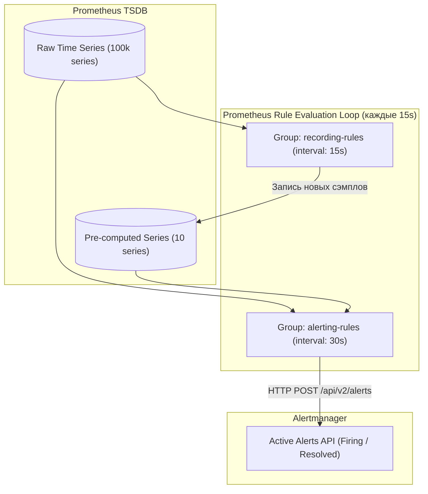
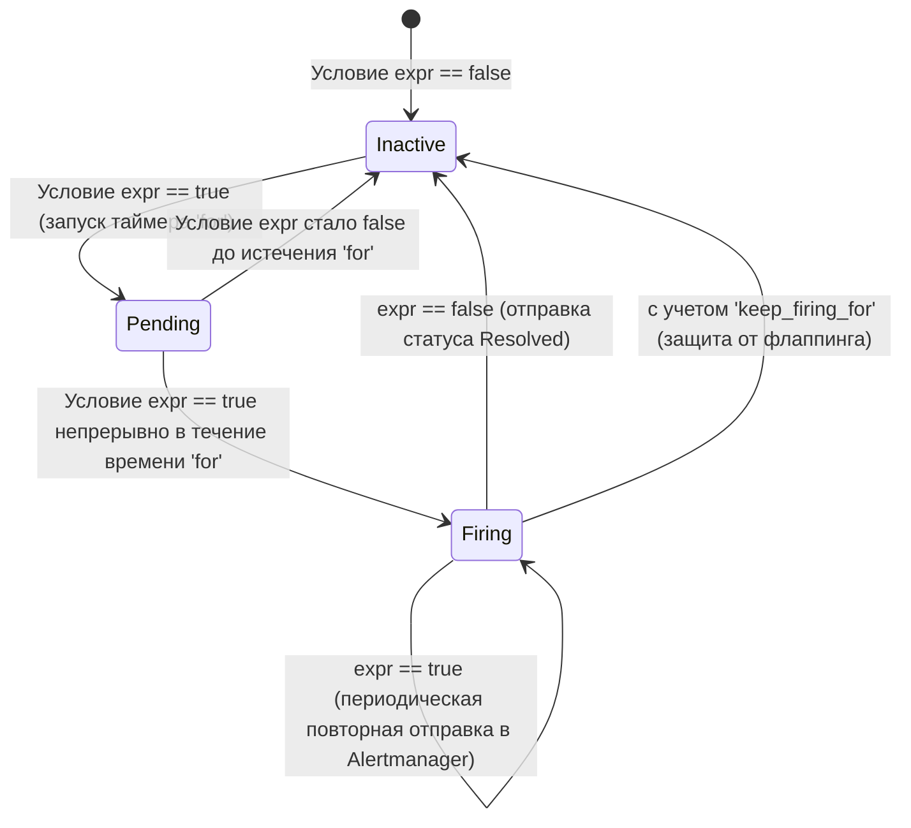

# 🚨 13. Prometheus Rules: Recording Rules и Alerting Rules

В Prometheus механизм вычисления правил (Rule Evaluation Engine) выполняет две критические функции: предварительный расчет тяжелых запросов (**Recording Rules**) и генерацию аварийных сигналов (**Alerting Rules**).

---

## ⚙️ Движок вычисления правил (Rule Evaluation Engine)

Правила объединяются в именованные группы (`groups`). Внутри одной группы правила всегда вычисляются **последовательно** через фиксированный интервал `interval`. Разные группы вычисляются **параллельно**.



### Жизненный цикл и стейт-машина алерта



---

## 📈 Recording Rules: Оптимизация и стандарты именования

Recording Rules позволяют непрерывно рассчитывать ресурсоемкие PromQL-выражения (например, $p99$ задержки по миллионам серий) и сохранять результат как новый временной ряд в TSDB.

### Соглашение об именовании (Prometheus Best Practices)
Синтаксис имени: `level:metric:operations`
- `level`: уровень агрегации (`job`, `instance`, `cluster`, `namespace`).
- `metric`: оригинальное имя метрики.
- `operations`: список примененных функций (`rate5m`, `sum`, `p95`).

### Пример production-конфигурации Recording Rules

```yaml
# /etc/prometheus/rules/recording_rules.yaml
groups:
  - name: service_http_aggregations
    interval: 15s
    rules:
      # 1. RPS на уровне job/handler
      - record: job_handler:http_requests_total:rate5m
        expr: sum by (job, handler) (rate(http_requests_total{job="api-service"}[5m]))

      # 2. 95-й процентиль задержки на уровне сервиса
      - record: job:http_request_duration_seconds:p95_rate5m
        expr: histogram_quantile(0.95, sum by (job, le) (rate(http_request_duration_seconds_bucket{job="api-service"}[5m])))

      # 3. Доля ошибок (Error Ratio)
      - record: job:http_requests_error:ratio_rate5m
        expr: |
          sum by (job) (rate(http_requests_total{job="api-service", status=~"5.."}[5m]))
          /
          sum by (job) (rate(http_requests_total{job="api-service"}[5m]))
```

---

## 🚨 Alerting Rules: Синтаксис, Шаблонизация и Anti-Flapping

### Конфигурация Alerting Rules

```yaml
# /etc/prometheus/rules/alerting_rules.yaml
groups:
  - name: production_sla_alerts
    interval: 30s
    rules:
      - alert: ServiceHighErrorRate
        expr: job:http_requests_error:ratio_rate5m{job="api-service"} > 0.05
        for: 3m
        keep_firing_for: 5m  # Защита от дребезга (flapping): удерживать алерт активным 5м после нормализации
        labels:
          severity: critical
          tier: backend
          team: platform
        annotations:
          summary: "Высокий процент 5xx ошибок в сервисе {{ $labels.job }}"
          description: "Текущий уровень ошибок: {{ $value | humanizePercentage }} (порог: 5%). Затронут сервис {{ $labels.job }}."
          runbook_url: "https://wiki.corp.com/runbooks/api-high-errors"
          dashboard_url: "https://grafana.corp.com/d/api-overview?var-service={{ $labels.job }}"

      - alert: HostDiskWillFillIn4Hours
        expr: |
          (predict_linear(node_filesystem_free_bytes{mountpoint="/"}[1h], 4 * 3600) < 0)
          and
          (rate(node_filesystem_free_bytes{mountpoint="/"}[30m]) < 0)
        for: 10m
        labels:
          severity: warning
          team: infra
        annotations:
          summary: "Дисковое пространство на {{ $labels.instance }} скоро закончится"
          description: "На точке монтирования {{ $labels.mountpoint }} при текущем темпе записи диск будет заполнен на 100% менее чем через 4 часа."
```

---

## 🧪 Модульное тестирование правил через promtool

Prometheus поставляется с мощным фреймворком для TDD/Unit-тестирования правил алертинга и предварительного расчета.

### Структура тестового файла (`rules_test.yaml`)

```yaml
rule_files:
  - recording_rules.yaml
  - alerting_rules.yaml

evaluation_interval: 1m

tests:
  # Тест 1: Проверка корректности Recording Rule
  - interval: 1m
    input_series:
      - series: 'http_requests_total{job="api-service", handler="/pay", status="200"}'
        values: '0+10x10' # Каждую минуту прирост на 10 (10/60 = 0.166 rps)
      - series: 'http_requests_total{job="api-service", handler="/pay", status="500"}'
        values: '0+0x5 0+50x5' # Первые 5 минут 0 ошибок, затем всплеск 50 ошибок/мин
    
    external_labels:
      cluster: prod-eu-1

    promql_expr_test:
      - expr: job_handler:http_requests_total:rate5m{job="api-service", handler="/pay"}
        eval_time: 5m
        exp_samples:
          - labels: '{job="api-service", handler="/pay"}'
            value: 0.16666666666666666

    # Тест 2: Проверка срабатывания Alerting Rule
    alert_rule_test:
      - eval_time: 8m
        alertname: ServiceHighErrorRate
        exp_alerts:
          - exp_labels:
              severity: critical
              tier: backend
              team: platform
              job: api-service
            exp_annotations:
              summary: "Высокий процент 5xx ошибок в сервисе api-service"
```

### Запуск тестов в CI/CD

```bash
# 1. Валидация синтаксиса файлов правил
promtool check rules /etc/prometheus/rules/*.yaml

# 2. Выполнение Unit-тестов
promtool test rules /etc/prometheus/tests/rules_test.yaml
```

---

## 🛠️ CLI Cheat Sheet для управления правилами

```bash
# 1. Горячая перезагрузка конфигурации правил без остановки Prometheus (требует флага --web.enable-lifecycle)
curl -X POST http://localhost:9090/-/reload

# 2. Проверка состояния всех активных и пендинг алертов через Prometheus API
curl -s http://localhost:9090/api/v1/alerts | jq '.data.alerts[] | {alertname: .labels.alertname, state: .state, activeAt: .activeAt}'

# 3. Список зарегистрированных групп правил и статистика их выполнения
curl -s http://localhost:9090/api/v1/rules | jq '.data.groups[] | {name: .name, interval: .interval, evaluationTime: .evaluationTime, lastEvaluation: .lastEvaluation}'
```

---

## 🔧 Диагностика и разрешение проблем (Troubleshooting)

### Сценарий 1: Длительное вычисление правил (Rule Group Evaluation Missed)
- **Симптом:** В логах Prometheus появляются сообщения: `Rule group "xxx" evaluation took 18.2s, longer than the interval 15s`.
- **Причина:** Запрос в одном из правил содержит неоптимизированный PromQL (высокая кардинальность, выборки без фильтрации по `job`, тяжелые подзапросы).
- **Диагностика:**
  ```bash
  # Найти группы с самым долгим временем выполнения
  curl -s http://localhost:9090/api/v1/rules | jq '.data.groups[] | {name: .name, evalDuration: .evaluationTime}' | sort -k2 -r
  ```
- **Решение:**
  1. Разделите одну большую группу с 50 правилами на несколько изолированных групп (они будут вычисляться параллельно).
  2. Перепишите запросы, заменяя объединения по десяткам меток на точечные `sum by (service)`.

### Сценарий 2: Алерт постоянно переходит между Firing и Resolved (Flapping)
- **Симптом:** Дежурные инженеры получают десятки пушей в минуту с отменой и повторным открытием одного и того же инцидента.
- **Причина:** Метрика колеблется вокруг порога (например, 5.01% -> 4.99% -> 5.02%), а параметр `for` слишком мал.
- **Решение:**
  1. Добавьте параметр `keep_firing_for: 5m..15m`, чтобы алерт не закрывался мгновенно при кратковременном падении ниже порога.
  2. Сглаживайте метрику в выражении `expr`, используя увеличенное окно `rate(...[10m])` вместо `[1m]`.

---

## 🧠 Проверь себя

1. Что произойдет, если время выполнения всех правил в группе превысит заданный `interval` группы?
2. В каком состоянии находится алерт, если его выражение `expr` возвращает true, но время `for` еще не истекло?
3. Каким образом `keep_firing_for` предотвращает ночной шквал нотификаций при пограничных колебаниях метрик?
4. Для чего в Recording Rules используется строгий стандарт именования `level:metric:operations`?
5. Как в аннотациях алерта вывести текущее значение вычисленного выражения в процентах?
