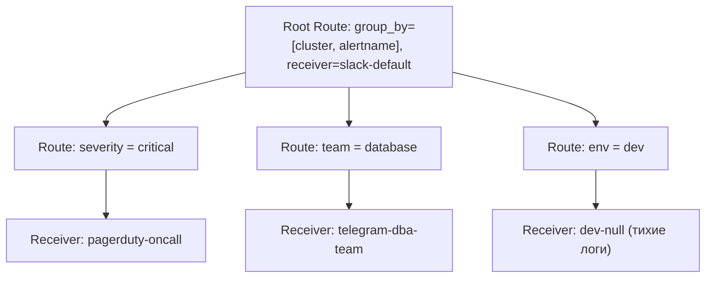

# 🔔 14. Alertmanager: Архитектура, Маршрутизация и Подавление

Alertmanager — это компонент экосистемы Prometheus, отвечающий за дедупликацию, группировку, маршрутизацию, подавление (inhibition) и отправку уведомлений об инцидентах во внешние системы (Telegram, Slack, PagerDuty, Webhooks).

---

## 🏛️ Архитектура высокой доступности (HA Cluster)

Alertmanager не использует консенсус Raft. Вместо этого кластер строится на базе **Gossip Protocol** с использованием библиотеки **HashiCorp Memberlist** (порт `9094` TCP/UDP).

```mermaid
graph TD
    subgraph PromCluster["Prometheus Instances (HA Pair)"]
        Prom1["Prometheus 1 (Primary)"]
        Prom2["Prometheus 2 (Replica)"]
    end

    subgraph AMCluster["Alertmanager Cluster (Gossip Mesh)"]
        AM1["Alertmanager Node 1"]
        AM2["Alertmanager Node 2"]
        AM3["Alertmanager Node 3"]
        AM1 <-->|Mesh Sync (Silences & Notification Log)| AM2
        AM2 <-->|Mesh Sync| AM3
        AM3 <-->|Mesh Sync| AM1
    end

    subgraph Receivers["Уведомления"]
        PD["PagerDuty (On-Call)"]
        TG["Telegram (DevOps Chat)"]
        Slack["Slack (#incidents)"]
    end

    Prom1 -->|POST /api/v2/alerts| AM1
    Prom1 -->|POST /api/v2/alerts| AM2
    Prom2 -->|POST /api/v2/alerts| AM1
    Prom2 -->|POST /api/v2/alerts| AM2

    AM1 -.->|Лидер группы отправляет| Receivers
    AM2 -.->|Подавление дубля| Receivers
```

### Принцип дедупликации
Оба инстанса Prometheus независимо шлют одинаковые алерты во все ноды Alertmanager. Узлы Alertmanager обмениваются состоянием отправленных нотификаций (Notification Log) через Gossip. Первый узел, обработавший группу, отправляет сообщение во внешнюю систему и ставит метку в Gossip-журнал, предотвращая повторную отправку со стороны реплик.

---

## 🔀 Дерево маршрутизации (Routing Tree) и таймеры группировки

Маршрутизация представляет собой иерархическое дерево: входящий алерт проходит от корневого маршрута (`root`) к дочерним (`routes`).



### 4 критических таймера Alertmanager

| Параметр | Назначение | Рекомендуемое значение для Prod |
| :--- | :--- | :--- |
| **`group_by`** | Список меток, по которым алерты объединяются в одно сообщение. | `['alertname', 'cluster', 'namespace']` |
| **`group_wait`** | Время ожидания перед первой отправкой нового сообщения (для сбора пачки связанных алертов). | `10s - 30s` (не более 1m) |
| **`group_interval`**| Интервал между повторными отправками обновлений при добавлении новых алертов в существующую группу. | `5m` |
| **`repeat_interval`**| Интервал повтора нотификации, если проблема не устранена и состояние группы не изменилось. | `4h - 12h` (для PagerDuty `1h`) |

---

## 🛑 Подавление каскадных сбоев (Inhibition Rules)

Inhibition позволяет подавлять вторичные алерты, если уже сработал первичный корневой алерт (Root Cause).

```yaml
# Пример: Если упал весь хост (NodeDown), глушить все алерты о падении сервисов на этом хосте
inhibit_rules:
  - source_matchers:
      - severity = critical
      - alertname = NodeNetworkDown
    target_matchers:
      - severity =~ "warning|critical"
      - alertname =~ "InstanceDown|KubePodCrashLooping|ServiceLatencyHigh"
    equal: ['node', 'instance']  # Подавление работает, только если лейбл 'node' совпадает
```

---

## ⚙️ Production Конфигурация `alertmanager.yaml`

```yaml
global:
  resolve_timeout: 5m
  telegram_api_url: "https://api.telegram.org"
  slack_api_url: "https://hooks.slack.com/services/T00/B00/XXXXXX"

templates:
  - '/etc/alertmanager/templates/*.tmpl'

route:
  group_by: ['alertname', 'cluster', 'job', 'namespace']
  group_wait: 30s
  group_interval: 5m
  repeat_interval: 4h
  receiver: 'slack-default'
  
  routes:
    # 1. Критические алерты продакшна -> PagerDuty (круглосуточный пейджинг)
    - matchers:
        - severity = critical
        - env = production
      receiver: 'pagerduty-urgent'
      continue: true # continue=true копирует алерт также в следующие ветки дерева

    # 2. Инфраструктурные и платформенные алерты -> Telegram канал SRE
    - matchers:
        - team = platform
      receiver: 'telegram-sre-ops'
      group_wait: 10s
      repeat_interval: 2h

    # 3. Базы данных -> Slack канал DBA
    - matchers:
        - tier = database
      receiver: 'slack-dba'

inhibit_rules:
  - source_matchers: [alertname = "ClusterUnreachable"]
    target_matchers: [severity =~ "warning|critical"]
    equal: ['cluster']

receivers:
  - name: 'slack-default'
    slack_configs:
      - channel: '#alerts-general'
        send_resolved: true
        title: '{{ template "slack.custom.title" . }}'
        text: '{{ template "slack.custom.text" . }}'

  - name: 'pagerduty-urgent'
    pagerduty_configs:
      - service_key: 'pd-api-token-secret'
        severity: '{{ .CommonLabels.severity }}'
        send_resolved: true
        client: 'Prometheus Alertmanager'
        client_url: 'https://grafana.corp.com'

  - name: 'telegram-sre-ops'
    telegram_configs:
      - bot_token: '123456789:AAFxxxxxxxxxxxxxxxxxxxx'
        chat_id: -1001987654321
        parse_mode: 'HTML'
        send_resolved: true
        message: |
          {{ if eq .Status "firing" }}🔥 <b>[FIRING:{{ .Alerts.Firing | len }}] {{ .CommonLabels.alertname }}</b>{{ else }}✅ <b>[RESOLVED] {{ .CommonLabels.alertname }}</b>{{ end }}
          <b>Кластер:</b> <code>{{ .CommonLabels.cluster }}</code>
          <b>Окружение:</b> <code>{{ .CommonLabels.env }}</code>
          <b>Критичность:</b> <code>{{ .CommonLabels.severity }}</code>
          
          <b>Описание:</b>
          {{ range .Alerts }}
          • {{ .Annotations.summary }}
            <i>{{ .Annotations.description }}</i>
          {{ end }}
```

---

## 🛠️ Управление и диагностика через `amtool`

Утилита командной строки `amtool` является официальным инструментом администратора Alertmanager.

```bash
# 1. Валидация синтаксиса конфигурации Alertmanager
amtool check-config /etc/alertmanager/alertmanager.yaml

# 2. Просмотр текущих активных алертов
amtool --alertmanager.url=http://localhost:9093 alert

# 3. Создание Silence (заглушки) на время проведения технических работ
amtool --alertmanager.url=http://localhost:9093 silence add \
  'alertname=NodeDiskFillingUp' 'instance=~"prod-db-.*"' \
  --duration=2h \
  --author="alex.sre" \
  --comment="Плановое расширение LVM томов дискового массива"

# 4. Просмотр списка активных Silence
amtool --alertmanager.url=http://localhost:9093 silence query

# 5. Досрочное снятие Silence по ID
amtool --alertmanager.url=http://localhost:9093 silence expire <silence-id>

# 6. Тестирование маршрутизации: проверка, куда попадет алерт с заданными метками
amtool --alertmanager.url=http://localhost:9093 config routes test \
  --labels="alertname=HighCPU,env=production,severity=critical,team=platform"
```

---

## 🔧 Диагностика и разрешение проблем (Troubleshooting)

### Сценарий 1: Алерт в Prometheus в статусе Firing, но уведомление не приходит
- **Симптом:** Prometheus показывает `Firing`, но в Telegram/Slack тишина.
- **Диагностика:**
  1. Проверьте статус подключения Prometheus к Alertmanager:
     ```bash
     curl -s http://localhost:9090/api/v1/alertmanagers | jq .
     ```
  2. Проверьте наличие активных Silences, заглушивших алерт:
     ```bash
     amtool --alertmanager.url=http://localhost:9093 silence query
     ```
  3. Проверьте логи Alertmanager на ошибки внешних интеграций (например, Telegram Rate Limit HTTP 429 или неверный Webhook URL):
     ```bash
     kubectl logs -n monitoring alertmanager-main-0 -c alertmanager | grep -iE 'error|notify|failed'
     ```

### Сценарий 2: Рассинхронизация узлов кластера (Alertmanager Split-Brain)
- **Симптом:** Приходят дублирующиеся алерты одновременно от нескольких инстансов Alertmanager.
- **Причина:** Заблокирован Gossip-порт `9094` (TCP/UDP) политиками сетевой безопасности (NetworkPolicy / Security Group).
- **Решение:**
  ```bash
  # Проверить связность Gossip-кластера
  amtool --alertmanager.url=http://localhost:9093 cluster show
  ```
  Убедитесь, что в K8s открыты порты `9094/TCP` и `9094/UDP` между всеми подами Alertmanager StatefulSet.

---

## 🧠 Проверь себя

1. Зачем в кластере Alertmanager используется Gossip-протокол вместо Raft?
2. Что произойдет, если в дочернем маршруте (child route) указан параметр `continue: true`?
3. В чем разница между `group_wait` и `group_interval`?
4. Как правило подавления (`inhibit_rules`) определяет связь между источником сбоя и зависимым сервисом?
5. Как с помощью `amtool` заглушить все алерты для группы хостов по регулярному выражению на 3 часа?
