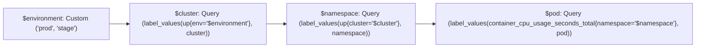
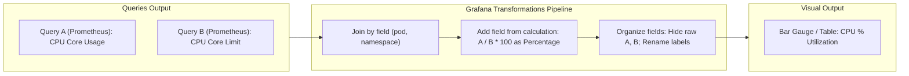
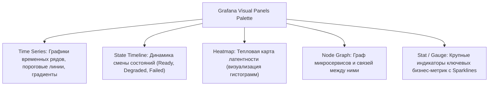

# 📊 15. Grafana: Архитектура, Источники данных и Продвинутые Дашборды

Grafana — это лидирующая платформа с открытым исходным кодом для визуализации, аналитики и мониторинга метрик, логов и распределенных трасс в гетерогенных инфраструктурах.

---

## 🏛️ Внутренняя архитектура Grafana

Grafana состоит из модульного бэкенда на Go и реактивного фронтенда на React/TypeScript. Все метаданные (пользователи, дашборды, алерты, датасорсы) хранятся в реляционной СУБД (PostgreSQL / MySQL в Production, SQLite в Dev).

```mermaid
graph TD
    subgraph Client["Web Browser / Client UI"]
        Dashboard["React Frontend / Panels Rendering"]
    end

    subgraph GrafanaCore["Grafana Server (Golang Backend)"]
        HTTPRouter["HTTP API & Reverse Proxy"]
        AuthEngine["Auth & RBAC (OAuth2, SAML, LDAP)"]
        PluginEngine["Plugin Manager & Data Source Engine"]
        TransformEngine["Backend Transformations & Alerting Engine"]
        Cache["Query Cache / Redis"]
    end

    subgraph MetadataStore["Grafana Internal DB"]
        PG[("PostgreSQL Cluster (HA)")]
    end

    subgraph DataSources["External Observability Backends"]
        Prom["Prometheus / VictoriaMetrics (Metrics)"]
        Loki["Grafana Loki (Logs)"]
        Tempo["Grafana Tempo (Traces)"]
        SQL["ClickHouse / PostgreSQL (Analytics)"]
    end

    Dashboard <-->|HTTPS REST & WebSockets (Live)| HTTPRouter
    HTTPRouter --> AuthEngine
    HTTPRouter --> PluginEngine
    AuthEngine <--> PG
    PluginEngine <--> TransformEngine
    PluginEngine <--> Cache
    PluginEngine -->|Secure Proxy Queries| DataSources
```

---

## 🧩 Переменные и каскадная шаблонизация (Variables & Templating)

Переменные позволяют строить универсальные интерактивные дашборды, автоматически адаптирующиеся под кластеры, сервисы и поды.



### Типы переменных в Grafana

| Тип | Описание | Пример конфигурации |
| :--- | :--- | :--- |
| **`Query`** | Динамический запрос к источнику данных. | `label_values(http_requests_total, service)` |
| **`Custom`** | Жестко заданный список значений. | `prod, staging, dev, testing` |
| **`Interval`** | Шаг агрегации по времени, адаптивный к зуму. | `1m, 5m, 15m, 1h, 1d` (в связке с `$__interval`) |
| **`Datasource`** | Позволяет переключать весь источник данных панели. | Тип: `prometheus` или `loki` |
| **`Constant`** | Скрытая глобальная константа дашборда. | `domain = corp.internal` |

### Синтаксис форматирования переменных (Variable Formatters)

- `${pod:regex}` — преобразует массив `['pod-1', 'pod-2']` в строку регулярного выражения `(pod-1|pod-2)` (идеально для PromQL `{pod=~"${pod:regex}"}`).
- `${service:csv}` — форматирует в `api,auth,billing` (для SQL `IN (${service:csv})`).
- `${service:pipe}` — форматирует в `api|auth|billing`.
- `${pod:percentencode}` — URL-безопасное кодирование значений.

---

## 🔄 Трансформации данных (Data Transformations)

Трансформации позволяют манипулировать таблицами и сериями данных до их отрисовки на панели без модификации запроса в источнике.



### Ключевые трансформации для Production
1. **`Join by field`:** Объединение разнородных источников (например, метрика из Prometheus + метаданные хоста из SQL-таблицы).
2. **`Add field from calculation`:** Арифметические операции над колонками (проценты, дельты, суммы).
3. **`Organize fields`:** Переименование, переупорядочивание и скрытие технических колонок.
4. **`Series to rows` / `Grouping matrix`:** Преобразование плоских серий во вложенные матрицы.

---

## 🎨 Обзор ключевых визуальных панелей



### Настройка Heatmap для гистограмм задержки (Latency Buckets)
При визуализации Prometheus гистограмм через панель `Heatmap`:
1. PromQL запрос: `sum by (le) (rate(http_request_duration_seconds_bucket[5m]))`
2. В настройках панели Format установить: **Heatmap Cells**.
3. Режим данных (Data format): **Data format -> Time series buckets**.
4. Схема градиента: **Spectral** или **Plasma** для наглядного отображения выбросов (outliers).

---

## 🚀 Оптимизация производительности и кэширование дашбордов

1. **Использование `$__rate_interval`:**
   Вместо жестко заданного `rate(http_requests_total[5m])` всегда пишите:
   ```promql
   sum by (service) (rate(http_requests_total[$__rate_interval]))
   ```
   Grafana автоматически рассчитывает `$__rate_interval = max($__interval + ScrapeInterval, 4 * ScrapeInterval)`, предотвращая пропуски сэмплов и перегрузку бэкенда при уменьшении масштаба.

2. **Ограничение максимального числа точек (Max Data Points):**
   Устанавливайте `Max Data Points: 1000 - 1500` на панелях, чтобы браузер пользователя не зависал при рендеринге 500 000 SVG-точек.

3. **Query Caching:**
   Включение Redis для кэширования одинаковых повторяющихся запросов снижает нагрузку на Prometheus на 40-70%:
   ```ini
   # /etc/grafana/grafana.ini
   [query_history]
   enabled = true

   [caching]
   enabled = true
   ttl = 60s
   provider = redis
   redis_url = redis://redis.monitoring.svc:6379/0
   ```

---

## 🔧 Диагностика и разрешение проблем (Troubleshooting)

### Сценарий 1: Панели дашборда загружаются экстремально медленно (Query Timeout)
- **Симптом:** При открытии дашборда панели показывают спиннер загрузки до 30-60 секунд или падают с ошибкой `504 Gateway Timeout`.
- **Диагностика:**
  1. Откройте панель в режиме инспектора: `Panel -> More -> Inspect -> Query`.
  2. Проверьте вкладку `Stats`: время выполнения запроса и количество возвращенных рядов (Series Count).
- **Решение:**
  - Если возвращается > 10 000 серий, добавьте обязательные фильтры по переменным `$cluster` / `$namespace`.
  - Замените тяжелый PromQL с множеством регулярок на предварительно рассчитанный **Recording Rule**.

### Сценарий 2: Селекторы переменных отображают дубликаты или пустой список
- **Симптом:** В выпадающем списке переменной `$pod` отображаются дубли или пустота.
- **Причина:** Некорректно настроена фильтрация Regex или отсутствует каскадная зависимость от родительской переменной.
- **Решение:**
  В настройках переменной `$pod` используйте:
  ```promql
  label_values(container_cpu_usage_seconds_total{namespace=~"$namespace"}, pod)
  ```
  И укажите Regex фильтр: `/^prod-(.*)$/` для очистки системных префиксов.

---

## 🧠 Проверь себя

1. Чем отличается переменная типа `Query` от переменной типа `Custom`?
2. Зачем нужен модификатор `${var:regex}` при подстановке значений переменных в PromQL запрос?
3. Какая трансформация в Grafana позволяет объединить данные из Prometheus и SQL-таблицы по общему идентификатору?
4. Почему использование `$__rate_interval` предпочтительнее фиксированного окна `[5m]` на графиках с большим диапазоном времени?
5. Как панель Heatmap визуализирует кумулятивные корзины гистограмм Prometheus?
