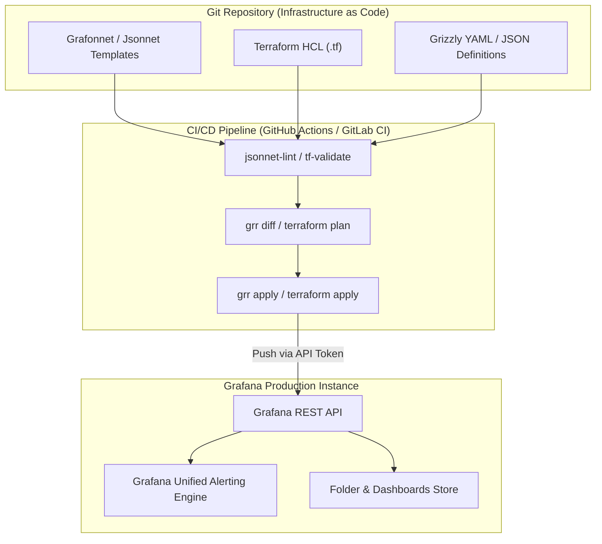
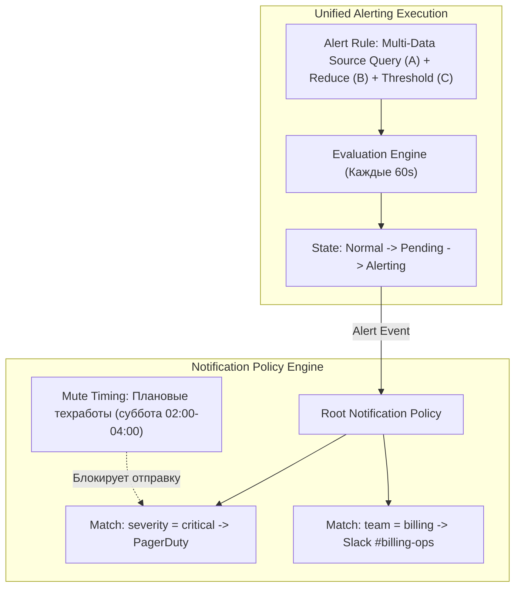

# 🏗️ 16. Grafana: Dashboards-as-Code и Unified Alerting

Подход **Dashboards-as-Code** и **Unified Alerting** позволяет перенести управление визуализацией и правилами оповещения из ручного интерфейса (ClickOps) в декларативный GitOps-пайплайн с контролем версий, ревью изменений и автоматическим тестированием.

---

## 🏛️ Архитектура Dashboards-as-Code



---

## 🛠️ Инструменты реализации Dashboards-as-Code

### 1. Grafonnet (Jsonnet)
Библиотека **Grafonnet** позволяет создавать модульные, повторно используемые компоненты дашбордов на декларативном языке Jsonnet.

```jsonnet
// dashboard.jsonnet
local grafana = import 'grafonnet-lib/grafonnet/grafana.libsonnet';
local dashboard = grafana.dashboard;
local timeSeries = grafana.timeSeries;
local template = grafana.template;

dashboard.new(
  title='Kubernetes Microservices Golden Signals',
  uid='k8s-golden-signals',
  tags=['production', 'kubernetes'],
  editable=false,
  time_from='now-1h',
)
.addTemplate(
  template.new(
    name='namespace',
    datasource='Prometheus',
    query='label_values(kube_pod_info, namespace)',
    label='Namespace',
  )
)
.addPanel(
  timeSeries.new(
    title='RPS by Service',
    datasource='Prometheus',
  ).addTarget(
    grafana.prometheus.target(
      'sum by (service) (rate(http_requests_total{namespace="$namespace"}[$__rate_interval]))',
      legendFormat='{{service}}',
    )
  ),
  gridPos={x: 0, y: 0, w: 12, h: 8}
)
```

### 2. Terraform Grafana Provider
Декларативное управление через Terraform отлично подходит для комплексной синхронизации источников данных, прав пользователей и правил Unified Alerting.

```hcl
# alert_rules.tf
resource "grafana_folder" "platform_alerts" {
  title = "Platform Alerts"
}

resource "grafana_rule_group" "high_error_rate" {
  name             = "API Latency & Error Rules"
  folder_uid       = grafana_folder.platform_alerts.uid
  interval_seconds = 60

  rule {
    name      = "ServiceErrorRateOver5Percent"
    condition = "C"

    # Query A: Извлечение сэмплов ошибок
    data {
      ref_id = "A"
      relative_time_range {
        from = 300
        to   = 0
      }
      datasource_uid = "prometheus-prod-uid"
      model = jsonencode({
        expr = "sum(rate(http_requests_total{status=~\"5..\"}[5m])) / sum(rate(http_requests_total[5m])) * 100"
        instant = true
      })
    }

    # Query B: Редукция (получение текущего скалярного значения)
    data {
      ref_id = "B"
      datasource_uid = "__expr__"
      model = jsonencode({
        type = "reduce"
        expression = "A"
        reducer = "last"
      })
    }

    # Query C: Пороговое условие (Math Condition)
    data {
      ref_id = "C"
      datasource_uid = "__expr__"
      model = jsonencode({
        type = "threshold"
        expression = "B"
        conditions = [
          {
            evaluator = {
              params = [5.0]
              type   = "gt"
            }
          }
        ]
      })
    }

    no_data_state  = "NoData"
    exec_err_state = "Error"
    for            = "3m"

    labels = {
      severity = "critical"
      tier     = "backend"
    }

    annotations = {
      summary     = "High 5xx error rate detected on API"
      description = "API error rate is currently at {{ $values.B.Value }}%"
    }
  }
}
```

### 3. Kubernetes ConfigMap Sidecar (Kiwigrid / kube-prometheus-stack)
Самый распространенный подход в Kubernetes-native окружениях: автоматический импорт JSON дашбордов сайдкаром.

```yaml
apiVersion: v1
kind: ConfigMap
metadata:
  name: grafana-dashboard-redis
  namespace: monitoring
  labels:
    grafana_dashboard: "1" # Метка, которую отслеживает sidecar
data:
  redis-overview.json: |-
    {
      "title": "Redis Cluster Production Overview",
      "uid": "redis-prod-overview",
      "panels": []
    }
```

---

## 🔔 Grafana Unified Alerting: Архитектура

Grafana Unified Alerting объединяет алертинг по метрикам Prometheus, логам Loki, трассам Tempo и SQL-базам в единый механизм, повторяющий логику Alertmanager.



### Contact Points и Notification Policies
1. **Contact Points:** Каналы доставки (Slack, Opsgenie, Telegram, PagerDuty, Webhooks).
2. **Notification Policies:** Дерево маршрутизации, сопоставляющее лейблы с Contact Points, таймерами `group_wait`, `group_interval`, `repeat_interval`.
3. **Mute Timings:** Временные интервалы тишины (CRON-расписание планового обслуживания инфраструктуры).

---

## 🛠️ CLI Cheat Sheet: Управление ресурсами через Grizzly (`grr`)

```bash
# 1. Установка Grizzly
go install github.com/grafana/grizzly/cmd/grr@latest

# 2. Настройка подключения к Grafana
export GRAFANA_URL="https://grafana.corp.com"
export GRAFANA_TOKEN="glsa_xxxxxxxxxxxxxxxxxxxx"

# 3. Просмотр разницы (Diff) между локальными файлами и сервером
grr diff dashboards/

# 4. Применение изменений (Apply)
grr apply dashboards/

# 5. Экспорт всех дашбордов из Grafana в локальные файлы
grr pull dashboards/
```

---

## 🔧 Диагностика и разрешение проблем (Troubleshooting)

### Сценарий 1: Конфликт перезаписи (Dashboard UID Clash)
- **Симптом:** При деплое через CI/CD выводится ошибка `a dashboard with the same UID already exists in another folder`.
- **Причина:** Несколько YAML/Jsonnet файлов используют одинаковый статический `uid`.
- **Решение:**
  - Задавайте уникальный детерминированный UID по шаблону: `<service>-<env>-<dashboard-name>`.
  - Никогда не генерируйте случайные UID в CI/CD, чтобы не плодить дубли дашбордов при каждом коммите.

### Сценарий 2: Unified Alerting выдает `NoData` или `ExecutionError`
- **Симптом:** Алерт переходит в статус `NoData` и генерирует ложное срабатывание.
- **Причина:** Запрос вернул пустой вектор или упал по таймауту бэкенда.
- **Решение:**
  В конфигурации правила в блоке `no_data_state` укажите:
  - `OK` — если отсутствие данных означает нормальное состояние (например, 0 ошибок).
  - `Alerting` — если потеря метрики критична (например, проверка сердечных сокращений сервиса Heartbeat).

---

## 🧠 Проверь себя

1. В чем главное преимущество генерации дашбордов через Grafonnet (Jsonnet) по сравнению с хранением сырого JSON?
2. Как работает связка Query A -> Reduce B -> Threshold C в Grafana Unified Alerting?
3. Что происходит, когда K8s sidecar обнаруживает ConfigMap с лейблом `grafana_dashboard: "1"`?
4. Какую роль выполняют Mute Timings в Unified Alerting?
5. Как утилита `grr` (Grizzly) защищает продакшн-дашборды от случайной порчи через ClickOps?
