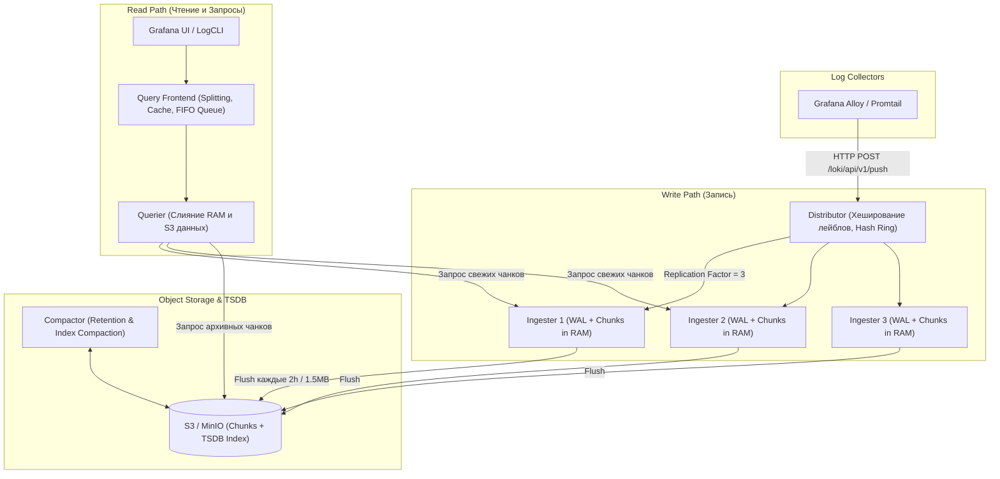

# 📜 17. Grafana Loki: Архитектура распределенного сбора логов

Grafana Loki — это горизонтально масштабируемая, мультиарендная (multi-tenant) система агрегации логов, спроектированная по философии Prometheus: **индексируются только метаданные (лейблы потоков)**, а само тело лога сжимается и сохраняется блоками (chunks) в недорогом объектном хранилище (S3, GCS, MinIO).

---

## 🏛️ Распределенная микросервисная архитектура

Loki состоит из слабосвязанных микросервисов, которые могут работать в монолитном режиме (**Single-Binary**), масштабируемом раздельном режиме (**Simple-Scalable Mode**) или полностью распределенном (**Microservices Mode**).



---

## ⚙️ Жизненный цикл чанка логов и компоненты

### 1. Distributor (Маршрутизация и валидация)
- Проверяет синтаксис потока и лимиты размера payload (`max_line_size`, `ingestion_rate_mb`).
- Вычисляет хеш от набора лейблов потока (`stream = {app="billing", env="prod"}`).
- Используя **Consistent Hash Ring** (на базе Memberlist/Consul), определяет $N$ ингестеров для репликации (обычно `replication_factor: 3`).

### 2. Ingester (Буферизация и WAL)
- Записывает входящие строки в **Write-Ahead Log (WAL)** на локальный диск для защиты от потери данных при аварийном падении.
- Накапливает строки в оперативной памяти в виде сжатого gzip/snappy блока — **Head Chunk**.
- **Критерии сброса чанка на диск (Chunk Flushing):**
  1. Достигнут лимит размера: `chunk_target_size: 1.5MB`.
  2. Достигнут максимальный возраст: `max_chunk_age: 2h`.
  3. Поток простаивает без новых данных: `chunk_idle_period: 30m`.

### 3. Query Frontend и Querier (Выполнение запросов)
- **Query Frontend:**
  - **Query Splitting:** Разбивает длинный запрос за 7 дней на параллельные подзапросы по 1 часу.
  - **Query Caching:** Кэширует неизменяемые исторические результаты запросов в Redis / Memcached.
  - **Scheduler & FIFO:** Управляет очередью выполнения, предотвращая перегрузку пула квериров.
- **Querier:** Выполняет LogQL-пайплайны, запрашивает не сброшенные на диск чанки из Ingesters и исторические чанки из Object Storage.

### 4. Compactor (Управление хранением и ретеншн)
- Объединяет мелкие TSDB-файлы индексов в крупные оптимизированные блоки.
- Применяет политики удаления данных (**Retention**) по расписанию.

---

## 📦 Production Конфигурация: `loki.yaml` (Simple-Scalable Mode)

```yaml
auth_enabled: true # Включение Multi-tenancy (требует заголовок X-Scope-OrgID)

server:
  http_listen_port: 3100
  grpc_listen_port: 9095
  log_level: info

common:
  path_prefix: /var/loki
  replication_factor: 3
  ring:
    kvstore:
      store: memberlist
  storage:
    s3:
      endpoint: minio.storage.svc:9000
      bucketnames: loki-chunks
      access_key_id: ${MINIO_ACCESS_KEY}
      secret_access_key: ${MINIO_SECRET_KEY}
      s3forcepathstyle: true
      insecure: true

memberlist:
  join_members:
    - loki-memberlist.monitoring.svc.cluster.local:7946

schema_config:
  configs:
    - from: 2024-01-01
      store: tsdb
      object_store: s3
      schema: v13
      index:
        prefix: loki_index_
        period: 24h

ingester:
  wal:
    enabled: true
    dir: /var/loki/wal
  max_chunk_age: 2h
  chunk_target_size: 1572864 # 1.5 MB
  chunk_idle_period: 30m

query_frontend:
  max_outstanding_per_tenant: 2048
  compress_responses: true

limits_config:
  ingestion_rate_mb: 20
  ingestion_burst_size_mb: 40
  max_line_size: 256000 # 256 KB
  max_query_length: 721h
  retention_period: 30d

compactor:
  working_directory: /var/loki/compactor
  compaction_interval: 10m
  retention_enabled: true
  delete_request_store: s3
```

---

## 🛠️ CLI Cheat Sheet: Работа с `logcli`

```bash
# 1. Настройка подключения к Loki API
export LOKI_ADDR="http://loki-gateway.monitoring.svc:80"
export LOKI_ORG_ID="tenant-production"

# 2. Потоковый вывод логов в реальном времени (Tail)
logcli tail --since=10m '{app="order-service"} |= "panic"'

# 3. Исторический поиск с форматированием JSON и выводом метаданных
logcli query --since=1h \
  '{namespace="prod", app="payment"} | json | status >= 500' \
  --output=jsonl | jq '{timestamp: .timestamp, message: .line, traceID: .traceID}'

# 4. Проверка статистики по потокам и размерам серий
logcli series '{namespace="prod"}' --analyze-labels

# 5. Получение списка активных меток
logcli labels app
```

---

## 🔧 Диагностика и разрешение проблем (Troubleshooting)

### Сценарий 1: Ошибка "Entry Too Far Behind" или "Out of Order Entries"
- **Симптом:** Агент отправки (Promtail/Alloy) получает `HTTP 400: entry too far behind, earliest acceptable timestamp is...`.
- **Причина:** Loki получает лог с временной меткой старее, чем окно `creation_grace_period` или `max_chunk_age`, либо логи приходят не в хронологическом порядке.
- **Решение:**
  Начиная с Loki 2.4+ включите поддержку неупорядоченных логов в `loki.yaml`:
  ```yaml
  limits_config:
    creation_grace_period: 10m
    unordered_writes: true
  ```

### Сценарий 2: Ошибка "Maximum Active Streams Limit Exceeded"
- **Симптом:** Логи перестают приниматься, ошибки `maximum active streams (5000) exceeded`.
- **Причина:** Высокая кардинальность (High Cardinality) из-за превращения уникальных значений (UUID, UserID, IP) в лейблы потока Loki.
- **Решение:**
  - Удалите динамические поля из лейблов в конфигурации Promtail/Alloy. Лейблами должны быть только: `app`, `env`, `namespace`, `container`.
  - Увеличьте лимит стримов:
    ```yaml
    limits_config:
      max_global_streams_per_user: 50000
    ```

---

## 🧠 Проверь себя

1. Почему Loki не индексирует полный текст логов, и как это снижает стоимость хранения в десятки раз?
2. Для чего в Ingester используется Write-Ahead Log (WAL)?
3. Как Query Frontend ускоряет выполнение тяжелых исторических запросов?
4. Почему помещение User ID или IP-адреса в лейблы потока Loki является фатальной архитектурной ошибкой?
5. Что делает компонент Compactor и как в Loki реализуется политика Retention?
