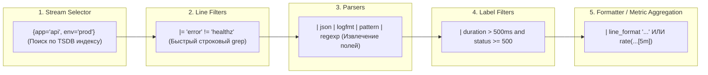
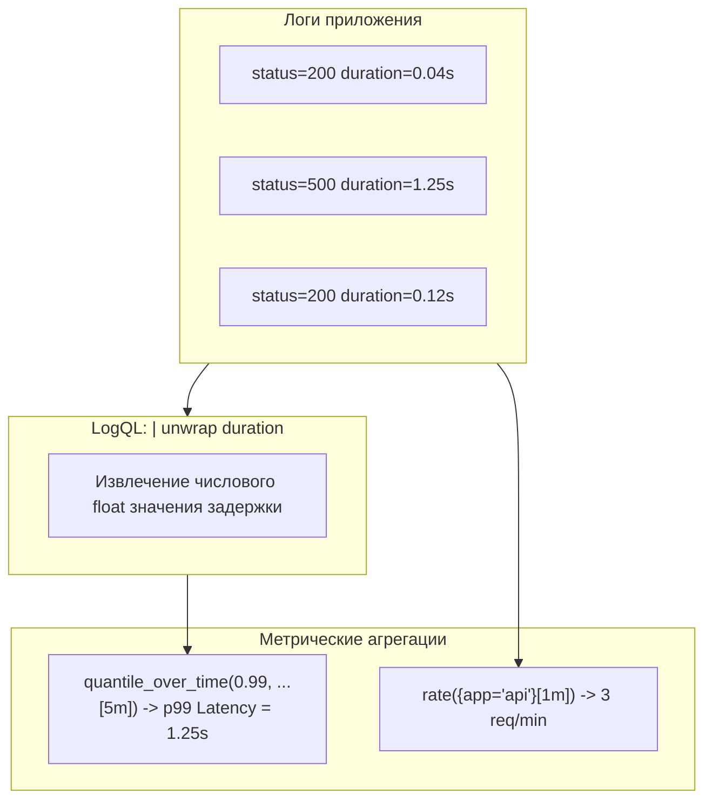
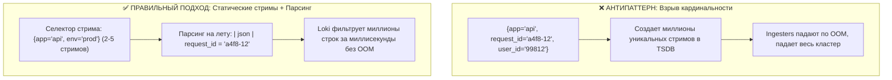

# 🔎 18. LogQL и пайплайны обработки логов

LogQL (Log Query Language) — это мощный язык запросов в Grafana Loki, сочетающий синтаксис селекторов потоков в стиле PromQL с конвейерной моделью фильтрации, парсинга и агрегации логов в числовые метрики.

---

## 🏛️ Пайплайн выполнения LogQL (Log Pipeline Stages)

Выполнение запроса LogQL происходит последовательно слева направо в виде конвейера преобразований.



---

## 📝 Селекторы, строковые фильтры и парсеры

### 1. Селекторы потоков (Stream Selectors)
Селекторы определяют, какие чанки логов будут прочитаны с диска/S3:
```logql
# Точное совпадение и регулярные выражения
{namespace="production", container=~"api-.*", env!="dev"}
```

### 2. Строковые фильтры (Line Filter Expressions)
Применяются до этапа парсинга, эффективно отсекая терабайты ненужных строк:
- `|= "string"` — строка **содержит** подстроку (case-sensitive).
- `!= "string"` — строка **не содержит** подстроку.
- `|~ "regex"` — совпадение по **регулярному выражению**.
- `!~ "regex"` — отрицание регулярного выражения.

### 3. Парсеры структурированных логов

#### А. JSON Parser (`| json`)
Автоматически извлекает все поля верхнего уровня в экстрагированные переменные или выборочные атрибуты:
```logql
# Извлечение только необходимых полей с переименованием
{app="checkout"} |= "payment_failed" | json status="response.code", err="error.message"
```

#### Б. Logfmt Parser (`| logfmt`)
Парсит формат ключ-значение (`ts=2026-09-02 level=info msg="user login" user_id=42`):
```logql
{app="auth"} | logfmt | level = "error" and user_id != ""
```

#### В. Pattern Parser (`| pattern`)
В разы быстрее регулярных выражений извлекает структурированные данные из логов фиксированного формата (например, стандартный Nginx / Apache):
```logql
# Парсинг Nginx access лога без Regex
{app="ingress-nginx"} | pattern `<remote_ip> - - [<_>] "<method> <path> <_>" <status> <bytes> <_> "<user_agent>" <request_time>`
```

#### Г. Regular Expression Parser (`| regexp`)
Используется для сложных кастомных форматов:
```logql
{app="legacy-app"} | regexp `^\[(?P<ts>.*?)\] (?P<level>[A-Z]+) (?P<msg>.*)$`
```

---

## 🎨 Форматирование вывода: `line_format` и `label_format`

```logql
# Преобразование громоздкого JSON в компактный читаемый лог
{app="payment-gateway"} 
| json 
| line_format "{{.timestamp}} [{{.level | ToUpper}}] {{.method}} {{.path}} -> {{.status}} ({{.duration_ms}}ms)"
```

---

## 📈 Метрики из логов (Log-Derived Metrics)

LogQL позволяет извлекать количественные метрики из неструктурированных логов в реальном времени без необходимости изменения кода приложения.



### 1. Подсчет частоты событий (`rate`, `count_over_time`)

```logql
# 1. RPS ошибок 5xx по эндпоинтам из Nginx логов
sum by (path) (
  rate({app="ingress-nginx"} | pattern `<_> - - [<_>] "<_> <path> <_>" <status> <_>` | status >= 500 [5m])
)

# 2. Объем переданного трафика в секунду (bytes_rate)
sum by (app) (
  bytes_rate({namespace="production"}[5m])
)
```

### 2. Числовой Unwrap и расчет квантилей (`quantile_over_time`)

```logql
# 99-й процентиль задержки обработки запросов (в секундах) из JSON логов
quantile_over_time(0.99,
  {app="billing-service"}
  | json
  | unwrap duration_seconds
  [5m]
) by (handler)
```

---

## ⚠️ Anti-Patterns кардинальности в Loki



---

## 🛠️ Готовые продакшн LogQL рецепты

```logql
# 1. Топ-10 IP адресов с наибольшим количеством 401 Unauthorized запросов
topk(10,
  sum by (client_ip) (
    rate({app="api-gateway"} | json | status == 401 [10m])
  )
)

# 2. Поиск Stack Trace и Panic в Go приложениях
{env="prod"} |~ "(?i)panic: runtime error|goroutine [0-9]+ \\[running\\]"

# 3. Средний размер передаваемого Payload в килобайтах
avg_over_time(
  {app="file-service"}
  | json
  | unwrap body_bytes_sent
  [15m]
) / 1024
```

---

## 🔧 Диагностика и разрешение проблем (Troubleshooting)

### Сценарий 1: Ошибка "Query Processing Deadline Exceeded"
- **Симптом:** Длинный LogQL запрос за большой диапазон времени завершается с таймаутом.
- **Причина:** Широкий селектор `{namespace="prod"}` заставляет Loki читать все терабайты логов кластера.
- **Решение:**
  1. Добавьте строковый фильтр **перед** парсером: `{app="api"} |= "POST /checkout" | json | status >= 500`.
  2. Увеличьте `query_timeout` в `loki.yaml` и настройте `query_frontend.split_queries_by_interval: 30m`.

### Сценарий 2: Ошибка "Pipeline Error: JSON parsing failed"
- **Симптом:** При применении `| json` часть строк отбрасывается с пометкой `JSON parsing failed`.
- **Причина:** В поток попадают неструктурированные строки (например, логи запуска runtime или паники).
- **Решение:**
  Используйте строковый фильтр для предварительной валидации:
  ```logql
  {app="api"} |= "{" | json
  ```

---

## 🧠 Проверь себя

1. В каком порядке LogQL выполняет конвейер: строковые фильтры (`|=`), селекторы потоков или JSON-парсер?
2. Почему использование `| pattern` предпочтительнее `| regexp` при обработке сотен гигабайт логов в секунду?
3. Как с помощью выражения `| unwrap` вычислить медианное ($p50$) время ответа базы данных из текстовых логов?
4. Почему добавление `user_id` в лейблы селектора `{user_id="..."}` уничтожает производительность Loki?
5. Как с помощью `line_format` объединить несколько JSON-полей в одну форматированную строку?
