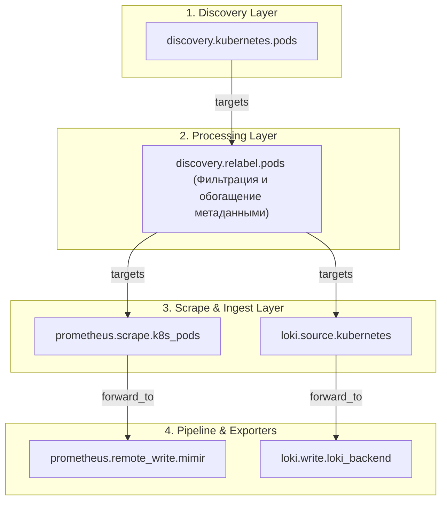
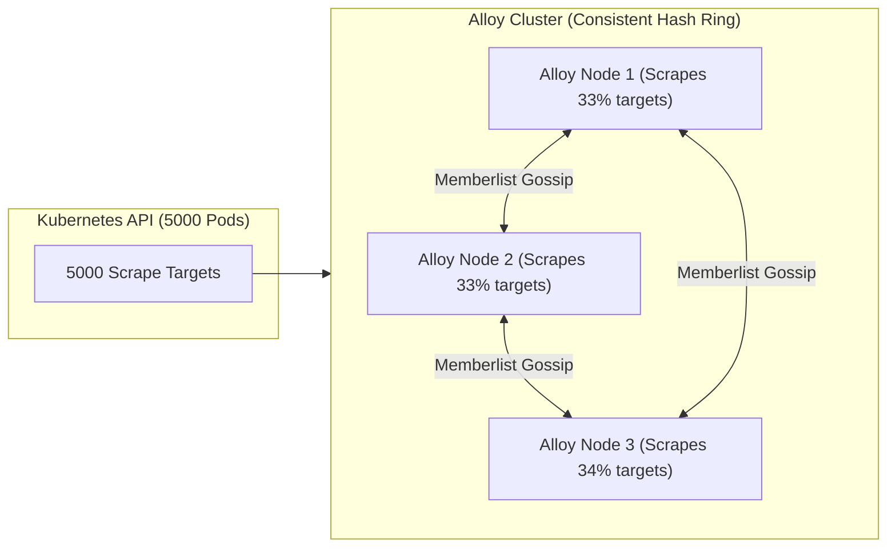
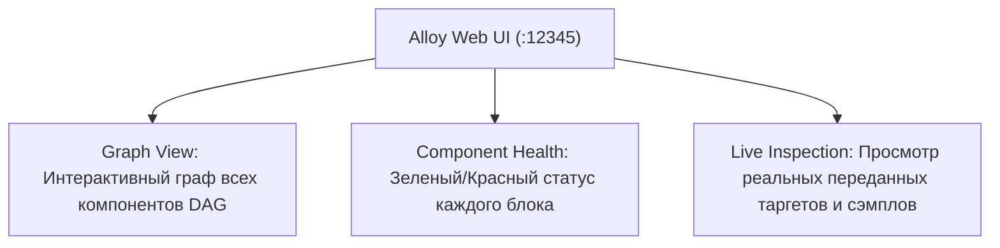

# 🧩 19. Grafana Alloy: Унифицированный телеметрический агент

Grafana Alloy — это современный Open Source телеметрический агент (эволюция Grafana Agent / Flow Mode), объединяющий сбор метрик (Prometheus), логов (Loki), трассировок (OpenTelemetry / Tempo) и непрерывного профилирования (Pyroscope) в едином высокопроизводительном рантайме.

---

## 🏛️ Компонентная архитектура и направленный ациклический граф (DAG)

В основе Alloy лежит декларативный язык конфигурации, вдохновленный Terraform HCL. Конфигурация описывает компоненты, которые автоматически выстраиваются движком в **Направленный ациклический граф (DAG)**.



### Ключевые свойства рантайма Alloy
- **Реактивность (Data-Flow):** Изменение выходных данных одного компонента (например, появление нового пода в `discovery.kubernetes`) мгновенно инициирует пересчет зависимых узлов графа.
- **Zero-Downtime Reload:** Горячее применение конфигурации (`SIGHUP` или `POST /-/reload`) без перезапуска процесса и потери буферов в оперативной памяти.
- **Совместимость с OpenTelemetry:** Полная поддержка пайплайнов `otelcol.*` внутри синтаксиса Alloy.

---

## 🌐 Кластеризация и шардирование сбора (Alloy Clustering)

При запуске нескольких экземпляров Alloy (например, Deployment из 5 реплик) они могут объединяться в **Gossip-кластер** для равномерного распределения нагрузки без дублирования скрайпинга.



Флаг запуска: `alloy run --cluster.enabled=true --cluster.join-addresses=alloy-cluster:12345`

---

## ⚙️ Production Конфигурация: `config.alloy`

Полнофункциональный пайплайн для сбора метрик, логов, OTel-трасс и профилей:

```alloy
// 1. Автоматический дискавери подов в Kubernetes
discovery.kubernetes "pods" {
  role = "pod"
}

// 2. Релейблинг и фильтрация целей для Prometheus
discovery.relabel "k8s_pods" {
  targets = discovery.kubernetes.pods.targets

  rule {
    source_labels = ["__meta_kubernetes_pod_annotation_prometheus_io_scrape"]
    regex         = "true"
    action        = "keep"
  }

  rule {
    source_labels = ["__meta_kubernetes_pod_annotation_prometheus_io_path"]
    target_label  = "__metrics_path__"
    regex         = "(.+)"
  }

  rule {
    source_labels = ["__meta_kubernetes_pod_annotation_prometheus_io_port", "__meta_kubernetes_pod_ip"]
    target_label  = "__address__"
    regex         = "(.+);(.+)"
    replacement   = "$2:$1"
  }

  rule {
    source_labels = ["__meta_kubernetes_namespace"]
    target_label  = "namespace"
  }

  rule {
    source_labels = ["__meta_kubernetes_pod_name"]
    target_label  = "pod"
  }
}

// 3. Скрайпинг метрик Prometheus
prometheus.scrape "pods" {
  targets    = discovery.relabel.k8s_pods.output
  forward_to = [prometheus.remote_write.prod_mimir.receiver]
  scrape_interval = "15s"
}

// 4. Отправка метрик по Remote Write
prometheus.remote_write "prod_mimir" {
  endpoint {
    url = "http://mimir-gateway.monitoring.svc:8080/api/v1/push"
    headers = {
      "X-Scope-OrgID" = "production",
    }
  }
}

// 5. Прием трасс OpenTelemetry (OTLP gRPC & HTTP)
otelcol.receiver.otlp "default" {
  grpc {
    endpoint = "0.0.0.0:4317"
  }
  http {
    endpoint = "0.0.0.0:4318"
  }
  output {
    traces  = [otelcol.processor.batch.default.input]
    metrics = [otelcol.processor.batch.default.input]
  }
}

// 6. Батчинг телеметрии для оптимизации сети
otelcol.processor.batch "default" {
  timeout = "1s"
  send_batch_size = 8192

  output {
    traces  = [otelcol.exporter.otlp.tempo.input]
    metrics = [prometheus.remote_write.prod_mimir.receiver]
  }
}

// 7. Экспорт трасс в Grafana Tempo
otelcol.exporter.otlp "tempo" {
  client {
    endpoint = "tempo-distributor.monitoring.svc:4317"
    tls {
      insecure = true
    }
  }
}

// 8. Сбор логов контейнеров
loki.source.kubernetes "pod_logs" {
  targets    = discovery.relabel.k8s_pods.output
  forward_to = [loki.process.filter_noise.receiver]
}

// 9. Обработка и фильтрация логов
loki.process "filter_noise" {
  stage.drop {
    source = ""
    expression = ".*(healthz|readyz).*"
  }

  forward_to = [loki.write.prod_loki.receiver]
}

// 10. Запись логов в Loki
loki.write "prod_loki" {
  endpoint {
    url = "http://loki-gateway.monitoring.svc:3100/loki/api/v1/push"
    tenant_id = "production"
  }
}
```

---

## 🖥️ Live Debugging UI (Интерактивная панель отладки)

Alloy включает встроенный веб-интерфейс на порту `12345`:



```bash
# Проверка состояния агента через терминал
curl -s http://localhost:12345/-/ready
curl -s http://localhost:12345/api/v0/components | jq .
```

---

## 🔧 Диагностика и разрешение проблем (Troubleshooting)

### Сценарий 1: Компонент в статусе "Degraded" или "Unhealthy"
- **Симптом:** В UI Alloy компонент подсвечен красным, метрики не собираются.
- **Диагностика:**
  ```bash
  # Просмотр логов пода Alloy
  kubectl logs -n monitoring -l app.kubernetes.io/name=alloy --tail=100
  ```
- **Причина:** Ошибка подключения к нижележащему сервису (например, отказ Mimir / Loki или неверный `tenant_id`).
- **Решение:** Проверьте доступность сетевых эндпоинтов и правильность заголовков авторизации в `endpoint.headers`.

### Сценарий 2: Ошибка циклической зависимости (Cyclic Dependency Error)
- **Симптом:** Alloy падает при старте с ошибкой `failed to build graph: cycle detected: component A -> B -> A`.
- **Причина:** Выходной порт компонента `A` направлен в `B`, который передает данные обратно в `A`.
- **Решение:** Разомкните цикл, направляя данные только вперед по конвейеру (Strict DAG).

---

## 🧠 Проверь себя

1. Какое архитектурное преимущество дает модель Directed Acyclic Graph (DAG) в Alloy по сравнению со статическими YAML-конфигами старого Grafana Agent?
2. Как режим `clustering` в Alloy предотвращает дублирование сбора метрик при запуске 10 реплик агента?
3. Какие возможности предоставляет встроенный веб-интерфейс Alloy на порту `:12345`?
4. Как внутри одного конфига Alloy связать прием OTel-трассировок по gRPC и их отправку в Tempo через Batch-процессор?
5. Что происходит со сбором данных при выполнении горячей перезагрузки `POST /-/reload`?
