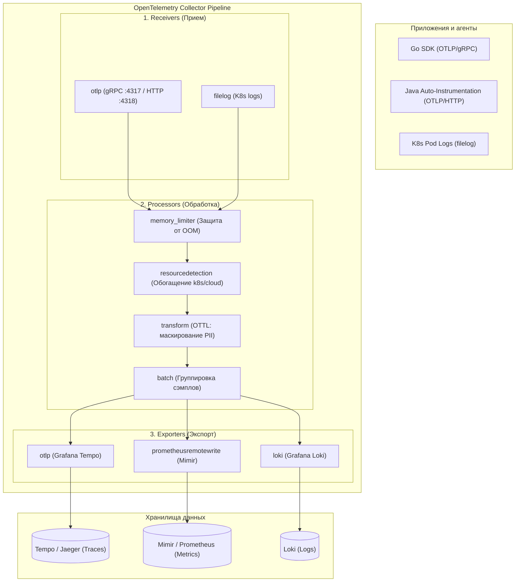
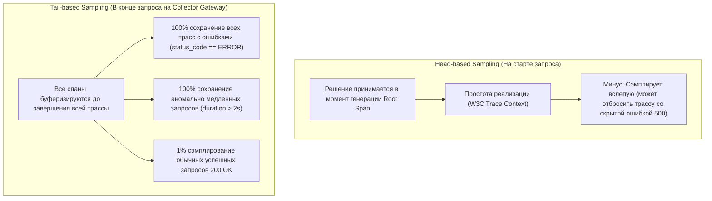

# 🔭 20. OpenTelemetry (OTel): Стандарты и OTel Collector

OpenTelemetry (OTel) — это общепринятый индустриальный стандарт и вендор-нейтральный фреймворк CNCF для генерации, сбора, обработки и экспорта телеметрических данных: **трасс (Traces)**, **метрик (Metrics)** и **логов (Logs)**.

---

## 🏛️ Архитектура OpenTelemetry Collector

OTel Collector — это высокопроизводительный прокси-сервис на Go, состоящий из конвейеров (Pipelines) обработки данных.



---

## ⚙️ Глубокий разбор ключевых процессоров

### 1. `memory_limiter` — Критическая защита от OOM
Самый важный процессор в пайплайне: обязан стоять **первым** в списке процессоров. При приближении к лимиту памяти он начинает отбрасывать входящие данные и возвращать клиенту статус `Unavailable (HTTP 503)`, не допуская падения процесса OTel Collector по OOMKilled.

```yaml
memory_limiter:
  check_interval: 1s
  limit_percentage: 80        # Жесткий лимит памяти (80% от лимита контейнера)
  spike_limit_percentage: 20  # Допустимый резкий скачок до начала дропа данных
```

### 2. `batch` — Оптимизация сетевого ввода/вывода
Группирует спаны, логи и метрики в единые крупные блоки перед отправкой по gRPC/HTTP.

```yaml
batch:
  send_batch_size: 8192
  timeout: 500ms
  send_batch_max_size: 16384
```

### 3. `transform` (OTTL — OpenTelemetry Transformation Language)
Позволяет модифицировать атрибуты на лету, удалять чувствительные данные (PII, пароли, номера карт) и приводить имена полей к стандарту Semantic Conventions:

```yaml
transform:
  error_mode: ignore
  trace_statements:
    - context: span
      statements:
        # Маскирование номеров кредитных карт в атрибутах спана
        - replace_pattern(attributes["http.request.body"], "\\b(?:\\d[ -]*?){13,16}\\b", "[REDACTED_CC]")
        # Удаление спанов health check эндпоинтов
        - drop() where attributes["http.target"] == "/healthz"
```

---

## 🎯 Стратегии сэмплирования: Head-based vs Tail-based



---

## 📦 Production Конфигурация: `otel-collector-config.yaml`

```yaml
receivers:
  otlp:
    protocols:
      grpc:
        endpoint: 0.0.0.0:4317
      http:
        endpoint: 0.0.0.0:4318

processors:
  memory_limiter:
    check_interval: 1s
    limit_percentage: 75
    spike_limit_percentage: 20

  resourcedetection:
    detectors: [env, k8snode]
    timeout: 2s
    override: false

  transform:
    error_mode: ignore
    trace_statements:
      - context: span
        statements:
          - set(attributes["environment"], "production") where attributes["environment"] == nil

  tail_sampling:
    decision_wait: 10s
    num_traces: 100000
    expected_new_traces_per_sec: 5000
    policies:
      # Правило 1: Всегда сохранять трассы с ошибками
      - name: drop_errors_policy
        type: status_code
        status_code: { status_codes: [ERROR] }
      
      # Правило 2: Всегда сохранять медленные запросы (> 1500ms)
      - name: latency_policy
        type: latency
        latency: { threshold_ms: 1500 }

      # Правило 3: Сохранять 5% успешных запросов для фоновой статистики
      - name: probabilistic_policy
        type: probabilistic
        probabilistic: { sampling_percentage: 5.0 }

  batch:
    send_batch_size: 4096
    timeout: 1s

exporters:
  otlp/tempo:
    endpoint: tempo-distributor.monitoring.svc:4317
    tls:
      insecure: true

  prometheusremotewrite:
    endpoint: http://mimir-gateway.monitoring.svc:8080/api/v1/push
    headers:
      X-Scope-OrgID: "production"

  loki:
    endpoint: http://loki-gateway.monitoring.svc:3100/loki/api/v1/push
    tenant_id: "production"

extensions:
  health_check:
    endpoint: 0.0.0.0:13133
  zpages:
    endpoint: 0.0.0.0:55679

service:
  extensions: [health_check, zpages]
  pipelines:
    traces:
      receivers: [otlp]
      processors: [memory_limiter, resourcedetection, transform, tail_sampling, batch]
      exporters: [otlp/tempo]

    metrics:
      receivers: [otlp]
      processors: [memory_limiter, resourcedetection, batch]
      exporters: [prometheusremotewrite]

    logs:
      receivers: [otlp]
      processors: [memory_limiter, resourcedetection, batch]
      exporters: [loki]
```

---

## 🛠️ CLI Cheat Sheet & Диагностика OTel Collector

```bash
# 1. Проверка работоспособности Health Check эндпоинта
curl -s http://localhost:13133/

# 2. Просмотр внутренних метрик OTel Collector (число принятых/отброшенных спанов)
curl -s http://localhost:8888/metrics | grep -E 'otelcol_receiver_accepted_spans|otelcol_processor_dropped_spans'

# 3. Инспекция внутренних очередей и задержек через zPages в браузере
curl -s http://localhost:55679/debug/tracez
```

---

## 🔧 Диагностика и разрешение проблем (Troubleshooting)

### Сценарий 1: Ошибка "Dropped Spans / Context Deadline Exceeded"
- **Симптом:** Метрика `otelcol_processor_dropped_spans` непрерывно растет, спаны не доходят до бэкенда.
- **Причина:** Бэкенд (Tempo / Jaeger) перегружен или сеть не справляется с объемом несжатого OTLP-трафика.
- **Решение:**
  - Увеличьте `send_batch_size` и включите сжатие `compression: gzip` в секции `exporters.otlp`.
  - Масштабируйте инстансы OTel Collector Gateway по горизонтали (HPA по утилизации CPU/Memory).

### Сценарий 2: Потеря Trace Context между микросервисами (Broken Traces)
- **Симптом:** В Grafana вместо единого распределенного дерева отображаются изолированные односпановые трассы.
- **Причина:** HTTP-клиент сервиса не передает W3C-заголовки `traceparent` и `tracestate` при вызове соседнего микросервиса.
- **Решение:** Убедитесь, что в коде инициализирован глобальный W3C Context Propagator:
  ```go
  otel.SetTextMapPropagator(propagation.NewCompositeTextMapPropagator(
      propagation.TraceContext{},
      propagation.Baggage{},
  ))
  ```

---

## 🧠 Проверь себя

1. Из каких трех основных этапов состоит любой конвейер (Pipeline) в OpenTelemetry Collector?
2. Почему процессор `memory_limiter` должен обязательно располагаться первым в цепочке процессоров?
3. В чем ключевое преимущество Tail-based сэмплирования перед Head-based сэмплированием в высоконагруженных системах?
4. Какие заголовки стандарта W3C Trace Context используются для сквозной передачи идентификаторов трассы?
5. Как язык OTTL позволяет маскировать конфиденциальные данные (PII) прямо внутри OTel Collector?
