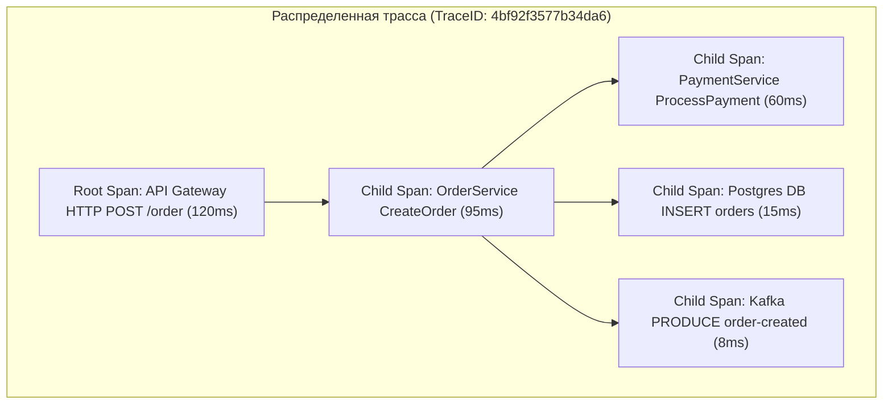
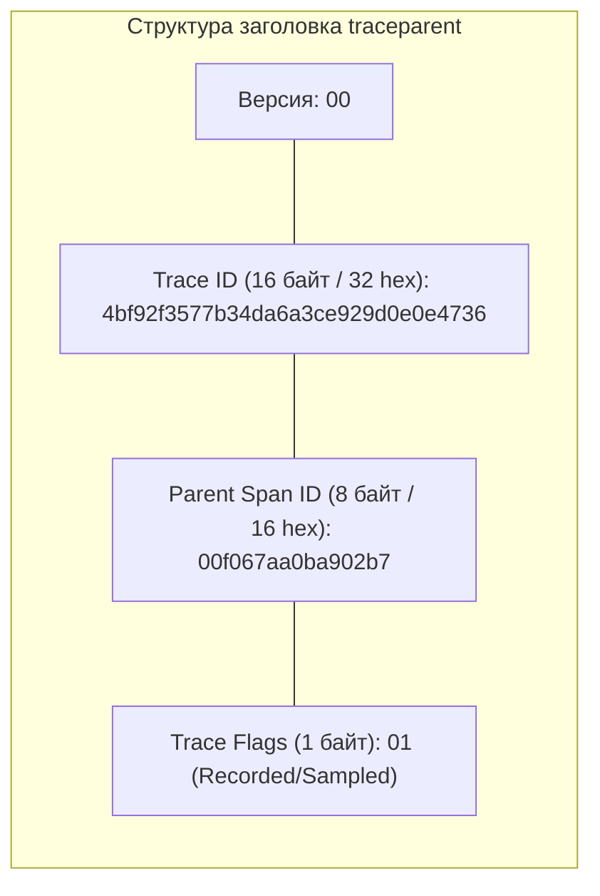
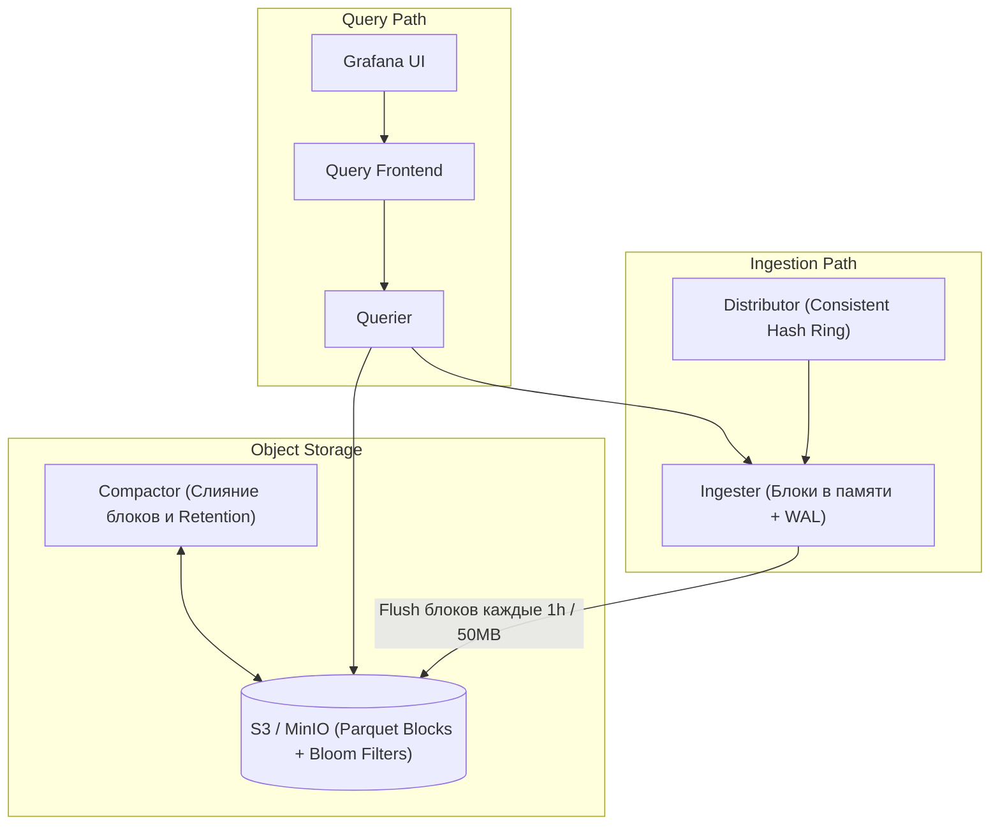
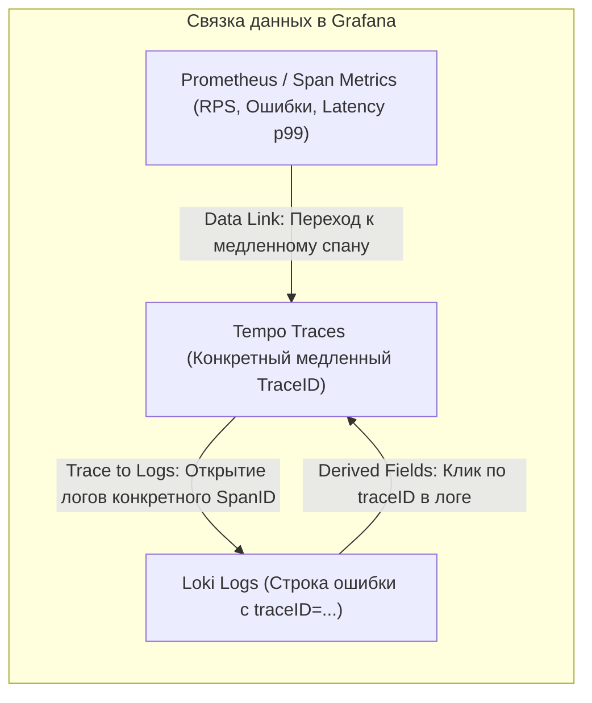

# 🌐 21. Распределенная трассировка: Tempo, Jaeger и W3C Context

Распределенная трассировка (Distributed Tracing) обеспечивает сквозную наблюдаемость прохождения пользовательских запросов через десятки микросервисов, очередей сообщений и баз данных, позволяя мгновенно локализовать узкие места (bottlenecks) и первопричины ошибок (root causes).

---

## 🏛️ Фундаментальные концепции трассировки



### Анатомия спана (Span)
Спан — базовый кирпичик трассировки, представляющий единицу выполненной работы:
- **TraceID:** Глобально уникальный 128-битный идентификатор всей распределенной цепочки.
- **SpanID:** 64-битный идентификатор конкретного шага.
- **ParentSpanID:** Идентификатор родительского спана (у Root Span отсутствует).
- **Attributes:** Метаданные ключ-значение (`http.status_code=500`, `db.statement="SELECT * FROM users"`).
- **Events:** Временные метки дискретных внутренних событий (например, получение лога или выброс exception).
- **Status:** Состояние выполнения (`Unset`, `Ok`, `Error`).

---

## 🔗 Распространение контекста: Стандарт W3C Trace Context

Для передачи контекста между сервисами используется общепринятый стандарт HTTP-заголовков **W3C Trace Context**.

```http
traceparent: 00-4bf92f3577b34da6a3ce929d0e0e4736-00f067aa0ba902b7-01
tracestate: congo=uc13e,rojo=4
```



---

## ⚡ Grafana Tempo: Высокопроизводительное хранилище трасс на Object Storage

В отличие от классического Jaeger с Elasticsearch, который требует огромных затрат CPU/RAM на индексацию спанов, **Grafana Tempo** не строит тяжелых вторичных индексов. Трассы сжимаются в формат **Apache Parquet** и сохраняются напрямую в объектное хранилище (S3 / MinIO), обеспечивая 10-50-кратную экономию инфраструктурных затрат.



### Поиск по TraceID и фильтрам (TraceQL)
- **Прямой поиск по TraceID:** Tempo мгновенно находит блок в S3 с помощью **Bloom Filters** (фильтров Блума) с субсекундной задержкой.
- **TraceQL (Полнотекстовый поиск по атрибутам):** Позволяет делать запросы вида `{ .http.status_code >= 500 && duration > 1s }` путем параллельного сканирования колоночного формата Parquet силами Querier.

---

## ⚖️ Сравнение: Jaeger vs Grafana Tempo

| Критерий | Jaeger (Elasticsearch backend) | Grafana Tempo (S3 backend) |
| :--- | :--- | :--- |
| **Стоимость хранения** | 🔴 Очень высокая (тяжелые индексы ES) | 🟢 Экстремально низкая (S3/MinIO) |
| **Потребление RAM/CPU**| 🔴 Высокое (нагрузка на JVM и диск) | 🟢 Низкое (написан на Golang) |
| **Полнотекстовый поиск** | 🟢 Мгновенный по любым полям из ES | 🟡 TraceQL через параллельный скан S3 |
| **Интеграция с Grafana** | 🟡 Требует настройки Jaeger Datasource | 🟢 Нативная бесшовная интеграция (Trace to Logs/Metrics) |

---

## 🔄 Бесшовная корреляция: Traces, Logs & Metrics в Grafana



### Span Metrics & Service Graph (генерация метрик из трасс)
OTel Collector или Tempo генерируют метрики вызовов в Prometheus в реальном времени:
- `traces_spanmetrics_latency_bucket` — гистограмма задержки по сервисам и эндпоинтам.
- `traces_spanmetrics_calls_total` — общий RPS запросов.
- `traces_service_graph_request_total` — граф взаимодействия микросервисов.

---

## 📦 Production Конфигурация: `tempo.yaml`

```yaml
server:
  http_listen_port: 3200
  grpc_listen_port: 9096

distributor:
  receivers:
    otlp:
      protocols:
        grpc:
          endpoint: "0.0.0.0:4317"
        http:
          endpoint: "0.0.0.0:4318"

ingester:
  max_block_duration: 30m
  max_block_bytes: 52428800 # 50 MB
  complete_block_timeout: 15m

compactor:
  compaction:
    block_retention: 168h # Хранить трассы 7 дней
    compacted_block_retention: 1h

storage:
  trace:
    backend: s3
    s3:
      bucket: tempo-traces
      endpoint: minio.storage.svc:9000
      access_key: ${MINIO_ACCESS_KEY}
      secret_key: ${MINIO_SECRET_KEY}
      insecure: true
    wal:
      path: /var/tempo/wal
    parquet:
      bloom_filter:
        fp_rate: 0.05

metrics_generator:
  registry:
    external_labels:
      source: tempo
  storage:
    remote_write:
      - url: http://mimir.monitoring.svc:8080/api/v1/push
        send_exemplars: true
```

---

## 🔧 Диагностика и разрешение проблем (Troubleshooting)

### Сценарий 1: Grafana не находит трассу по TraceID (404 Not Found)
- **Симптом:** При переходе из лога по `traceID` Tempo возвращает `trace not found`.
- **Причины:**
  1. Трасса еще находится в буфере памяти Ingester и не сброшена в S3.
  2. Трасса была отброшена на клиенте из-за агрессивного Head-based сэмплирования (например, `sample_rate: 0.01`).
- **Решение:**
  - Настройте поиск в Ingesters (`query_ingesters: true` в Tempo datasource).
  - Переведите OTel Collector на Tail-based sampling, чтобы гарантированно сохранять 100% трейсов с ошибками.

### Сценарий 2: Разорванная иерархия спанов (Broken Tree)
- **Симптом:** В UI Grafana Tempo спаны отображаются отдельно без родительско-дочерней связи.
- **Причина:** Несовместимость заголовков проброса контекста (один микросервис шлет B3, а принимающий ждет W3C `traceparent`).
- **Решение:** Настройте в OTel SDK комбинированный экстрактор:
  ```go
  otel.SetTextMapPropagator(propagation.NewCompositeTextMapPropagator(
      propagation.TraceContext{},
      b3.New(),
  ))
  ```

---

## 🧠 Проверь себя

1. Из каких компонентов состоит стандартный заголовок `traceparent` формата W3C?
2. Почему Grafana Tempo обходится в десятки раз дешевле в эксплуатации, чем Jaeger с Elasticsearch?
3. Каким образом фильтры Блума (Bloom Filters) ускоряют поиск спанов в объектном хранилище?
4. Что такое Span Metrics и как распределенная трассировка помогает генерировать RED-метрики сервисов?
5. Как в Grafana настроить автоматический переход от конкретного SpanID к соответствующим логам в Loki?
