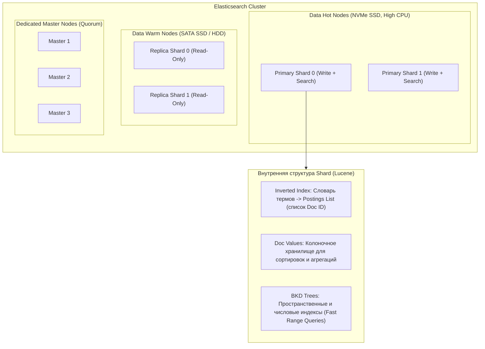

# 🌲 22. Стек ELK: Elasticsearch, Logstash, Kibana в Production

Стек **ELK** (Elasticsearch, Logstash, Kibana) — проверенный временем индустриальный стандарт для полнотекстового поиска, агрегации распределенных логов и глубокой аналитики данных в реальном времени.

---

## 🏛️ Внутренняя архитектура Elasticsearch и Apache Lucene

Elasticsearch построен поверх поискового движка **Apache Lucene**. Базовой единицей хранения является **Shard (шард)**, который физически представляет собой изолированный экземпляр Lucene Index.



### Формула маршрутизации документов по шардам
При записи документа Elasticsearch вычисляет целевой первичный шард по формуле:
$$\text{shard\_num} = \text{MurmurHash3}(\_routing) \pmod{\text{number\_of\_primary\_shards}}$$
> По умолчанию `_routing` равен `_id` документа. Поэтому количество первичных шардов индекса нельзя изменить на лету без переиндексации (`_reindex`).

---

## ⏳ Управление жизненным циклом индексов (ILM: Hot-Warm-Cold-Frozen)

Политика **Index Lifecycle Management (ILM)** автоматически перемещает индексы между ярусами нод по мере их старения, снижая затраты на инфраструктуру на 60-80%.


### Пример ILM-политики через Elasticsearch REST API

```json
PUT _ilm/policy/logs_production_policy
{
  "policy": {
    "phases": {
      "hot": {
        "actions": {
          "rollover": {
            "max_primary_shard_size": "50GB",
            "max_age": "7d",
            "max_docs": 100000000
          }
        }
      },
      "warm": {
        "min_age": "3d",
        "actions": {
          "forcemerge": {
            "max_num_segments": 1
          },
          "allocate": {
            "number_of_replicas": 1,
            "require": { "data_tier": "data_warm" }
          }
        }
      },
      "cold": {
        "min_age": "14d",
        "actions": {
          "allocate": {
            "number_of_replicas": 0,
            "require": { "data_tier": "data_cold" }
          }
        }
      },
      "delete": {
        "min_age": "90d",
        "actions": {
          "delete": {}
        }
      }
    }
  }
}
```

---

## 🧠 Настройка JVM Heap и сайзинг кластера

### Золотое правило памяти (The 31 GB Heap Rule)
1. **Не более 50% физической RAM:** Оставшиеся 50% оперативной памяти **обязаны** оставаться операционной системе под **OS Page Cache**, в котором Lucene кэширует сегменты и структуры инвертированного индекса.
2. **Лимит 31 GB (Compressed OOPs):** Никогда не выделяйте куче JVM больше `31 GB` (обычно `30g` или `31g`). При превышении порога ~32GB JVM отключает механизм сжатых указателей (Compressed Ordinary Object Pointers), и 64-битные указатели начинают потреблять в 1.5 раза больше памяти, снижая производительность.

```ini
# /etc/elasticsearch/jvm.options
-Xms30g
-Xmx30g
```

---

## ⚙️ Logstash: Конвейер обработки и парсинга логов

Logstash принимает потоки данных, выполняет мутацию и нормализацию и отправляет документы батчами в Elasticsearch.

```ruby
# /etc/logstash/conf.d/production_pipeline.conf
input {
  beats {
    port => 5044
    ssl  => true
    ssl_certificate => "/etc/logstash/certs/logstash.crt"
    ssl_key         => "/etc/logstash/certs/logstash.pkcs8.key"
  }
}

filter {
  # 1. Быстрый Dissect (в 3-5 раз быстрее тяжелого Grok)
  if [fields][log_type] == "nginx_access" {
    dissect {
      mapping => {
        "message" => '%{client_ip} - - [%{timestamp}] "%{method} %{uri} HTTP/%{http_version}" %{status} %{bytes_sent} "%{referrer}" "%{user_agent}" %{response_time}'
      }
    }

    # 2. Приведение типов данных
    mutate {
      convert => {
        "status"        => "integer"
        "bytes_sent"    => "integer"
        "response_time" => "float"
      }
      strip => ["method", "uri"]
    }

    # 3. Парсинг временной метки события
    date {
      match => [ "timestamp", "dd/MMM/yyyy:HH:mm:ss Z" ]
      target => "@timestamp"
      remove_field => [ "timestamp" ]
    }

    # 4. Гео-локация по IP
    geoip {
      source => "client_ip"
      target => "geo"
    }
  }
}

output {
  elasticsearch {
    hosts => ["https://es-node01:9200", "https://es-node02:9200"]
    ssl   => true
    ssl_certificate_verification => true
    cacert => "/etc/logstash/certs/ca.crt"
    user  => "logstash_internal"
    password => "${LOGSTASH_ES_PASSWORD}"
    
    # Использование Data Streams или ILM-индекса
    index => "logs-nginx-prod-%{+YYYY.MM.dd}"
  }
}
```

---

## 🛠️ CLI & REST API Cheat Sheet для Elasticsearch

```bash
# 1. Проверка общего здоровья кластера и распределения нод
curl -u elastic:password -k -s "https://localhost:9200/_cluster/health?pretty"

# 2. Просмотр всех шардов в статусе UNASSIGNED или INITIALIZING
curl -u elastic:password -k -s "https://localhost:9200/_cat/shards?v&h=index,shard,prirep,state,unassigned.reason" | grep -v STARTED

# 3. Выяснение причины, почему конкретный шард не может выделиться на ноду
curl -u elastic:password -k -s -X POST "https://localhost:9200/_cluster/allocation/explain?pretty" \
  -H 'Content-Type: application/json' -d'{"index": "logs-prod", "shard": 0, "primary": true}'

# 4. Топ-10 индексов по потреблению дискового пространства
curl -u elastic:password -k -s "https://localhost:9200/_cat/indices?v&s=pri.store.size:desc" | head -n 11

# 5. Принудительный сброс и объединение сегментов (Force Merge)
curl -u elastic:password -k -s -X POST "https://localhost:9200/logs-prod-2026.09.01/_forcemerge?max_num_segments=1"
```

---

## 🔧 Диагностика и разрешение проблем (Troubleshooting)

### Сценарий 1: Статус кластера RED (Cluster Red State)
- **Симптом:** `_cluster/health` возвращает `status: "red"`, часть запросов на чтение/запись падает.
- **Причина:** Один или несколько **первичных (primary) шардов** недоступны из-за падения ноды или повреждения файловой системы.
- **Диагностика:**
  ```bash
  curl -u elastic:password -k "https://localhost:9200/_cluster/allocation/explain?pretty"
  ```
- **Решение:**
  1. Восстановите упавшую ноду данных с оригинальным диском.
  2. Если диск потерян безвозвратно, разрешите принудительное назначение пустой копии primary (внимание: потеря данных в данном шарде!):
     ```json
     POST _cluster/reroute
     {
       "commands": [{
         "allocate_empty_primary": {
           "index": "logs-prod-2026.09.01", "shard": 0, "node": "es-node-02", "accept_data_loss": true
         }
       }]
     }
     ```

### Сценарий 2: Ошибка "Mapping Explosion" (Превышение лимита полей)
- **Симптом:** Elasticsearch отвергает документы с ошибкой `Limit of total fields [1000] has been exceeded`.
- **Причина:** В логи динамически попадают произвольные ключи (например, JSON с уникальными ID в именах ключей: `{"item_98124": "val"}`).
- **Решение:**
  1. Отключите динамический маппинг `dynamic: "false"` (или `strict`) в шаблоне индекса.
  2. Перенесите динамические пары в массив вложенных объектов: `[{"key": "item_id", "value": "98124"}]`.

---

## 🧠 Проверь себя

1. Почему Lucene Inverted Index не позволяет легко изменить количество первичных шардов уже созданного индекса?
2. Почему размер JVM Heap для Elasticsearch никогда не должен превышать 31-32 GB?
3. В чем разница между фазами Hot, Warm и Frozen в политике управления жизненным циклом (ILM)?
4. Какую роль играет OS Page Cache в обеспечении высокой скорости поисковых запросов в Elasticsearch?
5. Почему плагин `dissect` работает значительно производительнее `grok` в Logstash?
