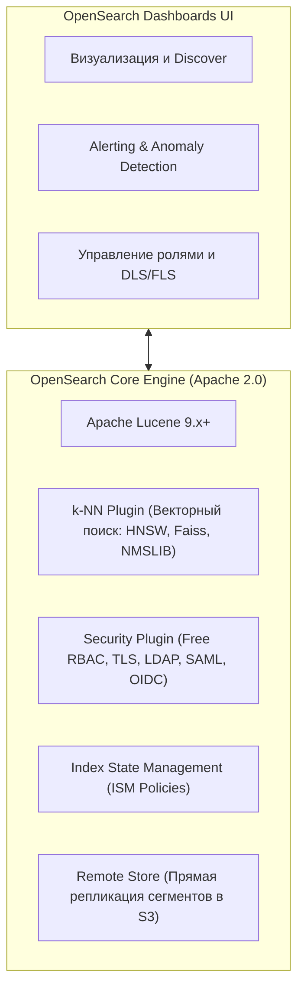
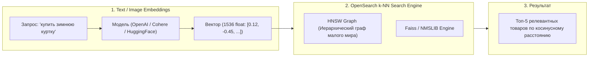

# 🔍 23. OpenSearch и OpenSearch Dashboards

**OpenSearch** — это полностью открытая (лицензия Apache 2.0) распределенная поисковая и аналитическая система, созданная на базе форка Elasticsearch 7.10.2 и Kibana. OpenSearch включает встроенные Enterprise-функции безопасности, векторный поиск (k-NN) и управление индексами (ISM) абсолютно бесплатно.

---

## 🏛️ Ключевые архитектурные отличия от Elasticsearch



### Сравнительный анализ OpenSearch и Elasticsearch 8.x

| Характеристика | OpenSearch 2.x+ | Elasticsearch 8.x |
| :--- | :--- | :--- |
| **Лицензия** | 🟢 Apache 2.0 (Полный Open Source) | 🔴 Elastic License 2.0 / SSPL (Проприетарная) |
| **Безопасность (TLS, RBAC, SAML)** | 🟢 Включено бесплатно из коробки | 🟡 Частично в бесплатной, SAML/OIDC в Platinum |
| **Векторный поиск (k-NN)** | 🟢 Встроенный (движки Faiss, NMSLIB, Lucene) | 🟢 Встроенный Lucene Vector Search |
| **Document/Field Level Security** | 🟢 Бесплатно (в Security Plugin) | 🔴 Требует платной подписки Enterprise |
| **Хранение сегментов в S3 (Remote Store)** | 🟢 Доступно в Open Source | 🔴 Searchable Snapshots только в платной версии |

---

## 🧠 Векторный поиск (k-NN Plugin): Архитектура и алгоритмы

OpenSearch позволяет строить системы семантического поиска и Retrieval-Augmented Generation (RAG) для LLM с помощью встроенного плагина k-NN.



### Пример создания векторного индекса и запроса сходства

```json
# 1. Создание индекса с векторным полем (Cosine Similarity)
PUT /product_vectors
{
  "settings": {
    "index.knn": true,
    "index.knn.space_type": "cosinesimil"
  },
  "mappings": {
    "properties": {
      "product_name": { "type": "text" },
      "category": { "type": "keyword" },
      "vector_embedding": {
        "type": "knn_vector",
        "dimension": 1536,
        "method": {
          "name": "hnsw",
          "engine": "faiss",
          "space_type": "cosinesimil",
          "parameters": {
            "ef_construction": 128,
            "m": 16
          }
        }
      }
    }
  }
}

# 2. Выполнение векторного поиска ближайших соседей
POST /product_vectors/_search
{
  "size": 5,
  "query": {
    "knn": {
      "vector_embedding": {
        "vector": [0.023, -0.142, 0.891, "...(1536 элементов)..."],
        "k": 5
      }
    }
  }
}
```

---

## 🛡️ Безопасность: Ролевая модель и DLS / FLS

Встроенный Security Plugin позволяет ограничивать доступ к данным на уровне отдельных полей (**Field-Level Security — FLS**) и строк (**Document-Level Security — DLS**).

```yaml
# /usr/share/opensearch/config/opensearch-security/roles.yml
finance_auditor_role:
  reserved: false
  cluster_permissions:
    - "cluster_composite_ops_ro"
  index_permissions:
    - index_patterns:
        - "transactions-*"
      allowed_actions:
        - "read"
        - "search"
      # Document Level Security: Пользователь видит только платежи своего региона
      dls: '{"term": {"region": "${user.attributes.region}"}}'
      # Field Level Security: Скрытие номеров карт и CVV
      fls:
        - "~card_cvv"
        - "~raw_card_number"
```

---

## ⏳ Управление индексами: Index State Management (ISM)

```json
# Применение ISM-политики
PUT _plugins/_ism/policies/logs_lifecycle
{
  "policy": {
    "description": "Автоматическая ротация и удаление логов",
    "default_state": "hot",
    "states": [
      {
        "name": "hot",
        "actions": [
          {
            "rollover": {
              "min_index_age": "3d",
              "min_primary_shard_size": "40gb"
            }
          }
        ],
        "transitions": [{ "state_name": "warm" }]
      },
      {
        "name": "warm",
        "actions": [
          { "read_only": {} },
          { "force_merge": { "max_num_segments": 1 } },
          { "replica_count": { "number_of_replicas": 1 } }
        ],
        "transitions": [
          {
            "state_name": "delete",
            "conditions": { "min_index_age": "30d" }
          }
        ]
      },
      {
        "name": "delete",
        "actions": [{ "delete": {} }],
        "transitions": []
      }
    ],
    "ism_template": {
      "index_patterns": ["app-logs-*"],
      "priority": 100
    }
  }
}
```

---

## ⚙️ Production Конфигурация: `opensearch.yml`

```yaml
cluster.name: opensearch-production
node.name: os-node-01
node.roles: [data, master, ingest]

network.host: 0.0.0.0
http.port: 9200
transport.port: 9300

# Кластеризация и Discovery
discovery.seed_hosts: ["10.0.1.10", "10.0.1.11", "10.0.1.12"]
cluster.initial_cluster_manager_nodes: ["os-node-01", "os-node-02", "os-node-03"]

# Настройки плагина безопасности
plugins.security.ssl.transport.pemcert_filepath: /usr/share/opensearch/config/certs/node.pem
plugins.security.ssl.transport.pemkey_filepath: /usr/share/opensearch/config/certs/node.key
plugins.security.ssl.transport.pemtrustedcas_filepath: /usr/share/opensearch/config/certs/root-ca.pem
plugins.security.ssl.transport.enforce_hostname_verification: false

plugins.security.ssl.http.enabled: true
plugins.security.ssl.http.pemcert_filepath: /usr/share/opensearch/config/certs/http.pem
plugins.security.ssl.http.pemkey_filepath: /usr/share/opensearch/config/certs/http.key
plugins.security.ssl.http.pemtrustedcas_filepath: /usr/share/opensearch/config/certs/root-ca.pem

plugins.security.authcz.admin_dn:
  - "CN=admin,OU=Ops,O=Corp,L=Stockholm,C=SE"

# Оптимизация поиска и кэширования
indices.queries.cache.size: "10%"
indices.fielddata.cache.size: "20%"
```

---

## 🔧 Диагностика и разрешение проблем (Troubleshooting)

### Сценарий 1: Ошибка инициализации плагина безопасности (Security Not Initialized)
- **Симптом:** OpenSearch отдает `OpenSearch Security not initialized`.
- **Причина:** Не выполнен запуск утилиты `securityadmin.sh` для первоначальной загрузки конфигураций безопасности в системный индекс `.opendistro_security`.
- **Решение:**
  ```bash
  /usr/share/opensearch/plugins/opensearch-security/tools/securityadmin.sh \
    -cd /usr/share/opensearch/config/opensearch-security/ \
    -icl -nhnv \
    -cacert /usr/share/opensearch/config/certs/root-ca.pem \
    -cert /usr/share/opensearch/config/certs/admin.pem \
    -key /usr/share/opensearch/config/certs/admin.key \
    -h localhost -p 9200
  ```

### Сценарий 2: k-NN поиск вызывает резкий скачок потребления памяти (Off-Heap RAM)
- **Симптом:** Процесс ноды завершается по Linux OOM Killer, хотя JVM Heap утилизирован всего на 40%.
- **Причина:** Графы HNSW плагина k-NN (библиотеки Faiss/NMSLIB) строятся в нативной памяти (Off-Heap Memory) за пределами JVM Heap.
- **Решение:**
  Ограничьте процент оперативной памяти для кэша векторных графов:
  ```json
  PUT _cluster/settings
  {
    "persistent": {
      "knn.memory.circuit_breaker.limit": "40%"
    }
  }
  ```

---

## 🧠 Проверь себя

1. Каковы ключевые отличия лицензирования OpenSearch от современных версий Elasticsearch?
2. Какие движки векторного поиска поддерживает плагин k-NN в OpenSearch?
3. В чем разница между Document-Level Security (DLS) и Field-Level Security (FLS)?
4. Как Index State Management (ISM) обеспечивает автоматическую смену состояний индексов?
5. Почему при использовании k-NN поиска необходимо внимательно контролировать потребление оперативной памяти за пределами JVM Heap?
