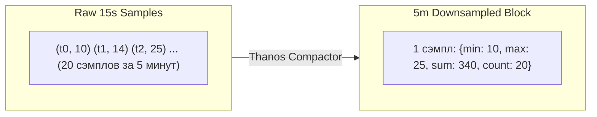

# 🪐 24. Thanos: Глобальное долгосрочное хранилище для Prometheus

**Thanos** — это распределенная система с открытым исходным кодом (CNCF Graduated проект), трансформирующая локальные инстансы Prometheus в глобально масштабируемое, отказоустойчивое хранилище метрик с неограниченной глубиной хранения в объектных хранилищах (S3, GCS, MinIO).

---

## 🏛️ Глобальная многокластерная архитектура Thanos

```mermaid
graph TD
    subgraph K8s_Cluster_1["Kubernetes Cluster 1 (EU-West)"]
        Prom1["Prometheus 1 (Primary)"]
        Prom2["Prometheus 2 (Replica)"]
        Sidecar1["Thanos Sidecar 1"]
        Sidecar2["Thanos Sidecar 2"]
        Prom1 --- Sidecar1
        Prom2 --- Sidecar2
    end

    subgraph K8s_Cluster_2["Kubernetes Cluster 2 (US-East)"]
        Prom3["Prometheus 3"]
        Sidecar3["Thanos Sidecar 3"]
        Prom3 --- Sidecar3
    end

    subgraph ObjectStorage["S3 / MinIO Object Storage (Unlimited Retention)"]
        S3Bucket[("Metrics TSDB Blocks (Raw, 5m, 1h Downsampled)")]
    end

    subgraph ThanosCore["Thanos Global Observability Layer"]
        StoreGW["Thanos Store Gateway (Index & Chunk Cache)"]
        Compactor["Thanos Compactor (Downsampling 5m/1h & Retention)"]
        Querier["Thanos Querier (Дедупликация рядов по replica-label)"]
        QFE["Thanos Query Frontend (Кэширование & Splitting)"]
        Ruler["Thanos Ruler (Глобальные Recording/Alerting Rules)"]
    end

    Sidecar1 -->|Upload 2h TSDB Blocks| S3Bucket
    Sidecar2 -->|Upload 2h TSDB Blocks| S3Bucket
    Sidecar3 -->|Upload 2h TSDB Blocks| S3Bucket

    StoreGW <--> S3Bucket
    Compactor <--> S3Bucket

    Sidecar1 -.->|gRPC StoreAPI (Live Data)| Querier
    Sidecar2 -.->|gRPC StoreAPI (Live Data)| Querier
    Sidecar3 -.->|gRPC StoreAPI (Live Data)| Querier
    StoreGW -->|gRPC StoreAPI (Historical Data)| Querier

    Querier --> QFE
    QFE --> Grafana["Grafana Global Dashboards"]
    Ruler --> Querier
```

---

## ⚙️ Глубокий разбор компонентов Thanos

### 1. Thanos Sidecar
- Развертывается в одном поде с Prometheus.
- **Upload:** Каждые 2 часа считывает закрытый неизменяемый блок TSDB с локального диска Prometheus и загружает его в S3.
- **StoreAPI:** Предоставляет интерфейс gRPC для Thanos Querier для чтения «горячих» данных за последние 2 часа прямо из оперативной памяти Prometheus.

### 2. Thanos Store Gateway
- Реализует StoreAPI поверх холодных блоков в S3.
- Чтобы не скачивать гигабайты TSDB-блоков при каждом запросе, Store Gateway кэширует заголовки индексов и использует **Index Cache** (In-Memory или Memcached/Redis) и **Chunk Cache**.

### 3. Thanos Compactor и Downsampling (Даунсэмплинг)
Compactor выполняет две жизненно важные задачи:
1. **Слияние (Compaction):** Объединяет множество мелких 2-часовых блоков в крупные (например, 2-недельные), оптимизируя размер индекса.
2. **Даунсэмплинг:** Снижает разрешение исторических данных для молниеносного рендеринга годовых графиков:
   - **Сырые данные (Raw):** Полная детализация (хранятся, например, 30 дней).
   - **5-минутное разрешение:** Доступно после 40 часов (хранится 180 дней).
   - **1-часовое разрешение:** Доступно после 10 дней (хранится неограниченно).



> [!CAUTION]
> `Thanos Compactor` обязан быть запущен **строго в единственном экземпляре (Singleton)** на один S3-бакет во избежание повреждения данных и гонок при записи!

### 4. Thanos Querier и дедупликация рядов
Thanos Querier объединяет потоки данных от сотен Sidecars и Store Gateways. Если Prometheus развернут в виде HA-пары (`prometheus-0` и `prometheus-1`), Querier удаляет дубликаты на лету на основе внешнего лейбла:

```bash
# Флаги запуска Thanos Querier
--query.replica-label="prometheus_replica"
--query.replica-label="replica"
```

---

## 📦 Production Конфигурация: `bucket.yml` и Kubernetes manifests

### Конфигурация подключения к Object Storage (`bucket.yml`)

```yaml
type: S3
config:
  bucket: thanos-production-metrics
  endpoint: minio.storage.svc:9000
  access_key: ${MINIO_ACCESS_KEY}
  secret_key: ${MINIO_SECRET_KEY}
  insecure: true
  signature_version2: false
  http_config:
    idle_conn_timeout: 90s
    response_header_timeout: 2m
    max_idle_conns: 100
    max_idle_conns_per_host: 100
```

### Настройки Prometheus для интеграции с Thanos

```yaml
# prometheus.yaml
global:
  scrape_interval: 15s
  external_labels:
    cluster: prod-eu-west-1
    prometheus_replica: $(POD_NAME) # prometheus-0 / prometheus-1

storage:
  tsdb:
    min_block_duration: 2h # Обязательно 2h для стабильной работы Sidecar
    max_block_duration: 2h
```

---

## 🛠️ CLI Cheat Sheet для управления Thanos

```bash
# 1. Проверка консистентности и целостности блоков в S3-бакете
thanos tools bucket inspect --objstore.config-file=bucket.yml

# 2. Поиск и исправление поврежденных блоков (Halted Compactor Fix)
thanos tools bucket verify --objstore.config-file=bucket.yml --repair

# 3. Принудительное удаление блоков старше срока хранения
thanos tools bucket retention --objstore.config-file=bucket.yml \
  --retention.resolution-raw=30d \
  --retention.resolution-5m=180d \
  --retention.resolution-1h=3y

# 4. Проверка доступности StoreAPI эндпоинтов в Querier
curl -s http://thanos-querier:10902/api/v1/stores | jq .
```

---

## 🔧 Диагностика и разрешение проблем (Troubleshooting)

### Сценарий 1: Thanos Compactor переходит в статус "Halted"
- **Симптом:** Поды Compactor падают с ошибкой `critical error: compaction failed: halt on error`.
- **Причина:** Обнаружено перекрытие временных блоков (Overlapping Blocks) из-за некорректно настроенных external labels в Prometheus или повторной загрузки.
- **Решение:**
  ```bash
  # 1. Найти перекрывающиеся ULID блоков
  thanos tools bucket verify --objstore.config-file=bucket.yml

  # 2. Удалить или переместить проблемный блок ULID вручную из S3
  thanos tools bucket delete --objstore.config-file=bucket.yml --id=<ULID_ID>
  ```

### Сценарий 2: Долгие запросы в Grafana при выборках за длительный период
- **Симптом:** Годовой график утилизации памяти загружается более 40 секунд.
- **Причина:** Grafana запрашивает данные с максимальным разрешением (Raw), минуя даунсэмплинг.
- **Решение:**
  В Thanos Datasource в Grafana в поле **Max Source Resolution** выберите значение `Auto` (или `1h`). Thanos Querier автоматически переключится на чтение предрассчитанных 1-часовых блоков из S3.

---

## 🧠 Проверь себя

1. Какую роль выполняет `Thanos Sidecar` и почему `min_block_duration` в Prometheus должен быть равен ровно 2 часам?
2. Как `Thanos Querier` производит дедупликацию метрик между двумя репликами одного HA Prometheus кластера?
3. Почему `Thanos Compactor` категорически запрещено запускать в нескольких репликах параллельно?
4. В чем заключается механизм Downsampling в Thanos и как он ускоряет выполнение годовых аналитических запросов?
5. Для чего нужен `Thanos Store Gateway`, если у нас уже есть `Thanos Sidecar`?
